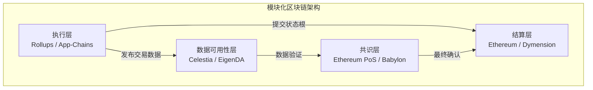
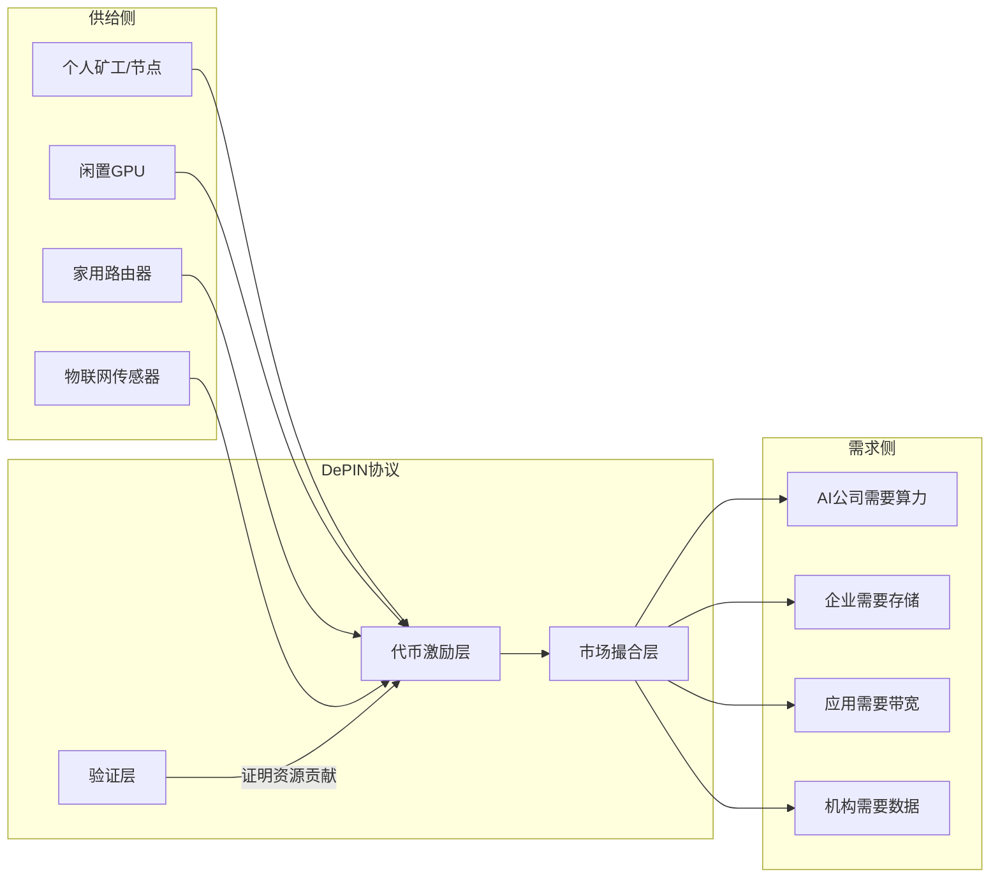
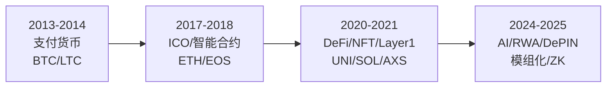

## 九、Web3行业发展趋势与展望

Web3行业正在经历从早期投机驱动向价值驱动的深刻转型。理解行业发展趋势，不仅帮助投资者把握方向性机会，更能帮助从业者、开发者和创业者在正确的赛道上布局。本章从技术演进、监管动向、应用场景、资本流向四个维度，系统梳理Web3行业的未来图景。

### 1. 技术基础设施的演进趋势

#### 1.1 模块化区块链架构

传统区块链将执行、共识、数据可用性、结算四大功能耦合在单层架构中，导致了"区块链不可能三角"（去中心化、安全性、可扩展性无法同时满足）。模块化区块链通过将这些功能分层解耦，让每一层专注于自己的核心职责，从而突破性能瓶颈。

**模块化架构的核心分层：**

| 层级 | 职责 | 代表项目 | 核心价值 |
|------|------|----------|----------|
| 执行层 | 处理交易和智能合约逻辑 | Arbitrum、Optimism、zkSync、StarkNet | 高吞吐、低费用 |
| 数据可用性层（DA） | 确保交易数据可被验证 | Celestia、EigenDA、Avail | 降低L2成本 |
| 共识层 | 达成网络状态一致 | Ethereum（PoS）、Babylon | 安全性保障 |
| 结算层 | 最终确认和争议解决 | Ethereum、Dymension | 资产最终性 |

**实际影响：** 以Ethereum的Dencun升级（2024年3月）引入EIP-4844（Proto-Danksharding）为例，L2的交易数据以"blob"形式提交到以太坊主网，而非calldata。这使得Arbitrum、Optimism等L2的Gas费下降了90%以上，从单笔交易$0.2-0.5降至$0.01-0.05。这不仅仅是量变——当交易成本降到足够低时，链上游戏、社交应用等高频场景才具备了可行性。

#### 1.2 零知识证明（ZK）技术的全面渗透

零知识证明正在从单纯的扩容工具演变为Web3的通用隐私和验证基础设施。

**ZK技术的三大应用方向：**

**方向一：ZK-Rollup扩容**

ZK-Rollup通过生成数学证明来验证L2交易的正确性，无需像Optimistic Rollup那样等待7天的挑战期。

- **zkSync Era**：2023年3月上线主网，支持Solidity智能合约的原生编译（通过LLVM编译器），已部署超过2000个DApp
- **StarkNet**：使用自研的Cairo语言和STARK证明系统，不需要可信设置（trusted setup），理论安全性更高
- **Polygon zkEVM**：完全兼容EVM字节码的ZK-Rollup，开发者可以零成本迁移现有合约
- **Scroll**：专注于zkEVM等效性，追求与以太坊执行层的完全一致

**方向二：ZK跨链验证**

ZK证明可以用来验证另一条链的共识状态，实现无需信任的跨链通信。Succinct Labs、Polymer等项目正在构建基于ZK的跨链消息传递协议。这将取代现有的多签桥（如Wormhole依赖的Guardian网络）和轻客户端桥，因为ZK桥既不依赖信任假设，也不需要同步全量区块头。

**方向三：ZK身份与隐私**

基于ZK的可验证凭证（Verifiable Credentials）允许用户证明自己满足某个条件（如"年龄>18岁"、"持有某个NFT"）而不泄露具体信息。以太坊联合创始人Vitalik Buterin提出的"SBT（灵魂绑定代币）+ ZK"组合，被认为是Web3身份系统的终极形态。

#### 1.3 账户抽象（Account Abstraction）

ERC-4337标志着以太坊从"EOA（外部账户）+ 合约账户"双轨制向统一账户模型的转变。账户抽象的核心价值在于降低Web3的使用门槛。

**账户抽象带来的关键体验改进：**

- **社交恢复**：丢失私钥后，通过预设的"守护人"（如3个可信联系人中的2个）恢复账户，无需记忆助记词
- **Gas费代付**：DApp可以替用户支付Gas费，或者允许用户用USDC/USDT等稳定币支付Gas，而非必须持有ETH
- **批量交易**：将"Approve + Swap"两步操作合并为一笔交易，减少确认次数
- **会话密钥**：为游戏等高频应用生成临时密钥，授权特定合约的有限操作，无需每笔交易都签名确认
- **定时支付/订阅**：实现链上的定期自动扣款，支撑SaaS类商业模式

**行业进展：** 截至2025年，StarkNet已原生支持账户抽象（所有账户都是合约账户），zkSync Era默认使用AA账户，以太坊主网的Pectra升级（EIP-7702）将进一步推动EOA账户向AA账户的过渡。

#### 1.4 跨链互操作性

多链并存已成定局，但"流动性碎片化"和"用户体验割裂"是当前最大的痛点。

**跨链技术的三代演进：**

| 代际 | 技术方案 | 信任模型 | 代表项目 | 安全性 |
|------|----------|----------|----------|--------|
| 第一代 | 多签桥 | 信任第三方验证者 | Multichain、Ronin Bridge | 低（多次被黑） |
| 第二代 | 轻客户端+中继 | 信任源链共识 | IBC（Cosmos）、LayerZero | 中 |
| 第三代 | ZK桥 | 信任数学 | Succinct、Polymer、=nil; | 高 |

**2024-2025年的关键趋势：**

- **意图（Intent）架构兴起**：用户声明"我想把ETH从以太坊转到Arbitrum上的USDC"，求解器（Solver）自动找到最优路径。UniswapX、Across Protocol、1inch Fusion都是意图架构的实践者
- **链抽象（Chain Abstraction）**：Particle Network、NEAR等项目致力于让用户完全感知不到底层是哪条链，钱包自动处理跨链逻辑
- **统一流动性层**：AggLayer（Polygon）、Superchain（OP Labs）等方案试图在L2之间共享流动性

### 2. 应用层的演进趋势

#### 2.1 真实世界资产代币化（RWA）

RWA被高盛、贝莱德、摩根大通等传统金融巨头视为区块链技术最有前途的应用方向。其核心逻辑是将链下资产（国债、房地产、私人信贷、大宗商品等）的所有权以代币形式映射到链上。

**RWA市场规模与增长：**

| 资产类别 | 2024年链上规模 | 代表项目 | 年化增速 |
|----------|---------------|----------|----------|
| 美国国债代币化 | ~$30亿 | BlackRock BUIDL、Franklin Templeton BENJI、Ondo Finance | 800%+ |
| 私人信贷 | ~$10亿 | Centrifuge、Maple Finance、Goldfinch | 100%+ |
| 房地产 | ~$3亿 | RealT、Lofty、Parcl | 200%+ |
| 大宗商品（黄金） | ~$10亿 | Paxos Gold (PAXG)、Tether Gold (XAUT) | 50%+ |

**RWA的核心价值主张：**

1. **效率提升**：传统私募基金的份额转让需要T+7结算和大量文书工作，代币化后可以实现T+0的7×24小时交易
2. **准入门槛降低**：美国国债ETF的最低投资金额可能需要数百美元，而代币化国债可以1美元起投
3. **透明度增强**：资产的链上持仓、收益分配、底层资产构成都可以实时审计
4. **可组合性**：代币化的国债可以作为DeFi借贷协议的抵押品，释放流动性

**风险与挑战：**

- 法律结构不清晰：代币持有者对底层资产的法律权利因司法管辖区而异
- 预言机依赖：链下资产的价格、状态需要预言机引入链上，增加了信任假设
- 流动性不足：大多数RWA代币的二级市场流动性远低于原生加密资产
- 对手方风险：RWA本质上引入了链下对手方，这与"无需信任"的加密叙事相矛盾

#### 2.2 DePIN（去中心化物理基础设施网络）

DePIN利用代币激励机制，引导个体贡献物理资源（存储、计算、带宽、传感器数据、能源等），构建去中心化的基础设施网络。

**DePIN的核心框架：**

**代表性DePIN项目分析：**

| 项目 | 资源类型 | 网络规模 | 代币经济 | 成熟度 |
|------|----------|----------|----------|--------|
| Filecoin | 分布式存储 | 全网存储容量超20 EiB | 区块奖励+交易费 | 成熟 |
| Helium | 无线网络（IoT/5G） | 超90万个热点 | HNT挖矿+数据信用 | 成熟 |
| Render Network | GPU渲染 | 数千个GPU节点 | RNTH代币支付 | 成长期 |
| Akash Network | 云计算 | 去中心化云计算市场 | AKT代币质押 | 成长期 |
| Hivemapper | 街景地图数据 | 超5万贡献者 | HONEY代币奖励 | 早期 |
| Grass | 网络带宽 | 超200万节点 | 数据集售卖分成 | 早期 |

**DePIN的飞轮效应与冷启动问题：**

DePIN的代币经济设计面临经典的"鸡生蛋"困境——没有足够的供给侧资源，需求方不会来；没有需求方付费，供给侧的代币激励不可持续。成功的DePIN项目通常遵循以下路径：

1. **阶段一：代币激励驱动供给**——用高APY吸引早期资源提供者，快速建立网络基础
2. **阶段二：低价策略吸引需求**——以低于中心化服务的价格吸引价格敏感的需求方
3. **阶段三：网络效应形成**——需求增长带来更多收入，支撑代币价值，进一步激励供给
4. **阶段四：代币激励衰减**——网络足够大后，降低代币通胀率，转向可持续的手续费模型

#### 2.3 AI与Web3的融合

AI与Web3的交叉是2024-2025年最热门的叙事之一，主要体现在以下几个方向：

**方向一：去中心化AI训练与推理**

大模型训练需要海量算力，而当前算力高度集中在少数云服务商手中。去中心化AI算力网络试图利用全球闲置GPU资源来降低训练成本。

- **Bittensor（TAO）**：构建了一个去中心化的机器学习网络，子网（Subnet）竞争性地提供AI服务，通过代币激励筛选最优模型
- **io.net**：聚合全球GPU资源，为AI公司提供分布式算力
- **Ritual**：构建AI推理的去中心化网络，让智能合约可以直接调用AI模型

**方向二：AI Agent的链上化**

AI Agent（自主AI代理）可以拥有自己的钱包，在链上自主执行交易、管理资产、参与治理。这是AI与Web3最自然的结合点。

- **Virtuals Protocol**：AI Agent的代币化平台，每个Agent有自己的代币和经济系统
- **ai16z（Eliza框架）**：开源的AI Agent框架，支持链上交互
- **GRIFFAIN、Hey Anon**：意图驱动的AI Agent，用户用自然语言描述需求，Agent自动执行链上操作

**方向三：数据市场与AI数据确权**

大模型训练需要高质量数据，而Web3可以为数据贡献者提供确权和收益分配机制。Ocean Protocol、Vana、Grass等项目都在探索这个方向。

#### 2.4 GameFi的范式转变

第一代GameFi（如Axie Infinity）的"Play-to-Earn"模型已经被证明不可持续——当新玩家增速放缓，代币通胀导致经济系统崩溃。行业正在向更健康的模型演进。

**GameFi经济模型的三代演进：**

| 代际 | 模型 | 核心逻辑 | 代表项目 | 问题 |
|------|------|----------|----------|------|
| 第一代 | Play-to-Earn | 游戏产出代币→出售获利 | Axie Infinity、StepN | 庞氏结构，不可持续 |
| 第二代 | Play-and-Own | 游戏资产NFT化→玩家真正拥有 | Illuvium、Star Atlas | 游戏性不足 |
| 第三代 | Play-to-Have-Fun | 先做好游戏，资产所有权为辅 | Off The Grid、Shrapnel | 正在验证中 |

**值得关注的趋势：**

- **3A级链游上线**：Parallel（TCG卡牌游戏）、Shrapnel（FPS射击游戏）等高品质游戏开始进入公测阶段
- **全链游戏（Fully On-Chain Game）**：游戏逻辑完全运行在区块链上，如Dark Forest、Lattice的OP Craft。虽然当前体验粗糙，但代表了"可验证游戏"的极端实验
- **游戏资产跨游戏复用**：将游戏内资产标准化，使其可以在不同游戏间流转，类似于"游戏资产的ERC-20时刻"

#### 2.5 SocialFi与去中心化社交

社交是Web3最难攻克但潜力最大的赛道。核心价值主张是：用户拥有自己的社交图谱和内容资产，平台无法随意封号或修改算法。

**SocialFi的探索路径：**

- **去中心化社交协议**：Farcaster（基于以太坊的社交协议，Warpcast客户端）、Lens Protocol（Aave团队打造的社交图谱协议）、Nostr（基于比特币的极简协议）
- **社交代币化**：Friend.tech将社交关系代币化（"Key"代表与某人的社交权限），虽然热度消退但开创了模式先例
- **去中心化内容平台**：Mirror（写作平台）、Paragraph（Newsletter平台）、Audius（音乐平台）

**SocialFi面临的根本挑战：**

社交网络的核心竞争力是网络效应——用户在哪里，其他用户就会去哪里。去中心化社交协议需要在体验上达到"足够好"的程度，才能吸引主流用户迁移。当前的主要障碍是：用户体验不如Web2、社交图谱迁移成本高、缺乏杀手级应用场景。

### 3. 监管与合规趋势

#### 3.1 全球监管格局

Web3监管正在从"灰色地带"走向"分类监管"。主要司法管辖区的政策方向如下：

| 地区 | 监管态度 | 关键政策 | 对行业的影响 |
|------|----------|----------|-------------|
| 美国 | 从执法驱动转向立法 | FIT21法案（数字资产分类）、SEC现货ETH ETF批准 | 合规路径逐渐清晰 |
| 欧盟 | 先行立法，统一框架 | MiCA法规（2024年12月全面生效） | 稳定币和交易所面临合规成本 |
| 香港 | 积极拥抱，持牌经营 | VASP牌照制度、现货BTC/ETH ETF | 亚洲合规中心定位 |
| 新加坡 | 审慎开放 | MAS支付服务法修正案 | 机构友好型监管 |
| 日本 | 规范化发展 | 修订资金结算法、DAO法律框架 | 明确的法律地位 |
| 阿联酋 | 激进吸引 | VARA虚拟资产监管局 | 加密友好型特区 |

**MiCA法规的关键影响：**

欧盟的《加密资产市场法规》（MiCA）是全球首个综合性加密资产监管框架。其核心要求包括：

1. **稳定币发行人**必须持有足额储备资产，定期接受审计，并获得电子货币机构（EMI）牌照
2. **加密资产服务商（CASP）**必须获得授权，满足资本金要求，并执行KYC/AML程序
3. **内幕交易和市场操纵**被明确列为违法行为，适用与传统金融相同的标准

MiCA的影响已经显现：Tether（USDT）因不满足储备透明度要求，在欧盟部分交易所被下架或限制交易。

#### 3.2 稳定币监管的全球竞赛

稳定币是Web3与传统金融的桥梁，也是监管最关注的细分领域。

**稳定币市场的格局变化：**

- **USDT（Tether）**仍以超过1000亿美元市值占据主导地位，但面临越来越大的合规压力
- **USDC（Circle）**受益于合规策略，在美国机构市场获得优势，Circle已于2025年IPO上市
- **DAI（MakerDAO/Sky）**转向RWA支持的混合模型，减少对加密资产抵押的依赖
- **新兴稳定币**：PayPal的PYUSD、First Digital的FDUSD等机构稳定币进入市场

#### 3.3 代币发行与证券属性界定

"某个代币是否构成证券"是Web3行业最核心的法律问题。美国SEC采用"Howey测试"来判断——如果一个投资合同满足"投入资金、投资于共同事业、期望从他人的努力中获利"三个条件，则可能被认定为证券。

**行业应对策略：**

- **去中心化发行**：通过充分去中心化使代币不再满足"依赖他人努力"的条件（BTC和ETH已被认定为非证券）
- **合规发行**：按照证券法要求进行注册或申请豁免（如Regulation D/S/A+）
- **治理代币设计**：将代币功能限定为治理投票权，避免包含利润分配预期

### 4. 资本与市场结构变化

#### 4.1 机构化趋势

2024年是Web3机构化的分水岭。美国SEC批准比特币现货ETF（2024年1月）和以太坊现货ETF（2024年7月），标志着传统金融对加密资产的正式接纳。

**机构化进程的关键里程碑：**

- **比特币现货ETF**：获批首日交易量超过$46亿，贝莱德IBIT在半年内管理规模超过$200亿
- **以太坊现货ETF**：打开了ETH作为机构配置资产的大门
- **代币化国债**：贝莱德BUIDL基金在以太坊上发行代币化国债产品
- **加密衍生品**：CME的比特币和以太坊期货未平仓合约创历史新高
- **银行入场**：摩根大通、高盛等开始为客户提供加密资产托管和交易服务

#### 4.2 风险投资的转向

2022-2023年加密VC投资大幅缩水后，2024-2025年呈现结构性变化：

**投资热点的迁移：**

| 时期 | 热门赛道 | 冷门赛道 | 投资逻辑 |
|------|----------|----------|----------|
| 2021年 | NFT、GameFi、Meme币 | 基础设施 | 叙事驱动、投机 |
| 2022-2023年 | 基础设施、L2 | NFT、GameFi | 熊市建设、技术驱动 |
| 2024-2025年 | AI+Crypto、RWA、DePIN | 纯Meme币、第一代GameFi | 商业模式验证、机构需求 |

**头部VC的布局方向：**

- a16z crypto：重点布局AI+Crypto、稳定币基础设施、零知识证明
- Paradigm：聚焦以太坊生态、意图架构、MEV研究
- Polychain：关注模块化区块链、ZK技术
- Dragonfly：跨链基础设施、亚洲市场项目

#### 4.3 代币经济学的进化

第一代代币经济学的核心问题是：代币的价值捕获机制不清晰，大量项目代币纯粹靠叙事和投机支撑价格。

**代币经济学的进化方向：**

1. **收入分享**：协议将部分收入分配给代币质押者（如GMX分配70%手续费给质押者）
2. **代币回购销毁**：用利润回购并销毁代币，减少流通供应（如BNB的季度销毁）
3. **veToken模型**：锁定代币获得治理权和收益加成（如Curve的veCRV模型）
4. **真实收益（Real Yield）**：代币收益来源于协议的真实收入，而非代币通胀

### 5. 叙事周期与市场心理

#### 5.1 加密市场的叙事轮动

Web3行业存在明显的叙事轮动周期。每个牛市周期都有主导叙事，资金围绕这些叙事聚集，形成泡沫，然后在熊市中回归基本面。

**历史叙事轮动：**

**识别叙事泡沫的方法：**

- **代币价格与使用量脱节**：如果一个项目代币市值数十亿美元但日活用户不到1000人，需警惕
- **VC解锁期集中**：大量VC持仓即将解锁的项目面临抛压
- **TVL注水**：部分项目的TVL（总锁仓价值）通过循环贷或代币激励人为膨胀
- **叙事过度超前**：某些技术方向的代币化程度远超实际落地进度

#### 5.2 比特币减半周期

比特币减半每四年发生一次，历史上与牛市周期高度相关（但相关性不等于因果性）：

| 减半时间 | 减半后一年涨幅 | 驱动因素 | 与传统市场的相关性 |
|----------|---------------|----------|-------------------|
| 2012年11月 | +8000% | 早期采用、Mt.Gox | 低 |
| 2016年7月 | +280% | ICO热潮、ETH生态 | 低 |
| 2020年5月 | +550% | DeFi Summer、机构入场、量化宽松 | 中 |
| 2024年4月 | 待观察 | ETF流入、AI叙事、减半供给冲击 | 高 |

**重要提醒：** 过去的规律不代表未来一定会重复。每一轮周期的参与者结构、宏观环境、监管态度都在变化。将减半周期作为投资策略的唯一依据是危险的。

### 6. Web3面临的根本性挑战

#### 6.1 可扩展性困境

尽管L2大幅提升了交易吞吐量，但Web3距离支撑十亿用户级别的应用仍有巨大差距。以太坊L2生态的碎片化（数十条L2各自为政）反而增加了用户的困惑和操作成本。

#### 6.2 用户体验鸿沟

Web3的用户体验（助记词管理、Gas费、跨链操作、交易确认等待）与Web2产品（一键登录、免费使用、即时响应）存在本质差距。账户抽象、链抽象、智能钱包是缩小差距的关键技术方向，但距离无缝体验仍有距离。

#### 6.3 安全性挑战

2022-2024年，Web3行业因黑客攻击、合约漏洞、钓鱼诈骗造成的损失累计超过数十亿美元。安全问题不仅是技术问题，更是信任问题——每一起重大安全事故都会推迟主流用户的采纳进程。

**常见安全风险与应对：**

| 风险类型 | 典型案例 | 损失规模 | 防范措施 |
|----------|----------|----------|----------|
| 桥接协议被黑 | Ronin Bridge（2022） | $6.25亿 | 使用ZK桥，分散跨链资产 |
| 智能合约漏洞 | Euler Finance（2023） | $1.97亿 | 多重审计，使用形式化验证 |
| 私钥泄露 | Atomic Wallet（2023） | $1亿 | 硬件钱包，MPC钱包 |
| 钓鱼攻击 | 各类钱包授权钓鱼 | 持续发生 | 限制授权额度，使用钱包插件检查 |
| 预言机操纵 | Mango Markets（2022） | $1.14亿 | 使用多源预言机，设置价格偏差阈值 |

#### 6.4 叙事与现实的落差

Web3行业存在一个根本性的张力：底层技术（密码学、分布式系统、博弈论）是真实的、有价值的，但很多上层应用和代币的估值远远超出了当前的实际价值。投资者需要区分"技术趋势"和"代币价格"——前者是长期确定的，后者是短期波动的。

### 7. 未来五年的关键预测

#### 7.1 高确定性趋势

这些趋势有强技术基础和明确的行业推动力，实现概率高：

1. **稳定币成为全球支付基础设施**：Visa、PayPal等已深度集成，跨境汇款和B2B支付是确定性场景
2. **RWA代币化规模突破千亿美元**：传统金融机构已全面入场，技术障碍已基本消除
3. **ZK成为区块链基础设施的标准组件**：从隐私到扩容到跨链，ZK的应用场景持续扩大
4. **Web3钱包体验趋近Web2**：账户抽象、智能钱包、Passkey集成将消除助记词的痛点
5. **比特币作为"数字黄金"的机构配置地位确立**：ETF通道打通后，比特币正在成为全球宏观配置的一部分

#### 7.2 中等确定性趋势

这些趋势有明确的技术方向和早期信号，但仍面临执行风险：

1. **AI Agent的链上经济系统**：AI Agent拥有钱包并自主执行链上交易，但经济模型尚未验证
2. **DePIN取代部分中心化基础设施**：在存储、计算等细分领域可行，但替代传统电信等重资产行业需要更长时间
3. **全链游戏走向主流**：技术上可行，但游戏品质和用户体验是瓶颈
4. **去中心化社交协议获得千万级用户**：Farcaster增长迅速，但网络效应的建立需要时间

#### 7.3 低确定性但高影响的远期愿景

这些方向如果实现，将根本性地改变互联网和金融的形态：

1. **区块链成为全球金融系统的结算层**：如果各国CBDC（央行数字货币）选择区块链作为底层
2. **去中心化AI与中心化AI形成竞争**：如果去中心化训练的效率和质量接近中心化方案
3. **数字主权身份取代平台账号**：如果用户真正拥有并控制自己的数字身份
4. **物理世界的大部分资产实现代币化**：如果法律框架支持资产的原生链上表示

### 8. 对不同参与者的策略建议

#### 8.1 投资者

- **核心配置（50-70%）**：BTC + ETH，把握行业beta收益
- **赛道配置（20-30%）**：选择2-3个高确定性赛道（如RWA、ZK、L2），投资头部项目
- **实验性配置（5-10%）**：高风险高回报的新叙事（AI Agent、DePIN、全链游戏）
- **持续学习**：Web3行业的技术迭代速度极快，每周至少花3-5小时阅读行业研报和代码更新

#### 8.2 开发者

- **学习ZK和账户抽象**：这是未来2-3年最有价值的技术栈
- **关注RWA和DeFi基础设施**：企业级需求创造高薪岗位
- **参与开源项目**：Web3的招聘高度依赖开源贡献和社区声誉
- **掌握跨链开发**：多链生态需要能够设计和实现跨链方案的工程师

#### 8.3 创业者

- **从真实需求出发**：不要为了用区块链而用区块链，找到区块链确实比中心化方案更优的场景
- **合规先行**：在监管收紧的趋势下，合规是护城河而非成本
- **关注B端市场**：RWA、机构DeFi、企业区块链的B端需求增长最快
- **轻代币、重产品**：先用产品证明价值，再设计代币经济模型

### 9. 常见误区与纠正

| 误区 | 真实情况 | 风险 |
|------|----------|------|
| "Web3会取代Web2" | Web3更可能与Web2共存，在特定场景（金融、数字资产、隐私）中补充Web2 | 期望过高导致失望 |
| "代币价格等于技术价值" | 代币价格受叙事、流动性、市场情绪等多重因素影响，与技术进展的相关性并不稳定 | 将投机误认为投资 |
| "区块链可以解决一切信任问题" | 区块链解决的是"链上数据"的信任，但"链下数据上链"的环节仍然需要信任 | 过度信任导致风控缺失 |
| "去中心化一定优于中心化" | 去中心化在某些场景下带来效率损失和协调成本，并非万能解 | 盲目去中心化浪费资源 |
| "牛市中人人赚钱" | 牛市中的杠杆、追高、频繁换仓等行为同样会导致亏损 | 高估自身能力 |
| "长期持有=长期投资" | 长期投资需要基于基本面分析的定期审视，而非盲目持有不看 | 混淆持有与投资 |
