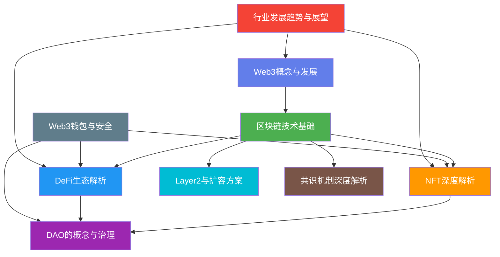
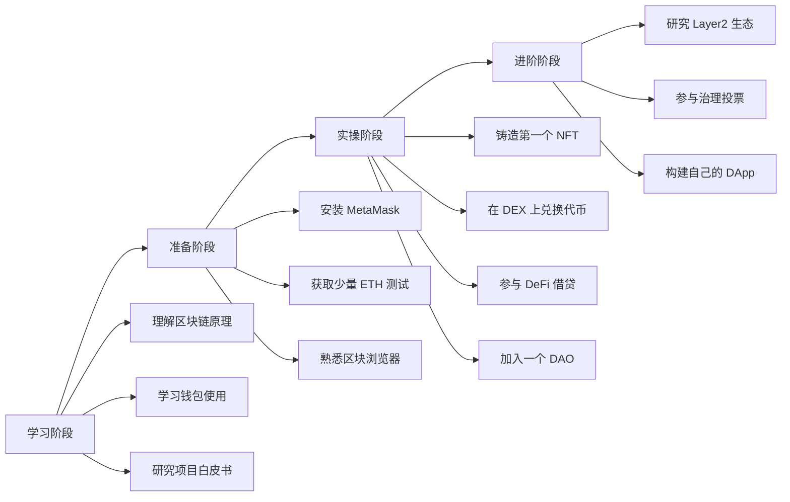

## 本节小结：Web3 理论基础全景回顾

### 一、本节知识图谱

本节围绕 Web3 世界的九个核心理论模块展开，从概念演进到底层技术，从资产形态到组织治理，从金融应用到安全防护，构建了一套完整的 Web3 认知框架。



---

### 二、九章核心要点速览

#### 1. Web3 的概念与发展——认知起点

Web3 不是技术名词，而是一场关于"谁拥有互联网"的范式转移。从 Web1 的"平台写、用户读"，到 Web2 的"用户写、平台拥有"，再到 Web3 的"用户写、用户拥有"，每一次跃迁都重新定义了价值分配方式。

**核心认知框架：**
- **去中心化**：数据不再存储在某个公司的服务器上，而是分布在成千上万个节点中，没有任何单一实体可以篡改或关停
- **用户主权**：你对自己的数字资产拥有完全控制权，通过私钥（而非平台账号）证明所有权
- **代币经济**：用代币将参与者的利益与网络发展绑定，贡献越多、持有越多、话语权越大

**Web1 → Web2 → Web3 演进对照：**

| 维度 | Web1（1990-2005） | Web2（2005-2020） | Web3（2020至今） |
|------|-------------------|-------------------|------------------|
| 用户角色 | 浏览者 | 创作者 | 所有者 |
| 数据归属 | 平台 | 平台 | 用户 |
| 价值分配 | 平台独享 | 平台拿大头 | 用户直接获益 |
| 信任基础 | 不需要 | 平台信用 | 密码学+共识 |
| 账户体系 | 注册制 | 注册制 | 钱包地址 |
| 代表应用 | 新浪、搜狐 | 微信、抖音 | Uniswap、OpenSea |

#### 2. 区块链技术基础——底层支柱

区块链是 Web3 的地基。它本质上是一个分布式账本：每一笔交易被打包成"区块"，按时间顺序链接成"链"，全网节点共同维护一份不可篡改的记录。

**技术架构四层模型：**

| 层级 | 功能 | 关键技术 |
|------|------|----------|
| 数据层 | 数据结构与存储 | 默克尔树、区块结构、哈希函数 |
| 网络层 | 节点通信与传播 | P2P 网络、Gossip 协议 |
| 共识层 | 全网达成一致 | PoW、PoS、DPoS、BFT |
| 应用层 | 面向用户的 DApp | 智能合约、DeFi、NFT |

**核心密码学原理：**
- **哈希函数（SHA-256）**：将任意长度数据压缩为 256 位指纹，输入微小变化导致输出完全不同，保证数据完整性
- **非对称加密**：公钥加密、私钥解密，或私钥签名、公钥验证，实现身份认证和交易授权
- **默克尔树**：将交易两两配对哈希，逐层向上生成根哈希，实现高效且安全的数据验证

#### 3. NFT 深度解析——数字资产新形态

NFT（Non-Fungible Token，非同质化代币）是区块链上独一无二的数字资产凭证。与比特币（每个都一样）不同，每个 NFT 都有独特的元数据，不可互换。

**NFT 与传统数字资产的本质区别：**

| 维度 | 传统数字资产 | NFT |
|------|-------------|-----|
| 所有权证明 | 平台数据库记录 | 区块链上链确权 |
| 可转让性 | 受平台限制 | 自由交易 |
| 稀缺性 | 平台可无限复制 | 智能合约控制供给 |
| 互操作性 | 仅限单一平台 | 跨平台流通 |
| 收益分配 | 创作者一次性收入 | 智能合约自动分润 |

**NFT 核心技术标准：**
- **ERC-721**：以太坊最早的 NFT 标准，每个代币独立 ID，适合独一无二的资产（如艺术品、域名）
- **ERC-1155**：多代币标准，一个合约可同时管理同质化和非同质化代币，大幅降低 Gas 费，适合游戏道具
- **ERC-2981**：版税标准，在链上定义创作者的二次销售分成比例，确保原创者持续获益

**NFT 应用场景矩阵：**

| 场景 | 典型案例 | 核心价值 |
|------|----------|----------|
| 数字艺术 | Beeple《Everydays》6900万美元 | 创作者直接面向收藏家，去除中间商 |
| PFP 头像 | Bored Ape Yacht Club | 社区身份认同+商业授权 |
| 游戏资产 | Axie Infinity 宠物 | Play-to-Earn，玩家真正拥有资产 |
| 虚拟地产 | Decentraland 地块 | 数字空间的稀缺性与使用权 |
| 音乐/视频 | Royal（音乐版税 NFT） | 粉丝可投资艺术家未来收入 |
| 身份凭证 | ENS 域名、SBT | 链上身份与声誉系统 |
| 实物映射 | 碳信用、房产证 | 将链下资产代币化 |

#### 4. DAO 的概念与治理——组织形态革命

DAO（Decentralized Autonomous Organization，去中心化自治组织）是建立在智能合约上的组织形式。规则写在代码里，决策通过投票完成，资金由多签钱包管理，没有 CEO，没有董事会。

**DAO 与传统组织的本质对比：**

| 维度 | 传统公司 | DAO |
|------|----------|-----|
| 决策机制 | 自上而下 | 代币持有者投票 |
| 规则载体 | 公司章程 | 智能合约 |
| 资金管理 | 财务部门 | 多签钱包/国库合约 |
| 透明度 | 季度财报 | 链上实时可查 |
| 参与门槛 | 雇佣关系 | 持有治理代币 |
| 全球化 | 需设立分支机构 | 天然全球性 |
| 修改规则 | 董事会决议 | 链上提案+投票 |

**DAO 治理机制核心要素：**
- **提案（Proposal）**：任何代币持有者可提交改变协议参数、分配资金、升级合约的建议
- **投票（Voting）**：通常按代币持仓量加权，一币一票；部分 DAO 引入二次投票（Quadratic Voting）防止巨鲸垄断
- **法定人数（Quorum）**：投票需达到最低参与率才有效，防止少数人操纵决策
- **时间锁（Timelock）**：通过的提案不会立即执行，通常有 24-48 小时延迟期，给社区反应时间

#### 5. DeFi 生态解析——去中心化金融

DeFi（Decentralized Finance）是用智能合约重建传统金融体系的运动。没有银行、没有券商、没有清算所——所有金融服务都由代码自动执行。

**DeFi 核心协议全景：**

| 协议类型 | 代表项目 | 解决的问题 | 运作原理 |
|----------|----------|-----------|----------|
| 去中心化交易所（DEX） | Uniswap、SushiSwap | 无需中介的代币交换 | 自动做市商（AMM），流动性池取代订单簿 |
| 借贷协议 | Aave、Compound | 无需信用审查的借贷 | 超额抵押+算法利率 |
| 稳定币 | DAI、USDC | 加密资产的价格锚定 | 超额抵押（DAI）或法币储备（USDC） |
| 收益聚合器 | Yearn Finance | 自动寻找最优收益 | 智能策略在各协议间自动迁移资金 |
| 衍生品 | dYdX、GMX | 杠杆交易和风险对冲 | 链上永续合约+预言机定价 |
| 保险 | Nexus Mutual | 智能合约风险保护 | 互助保险模式，成员共同承保 |

**AMM（自动做市商）核心公式：**

```text
x * y = k
```

其中 x 和 y 是流动性池中两种代币的数量，k 是常数。当用户用代币 A 兑换代币 B 时，池中 A 增多、B 减少，B 的价格自动上涨——无需撮合对手方，价格由数学公式决定。

#### 6. Web3 钱包与安全——资产守护第一线

钱包是进入 Web3 世界的钥匙。它不"存放"加密货币（资产永远在链上），而是保管你的私钥——谁拥有私钥，谁就拥有对应的资产。

**钱包类型对比：**

| 类型 | 代表产品 | 安全级别 | 便利性 | 适用场景 |
|------|----------|----------|--------|----------|
| 浏览器插件钱包 | MetaMask | 中 | 高 | 日常 DeFi 交互 |
| 手机钱包 | Trust Wallet、Rainbow | 中 | 高 | 移动端操作 |
| 硬件钱包 | Ledger、Trezor | 极高 | 低 | 大额资产长期存储 |
| 多签钱包 | Gnosis Safe | 极高 | 中 | DAO 国库、团队资金 |
| 智能合约钱包 | Argent、Safe | 高 | 中 | 社交恢复、限额交易 |

**常见安全威胁与防御：**

| 威胁类型 | 攻击手法 | 防御措施 |
|----------|----------|----------|
| 钓鱼攻击 | 伪造网站骗取签名 | 永远手动输入域名，检查 URL |
| 恶意授权 | 诱导签署无限额授权 | 使用 Revoke.cash 定期清理授权 |
| 助记词泄露 | 社工、木马、拍照 | 离线存储，不数字化，不分享 |
| 假代币/假 NFT | 空投诱饵代币 | 不交互不明资产，不点击空投链接 |
| 前端攻击 | DApp 前端被篡改 | 核对合约地址，多渠道验证 |
| Rug Pull | 项目方卷款跑路 | 审查合约、团队背景、流动性锁定 |

#### 7. Layer2 与扩容方案——突破性能瓶颈

以太坊主网（Layer1）每秒只能处理约 15-30 笔交易，Gas 费在高峰期可达数十美元。Layer2 是在主网之上构建的扩容方案，将大量计算和交易移到链下处理，只将最终结果提交回主网，继承主网的安全性。

**主流 Layer2 方案对比：**

| 方案 | 代表项目 | TPS | 安全模型 | 成本降低 | 适用场景 |
|------|----------|-----|----------|----------|----------|
| Optimistic Rollup | Optimism、Arbitrum | 2000+ | 欺诈证明 | 10-100倍 | 通用 DApp |
| ZK Rollup | zkSync、StarkNet | 3000+ | 零知识证明 | 100-1000倍 | 支付、交易、隐私 |
| 状态通道 | Lightning Network | 100万+ | 互锁合约 | 近乎零 | 高频小额支付 |
| 侧链 | Polygon PoS | 7000+ | 独立验证者 | 100倍+ | 对安全性要求较低的场景 |
| Plasma | 已逐渐被 Rollup 取代 | 1000+ | 欺诈证明 | 50倍 | 简单支付 |

**Optimistic Rollup vs ZK Rollup 核心差异：**

- **Optimistic Rollup**：默认假设交易有效，乐观接受。如果有人发现欺诈，可提交欺诈证明挑战。提款需等待约 7 天的挑战期。实现简单，EVM 兼容性好
- **ZK Rollup**：每批交易都附带零知识证明，链上直接验证证明的正确性。提款无需等待，安全性更高。但生成证明计算量大，EVM 兼容仍在攻克中

#### 8. 共识机制深度解析——信任的数学基础

共识机制是区块链的灵魂——它解决的是"在互不认识的节点之间，如何就交易顺序达成一致"这个根本问题。

**三大主流共识机制对比：**

| 维度 | PoW（工作量证明） | PoS（权益证明） | DPoS（委托权益证明） |
|------|-------------------|-----------------|---------------------|
| 代表链 | Bitcoin | Ethereum 2.0 | EOS、TRON |
| 出块方式 | 矿工算力竞争 | 验证者质押代币 | 代币持有者投票选出代表 |
| 能耗 | 极高（与小国用电量相当） | 极低（PoW 的 0.05%） | 极低 |
| 去中心化程度 | 高（但矿池集中化） | 中 | 低（超级节点有限） |
| 安全攻击成本 | 51% 算力 | 51% 质押量 | 贿赂 2/3 代表 |
| TPS | 7（Bitcoin） | 30-100 | 1000+ |
| 最终确认 | 约 60 分钟 | 约 15 分钟 | 约数秒 |

**拜占庭容错（BFT）原理简述：**

在分布式系统中，如果总节点数为 n，恶意节点数为 f，则当 n ≥ 3f + 1 时，系统仍能达成正确共识。这是区块链安全性的数学基础——不需要信任任何人，只需要信任"诚实节点占多数"这个统计假设。

#### 9. 行业发展趋势与展望——Web3 的未来

Web3 正处于从"概念验证"到"大规模应用"的关键转折期。理解趋势，才能把握机遇。

**六大核心趋势：**

| 趋势 | 内涵 | 关键信号 |
|------|------|----------|
| 模块化区块链 | 执行层、共识层、数据可用性层分离 | Celestia、EigenDA |
| 账户抽象（AA） | 钱包体验接近 Web2，用户无需理解私钥 | ERC-4337、智能钱包 |
| RWA 代币化 | 现实世界资产（国债、房产）上链 | BlackRock BUIDL 基金 |
| AI + Web3 | AI Agent 自主管理链上资产和交互 | 自主交易代理、AI 治理 |
| 链上身份（DID） | 去中心化身份+可验证凭证 | SBT、ENS、Worldcoin |
| 合规化 | 各国逐步建立加密资产监管框架 | MiCA（欧盟）、香港 VASP 牌照 |

---

### 三、核心概念关联矩阵

理解 Web3 各模块之间的关系，比孤立学习每个模块更重要：

| 概念 A | 概念 B | 关联方式 |
|--------|--------|----------|
| 区块链 | NFT | NFT 的铸造、交易、确权全部依赖区块链的不可篡改性 |
| 区块链 | DeFi | DeFi 协议部署在区块链上，智能合约自动执行金融逻辑 |
| NFT | DAO | NFT 持有者可组成收藏 DAO，共同管理和增值藏品 |
| DeFi | DAO | DeFi 协议的治理通常通过 DAO 实现（如 Uniswap DAO） |
| 钱包 | 所有模块 | 钱包是用户与所有 Web3 应用交互的唯一入口 |
| Layer2 | DeFi | Layer2 降低 DeFi 交易成本，使小额交易成为可能 |
| 共识机制 | 区块链 | 共识机制是区块链安全性的根基，决定了网络的信任模型 |
| 账户抽象 | 钱包 | AA 让钱包从"管理私钥"变为"管理账户"，大幅降低使用门槛 |

---

### 四、常见认知误区与纠正

#### 误区 1：Web3 = 加密货币投机

**纠正：** 加密货币只是 Web3 的一个应用。Web3 的核心是"用户拥有数据和资产"的互联网范式。NFT 数字艺术品、DAO 社区治理、DeFi 借贷服务都是 Web3 的应用场景，与投机无关。

#### 误区 2：区块链 = 慢且贵

**纠正：** 这是以太坊主网在高峰期的状态，不代表所有区块链。Layer2 方案已将交易成本降至几分钱，TPS 提升至数千。Solana 的 TPS 可达 65,000。技术在快速迭代，早期的性能瓶颈正在被系统性解决。

#### 误区 3：NFT 只是图片，右键保存就行

**纠正：** 右键保存的是图片文件，不是 NFT。NFT 的价值在于链上可验证的所有权证明。类比：你可以拍一张蒙娜丽莎的照片，但你并不拥有蒙娜丽莎。NFT 的版税机制（ERC-2981）还让创作者在每次转售中自动获益。

#### 误区 4：去中心化 = 没有任何管理

**纠正：** 去中心化是治理权的分散，不是管理的消失。DAO 有明确的提案-投票-执行流程，比传统公司的"一言堂"更透明、更民主。以太坊基金会、Uniswap Labs 等组织在去中心化生态中发挥着关键的协调作用。

#### 误区 5：私钥丢了就找客服重置

**纠正：** 这恰恰是 Web3 与 Web2 的核心区别。Web2 有"忘记密码"功能，因为平台掌握你的数据。Web3 没有客服，私钥丢失意味着资产永久丢失。这就是为什么安全存储助记词（离线、多地、不数字化）是 Web3 用户的第一课。

#### 误区 6：智能合约不会出错

**纠正：** 智能合约也是代码，代码就会有 Bug。The DAO 事件（2016年，损失 6000 万美元）、各种 DeFi 攻击都是惨痛教训。使用任何 DeFi 协议前，应检查其是否经过审计（如 CertiK、Trail of Bits），审计报告是否公开。

---

### 五、从理论到实践的行动路线



**新手入门建议：**

1. **先读白皮书，再看价格**——理解项目解决什么问题，比猜测币价更有价值
2. **用小资金试错**——在测试网（Goerli、Sepolia）上免费练习，熟练后再用真金白银
3. **备份助记词是第一件事**——在存入任何资产之前，确保助记词已安全离线备份
4. **警惕"高收益"承诺**——年化超过 20% 的 DeFi 收益需要极其谨慎地评估风险
5. **加入社区，但独立判断**——Discord、Twitter 是信息源，但永远 DYOR（Do Your Own Research）

---

### 六、本节关键术语速查

| 术语 | 英文 | 一句话解释 |
|------|------|-----------|
| 区块链 | Blockchain | 分布式、不可篡改的交易记录链 |
| 智能合约 | Smart Contract | 部署在链上的自动执行程序 |
| Gas | Gas | 执行链上操作所需支付的计算费用 |
| DeFi | Decentralized Finance | 用智能合约重建的金融服务体系 |
| NFT | Non-Fungible Token | 区块链上独一无二的资产凭证 |
| DAO | Decentralized Autonomous Organization | 基于智能合约的去中心化自治组织 |
| Layer2 | Layer 2 | 在主链之上构建的扩容方案 |
| 共识机制 | Consensus Mechanism | 分布式节点达成一致的规则 |
| 私钥 | Private Key | 控制链上资产的唯一凭证 |
| 助记词 | Seed Phrase | 私钥的人类可读备份形式 |
| AMM | Automated Market Maker | 基于数学公式的自动定价机制 |
| Rollup | Rollup | 将交易批量处理后提交回主链的扩容方案 |
| 零知识证明 | Zero-Knowledge Proof | 不透露信息本身即可证明信息正确性 |
| 账户抽象 | Account Abstraction | 让普通账户拥有智能合约钱包的功能 |
| RWA | Real World Assets | 将现实世界资产代币化上链 |

---

> **编者寄语：** Web3 理论基础不是为了让你成为密码学家或协议开发者，而是为了让你在面对具体项目和投资机会时，能看穿表象、理解底层逻辑。区块链技术仍在快速演进，今天的最优解可能是明天的历史遗留——但底层的密码学原理、博弈论设计、分布式系统思维是不变的。掌握这些"不变"，才能更好地应对"万变"。接下来的实战章节，我们将把这些理论知识转化为可操作的投资策略和风险管理方法。
