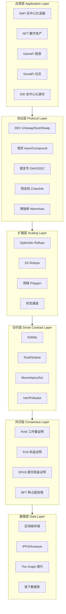
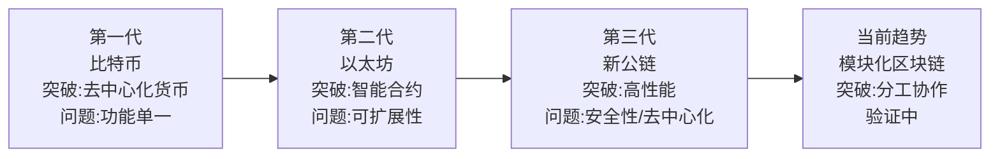
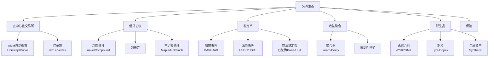
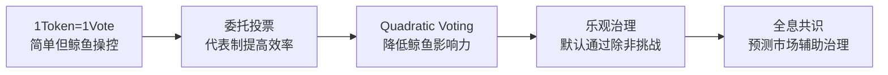
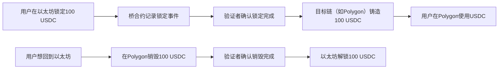
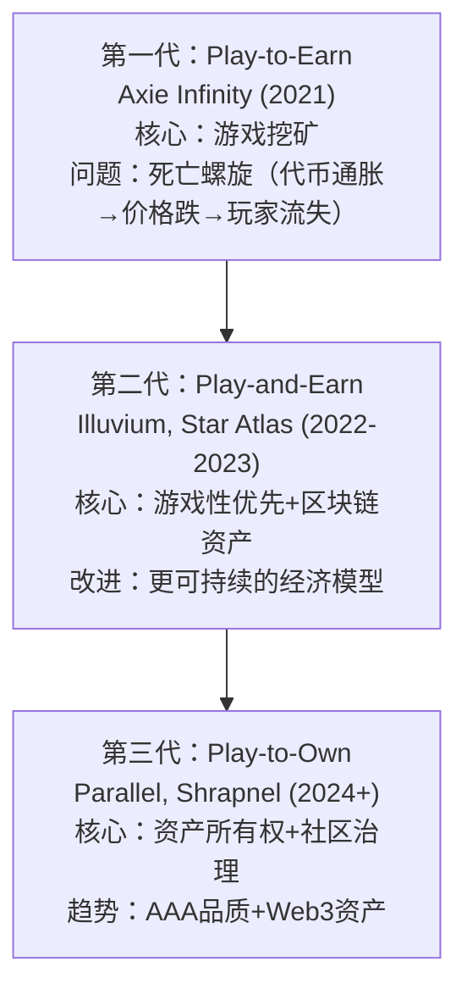

## 七、Web3生态深度解析

Web3不只是一个技术概念，而是一个由协议、资产、组织和应用构成的完整生态系统。理解这个生态需要一张"地图"——知道每个组件的位置、功能和相互关系，才能找到自己在这个新世界中的定位。本章将从技术栈底层到应用层顶层，从经济模型到治理机制，全面解剖Web3生态的每一个关键模块。

### 7.1 Web3技术栈全景

Web3的技术栈可以分为六层，每一层解决不同的问题，也对应不同的参与方式：



**各层核心职责：**

| 层级 | 解决的问题 | 代表项目 | 参与方式 |
|------|-----------|---------|---------|
| 应用层 | 用户直接使用的功能 | Uniswap、OpenSea、Axie Infinity | 使用产品、获取收益 |
| 协议层 | 通用金融原语和基础设施服务 | Aave、Chainlink、ENS | 提供流动性、质押 |
| 扩展层 | 交易速度和成本优化 | Arbitrum、Optimism、zkSync | 桥接资产、L2挖矿 |
| 合约层 | 可编程的业务逻辑 | EVM、Solana Runtime | 开发DApp、审计合约 |
| 共识层 | 网络安全和去中心化 | Ethereum PoS、Bitcoin PoW | 验证节点、质押 |
| 数据层 | 链上/链下数据存储与检索 | IPFS、The Graph、Arweave | 存储数据、运行索引节点 |

### 7.2 区块链技术演进路线

区块链技术经历了三代演进，每一代都解决了前一代的核心瓶颈：

**第一代——比特币（2009年）：**

比特币的目标明确而专注：创造一种不需要信任第三方的数字货币。中本聪在2008年金融危机后发布的白皮书《Bitcoin: A Peer-to-Peer Electronic Cash System》首次提出了区块链的概念。

- **核心功能**：去中心化的数字货币，点对点转账
- **共识机制**：工作量证明（PoW），矿工通过算力竞争获得记账权
- **智能合约**：不支持，脚本语言非图灵完备
- **TPS**：约7笔/秒，每个区块约10分钟
- **区块大小**：1MB（后通过SegWit扩展到约4MB等效）
- **历史意义**：证明了去中心化货币系统的可行性，催生了整个加密货币行业
- **局限性**：交易确认慢、能耗高（年耗电量约等于一个中等国家）、功能单一

**第二代——以太坊（2015年）：**

Vitalik Buterin在2013年提出以太坊构想，核心创新是将区块链从"数字货币"升级为"可编程平台"。智能合约让任何人都能在区块链上部署和运行程序，这打开了DeFi、NFT、DAO等整个生态的大门。

- **核心功能**：图灵完备的智能合约平台
- **共识演进**：2022年9月"The Merge"从PoW转向PoS，能耗降低约99.95%
- **编程语言**：Solidity（主要）、Vyper（次要）
- **虚拟机**：EVM（Ethereum Virtual Machine），已成为行业标准
- **TPS**：主网约15-30笔/秒（但通过L2可扩展到数千）
- **Gas费**：从几美元到数百美元不等（取决于网络拥堵程度）
- **生态规模**：超过50万份已部署智能合约，DeFi TVL峰值超过1800亿美元
- **局限性**：Gas费高、网络拥堵、可扩展性不足（已在通过L2方案逐步解决）

**第三代——新一代公链（2020年后）：**

第三代公链的核心诉求是"高性能+低成本"，但各自采用了不同的技术路线：

| 公链 | 共识机制 | TPS | 出块时间 | 特色 | 生态规模 |
|------|---------|-----|---------|------|---------|
| Solana | PoH+PoS | 65,000（理论） | 400ms | 历史证明机制，单片链高性能 | DeFi+NFT+Mobile |
| Avalanche | Snowball | 4,500 | <2秒 | 子网架构，可自定义区块链 | 企业级+DeFi |
| Polygon | PoS+ZK | 7,000 | 2秒 | 以太坊L2矩阵，ZK技术布局 | 最大L2生态 |
| Near | Nightshade | 100,000（理论） | 1秒 | 分片技术，账户模型 | AI+DeFi |
| Aptos | BFT | 160,000（理论） | <1秒 | Move语言，Meta团队背景 | 新兴生态 |
| Sui | Narwhal+Bullshark | 297,000（理论） | 0.5秒 | Move语言，对象模型 | 游戏+社交 |

**每一代的关键突破与遗留问题：**



**模块化区块链**是当前最重要的技术趋势。传统区块链（如以太坊1.0）是"单片式"的——一条链同时负责执行、共识、数据可用性和结算。模块化方案将这些职责拆分给不同的链/层：

- **执行层**：Arbitrum、Optimism、zkSync（负责交易执行）
- **数据可用性层**：Celestia、EigenDA（负责数据存储和可用性）
- **共识层**：以太坊（负责最终确认）
- **结算层**：以太坊（负责争议解决）

这种分工让每个层都能专注于优化自己的功能，从而实现整体性能的大幅提升。

### 7.3 代币经济学深度分析

代币经济学（Tokenomics）是Web3项目的"经济宪法"，决定了一个项目的长期价值和可持续性。理解代币经济学是评估任何Web3项目的必备技能。

#### 7.3.1 代币的价值来源

**1. 实用性价值（Utility）**

实用性是代币最基础也最稳定的价值来源。代币在生态系统中的实际功能包括：

- **Gas费支付**：以太坊上的每一笔交易、每一次合约调用都需要用ETH支付Gas费。这是ETH最基本的需求来源，网络使用量越大，ETH的需求越高。
- **治理投票**：UNI持有者可以对Uniswap协议的参数（如手续费比例）进行投票；AAVE持有者可以决定借贷协议的风险参数。
- **平台权益**：BNB持有者在Binance交易时可享受手续费折扣；CRV持有者可以投票决定Curve协议的流动性激励分配。
- **质押收益**：ETH质押者可以获得约3-5%的年化收益，同时帮助维护网络安全。
- **访问权限**：某些代币是进入特定平台或服务的"门票"。

**2. 治理价值（Governance）**

治理权的价值取决于协议的规模和重要性：

- **提案投票权**：决定协议的发展方向
- **参数调整权**：如调整借贷利率、交易手续费
- **资金分配权**：如Treasury的使用、生态基金的分配
- **协议升级决策**：是否部署新版本、是否支持新功能

当一个DeFi协议锁定了数十亿美元的资产时，治理权的价值就非常可观。例如，Curve的veCRV治理权之争（所谓的"Curve Wars"）导致多个协议争夺CRV投票权，因为这决定了哪些交易对能获得更高的流动性激励。

**3. 投机价值（Speculation）**

投机价值是双刃剑——它能带来短期价格暴涨，也能导致暴跌：

- **叙事驱动**：每个牛市周期都有主导叙事（2020年DeFi Summer、2021年NFT、2023年AI+Crypto）
- **FOMO效应**：害怕错过导致追高
- **流动性溢价**：交易量大的代币通常有更高的估值
- **市场情绪**：比特币减半周期、宏观政策（如美联储加息/降息）

#### 7.3.2 代币分配模型

一个健康的代币分配需要平衡各方利益，避免任何一方持有过多话语权：

**标准分配模型：**

| 分配对象 | 比例范围 | 锁仓要求 | 解锁方式 | 风险点 |
|---------|---------|---------|---------|--------|
| 社区/生态激励 | 30-50% | 无或按里程碑 | 线性释放或按活动 | 过快释放导致抛压 |
| 团队和顾问 | 15-20% | 1年锁定+2-4年线性解锁 | 按月/季度解锁 | 团队跑路、解锁抛压 |
| 投资者（VC） | 15-25% | 6-12个月锁定+1-3年线性 | 按月/季度解锁 | VC抛售压力 |
| 国库/储备 | 10-20% | 由DAO治理决定 | 按需使用 | 治理攻击导致资金滥用 |
| 公开发售 | 5-15% | 通常无锁仓 | 立即可交易 | 早期投资者抛售 |

**代币分配的健康度评估清单：**

```text
✓ 团队份额不超过20%
✓ 团队和VC有明确的锁仓时间表
✓ 社区激励占比最大（>30%）
✓ 公售比例合理（5-15%）
✓ 有明确的代币销毁或回购机制
✓ 代币释放速度与项目发展阶段匹配
✓ 通缩/通胀机制透明且合理
✗ 团队持有>30% = 高风险
✗ 无锁仓计划 = 极高风险
✗ 仅靠增发激励 = 通胀螺旋
```

#### 7.3.3 代币释放与解锁风险

代币解锁是影响价格的重大事件。大量代币集中解锁会形成显著抛压，尤其在市场情绪低迷时更为明显。

**解锁风险分析要点：**

1. **查看解锁日历**：使用Token Unlocks（token.unlocks.app）或CryptoRank等工具查看即将到来的大额解锁事件
2. **计算抛压比例**：单次解锁量占日均交易量的比例。如果解锁量超过日均交易量的10%，价格压力显著
3. **评估持有者行为**：历史数据显示，VC在解锁后通常会在60天内卖出30-50%的持仓
4. **关注市场环境**：牛市中解锁冲击较小（新资金承接），熊市中冲击放大
5. **线性vs一次性**：线性解锁（每天释放少量）的冲击远小于一次性大额解锁

**案例分析：Solana（SOL）的代币解锁**

Solana在2020-2021年期间有大量投资者和团队代币解锁，但受益于DeFi和NFT生态爆发带来的需求增长，消化了大部分抛压。2022年FTX暴雷后，FTX持有的约5800万枚SOL面临清算风险，导致SOL价格暴跌。这个案例说明：代币解锁风险不仅取决于数量，还取决于持有者的情况和市场环境。

#### 7.3.4 代币模型创新

**veToken模型（投票托管代币）：**

Curve Finance首创的veCRV模型是最成功的代币经济学创新之一。核心机制：用户锁定CRV获得veCRV，锁仓时间越长（最长4年），获得的veCRV越多。veCRV持有者可以：
- 获得交易手续费分成
- 投票决定哪些交易对获得CRV激励
- 获得Boost（流动性挖矿收益倍增）

这个模型创造了"Curve Wars"——多个协议（如Convex、Yearn）争夺CRV控制权，因为它直接决定了数十亿美元流动性激励的流向。

**双代币模型：**

一些项目采用双代币设计，分离治理权和实用功能：
- **AXS（Axie Infinity）**：治理代币，可用于质押和投票
- **SLP（Smooth Love Potion）**：游戏内奖励代币，用于繁殖Axie

这种设计的好处是：治理代币保持稀缺性（价值存储），功能代币保持流动性（日常使用）。风险是功能代币可能因通胀而持续贬值。

**代币销毁与回购：**

- **以太坊EIP-1559**：每笔交易的基础Gas费被销毁，自2021年8月以来已销毁超过400万枚ETH
- **BNB销毁**：币安每季度用利润回购并销毁BNB，目标是将总量从2亿减少到1亿
- **效果评估**：销毁机制在使用量大时有效（通缩），在网络低迷时效果有限

### 7.4 DeFi生态全景

DeFi（去中心化金融）是Web3最具实际价值的应用场景，它用智能合约替代了传统金融中的中介——银行、券商、保险公司的核心功能。

#### 7.4.1 DeFi核心赛道



#### 7.4.2 关键DeFi机制解析

**自动做市商（AMM）：**

传统交易所使用订单簿——买方和卖方各自挂单，交易所撮合成交。AMM彻底改变了这个模型：流动性提供者将代币对存入池子，交易者直接与池子交易，价格由公式自动计算。

Uniswap V2使用的恒定乘积公式：`x * y = k`

- x和y是池中两种代币的数量
- k是一个常数
- 当交易者用代币A购买代币B时，池中A增加、B减少，B的价格自动上升

Uniswap V3引入了"集中流动性"——流动性提供者可以选择在特定价格范围内提供流动性，大幅提高资金效率。但这也增加了管理复杂度：如果价格移出你设定的范围，你将不再赚取手续费。

**超额抵押借贷：**

Aave和Compound是最大的去中心化借贷协议。核心逻辑：

```text
用户A存入100 ETH作为抵押品（价值$300,000）
↓
用户A可以借出最多75%价值的资产（$225,000）
↓
如果ETH价格下跌导致抵押率低于清算线（如150%）
↓
清算人偿还部分债务并获得折扣抵押品
↓
用户A保留剩余抵押品
```

关键参数：
- **抵押率（LTV）**：可借出的比例，ETH通常为75%
- **清算阈值**：触发清算的最低抵押率，通常为80-85%
- **清算惩罚**：通常为5-10%，作为对清算人的激励
- **利率模型**：根据利用率动态调整，利用率越高利率越高

**闪电贷（Flash Loan）：**

DeFi独有的创新——在同一笔交易内借出并归还资金，无需抵押。用途包括：
- **套利**：在不同DEX之间利用价差获利
- **清算**：用借来的资金清算别人的仓位
- **债务置换**：将一个协议的债务转移到另一个利率更低的协议

闪电贷也暴露了DeFi的风险：攻击者可以利用闪电贷进行价格操纵攻击，如2020年bZx被攻击损失数百万美元。

#### 7.4.3 DeFi关键指标

评估DeFi项目和整个市场健康度的核心指标：

| 指标 | 含义 | 查询工具 | 健康范围 |
|------|------|---------|---------|
| TVL（总锁仓量） | 协议中锁定的资产总价值 | DefiLlama | 因协议而异 |
| TVL/市值比 | 锁仓量与代币市值的比值 | DefiLlama | >1通常被低估 |
| 交易量/TVL比 | 资金使用效率 | DefiLlama | 越高说明效率越好 |
| 收入（Revenue） | 协议实际收取的费用 | Token Terminal | 持续增长为佳 |
| P/S比（价格/销售额） | 代币市值/年化收入 | Token Terminal | <30相对合理 |
| 用户数 | 独立地址数 | Dune Analytics | 持续增长为佳 |
| 资金利用率 | 借出资金/总存款 | 协议官网 | 70-85%为健康区间 |

### 7.5 NFT生态深度解析

#### 7.5.1 NFT的核心价值属性

NFT（Non-Fungible Token，非同质化代币）的本质是一种链上所有权证明。与比特币或ETH（每枚都一样，可以互换）不同，每个NFT都是独一无二的。

**六大核心属性：**

1. **稀缺性**：通过智能合约设定发行总量，不可增发。CryptoPunks总量仅10,000个，这种硬性稀缺是价值的基础。
2. **所有权**：链上确权，不可篡改。任何人无法夺走你钱包中的NFT，除非你主动授权或私钥被盗。
3. **可验证性**：任何人都可以通过区块浏览器查看NFT的铸造记录、交易历史、持有者信息。
4. **可编程性**：智能合约赋予NFT超越传统资产的功能——自动分润、动态更新、游戏内集成。
5. **互操作性**：理论上NFT可以在任何支持该标准的平台上使用（实际中仍有兼容性问题）。
6. **版税机制**：创作者可以在智能合约中设定二级市场交易版税（通常5-10%），每次转手都自动获得收益。

#### 7.5.2 NFT应用场景矩阵

NFT远不止"头像图片"，其应用场景正在快速扩展：

| 场景 | 代表项目 | 价值来源 | 典型价格区间 | 成熟度 |
|------|---------|---------|-------------|--------|
| PFP头像 | CryptoPunks、BAYC、Azuki | 社区归属感、身份象征 | $100-$1M+ | 高 |
| 数字艺术 | Art Blocks、Beeple | 审美价值、收藏价值 | $10-$10M+ | 高 |
| 游戏资产 | Axie Infinity、Illuvium | 游戏内实用价值 | $1-$10,000 | 中 |
| 虚拟地产 | Decentraland、Otherside | 虚拟空间使用价值 | $100-$100,000+ | 中 |
| 音乐NFT | Sound.xyz、Royal | 版税收益权 | $10-$10,000 | 低-中 |
| 域名 | ENS (.eth) | 去中心化身份 | $5-$100,000+ | 高 |
| 票务 | GET Protocol | 活动入场凭证 | $10-$1,000 | 低 |
| 实物映射 | Courtyard、4K | 实物资产所有权证明 | 因实物而异 | 低 |
| 会员凭证 | PROOF Collective | 专属权益访问权 | $100-$10,000+ | 中 |

#### 7.5.3 NFT价值评估框架

评估一个NFT项目的价值需要多维度考量：

```text
NFT综合价值 = 艺术价值(20%) + 社区价值(30%) + 实用价值(20%) + 稀缺价值(15%) + 叙事价值(15%)
```

**艺术价值（权重20%）：**
- 创作者知名度和过往作品表现
- 作品的美学水平和辨识度
- 创作难度和技术创新（如生成艺术的算法复杂度）
- 是否有开创性或代表性意义

**社区价值（权重30%）——NFT价值的最大驱动因素：**
- Discord/Twitter社区规模和活跃度（真实互动，非机器人）
- 持有者质量（是否有知名人士、KOL持有）
- 社区文化和认同感（是否有共同的价值观和行为准则）
- 社区产出（持有者自发创作的内容、衍生项目）
- 持有率（非挂单比例）——低于5%为危险信号

**实用价值（权重20%）：**
- 是否有游戏内使用价值
- 是否能获得空投或权益（如BAYC持有者获得Mutant Ape空投）
- 是否有线下活动权益（如专属派对、展览）
- 是否可用于DeFi（如NFTfi抵押借贷）

**稀缺价值（权重15%）：**
- 发行总量（通常1,000-10,000个）
- 稀有度分布（是否有多层次的稀有度等级）
- 历史交易频率和价格趋势
- 底价（Floor Price）走势

**叙事价值（权重15%）：**
- 项目愿景和路线图的可信度
- 品牌合作和跨界联名
- 文化影响力和传播力
- 是否代表了某个时代的精神或审美

**红旗信号（Red Flags）：**

```text
✗ 匿名团队 + 无过往作品 + 过度承诺 = 高概率跑路
✗ 仅靠"即将揭晓"的路线图驱动，无实际产品
✗ 社区以讨论价格为主，缺乏文化/创作讨论
✗ 大量机器人互动（Discord刷消息、Twitter刷点赞）
✗ 持有者集中度过高（前10地址持有>30%供应量）
✗ 二级市场版税设置为0%（创作者可能无长期投入动力）
✗ 团队频繁修改路线图或推迟交付
```

### 7.6 DAO生态全景

#### 7.6.1 DAO的分类与治理模式

DAO（Decentralized Autonomous Organization）是Web3的组织形式创新。它用智能合约和代币投票替代了传统的公司治理结构。

**DAO的主要类型：**

| 类型 | 代表项目 | 治理目标 | 资金规模 |
|------|---------|---------|---------|
| 协议DAO | Uniswap、Aave、Compound | 管理DeFi协议参数 | $1B+ |
| 投资DAO | The LAO、MetaCartel | 集体投资决策 | $10M-$500M |
| 收藏DAO | PleasrDAO、Flamingo | 集体收藏NFT | $50M-$500M |
| 社交DAO | Friends with Benefits、Cabin | 社区身份和社交 | $1M-$50M |
| 服务DAO | Raid Guild、LexDAO | 提供专业服务 | $1M-$10M |
| 媒体DAO | BanklessDAO、Mirror | 内容创作和分发 | $1M-$10M |
| 资助DAO | Gitcoin、Moloch | 资助公共物品 | $10M-$100M |

**治理机制演进：**



- **1Token=1Vote**：最简单的形式，但大持有者（"鲸鱼"）可以主导投票结果
- **委托投票**：持币者可以将投票权委托给信任的代表，提高参与效率
- **Quadratic Voting**：投票成本与票数的平方成正比，100票需要10000成本，大幅降低鲸鱼影响力
- **乐观治理**：提案默认通过，除非在挑战期内有人提出异议并获得足够支持

### 7.7 Web3基础设施生态

Web3的基础设施层是整个生态的"水电煤"——用户很少直接感知，但没有它们整个系统无法运行。

#### 7.7.1 预言机（Oracle）

区块链本身无法获取链外数据（如ETH价格、天气、体育比分）。预言机就是连接链上和链外的桥梁。

**Chainlink**是最大的去中心化预言机网络：
- 价格馈送（Price Feeds）：为DeFi协议提供实时价格数据，保护超过$750亿TVL
- VRF（可验证随机函数）：为NFT铸造、链游提供可验证的随机数
- Automation（自动化）：定时触发智能合约执行
- CCIP（跨链互操作协议）：跨链消息和代币传输

**其他预言机方案：**
- **Pyth Network**：专为高频交易设计，延迟更低
- **Band Protocol**：跨链预言机，Cosmos生态
- **API3**：第一方预言机，数据提供者直接运行节点

#### 7.7.2 去中心化存储

链上存储数据极其昂贵（以太坊上存储1KB数据约需数百美元），因此大量数据需要存储在链下。

| 存储方案 | 特点 | 适用场景 | 成本 |
|---------|------|---------|------|
| IPFS | 内容寻址、去中心化、需Pin服务持久化 | NFT元数据、DApp前端 | 低 |
| Arweave | 一次性付费永久存储 | NFT图片、重要文档 | 中 |
| Filecoin | IPFS的激励层，存储市场 | 大规模数据存储 | 低-中 |
| Ceramic | 动态去中心化数据 | 用户配置、社交数据 | 低 |
| AWS S3（中心化） | 便宜快速但中心化 | 非关键数据 | 最低 |

**为什么去中心化存储很重要？** 如果NFT的图片存储在某个公司的服务器上，服务器关闭时图片就消失了——你的NFT将变成一个指向空地址的链接。2022年多个NFT项目因为使用中心化存储导致图片丢失，引发了行业对"链上永续性"的深度讨论。

#### 7.7.3 数据索引

区块链上的数据是原始的交易记录，直接查询非常低效。The Graph是Web3的数据索引协议，类似于区块链世界的"Google"。

- **子图（Subgraph）**：开发者定义如何索引和组织链上数据
- **GraphQL查询**：用户可以用类似SQL的方式查询链上数据
- **去中心化网络**：由索引者、策展人和委托人共同维护
- **应用场景**：DEX交易历史、NFT持有记录、DeFi仓位查询

#### 7.7.4 跨链技术

随着多链生态的发展，资产和信息需要在不同区块链之间流动：

**跨链桥的工作原理：**



**跨链桥风险：** 跨链桥是Web3安全事故的重灾区。2022年Ronin Bridge被盗6.25亿美元，Wormhole被盗3.2亿美元，Nomad被盗1.9亿美元。核心风险在于：跨链桥合约通常持有大量资产，成为黑客的高价值目标。

**更安全的跨链方案：**
- **原生桥**：如Arbitrum官方桥，安全性等同于底层链
- **消息协议**：Chainlink CCIP、LayerZero，传递消息而非锁定资产
- **原子交换**：通过哈希时间锁实现无需信任的跨链交换

### 7.8 钱包与去中心化身份

#### 7.8.1 钱包类型

钱包是用户与Web3交互的入口。理解不同类型钱包的安全模型至关重要：

| 类型 | 代表产品 | 私钥存储 | 安全等级 | 便利性 | 适用场景 |
|------|---------|---------|---------|--------|---------|
| 浏览器插件钱包 | MetaMask、Rabby | 本地浏览器 | 中 | 高 | 日常交互 |
| 移动钱包 | Trust Wallet、Rainbow | 手机安全区 | 中 | 高 | 移动端DeFi |
| 硬件钱包 | Ledger、Trezor | 专用安全芯片 | 极高 | 低 | 大额资产存储 |
| 智能合约钱包 | Safe（Gnosis Safe）、Argent | 合约逻辑 | 高（可配置） | 中 | 团队金库、多重签名 |
| MPC钱包 | Fireblocks、Privy | 分片存储 | 高 | 高 | 机构级、无密钥体验 |
| 账户抽象钱包 | ZeroDev、Biconomy | 多种方案 | 可配置 | 极高 | 新用户友好 |

#### 7.8.2 去中心化身份（DID）

DID是Web3的"用户身份层"，让用户在不依赖中心化平台的情况下拥有和控制自己的数字身份：

- **ENS（以太坊域名服务）**：将0x4cbe...转换为kyle.eth，成为Web3的"用户名"
- **Soulbound Token（SBT）**：不可转让的NFT，代表学历、工作经历、社区贡献等
- **Verifiable Credentials**：可验证的链上证书，如KYC证明（不泄露具体信息）
- **Worldcoin**：通过虹膜扫描验证"人类身份"，解决女巫攻击问题

### 7.9 GameFi与SocialFi

#### 7.9.1 GameFi的演进

GameFi（Game+DeFi）将游戏与区块链经济系统结合：

**三代GameFi模型：**



**Axie Infinity的兴衰启示：**

Axie Infinity在2021年巅峰时期日活跃用户超过270万，菲律宾等国出现了大量"打金工作室"。但其双代币模型（AXS+SLP）存在根本缺陷：
- SLP无限增发，供应持续膨胀
- 新玩家增长放缓后，需求无法吸收供给
- SLP价格从$0.35跌至$0.003，跌幅超过99%
- 日活跃用户从270万跌至不足20万

教训：GameFi的经济模型必须有可持续的价值锚点，不能仅靠新玩家的资金维持老玩家的收益（这是庞氏结构）。

#### 7.9.2 SocialFi探索

SocialFi试图将社交网络去中心化，让用户拥有自己的数据和社交关系：

- **Lens Protocol**：去中心化社交图谱协议，用户社交关系存储在链上
- **Farcaster**：去中心化社交协议，客户端可以自由切换
- **friend.tech**：将社交影响力代币化，用户可以买卖"Key"获得与KOL的私聊权限

SocialFi面临的挑战：
- 用户习惯难以改变（Web2社交网络的网络效应极强）
- 链上交互的成本和延迟影响用户体验
- 内容审核的去中心化方案尚不成熟

### 7.10 Web3监管与合规

#### 7.10.1 全球监管格局

Web3的监管环境正在快速演变：

| 地区/国家 | 监管态度 | 关键政策 | 对参与者的影响 |
|----------|---------|---------|--------------|
| 美国 | 严格但不确定 | SEC执法为主，缺乏明确立法 | 代币可能被认定为证券 |
| 欧盟 | 明确且逐步收紧 | MiCA（加密资产市场法规）2024年生效 | 合规成本增加但规则清晰 |
| 新加坡 | 开放且有框架 | MAS支付服务法 | 适合项目注册 |
| 日本 | 严格但友好 | 修订资金结算法 | 税制复杂（最高55%） |
| 香港 | 重新开放 | 2023年开放零售交易 | 亚洲合规中心 |
| 中国大陆 | 禁止交易但支持区块链技术 | 2021年全面禁止加密交易 | 无法合法交易，但区块链技术受支持 |

#### 7.10.2 合规要点

- **KYC/AML**：中心化交易所要求身份验证，DeFi目前大多不需要但趋势在收紧
- **税务**：大多数国家对加密资产收益征税，需记录每笔交易的成本基础和收益
- **证券法**：如果代币满足Howey测试（投资金钱、共同企业、期望利润、依赖他人努力），可能被认定为证券
- **制裁合规**：OFAC制裁了Tornado Cash，意味着即使是去中心化协议也可能面临制裁

### 7.11 常见误区与避坑指南

**误区一："Web3=加密货币投机"**

Web3的核心价值在于所有权和去中心化，加密货币只是其中一种资产形式。NFT、DAO、DeFi协议、去中心化身份等都是Web3的重要组成部分。将Web3等同于炒币会错过整个生态的真正创新。

**误区二："去中心化=绝对安全"**

去中心化降低了单点故障风险，但带来了新的攻击面——智能合约漏洞、私钥管理风险、社会工程攻击。2022年Web3行业因黑客攻击和欺诈损失超过30亿美元。安全是一个持续的过程，不是一次性的状态。

**误区三："TVL越高项目越好"**

TVL（总锁仓量）是可以被操纵的指标。项目方可以通过激励措施短期吸引大量TVL，但当激励结束后TVL会迅速下降。评估项目应该看收入、用户留存和协议可持续性，而非仅看TVL。

**误区四："代币价格涨就是好项目"**

短期价格走势与项目质量没有必然关系。2021年大量低质量项目在牛市中价格暴涨，但最终归零。评估项目应关注技术实力、团队背景、代币经济学设计和实际用户需求。

**误区五："区块链上的一切都是不可篡改的"**

虽然区块链上的交易记录确实不可篡改，但：
- 智能合约可以升级（通过代理模式）
- 前端界面是中心化的（可以随时更改显示内容）
- 元数据可能存储在可变位置
- DAO治理可以通过投票改变协议规则

### 7.12 进阶：Web3数据分析方法论

#### 7.12.1 链上分析工具

掌握链上数据分析是Web3高级参与者的必备技能：

| 工具 | 功能 | 适用场景 | 学习曲线 |
|------|------|---------|---------|
| Dune Analytics | SQL查询链上数据，创建仪表板 | 深度数据分析 | 中（需SQL） |
| Nansen | 标签化地址追踪、Smart Money监控 | 聪明钱追踪 | 低 |
| Arkham | 地址标签、实体追踪 | 资金流向分析 | 低 |
| DeFiLlama | TVL追踪、收益率对比 | DeFi项目对比 | 无 |
| Token Terminal | 协议收入、P/S比 | 基本面分析 | 低 |
| Etherscan | 区块浏览器、合约验证 | 交易查询、合约审计 | 低 |

#### 7.12.2 链上分析实战思路

**追踪Smart Money（聪明钱）：**

1. 在Nansen上找到"Smart Money"标签地址
2. 观察其近期交易行为——买入了什么、卖出了什么
3. 分析其持仓变化——是否在积累某个代币
4. 交叉验证——多个Smart Money是否在做同样的操作

**评估DeFi协议健康度：**

1. 查看TVL趋势——是持续增长还是靠激励短期拉高
2. 对比收入与代币市值——P/S比是否合理
3. 检查资金利用率——借贷协议的利用率是否在70-85%健康区间
4. 观察大户行为——大户是否在撤出流动性

**检测项目可疑信号：**

1. 合约部署者地址是否仍然持有大量代币
2. 前10大地址是否控制>50%的代币供应
3. 是否有大量代币被转入交易所（准备抛售）
4. 合约是否可升级（意味着可以被修改）

### 7.13 本节要点回顾

| 知识模块 | 核心要点 | 实践建议 |
|---------|---------|---------|
| 技术栈六层架构 | 应用→协议→扩展→合约→共识→数据，每层解决不同问题 | 理解自己参与的是哪一层，才能评估风险和收益 |
| 区块链三代演进 | BTC(数字金库)→ETH(可编程平台)→新公链(高性能)+模块化 | 新技术不一定优于旧技术，安全性需要时间验证 |
| 代币经济学 | 价值来源：实用+治理+投机；分配模型要健康 | 用Token Unlocks查看解锁日历，评估抛压风险 |
| DeFi全景 | DEX/借贷/稳定币/收益聚合/衍生品五大赛道 | 从低风险策略开始（如稳定币存款），逐步进阶 |
| NFT评估 | 社区价值(30%)是最大驱动因素，警惕红旗信号 | 关注持有率和社区文化，而非仅看价格 |
| DAO治理 | 从1Token1Vote到Quadratic Voting的治理演进 | 参与治理需要时间投入，可先从委托投票开始 |
| 基础设施 | 预言机/存储/索引/跨链是生态的"水电煤" | 使用IPFS pin服务确保NFT资产持久化 |
| 钱包与身份 | 硬件钱包存储大额资产，DID是Web3身份层 | 永远不要在热钱包中存储超过你能承受损失的金额 |
| GameFi/SocialFi | 从P2E到Play-to-Own的演进，避免死亡螺旋模型 | 评估GameFi的经济模型是否有外部价值输入 |
| 监管合规 | 各国政策差异大，MiCA是全球首个系统性加密法规 | 记录每笔交易以备税务申报，避免与黑钱地址交互 |

Web3生态仍在快速演化中。保持学习的最佳方式是实际参与——创建钱包、进行第一笔交易、加入一个DAO的Discord、铸造一个NFT。理论知识只有与实践结合，才能真正理解这个生态的运作逻辑和价值所在。
