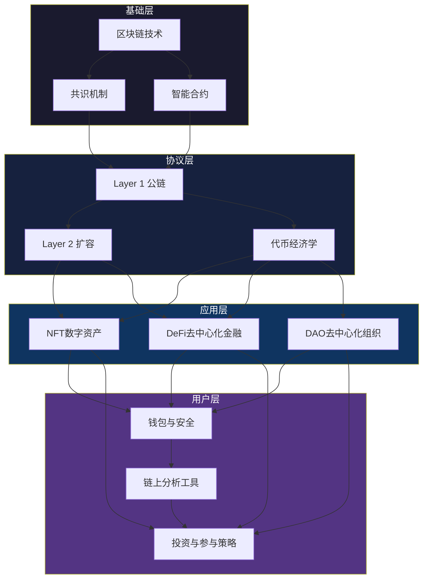

## 本节要点回顾

> 本节回顾梳理了"Web3与NFT"理论基础部分的全部核心知识点。如果你已经完整阅读了前面11个小节，这份回顾帮你建立全局认知框架；如果你是跳读到这里的，这份回顾也能让你快速掌握核心要点，再按需深入各专题。

### 一、Web3的本质：从"读写"到"拥有"

Web3不是一个新名词的炒作，而是互联网价值分配方式的根本性重构。理解Web3，必须先看清三代互联网的演进逻辑：

| 维度 | Web1（1990-2004） | Web2（2004-2020） | Web3（2020-） |
|------|-------------------|-------------------|---------------|
| 核心功能 | 只读浏览 | 读写交互 | 读写拥有 |
| 数据归属 | 网站所有者 | 平台公司 | 用户自己 |
| 价值分配 | 平台独享 | 平台垄断绝大部分 | 创作者直接获取 |
| 用户角色 | 信息消费者 | 内容生产者 | 数据主权者、生态共建者 |
| 典型代表 | 雅虎、新浪 | 微信、抖音、Facebook | 以太坊、Uniswap、OpenSea |

Web2的核心矛盾：用户创造了全部价值（内容、数据、注意力），但平台拿走了绝大部分收益。抖音创作者贡献了内容，广告收入归字节跳动；Uber司机贡献了运力，定价权归平台。Web3用**区块链**（不可篡改的分布式账本）+ **智能合约**（自动执行的链上程序）+ **代币经济**（价值分配机制）来重新定义"谁创造价值、谁拥有价值、谁分配价值"。

Web3的四大核心特征：
- **去中心化**：数据存储在区块链上，不被单一实体控制，网络由参与者共同维护
- **用户主权**：通过私钥控制自己的身份和资产，可以自由转移和交易
- **透明可验证**：所有交易记录公开透明，代码开源，规则透明
- **代币经济**：通过代币激励参与者，代币代表权益和治理权，可在市场自由交易

**关键认知**：Web3的核心是"去中心化 + 用户主权 + 代币经济"。理解这三点，就能理解为什么NFT有价、DeFi能赚钱、DAO能运作。

### 二、区块链技术：Web3的基础设施

区块链是Web3的信任层。它不是一个数据库，而是一个**由全网节点共同维护的、不可篡改的交易账本**。

**三代区块链技术演进**：

| 代际 | 代表 | 共识机制 | TPS | 核心创新 | 局限性 |
|------|------|----------|-----|----------|--------|
| 第一代 | 比特币（2009） | PoW工作量证明 | 7 | 去中心化数字货币 | 速度慢、能耗高、功能单一 |
| 第二代 | 以太坊（2015） | PoW→PoS | 15-30 | 智能合约（图灵完备） | Gas费高、网络拥堵 |
| 第三代 | Solana/Avalanche/Polygon | PoS/混合 | 数千-数万 | 分片、Layer2、跨链互操作 | 去中心化程度下降、安全事故频发 |

**共识机制核心对比**：

| 共识机制 | 原理 | 优点 | 缺点 | 代表链 |
|----------|------|------|------|--------|
| PoW（工作量证明） | 矿工消耗算力竞争出块权 | 安全性最高、久经验证 | 能耗巨大、速度慢 | 比特币 |
| PoS（权益证明） | 质押代币获得验证权 | 能耗低、速度快 | 富者愈富、安全假设较弱 | 以太坊2.0、Solana |
| DPoS（委托权益证明） | 投票选出代表节点验证 | 速度极快 | 去中心化程度低 | EOS、Tron |
| PoH（历史证明） | 可验证的时间戳序列 | 极高吞吐量 | 对硬件要求高 | Solana |

**智能合约**是区块链上的自动执行程序——"如果满足条件A，则自动执行操作B"。它不需要中介、不可篡改、执行结果确定。以太坊的智能合约使用Solidity语言编写，部署后无法修改（除非预留升级接口）。理解智能合约的关键在于：它不是"智能"的，只是"自动"的，代码逻辑完全由开发者决定。

### 三、NFT：数字所有权的革命

NFT（Non-Fungible Token，非同质化代币）是存储在区块链上的数字凭证，记录"谁拥有什么"以及"这个东西的完整流转历史"。与比特币（1 BTC = 1 BTC，可互换）不同，每个NFT都是独一无二的——就像房产证，每套房对应一本证，不能互换。

**NFT价值的三层理解**：
- **底层**：区块链提供的不可伪造的所有权证明，解决了数字世界"复制无成本导致所有权无法确认"的根本问题
- **中层**：创作者经济的新基础设施，艺术家可直接面向全球买家出售作品，无需画廊、出版社等中间商抽成（传统艺术市场佣金30%-50%）
- **表层**：社区身份认同与社交资本，持有Bored Ape不仅是持有一张图片，更是进入精英社交圈的门票

**NFT价值评估公式**：

```text
NFT价值 = 艺术价值(20%) + 社区价值(30%) + 实用价值(20%) + 稀缺价值(15%) + 叙事价值(15%)
```

各维度详解：

| 维度 | 权重 | 评估要素 |
|------|------|----------|
| 艺术价值 | 20% | 创作者知名度、作品美学价值、创作难度和工艺 |
| 社区价值 | 30% | 社区规模和活跃度、持有者质量、社区文化和认同感 |
| 实用价值 | 20% | 游戏内使用价值、空投或权益、线下活动权益 |
| 稀缺价值 | 15% | 发行总量、稀有度分布、历史交易记录 |
| 叙事价值 | 15% | 项目愿景和路线图、品牌合作和跨界、文化影响力 |

**NFT的主要类型**：数字艺术品、PFP头像项目（如BAYC）、游戏资产（GameFi道具）、虚拟地产（Decentraland/The Sandbox）、音乐/视频NFT、域名NFT（ENS）、会员凭证（Token-gated社区门票）。

**不同链上铸造NFT的对比**：

| 链 | Gas费 | 确认速度 | 用户规模 | 适合场景 |
|----|-------|----------|----------|----------|
| Ethereum | $5-$50+ | 15秒 | 最大 | 高价值艺术品、蓝筹项目 |
| Polygon | <$0.01 | 2秒 | 大 | 入门练习、游戏道具 |
| Solana | <$0.01 | 0.4秒 | 中等 | 高频交易、PFP项目 |
| Base | <$0.01 | 快 | 增长中 | Coinbase生态项目 |
| Bitcoin Ordinals | 高 | 慢 | 小众 | 铭文、比特币原生NFT |

### 四、DAO：去中心化组织治理

DAO（Decentralized Autonomous Organization）是通过智能合约规则运行的组织形式，所有决策由成员投票而非管理层拍板。可以理解为"代码即法律"的公司——章程写在区块链上，资金由智能合约管理，任何人都无法私自挪用。

**DAO的核心运作机制**：
1. **治理代币**：持有代币即拥有投票权，通常1个代币 = 1票
2. **提案系统**：任何成员可提交提案（资金使用、产品方向等）
3. **投票周期**：提案进入投票期（通常3-7天），达到法定人数即通过
4. **自动执行**：通过的提案由智能合约自动执行，无需人工干预

**DAO类型与参与方式**：

| DAO类型 | 代表项目 | 参与方式 | 潜在收益 |
|---------|----------|----------|----------|
| 协议治理 | Uniswap、Aave | 持有治理代币投票 | 代币增值 |
| 投资DAO | The LAO、MetaCartel | 出资加入，集体投资 | 投资回报分红 |
| 创作者DAO | FWB、BanklessDAO | 购买会员NFT或代币 | 社区资源、协作机会 |
| 收藏DAO | PleasrDAO | 集资购买高价值NFT | 藏品增值 |
| 赠款DAO | Gitcoin DAO | 贡献开发/设计能力 | 赠款资助 |

**评估DAO质量的关键指标**：成员活跃度（Discord在线人数）、金库规模（Treasury余额）、提案通过率（反映治理效率）、代币分布（避免过于集中导致寡头控制）。

### 五、DeFi：去中心化金融生态

DeFi（Decentralized Finance）是构建在区块链上的金融系统，用智能合约取代传统银行、券商、保险公司的中介角色。任何人只要有钱包和网络连接，就能使用全球化的金融服务，无需KYC、无需开户、7×24小时运行。

**DeFi的四大收益来源**：

| 收益方式 | 原理 | 预期年化 | 风险等级 | 操作复杂度 | 适合人群 |
|----------|------|----------|----------|------------|----------|
| ETH Staking | 质押代币参与网络验证 | 3%-5% | 低 | 低 | 长期持有者 |
| 稳定币借贷 | 在Aave/Compound存入资产赚利息 | 2%-8% | 低 | 低 | 保守型 |
| 流动性提供(LP) | 向DEX资金池存入代币对赚手续费 | 10%-50% | 中 | 中 | 有经验用户 |
| Yield Farming | LP凭证再投入其他协议叠加收益 | 50%-500%+ | 高 | 高 | 专业用户 |
| 杠杆挖矿 | 借贷+LP组合放大收益 | 不确定 | 极高 | 极高 | 不推荐新手 |

**无常损失（Impermanent Loss）** 是LP提供者必须理解的核心风险：当你向资金池存入两种代币时，如果两者价格比例发生变化，你的资产价值可能低于直接持有。价格偏离越大，无常损失越大。只有当手续费收益覆盖无常损失时，LP才是正收益。

**核心原则**：收益与风险永远正相关。年化超过100%的"稳定"收益基本不存在——要么是短期补贴（不可持续），要么隐含你没看到的风险。

### 六、代币经济学：理解价值的底层逻辑

代币是Web3经济体系的基本单元，理解代币经济学是参与Web3的必修课。

**代币的三种价值来源**：
1. **实用性价值（Utility）**：支付Gas费（ETH）、治理投票（UNI/AAVE）、平台服务费（BNB抵扣手续费）、质押收益
2. **治理价值（Governance）**：提案投票权、参数调整权、资金分配权、协议升级决策
3. **投机价值（Speculation）**：市场情绪、叙事驱动、FOMO效应、流动性溢价

**健康的代币分配模型**：

| 分配方 | 占比 | 说明 |
|--------|------|------|
| 社区/生态激励 | 30%-50% | 确保去中心化和长期激励 |
| 团队和顾问 | 15%-20% | 通常有2-4年线性锁仓 |
| 投资者 | 15%-25% | 通常有6-12个月锁仓期 |
| 国库/储备 | 10%-20% | 用于长期发展和应急 |
| 公开发售 | 5%-15% | 初始流通量 |

**解锁风险**：大量代币解锁可能导致抛压。评估项目时必须查看代币解锁时间表——团队代币通常分2-4年线性解锁，投资者代币通常有6-12个月锁仓期。集中解锁日期是价格承压的高风险时段。

### 七、Layer 2与扩容：解决性能瓶颈

Layer 2是在以太坊主链（Layer 1）之上构建的扩展方案，目标是在不牺牲安全性的前提下大幅提升交易速度、降低Gas费。

**主要Layer 2方案对比**：

| 方案类型 | 代表项目 | 原理 | TPS | 安全性 | 成熟度 |
|----------|----------|------|-----|--------|--------|
| Optimistic Rollup | Arbitrum、Optimism | 假设交易有效，争议期后确认 | 2000-4000 | 继承L1安全性 | 高 |
| ZK Rollup | zkSync、StarkNet | 零知识证明确保交易正确性 | 1000-10000 | 继承L1安全性 | 中 |
| 侧链 | Polygon PoS | 独立共识的平行链 | 7000+ | 独立安全模型 | 高 |
| 状态通道 | Lightning Network | 链下交易，最终结算上链 | 理论无限 | 依赖参与者 | 低（以太坊场景） |

**选择建议**：对普通用户而言，Arbitrum和Optimism是目前最成熟的以太坊Layer 2选择，生态丰富、安全性高、Gas费低（通常<$0.1）。Solana、Base等链虽然不是严格意义上的Layer 2，但也提供了类似的低成本高速体验。

### 八、钱包安全：Web3的第一课

钱包安全是参与Web3的前提条件——一旦资产被盗，没有任何"客服"能帮你追回。

**钱包类型对比**：

| 类型 | 代表 | 特点 | 安全性 | 适合场景 |
|------|------|------|--------|----------|
| 浏览器插件钱包 | MetaMask | 方便连接DApp | 中（私钥在电脑上） | 日常交互、小额操作 |
| 移动钱包 | Trust Wallet、Rainbow | 手机端操作 | 中 | 移动端DApp |
| 硬件钱包 | Ledger、Trezor | 私钥永不触网 | 高 | 大额资产存储 |
| 多签钱包 | Safe（Gnosis Safe） | 多人共同签名 | 高 | 团队资金管理 |

**必须遵守的安全规则**：

1. **助记词管理**：12或24个英文单词是钱包最高权限。手写在纸上存放在物理安全位置，绝不拍照、不存云盘、不发给任何人。丢失助记词 = 永久丢失资产
2. **硬件钱包**：持有超过$1,000的资产必须使用硬件钱包（Ledger、Trezor），私钥永远不触网
3. **授权管理**：定期使用revoke.cash检查并撤销不必要的合约授权。恶意合约可能通过已授权的权限转走你的资产
4. **钓鱼防范**：不在非官方网站连接钱包，不点击陌生链接，不扫描不明二维码。验证网站URL是否正确是第一道防线
5. **分仓策略**：日常交互用热钱包（小额），长期存储用冷钱包（大额），两者物理隔离

### 九、链上分析工具：做有数据支撑的决策

在Web3世界，链上数据是公开透明的，善用分析工具可以获取显著的信息优势。

| 工具 | 功能 | 适用场景 |
|------|------|----------|
| Etherscan | 查询任何地址的交易记录、代币余额、合约代码 | 基础查询、合约验证 |
| Dune Analytics | 自定义SQL查询链上数据，生成可视化Dashboard | 深度数据分析 |
| Nansen | 追踪"聪明钱"（Smart Money）的链上行为 | 跟踪大户动向 |
| DeFiLlama | 查看各协议TVL（锁仓量），判断项目规模和健康度 | DeFi协议评估 |
| Arkham | 地址标签化，追踪资金流向 | 资金流向分析 |
| OpenSea/Blur | NFT地板价、交易量、持有者分布 | NFT市场分析 |

**使用建议**：新手从Etherscan和DeFiLlama开始，这两个工具免费且覆盖了80%的日常需求。进阶后使用Dune Analytics做自定义分析，Nansen做聪明钱追踪。

### 十、行业趋势与风险认知

**Web3行业的主要发展趋势**：
- **RWA（Real World Assets）上链**：国债、房产、股票等传统资产代币化，是2024-2025年最大的增量叙事
- **账户抽象（Account Abstraction）**：降低钱包使用门槛，用社交恢复取代助记词，让Web3体验接近Web2
- **模块化区块链**：将执行层、共识层、数据可用层分离，各层独立优化
- **AI × Web3**：AI Agent自主进行链上交易、DeFi策略执行、DAO治理参与
- **比特币生态**：Ordinals/BRC-20/Runes协议激活了比特币的资产发行能力

**必须警惕的风险**：
- **智能合约风险**：代码漏洞可能导致资金损失。使用任何DeFi协议前，先确认审计报告是否公开（知名审计机构：Trail of Bits、OpenZeppelin、Certik）
- **监管风险**：各国政策不断变化，中国大陆对加密货币交易持限制态度
- **市场风险**：加密市场波动极大，BTC历史上多次从高点下跌50%-80%
- **跑路风险（Rug Pull）**：项目方卷款跑路，匿名团队风险更高
- **MEV攻击**：矿工/验证者通过重新排列交易顺序获利，可能影响你的交易执行价格

### 十一、知识体系总览

下图展示了理论基础部分的完整知识体系和各概念之间的逻辑关系：



### 十二、快速自查清单

完成理论基础学习后，用以下清单检验自己的掌握程度：

| 序号 | 检查项 | 掌握标准 |
|------|--------|----------|
| 1 | Web3定义 | 能用一句话说清Web1/Web2/Web3的本质区别 |
| 2 | 区块链原理 | 能解释为什么区块链"不可篡改"以及这有什么意义 |
| 3 | 共识机制 | 能区分PoW/PoS/DPoS的原理和适用场景 |
| 4 | 智能合约 | 能解释智能合约"自动执行"的含义和局限性 |
| 5 | NFT价值 | 能用价值评估框架分析一个NFT项目的合理价格 |
| 6 | DAO治理 | 能解释DAO如何做到"没有CEO也能运转" |
| 7 | DeFi收益 | 能说清四种收益来源的底层逻辑和对应风险 |
| 8 | 代币经济学 | 能看懂一个项目的代币分配模型和解锁时间表 |
| 9 | Layer 2 | 能解释为什么需要Layer 2以及主流方案的区别 |
| 10 | 钱包安全 | 能说出5条必须遵守的安全规则并解释原因 |
| 11 | 分析工具 | 能使用Etherscan和DeFiLlama查询基础数据 |
| 12 | 风险认知 | 能列举5种以上Web3参与中的主要风险类型 |

**如果以上12项中有3项以上无法达标，建议回到对应小节重新学习，再进入核心技巧和实战案例部分。** 理论基础不牢固就进入实操，是Web3领域最常见的亏损原因。

***

> **下一步**：理论基础回顾完成后，进入**核心技巧**部分，开始NFT铸造、DeFi操作、钱包配置等实操内容的学习。
