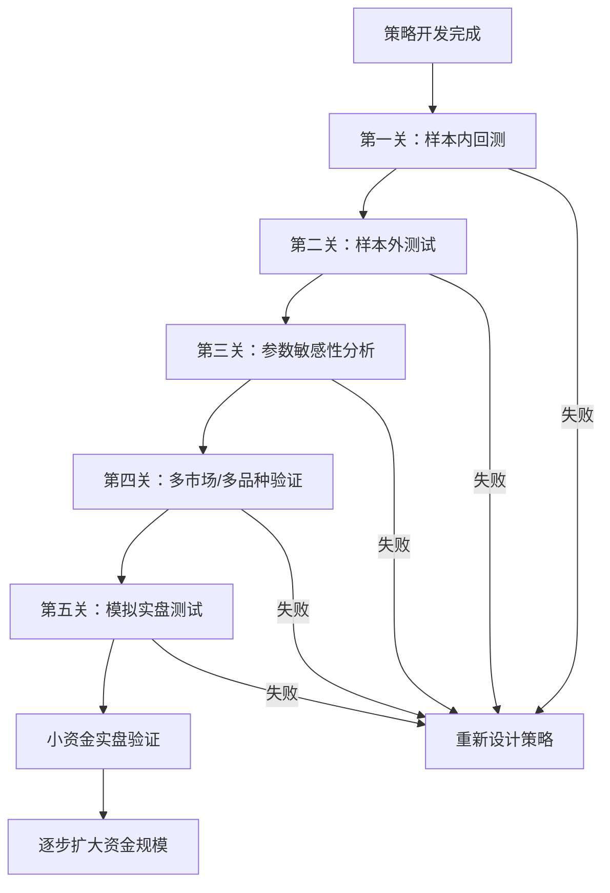
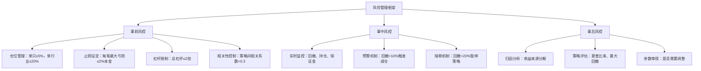
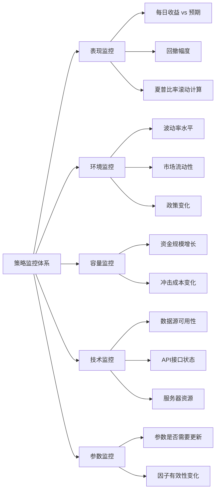
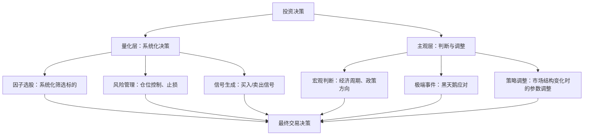
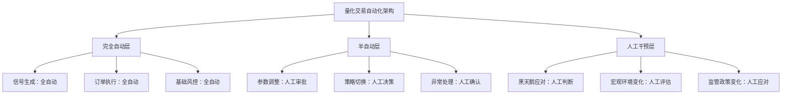
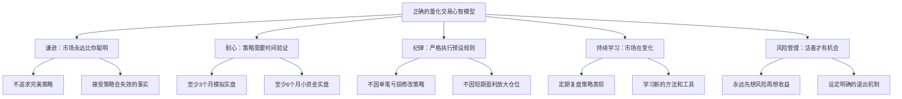

# 第二十八章 量化交易与算法投资 — 常见误区

量化交易看似是一条通往"稳定盈利"的捷径，但实际上布满了认知陷阱。初学者往往在这些陷阱中反复跌倒，浪费大量时间和资金后才幡然醒悟。本章系统梳理量化交易中最常见的十二大误区，从认知偏差、技术陷阱、心理盲区到生态误判，逐一拆解其成因、危害和纠正方法。

每一个误区都不是凭空想象的——它们来自真实的亏损案例、量化社区的高频讨论、以及专业机构的经验总结。理解这些误区，不仅能帮你少走弯路，更能让你建立对量化交易的正确认知框架。

---

## 误区一：量化交易等于稳赚不赔

### 误区描述

很多初学者看到量化私募的亮眼业绩——某某量化基金年化收益50%、某某机构三年翻倍——就认为量化交易是一台"印钞机"，只要学会了就能躺着赚钱。这种认知偏差的根源在于**幸存者偏差**：你只看到了成功的量化基金，没看到大量亏损清盘的产品。

### 真相拆解

量化交易只是一种投资方法论，它用数学模型和计算机程序替代人工判断，但**无法消除市场风险本身**。以下是几个关键事实：

**事实一：顶级量化基金也有亏损年份。** 文艺复兴科技的大奖章基金（Medallion Fund）虽然年化收益超过66%（1988-2018），但其对外募集的RIEF基金在2008年金融危机中亏损约16%。Two Sigma旗下的Vantage基金在2020年也经历了显著回撤。A股市场的量化私募在2022年平均收益为负，头部机构如幻方量化旗下多只产品回撤超过10%。

**事实二：策略会失效。** 市场是动态博弈的生态系统。当一个有效的策略被越来越多的参与者使用时，策略的超额收益会被竞争性套利逐步消磨。这就是所谓的**策略拥挤**（strategy crowding）。2007年8月，大量量化基金同时遭遇"量化地震"，多只基金在几天内亏损超过30%，原因就是多家机构使用了相似的统计套利策略，当一家大规模平仓时引发了连锁反应。

**事实三：回测不等于实盘。** 回测是在已知数据上进行的"事后诸葛亮"，而实盘面对的是未知的未来。两者之间存在巨大的鸿沟（详见误区二）。

### 数据佐证

下表展示了A股量化私募行业的真实表现分布：

| 年份 | 行业平均收益 | 正收益产品占比 | 头部10%平均收益 | 尾部10%平均收益 |
|------|-------------|---------------|----------------|----------------|
| 2019 | +18.3%      | 78%           | +45.2%         | -12.5%         |
| 2020 | +28.6%      | 82%           | +62.1%         | -8.3%          |
| 2021 | +12.1%      | 65%           | +38.7%         | -15.2%         |
| 2022 | -5.8%       | 32%           | +18.4%         | -28.6%         |
| 2023 | +3.2%       | 51%           | +22.5%         | -18.9%         |

> 数据来源：私募排排网、朝阳永续等第三方数据平台综合统计，2019-2023年。

可以看到，即使是量化交易，也遵循"二八法则"——长期稳定盈利的只是少数。

### 正确认知

量化交易的真正价值不在于"保证赚钱"，而在于：

1. **提高纪律性**：严格执行策略规则，避免情绪化操作
2. **提高系统性**：用数据和模型替代拍脑袋决策
3. **提高可验证性**：策略可以在历史数据上进行回测和验证
4. **提高效率**：计算机可以同时监控数千只股票，人工无法做到

量化交易是"提高胜率的工具"，不是"消除风险的魔法"。正确的心态是：**把量化交易当作一门手艺来打磨，而不是一台提款机来使用。**

---

## 误区二：回测收益高就是好策略

### 误区描述

这是量化交易中最普遍、最危险的误区。初学者花了一周时间写了一个策略，回测年化收益50%，夏普比率2.5，就迫不及待地投入实盘——结果亏得一塌糊涂。

### 真相拆解

回测收益高可能是"假的"，常见原因有以下五种：

#### 1. 过度拟合（Overfitting）

过度拟合是量化交易的"头号杀手"。它的本质是：**策略参数过度适配了历史数据的噪声，而非市场的真正规律。**

打个比方：你用10个参数去拟合100个数据点，就像用10次多项式去穿过10个点——曲线完美穿过每个点，但它对未来数据的预测能力几乎为零。

**过度拟合的典型症状：**

| 症状 | 表现 | 严重程度 |
|------|------|---------|
| 参数过多 | 策略有5个以上可调参数 | ⚠️ 高危 |
| 回测收益远超同类策略 | 年化收益超过50%（A股） | ⚠️ 高危 |
| 样本内外表现差距大 | 样本外收益不到样本内的50% | ⚠️ 高危 |
| 参数微调导致结果剧变 | 参数变化10%，收益变化50%以上 | ⚠️ 高危 |
| 只在特定时间段有效 | 2019年很好，2020年就崩了 | ⚠️ 高危 |

**检测方法——参数敏感性分析：**

```python
import numpy as np
import matplotlib.pyplot as plt

def parameter_sensitivity(backtest_func, param_name, param_range, other_params):
    """
    参数敏感性分析：检查策略对参数变化的敏感程度
    如果收益随参数变化剧烈波动，说明策略可能过度拟合
    """
    results = []
    for value in param_range:
        params = other_params.copy()
        params[param_name] = value
        result = backtest_func(**params)
        results.append(result['annual_return'])

    # 计算收益的标准差——越大说明对参数越敏感
    std = np.std(results)
    mean = np.mean(results)
    cv = std / abs(mean) if mean != 0 else float('inf')

    print(f"参数 {param_name} 在范围 {param_range} 内的敏感性分析：")
    print(f"  平均收益: {mean:.2%}")
    print(f"  收益标准差: {std:.2%}")
    print(f"  变异系数(CV): {cv:.2f}")
    print(f"  判定: {'过度拟合风险高' if cv > 0.5 else '参数相对稳健'}")

    return results

# 使用示例：分析均线策略中均线周期的敏感性
# param_range = range(5, 51, 5)  # 5到50，步长5
# parameter_sensitivity(backtest_ma, 'ma_period', param_range, {'initial_capital': 100000})
```

#### 2. 存活者偏差（Survivorship Bias）

回测通常只包含当前还在交易的股票，而忽略了已经退市的股票。这会导致回测收益被系统性高估。

**为什么？** 因为退市的股票往往是表现最差的——连续亏损、财务造假、经营失败。如果回测中没有这些"失败者"，策略的收益自然会被虚增。

**量化估算：** 研究表明，包含退市股票的回测收益通常比不包含的低2%-5%年化。对于小盘股策略，差距更大，可能达到5%-10%。

**解决方案：**

```python
# 使用包含退市股票的全历史数据库
# 推荐数据源：
# - Tushare Pro（需要积分，有退市股票数据）
# - AKShare（免费，退市数据较完整）
# - Wind（付费，机构级数据质量）

import tushare as ts

# 获取包含退市股票的全历史数据
def get_survivorship_free_data(stock_code, start_date, end_date):
    """
    获取无存活者偏差的股票数据
    注意：需要Tushare Pro的高级权限
    """
    pro = ts.pro_api()

    # 获取股票基本信息（包含退市标记）
    stock_info = pro.stock_basic(exchange='', list_status='L')  # L=上市, D=退市, P=暂停
    delisted = pro.stock_basic(exchange='', list_status='D')    # 退市股票

    # 合并上市和退市股票
    all_stocks = pd.concat([stock_info, delisted])

    # 获取行情数据时包含退市股票
    # 关键：退市股票在退市前的数据也要纳入回测
    return all_stocks
```

#### 3. 前视偏差（Look-Ahead Bias）

前视偏差是指在回测中使用了在交易决策时点无法获取的未来信息。这是一种非常隐蔽的错误，即使是经验丰富的量化交易者也可能犯。

**常见场景：**

- **用收盘价做盘中决策**：你在10:00做买入决策时使用了当天的收盘价，但此时收盘价还不存在
- **使用当季财报数据**：财报通常在季度结束后1-3个月才发布，不能用未发布的财报数据做选股
- **复权方式错误**：使用了"未来才知道"的复权因子
- **使用幸存者列表**：用当前的沪深300成分股去回测2015年的策略，但2015年的成分股和现在不同

**检测代码示例：**

```python
def check_look_ahead_bias(strategy_logic):
    """
    前视偏差检测清单
    在代码中逐步检查每个数据引用是否使用了未来信息
    """
    checklist = [
        "✅ 所有价格数据使用的是决策时点之前的值",
        "✅ 财报数据使用的是发布日期而非报告期",
        "✅ 成分股使用的是当时的历史成分股列表",
        "✅ 复权方式正确（前复权用于回测，后复权用于实盘）",
        "✅ 没有使用全局统计量（如用全样本均值做标准化）",
        "✅ 信号生成和交易执行之间有合理的延迟",
    ]

    for item in checklist:
        print(item)

    print("\n⚠️ 如果以上任何一项未通过，回测结果将不可靠！")
```

#### 4. 交易成本低估

很多初学者在回测中忽略了交易成本，或者严重低估了实际交易中的隐性成本。

**真实交易成本构成：**

| 成本项 | A股（单边） | 期货（单边） | 说明 |
|--------|-----------|------------|------|
| 佣金 | 0.02%-0.03% | 0.001%-0.005% | 可协商 |
| 印花税 | 0.05%（卖出） | 0% | 2023年8月减半 |
| 滑点 | 0.05%-0.3% | 0.01%-0.05% | 与流动性相关 |
| 冲击成本 | 0.1%-1%+ | 0.05%-0.5% | 与资金规模相关 |
| **总计（单边）** | **0.2%-0.5%** | **0.02%-0.1%** | — |

**关键提醒：** 对于高频策略（日换手率>50%），交易成本的微小差异会被放大到惊人的程度。假设日换手率100%（全仓换手一次），单边成本从0.2%变为0.3%，年化成本差异就是：(0.3%-0.2%) × 2 × 250 = 50%。这意味着你以为年化收益30%的策略，实际上可能亏损20%。

**正确的成本假设：**

```python
# 保守的交易成本设置（A股日内策略）
TRANSACTION_COSTS = {
    'commission': 0.0003,       # 佣金（双边）
    'stamp_tax': 0.0005,        # 印花税（仅卖出）
    'slippage': 0.002,          # 滑点（保守估计0.2%）
    'impact_cost': 0.003,       # 冲击成本（根据资金规模调整）
}

def apply_realistic_costs(trade_amount, direction='buy'):
    """
    应用真实的交易成本
    direction: 'buy' 或 'sell'
    """
    cost = trade_amount * TRANSACTION_COSTS['commission']
    cost += trade_amount * TRANSACTION_COSTS['slippage']
    cost += trade_amount * TRANSACTION_COSTS['impact_cost']

    if direction == 'sell':
        cost += trade_amount * TRANSACTION_COSTS['stamp_tax']

    return cost
```

#### 5. 数据错误

数据质量问题是回测失真的另一个重要原因：

- **复权方式不正确**：前复权和后复权的选择会影响历史价格的计算
- **数据缺失**：某些日期的数据丢失，导致信号计算错误
- **除权除息处理不当**：分红、配股、拆股未正确处理
- **停牌数据处理不当**：停牌期间不应产生交易信号

### 正确做法：策略验证的"五道关卡"



**第一关：样本内回测。** 使用70%的历史数据进行策略开发和参数优化。这是策略的"训练集"。

**第二关：样本外测试。** 用剩余30%的数据验证策略。这是策略的"考试"。如果样本外表现远差于样本内（收益下降超过50%），策略很可能过度拟合。

**第三关：参数敏感性分析。** 将每个参数在其合理范围内变动±20%，观察策略表现的变化。如果参数微小变化导致收益剧烈波动，说明策略对参数过度敏感。

**第四关：多市场/多品种验证。** 在不同的市场环境（牛市、熊市、震荡市）和不同的交易品种上测试策略。好的策略应该在多个环境下都能保持正收益（虽然收益水平可能不同）。

**第五关：模拟实盘测试。** 使用模拟盘进行至少3个月的实时测试，验证策略在真实市场条件下的表现。重点关注滑点、成交率和信号延迟对策略的影响。

---

## 误区三：策略越复杂越好

### 误区描述

初学者容易陷入"复杂度崇拜"——认为用了机器学习、深度学习、神经网络的策略就比简单的均线策略高级。有些人甚至把策略的复杂度当作能力的象征，堆砌大量的技术指标和筛选条件。

### 真相拆解

在量化交易领域，**简单往往优于复杂**。这不是一句空话，而是有深刻的数学和实践依据。

#### 偏差-方差权衡（Bias-Variance Tradeoff）

在统计学习中，模型的总误差由偏差（Bias）和方差（Variance）组成。简单模型偏差高但方差低，复杂模型偏差低但方差高。对于金融数据这种高噪声的环境，**方差的增加往往比偏差的减少更严重**，因此简单模型反而表现更好。

```text
总误差 = 偏差² + 方差 + 噪声

简单模型（如均线策略）：偏差高，方差低 → 总误差适中
复杂模型（如深度学习）：偏差低，方差高 → 总误差可能更高
```

#### 奥卡姆剃刀原则

"如无必要，勿增实体。"在量化策略中，每增加一个参数或条件，都需要证明其对策略的贡献是真实的而非偶然的。

**参数数量与过度拟合概率的关系：**

| 参数数量 | 过度拟合风险 | 策略可解释性 | 维护难度 | 推荐程度 |
|---------|------------|------------|---------|---------|
| 1-2个   | 低         | 高         | 低      | ⭐⭐⭐⭐⭐ |
| 3-5个   | 中等       | 中等       | 中等    | ⭐⭐⭐⭐ |
| 6-10个  | 高         | 低         | 高      | ⭐⭐ |
| 10个以上 | 极高       | 很低       | 很高    | ⭐ |

#### 经典案例：海龟交易法则

海龟交易法则（Turtle Trading Rules）是1983年由Richard Dennis发起的著名交易实验。这套策略的核心规则极其简单：

- **入场**：价格突破20日最高价买入，突破10日最低价卖出
- **仓位**：根据ATR（平均真实波幅）计算仓位大小
- **止损**：2倍ATR止损

这套只有几个简单规则的策略，却成为了有史以来最成功的趋势跟踪策略之一。Dennis招募的"海龟交易员"在随后的四年里获得了年化80%以上的收益。

**启示：** 策略的有效性不取决于其复杂度，而取决于它是否捕捉到了市场的某种持续性规律。

#### 为什么简单策略更好？

1. **参数少，过度拟合风险低**：2个参数的策略比20个参数的策略更不容易拟合噪声
2. **逻辑清晰，便于诊断**：出了问题你能快速定位是哪个环节出了错
3. **鲁棒性强**：简单规则在不同市场环境下都能保持一定的效果
4. **交易成本低**：简单策略通常换手率较低，交易成本更可控
5. **心理压力小**：策略逻辑清晰，执行时更容易坚持

### 正确做法

**渐进式复杂度增加法：**

1. **起步阶段**：从最简单的策略开始（如单均线、双均线、布林带）
2. **验证阶段**：在多个市场环境下验证简单策略的有效性
3. **增量阶段**：每增加一个参数或条件，必须通过以下检验：
   - 样本外收益是否提升？
   - 参数敏感性是否可接受？
   - 夏普比率是否有显著改善？
4. **记录阶段**：详细记录每次修改的效果，建立"策略变更日志"

```python
# 策略变更日志模板
strategy_log = {
    "v1.0": {
        "description": "双均线策略（MA5/MA20）",
        "in_sample_sharpe": 1.2,
        "out_sample_sharpe": 1.0,
        "params": {"fast_ma": 5, "slow_ma": 20},
    },
    "v1.1": {
        "description": "增加成交量过滤条件",
        "in_sample_sharpe": 1.5,
        "out_sample_sharpe": 0.8,  # 样本外变差了！
        "params": {"fast_ma": 5, "slow_ma": 20, "vol_filter": 1.5},
        "conclusion": "❌ 样本外表现下降，可能是过度拟合，放弃此修改"
    },
    "v1.2": {
        "description": "增加ATR止损",
        "in_sample_sharpe": 1.4,
        "out_sample_sharpe": 1.3,  # 样本外也有提升
        "params": {"fast_ma": 5, "slow_ma": 20, "atr_stop": 2.0},
        "conclusion": "✅ 样本外表现提升，采纳此修改"
    },
}
```

---

## 误区四：数据越多越好

### 误区描述

初学者认为，只要有足够多的数据，就能找到"圣杯"策略。于是他们收集了20年的日线数据、10年的分钟线数据、全市场5000只股票的行情——然后用这些数据开发出了一个回测收益惊人的策略。

### 真相拆解

数据质量远比数据数量重要。垃圾数据只会产生垃圾结果（Garbage In, Garbage Out）。

#### 数据质量问题的四大来源

**问题一：免费数据源的准确性问题。**

免费数据源（如某些网页爬取的数据、低质量的开源数据）常常存在以下问题：

- 价格数据错误（如小数点错位）
- 分红除权数据不完整
- 停牌股票数据缺失
- 复权因子计算错误
- 数据延迟（实时数据实际延迟几分钟）

**问题二：数据频率与策略频率的错配。**

用日线数据回测高频策略，或者用tick数据回测长线策略，都会导致结果不可靠。数据频率应该与策略的交易频率相匹配：

| 策略类型 | 推荐数据频率 | 最低数据频率 | 数据量要求 |
|---------|------------|------------|----------|
| 高频交易（日内） | tick/1分钟 | 5分钟 | 至少1年 |
| 短线交易（数天） | 5分钟/15分钟 | 日线 | 至少3年 |
| 中线交易（数周） | 日线 | 日线 | 至少5年 |
| 长线交易（数月） | 周线/月线 | 日线 | 至少10年 |

**问题三：数据时间跨度的陷阱。**

10年前的市场结构可能与现在完全不同。2015年以前的A股市场没有注册制、没有科创板、没有北向资金、涨跌停板规则不同——用这些数据回测的策略可能不适用于今天的市场。

**建议：** 对于A股策略，使用2017年以后的数据作为主要回测区间（市场制度相对稳定），更早的数据仅作参考。

**问题四：幸存者偏差再强调。**

这是数据问题中最容易被忽视的。当前的股票列表只包含还在交易的股票，而历史上的"失败者"（退市、被收购、长期停牌的股票）已经从列表中消失了。如果你的回测只用当前股票列表，策略的收益会被系统性高估。

### 数据质量检查清单

```python
import pandas as pd
import numpy as np

def data_quality_check(df, stock_code):
    """
    数据质量检查函数
    输入：股票行情DataFrame
    输出：质量检查报告
    """
    issues = []

    # 1. 检查缺失值
    missing = df.isnull().sum()
    if missing.any():
        issues.append(f"⚠️ 存在缺失值: {missing[missing > 0].to_dict()}")

    # 2. 检查价格异常（涨幅超过±11%排除涨跌停）
    returns = df['close'].pct_change()
    extreme = returns[returns.abs() > 0.11]
    if len(extreme) > 0:
        issues.append(f"⚠️ 存在{len(extreme)}个异常涨跌幅（>±11%）")

    # 3. 检查成交量为零的交易日
    zero_volume = (df['volume'] == 0).sum()
    if zero_volume > 0:
        issues.append(f"⚠️ 存在{zero_volume}个交易日成交量为零（可能停牌）")

    # 4. 检查价格为零或负数
    zero_price = (df['close'] <= 0).sum()
    if zero_price > 0:
        issues.append(f"⚠️ 存在{zero_price}个收盘价<=0的记录")

    # 5. 检查日期连续性
    date_gaps = pd.bdate_range(df.index.min(), df.index.max())
    missing_dates = len(date_gaps) - len(df)
    if missing_dates > 10:
        issues.append(f"⚠️ 存在约{missing_dates}个交易日的数据缺失")

    # 6. 检查复权因子一致性
    # （需要额外的复权因子数据）

    # 输出报告
    print(f"=== 数据质量检查报告：{stock_code} ===")
    print(f"数据区间：{df.index.min()} 至 {df.index.max()}")
    print(f"总记录数：{len(df)}")
    if issues:
        for issue in issues:
            print(issue)
        print(f"\n结论：发现{len(issues)}个质量问题，建议修复后再使用")
    else:
        print("\n结论：✅ 数据质量良好")

    return issues
```

### 推荐数据源对比

| 数据源 | 价格 | 数据质量 | 退市股票 | 适用场景 |
|--------|------|---------|---------|---------|
| Tushare Pro | 免费/付费 | ⭐⭐⭐⭐ | ✅ | 个人研究 |
| AKShare | 免费 | ⭐⭐⭐ | 部分 | 入门学习 |
| 聚宽数据 | 平台内免费 | ⭐⭐⭐⭐ | ✅ | 平台回测 |
| Wind | 付费（数万/年） | ⭐⭐⭐⭐⭐ | ✅ | 专业研究 |
| 通达信/同花顺 | 付费 | ⭐⭐⭐⭐ | 部分 | 行情查看 |

---

## 误区五：忽视风险管理

### 误区描述

量化新手往往把99%的精力放在策略研发上，只留1%给风险管理。他们痴迷于提高胜率、优化参数、增加收益，却对止损、仓位控制、风险敞口这些"枯燥"的事情不屑一顾。

### 真相拆解

**风险管理比策略本身更重要。** 这不是一句口号，而是被无数血泪案例验证的铁律。

#### 核心论据：凯利公式的启示

凯利公式（Kelly Criterion）告诉我们，即使你有一个正期望的策略，如果仓位过大，最终也会破产：

```text
f* = (bp - q) / b

其中：
f* = 最优仓位比例
b  = 赔率（盈利/亏损）
p  = 胜率
q  = 1 - p（败率）
```

**数值示例：** 假设你的策略胜率60%，盈亏比1.5:1。

```text
f* = (1.5 × 0.6 - 0.4) / 1.5 = 0.333
```

最优仓位约为33%。如果你用100%仓位，长期来看虽然期望收益更高，但破产风险也急剧上升——只要连续亏损3-5次，你就可能被迫出局。

#### 专业机构的风险管理实践

专业量化机构通常将至少30%的资源投入到风险管理中，包括：

- **事前风控**：投资组合构建时的风险约束（行业暴露、因子暴露、个股集中度等）
- **事中风控**：实时监控持仓风险、保证金水平、回撤幅度
- **事后风控**：归因分析、策略评估、参数调整

### 常见风险管理失误及其后果

| 失误类型 | 具体表现 | 可能后果 | 真实案例 |
|---------|---------|---------|---------|
| 不设止损 | "扛一扛就回来了" | 单笔亏损超过20% | 2015年股灾中许多不止损的账户亏损80%+ |
| 仓位过重 | 单只股票仓位超过30% | 个股黑天鹅导致巨额亏损 | 康美药业财务造假，股价跌去90% |
| 策略相关 | 3个策略都是动量策略 | 多策略同时回撤 | 2007年量化地震，多策略基金亏损30%+ |
| 杠杆过高 | 使用3倍以上杠杆 | 一次正常回撤就爆仓 | 2015年配资爆仓潮 |
| 流动性忽视 | 重仓小盘股 | 无法及时止损 | 2018年小盘股流动性危机 |

### 风险管理框架



### 代码示例：风控模块实现

```python
class RiskManager:
    """量化交易风控管理器"""

    def __init__(self, config):
        self.max_position_pct = config.get('max_position_pct', 0.05)   # 单只最大仓位
        self.max_sector_pct = config.get('max_sector_pct', 0.20)       # 单行业最大仓位
        self.max_drawdown = config.get('max_drawdown', 0.15)           # 最大回撤阈值
        self.max_leverage = config.get('max_leverage', 2.0)            # 最大杠杆
        self.single_trade_loss = config.get('single_trade_loss', 0.02) # 单笔最大亏损
        self.peak_value = 0
        self.current_drawdown = 0

    def check_position_limit(self, stock_code, target_value, total_value):
        """检查单只股票仓位限制"""
        position_pct = target_value / total_value
        if position_pct > self.max_position_pct:
            return False, f"仓位{position_pct:.1%}超过限制{self.max_position_pct:.1%}"
        return True, "OK"

    def check_stop_loss(self, entry_price, current_price, total_capital):
        """检查止损条件"""
        loss_pct = (entry_price - current_price) / entry_price
        max_loss_amount = total_capital * self.single_trade_loss
        actual_loss = loss_pct * entry_price

        if actual_loss > max_loss_amount:
            return False, f"预期亏损{actual_loss:.0f}超过限制{max_loss_amount:.0f}"
        return True, "OK"

    def update_drawdown(self, current_value):
        """更新回撤监控"""
        self.peak_value = max(self.peak_value, current_value)
        self.current_drawdown = (self.peak_value - current_value) / self.peak_value

        if self.current_drawdown > self.max_drawdown:
            return "STOP", f"回撤{self.current_drawdown:.1%}超过阈值{self.max_drawdown:.1%}，暂停交易"
        elif self.current_drawdown > self.max_drawdown * 0.7:
            return "WARN", f"回撤{self.current_drawdown:.1%}接近阈值，建议减仓"
        return "OK", f"当前回撤{self.current_drawdown:.1%}"
```

---

## 误区六：量化交易不需要了解基本面

### 误区描述

许多纯技术面量化交易者认为，基本面分析是"主观判断"，与量化交易的"客观数据驱动"理念相悖。他们只关注K线、均线、MACD等技术指标，完全忽略公司的财务数据、行业趋势和宏观环境。

### 真相拆解

随着量化交易的普及，纯技术面策略的竞争越来越激烈，超额收益在持续衰减。原因很简单：当市场上大量参与者都在用同样的技术指标做交易时，这些信号的预测能力就会被竞争性套利所消磨。

#### 纯技术面策略的局限性

| 局限 | 说明 | 影响 |
|------|------|------|
| 信号拥挤 | 大量量化基金使用相似的技术指标 | 超额收益被摊薄 |
| 噪声敏感 | 技术指标容易被短期噪声干扰 | 假信号增多 |
| 结构性失效 | 市场结构变化导致技术规律消失 | 策略突然失效 |
| 容量有限 | 纯技术面策略通常容量较小 | 难以容纳大资金 |

#### 基本面因子的价值

越来越多的量化机构开始将基本面信息纳入模型，因为基本面因子提供了技术面无法捕捉的信息维度：

**常用基本面因子：**

| 因子类别 | 具体因子 | 预期方向 | IC参考值 |
|---------|---------|---------|---------|
| 估值因子 | PE、PB、PS、EV/EBITDA | 低估值跑赢 | 0.03-0.05 |
| 成长因子 | 营收增速、净利润增速 | 高成长跑赢 | 0.02-0.04 |
| 质量因子 | ROE、毛利率、现金流 | 高质量跑赢 | 0.03-0.06 |
| 分析师预期 | 预期修正、一致预期变化 | 上调跑赢 | 0.04-0.07 |
| 舆情因子 | 新闻情感、社交媒体热度 | 正面跑赢 | 0.02-0.04 |

> IC（信息系数）：因子值与未来收益的截面相关系数。IC > 0.03通常认为因子有效。

#### 技术面 + 基本面的融合框架

```python
# 多维度因子融合示例
class MultiDimensionalStrategy:
    """技术面 + 基本面融合策略"""

    def __init__(self):
        # 技术面因子
        self.tech_factors = {
            'momentum_20d': 0.15,      # 20日动量
            'ma_cross': 0.10,          # 均线交叉信号
            'volume_ratio': 0.05,      # 量比
        }
        # 基本面因子
        self.fundamental_factors = {
            'roe': 0.20,               # ROE
            'revenue_growth': 0.15,    # 营收增速
            'analyst_revision': 0.20,  # 分析师预期修正
            'pe_percentile': 0.15,     # PE分位数
        }

    def calculate_composite_score(self, stock_data):
        """
        计算综合得分
        技术面因子权重30%，基本面因子权重70%
        """
        tech_score = sum(
            stock_data[factor] * weight
            for factor, weight in self.tech_factors.items()
        )
        fundamental_score = sum(
            stock_data[factor] * weight
            for factor, weight in self.fundamental_factors.items()
        )

        # 加权综合
        composite = 0.3 * tech_score + 0.7 * fundamental_score
        return composite
```

### 正确认知

量化交易的核心是"系统化决策"，而非"只看技术面"。基本面数据同样是客观数据，完全可以被量化模型所使用。**最佳实践是将基本面因子与技术面因子结合，构建多维度的策略体系**，这样既能捕捉技术面的短期信号，又能利用基本面的中长期趋势。

---

## 误区七：别人赚钱的策略我用也赚钱

### 误区描述

量化社区和论坛上经常有人分享策略代码和回测结果。初学者看到别人用某个策略赚了钱，就直接复制代码、投入实盘——结果发现效果天差地别。

### 真相拆解

策略的有效性与执行环境密切相关。同一个策略，在不同的执行条件下，可能产生截然不同的结果。

#### 影响策略效果的六大因素

**因素一：资金规模。**

100万和1亿的策略执行效果完全不同。小资金可以轻松买入小盘股，但大资金买入同样的小盘股会造成显著的冲击成本。很多针对小盘股的因子策略（如小市值因子），在资金规模增大后会迅速失效。

**经验法则：** 策略的容量（Capacity）通常与其换手率成反比。日换手率200%的高频策略，容量可能只有几千万；年换手率100%的低频策略，容量可能达到数十亿。

**因素二：交易速度。**

同样的策略，手动执行和程序化执行差距巨大。一个信号出现后，程序可以在毫秒内完成下单，而人工可能需要几分钟。在短线策略中，这个时间差可能意味着盈利和亏损的区别。

**因素三：市场环境。**

牛市中表现优异的动量策略，在熊市中可能持续亏损。2019-2020年的结构牛行情中，成长股动量策略大放异彩；但2022年的震荡下跌行情中，同样的策略回撤超过20%。

**因素四：心理因素。**

这是最容易被低估的因素。回测时你可以冷静地执行每一个交易信号，但实盘中面对真金白银的亏损时，你能否坚持执行策略？研究表明，大多数散户在策略回撤15%时就会放弃——而这个回撤幅度在量化交易中是完全正常的。

**因素五：技术条件。**

网络延迟、服务器稳定性、API接口质量——这些技术细节在回测中不存在，但在实盘中可能致命。一个信号延迟1秒，在高频策略中可能意味着完全错过交易机会。

**因素六：交易成本差异。**

不同券商的佣金费率不同，不同资金量的冲击成本不同，不同品种的流动性不同。这些差异累积起来，可能让一个在回测中盈利的策略在实盘中亏损。

### 正确做法

**学习策略的"为什么"，而非"怎么做"：**

1. **理解策略逻辑**：这个策略为什么有效？它捕捉的是市场的什么规律？
2. **分析适用条件**：这个策略在什么市场环境下有效？什么环境下会失效？
3. **评估自身条件**：我的资金规模、交易速度、技术条件是否匹配？
4. **独立验证**：用自己获取的数据、自己的代码重新回测，而非直接复制
5. **渐进式实盘**：先用小资金测试，验证后再逐步扩大

---

## 误区八：一旦编好程序就不用管了

### 误区描述

有些人认为，量化交易就是"写好程序，然后躺赚"。他们把策略部署到服务器上后就不再关注，期待程序自动产生收益。

### 真相拆解

量化策略需要持续监控和维护，就像汽车需要定期保养一样。忽视维护的策略，就像一辆不保养的汽车——迟早会在高速公路上抛锚。

#### 策略退化的三种模式

**模式一：渐进式退化。** 市场环境缓慢变化，策略的超额收益逐渐衰减。这种退化是渐进的，不易察觉，但半年后回头看，你会发现策略已经从盈利变成了亏损。

**模式二：突变式失效。** 市场发生结构性变化（如政策调整、交易规则改变、市场结构变化），导致策略突然失效。例如，2016年A股实施熔断机制的那几天，大量策略因为流动性枯竭而产生异常亏损。

**模式三：技术性故障。** 数据源中断、API接口变更、服务器宕机、程序Bug等技术问题，可能导致策略产生非预期的交易行为。

### 需要监控的五大维度



### 策略监控代码模板

```python
import datetime
import logging

class StrategyMonitor:
    """策略监控器"""

    def __init__(self, strategy_name, config):
        self.strategy_name = strategy_name
        self.expected_sharpe = config.get('expected_sharpe', 1.0)
        self.max_drawdown_limit = config.get('max_drawdown_limit', 0.15)
        self.min_win_rate = config.get('min_win_rate', 0.45)
        self.alerts = []

    def daily_check(self, today_pnl, cumulative_return, current_drawdown, win_rate):
        """每日检查"""
        self.alerts = []

        # 1. 收益检查
        if cumulative_return < -0.10:
            self.alerts.append(f"🔴 累计亏损{cumulative_return:.1%}，超过10%警戒线")

        # 2. 回撤检查
        if current_drawdown > self.max_drawdown_limit:
            self.alerts.append(f"🔴 当前回撤{current_drawdown:.1%}，超过限制{self.max_drawdown_limit:.1%}")
        elif current_drawdown > self.max_drawdown_limit * 0.7:
            self.alerts.append(f"🟡 回撤{current_drawdown:.1%}接近限制")

        # 3. 胜率检查
        if win_rate < self.min_win_rate:
            self.alerts.append(f"🟡 胜率{win_rate:.1%}低于预期{self.min_win_rate:.1%}")

        # 4. 异常交易检查
        if abs(today_pnl) > 0.05:
            self.alerts.append(f"⚠️ 今日盈亏{today_pnl:.1%}异常，检查是否有非预期交易")

        # 输出报告
        if self.alerts:
            print(f"\n=== {self.strategy_name} 告警报告 ===")
            print(f"日期: {datetime.date.today()}")
            for alert in self.alerts:
                print(f"  {alert}")
        else:
            print(f"✅ {self.strategy_name} 运行正常")

        return self.alerts
```

### 参数调整的时机与方法

参数调整是一个敏感话题——调整太少，策略可能持续亏损；调整太多，可能变成"事后诸葛亮"。

**何时调整参数：**

1. **策略表现持续偏离预期**：连续3个月夏普比率为负
2. **市场结构发生重大变化**：如交易规则改变、市场参与者结构变化
3. **参数敏感性分析显示当前参数处于"悬崖"位置**

**如何调整参数：**

1. **使用滚动窗口优化**：用最近N个月的数据重新优化参数，而非用全部历史数据
2. **限制参数变化幅度**：新参数与旧参数的差异不超过20%
3. **记录每次调整的原因和效果**：建立参数调整日志
4. **调整后重新走验证流程**：样本外测试、模拟实盘

---

## 误区九：量化交易一定能战胜主观交易

### 误区描述

量化交易的拥护者常常贬低主观交易，认为"用数据和模型决策"一定优于"用经验和直觉决策"。

### 真相拆解

两者各有优劣，没有绝对的胜者。最优秀的投资机构往往是将量化方法与主观判断结合的。

#### 量化交易 vs 主观交易：全面对比

| 维度 | 量化交易 | 主观交易 |
|------|---------|---------|
| **纪律性** | ⭐⭐⭐⭐⭐ 严格执行规则 | ⭐⭐ 受情绪影响 |
| **系统性** | ⭐⭐⭐⭐⭐ 数据驱动决策 | ⭐⭐⭐ 经验+直觉 |
| **可扩展性** | ⭐⭐⭐⭐⭐ 可同时管理数千标的 | ⭐⭐ 精力有限 |
| **极端事件应对** | ⭐⭐ 难以预判黑天鹅 | ⭐⭐⭐⭐ 可灵活应对 |
| **宏观理解** | ⭐⭐ 难以量化宏观因素 | ⭐⭐⭐⭐ 深度理解 |
| **市场结构变化适应** | ⭐⭐ 需要重新开发策略 | ⭐⭐⭐⭐ 可快速适应 |
| **信息处理广度** | ⭐⭐⭐⭐⭐ 处理海量数据 | ⭐⭐ 信息有限 |
| **执行速度** | ⭐⭐⭐⭐⭐ 毫秒级 | ⭐ 分钟级 |

#### 量化交易的天然弱点

**弱点一：黑天鹅事件。** 2020年新冠疫情爆发时，全球市场在几周内暴跌30%以上。纯量化策略难以预判这类"百年一遇"的事件，因为历史数据中没有足够的样本。

**弱点二：策略拥挤。** 当大量量化基金使用相似的策略时，市场会出现"踩踏"效应。2007年8月的"量化地震"就是典型案例——多家机构同时平仓，导致市场剧烈波动，大量量化基金单周亏损超过10%。

**弱点三：过度拟合的系统性风险。** 量化策略可能在回测中表现完美，但在实盘中因为市场环境变化而突然失效。

#### 主观交易的天然优势

**优势一：灵活应对极端情况。** 经验丰富的交易者可以在市场恐慌时保持冷静，在市场狂热时保持警惕——这种"逆势思维"很难被量化模型所复制。

**优势二：对宏观环境的深度理解。** 宏观经济、政策变化、地缘政治等因素对市场有重大影响，但这些因素很难被量化为具体的数值。

**优势三：对"新信息"的快速反应。** 当市场出现突发新闻时，主观交易者可以立即做出反应，而量化模型可能需要等到下一个信号生成周期。

### 最佳实践：量化与主观的融合



**具体融合方法：**

1. **用量化方法筛选标的**：通过多因子模型选出候选股票池
2. **用主观判断过滤**：人工排除基本面有重大隐患的公司（如财务造假嫌疑）
3. **用量化方法管理风险**：系统化执行止损、仓位控制
4. **用主观判断处理极端情况**：在黑天鹅事件时暂停策略或调整参数

---

## 误区十：量化交易门槛很高，普通人学不会

### 误区描述

很多人一听到"量化交易"就联想到复杂的数学公式、高深的机器学习算法、昂贵的硬件设备，认为这是数学博士和程序员的专利，普通人根本学不会。

### 真相拆解

基础量化策略的学习门槛并不高。你不需要是数学博士或编程高手才能开始量化交易。

#### 学习门槛的真实评估

| 知识领域 | 入门要求 | 学习时间 | 难度 |
|---------|---------|---------|------|
| Python编程 | 基础语法、pandas数据处理 | 2-4周 | ⭐⭐ |
| 数学统计 | 均值、方差、相关性、正态分布 | 1-2周 | ⭐⭐ |
| 金融市场 | 股票、期货基本概念 | 1周 | ⭐ |
| 策略逻辑 | 均线、动量、均值回归 | 2-4周 | ⭐⭐ |
| 回测工具 | Backtrader或聚宽平台 | 1-2周 | ⭐⭐ |
| **总计** | — | **7-13周** | — |

#### 降低门槛的工具和平台

**在线量化平台（零代码门槛）：**

- **聚宽（JoinQuant）**：提供在线编写、回测、模拟交易一体化平台，支持Python，有大量教程和社区策略
- **米筐（RiceQuant）**：类似聚宽，界面友好，适合初学者
- **优矿（Uqer）**：通达信旗下，数据质量好

**开源回测框架：**

- **Backtrader**：Python最流行的回测框架，文档完善，社区活跃
- **Zipline**：Quantopian开源的回测引擎，被很多量化书籍使用
- **vnpy**：国产开源量化交易平台，支持实盘交易

**AI辅助编程：**

利用ChatGPT、Claude等AI工具，你可以用自然语言描述策略逻辑，让AI帮你生成代码。这大大降低了编程门槛。

#### 从零开始的学习路径

**第1-2周：Python基础**

```python
# 入门只需要掌握这些核心概念
# 1. 变量和数据类型
price = 100.50
shares = 1000

# 2. 列表和字典
prices = [100, 101, 99, 102, 103]
portfolio = {'stock': 'AAPL', 'shares': 100}

# 3. 循环和条件
for price in prices:
    if price > 101:
        print(f"价格{price}超过阈值")

# 4. pandas数据处理
import pandas as pd
df = pd.read_csv('stock_data.csv')
df['ma5'] = df['close'].rolling(5).mean()
```

**第3-4周：第一个策略**

```python
# 双均线策略——量化交易的"Hello World"
import pandas as pd

def dual_ma_strategy(df, fast_period=5, slow_period=20):
    """
    双均线策略
    金叉（短期均线上穿长期均线）买入
    死叉（短期均线下穿长期均线）卖出
    """
    df['ma_fast'] = df['close'].rolling(fast_period).mean()
    df['ma_slow'] = df['close'].rolling(slow_period).mean()

    # 生成信号
    df['signal'] = 0
    df.loc[df['ma_fast'] > df['ma_slow'], 'signal'] = 1   # 金叉：买入
    df.loc[df['ma_fast'] < df['ma_slow'], 'signal'] = -1  # 死叉：卖出

    # 计算收益
    df['strategy_return'] = df['signal'].shift(1) * df['close'].pct_change()

    # 计算累计收益
    df['cumulative_return'] = (1 + df['strategy_return']).cumprod()

    return df
```

**第5-8周：进阶学习**

学习风险管理、因子投资、参数优化等进阶概念。

### 正确心态

量化交易是一门"手艺"，需要时间和实践来打磨。不要一开始就追求高深的数学模型和复杂的机器学习算法——先从最简单的策略开始，逐步学习和提升。**记住：一个简单但理解透彻的策略，远比一个复杂但不理解的策略更有价值。**

---

## 误区十一：回测做得好就等于实盘做得好

### 误区描述

有些人在回测中表现优异——精心优化的策略在历史数据上年化收益30%、夏普比率2.0——但一进入实盘就亏损。他们困惑不解："回测明明很好，为什么实盘不行？"

### 真相拆解

回测和实盘之间存在多维度的"鸿沟"，这些鸿沟在回测中是看不到的。

#### 回测 vs 实盘的六大差异

| 差异维度 | 回测环境 | 实盘环境 | 影响程度 |
|---------|---------|---------|---------|
| 成交假设 | 假设信号价格成交 | 可能滑点、部分成交 | ⭐⭐⭐⭐ |
| 数据延迟 | 无延迟 | 信号传递、下单延迟 | ⭐⭐⭐ |
| 资金冲击 | 不考虑 | 大资金影响价格 | ⭐⭐⭐⭐ |
| 心理因素 | 无情绪 | 恐惧、贪婪、焦虑 | ⭐⭐⭐⭐⭐ |
| 执行一致性 | 100%执行 | 可能漏单、错单 | ⭐⭐⭐ |
| 市场影响 | 不考虑 | 你的交易本身影响市场 | ⭐⭐ |

#### 信号衰减问题

在实盘中，信号从产生到被执行之间存在时间延迟，而在这个延迟期间，信号可能已经"衰减"——即信号的预测能力随时间快速下降。

```python
def signal_decay_analysis(signal_time, execution_time, price_at_signal, price_at_execution):
    """
    信号衰减分析
    计算信号产生到执行之间的价格变化
    """
    delay_seconds = (execution_time - signal_time).total_seconds()
    price_change = (price_at_execution - price_at_signal) / price_at_signal

    print(f"信号延迟: {delay_seconds:.1f}秒")
    print(f"信号产生时价格: {price_at_signal:.2f}")
    print(f"实际执行时价格: {price_at_execution:.2f}")
    print(f"价格变化: {price_change:.2%}")

    if delay_seconds > 5:
        print("⚠️ 延迟超过5秒，信号可能已经衰减")
    if abs(price_change) > 0.005:
        print("⚠️ 价格变化超过0.5%，执行成本显著")

    return delay_seconds, price_change
```

#### 过度拟合的"事后验证"

回测中的过度拟合只有在实盘中才会真正暴露。以下是一个真实的案例：

某量化交易者开发了一个基于技术指标组合的策略，在2015-2022年的回测中年化收益35%，夏普比率2.3。他信心满满地投入实盘，结果：

- 2023年Q1：亏损-3.2%（策略预期+8%）
- 2023年Q2：亏损-5.1%（策略预期+7%）
- 2023年Q3：亏损-2.8%（策略预期+9%）

**诊断结果：** 策略有8个可调参数，这些参数被"完美适配"了2015-2022年的数据特征，但2023年市场风格转换后，策略完全失效。

### 正确做法

**实盘前的"压力测试"：**

1. **延迟测试**：在回测中人为增加1-5秒的信号延迟，观察策略表现的变化
2. **滑点测试**：将回测中的滑点假设从0.1%提高到0.5%，观察策略是否还能盈利
3. **资金冲击测试**：模拟大资金（如1亿）对策略的影响
4. **市场压力测试**：在2008年金融危机、2015年股灾、2020年疫情等极端行情中测试策略
5. **蒙特卡洛模拟**：随机打乱交易顺序，观察策略收益的分布情况

---

## 误区十二：量化交易可以完全自动化，不需要人工干预

### 误区描述

有些人追求"全自动量化交易"——程序自动选股、自动下单、自动风控、自动复盘，完全不需要人工参与。他们把这当作量化交易的"终极目标"。

### 真相拆解

完全自动化是一个美好的理想，但在现实中存在多重障碍。

#### 自动化的三层架构



**完全自动层（可自动化的部分）：**
- 信号生成：根据预设的数学模型自动计算买卖信号
- 订单执行：自动下单、撤单、改单
- 基础风控：自动止损、仓位控制、回撤监控
- 数据处理：自动获取、清洗、存储行情数据

**半自动层（需要人工确认的部分）：**
- 参数调整：模型建议的新参数需要人工审批
- 策略切换：不同市场环境下切换策略需要人工判断
- 异常处理：程序异常、数据异常需要人工确认

**人工干预层（必须由人来做的部分）：**
- 黑天鹅应对：突发的重大事件需要人的判断
- 宏观环境变化：经济周期、政策方向的变化需要人的理解
- 监管政策变化：新的监管规则需要人来解读和应对

#### 完全自动化的风险

**风险一：模型盲区。** 任何模型都有其适用范围。当市场进入模型的"盲区"时，自动化的策略可能产生灾难性的后果。2012年骑士资本（Knight Capital）因为程序Bug在45分钟内亏损4.4亿美元，这就是完全自动化失控的典型案例。

**风险二：技术故障。** 服务器宕机、网络中断、数据源异常——这些技术问题在全自动系统中可能导致严重的后果。如果系统在没有人工监控的情况下运行，一个小小的技术故障可能演变成巨大的财务损失。

**风险三：监管风险。** 监管政策可能随时变化，而自动化系统可能无法及时适应新的规则。例如，2015年A股限制股指期货交易时，大量自动化CTA策略因为无法及时调整而产生异常亏损。

### 正确做法

**建立"人在回路"（Human-in-the-Loop）的协作模式：**

1. **日常运行自动化**：信号生成、订单执行、基础风控由程序自动完成
2. **异常情况人工介入**：当系统检测到异常时，自动暂停并通知人工确认
3. **定期人工复盘**：每周/每月由人工审查策略表现，评估是否需要调整
4. **重大决策人工把关**：参数调整、策略切换、资金规模变化等重大决策由人工审批

---

## 进阶认知：误区背后的深层逻辑

### 认知偏差的系统性影响

以上十二大误区，本质上都源于人类的认知偏差。理解这些偏差，才能从根本上避免犯错。

| 认知偏差 | 对应误区 | 机制说明 |
|---------|---------|---------|
| 幸存者偏差 | 误区一、十 | 只看到成功案例，忽略大量失败者 |
| 过度自信偏差 | 误区二、三 | 高估自己策略的有效性 |
| 锚定效应 | 误区四 | 被回测的高收益"锚定"，忽视风险 |
| 损失厌恶 | 误区五 | 逃避止损，希望"扛回来" |
| 确认偏差 | 误区六 | 只关注支持自己观点的信息 |
| 从众心理 | 误区七 | 盲目跟随他人的策略 |
| 懒惰偏差 | 误区八 | 期望"一劳永逸" |
| 零和思维 | 误区九 | 认为量化和主观必须二选一 |
| 冒名顶替综合征 | 误区十 | 低估自己的学习能力 |
| 回测幻觉 | 误区十一 | 把回测收益等同于实盘收益 |
| 控制幻觉 | 误区十二 | 高估自动化系统的能力 |

### 建立正确的量化交易心智模型



---

## 自查清单：你是否陷入了这些误区？

在量化交易的旅程中，定期用以下清单自查，可以帮助你及时发现并纠正问题。

| 序号 | 自查问题 | 如果"是" | 警示级别 |
|------|---------|---------|---------|
| 1 | 你是否认为量化交易"稳赚不赔"？ | 重新阅读误区一 | 🔴 高危 |
| 2 | 你的策略回测收益是否远超同类策略？ | 检查是否过度拟合 | 🔴 高危 |
| 3 | 你的策略是否有5个以上可调参数？ | 简化策略 | 🟡 中危 |
| 4 | 你是否使用免费数据源且未检查质量？ | 进行数据质量检查 | 🟡 中危 |
| 5 | 你是否没有设定止损位？ | 立即设定止损 | 🔴 高危 |
| 6 | 你的策略是否只使用技术指标？ | 考虑纳入基本面因子 | 🟢 建议 |
| 7 | 你是否直接复制了他人的策略代码？ | 独立验证策略逻辑 | 🟡 中危 |
| 8 | 你是否超过1周没有检查策略运行状态？ | 建立监控机制 | 🟡 中危 |
| 9 | 你是否在回撤15%时就放弃了策略？ | 学习回撤的正常范围 | 🟢 建议 |
| 10 | 你是否跳过了模拟实盘直接用真金白银？ | 立即切换到模拟盘 | 🔴 高危 |

---

> **本节要点**：量化交易的十二大误区涵盖了认知偏差、技术陷阱、心理盲区和生态误判四个方面。最核心的启示是：**量化交易不是魔法，它是一套科学的投资方法论，需要持续学习、谨慎验证和严格风控。** 避免这些误区，不是一次性的任务，而是贯穿整个量化交易生涯的持续修行。市场在变化，误区也在演化——保持谦逊、保持学习、保持警惕，才是量化交易者最可靠的"策略"。
