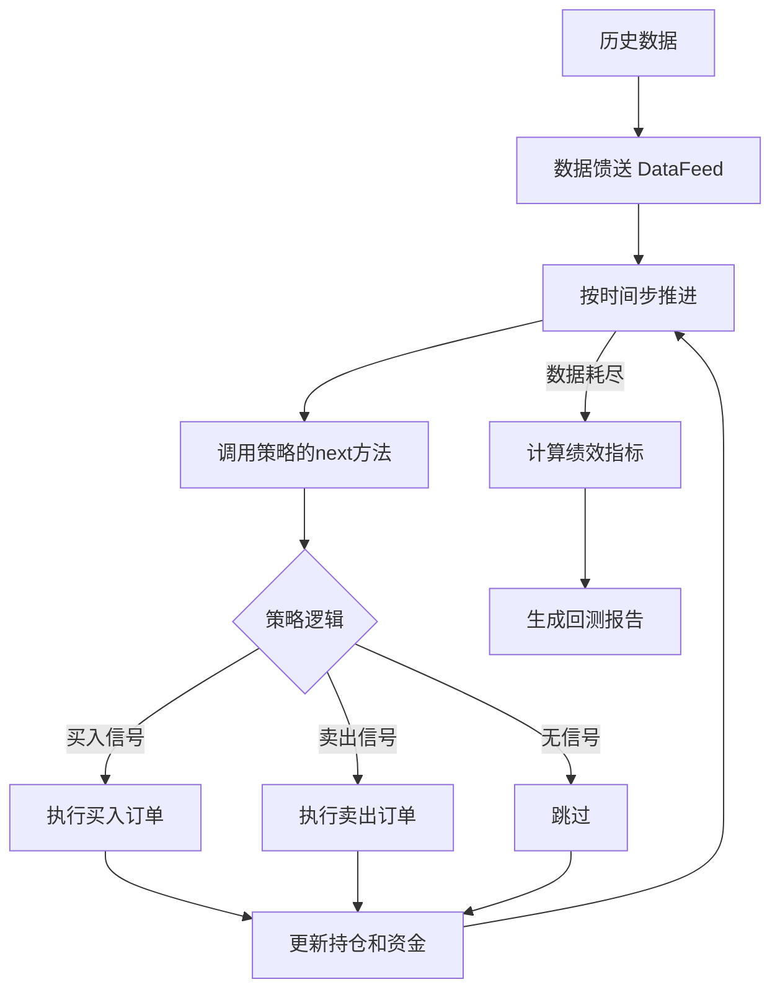
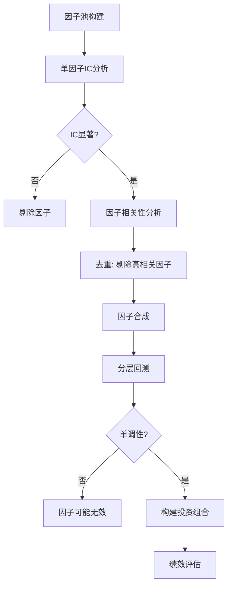
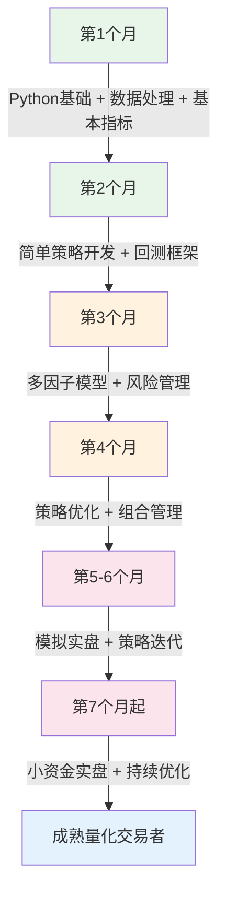

# 第二十八章 量化交易与算法投资 — 练习方法

量化交易是一门实践驱动的技艺。阅读理论只能建立认知框架，真正的能力建设发生在动手编写代码、搭建回测系统、分析策略表现的反复循环中。本章提供一套从零到实盘的完整练习体系，涵盖环境搭建、基础技能、策略开发、风险管理和模拟实战五个阶段，每个阶段都有明确的目标、可执行的代码、验收标准和常见陷阱提示。

## 练习环境搭建

在开始任何量化练习之前，需要搭建一个稳定、可复现的开发环境。环境问题是最常见的学习障碍——许多初学者在"配置环境"这一步就消耗了数周时间，最终丧失了学习动力。

### Python环境配置

推荐使用 Anaconda 或 Miniconda 管理Python环境，因为它预装了数据科学所需的大部分库，且能创建隔离的虚拟环境，避免不同项目之间的依赖冲突。

```bash
# 创建量化交易专用环境
conda create -n quant python=3.11
conda activate quant

# 安装核心依赖
pip install akshare pandas numpy matplotlib mplfinance
pip install backtrader tushare scipy statsmodels
pip install scikit-learn seaborn jupyter notebook

# 验证安装
python -c "import akshare, pandas, backtrader; print('环境配置成功')"
```

**环境配置常见问题及解决方案**：

| 问题 | 原因 | 解决方案 |
|------|------|----------|
| `akshare` 安装失败 | 网络问题或依赖冲突 | `pip install akshare --no-cache-dir` |
| `backtrader` 画图报错 | matplotlib版本不兼容 | `pip install matplotlib==3.7.3` |
| `mplfinance` 安装失败 | 包名变更 | `pip install --upgrade mplfinance` |
| 数据接口返回空值 | API限流或参数错误 | 添加 `time.sleep(1)` 降低请求频率 |
| 中文显示乱码 | matplotlib字体缺失 | 设置 `plt.rcParams['font.sans-serif']=['SimHei']` |

### 数据源选择与对比

量化练习依赖高质量的历史数据。以下是A股常用数据源的对比：

| 数据源 | 免费额度 | 数据质量 | 安装方式 | 适合场景 |
|--------|----------|----------|----------|----------|
| AKShare | 完全免费 | 中等 | `pip install akshare` | 入门练习、个人研究 |
| Tushare Pro | 积分制免费 | 高 | `pip install tushare` | 中级策略开发 |
| 米筐RiceQuant | 平台内免费 | 高 | 在线平台 | 回测与模拟交易 |
| 聚宽JoinQuant | 平台内免费 | 高 | 在线平台 | 策略研究与社区交流 |
| Wind万得 | 付费 | 最高 | 机构安装 | 专业机构研究 |

**建议**：入门阶段使用 AKShare（免费、无门槛），进阶阶段注册 Tushare Pro（需要积累积分获取更完整的数据），模拟实盘阶段使用聚宽或米筐的在线平台（内置回测引擎和模拟交易功能）。

```python
# AKShare 基础数据获取示例
import akshare as ak
import pandas as pd

# 获取个股日线数据
df = ak.stock_zh_a_hist(
    symbol="600519",      # 贵州茅台
    period="daily",       # 日线
    start_date="20210101",
    end_date="20240101",
    adjust="qfq"          # 前复权，处理分红除权
)
print(f"获取到 {len(df)} 条数据")
print(df.head())

# 获取指数数据（沪深300）
index_df = ak.stock_zh_index_daily(symbol="sh000300")
print(f"沪深300数据：{len(index_df)} 条")
```

**数据质量检查清单**：在使用任何数据之前，务必执行以下检查：

1. **缺失值检查**：`df.isnull().sum()`，确认无空值
2. **日期连续性**：检查是否存在非节假日的缺失交易日
3. **价格合理性**：排除异常值（如价格为0或负数）
4. **复权方式**：明确使用前复权还是后复权，策略回测通常使用前复权
5. **存活者偏差**：确认数据是否包含已退市股票，纯选股策略需要包含退市样本

## 第一阶段：基础技能训练（第1-4周）

第一阶段的目标是建立量化交易的技术基础。这四周不追求策略盈利，只追求工具熟练度。就像学钢琴要先练音阶，学量化要先练数据处理。

### 练习1：Python数据处理入门

**目标**：掌握 pandas 的核心操作，能够独立完成股票数据的获取、清洗、计算和可视化。

**为什么这个练习重要**：量化交易80%的工作是数据处理。策略逻辑可能只需要几行代码，但数据清洗、特征工程、结果可视化往往占据绝大部分开发时间。pandas 是这一切的基础工具，必须达到"不用查文档就能写出来"的熟练程度。

**练习内容**：

1. 使用 AKShare 获取贵州茅台（600519）最近3年的日线数据
2. 计算每日收益率（对数收益率和简单收益率）
3. 计算累计收益率并绘制曲线
4. 计算20日、60日、120日移动平均线
5. 绘制K线图叠加均线图
6. 计算并绘制成交量的20日移动平均

**完整参考代码**：

```python
import akshare as ak
import pandas as pd
import numpy as np
import matplotlib.pyplot as plt
import mplfinance as mpf

# ============ 中文显示设置 ============
plt.rcParams['font.sans-serif'] = ['SimHei']
plt.rcParams['axes.unicode_minus'] = False

# ============ 1. 数据获取 ============
df = ak.stock_zh_a_hist(
    symbol="600519", period="daily",
    start_date="20210101", end_date="20240101",
    adjust="qfq"
)
df['日期'] = pd.to_datetime(df['日期'])
df.set_index('日期', inplace=True)
df.rename(columns={'开盘': 'Open', '收盘': 'Close', '最高': 'High',
                    '最低': 'Low', '成交量': 'Volume'}, inplace=True)
print(f"数据范围：{df.index[0]} 至 {df.index[-1]}，共 {len(df)} 个交易日")

# ============ 2. 收益率计算 ============
# 简单收益率 = (今日收盘 - 昨日收盘) / 昨日收盘
df['simple_return'] = df['Close'].pct_change()
# 对数收益率 = ln(今日收盘 / 昨日收盘)，数学性质更好（可加性）
df['log_return'] = np.log(df['Close'] / df['Close'].shift(1))
# 累计收益率
df['cum_return'] = (1 + df['simple_return']).cumprod() - 1

# ============ 3. 移动平均线 ============
for period in [5, 20, 60, 120]:
    df[f'ma{period}'] = df['Close'].rolling(period).mean()

# 成交量均线
df['vol_ma20'] = df['Volume'].rolling(20).mean()

# ============ 4. 绘制收盘价与均线 ============
fig, axes = plt.subplots(2, 1, figsize=(14, 10), gridspec_kw={'height_ratios': [3, 1]})

axes[0].plot(df.index, df['Close'], label='收盘价', linewidth=1.5, color='black')
axes[0].plot(df.index, df['ma20'], label='MA20', linewidth=1, alpha=0.8)
axes[0].plot(df.index, df['ma60'], label='MA60', linewidth=1, alpha=0.8)
axes[0].plot(df.index, df['ma120'], label='MA120', linewidth=1, alpha=0.8)
axes[0].set_title('贵州茅台(600519) 日K线与均线', fontsize=14)
axes[0].legend(loc='upper left')
axes[0].grid(True, alpha=0.3)

# 成交量
colors = ['red' if df['Close'].iloc[i] >= df['Open'].iloc[i] else 'green'
          for i in range(len(df))]
axes[1].bar(df.index, df['Volume'], color=colors, alpha=0.6, width=1)
axes[1].plot(df.index, df['vol_ma20'], color='blue', linewidth=1, label='成交量MA20')
axes[1].set_title('成交量', fontsize=12)
axes[1].legend(loc='upper left')
axes[1].grid(True, alpha=0.3)

plt.tight_layout()
plt.savefig('ma_chart.png', dpi=150, bbox_inches='tight')
plt.show()

# ============ 5. 使用mplfinance绘制专业K线图 ============
mpf_df = df[['Open', 'High', 'Low', 'Close', 'Volume']].copy()
mpf.plot(mpf_df, type='candle', volume=True,
         mav=(20, 60, 120), style='charles',
         title='贵州茅台 K线图', figsize=(14, 8))
```

**验收标准**：
- 能够独立完成数据获取、计算和可视化，代码无报错
- 理解简单收益率和对数收益率的区别（简单收益率更直观，对数收益率具有可加性，更适合统计分析）
- 能够解释每条均线的含义（MA20反映短期趋势，MA60反映中期趋势，MA120反映长期趋势）

**常见错误**：
- 忘记设置 `adjust="qfq"` 导致复权数据错误，回测结果失真
- 直接使用 `df['收盘'].pct_change()` 而没有处理第一天的NaN值
- K线图颜色逻辑错误（应为收盘>开盘为阳线红色，而非涨跌）

***

### 练习2：统计指标计算

**目标**：掌握量化交易核心绩效指标的计算方法和经济学含义。

**为什么这个练习重要**：这些指标是评估任何策略的"标尺"。不理解夏普比率就无法判断策略好坏，不理解最大回撤就无法评估风险。这些指标将贯穿你整个量化交易生涯。

**练习内容**：

1. 计算股票的年化收益率、年化波动率
2. 计算夏普比率（Sharpe Ratio）
3. 计算最大回撤（Maximum Drawdown）及回撤持续时间
4. 计算日收益率的偏度（Skewness）和峰度（Kurtosis）
5. 计算索提诺比率（Sortino Ratio）和卡尔马比率（Calmar Ratio）

**核心公式与完整代码**：

```python
import numpy as np
import pandas as pd
from scipy import stats

def calculate_performance_metrics(daily_returns, risk_free_rate=0.03):
    """
    计算完整的策略绩效指标

    参数:
        daily_returns: pd.Series，日收益率序列（简单收益率）
        risk_free_rate: float，年化无风险利率，默认3%

    返回:
        dict: 包含所有绩效指标的字典
    """
    # 去除NaN
    returns = daily_returns.dropna()
    trading_days = len(returns)

    # ===== 1. 收益指标 =====
    # 累计收益率
    total_return = (1 + returns).prod() - 1
    # 年化收益率（复利计算）
    annual_return = (1 + total_return) ** (252 / trading_days) - 1

    # ===== 2. 风险指标 =====
    # 年化波动率（日标准差 × sqrt(252)）
    annual_volatility = returns.std() * np.sqrt(252)
    # 下行波动率（只计算负收益的标准差，用于索提诺比率）
    downside_returns = returns[returns < 0]
    downside_volatility = downside_returns.std() * np.sqrt(252)

    # ===== 3. 最大回撤 =====
    cum_returns = (1 + returns).cumprod()
    running_max = cum_returns.cummax()
    drawdown = cum_returns / running_max - 1
    max_drawdown = drawdown.min()
    # 最大回撤持续时间
    drawdown_start = drawdown.idxmin()
    # 找到回撤开始点（峰值点）
    peak_before = cum_returns[:drawdown_start].idxmax()
    # 找到恢复点
    recovery_mask = cum_returns[drawdown_start:] >= cum_returns[peak_before]
    if recovery_mask.any():
        recovery_date = recovery_mask.idxmax()
        recovery_days = (recovery_date - drawdown_start).days
    else:
        recovery_date = None
        recovery_days = None  # 尚未恢复

    # ===== 4. 风险调整收益 =====
    # 夏普比率 = (年化收益 - 无风险利率) / 年化波动率
    sharpe_ratio = (annual_return - risk_free_rate) / annual_volatility
    # 索提诺比率 = (年化收益 - 无风险利率) / 下行波动率（只惩罚下行风险）
    sortino_ratio = (annual_return - risk_free_rate) / downside_volatility
    # 卡尔马比率 = 年化收益 / 最大回撤（衡量单位回撤获得的收益）
    calmar_ratio = annual_return / abs(max_drawdown)

    # ===== 5. 分布特征 =====
    skewness = returns.skew()   # 偏度：>0右偏（偶有大赚），<0左偏（偶有大亏）
    kurtosis = returns.kurtosis()  # 峰度：>0厚尾（极端事件多于正态分布）

    # ===== 6. 交易统计 =====
    win_rate = (returns > 0).sum() / len(returns)  # 胜率
    avg_win = returns[returns > 0].mean() if (returns > 0).any() else 0
    avg_loss = returns[returns < 0].mean() if (returns < 0).any() else 0
    profit_loss_ratio = abs(avg_win / avg_loss) if avg_loss != 0 else np.inf

    return {
        '交易天数': trading_days,
        '累计收益率': f'{total_return:.2%}',
        '年化收益率': f'{annual_return:.2%}',
        '年化波动率': f'{annual_volatility:.2%}',
        '夏普比率': f'{sharpe_ratio:.3f}',
        '索提诺比率': f'{sortino_ratio:.3f}',
        '卡尔马比率': f'{calmar_ratio:.3f}',
        '最大回撤': f'{max_drawdown:.2%}',
        '最大回撤持续天数': recovery_days,
        '偏度': f'{skewness:.3f}',
        '峰度': f'{kurtosis:.3f}',
        '日胜率': f'{win_rate:.2%}',
        '盈亏比': f'{profit_loss_ratio:.2f}',
    }


# ============ 使用示例 ============
import akshare as ak
df = ak.stock_zh_a_hist(symbol="600519", period="daily",
                         start_date="20210101", end_date="20240101", adjust="qfq")
df['daily_return'] = df['收盘'].pct_change()
metrics = calculate_performance_metrics(df['daily_return'])
for k, v in metrics.items():
    print(f"{k:>12}: {v}")
```

**指标含义速查表**：

| 指标 | 公式 | 含义 | 优秀标准 |
|------|------|------|----------|
| 夏普比率 | (Rp-Rf)/σp | 单位总风险获得的超额收益 | >1.0 良好，>2.0 优秀 |
| 索提诺比率 | (Rp-Rf)/σd | 单位下行风险获得的超额收益 | >2.0 良好 |
| 卡尔马比率 | Rp/MDD | 单位最大回撤获得的年化收益 | >1.0 良好 |
| 最大回撤 | 最大峰谷跌幅 | 最坏情况下的资金损失 | <20% 稳健 |
| 偏度 | E[(X-μ)³]/σ³ | 收益分布的对称性 | >0 偏右（有利） |
| 峰度 | E[(X-μ)⁴]/σ⁴-3 | 极端事件的概率 | <0 薄尾（稳定） |

**验收标准**：
- 能够正确计算所有指标，输出结果与Excel手工验算一致
- 能够解释每个指标的经济含义，而不仅仅是会算
- 理解夏普比率的局限性（假设正态分布、不区分上行和下行波动）

**常见错误**：
- 年化收益率直接用 `total_return * 252 / days`，这是简单年化，不是复利年化
- 无风险利率使用小数（0.03）还是百分比（3%）搞混
- 最大回撤计算没有用累计净值曲线，而是直接用日收益率

***

### 练习3：搭建回测框架

**目标**：成功搭建 Backtrader 回测环境，理解回测引擎的工作原理，运行第一个策略并解读回测报告。

**为什么这个练习重要**：回测是量化策略开发的核心环节。它让你在不投入真金白银的情况下，验证策略逻辑是否有效。但回测也是最容易产生幻觉的地方——过度拟合、幸存者偏差、未来函数等陷阱无处不在。理解回测引擎的运作机制，是避免这些陷阱的前提。

**回测引擎工作原理**：



**完整回测代码——双均线交叉策略**：

```python
import backtrader as bt
import akshare as ak
import pandas as pd

# ============ 1. 定义数据加载类 ============
class AKShareData(bt.feeds.PandasData):
    """将AKShare数据格式适配为Backtrader数据源"""
    params = (
        ('datetime', None),       # 使用索引作为日期
        ('open', '开盘'),
        ('high', '最高'),
        ('low', '最低'),
        ('close', '收盘'),
        ('volume', '成交量'),
        ('openinterest', -1),     # 股票无持仓量
    )

# ============ 2. 定义策略 ============
class DualMAStrategy(bt.Strategy):
    """
    双均线交叉策略
    - 短期均线上穿长期均线 → 买入
    - 短期均线下穿长期均线 → 卖出
    """
    params = (
        ('fast_period', 10),   # 短期均线周期
        ('slow_period', 30),   # 长期均线周期
        ('printlog', True),
    )

    def __init__(self):
        # 计算指标（Backtrader自动处理数据对齐）
        self.fast_ma = bt.indicators.SMA(self.data.close, period=self.p.fast_period)
        self.slow_ma = bt.indicators.SMA(self.data.close, period=self.p.slow_period)
        # 交叉信号
        self.crossover = bt.indicators.CrossOver(self.fast_ma, self.slow_ma)
        self.order = None

    def log(self, txt, dt=None):
        if self.p.printlog:
            dt = dt or self.datas[0].datetime.date(0)
            print(f'{dt}: {txt}')

    def notify_order(self, order):
        if order.status in [order.Completed]:
            if order.isbuy():
                self.log(f'买入 @ {order.executed.price:.2f}, '
                         f'数量: {order.executed.size:.0f}, '
                         f'手续费: {order.executed.comm:.2f}')
            else:
                self.log(f'卖出 @ {order.executed.price:.2f}, '
                         f'数量: {order.executed.size:.0f}, '
                         f'手续费: {order.executed.comm:.2f}')
        self.order = None

    def next(self):
        if self.order:  # 有未完成订单则跳过
            return
        if not self.position:  # 无持仓
            if self.crossover > 0:  # 金叉
                self.log(f'金叉信号，买入: 价格={self.data.close[0]:.2f}')
                self.order = self.buy()
        else:  # 有持仓
            if self.crossover < 0:  # 死叉
                self.log(f'死叉信号，卖出: 价格={self.data.close[0]:.2f}')
                self.order = self.sell()

# ============ 3. 买入持有基准策略 ============
class BuyAndHold(bt.Strategy):
    """买入持有策略，作为基准对比"""
    def __init__(self):
        self.bought = False

    def next(self):
        if not self.bought:
            # 使用95%资金买入（留5%应对手续费和滑点）
            size = int(self.broker.getcash() * 0.95 / self.data.close[0])
            if size > 0:
                self.buy(size=size)
                self.bought = True

# ============ 4. 运行回测 ============
# 获取数据
df = ak.stock_zh_a_hist(symbol="600519", period="daily",
                         start_date="20200101", end_date="20240101", adjust="qfq")
df['日期'] = pd.to_datetime(df['日期'])
df.set_index('日期', inplace=True)

cerebro = bt.Cerebro()
data = AKShareData(dataname=df)
cerebro.adddata(data)

# 设置初始资金和手续费
cerebro.broker.setcash(100000)              # 初始资金10万
cerebro.broker.setcommission(commission=0.0003)  # 万三手续费
cerebro.addstrategy(DualMAStrategy, fast_period=10, slow_period=30)

# 添加分析器
cerebro.addanalyzer(bt.analyzers.SharpeRatio, _name='sharpe', riskfreerate=0.03)
cerebro.addanalyzer(bt.analyzers.DrawDown, _name='drawdown')
cerebro.addanalyzer(bt.analyzers.Returns, _name='returns')
cerebro.addanalyzer(bt.analyzers.TradeAnalyzer, _name='trades')

print(f'初始资金: {cerebro.broker.getvalue():.2f}')
results = cerebro.run()
print(f'最终资金: {cerebro.broker.getvalue():.2f}')

# ============ 5. 输出回测报告 ============
strat = results[0]
print(f"\n{'='*50}")
print(f"回测绩效报告")
print(f"{'='*50}")
print(f"总收益率: {strat.analyzers.returns.get_analysis()['rtot']:.2%}")
print(f"夏普比率: {strat.analyzers.sharpe.get_analysis()['sharperatio']:.3f}")
print(f"最大回撤: {strat.analyzers.drawdown.get_analysis()['max']['drawdown']:.2%}")

trade_analysis = strat.analyzers.trades.get_analysis()
total_trades = trade_analysis.get('total', {}).get('total', 0)
won = trade_analysis.get('won', {}).get('total', 0)
print(f"总交易次数: {total_trades}")
print(f"盈利次数: {won}")
print(f"胜率: {won/total_trades:.2%}" if total_trades > 0 else "无交易")

cerebro.plot(style='candlestick', volume=True)
```

**验收标准**：
- 能够成功运行回测并输出完整的绩效报告
- 理解 Backtrader 的事件驱动机制（`__init__` → `next` → `notify_order`）
- 能够修改均线参数并观察策略表现变化
- 能够对比双均线策略和买入持有策略的差异

**常见陷阱**：
- **未来函数**：在 `next()` 中引用了当前bar尚未产生的数据（如用当日收盘价开仓，实际应在次日开盘执行）
- **忽略手续费**：不设置 `setcommission`，回测结果虚高
- **忽略滑点**：真实交易中成交价和信号价之间存在差异
- **过度拟合**：在特定股票特定时间段反复调参，导致参数只对历史有效

***

## 第二阶段：策略开发训练（第5-8周）

进入策略开发阶段，目标从"会用工具"升级为"能独立开发策略"。每个练习都要求你理解策略背后的经济学逻辑，而不仅仅是翻译代码。

### 练习4：均值回归策略

**目标**：开发并回测一个基于布林带的均值回归策略，理解均值回归的理论基础和适用条件。

**理论基础**：均值回归（Mean Reversion）假设资产价格会围绕某个中枢上下波动，当价格偏离中枢过远时，有回归中枢的倾向。这个假设在震荡市场中表现良好，但在趋势市场中会频繁止损。

**布林带原理**：布林带由三条线组成——中轨（N日移动平均）、上轨（中轨 + K倍标准差）、下轨（中轨 - K倍标准差）。当价格触及下轨时认为超卖，可能反弹；触及上轨时认为超买，可能回落。

**练习内容**：

1. 实现布林带均值回归策略
2. 在沪深300ETF（510300）上进行回测
3. 进行参数优化（布林带周期10-30，标准差倍数1.5-3.0）
4. 进行参数敏感性分析，判断策略是否过度拟合

**完整策略代码**：

```python
import backtrader as bt
import numpy as np

class BollingerMeanReversion(bt.Strategy):
    """
    布林带均值回归策略
    - 价格触及下轨 → 买入（超卖反弹）
    - 价格触及上轨 → 卖出（超买回落）
    - 价格回到中轨 → 平仓（均值回归完成）
    """
    params = (
        ('period', 20),         # 布林带周期
        ('devfactor', 2.0),     # 标准差倍数
        ('rsi_period', 14),     # RSI周期
        ('rsi_oversold', 30),   # RSI超卖阈值
        ('rsi_overbought', 70), # RSI超买阈值
        ('use_rsi', True),      # 是否使用RSI过滤
        ('printlog', False),
    )

    def __init__(self):
        self.boll = bt.indicators.BollingerBands(
            self.data.close,
            period=self.p.period,
            devfactor=self.p.devfactor
        )
        self.rsi = bt.indicators.RSI(self.data.close, period=self.p.rsi_period)
        self.order = None

    def next(self):
        if self.order:
            return

        if not self.position:
            # 买入条件：价格触及下轨 + RSI超卖（可选过滤）
            buy_signal = self.data.close[0] < self.boll.lines.bot[0]
            if self.p.use_rsi:
                buy_signal = buy_signal and self.rsi[0] < self.p.rsi_oversold
            if buy_signal:
                size = int(self.broker.getcash() * 0.9 / self.data.close[0])
                if size > 0:
                    self.order = self.buy(size=size)
        else:
            # 卖出条件：价格触及上轨 或 回到中轨
            sell_signal = self.data.close[0] > self.boll.lines.top[0]
            if self.p.use_rsi:
                sell_signal = sell_signal or self.rsi[0] > self.p.rsi_overbought
            # 也可以在回到中轨时止盈
            take_profit = self.data.close[0] > self.boll.lines.mid[0]
            if sell_signal or take_profit:
                self.order = self.sell()


# ============ 参数优化 ============
def run_optimization():
    """网格搜索最优参数"""
    cerebro = bt.Cerebro()

    # 获取沪深300ETF数据
    import akshare as ak
    import pandas as pd
    df = ak.fund_etf_hist_sina(symbol="sz510300")
    # ... 数据预处理 ...

    results = []
    for period in range(10, 31, 5):
        for dev in [1.5, 2.0, 2.5, 3.0]:
            cerebro_opt = bt.Cerebro()
            cerebro_opt.adddata(data)
            cerebro_opt.broker.setcash(100000)
            cerebro_opt.broker.setcommission(commission=0.0003)
            cerebro_opt.addstrategy(BollingerMeanReversion,
                                     period=period, devfactor=dev)
            cerebro_opt.addanalyzer(bt.analyzers.SharpeRatio, _name='sharpe')
            cerebro_opt.addanalyzer(bt.analyzers.DrawDown, _name='dd')

            res = cerebro_opt.run()
            strat = res[0]
            sharpe = strat.analyzers.sharpe.get_analysis().get('sharperatio', 0)
            mdd = strat.analyzers.dd.get_analysis()['max']['drawdown']
            final_val = cerebro_opt.broker.getvalue()

            results.append({
                'period': period, 'devfactor': dev,
                'final_value': final_val,
                'sharpe': sharpe if sharpe else 0,
                'max_dd': mdd
            })

    results_df = pd.DataFrame(results)
    print(results_df.sort_values('sharpe', ascending=False).head(10))
    return results_df
```

**参数敏感性分析**：好的策略应该对参数不敏感——参数在合理范围内变化时，策略表现不会剧烈波动。如果最优参数是一个"尖峰"（只在某个特定值表现好），那很可能是过度拟合。

```python
import matplotlib.pyplot as plt

def plot_parameter_sensitivity(results_df):
    """绘制参数敏感性热力图"""
    pivot = results_df.pivot(index='period', columns='devfactor', values='sharpe')
    plt.figure(figsize=(10, 6))
    plt.imshow(pivot, cmap='RdYlGn', aspect='auto')
    plt.colorbar(label='夏普比率')
    plt.xticks(range(len(pivot.columns)), pivot.columns)
    plt.yticks(range(len(pivot.index)), pivot.index)
    plt.xlabel('标准差倍数')
    plt.ylabel('布林带周期')
    plt.title('参数敏感性分析：夏普比率热力图')
    plt.savefig('sensitivity.png', dpi=150)
    plt.show()
```

**进阶挑战**：
- 加入RSI指标作为过滤条件（代码中已包含，设置 `use_rsi=True`）
- 使用自适应布林带：根据近N日波动率动态调整标准差倍数
- 测试策略在不同市场环境（牛市/熊市/震荡）下的表现差异
- 添加仓位管理：波动率高时减仓，波动率低时加仓

**验收标准**：
- 策略有正的年化收益率，夏普比率 > 0.5
- 参数敏感性分析显示策略不是过度拟合（参数空间中表现稳定的区域占比 > 30%）
- 理解均值回归策略的适用条件和局限性

***

### 练习5：动量策略

**目标**：开发一个截面动量策略，理解动量效应的理论基础和A股市场的特殊性。

**理论基础**：动量效应（Momentum Effect）是指过去表现好的资产在未来一段时间内继续表现好的倾向。这与有效市场假说矛盾，是行为金融学的经典异象之一。行为解释包括：投资者对信息反应不足（underreaction）导致价格漂移，以及羊群效应（herding）放大趋势。

**A股动量效应的特殊性**：A股的动量效应与美股不同。短期（1个月内）存在明显的反转效应，中期（3-12个月）存在动量效应，但强度弱于美股。这与A股散户占比高、涨跌停制度、T+1交易制度等因素有关。

**练习内容**：

1. 在沪深300成分股中实现截面动量策略
2. 选择过去12个月动量最强的30只股票（排除最近1个月，避免短期反转）
3. 每月月初调仓一次
4. 计算策略相对于沪深300的超额收益和信息比率

```python
import akshare as ak
import pandas as pd
import numpy as np

class CrossSectionalMomentum:
    """
    截面动量策略框架
    核心逻辑：买入过去N个月涨幅最大的股票，每月调仓
    """

    def __init__(self, lookback=250, skip_recent=20, top_n=30, rebalance_freq='M'):
        """
        参数:
            lookback: 动量计算回望期（交易日数），250≈12个月
            skip_recent: 排除最近N天，避免短期反转效应，20≈1个月
            top_n: 每次持仓股票数量
            rebalance_freq: 调仓频率，'M'=月度，'W'=周度
        """
        self.lookback = lookback
        self.skip_recent = skip_recent
        self.top_n = top_n
        self.rebalance_freq = rebalance_freq

    def calculate_momentum(self, prices_df):
        """
        计算截面动量因子

        参数:
            prices_df: DataFrame，index=日期，columns=股票代码，values=收盘价

        返回:
            DataFrame：每只股票在每个调仓日的动量值
        """
        # 动量 = 过去lookback天的收益率 - 最近skip_recent天的收益率
        # 排除最近1个月的收益（短期反转效应）
        total_return = prices_df / prices_df.shift(self.lookback) - 1
        recent_return = prices_df / prices_df.shift(self.skip_recent) - 1
        momentum = total_return - recent_return
        return momentum

    def select_stocks(self, momentum_series, industry_map=None):
        """
        根据动量因子选股

        参数:
            momentum_series: Series，某一天的截面动量值
            industry_map: dict，股票→行业映射，用于行业中性化

        返回:
            list: 选中的股票代码列表
        """
        valid = momentum_series.dropna()

        if industry_map is not None:
            # 行业中性化：每个行业内选动量最强的N/行业数只
            valid_df = valid.to_frame('momentum')
            valid_df['industry'] = valid_df.index.map(industry_map)
            selected = []
            industries = valid_df['industry'].unique()
            per_industry = max(1, self.top_n // len(industries))
            for ind in industries:
                ind_stocks = valid_df[valid_df['industry'] == ind]
                top = ind_stocks.nlargest(per_industry, 'momentum')
                selected.extend(top.index.tolist())
            return selected[:self.top_n]
        else:
            # 简单方式：选动量最强的top_n只
            return valid.nlargest(self.top_n).index.tolist()

    def backtest(self, prices_df, rebalance_dates):
        """
        回测动量策略

        参数:
            prices_df: 全量价格数据
            rebalance_dates: 调仓日期列表

        返回:
            DataFrame: 策略净值序列
        """
        momentum = self.calculate_momentum(prices_df)
        portfolio_values = []

        for i, date in enumerate(rebalance_dates[:-1]):
            next_date = rebalance_dates[i + 1]
            # 在调仓日选股
            mom = momentum.loc[date]
            selected = self.select_stocks(mom)
            # 计算持仓期间收益（等权）
            period_prices = prices_df.loc[date:next_date, selected]
            if len(period_prices) > 1:
                period_returns = period_prices.iloc[-1] / period_prices.iloc[0] - 1
                period_return = period_returns.mean()  # 等权平均
                portfolio_values.append({
                    'date': next_date,
                    'return': period_return,
                    'n_stocks': len(selected)
                })

        result = pd.DataFrame(portfolio_values).set_index('date')
        result['cum_return'] = (1 + result['return']).cumprod()
        return result


# ============ 运行示例 ============
# 获取沪深300成分股数据
# 注意：实际使用时需要批量获取所有成分股数据，这里给出框架
print("截面动量策略需要批量获取多只股票数据，建议使用聚宽或米筐平台进行回测")
print("或使用AKShare的stock_zh_a_spot_em()获取实时行情快照进行简化回测")
```

**行业中性化的重要性**：如果不做行业中性化，动量策略可能集中买入某个热门行业的股票（如2020年的白酒、2021年的新能源），本质上变成了行业轮动策略而非动量策略。行业中性化确保策略在每个行业内部选择动量最强的个股，消除行业暴露。

**验收标准**：
- 策略年化超额收益 > 5%（相对沪深300）
- 理解动量回望期和跳过期的含义及选择依据
- 理解行业中性化的作用
- 能够分析策略在不同市场环境下的表现差异

***

### 练习6：多因子策略

**目标**：构建一个多因子选股模型，理解因子投资的完整流程。

**理论基础**：多因子模型是现代量化投资的基石。其核心思想是：股票收益可以分解为若干个因子（如价值、质量、动量、波动率等）的线性组合。通过识别和组合有效的因子，可以获得超越基准的收益。

**因子投资的完整流程**：



**练习内容**：

1. 选择5个因子：EP（盈利收益率）、ROE（净资产收益率）、动量（12个月收益）、低波动率（日收益标准差）、SMB（市值因子）
2. 进行单因子IC分析（IC = 因子值与下期收益的秩相关系数）
3. 计算因子间相关性矩阵
4. 构建多因子综合评分模型（IC加权）
5. 进行分层回测（将股票按因子评分分为5层，比较各层收益）

```python
import pandas as pd
import numpy as np
from scipy.stats import spearmanr

class MultiFactorModel:
    """
    多因子选股模型

    因子定义:
    - EP (Earnings to Price): 盈利收益率，= 净利润TTM / 总市值
    - ROE: 净资产收益率，= 净利润TTM / 净资产
    - Momentum: 12个月动量，= 过去12个月收益率（排除最近1个月）
    - Volatility: 低波动因子，= 过去60个交易日日收益率标准差的倒数
    - SMB: 市值因子，= 总市值的倒数（小市值偏好）
    """

    def __init__(self, factor_weights=None):
        self.factor_weights = factor_weights or {
            'EP': 0.25, 'ROE': 0.25, 'momentum': 0.2,
            'low_vol': 0.15, 'SMB': 0.15
        }

    def calculate_single_factor_ic(self, factor_values, forward_returns):
        """
        计算单因子IC（信息系数）

        IC = spearman_rank_correlation(因子值, 下期收益)

        IC均值 > 0.03 视为有效因子
        ICIR = IC均值/IC标准差 > 0.5 视为稳定因子
        """
        valid = pd.DataFrame({
            'factor': factor_values,
            'return': forward_returns
        }).dropna()

        ic, pvalue = spearmanr(valid['factor'], valid['return'])
        return ic, pvalue

    def calculate_ic_series(self, factor_df, returns_df):
        """
        计算逐期IC序列

        参数:
            factor_df: DataFrame，index=日期，columns=股票，values=因子值
            returns_df: DataFrame，index=日期，columns=股票，values=下期收益

        返回:
            Series: 每个截面日期的IC值
        """
        common_dates = factor_df.index.intersection(returns_df.index)
        ic_series = {}
        for date in common_dates:
            fv = factor_df.loc[date]
            rv = returns_df.loc[date]
            valid = pd.DataFrame({'f': fv, 'r': rv}).dropna()
            if len(valid) > 30:
                ic, _ = spearmanr(valid['f'], valid['r'])
                ic_series[date] = ic
        return pd.Series(ic_series)

    def composite_score(self, factor_scores):
        """
        计算多因子综合评分

        方法: IC加权（每个因子的权重与其历史IC均值成正比）
        """
        score = pd.Series(0, index=factor_scores[list(factor_scores.keys())[0]].index)
        for name, values in factor_scores.items():
            # 标准化：截面z-score
            z = (values - values.mean()) / values.std()
            score += z * self.factor_weights.get(name, 0)
        return score

    def quantile_backtest(self, composite_score, forward_returns, n_groups=5):
        """
        分层回测：将股票按综合评分分为N组，比较各组收益

        如果评分从低到高各组收益单调递增，说明因子有效
        """
        groups = pd.qcut(composite_score, n_groups, labels=False, duplicates='drop')
        group_returns = {}
        for g in range(n_groups):
            stocks = groups[groups == g].index
            group_returns[f'Q{g+1}'] = forward_returns[stocks].mean()
        return pd.Series(group_returns)


# ============ 因子有效性评估标准 ============
"""
| 指标        | 优秀    | 良好    | 一般    | 无效    |
|-------------|---------|---------|---------|---------|
| IC均值      | > 0.05  | 0.03-0.05 | 0.02-0.03 | < 0.02 |
| ICIR        | > 1.0   | 0.5-1.0 | 0.3-0.5 | < 0.3   |
| IC胜率      | > 60%   | 55-60%  | 50-55%  | < 50%   |
| 多空收益    | > 15%   | 10-15%  | 5-10%   | < 5%    |
| 分层单调性  | 完全单调 | 基本单调 | 部分单调 | 无规律  |
"""
```

**验收标准**：
- 各单因子IC均值 > 0.02，ICIR > 0.3
- 多因子组合年化超额收益 > 10%（相对沪深300）
- 最大回撤 < 25%
- 分层回测显示明显的单调性（Q5收益 > Q4 > Q3 > Q2 > Q1）

***

## 第三阶段：实战进阶训练（第9-12周）

第三阶段将策略开发与风险管理结合，目标是构建一个可以投入模拟盘的完整交易系统。

### 练习7：风险管理实践

**目标**：在策略中实现完整的风险管理体系，理解"风险管理比收益预测更重要"这一量化交易的核心理念。

**风险管理的三个层次**：

| 层次 | 目标 | 方法 | 触发条件 |
|------|------|------|----------|
| 单笔止损 | 控制单次交易损失 | ATR止损、固定百分比止损 | 每笔交易 |
| 仓位管理 | 控制总体风险暴露 | 凯利公式、波动率目标 | 每次建仓 |
| 组合风控 | 控制组合整体回撤 | 最大回撤控制、相关性管理 | 每日监控 |

**练习内容**：

1. 实现ATR止损机制
2. 实现基于凯利公式的仓位管理
3. 实现最大回撤控制（回撤超过15%减仓50%，超过25%清仓）
4. 对比有无风险管理的策略表现差异

```python
class RiskManager:
    """
    风险管理模块

    集成止损、仓位管理和组合风控三个层次
    """

    def __init__(self, max_position_pct=0.2, max_drawdown_warning=0.15,
                 max_drawdown_stop=0.25):
        """
        参数:
            max_position_pct: 单只股票最大仓位占比
            max_drawdown_warning: 回撤警告阈值，超过则减仓
            max_drawdown_stop: 回撤止损阈值，超过则清仓
        """
        self.max_position_pct = max_position_pct
        self.max_dd_warning = max_drawdown_warning
        self.max_dd_stop = max_drawdown_stop
        self.peak_value = 0

    def atr_stop_loss(self, entry_price, atr, multiplier=2.0):
        """
        ATR止损：止损价 = 入场价 - N倍ATR

        ATR（Average True Range）衡量市场波动性，
        使用ATR设置止损可以自适应不同波动环境

        参数:
            entry_price: 入场价格
            atr: 当前ATR值
            multiplier: ATR倍数，通常1.5-3.0

        返回:
            float: 止损价格
        """
        return entry_price - multiplier * atr

    def kelly_position_size(self, win_rate, win_loss_ratio, kelly_fraction=0.5):
        """
        凯利公式仓位计算

        公式: f* = p - q/b
        其中: p=胜率, q=1-p=败率, b=盈亏比

        实际使用半凯利（kelly_fraction=0.5）以降低波动

        参数:
            win_rate: 历史胜率
            win_loss_ratio: 盈亏比（平均盈利/平均亏损的绝对值）
            kelly_fraction: 凯利缩减系数，0.5=半凯利

        返回:
            float: 建议仓位比例（0-1）
        """
        p = win_rate
        q = 1 - p
        b = win_loss_ratio
        kelly = p - q / b
        # 限制在合理范围内
        kelly = max(0, min(kelly * kelly_fraction, self.max_position_pct))
        return kelly

    def volatility_target_position(self, target_vol, stock_vol, portfolio_value):
        """
        波动率目标仓位管理

        目标：使每只股票对组合的波动率贡献等于目标值

        参数:
            target_vol: 目标年化波动率（如0.15=15%）
            stock_vol: 股票年化波动率
            portfolio_value: 组合总价值

        返回:
            float: 仓位金额
        """
        position_pct = target_vol / stock_vol if stock_vol > 0 else 0
        position_pct = min(position_pct, self.max_position_pct)
        return portfolio_value * position_pct

    def check_drawdown(self, current_value):
        """
        组合回撤控制

        返回:
            str: 'normal' / 'warning' / 'stop'
            float: 建议仓位调整比例
        """
        if current_value > self.peak_value:
            self.peak_value = current_value

        drawdown = (current_value - self.peak_value) / self.peak_value

        if drawdown < -self.max_dd_stop:
            return 'stop', 0.0    # 清仓
        elif drawdown < -self.max_dd_warning:
            return 'warning', 0.5  # 减仓至50%
        else:
            return 'normal', 1.0   # 正常


# ============ 集成到策略中 ============
class StrategyWithRiskManagement(bt.Strategy):
    """带完整风险管理的双均线策略"""
    params = (
        ('fast_period', 10),
        ('slow_period', 30),
        ('atr_period', 14),
        ('atr_multiplier', 2.0),
    )

    def __init__(self):
        self.fast_ma = bt.indicators.SMA(self.data.close, period=self.p.fast_period)
        self.slow_ma = bt.indicators.SMA(self.data.close, period=self.p.slow_period)
        self.crossover = bt.indicators.CrossOver(self.fast_ma, self.slow_ma)
        self.atr = bt.indicators.ATR(self.data, period=self.p.atr_period)
        self.risk_mgr = RiskManager()
        self.stop_price = None
        self.order = None

    def next(self):
        if self.order:
            return

        # 检查组合回撤
        status, adj_ratio = self.risk_mgr.check_drawdown(self.broker.getvalue())
        if status == 'stop' and self.position:
            self.order = self.close()
            return

        if not self.position:
            if self.crossover > 0:
                # 计算仓位大小
                size = int(self.broker.getvalue() * 0.9 / self.data.close[0])
                size = int(size * adj_ratio)
                if size > 0:
                    self.order = self.buy(size=size)
                    # 设置ATR止损
                    self.stop_price = self.risk_mgr.atr_stop_loss(
                        self.data.close[0], self.atr[0], self.p.atr_multiplier)
        else:
            # 检查止损
            if self.data.close[0] < self.stop_price:
                self.order = self.sell()
            # 检查均线死叉
            elif self.crossover < 0:
                self.order = self.sell()
```

**验收标准**：
- 对比有无风险管理的策略：有风险管理的最大回撤应显著降低（至少降低30%）
- 理解ATR止损相对于固定百分比止损的优势（自适应波动率）
- 理解凯利公式的数学原理和半凯利的实际意义
- 理解回撤控制的"刹车"机制

***

### 练习8：策略组合优化

**目标**：将多个策略组合，利用策略间的低相关性实现风险分散，优化整体表现。

**核心原理**：现代投资组合理论（Markowitz, 1952）证明，在给定收益水平下，通过组合低相关性资产可以降低整体风险。这个原理同样适用于策略组合——如果策略A在牛市表现好，策略B在熊市表现好，那么组合A+B的波动率会低于单独持有任何一个策略。

**练习内容**：

1. 选择2-3个相关性较低的策略（如均值回归 + 动量 + 多因子）
2. 计算等权组合和风险平价组合的表现
3. 进行均值-方差优化（最大化夏普比率）
4. 分析组合的风险分散效果

```python
import numpy as np
import pandas as pd
from scipy.optimize import minimize

class PortfolioOptimizer:
    """
    策略组合优化器

    支持三种组合方法:
    1. 等权组合
    2. 风险平价组合
    3. 最大夏普比率组合
    """

    def __init__(self, returns_df):
        """
        参数:
            returns_df: DataFrame，index=日期，columns=策略名，values=日收益率
        """
        self.returns = returns_df
        self.n_assets = len(returns_df.columns)
        self.names = returns_df.columns.tolist()

    def equal_weight(self):
        """等权组合"""
        return np.ones(self.n_assets) / self.n_assets

    def risk_parity(self):
        """
        风险平价组合：使每个策略对组合风险的贡献相等

        原理：波动率高的策略分配较低权重，波动率低的策略分配较高权重
        """
        cov = self.returns.cov().values * 252  # 年化协方差矩阵
        vol = np.sqrt(np.diag(cov))

        def risk_contribution(weights):
            portfolio_vol = np.sqrt(weights @ cov @ weights)
            marginal_risk = cov @ weights
            risk_contrib = weights * marginal_risk / portfolio_vol
            # 目标：各策略风险贡献相等
            target = portfolio_vol / self.n_assets
            return np.sum((risk_contrib - target) ** 2)

        constraints = {'type': 'eq', 'fun': lambda w: np.sum(w) - 1}
        bounds = [(0.05, 0.5)] * self.n_assets  # 单策略权重5%-50%
        x0 = self.equal_weight()

        result = minimize(risk_contribution, x0, method='SLSQP',
                         bounds=bounds, constraints=constraints)
        return result.x

    def max_sharpe(self, risk_free_rate=0.03):
        """
        最大夏普比率组合

        在有效前沿上找到夏普比率最高的点
        """
        mean_returns = self.returns.mean() * 252
        cov = self.returns.cov() * 252

        def neg_sharpe(weights):
            port_return = weights @ mean_returns.values
            port_vol = np.sqrt(weights @ cov.values @ weights)
            return -(port_return - risk_free_rate) / port_vol

        constraints = {'type': 'eq', 'fun': lambda w: np.sum(w) - 1}
        bounds = [(0.05, 0.5)] * self.n_assets
        x0 = self.equal_weight()

        result = minimize(neg_sharpe, x0, method='SLSQP',
                         bounds=bounds, constraints=constraints)
        return result.x

    def compare_methods(self):
        """对比三种组合方法的表现"""
        results = {}
        for name, method in [('等权', self.equal_weight),
                              ('风险平价', self.risk_parity),
                              ('最大夏普', self.max_sharpe)]:
            weights = method()
            port_returns = (self.returns * weights).sum(axis=1)
            annual_ret = port_returns.mean() * 252
            annual_vol = port_returns.std() * np.sqrt(252)
            sharpe = (annual_ret - 0.03) / annual_vol
            cum = (1 + port_returns).cumprod()
            mdd = (cum / cum.cummax() - 1).min()

            results[name] = {
                '权重': {n: f'{w:.1%}' for n, w in zip(self.names, weights)},
                '年化收益': f'{annual_ret:.2%}',
                '年化波动': f'{annual_vol:.2%}',
                '夏普比率': f'{sharpe:.3f}',
                '最大回撤': f'{mdd:.2%}'
            }
        return pd.DataFrame(results).T
```

**验收标准**：
- 组合策略的最大回撤低于任何单一策略
- 理解等权、风险平价、均值-方差优化三种方法的优缺点
- 能够解释"风险分散效应"的数学原理

***

### 练习9：模拟实盘交易

**目标**：使用模拟资金进行至少3个月的实盘交易，验证策略在真实市场环境中的表现。

**为什么模拟盘必不可少**：回测和实盘之间存在巨大鸿沟。回测中不存在的问题——滑点、流动性不足、情绪干扰、系统故障、数据延迟——在实盘中会一一暴露。模拟盘是跨越这个鸿沟的桥梁。

**练习内容**：

1. 在聚宽或米筐平台上创建模拟交易账户
2. 将优化后的策略部署到模拟盘
3. 每天记录策略的持仓、收益和交易情况
4. 每周进行策略表现回顾
5. 分析模拟盘与回测结果的差异

**模拟盘交易日志模板**：

```python
import json
from datetime import datetime

class TradingJournal:
    """交易日志，记录每笔交易的逻辑和结果"""

    def __init__(self, filepath='trading_journal.json'):
        self.filepath = filepath
        self.entries = []

    def log_trade(self, date, action, symbol, price, shares, reason):
        """记录一笔交易"""
        entry = {
            'date': date,
            'action': action,      # 'BUY' or 'SELL'
            'symbol': symbol,
            'price': price,
            'shares': shares,
            'reason': reason,       # 交易理由，必须写！
            'timestamp': datetime.now().isoformat()
        }
        self.entries.append(entry)
        self.save()

    def log_daily_summary(self, date, portfolio_value, cash, positions, notes):
        """记录每日总结"""
        entry = {
            'date': date,
            'type': 'daily_summary',
            'portfolio_value': portfolio_value,
            'cash': cash,
            'positions': positions,
            'notes': notes
        }
        self.entries.append(entry)
        self.save()

    def weekly_review(self, week_start, week_end):
        """生成周度回顾"""
        week_entries = [e for e in self.entries
                       if week_start <= e.get('date', '') <= week_end]
        trades = [e for e in week_entries if 'action' in e]
        summaries = [e for e in week_entries if e.get('type') == 'daily_summary']

        review = {
            'week': f'{week_start} ~ {week_end}',
            'total_trades': len(trades),
            'buy_trades': len([t for t in trades if t['action'] == 'BUY']),
            'sell_trades': len([t for t in trades if t['action'] == 'SELL']),
            'start_value': summaries[0]['portfolio_value'] if summaries else 0,
            'end_value': summaries[-1]['portfolio_value'] if summaries else 0,
        }
        if review['start_value'] > 0:
            review['weekly_return'] = (review['end_value'] / review['start_value'] - 1)
        return review

    def save(self):
        with open(self.filepath, 'w', encoding='utf-8') as f:
            json.dump(self.entries, f, ensure_ascii=False, indent=2)
```

**模拟盘与回测差异分析框架**：

| 差异来源 | 回测假设 | 模拟盘现实 | 影响程度 |
|----------|----------|------------|----------|
| 滑点 | 成交价 = 信号价 | 成交价有偏差 | 中等（0.1-0.5%） |
| 流动性 | 无限流动性 | 大单可能无法成交 | 高（小盘股显著） |
| 涨跌停 | 通常忽略 | 无法买入涨停、卖出跌停 | 高（极端行情） |
| 数据延迟 | 使用收盘价 | 实时数据有延迟 | 低（分钟级策略显著） |
| 手续费 | 简单设定 | 包含印花税、过户费等 | 低（0.1-0.2%） |
| 情绪干扰 | 不存在 | 恐惧和贪婪影响决策 | 最高 |

**验收标准**：
- 模拟盘至少运行3个月，覆盖不同的市场环境
- 每笔交易都有明确的文字记录（买卖理由）
- 能够量化模拟盘与回测结果的差异，并归因分析
- 建立了交易纪律：不因情绪干预策略信号

**注意事项**：
- 模拟盘运行初期不要急于优化策略，先观察策略在不同行情下的自然表现
- 记录每一次策略的买入卖出逻辑，这些记录是后续改进的宝贵素材
- 关注滑点对策略收益的影响——如果滑点吃掉了大部分利润，说明策略的交易频率太高或流动性太差

***

## 持续学习建议

### 推荐学习路径

量化交易的学习路径不是线性的，而是螺旋上升的。以下路径图展示了从入门到实盘的完整进程，但实际学习中需要在各阶段之间反复迭代：



### 推荐书籍

**入门级**（适合前3个月）：
1. **《打开量化投资的黑箱》**——里什·纳兰著。用通俗语言解释量化投资的核心概念，不需要编程基础，适合建立整体认知框架。
2. **《Python for Finance》**——Yves Hilpisch著。Python金融编程实战指南，从数据获取到回测系统搭建，代码示例丰富。
3. **《量化投资：策略与技术》**——丁鹏著。A股市场视角的量化入门书，包含大量A股特有的策略案例。

**进阶级**（适合3-6个月）：
4. **《主动投资组合管理》**——Grinold & Kahn著。因子投资理论的经典之作，系统讲解了信息比率、因子模型、组合构建等核心理论。
5. **《Quantitative Equity Portfolio Management》**——Chincarini & Kim著。量化组合管理的完整方法论，从因子选择到组合优化。
6. **《Advances in Financial Machine Learning》**——Marcos López de Prado著。机器学习在金融中的前沿应用，提出了很多反直觉但实用的方法（如元标签、分步回测等）。

**高级**（适合6个月以上）：
7. **《Algorithmic Trading》**——Ernie Chan著。实战导向的算法交易书，涵盖均值回归、动量、高频等策略。
8. **《Inside the Black Box》**——Rishi Narayan著。深入理解量化基金的运作方式。

### 推荐社区与平台

| 平台/社区 | 特点 | 适合阶段 | 网址 |
|-----------|------|----------|------|
| 聚宽社区 | 大量A股策略分享，数据丰富 | 入门-进阶 | joinquant.com |
| 米筐社区 | 优质教程，回测引擎强大 | 入门-进阶 | ricequant.com |
| 优矿 | 专业研究平台 | 进阶 | uqer.datayes.com |
| QuantConnect | 全球市场，开源引擎 | 进阶-高级 | quantconnect.com |
| GitHub量化项目 | 开源策略和工具 | 所有阶段 | 搜索"quant"/"trading" |
| 知乎量化板块 | 国内量化讨论活跃 | 入门-进阶 | zhihu.com |
| Quantopian Archive | 经典教程和Notebooks | 入门-进阶 | 已关闭但内容仍可搜索到 |

### 常见学习误区与纠正

| 误区 | 为什么是错的 | 正确做法 |
|------|------------|----------|
| 追求"圣杯策略" | 不存在永远有效的策略 | 建立策略组合，持续迭代 |
| 只关注收益不关注风险 | 高收益往往伴随高风险 | 夏普比率 > 收益率 |
| 回测赚了就认为策略有效 | 可能是过度拟合 | 样本外测试 + 模拟盘验证 |
| 跳过模拟盘直接实盘 | 回测与实盘差距巨大 | 至少3个月模拟盘 |
| 频繁更换策略 | 策略需要时间验证 | 坚持一个策略至少6个月 |
| 忽视交易成本 | 手续费和滑点会侵蚀利润 | 在回测中包含真实交易成本 |
| 过度优化参数 | 参数越多越容易拟合 | 参数不超过3-5个 |

### 量化交易能力自评量表

在完成12周的练习后，用以下量表评估自己的能力水平：

| 能力维度 | 入门（1分） | 进阶（2分） | 熟练（3分） | 精通（4分） |
|----------|------------|------------|------------|------------|
| 数据处理 | 能获取数据 | 能清洗和计算指标 | 能构建特征工程管线 | 能处理高频数据 |
| 策略开发 | 能实现简单策略 | 能开发多因子策略 | 能设计策略组合 | 能研发另类策略 |
| 回测系统 | 能运行回测 | 能自定义分析器 | 能搭建完整回测框架 | 能处理回测偏差 |
| 风险管理 | 理解止损概念 | 能实现仓位管理 | 能构建风控体系 | 能管理多策略风险 |
| 实盘经验 | 无 | 有模拟盘经验 | 有小资金实盘 | 有持续盈利记录 |

> **本节要点**：量化交易的学习是一个循序渐进的过程，从基础的数据处理到策略开发，再到风险管理，每一步都需要扎实的实践。建议用至少3个月的时间进行系统学习和模拟交易，再考虑小资金实盘。记住，量化交易的核心不是"预测市场"，而是"管理风险"。一个能稳定控制回撤的策略，远比一个高收益但波动剧烈的策略更有价值。
