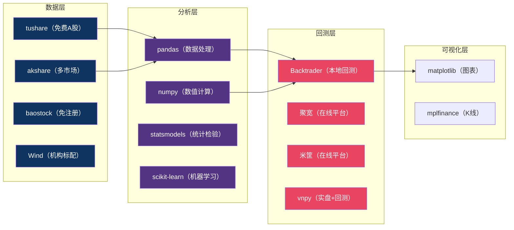
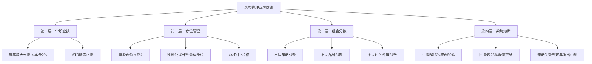

# 第二十八章 量化交易与算法投资 — 本章小结

## 本章全景回顾

本章从零基础出发，沿"理论→方法→实操→风控→进阶"的完整路径，系统性地讲解了量化交易与算法投资的全部核心内容。本小结将用一张知识架构图串联全章脉络，然后逐层梳理关键知识点，最后给出可落地的行动清单。

```mermaid
graph TD
    A["量化交易与算法投资"] --> B["理论基础"]
    A --> C["核心技巧"]
    A --> D["实战案例"]
    A --> E["风险与纠偏"]
    A --> F["深度拓展"]

    B --> B1["Alpha / Beta / 夏普比率"]
    B --> B2["最大回撤 / 胜率 / 盈亏比"]
    B --> B3["回测原理与偏差防范"]
    B --> B4["策略分类体系"]
    B --> B5["因子投资入门"]

    C --> C1["均值回归 / 动量 / 统计套利"]
    C --> C2["CTA趋势跟踪"]
    C --> C3["Python工具链"]
    C --> C4["回测框架实操"]
    C --> C5["因子投资实操"]
    C --> C6["实盘部署"]

    D --> D1["A股双均线"]
    D --> D2["多因子选股"]
    D --> D3["期货CTA"]
    D --> D4["可转债量化"]
    D --> D5["ETF轮动"]
    D --> D6["机器学习预测"]
    D --> D7["CTA趋势跟踪"]

    E --> E1["十大认知误区"]
    E --> E2["风险管理框架"]

    F --> F1["机器学习与深度学习"]
    F --> F2["高频交易架构"]
    F --> F3["监管环境"]
    F --> F4["未来趋势"]

    style A fill:#1a1a2e,stroke:#e94560,color:#fff
    style B fill:#16213e,stroke:#0f3460,color:#fff
    style C fill:#16213e,stroke:#0f3460,color:#fff
    style D fill:#16213e,stroke:#0f3460,color:#fff
    style E fill:#16213e,stroke:#0f3460,color:#fff
    style F fill:#16213e,stroke:#0f3460,color:#fff
```



---

## 一、理论基础：建立量化思维框架

### 1.1 核心概念体系

量化交易的本质是将投资决策从"凭感觉"升级为"凭数据"。理解以下核心概念是整个量化大厦的地基：

| 概念 | 定义 | 实用判断标准 | 为什么重要 |
|------|------|-------------|-----------|
| Alpha（α） | 超越市场基准的超额收益 | 正Alpha = 跑赢市场 | 量化交易的根本目标就是捕获正Alpha |
| Beta（β） | 与市场整体的联动程度 | β=1同步市场，β>1放大波动 | 决定策略承受的系统性风险大小 |
| 夏普比率 | 风险调整后收益的度量 | >1较好，>2优秀，>3需警惕过拟合 | 同等收益下选波动更小的策略，同等波动下选收益更高的策略 |
| 最大回撤 | 历史最大净值跌幅 | <10%稳健，10-20%可接受，>30%风险过高 | 衡量你可能面临的最坏情况，决定你能否扛得住 |
| 胜率 | 盈利交易占比 | 50%以上为佳，但非唯一指标 | 高胜率低盈亏比不如低胜率高盈亏比 |
| 盈亏比 | 平均盈利/平均亏损 | >2:1为佳 | 与胜率配合计算期望收益，决定策略是否长期为正 |
| 信息比率 | 超额收益/跟踪误差 | >0.5表示有选股能力 | 衡量主动管理能力的稳定性 |

**核心公式速查卡**：

```text
期望收益 = 胜率 × 平均盈利 - (1 - 胜率) × 平均亏损
夏普比率 = (年化收益 - 无风险利率) / 年化波动率
最大回撤 = (最高点净值 - 最低点净值) / 最高点净值
信息比率 = 策略超额收益 / 跟踪误差
```

**关键洞察**：年化收益50%但波动率80%的策略（夏普=0.625），未必比年化收益15%但波动率10%的策略（夏普=1.5）更好。量化交易追求的是"单位风险的回报最大化"，而非单纯追求高收益。

### 1.2 回测方法论

回测是量化策略的"实验室"，但实验室结果能否代表真实世界，取决于你是否正确处理了以下关键问题：

| 问题 | 描述 | 后果 | 应对方法 |
|------|------|------|---------|
| 存活者偏差 | 只用现存股票回测，忽略退市股票 | 回测收益虚高10%-30% | 使用含退市股票的全历史数据库 |
| 前视偏差 | 使用了未来才知道的信息 | 策略在实盘中完全失效 | 严格使用"当时可得"的数据 |
| 过度拟合 | 参数过度适配历史噪声 | 样本外表现暴跌 | 减少参数数量，做参数敏感性分析 |
| 交易成本低估 | 忽略滑点、冲击成本 | 实盘收益大幅低于回测 | 按单边0.15%-0.2%估算A股交易成本 |
| 数据频率错配 | 日线回测高频策略 | 回测结果无参考价值 | 数据频率≥策略交易频率 |

**回测的黄金法则**：如果一个策略的回测收益好到令人难以置信，那它大概率就不可信。真正好的策略，在回测中通常"看起来还不错但不惊艳"——因为它没有过度拟合历史噪声。

### 1.3 策略分类体系

量化策略可以从三个维度分类，理解分类体系有助于找到适合自己的方向：

**按交易频率**：

| 频率 | 持仓时间 | 特点 | 适合人群 |
|------|---------|------|---------|
| 高频（HFT） | 毫秒-分钟 | 需要专业硬件、机房托管、极低延迟 | 机构投资者（个人基本无法参与） |
| 中频 | 小时-天 | 大多数量化私募的主力策略 | 有编程能力的专业投资者 |
| 低频 | 周-月 | 接近传统投资，但决策系统化 | 入门级量化投资者（推荐从这里开始） |

**按策略逻辑**：趋势跟踪（顺势而为）、均值回归（逆势交易）、统计套利（价差回归）、因子投资（多因子综合评分）——四大类型各有适用场景，没有绝对优劣。

### 1.4 因子投资核心

因子投资是当前量化投资的主流方法论，其核心是找到能够解释资产收益差异的系统性特征：

**五大经典因子**：

| 因子 | 逻辑 | A股有效性 | 典型指标 |
|------|------|----------|---------|
| 价值因子 | 低估值股票长期跑赢高估值 | 有效但近年有所衰减 | PE、PB、EP |
| 动量因子 | 过去涨得好的短期继续涨 | A股短期反转、中期动量 | 过去3-12个月收益率 |
| 质量因子 | 高质量公司具有超额收益 | 稳定有效 | ROE、毛利率、资产负债率 |
| 规模因子 | �市值股票长期跑赢大市值 | A股尤为明显（但2017年后衰减） | 总市值、流通市值 |
| 波动率因子 | 低波动股票风险调整后更优 | 有效 | 日收益率标准差 |

**因子检验标准**：IC均值 > 0.03为有效，IC_IR > 0.5为稳定，因子间相关性 < 0.3为理想的多因子组合。

---

## 二、核心技巧：从策略到实盘的完整链条

### 2.1 四大核心策略对比

| 策略 | 核心逻辑 | 适用市场 | 代表方法 | A股实操要点 |
|------|---------|---------|---------|------------|
| 均值回归 | 价格偏离均值后回归 | 震荡市 | 布林带策略 | 结合RSI过滤假信号；震荡市效果好，趋势市需回避 |
| 动量策略 | 强者恒强 | 趋势市 | 截面动量 | A股短期反转强，建议排除最近5天收益；中长期动量较弱 |
| 统计套利 | 相关资产价差回归 | 各种市况 | 配对交易 | 需通过协整检验（p<0.05）；注意配对关系的稳定性 |
| CTA策略 | 跟踪期货趋势 | 大宗商品、金融期货 | 海龟法则 | 双向交易（多空均可）；与股票相关性低，配置价值高 |

### 2.2 工具链全景



**数据源选择建议**：

- **入门阶段**：akshare（免费、安装简单、数据覆盖面广）
- **研究阶段**：tushare（数据质量更好，需注册获取token）
- **专业阶段**：Wind（数据最全最准，但年费数万元）
- **在线平台**：聚宽（社区活跃、策略分享丰富）、米筐（界面友好、适合初学者）

### 2.3 风险管理四层防线

风险管理比策略研发更重要——这是本章反复强调的核心观点。专业量化机构将至少30%的资源投入风控，而非策略开发。



**凯利公式**（计算最优仓位比例）：

```text
最优仓位 = (胜率 × 盈亏比 - (1 - 胜率)) / 盈亏比

示例：胜率50%，盈亏比2:1
最优仓位 = (0.5 × 2 - 0.5) / 2 = 0.25（即25%）
实际使用建议取凯利值的一半（半凯利），降低破产风险
```

---

## 三、实战案例复盘：七个案例的核心教训

本章通过七个真实案例展示了量化策略从开发到实盘的完整过程。以下是每个案例的核心启示：

| 案例 | 策略类型 | 核心收益 | 关键教训 |
|------|---------|---------|---------|
| A股双均线 | 趋势跟踪 | 入门级练习 | 简单策略也能跑赢基准；交易成本对低频策略影响有限 |
| 多因子选股 | 因子投资 | 年化超额10%+ | 因子检验是关键；IC_IR比IC均值更重要 |
| 期货CTA | 趋势跟踪 | 双向获利 | 与股票市场低相关，配置价值高；止损纪律至关重要 |
| 可转债量化 | 套利/价值 | 低风险稳健 | 可转债下有保底上有弹性；信用风险筛选不可忽略 |
| ETF轮动 | 动量/配置 | 适合懒人 | 低频调仓、低交易成本；动量窗口期需反复测试 |
| 机器学习预测 | ML回归/分类 | 潜在高收益 | 过拟合是最大威胁；特征工程比模型选择更重要 |
| CTA趋势跟踪 | 期货趋势 | 极端行情盈利 | 趋势策略在震荡市回撤大；需要心理承受能力 |

**来自失败案例的五大教训**：

1. **过度拟合的陷阱**：回测年化100%的策略，实盘可能亏损——参数越多、条件越复杂，过拟合风险越大
2. **流动性幻觉**：小市值股票回测漂亮，实盘根本买不到/卖不掉——回测必须加入流动性约束
3. **策略拥挤**：当所有人都在用同一个策略（如小市值因子），超额收益会被迅速套利掉
4. **黑天鹅事件**：2015年股灾、2020年新冠暴跌——极端行情下策略可能同时失效，必须有熔断机制
5. **情绪破坏纪律**：回撤时手动干预策略是最常见的亏损原因——如果无法做到完全信任系统，就不要上实盘

---

## 四、十大误区深度解析

十大误区是本章最实用的内容之一。以下用"误区→真相→正确做法"的结构进行深度解析：

### 误区1：量化交易 = 稳赚不赔
- **真相**：文艺复兴科技（全球最成功的量化基金）也有亏损年份。A股量化私募2022年平均收益为负
- **正确做法**：把量化看作"提高胜率的工具"而非"印钞机"

### 误区2：回测收益高 = 好策略
- **真相**：回测收益可能是过拟合、存活者偏差、前视偏差制造的"幻觉"
- **正确做法**：必须做样本外测试、参数敏感性分析、多品种多时段交叉验证

### 误区3：策略越复杂越好
- **真相**：海龟交易法则只有几条简单规则，却是史上最成功的趋势跟踪策略之一
- **正确做法**：先简后繁，每增加一个参数必须验证其真实贡献

### 误区4：数据越多越好
- **真相**：数据质量远比数量重要。10年前的A股市场结构与现在完全不同
- **正确做法**：选可靠数据源，使用含退市股票的全历史数据

### 误区5：忽视风险管理
- **真相**：风险管理比策略研发更重要——专业机构至少30%资源投入风控
- **正确做法**：建立四层风控防线（个股止损→仓位管理→组合分散→系统熔断）

### 误区6：纯技术面就够了
- **真相**：随着量化交易普及，纯技术面策略竞争加剧、有效性下降
- **正确做法**：基本面+技术面+另类数据多维度融合

### 误区7：别人赚钱的策略我用也赚钱
- **真相**：资金规模、执行速度、市场环境、心理承受力都影响策略效果
- **正确做法**：理解策略逻辑而非照搬参数，根据自身情况调整

### 误区8：编好程序就不用管了
- **真相**：市场环境在变，策略需要持续监控、定期维护和适时调整
- **正确做法**：建立策略监控体系，设定预警指标，定期回顾策略表现

### 误区9：量化一定能战胜主观
- **真相**：两者各有优劣。量化擅长纪律性执行，主观擅长应对黑天鹅
- **正确做法**：量化筛选标的+管理风险，主观判断处理极端情况

### 误区10：门槛很高，普通人学不会
- **真相**：基础量化策略只需要高中数学+基本Python。在线平台进一步降低了门槛
- **正确做法**：从最简单的均线策略开始，逐步进阶

---

## 五、深度拓展：面向未来的关键方向

### 5.1 机器学习与深度学习在量化中的应用

| 技术 | 量化应用场景 | 优势 | 局限 |
|------|------------|------|------|
| 监督学习（XGBoost/LightGBM） | 因子挖掘、收益预测 | 特征重要性可解释 | 金融数据信噪比极低，过拟合风险大 |
| LSTM/GRU | 价格走势预测 | 捕捉时间序列长期依赖 | 梯度消失、对超参数敏感 |
| Transformer | 多资产联动预测 | 自注意力机制捕捉任意位置关系 | 训练成本高、需要大量数据 |
| 图神经网络（GNN） | 产业链联动、相关性建模 | 模拟资产间复杂关系 | 图结构构建依赖领域知识 |
| 强化学习 | 最优执行、组合管理 | 自适应市场变化 | 模拟环境与真实市场差异大 |
| 大语言模型（LLM） | 新闻/研报情绪分析 | 处理非结构化文本数据 | 幻觉问题、实时性要求高 |

**机器学习在量化中的核心陷阱**：金融数据的信噪比极低（噪声远多于信号），任何模型都容易在噪声上过拟合。应对方法包括：时间序列交叉验证（而非随机切分）、正则化、独立样本外测试、多重假设检验校正（Bonferroni校正）。

### 5.2 高频交易与量化交易的民主化

高频交易（HFT）是量化交易的"顶级赛道"，需要FPGA硬件、共置机房、纳秒级延迟优化，个人投资者基本无法参与。但与此同时，量化交易正在经历"民主化"浪潮：

- **开源工具普及**：Backtrader、Zipline、QuantConnect让任何人都能开发策略
- **云计算降低门槛**：个人投资者也能运行复杂模型
- **在线平台成熟**：聚宽、米筐提供免费的回测和模拟交易环境
- **数据获取便利化**：tushare、akshare等免费数据源让数据不再是壁垒

### 5.3 全球监管趋势

| 地区 | 监管态度 | 关键规定 |
|------|---------|---------|
| 美国 | 严格监管 | SEC要求高频交易商注册；CAT系统追踪所有交易 |
| 欧盟 | 严格监管 | MiFID II要求算法策略报备；禁止"订单闪烁" |
| 中国 | 逐步规范 | 2023年证监会要求程序化交易报备；T+0限制高频空间 |

**合规提醒**：如果你的量化策略涉及大量自动下单，务必了解所在市场的报备和合规要求。A股程序化交易需要向交易所报告相关信息。

### 5.4 未来趋势展望

1. **AI驱动策略发现**：大语言模型和进化算法自动搜索盈利策略组合
2. **另类数据深度应用**：卫星图像、信用卡数据、网络爬虫数据成为新的Alpha来源
3. **DeFi链上量化**：DEX套利、MEV提取、流动性优化成为新战场
4. **量子计算**：潜在应用于投资组合优化和衍生品定价（10-20年时间尺度）

---

## 六、自我评估：你掌握了本章的多少？

完成本章学习后，用以下清单检验自己的掌握程度。能回答80%以上的问题，说明你已经建立了扎实的量化交易知识框架：

### 基础概念（理论层）
- [ ] 能解释Alpha和Beta的区别，并说明为什么量化交易追求正Alpha
- [ ] 能手动计算夏普比率、最大回撤、期望收益
- [ ] 能说出夏普比率>1和>3分别意味着什么
- [ ] 能解释什么是存活者偏差、前视偏差、过度拟合

### 策略理解（方法层）
- [ ] 能说出均值回归和趋势跟踪的核心区别及各自适用场景
- [ ] 能解释配对交易的基本原理和协整检验的作用
- [ ] 能说明A股动量策略的特殊性（短期反转效应）
- [ ] 能说出CTA策略的三大优势

### 工具实操（器物层）
- [ ] 能用Python获取A股历史数据并计算技术指标
- [ ] 能用Backtrader或聚宽实现一个简单的回测
- [ ] 能解读回测报告中的关键指标

### 风险管理（生存层）
- [ ] 能说出风险管理的四层防线
- [ ] 能用凯利公式计算最优仓位
- [ ] 能解释为什么"风险管理比策略研发更重要"

### 认知升级（思维层）
- [ ] 能说出量化交易的至少三个常见误区及正确做法
- [ ] 能解释为什么简单策略往往比复杂策略更稳健
- [ ] 能说明量化交易和主观交易各自的优劣

---

## 七、行动清单：从知识到实践的路径

### 立即行动（本周）

1. **搭建开发环境**：安装Python + pandas + numpy + akshare + backtrader
2. **获取第一份数据**：用akshare获取贵州茅台（600519）近3年日线数据
3. **计算核心指标**：年化收益率、年化波动率、夏普比率、最大回撤
4. **运行第一个回测**：在Backtrader中实现双均线交叉策略

### 短期目标（1-3个月）

1. **掌握三个策略**：均值回归、动量策略、统计套利各实现一个
2. **完成多因子模型**：选择3-5个因子，构建综合评分模型
3. **建立风控体系**：实现ATR止损、仓位管理、最大回撤控制
4. **在线平台练习**：在聚宽或米筐上至少运行5个不同策略

### 中期目标（3-6个月）

1. **模拟实盘验证**：至少3个月的模拟交易，覆盖不同市场环境
2. **策略组合优化**：将2-3个低相关策略组合，优化整体夏普比率
3. **因子研究深化**：单因子IC分析、因子相关性管理、分层回测
4. **阅读经典书籍**：至少读完推荐书单中的2本

### 长期目标（6个月以上）

1. **小资金实盘**：用不超过总资产10%的资金进行实盘验证
2. **持续迭代优化**：建立策略监控体系，定期回顾和调整
3. **探索进阶方向**：根据兴趣选择机器学习、另类数据或DeFi量化
4. **构建完整体系**：形成自己的"策略研发→回测验证→实盘交易→风控管理"闭环

### 推荐阅读书单

| 书名 | 作者 | 定位 | 核心价值 |
|------|------|------|---------|
| 《打开量化投资的黑箱》 | 里什·纳兰 | 入门 | 理解量化交易的全貌，建立正确认知 |
| 《Python for Finance》 | Yves Hilpisch | 实操 | Python量化编程的实战指南 |
| 《主动投资组合管理》 | Grinold & Kahn | 理论 | 因子投资的理论经典，IC-IR框架的源头 |
| 《Advances in Financial Machine Learning》 | Marcos López de Prado | 进阶 | 机器学习在金融中的正确应用方法，含大量反直觉陷阱 |

---

## 八、核心公式与参数速查表

| 项目 | 公式/参数 | 参考值 |
|------|----------|-------|
| 夏普比率 | (年化收益 - 无风险利率) / 年化波动率 | >1良好，>2优秀 |
| 最大回撤 | (最高净值 - 最低净值) / 最高净值 | <20%可接受 |
| 期望收益 | 胜率×平均盈利 - (1-胜率)×平均亏损 | >0即长期为正 |
| 信息比率 | 超额收益 / 跟踪误差 | >0.5选股能力强 |
| 凯利公式 | (胜率×盈亏比 - (1-胜率)) / 盈亏比 | 实际取半凯利 |
| A股交易成本 | 佣金+印花税+滑点 | 单边0.15%-0.2% |
| 因子IC标准 | 因子值与未来收益的秩相关系数 | >0.03有效 |
| 因子IC_IR | IC均值 / IC标准差 | >0.5稳定 |
| ATR止损 | 入场价 ± N×ATR | N通常取2-3 |
| 年化换算 | 日波动率 × √252 | 252为A股年交易日 |

---

## 一句话总结

> 量化交易的本质是用科学方法替代主观判断，用系统纪律对抗人性弱点。它不是"圣杯"，但它是普通投资者提升投资纪律性和系统性的最有效工具。从今天开始，用数据说话，用模型决策——但永远不要忘记：**风险管理是量化的生命线，简单策略是稳健的基石，持续迭代是长期生存的关键。**
