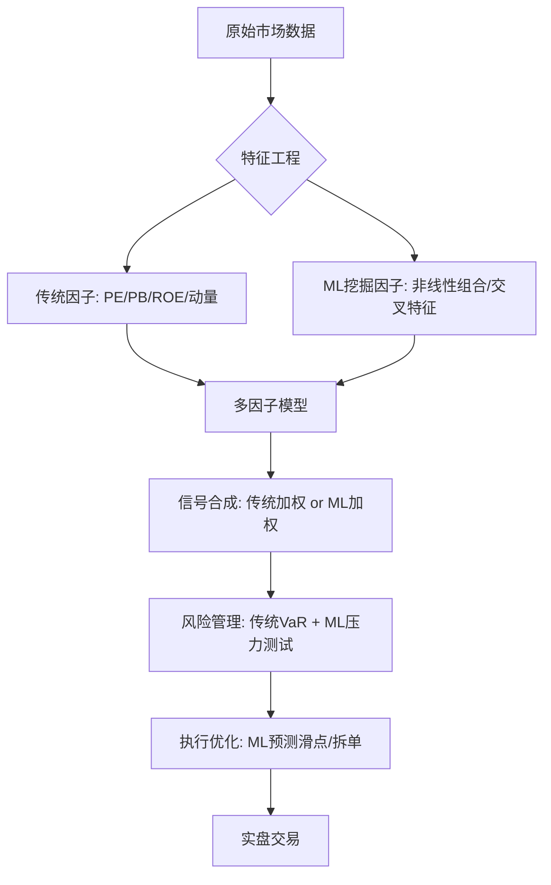
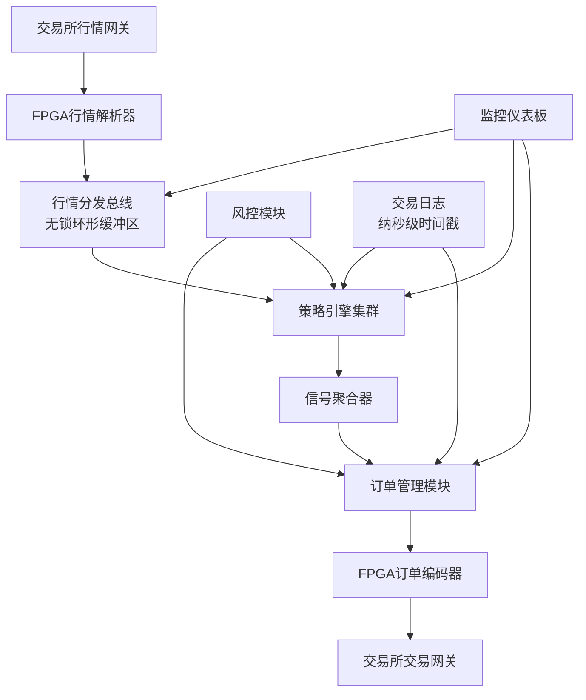
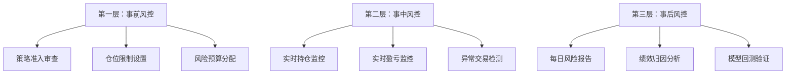
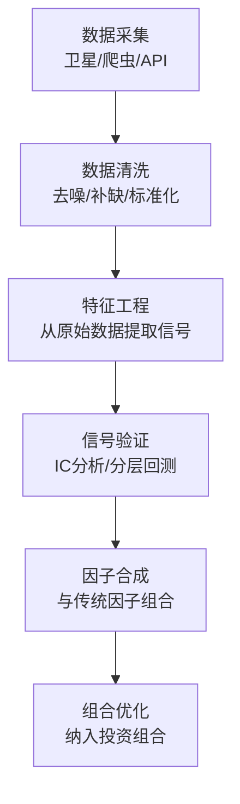

# 第28章 量化交易与算法投资 — 深度拓展

本章是整个量化交易章节的"天花板级"内容。前面的理论基础、核心技巧和实战案例已经建立了完整的量化交易知识框架，本章将在此基础上向五个前沿方向深度延伸：**机器学习与AI在量化中的实战应用**、**高频交易的全栈技术架构**、**全球监管环境与合规实操**、**多维度风险模型体系**、以及**量化交易的未来趋势与技术前沿**。每个方向都包含理论原理、实操代码、真实案例和常见误区，确保从入门者到资深从业者都能找到有价值的内容。

***

## 一、机器学习在量化交易中的应用

### 1.1 机器学习与传统量化方法的融合路径

量化交易从最初依赖统计学和数学模型，逐步演进到广泛应用机器学习技术。传统量化方法（如CAPM、Fama-French三因子/五因子模型、ARIMA时间序列分析、套利定价理论等）建立在较强的假设基础上——通常假设市场服从特定的分布规律（如正态分布、平稳性等）。而机器学习方法的核心优势在于：**能够从海量数据中自动发现复杂的非线性模式，不需要预先假设数据的分布形式。**

但这并不意味着机器学习要"取代"传统方法。在实际工程中，最有效的融合模式有以下四种：

**模式一：ML做因子挖掘，传统框架做组合构建。** 用机器学习（如XGBoost特征重要性、LASSO回归的稀疏系数）从数千个候选特征中筛选出有效因子，然后将筛选结果纳入传统的多因子模型进行组合优化。这种模式保留了传统模型的可解释性，同时利用了ML的特征筛选能力。

**模式二：ML做信号合成。** 将多个传统策略（动量、均值回归、价值等）各自产生的信号作为输入特征，用ML模型学习最优的信号加权方式，替代传统的等权或IC加权方法。

**模式三：ML做执行优化。** 策略信号的产生仍然由传统方法完成，但订单执行环节使用ML来预测最优执行时机、拆单方式和滑点估计。

**模式四：端到端深度学习。** 直接用深度学习模型从原始数据到交易信号进行端到端学习。这种模式理论上最强大，但也最容易过拟合，且几乎完全丧失可解释性。

**融合决策框架：**



### 1.2 监督学习的量化实战

#### 1.2.1 回归模型：预测收益率

回归类模型用于预测资产的未来收益率或价格水平。常用模型按复杂度递增排列：

| 模型 | 优势 | 劣势 | 适用场景 |
|------|------|------|----------|
| 线性回归 | 可解释性强、计算快 | 无法捕捉非线性关系 | 因子线性关系验证 |
| 岭回归/Lasso | 自动正则化防过拟合 | 仍是线性模型 | 高维因子筛选 |
| 弹性网络 | 结合L1和L2正则化 | 超参调节需要交叉验证 | 因子数量多且有共线性 |
| 随机森林回归 | 天然处理非线性和交互 | 特征维度极高时内存开销大 | 中等维度的非线性建模 |
| XGBoost/LightGBM | 性能优异、训练快、支持缺失值 | 调参空间大、容易过拟合 | 工业级因子模型首选 |
| 神经网络回归 | 极强的非线性拟合能力 | 需要大量数据、可解释性差 | 海量数据的深度建模 |

**实战代码：基于LightGBM的股票日收益率预测**

```python
import lightgbm as lgb
import pandas as pd
import numpy as np
from sklearn.model_selection import TimeSeriesSplit

# ========== 特征工程 ==========
def build_features(df):
    """构建量化特征集"""
    features = pd.DataFrame(index=df.index)
    
    # 动量特征
    for period in [5, 10, 20, 60]:
        features[f'return_{period}d'] = df['close'].pct_change(period)
        features[f'vol_{period}d'] = df['close'].pct_change().rolling(period).std()
    
    # 技术指标特征
    features['rsi_14'] = compute_rsi(df['close'], 14)
    features['macd_diff'] = compute_macd(df['close'])
    features['bollinger_pct'] = (df['close'] - df['close'].rolling(20).mean()) / \
                                 (df['close'].rolling(20).std() * 2)
    
    # 成交量特征
    features['volume_ratio'] = df['volume'] / df['volume'].rolling(20).mean()
    features['turnover_ma5'] = df['turnover'].rolling(5).mean()
    
    # 波动率特征
    features['atr_14'] = compute_atr(df, 14)
    features['realized_vol_20'] = df['close'].pct_change().rolling(20).std() * np.sqrt(252)
    
    return features.dropna()

# ========== 标签构造 ==========
def build_label(df, forward_days=5):
    """预测未来N日收益率"""
    return df['close'].pct_change(forward_days).shift(-forward_days)

# ========== 时间序列交叉验证 ==========
features = build_features(stock_data)
label = build_label(stock_data)

tscv = TimeSeriesSplit(n_splits=5, gap=5)  # gap防止数据泄漏
params = {
    'objective': 'regression',
    'metric': 'mse',
    'learning_rate': 0.05,
    'num_leaves': 31,
    'min_child_samples': 100,  # 较大的min_child_samples防过拟合
    'reg_alpha': 0.1,
    'reg_lambda': 0.1,
    'subsample': 0.8,
    'colsample_bytree': 0.8,
}

for fold, (train_idx, val_idx) in enumerate(tscv.split(features)):
    X_train, X_val = features.iloc[train_idx], features.iloc[val_idx]
    y_train, y_val = label.iloc[train_idx], label.iloc[val_idx]
    
    train_data = lgb.Dataset(X_train, y_train)
    val_data = lgb.Dataset(X_val, y_val)
    
    model = lgb.train(params, train_data, num_boost_round=500,
                      valid_sets=[val_data], 
                      callbacks=[lgb.early_stopping(50)])
    
    # 检查过拟合：训练集MSE vs 验证集MSE
    train_pred = model.predict(X_train)
    val_pred = model.predict(X_val)
    print(f"Fold {fold}: Train MSE={np.mean((train_pred-y_train)**2):.6f}, "
          f"Val MSE={np.mean((val_pred-y_val)**2):.6f}")
```

#### 1.2.2 分类模型：预测涨跌方向

在实际量化交易中，分类模型（预测涨跌方向）往往比回归模型（预测收益率绝对值）更稳健，因为方向预测对噪声的容忍度更高——只要方向对了，幅度的误差不会直接影响交易决策。

```python
from sklearn.ensemble import RandomForestClassifier
from sklearn.metrics import classification_report, confusion_matrix

# 二分类标签：未来5日收益 > 0 为正类
label_binary = (label > 0).astype(int)

# 三分类标签：大涨/震荡/大跌
label_tertile = pd.qcut(label, q=3, labels=[0, 1, 2])

# 使用随机森林分类器
clf = RandomForestClassifier(
    n_estimators=500,
    max_depth=6,           # 限制深度防过拟合
    min_samples_leaf=200,  # 叶子节点最少样本数
    class_weight='balanced',  # 处理类别不平衡
    random_state=42
)

# 时间序列交叉验证
for fold, (train_idx, val_idx) in enumerate(tscv.split(features)):
    X_train, X_val = features.iloc[train_idx], features.iloc[val_idx]
    y_train, y_val = label_binary.iloc[train_idx], label_binary.iloc[val_idx]
    
    clf.fit(X_train, y_train)
    y_pred = clf.predict(X_val)
    
    print(f"\n=== Fold {fold} ===")
    print(classification_report(y_val, y_pred, target_names=['跌', '涨']))
```

**关键实践建议：** 分类模型的输出概率值（而非类别标签）更有价值。将概率值作为信号强度使用，概率越高则仓位越大，这比简单的二分类信号包含更多信息。

#### 1.2.3 特征工程的核心原则

在监督学习的量化应用中，**特征工程往往比模型选择更为重要**。一个精心设计的特征集配合简单的线性模型，常常能击败一个粗糙特征集配合复杂深度学习模型的组合。

**特征设计的四个层次：**

| 层次 | 内容 | 示例 | 注意事项 |
|------|------|------|----------|
| 第一层：原始因子 | 价格、成交量、财务数据 | 收盘价、换手率、PE | 注意数据质量和完整性 |
| 第二层：技术指标 | 基于原始数据计算的指标 | RSI、MACD、布林带 | 避免过度堆砌同类指标 |
| 第三层：截面特征 | 同一时间点的相对位置 | 行业内PE排名、全市场动量分位 | 需要截面数据对齐 |
| 第四层：组合特征 | 多个特征的非线性组合 | 动量×波动率、PE×ROE | 数量可控，每组合应有经济学含义 |

**特征工程常见陷阱：**

- **未来函数泄漏：** 使用了当日盘中才产生的数据（如当日收盘价）来预测当日收益，回测结果会极度乐观但实盘不可能复现。正确做法是使用T-1日及更早的数据预测T日。
- **特征共线性：** 5日动量、10日动量、20日动量高度相关，同时纳入模型会导致系数不稳定。应使用VIF（方差膨胀因子）检测并去除高共线性特征。
- **幸存者偏差：** 用当前存在的股票池计算特征，忽略了已退市股票，导致特征分布失真。应使用"全历史"数据库。

### 1.3 深度学习在量化交易中的应用

#### 1.3.1 LSTM：时间序列建模的经典选择

循环神经网络（RNN）及其变体LSTM（长短期记忆网络）是处理时间序列数据的经典深度学习架构。LSTM通过"门控机制"（输入门、遗忘门、输出门）选择性地记住或遗忘历史信息，能够捕捉时间序列中的长期依赖关系。

**LSTM量化模型实战：**

```python
import torch
import torch.nn as nn
from torch.utils.data import DataLoader, TensorDataset

class QuantLSTM(nn.Module):
    """用于股票收益率预测的LSTM模型"""
    def __init__(self, input_dim, hidden_dim=64, num_layers=2, dropout=0.3):
        super().__init__()
        self.lstm = nn.LSTM(
            input_size=input_dim,
            hidden_size=hidden_dim,
            num_layers=num_layers,
            batch_first=True,
            dropout=dropout
        )
        self.attention = nn.MultiheadAttention(hidden_dim, num_heads=4, batch_first=True)
        self.fc = nn.Sequential(
            nn.Linear(hidden_dim, 32),
            nn.ReLU(),
            nn.Dropout(dropout),
            nn.Linear(32, 1)  # 输出预测收益率
        )
    
    def forward(self, x):
        # x shape: (batch, seq_len, features)
        lstm_out, _ = self.lstm(x)  # (batch, seq_len, hidden)
        attn_out, _ = self.attention(lstm_out, lstm_out, lstm_out)
        out = self.fc(attn_out[:, -1, :])  # 取最后一个时间步
        return out.squeeze(-1)

# 数据准备：将截面数据转换为时间序列
def create_sequences(features, labels, lookback=20):
    """创建滑动窗口序列"""
    X, y = [], []
    for i in range(lookback, len(features)):
        X.append(features[i-lookback:i])
        y.append(labels[i])
    return torch.FloatTensor(np.array(X)), torch.FloatTensor(np.array(y))

# 训练循环（简化版）
model = QuantLSTM(input_dim=features.shape[1])
optimizer = torch.optim.Adam(model.parameters(), lr=1e-3, weight_decay=1e-5)
criterion = nn.MSELoss()

for epoch in range(100):
    model.train()
    for X_batch, y_batch in train_loader:
        pred = model(X_batch)
        loss = criterion(pred, y_batch)
        optimizer.zero_grad()
        loss.backward()
        torch.nn.utils.clip_grad_norm_(model.parameters(), max_norm=1.0)
        optimizer.step()
```

**LSTM的关键限制：**
- 对超参数（学习率、隐藏层维度、序列长度）极为敏感，需要大量实验
- 训练速度慢，难以快速迭代
- 在极长时间序列上仍面临梯度消失问题
- 在信噪比极低的金融数据上，LSTM容易学到噪声模式

#### 1.3.2 Transformer：自注意力机制的突破

Transformer架构通过**自注意力机制（Self-Attention）**实现了对时间序列中任意位置之间依赖关系的直接建模，不受序列长度的限制。相比LSTM的顺序处理，Transformer可以并行计算，训练效率更高。

**核心架构对比：**

| 特性 | LSTM | Transformer |
|------|------|-------------|
| 序列建模方式 | 顺序处理，逐步传递 | 自注意力，全局并行 |
| 长距离依赖 | 依赖门控机制，有信息衰减 | 直接建模任意距离依赖 |
| 训练效率 | 顺序计算，较慢 | 并行计算，较快 |
| 数据需求 | 中等 | 较大（注意力机制参数多） |
| 金融领域表现 | 基线模型，广泛验证 | 部分场景超越LSTM |
| 位置编码 | 隐式（序列顺序） | 需要显式位置编码 |

**金融时间序列Transformer的关键设计：**

```python
class FinancialTransformer(nn.Module):
    def __init__(self, input_dim, d_model=64, nhead=4, num_layers=3):
        super().__init__()
        self.input_proj = nn.Linear(input_dim, d_model)
        
        # 可学习的位置编码（替代固定正弦编码）
        self.pos_embedding = nn.Parameter(torch.randn(1, 200, d_model) * 0.02)
        
        encoder_layer = nn.TransformerEncoderLayer(
            d_model=d_model,
            nhead=nhead,
            dim_feedforward=d_model * 4,
            dropout=0.1,
            activation='gelu',  # GELU在金融数据上通常优于ReLU
            batch_first=True
        )
        self.transformer = nn.TransformerEncoder(encoder_layer, num_layers=num_layers)
        
        # 输出头：同时预测收益方向和幅度
        self.direction_head = nn.Linear(d_model, 2)   # 涨/跌分类
        self.magnitude_head = nn.Linear(d_model, 1)   # 收益幅度回归
        
    def forward(self, x, mask=None):
        # x: (batch, seq_len, input_dim)
        x = self.input_proj(x) + self.pos_embedding[:, :x.size(1), :]
        x = self.transformer(x, src_key_padding_mask=mask)
        
        # 使用[CLS] token或最后一个token的表示
        context = x[:, -1, :]
        
        direction = self.direction_head(context)
        magnitude = self.magnitude_head(context)
        return direction, magnitude
```

#### 1.3.3 图神经网络（GNN）：捕捉资产关联

金融市场中的资产之间存在复杂的关联关系——产业链上下游关系、供应链传导、投资者持仓重叠、行业轮动联动等。传统的截面模型（如多因子模型）将每只股票视为独立个体，忽略了这些关联信息。**图神经网络（GNN）**能够将这些关系建模为图结构，从而更好地捕捉资产间的联动效应。

**建模方式：**
- **节点（Node）：** 个股、ETF、期货合约等交易标的
- **边（Edge）：** 股票间的相关性、产业链关系、供应链关系、投资者持仓共现
- **节点特征：** 个股的因子值、技术指标、基本面数据
- **边权重：** 相关系数、产业链强度、持仓重叠度

```python
import torch_geometric
from torch_geometric.nn import GATConv, global_mean_pool

class StockGNN(nn.Module):
    """基于图注意力网络的股票预测模型"""
    def __init__(self, node_features, hidden_dim=64):
        super().__init__()
        # 图注意力层：自动学习邻居节点的重要性权重
        self.gat1 = GATConv(node_features, hidden_dim, heads=4, concat=True)
        self.gat2 = GATConv(hidden_dim * 4, hidden_dim, heads=1, concat=False)
        self.predictor = nn.Linear(hidden_dim, 1)
    
    def forward(self, x, edge_index, edge_weight=None):
        # x: (num_stocks, node_features)
        # edge_index: (2, num_edges) 连接关系
        h = torch.relu(self.gat1(x, edge_index, edge_weight))
        h = torch.relu(self.gat2(h, edge_index, edge_weight))
        out = self.predictor(h)  # 每只股票的预测
        return out
```

**GNN在量化中的独特价值：** 当某个行业出现利好消息时，GNN能够通过图结构将这一信息传播到产业链上下游的相关公司，比传统的截面模型更早地捕捉到"联动效应"。

#### 1.3.4 强化学习：动态决策优化

强化学习（RL）在量化交易中的应用主要体现在两个核心场景：

**场景一：最优执行（Optimal Execution）。** 机构投资者需要将大额订单分拆为多个小单逐步执行，以最小化市场冲击成本。这是一个经典的序贯决策问题——当前交易行为会影响后续市场价格，RL智能体需要学会在"快速成交（冲击大）"和"缓慢成交（时间风险大）"之间找到最优平衡。

**场景二：投资组合管理。** RL智能体需要学习在不同市场状态下动态调整资产配置比例。与传统的均值-方差优化不同，RL能够考虑交易成本、市场冲击、持仓约束等实际因素，并且能够处理非平稳的市场环境。

```python
import gymnasium as gym
import numpy as np

class PortfolioEnv(gym.Env):
    """投资组合管理强化学习环境"""
    def __init__(self, price_data, features, initial_capital=1_000_000):
        super().__init__()
        self.price_data = price_data
        self.features = features
        self.initial_capital = initial_capital
        self.n_assets = price_data.shape[1]
        
        # 动作空间：各资产的目标权重（连续值，softmax归一化）
        self.action_space = gym.spaces.Box(low=-1, high=1, shape=(self.n_assets,))
        
        # 观测空间：当前特征 + 当前持仓 + 已实现收益
        obs_dim = features.shape[1] * self.n_assets + self.n_assets + 1
        self.observation_space = gym.spaces.Box(low=-np.inf, high=np.inf, shape=(obs_dim,))
    
    def step(self, action):
        # 将动作转换为持仓权重
        weights = np.exp(action) / np.exp(action).sum()
        
        # 计算当日收益
        daily_returns = self.price_data[self.current_step] / \
                        self.price_data[self.current_step - 1] - 1
        portfolio_return = np.sum(weights * daily_returns)
        
        # 计算交易成本（换仓产生的手续费和滑点）
        turnover = np.sum(np.abs(weights - self.current_weights))
        transaction_cost = turnover * 0.002  # 单边0.1%的交易成本
        
        # 净收益
        net_return = portfolio_return - transaction_cost
        self.portfolio_value *= (1 + net_return)
        
        # 奖励函数：考虑收益和风险
        self.returns_history.append(net_return)
        if len(self.returns_history) > 20:
            sharpe = np.mean(self.returns_history[-20:]) / \
                     (np.std(self.returns_history[-20:]) + 1e-8) * np.sqrt(252)
            reward = sharpe - 0.5 * max(0, self._calc_drawdown() - 0.1)  # 回撤惩罚
        else:
            reward = net_return * 100
        
        self.current_weights = weights
        self.current_step += 1
        done = self.current_step >= len(self.price_data) - 1
        
        return self._get_obs(), reward, done, False, {}
```

**强化学习在量化中的核心挑战：**
- **奖励函数设计：** 直接用收益率作为奖励会导致高风险偏好；需要设计兼顾收益和风险的复合奖励函数
- **环境非平稳性：** 金融市场的分布会变化，RL智能体需要持续适应
- **样本效率低：** 需要大量交易经验才能学到有效策略，而金融数据量有限
- **过拟合历史：** RL在历史环境中学到的策略可能在未来的市场环境中失效

### 1.4 机器学习应用的挑战与陷阱

#### 1.4.1 过拟合：量化交易中的头号杀手

金融数据的**信噪比（Signal-to-Noise Ratio）极低**——市场中真正有价值的预测信号非常微弱，而噪声极为强烈。日频股票收益率的可预测R²通常只有1%-3%，这意味着97%-99%的变化都是噪声。在这种条件下，机器学习模型非常容易"学到噪声"，即在训练集上表现优异，但在实盘交易中表现糟糕。

**对抗过拟合的六层防线：**

| 防线 | 方法 | 作用 |
|------|------|------|
| 第一层：数据层 | 时间序列交叉验证（非随机切分） | 防止用未来数据训练 |
| 第二层：特征层 | 控制特征数量，每个特征有经济学含义 | 减少无效噪声特征 |
| 第三层：模型层 | 正则化（L1/L2/Dropout）、限制模型复杂度 | 约束模型容量 |
| 第四层：训练层 | 早停（Early Stopping）、学习率衰减 | 防止过度训练 |
| 第五层：验证层 | 多时间区间、多市场的独立样本外测试 | 验证泛化能力 |
| 第六层：上线层 | 模拟盘运行3-6个月后再实盘 | 最终验证 |

```python
# 时间序列交叉验证的正确实现
from sklearn.model_selection import TimeSeriesSplit

# 注意：必须使用时间序列切分，不能用随机切分
tscv = TimeSeriesSplit(n_splits=5, gap=5)  # gap=5防止窗口重叠导致数据泄漏

# 错误做法：随机切分（会泄漏未来信息）
# from sklearn.model_selection import KFold  # 绝对不能这样用！

# 遍历验证：在多个独立时间段上测试稳定性
for fold, (train_idx, val_idx) in enumerate(tscv.split(X)):
    # 训练和验证
    model.fit(X.iloc[train_idx], y.iloc[train_idx])
    val_score = model.score(X.iloc[val_idx], y.iloc[val_idx])
    
    # 关键：关注各折得分的一致性，而非平均分
    # 如果不同折的得分差异很大，说明策略不够稳健
    print(f"Fold {fold}: Val Score = {val_score:.4f}")
```

#### 1.4.2 数据窥探偏差（Data Snooping Bias）

在量化策略开发过程中，研究者可能会不断调整模型参数、特征组合、交易规则，直到找到一个在历史数据上表现良好的策略。但这种**反复调试的过程本身就构成了"数据窥探"**——你在用同一段历史数据做了成百上千次实验，总有某次实验会"碰巧"表现很好，但这只是统计偶然，不是真正的Alpha。

**数据窥探的量化诊断：** 假设你测试了K个独立策略，每个策略在历史数据上的夏普比率都服从标准正态分布（即没有真正的Alpha）。那么K个策略中最大的夏普比率的期望值约为：

$$E[\max(SR_1, ..., SR_K)] \approx \sqrt{2 \ln K}$$

例如，测试100个策略，最大夏普比率的期望值约为3.03。这意味着一个看起来夏普比率为3的策略，如果它是在100次尝试中"挑出来"的，很可能只是统计偶然。

**应对措施：**
- **Bonferroni校正：** 将显著性水平α除以测试次数K（α/K），提高通过门槛
- **保留集（Holdout Set）：** 划分出一段从未参与任何策略开发决策的数据，仅在最终验证时使用一次
- **多市场/多时段验证：** 在完全不同的市场（如从A股验证到港股）或时间段（如从2015-2020验证到2020-2025）上检验策略
- **Deflated Sharpe Ratio（DSR）：** 考虑了测试次数后的修正夏普比率

#### 1.4.3 非平稳性与概念漂移

金融市场的统计特性会随时间发生根本性变化（即**非平稳性**）。一个在某个时期有效的模型可能在另一个时期完全失效。这种现象的根源在于：

- **市场微观结构变化：** 交易制度改变（如T+0/T+1）、涨跌幅限制调整
- **投资者结构变化：** 机构化程度提升、量化基金占比增加
- **宏观经济环境变化：** 低利率→高利率、低通胀→高通胀
- **监管政策变化：** 融资融券规则、程序化交易限制

**应对策略：**
- **滚动训练窗口：** 使用最近N个月的数据训练，而非全历史数据，让模型"遗忘"过时的模式
- **在线学习：** 模型持续用新数据更新权重，适应分布变化
- **多模型集成：** 维护多个在不同市场状态下训练的模型，根据当前市场状态动态选择
- **模型衰减监控：** 实时监控模型在新数据上的预测精度，精度下降超过阈值时触发重新训练

#### 1.4.4 可解释性：黑箱模型的信任危机

深度学习等复杂模型通常是"黑箱"——你很难解释为什么模型在某一天给出"买入"信号。在金融领域，可解释性不仅关系到策略的可信度（如果交易员不理解信号的来源，就难以在策略失效时判断是模型问题还是市场变化），还可能关系到监管合规的要求。

**常用可解释性工具：**

| 工具 | 原理 | 输出 | 适用模型 |
|------|------|------|----------|
| SHAP | 基于博弈论的Shapley值，计算每个特征对预测的贡献 | 每个特征对每次预测的贡献值 | 任意模型 |
| LIME | 在预测点附近用简单模型近似复杂模型 | 局部线性解释 | 任意模型 |
| 特征重要性 | 基于特征对模型性能的影响排序 | 全局特征排名 | 树模型 |
| 注意力权重 | Transformer的自注意力权重 | 特征/时间步的关注度 | Transformer |

```python
import shap

# 使用SHAP解释LightGBM模型
explainer = shap.TreeExplainer(lgb_model)
shap_values = explainer.shap_values(X_test)

# 全局特征重要性
shap.summary_plot(shap_values, X_test, feature_names=feature_names)

# 单次预测的解释（为什么这一天模型预测"买入"？）
shap.waterfall_plot(shap.Explanation(
    values=shap_values[0],
    base_values=explainer.expected_value,
    feature_names=feature_names,
    data=X_test.iloc[0]
))
```

***

## 二、高频交易的全栈技术架构

### 2.1 高频交易的核心竞争力模型

高频交易（High-Frequency Trading, HFT）是一种利用强大的计算机系统和复杂的算法，在极短的时间内（通常为微秒到毫秒级别）进行大量交易的策略。HFT的核心竞争力可以用一个公式概括：

$$HFT利润 = f(信息速度 \times 决策质量 \times 执行效率) - 成本$$

其中：
- **信息速度：** 从市场数据变化到系统感知的时间差，以纳秒计算
- **决策质量：** 策略算法在极短时间内的判断准确率
- **执行效率：** 从决策到订单到达交易所撮合引擎的时间差
- **成本：** 硬件、共置、数据、交易手续费等

**HFT的主要策略分类：**

| 策略类型 | 原理 | 持仓时间 | 年化收益 | 技术门槛 |
|----------|------|----------|----------|----------|
| 做市策略 | 同时挂买卖单赚取价差 | 秒~分钟 | 15%-30% | 高 |
| 统计套利 | 相关资产的价格偏差回归 | 秒~小时 | 10%-25% | 中高 |
| 延迟套利 | 利用不同交易所间的延迟差异 | 毫秒~秒 | 20%-50% | 极高 |
| 事件驱动 | 新闻/数据发布后的价格反应 | 秒~分钟 | 15%-40% | 高 |
| 回扣套利 | 赚取交易所的流动性回扣 | 毫秒~秒 | 5%-15% | 中 |

### 2.2 硬件基础设施

HFT对硬件的要求可以用"极致"来形容。在微秒级的竞争中，每一纳秒都可能意味着利润或亏损。

#### 2.2.1 服务器配置

```text
高频交易服务器典型配置：
├── CPU: Intel Xeon w9-3595X (60核, 1.9-4.8GHz) 或 AMD EPYC 9755
│   └── BIOS优化: 关闭超线程(减少延迟抖动), 锁定最高频率, 关闭C-States
├── 内存: DDR5-6400 ECC, 256GB
│   └── 配置: 使用大页内存(Huge Pages 1GB), 预分配, NUMA-aware
├── 存储: Intel Optane P5810X (NVMe, 延迟<10μs)
│   └── 用途: 策略参数、交易日志、行情快照
├── 网卡: Solarflare X3522 / Mellanox ConnectX-7
│   └── 特性: 内核旁路(OpenOnload/DPDK), 硬件时间戳精度<10ns
├── FPGA: Xilinx Alveo U55C / Intel Agilex 7
│   └── 用途: 网络包解析、行情处理、信号生成
└── OS: 定制Linux内核 (PREEMPT_RT补丁)
    └── 优化: 隔离CPU核心(isolcpus), 关闭irqbalance, 关闭swap
```

#### 2.2.2 共置服务（Co-location）

共置服务是将交易服务器放置在交易所数据中心的机柜中，使服务器与交易所撮合引擎之间的物理距离达到最短。

**延迟构成分析：**

| 延迟来源 | 典型值 | 优化方向 |
|----------|--------|----------|
| 光纤传输（100km） | ~500μs | 选择离交易所近的共置机房 |
| 共置机房内（同机柜） | <1μs | 申请与撮合引擎最近的机柜位置 |
| 网卡到用户空间 | 3-10μs | 内核旁路技术（DPDK/OpenOnload） |
| 行情解析 | 0.5-2μs | FPGA硬件解析 |
| 策略计算 | 0.1-5μs | 算法优化、SIMD指令 |
| 订单生成与发送 | 0.5-2μs | FPGA订单生成 |
| **端到端延迟** | **5-20μs** | **全链路优化** |

**各大交易所共置服务对比：**

| 交易所 | 共置服务 | 费用范围 | 特点 |
|--------|----------|----------|------|
| 纳斯达克 | Nasdaq Co-Location | $5,000-50,000/月 | 机柜选择灵活 |
| 纽交所 | NYSE Co-Location | $5,000-30,000/月 | 支持交叉连接 |
| CME | Aurora Co-Location | $3,000-20,000/月 | 期货为主 |
| 上交所/深交所 | 技术托管服务 | 机构协商 | 中国特有，需审批 |

### 2.3 软件架构

高频交易系统的软件架构是一个分层、模块化、极致优化的工程系统。



#### 2.3.1 市场数据处理模块

这是整个系统的"眼睛"，负责以最低延迟接收和解析交易所行情数据。

```cpp
// 无锁环形缓冲区（Lock-Free Ring Buffer）——核心数据结构
template<typename T, size_t Size>
class LockFreeRingBuffer {
    static_assert((Size & (Size - 1)) == 0, "Size must be power of 2");
    
    alignas(64) std::atomic<size_t> write_pos_{0};  // 缓存行对齐避免false sharing
    alignas(64) std::atomic<size_t> read_pos_{0};
    alignas(64) T buffer_[Size];
    
public:
    bool try_push(const T& item) {
        size_t wp = write_pos_.load(std::memory_order_relaxed);
        size_t next = (wp + 1) & (Size - 1);
        if (next == read_pos_.load(std::memory_order_acquire)) {
            return false;  // 缓冲区满
        }
        buffer_[wp] = item;
        write_pos_.store(next, std::memory_order_release);
        return true;
    }
    
    bool try_pop(T& item) {
        size_t rp = read_pos_.load(std::memory_order_relaxed);
        if (rp == write_pos_.load(std::memory_order_acquire)) {
            return false;  // 缓冲区空
        }
        item = buffer_[rp];
        read_pos_.store((rp + 1) & (Size - 1), std::memory_order_release);
        return true;
    }
};
```

#### 2.3.2 策略引擎设计

高频交易的策略通常相对简单（复杂策略的计算时间过长），但需要在极短的时间内完成计算。一个典型的HFT做市策略的决策逻辑可能只需要几百纳秒。

```cpp
// 简化的做市策略引擎
struct MarketMakingEngine {
    // 核心数据结构——缓存行对齐
    alignas(64) double best_bid_, best_ask_;
    alignas(64) double fair_value_;
    alignas(64) double inventory_;
    
    // 参数
    double half_spread_;    // 半价差
    double skew_;           // 库存偏斜系数
    double max_inventory_;  // 最大持仓
    
    OrderPair on_market_update(const MarketUpdate& update) {
        // 更新公平价值估计（纳秒级计算）
        fair_value_ = update.mid_price();
        
        // 根据库存调整报价方向
        double inventory_skew = -skew_ * inventory_ / max_inventory_;
        
        // 计算最优买卖报价
        double bid_price = fair_value_ - half_spread_ + inventory_skew;
        double ask_price = fair_value_ + half_spread_ + inventory_skew;
        
        // 确保价差为正
        bid_price = std::min(bid_price, best_ask_ - 0.01);
        ask_price = std::max(ask_price, best_bid_ + 0.01);
        
        return {bid_price, ask_price};
    }
};
```

### 2.4 FPGA在高频交易中的应用

FPGA（现场可编程门阵列）是高频交易领域最重要的硬件加速技术。与CPU和GPU相比，FPGA具有独特的优势：

| 特性 | CPU | GPU | FPGA |
|------|-----|-----|------|
| 延迟 | 微秒级 | 微秒~毫秒级 | 纳秒级 |
| 确定性 | 低（OS调度干扰） | 中 | 极高（硬件逻辑确定） |
| 并行度 | 中（数十核） | 高（数千核） | 高（自定义并行流水线） |
| 功耗 | 高 | 极高 | 低~中 |
| 开发难度 | 低 | 中 | 高（需硬件描述语言） |
| 灵活性 | 高 | 中 | 低（重新编程需要重新综合） |

**FPGA在HFT中的典型应用流水线：**


**FPGA开发的技术栈：**
- **硬件描述语言：** VHDL、Verilog、SystemVerilog
- **高层次综合（HLS）：** Xilinx Vitis HLS（用C/C++生成FPGA逻辑）
- **开发框架：** Xilinx Vitis、Intel oneAPI
- **验证工具：** ModelSim、Vivado Simulator
- **典型开发周期：** 6-18个月（远长于软件开发）

### 2.5 全栈延迟优化技术

延迟优化是一个系统工程，需要在硬件、操作系统、网络协议、应用软件等多个层面同时优化。

#### 2.5.1 内核旁路（Kernel Bypass）

传统网络数据包需要经过操作系统的完整网络协议栈（从网卡驱动→内核网络栈→Socket接口→用户空间），整个过程引入约5-20μs的延迟。内核旁路技术允许应用程序直接访问网络接口卡，绕过操作系统。

**主流内核旁路方案对比：**

| 方案 | 提供者 | 延迟 | 特点 |
|------|--------|------|------|
| DPDK | Intel（开源） | <2μs | 通用，需要轮询模式 |
| OpenOnload | Solarflare/Xilinx | <1μs | Socket透明替代 |
| Netmap | 开源 | <2μs | 轻量级，FreeBSD/Linux |
| VMA | Mellanox/NVIDIA | <1μs | InfiniBand优化 |

#### 2.5.2 内存优化

```cpp
// 大页内存预分配——避免TLB缺失和动态分配开销
#include <sys/mman.h>

void* allocate_huge_pages(size_t size) {
    // 申请1GB大页内存（需要在/boot/grub中配置hugepagesz=1G）
    void* ptr = mmap(NULL, size, PROT_READ | PROT_WRITE,
                     MAP_PRIVATE | MAP_ANONYMOUS | MAP_HUGETLB | MAP_HUGE_1GB,
                     -1, 0);
    if (ptr == MAP_FAILED) {
        // 降级到2MB大页
        ptr = mmap(NULL, size, PROT_READ | PROT_WRITE,
                   MAP_PRIVATE | MAP_ANONYMOUS | MAP_HUGETLB,
                   -1, 0);
    }
    // 预触发页错误（避免运行时首次访问的延迟）
    memset(ptr, 0, size);
    return ptr;
}
```

#### 2.5.3 CPU优化

```bash
# Linux内核优化配置（/etc/default/grub）
GRUB_CMDLINE_LINUX="isolcpus=2-15 nohz_full=2-15 rcu_nocbs=2-15 \
    hugepagesz=1G hugepages=8 default_hugepagesz=1G \
    intel_pstate=disable processor.max_cstate=0 idle=poll \
    nosoftlockup mce=off tsc=reliable"

# 应用层优化
taskset -c 2-3 ./trading_engine   # 绑定到隔离的CPU核心
chrt -f 99 ./trading_engine       # 最高实时优先级
```

**CPU亲和性编程：**

```cpp
#include <pthread.h>
#include <sched.h>

void pin_thread_to_core(int core_id) {
    cpu_set_t cpuset;
    CPU_ZERO(&cpuset);
    CPU_SET(core_id, &cpuset);
    pthread_setaffinity_np(pthread_self(), sizeof(cpu_set_t), &cpuset);
}

// 热路径线程（策略引擎）绑定到核心2
// 冷路径线程（日志、监控）绑定到核心14-15
```

***

## 三、量化交易的全球监管环境

### 3.1 重大监管事件时间线

理解量化交易的监管，需要从几个标志性事件说起：

| 时间 | 事件 | 影响 |
|------|------|------|
| 2010年5月 | 美股"闪电崩盘"（Flash Crash） | 道琼斯5分钟暴跌约1000点，SEC加强HFT监管 |
| 2012年8月 | 骑士资本（Knight Capital）系统故障 | 45分钟亏损4.4亿美元，暴露算法交易操作风险 |
| 2015年8月 | 中国股市异常波动 | 程序化交易受到更严格监管 |
| 2018年1月 | 欧盟MiFID II生效 | 全球最严格的算法交易监管框架 |
| 2020年3月 | 新冠疫情引发的市场暴跌 | 量化策略集体回撤，流动性风险再次成为焦点 |
| 2023年 | 中国证监会程序化交易新规 | 要求报告程序化交易信息，异常交易行为监控 |

### 3.2 主要市场监管框架

#### 3.2.1 美国：SEC/CFTC体系

美国是量化交易和高频交易最发达的市场，其监管框架也最为成熟。

**关键监管规则：**
- **市场准入规则（Market Access Rule, Rule 15c3-5）：** 要求券商对客户的交易实施风险控制，包括信用和资本敞口限制、错误防止措施
- **综合审计跟踪系统（CAT）：** 2020年全面生效，要求对所有股票和期权交易进行完整的审计记录，包括订单的创建、修改、取消和执行的完整生命周期
- **Reg NMS（国家市场系统规则）：** 要求订单在全国范围内以最优价格执行，促进了交易所间的竞争
- **Reg SCI（系统合规性与完整性）：** 要求核心市场参与者确保技术系统的可靠性和灾难恢复能力

#### 3.2.2 欧盟：MiFID II/MiFIR体系

欧盟的MiFID II（金融工具市场指令第二版）是全球最全面的算法交易监管框架，2018年1月生效。

**核心要求：**
- 算法交易商必须向监管机构报备算法策略的"核心逻辑描述"
- 高频交易商必须在交易所注册为做市商，并承担持续报价义务
- 交易所必须对算法交易进行年度压力测试
- 禁止"订单闪烁"（Order Dripping）等可能扰乱市场的行为
- 要求算法交易系统具备"熔断机制"——当异常检测触发时自动停止交易

#### 3.2.3 中国：证监会/交易所体系

中国对量化交易的监管在2015年股市异常波动后显著加强。

**关键制度：**
- **程序化交易报备制度：** 2023年《关于加强程序化交易管理有关事项的通知》要求程序化交易者向交易所报告交易策略类型、交易频率、关联账户等信息
- **异常交易行为监控：** 对频繁申报撤单、拉抬打压股价等异常行为进行重点监控
- **T+1交易制度：** 当日买入的股票次日才能卖出，限制了日内高频策略的实施空间
- **涨跌幅限制：** 主板10%、创业板/科创板20%的涨跌幅限制，限制了极端行情下的策略行为
- **融券限制：** 融券卖出的券源有限且成本较高，限制了做空策略

**中国市场量化交易的特殊性：**

| 方面 | 中国A股 | 美股 |
|------|---------|------|
| 交易制度 | T+1 | T+0 |
| 涨跌幅限制 | 有（10%/20%/30%） | 无（有熔断机制） |
| 做空机制 | 受限（融券困难） | 灵活 |
| 散户比例 | ~60%交易量 | ~20%交易量 |
| Alpha机会 | 相对丰富（市场效率较低） | 相对较少（竞争激烈） |
| 高频限制 | 严格 | 相对宽松 |

### 3.3 算法交易的伦理讨论

#### 3.3.1 公平性质疑

高频交易商通过投入巨额资金建设超低延迟的基础设施，获得了相对于普通投资者的速度优势。批评者认为这种"技术军备竞赛"扭曲了市场的公平性——**信息已经不再是平等的了**。但支持者反驳称，HFT通过提供流动性和缩小买卖价差，实际上降低了所有投资者的交易成本。

**数据支持：** 学术研究表明，在HFT盛行的2008-2015年期间，美股市场的平均买卖价差从约5美分缩小到约1美分，零售投资者的交易成本显著下降。

#### 3.3.2 市场稳定性

量化交易策略的同质化可能导致"拥挤交易"现象——大量量化基金采用相似的策略，在市场压力下同时平仓，加剧市场波动。

**经典案例：2007年8月"量化地震"（Quant Quake）**

2007年8月6日至10日，多个采用统计套利策略的量化基金在同一时间遭遇了大幅亏损。事件的传导机制是：

1. 某个大型量化基金因亏损开始减仓
2. 其减仓行为导致相关股票价格异动
3. 其他采用类似策略的基金检测到价格异动，触发止损
4. 多个基金同时抛售，形成踩踏
5. 流动性枯竭，价格进一步恶化
6. 反馈循环持续数日，直到仓位出清

这个事件深刻揭示了**量化策略的系统性风险**——当大量策略基于相似的信号和因子时，它们在极端行情中的行为高度相关，分散化的效果大打折扣。

***

## 四、多维度风险模型体系

### 4.1 风险管理的层次架构

一个完整的量化交易风险管理体系包括三个层次：



历史上的重大量化交易失败案例，几乎都可以追溯到风险管理的某个环节出了问题：

| 机构 | 时间 | 亏损 | 根因 | 风控失败环节 |
|------|------|------|------|------------|
| LTCM | 1998年 | 46亿美元 | 俄罗斯违约引发流动性枯竭 | 压力测试不足、杠杆过高 |
| Amaranth | 2006年 | 66亿美元 | 天然气期货巨亏 | 集中度风险失控 |
| 骑士资本 | 2012年 | 4.4亿美元 | 代码部署错误 | 变更管理流程缺失 |
| 中航油 | 2004年 | 5.5亿美元 | 原油期货投机失败 | 止损纪律缺失 |

### 4.2 市场风险模型

#### 4.2.1 VaR（Value at Risk）

VaR是最广泛使用的市场风险度量方法，回答一个核心问题：**在正常市场条件下，在给定的置信水平和时间期限内，投资组合可能遭受的最大损失是多少？**

**三种计算方法对比：**

| 方法 | 原理 | 优势 | 劣势 | 适用场景 |
|------|------|------|------|----------|
| 历史模拟法 | 用历史收益率分布直接估计 | 不假设分布形式 | 依赖历史数据质量和长度 | 非正态分布的资产 |
| 参数法 | 假设收益服从正态分布 | 计算简单快速 | 低估尾部风险 | 快速估算 |
| 蒙特卡洛模拟 | 随机模拟大量情景 | 灵活、可处理复杂组合 | 计算量大 | 复杂衍生品组合 |

```python
import numpy as np

def calc_var_historical(returns, confidence=0.95, holding_period=1):
    """
    历史模拟法计算VaR
    returns: 历史日收益率序列
    confidence: 置信水平
    holding_period: 持有期（天数）
    """
    sorted_returns = np.sort(returns)
    index = int((1 - confidence) * len(sorted_returns))
    var_1d = -sorted_returns[index]
    
    # 持有期调整（平方根法则）
    var = var_1d * np.sqrt(holding_period)
    return var

def calc_var_parametric(returns, confidence=0.95, holding_period=1):
    """
    参数法计算VaR（假设正态分布）
    """
    from scipy.stats import norm
    mu = np.mean(returns)
    sigma = np.std(returns)
    z = norm.ppf(1 - confidence)
    var_1d = -(mu + z * sigma)
    return var_1d * np.sqrt(holding_period)

def calc_cvar(returns, confidence=0.95):
    """
    CVaR/Expected Shortfall：损失超过VaR时的期望损失
    解决VaR不描述尾部风险严重程度的局限
    """
    sorted_returns = np.sort(returns)
    index = int((1 - confidence) * len(sorted_returns))
    cvar = -np.mean(sorted_returns[:index])
    return cvar

# 示例：计算一个投资组合的风险指标
np.random.seed(42)
portfolio_returns = np.random.normal(0.0005, 0.015, 2520)  # 10年日收益率

print(f"95% VaR (1日): {calc_var_historical(portfolio_returns)*100:.2f}%")
print(f"95% CVaR (1日): {calc_cvar(portfolio_returns)*100:.2f}%")
print(f"95% VaR (10日): {calc_var_historical(portfolio_returns, holding_period=10)*100:.2f}%")
```

**VaR的关键局限：**
- **不满足次可加性（Subadditivity）：** 两个投资组合的VaR之和可能小于合并后组合的VaR，违反了"分散风险应降低总风险"的直觉。CVaR/ES解决了这个问题。
- **只给出损失上限，不描述尾部严重程度：** 95% VaR告诉你"95%的情况下损失不超过X"，但不告诉你"剩下5%的情况下平均损失是多少"。
- **在极端市场条件下失效：** 2008年金融危机中，许多VaR模型严重低估了实际损失，因为模型基于"正常市场"的历史数据，没有考虑到流动性枯竭和相关性飙升的极端情景。

#### 4.2.2 压力测试（Stress Testing）

压力测试通过模拟极端但可能发生的市场情景，评估投资组合在极端条件下的表现。**压力测试的价值在于能够发现VaR等统计模型可能遗漏的极端风险。**

**压力测试的三类场景设计方法：**

**方法一：历史情景法。** 复现历史上真实发生过的极端事件。

| 历史事件 | 市场冲击 | 持续时间 |
|----------|----------|----------|
| 2008年金融危机 | 全球股市暴跌40%-50% | 12-18个月 |
| 2015年A股异常波动 | 上证指数暴跌40% | 2个月 |
| 2020年新冠暴跌 | 全球股市单周暴跌10%-20% | 3周 |
| 2022年英国养老金危机 | 英国国债暴跌，英镑暴跌 | 1周 |
| 1998年LTCM危机 | 信用利差飙升，流动性枯竭 | 2个月 |

**方法二：假设性情景法。** 设计历史上未发生但理论上可能的极端情景。

```python
# 压力测试场景设计
stress_scenarios = {
    '利率冲击': {
        '描述': '利率突然上升300个基点',
        '债券': -0.15,  # 15%跌幅
        '股票': -0.08,  # 8%跌幅
        '商品': -0.05,  # 5%跌幅
        '现金': 0.005,  # 0.5%收益
    },
    '流动性枯竭': {
        '描述': '市场流动性下降80%，价差扩大10倍',
        '债券': -0.10,
        '股票': -0.20,
        '商品': -0.15,
        '现金': 0,
    },
    '通胀飙升': {
        '描述': 'CPI同比上升至15%',
        '债券': -0.25,
        '股票': -0.15,
        '商品': 0.30,   # 商品通常在通胀中上涨
        '现金': -0.10,  # 实际购买力下降
    }
}

def run_stress_test(portfolio, scenarios):
    """对投资组合运行压力测试"""
    results = {}
    for scenario_name, scenario in scenarios.items():
        total_loss = 0
        for asset_class, weight in portfolio.items():
            total_loss += weight * scenario.get(asset_class, 0)
        results[scenario_name] = {
            '预期损失': f'{total_loss*100:.1f}%',
            '描述': scenario['描述']
        }
    return results

portfolio = {'债券': 0.4, '股票': 0.4, '商品': 0.1, '现金': 0.1}
results = run_stress_test(portfolio, stress_scenarios)
```

**方法三：逆向压力测试。** 不是先设定情景再计算损失，而是先设定一个"不可承受的损失水平"，然后反向推导"什么样的市场事件会导致这种损失"。这种方法在2008年金融危机后被越来越多的监管机构采用。

### 4.3 流动性风险模型

流动性风险是量化交易面临的最被低估的风险之一。在正常市场中，流动性看起来充裕；但在市场压力时期，流动性可能在几小时内枯竭，导致交易无法按预期价格执行。

**市场冲击模型：**

```python
def market_impact_model(order_size, adv, volatility, participation_rate=0.1):
    """
    估算市场冲击成本
    
    参数:
        order_size: 订单金额
        adv: 日均成交额（Average Daily Volume）
        volatility: 日波动率
        participation_rate: 参与率（订单占成交量的比例）
    
    常用模型: 冲击 = sigma * sqrt(Q/ADV) * eta
    """
    sigma = volatility
    Q = order_size
    ADV = adv
    
    # Almgren-Chriss简化模型
    # 永久冲击（不可逆的价格变化）
    permanent_impact = 0.1 * sigma * (Q / ADV)
    
    # 暂时冲击（可逆的价格变化，交易完成后恢复）
    temporary_impact = 0.5 * sigma * np.sqrt(Q / ADV) * participation_rate
    
    total_impact = permanent_impact + temporary_impact
    return {
        '总冲击': f'{total_impact*100:.2f}%',
        '永久冲击': f'{permanent_impact*100:.2f}%',
        '暂时冲击': f'{temporary_impact*100:.2f}%'
    }

# 示例：卖出1亿元的股票，日均成交5亿，日波动率2%
result = market_impact_model(
    order_size=1e8, 
    adv=5e8, 
    volatility=0.02
)
# 输出: 总冲击约0.6%-1%，意味着卖出1亿元大约损失60-100万元
```

**流动性调整的VaR（LVaR）：**

$$LVaR = VaR + 流动性调整项$$

流动性调整项反映了在清算头寸时因市场冲击而产生的额外损失。对于流动性较差的资产（如小市值股票、冷门债券），流动性调整项可能占总风险的30%-50%。

### 4.4 模型风险的系统性管理

模型风险是指因模型本身的缺陷或误用而导致的损失。在量化交易中，所有策略决策都基于模型输出，因此模型风险是根本性风险。

**模型风险的来源与应对：**

| 风险来源 | 具体表现 | 应对措施 |
|----------|----------|----------|
| 假设错误 | 假设正态分布但实际有肥尾 | 使用Student-t分布或非参数方法 |
| 参数估计误差 | 用短窗口估计的参数不稳定 | 扩展估计窗口、贝叶斯先验 |
| 模型过度复杂 | 训练集表现好但样本外失效 | 奥卡姆剃刀原则、交叉验证 |
| 模型选择偏差 | 同时测试多个模型选最好的 | Deflated Sharpe Ratio校正 |
| 实现错误 | 代码bug导致错误信号 | 严格的代码审查和单元测试 |

**模型治理框架：**

```text
模型生命周期管理:
1. 模型开发 → 开发文档、代码审查、单元测试
2. 模型验证 → 独立团队验证、压力测试、敏感性分析
3. 模型审批 → 风险委员会审批、上线条件确认
4. 模型监控 → 实时监控模型表现、设定衰减阈值
5. 模型退役 → 表现持续不达标时触发退役流程
```

### 4.5 操作风险：量化交易的"灰犀牛"

操作风险不像市场风险那样引人注目，但它是量化交易中损失最惨重的风险类型之一。**每一个著名的量化交易失败案例，背后几乎都有操作风险的身影。**

**骑士资本案例深度分析：**

2012年8月1日，骑士资本（Knight Capital）因代码部署错误，在45分钟内亏损了4.4亿美元，几乎导致公司破产。

**事件经过：**
1. 8月1日凌晨，技术团队部署了新的Power Peg功能代码
2. 新代码复用了SMARS路由器中一个已废弃的旧代码标志位
3. 旧代码标志位在新系统中被激活，导致SMARS路由器每秒向市场发送大量无效订单
4. 由于风控系统的告警阈值设置过高，异常订单量未触发实时告警
5. 45分钟后人工介入停止交易时，系统已经执行了超过400万笔异常订单
6. 最终亏损4.4亿美元，股价当日暴跌75%

**操作风险防控清单：**

```python
# 操作风险检查清单（每日执行）
daily_checklist = {
    '系统检查': [
        '检查所有服务器的CPU、内存、磁盘使用率',
        '验证数据源连接状态和数据质量',
        '确认网络延迟在正常范围内',
        '检查时钟同步（NTP精度<1ms）',
    ],
    '策略检查': [
        '验证策略持仓与系统持仓一致',
        '检查策略参数是否被意外修改',
        '确认风控阈值设置正确',
        '验证新部署的代码版本',
    ],
    '风控检查': [
        '确认日内亏损未超过阈值',
        '检查订单频率在正常范围内',
        '验证持仓集中度符合要求',
        '确认所有异常事件已被记录和调查',
    ],
    '应急准备': [
        '验证紧急停止机制可正常工作',
        '确认灾难恢复方案可执行',
        '检查所有值班人员的联系方式有效',
    ]
}
```

***

## 五、量化交易的未来趋势与技术前沿

### 5.1 AI驱动的量化交易革命

#### 5.1.1 大语言模型（LLM）在量化中的应用

大语言模型正在为量化交易打开全新的维度——**非结构化数据的系统化利用**。传统量化模型主要处理价格、成交量等结构化数据，而全球信息量的80%以上存在于文本、图像、音频等非结构化数据中。

**LLM在量化中的核心应用场景：**

| 应用场景 | 输入数据 | 输出信号 | 时效性 |
|----------|----------|----------|--------|
| 财报电话会议分析 | 电话会议记录/Q&A文本 | 管理层情绪评分、关键信息提取 | 季度 |
| 新闻情绪分析 | 实时新闻流 | 情绪因子（正/负/中性+强度） | 分钟级 |
| 社交媒体监测 | 推特/雪球/股吧帖子 | 散户情绪指标、异常讨论检测 | 小时级 |
| 研报解读 | 券商研究报告PDF | 分析师共识预期、观点分歧度 | 日级 |
| 监管文件分析 | SEC公告/交易所通知 | 政策变化预警、合规风险评估 | 日级 |

**实战代码：基于LLM的新闻情绪因子**

```python
import openai
import json

def extract_sentiment_factor(news_text, stock_name):
    """
    使用LLM从新闻文本中提取情绪因子
    返回: 情绪分数 (-1到1)、置信度、关键事件类型
    """
    prompt = f"""你是一个专业的金融分析师。请分析以下关于{stock_name}的新闻，
    返回JSON格式的情绪分析结果。

    新闻内容: {news_text}

    请返回以下JSON格式:
    {{
        "sentiment_score": <-1到1的浮点数, -1极度负面, 0中性, 1极度正面>,
        "confidence": <0到1的置信度>,
        "event_type": "<事件类型: earnings/governance/policy/industry/market/other>",
        "key_impact": "<一句话概括对股价的影响方向和程度>",
        "time_horizon": "<影响持续时间: short(1-3天)/medium(1-4周)/long(1-3月)>"
    }}"""
    
    response = openai.chat.completions.create(
        model="gpt-4",
        messages=[{"role": "user", "content": prompt}],
        temperature=0.1,  # 低温保证输出一致性
        response_format={"type": "json_object"}
    )
    
    return json.loads(response.choices[0].message.content)

# 批量处理新闻流，构建日度情绪因子
def build_daily_sentiment_factor(news_list):
    """将多条新闻的情绪分数聚合为日度因子"""
    sentiments = []
    for news in news_list:
        result = extract_sentiment_factor(news['text'], news['stock'])
        # 使用置信度加权
        sentiments.append(result['sentiment_score'] * result['confidence'])
    
    # 日度情绪因子 = 加权平均
    daily_factor = np.mean(sentiments) if sentiments else 0
    return daily_factor
```

#### 5.1.2 多模态AI：超越文本的信息提取

未来的量化交易系统将融合文本、图像、音频等多种模态的数据，实现更全面的信息感知。

**实际应用案例：**

- **卫星图像分析：** 通过分析零售商停车场的卫星图像密度，提前1-2周预测零售企业的季度营收。Orbital Insight等公司已经将这一技术商业化。2017年的一项研究显示，基于沃尔玛停车场卫星图像的模型能够以93%的准确率预测其季度营收变化方向。

- **工厂烟囱监测：** 通过分析工厂烟囱排放的卫星图像（烟雾浓度、颜色），推断工业产能利用率，预测工业企业的产出数据。

- **港口船舶密度：** 通过卫星图像监测全球主要港口的船舶停靠密度，预测贸易活动和航运企业的营收。

- **音频分析：** 通过分析上市公司财报电话会议中CEO的语音语调（而非文字内容），提取管理层的信心水平。研究表明，CEO语音中的"不确定性"指标对未来股票收益具有显著的预测能力。

#### 5.1.3 自动化策略发现（Auto-Alpha）

传统量化策略开发依赖人类研究员的经验和直觉来设计策略逻辑，然后用历史数据进行验证。**自动化策略发现系统**则颠覆了这一流程——AI自动搜索和评估大量的策略组合，发现人类可能忽视的盈利模式。

```python
# 概念示例：基于遗传编程的自动因子挖掘
from deap import base, creator, tools, gp, algorithms
import operator

# 定义因子构建的基本算子
def safe_div(a, b):
    return np.where(np.abs(b) > 1e-8, a / b, 0)

def ts_mean(a, window=20):
    return pd.Series(a).rolling(window).mean().values

def ts_std(a, window=20):
    return pd.Series(a).rolling(window).std().values

# 遗传编程：从基本算子自动组合出复杂的因子表达式
# 例如: ts_mean(close / ts_mean(close, 5), 20) / ts_std(close, 60)
# 这个表达式是AI自动"进化"出来的，人类可能不会想到这种组合
```

**Auto-Alpha的关键挑战：**
- 搜索空间巨大（可能的因子组合是天文数字），需要高效的搜索算法
- 评估一个因子的有效性需要完整的回测流程，计算成本高
- 过拟合风险极高（测试了太多因子，必然有"碰巧"有效的），需要严格的统计校正
- 生成的因子可能缺乏经济学含义，难以理解和信任

### 5.2 另类数据的深度应用

另类数据（Alternative Data）是指传统金融数据（价格、成交量、财务报表）之外的数据源。另类数据的市场规模从2016年的约3亿美元增长到2025年的超过400亿美元，年复合增长率超过40%。

**另类数据分类全景图：**

| 数据类别 | 具体类型 | 信息优势 | 数据延迟 | 获取成本 |
|----------|----------|----------|----------|----------|
| 卫星数据 | 停车场、油罐、农田、船舶 | 超前于财报1-3个月 | 1-3天 | 高 |
| 网络爬虫 | 电商价格、招聘数据、评价 | 实时消费趋势 | 实时~1天 | 中 |
| 传感器数据 | IoT设备、智能电表 | 实时生产/消费数据 | 实时 | 中 |
| 信用卡数据 | 匿名化交易记录 | 超前于财报的消费趋势 | 1-3天 | 高 |
| App使用数据 | 下载量、日活、使用时长 | 公司运营指标的领先指标 | 1-7天 | 中 |
| 地理位置数据 | 手机GPS匿名聚合 | 门店客流量、交通拥堵 | 1-3天 | 中高 |
| 政府公开数据 | 海关、税务、专利 | 行业/公司基本面 | 延迟较长 | 低 |

**另类数据的应用流程：**



**另类数据的典型陷阱：**
- **数据质量问题：** 爬虫数据可能因网站改版而断流，卫星图像可能因云层遮挡而缺失
- **合规风险：** 使用内幕信息或侵犯隐私的数据可能触犯法律
- **信号衰减：** 当足够多的投资者使用同一另类数据源时，其超额收益会迅速被套利掉
- **过度解读：** 从噪声中"发现"虚假的相关性

### 5.3 量子计算的潜在影响

量子计算虽然仍处于发展的早期阶段（2025年最先进的量子处理器约有1000+个量子比特，但纠错能力有限），但其对量化交易的潜在影响已经引起了广泛关注。

**量子计算在量化中的三个潜在突破点：**

**1. 投资组合优化**

传统的均值-方差优化（Markowitz模型）在资产数量增加时，计算复杂度呈指数增长。对于包含N个资产的投资组合，需要求解N×N的协方差矩阵。当N达到数千时（如全A股），经典计算机的计算时间可能变得不可接受。

量子计算（特别是量子退火和QAOA算法）理论上可以将这类组合优化问题的求解时间从指数级降低到多项式级。D-Wave的量子退火机已经在小规模投资组合优化问题上展示了量子优势。

**2. 衍生品定价**

复杂的路径依赖型衍生品（如亚式期权、障碍期权）的蒙特卡洛定价需要大量模拟路径。量子振幅估计（Quantum Amplitude Estimation）算法理论上可以将蒙特卡洛模拟的收敛速度从O(1/√N)提升到O(1/N)，实现平方级的加速。

**3. 量子机器学习**

量子核方法（Quantum Kernel Methods）和量子神经网络（Quantum Neural Networks）在某些特定任务上可能实现超越经典计算机的性能。但目前量子机器学习在金融领域的实际应用还非常有限，主要受限于量子硬件的噪声水平和量子比特数量。

**现实评估：** 量子计算在量化交易中的实际应用还需要5-15年的时间。短期内（3-5年），更可能看到的是"量子启发"的经典算法在经典计算机上的实现，而非真正的量子计算应用。

### 5.4 去中心化金融（DeFi）中的量化交易

DeFi（Decentralized Finance）为量化交易开辟了一个全新的竞技场——**链上量化交易**。DeFi市场的独特特征（7×24小时交易、透明的链上数据、可编程的金融协议）为量化策略创造了传统市场中不存在的机会。

**DeFi量化交易的核心策略：**

**1. DEX套利**

不同去中心化交易所（如Uniswap、SushiSwap、Curve）之间的同一交易对可能存在价格差异。套利机器人通过在价格低的DEX买入、在价格高的DEX卖出来获利。

```solidity
// 简化的DEX套利智能合约逻辑
contract DexArbitrage {
    function executeArbitrage(
        address dexA,        // 价格较低的DEX
        address dexB,        // 价格较高的DEX
        address tokenIn,     // 买入代币
        address tokenOut,    // 卖出代币
        uint256 amountIn     // 投入金额
    ) external {
        // 第一步：在DEX A买入
        uint256 amountMid = swap(dexA, tokenIn, tokenOut, amountIn);
        
        // 第二步：在DEX B卖出
        uint256 amountOut = swap(dexB, tokenOut, tokenIn, amountMid);
        
        // 验证利润（扣除Gas费后仍盈利）
        require(amountOut > amountIn + gasCost(), "Not profitable");
        
        // 利润留在合约中
    }
}
```

**2. MEV（最大可提取价值）**

MEV是指区块生产者（或MEV搜索者）通过重新排列、插入或审查区块内的交易而获取的额外利润。常见的MEV策略包括：

| 策略 | 原理 | 收益来源 | 伦理争议 |
|------|------|----------|----------|
| 三明治攻击 | 在大额交易前后插入自己的交易 | 大额交易的价格滑点 | 高（损害交易者利益） |
| 清算套利 | 监控借贷协议的清算线，触发清算赚取奖励 | 清算奖励 | 低（维护协议健康） |
| 套利 | 不同协议间的价格差异 | 价差 | 低（提高市场效率） |
| JIT流动性 | 在大额交易前瞬间提供流动性，交易后撤出 | 交易手续费 | 中（挤占LP收益） |

**3. 流动性提供优化**

在Uniswap V3等集中流动性协议中，流动性提供者（LP）需要选择一个价格范围来集中其流动性。过窄的范围收益更高但无常损失风险也更大，过宽的范围收益较低但更安全。量化算法可以自动优化LP的价格范围，根据市场波动率和交易量动态调整。

**DeFi量化交易的独特挑战：**
- **Gas费用：** 以太坊上的每笔交易都需要支付Gas费，在网络拥堵时费用可能高达数十美元，侵蚀套利利润
- **交易排序竞争：** 所有交易都经过公开的内存池（Mempool），MEV搜索者需要参与"优先Gas费拍卖"（PGA）来确保交易优先执行
- **智能合约风险：** DeFi协议的代码可能存在漏洞，历史上多次发生合约被攻击导致资金损失的事件
- **跨链复杂性：** DeFi生态分布在多条区块链上（以太坊、Arbitrum、Polygon等），跨链套利需要处理桥接延迟和额外风险

### 5.5 量化交易的民主化趋势

量化交易正在从机构投资者的专属领域向更广泛的投资者群体扩展。这一趋势的背后是技术门槛、数据门槛和资金门槛的全面降低。

**民主化的四个驱动力：**

**1. 开源工具的成熟**

| 平台 | 定位 | 数据源 | 支持市场 | 编程语言 |
|------|------|--------|----------|----------|
| QuantConnect | 全功能量化平台 | 内置 | 美股/加密/期货 | Python/C# |
| Backtrader | 本地回测框架 | 自带/外部 | 通用 | Python |
| Zipline | 算法交易引擎 | Quandl | 美股 | Python |
| vnpy | 国产量化框架 | 多源 | A股/期货/外汇 | Python |
| Freqtrade | 加密货币量化 | 交易所API | 加密 | Python |

**2. 云计算的普及**

过去，运行复杂的量化模型需要投资数万甚至数十万元的硬件设备。如今，AWS、GCP、Azure等云平台提供了按需使用的计算资源，个人投资者只需每月花费几百元就可以运行中等规模的量化策略。

**3. 数据获取的便利化**

tushare、akshare等免费数据源的出现，使得获取高质量的A股历史数据变得极其简单。过去需要购买Wind万得（年费数万元）才能获取的数据，现在通过几行Python代码即可获得。

**4. 社交化投资平台**

雪球、且慢等平台允许量化策略开发者将其策略分享给其他投资者，投资者可以一键跟单。这种模式使得没有编程能力的投资者也可以参与量化投资。

**民主化带来的风险：**

- **策略同质化：** 当大量投资者使用相似的开源策略时，策略的超额收益会被迅速套利掉
- **能力高估：** 缺乏专业训练的投资者可能过度信任回测结果，忽视过拟合和各种偏差
- **风险传导：** 跟单模式下，一个策略的失败可能导致大量跟单者同时亏损
- **监管空白：** 社交化投资平台的合规性在很多国家尚不明确

**给个人量化投资者的建议：**

1. 从ETF指数增强策略开始，逐步扩展到个股策略
2. 始终保持至少30%的仓位在指数基金中，量化策略作为增强
3. 实盘前至少在模拟盘运行3-6个月
4. 不要把全部资金投入量化策略，保留足够的流动性缓冲
5. 持续学习，量化交易是一个需要终身学习的领域

***

## 六、深度拓展核心要点总结

本章涵盖了量化交易的五大前沿领域，以下是最关键的要点：

**机器学习与AI：** ML不是"圣杯"，而是工具。在信噪比极低的金融数据上，特征工程比模型选择更重要，对抗过拟合是永恒的主题。LLM和多模态AI正在打开非结构化数据的大门，但需要严格的信号验证。

**高频交易：** HFT的本质是"纳秒级的工程竞赛"，涉及硬件、操作系统、网络协议、应用软件的全栈极致优化。FPGA是关键技术，但开发周期长、成本高。普通投资者不需要也没有条件参与HFT。

**监管环境：** 全球监管趋势是日益趋严。中国市场有其特殊性（T+1、涨跌幅限制、融券困难），量化策略的设计必须在监管框架内进行。合规是底线，不是可选项。

**风险模型：** 没有单一的风险模型能够覆盖所有风险。VaR、CVaR、压力测试、流动性风险模型需要组合使用。操作风险（代码bug、人为错误）是最容易被忽视但损失最惨重的风险类型。

**未来趋势：** AI驱动的策略发现、另类数据、DeFi量化、量子计算是四个最具潜力的方向。量化交易的民主化正在降低参与门槛，但也带来了策略同质化和能力高估的风险。

> **最后的忠告：** 量化交易的深度拓展内容展示了这个领域的广阔和复杂，但请记住——**最好的策略不是最复杂的策略，而是你真正理解其逻辑、风险和适用条件的策略。** 在追求技术前沿的同时，永远不要忘记风险管理的基本原则。
