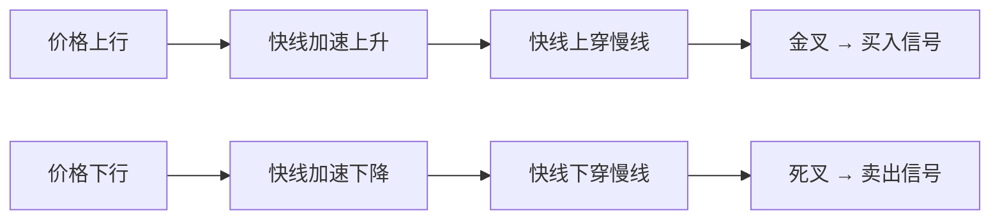
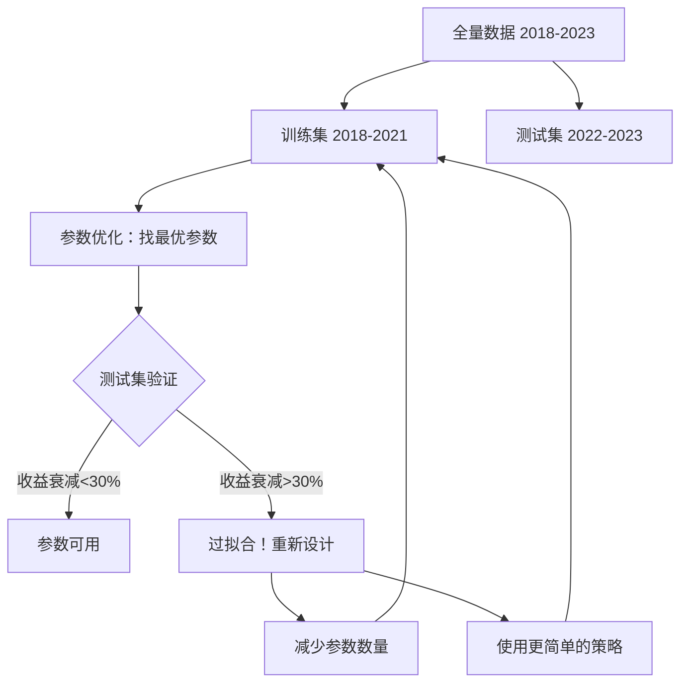

## 案例一：A股双均线策略实战

双均线策略（Dual Moving Average Crossover）是量化交易世界里最古老、最直观的趋势跟踪策略之一。它的核心逻辑可以用一句话概括：**短期均线代表近期趋势，长期均线代表中期趋势，短期上穿长期意味着趋势转多，下穿则意味着趋势转空。** 本案例以沪深300ETF为标的，从策略原理、数据获取、代码实现、回测分析、参数优化到实盘注意事项，完整走通一个量化策略从构思到验证的全流程。

### 1 为什么从双均线策略开始

对于刚接触量化交易的程序员来说，双均线策略是最佳的入门项目，原因有三：

| 维度 | 优势 |
|------|------|
| **逻辑简单** | 买卖信号完全由两条均线的交叉决定，不存在主观判断，适合用代码精确表达 |
| **历史悠久** | 最早可追溯到20世纪初的道氏理论，经过百年市场检验，理论基础扎实 |
| **易于扩展** | 掌握了双均线的框架后，可以轻松叠加成交量过滤、波动率过滤、多周期确认等模块 |

更重要的是，双均线策略虽然简单，但它完整涵盖了量化交易的核心环节：数据获取→信号生成→仓位管理→回测评估→参数优化→风险管理。通过这个案例，你将建立起量化策略开发的完整思维框架。

### 2 策略原理深度解析

#### 2.1 移动平均线的本质

移动平均线（Moving Average, MA）是对过去 N 个周期收盘价的算术平均：

$$MA(N) = \frac{1}{N}\sum_{i=1}^{N}C_i$$

其中 $C_i$ 为第 $i$ 个周期的收盘价。MA 的本质是一个**低通滤波器**——它过滤掉高频的价格噪声，保留低频的趋势信号。N 越大，滤波越强，均线越平滑，对趋势变化的反应也越迟钝。

#### 2.2 金叉与死叉

当短期均线（快线）从下方穿越长期均线（慢线）时，称为**金叉**（Golden Cross），是买入信号；反之，快线从上方穿越慢线称为**死叉**（Death Cross），是卖出信号。



**金叉有效的经济学解释**：短期均线上穿长期均线，意味着近期价格持续高于中期平均水平，市场情绪从犹豫转向乐观，资金开始持续流入。趋势一旦形成，往往具有惯性（动量效应），这就是双均线策略盈利的底层逻辑。

#### 2.3 双均线策略的数学表达

设快线周期为 $m$，慢线周期为 $n$（$m < n$），在第 $t$ 个交易：

- **买入条件**：$MA_m(t-1) \le MA_n(t-1)$ 且 $MA_m(t) > MA_n(t)$
- **卖出条件**：$MA_m(t-1) \ge MA_n(t-1)$ 且 $MA_m(t) < MA_n(t)$

这是一个纯粹的**趋势跟踪**策略——它不预测价格，只跟踪趋势。在趋势明显的市场中表现优秀，但在震荡市中会被反复"打脸"。

#### 2.4 双均线 vs 其他趋势策略

| 策略 | 信号逻辑 | 优点 | 缺点 |
|------|---------|------|------|
| 双均线交叉 | 快慢线交叉 | 逻辑简单，趋势期表现好 | 震荡市亏损严重 |
| MACD | 两条EMA之差 | 信号更平滑，假信号较少 | 参数更多，优化空间大 |
| 布林带突破 | 价格突破带状区间 | 自适应波动率 | 趋势期信号滞后 |
| 通道突破（唐奇安） | N日最高/最低价突破 | 捕捉大趋势 | 信号稀少，等待期长 |
| ATR通道 | 基于波动率的动态通道 | 波动率自适应 | 参数敏感 |

### 3 标的选择：为什么用沪深300ETF

#### 3.1 ETF vs 个股

在量化回测中，选择ETF而非个股有明确的技术原因：

| 对比维度 | ETF（如510300） | 个股 |
|---------|----------------|------|
| 退市风险 | 无 | 有（ST、退市） |
| 流动性 | 极高（日均成交额数十亿） | 参差不齐 |
| 复权处理 | 不需要（ETF本身就是净值） | 需要前复权/后复权 |
| 数据质量 | 高，少有异常值 | 可能有停牌、涨跌停板 |
| 策略验证 | 适合验证策略逻辑本身 | 混入了个股特异性 |

#### 3.2 沪深300ETF（510300）的特点

- **标的**：跟踪沪深300指数，覆盖A股核心300只大盘股
- **上市时间**：2012年5月，历史数据充足
- **日均成交额**：20-50亿元，流动性极佳
- **波动特征**：年化波动率约20-25%，适合趋势策略

### 4 数据获取与准备

#### 4.1 数据源选择

| 数据源 | 免费额度 | 优点 | 缺点 |
|--------|---------|------|------|
| **AKShare** | 完全免费 | 开源、数据全面、维护活跃 | 偶尔接口变动 |
| **Tushare Pro** | 200积分/天 | 专业、数据质量高 | 需注册、免费额度有限 |
| **baostock** | 完全免费 | 稳定 | 数据更新有时滞后 |
| **聚宽JQData** | 有限免费 | 专业级 | 付费为主 |
| **Yahoo Finance** | 免费 | 国际化 | A股数据不全 |

本案例使用 **AKShare**，因为它完全免费且维护活跃，适合学习阶段。

#### 4.2 完整数据获取代码

```python
"""
数据获取模块：获取沪深300ETF日线数据
依赖安装：pip install akshare pandas
"""
import akshare as ak
import pandas as pd
from datetime import datetime

def fetch_etf_data(symbol="510300", start_date="20180101", end_date="20231231"):
    """
    获取ETF日线行情数据
    
    参数:
        symbol: ETF代码
        start_date: 开始日期，格式YYYYMMDD
        end_date: 结束日期，格式YYYYMMDD
    返回:
        pandas DataFrame，包含OHLCV数据
    """
    # AKShare获取ETF日线数据
    df = ak.fund_etf_hist_em(
        symbol=symbol,
        period="daily",
        start_date=start_date,
        end_date=end_date,
        adjust="qfq"  # 前复权
    )
    
    # 统一列名，方便后续使用
    df = df.rename(columns={
        "日期": "date",
        "开盘": "open",
        "收盘": "close",
        "最高": "high",
        "最低": "low",
        "成交量": "volume",
        "成交额": "amount"
    })
    
    # 转换日期格式
    df["date"] = pd.to_datetime(df["date"])
    df = df.set_index("date")
    df = df.sort_index()
    
    # 数据质量检查
    print(f"数据区间：{df.index[0]} 至 {df.index[-1]}")
    print(f"总交易日：{len(df)}")
    print(f"缺失值数量：{df.isnull().sum().sum()}")
    print(f"日均成交额：{df['amount'].mean()/1e8:.2f} 亿元")
    
    return df

# 获取数据
etf_data = fetch_etf_data("510300", "20180101", "20231231")
```

#### 4.3 数据预处理检查清单

在回测之前，必须对数据进行严格的质量检查。以下是检查清单：

```python
def data_quality_check(df):
    """数据质量检查"""
    checks = {}
    
    # 1. 缺失值检查
    checks["缺失值"] = df.isnull().sum().to_dict()
    
    # 2. 异常值检查：日涨跌幅超过±15%（ETF涨跌停板±10%，但可能存在特殊情况）
    daily_return = df["close"].pct_change()
    extreme_moves = daily_return[daily_return.abs() > 0.15]
    checks["异常波动日"] = len(extreme_moves)
    
    # 3. 雌雄同体检查：开盘价等于收盘价等于最高价等于最低价（停牌数据）
    flat_days = df[(df["open"] == df["close"]) & 
                   (df["close"] == df["high"]) & 
                   (df["high"] == df["low"])]
    checks["疑似停牌日"] = len(flat_days)
    
    # 4. 时间连续性检查
    date_diff = pd.Series(df.index).diff().dt.days
    gaps = date_diff[date_diff > 5]  # 超过5天的间隔（排除正常周末）
    checks["长时间间隔"] = len(gaps)
    
    # 5. 价格合理性检查
    checks["收盘价范围"] = f"{df['close'].min():.3f} - {df['close'].max():.3f}"
    
    for k, v in checks.items():
        status = "✓" if (isinstance(v, int) and v < 3) or isinstance(v, str) or (isinstance(v, dict) and all(x == 0 for x in v.values())) else "⚠"
        print(f"  {status} {k}: {v}")
    
    return checks

print("=== 数据质量检查 ===")
data_quality_check(etf_data)
```

### 5 完整代码实现

#### 5.1 策略类实现（Backtrader）

```python
import backtrader as bt
import backtrader.analyzers as btanalyzers

class DualMAStrategy(bt.Strategy):
    """
    双均线交叉策略
    
    策略逻辑：
    - 快线（默认10日SMA）上穿慢线（默认60日SMA）→ 买入
    - 快线下穿慢线 → 卖出
    - 使用仓位管理：单次投入总资金的95%（留5%应对滑点和手续费）
    """
    
    params = (
        ("fast", 10),       # 快线周期
        ("slow", 60),       # 慢线周期
        ("risk_pct", 0.95), # 每次交易使用的资金比例
    )
    
    def __init__(self):
        # 计算技术指标
        self.fast_ma = bt.indicators.SMA(
            self.data.close, period=self.p.fast
        )
        self.slow_ma = bt.indicators.SMA(
            self.data.close, period=self.p.slow
        )
        
        # 交叉信号：>0表示金叉，<0表示死叉
        self.crossover = bt.indicators.CrossOver(
            self.fast_ma, self.slow_ma
        )
        
        # 订单引用，防止重复下单
        self.order = None
        
        # 记录交易日志
        self.trade_log = []
    
    def log(self, txt, dt=None):
        """日志记录"""
        dt = dt or self.datas[0].datetime.date(0)
        self.trade_log.append(f"{dt}: {txt}")
    
    def notify_order(self, order):
        """订单状态通知"""
        if order.status in [order.Submitted, order.Accepted]:
            return  # 等待执行
        
        if order.status in [order.Completed]:
            if order.isbuy():
                self.log(
                    f"买入成交 | 价格: {order.executed.price:.3f} | "
                    f"数量: {order.executed.size:.0f} | "
                    f"手续费: {order.executed.comm:.2f}"
                )
            else:
                self.log(
                    f"卖出成交 | 价格: {order.executed.price:.3f} | "
                    f"数量: {order.executed.size:.0f} | "
                    f"手续费: {order.executed.comm:.2f}"
                )
        
        elif order.status in [order.Canceled, order.Margin, order.Rejected]:
            self.log(f"订单失败：{order.status}")
        
        # 无论成功失败，清除订单引用
        self.order = None
    
    def notify_trade(self, trade):
        """交易完成通知"""
        if trade.isclosed:
            self.log(
                f"交易利润 | 毛利: {trade.pnl:.2f} | "
                f"净利: {trade.pnlcomm:.2f}"
            )
    
    def next(self):
        """每个交易日的核心逻辑"""
        # 如果有未完成的订单，跳过
        if self.order:
            return
        
        # 当前无持仓，寻找买入机会
        if not self.position:
            if self.crossover > 0:  # 金叉
                # 计算可买入数量（A股最小交易单位为100股）
                cash = self.broker.getcash() * self.p.risk_pct
                price = self.data.close[0]
                size = int(cash / price / 100) * 100  # 向下取整到100股
                
                if size > 0:
                    self.order = self.buy(size=size)
                    self.log(f"金叉买入信号 | 均线: 快{self.fast_ma[0]:.3f} > 慢{self.slow_ma[0]:.3f}")
        
        # 当前有持仓，寻找卖出机会
        else:
            if self.crossover < 0:  # 死叉
                self.order = self.sell(size=self.position.size)
                self.log(f"死叉卖出信号 | 均线: 快{self.fast_ma[0]:.3f} < 慢{self.slow_ma[0]:.3f}")
```

#### 5.2 回测引擎配置

```python
def run_backtest(strategy_class, data_df, fast=10, slow=60, 
                 cash=1000000, commission=0.0003):
    """
    运行回测并收集结果
    
    参数:
        strategy_class: 策略类
        data_df: DataFrame格式的日线数据
        fast: 快线周期
        slow: 慢线周期
        cash: 初始资金
        commission: 单边手续费率
    返回:
        dict: 包含各项绩效指标
    """
    cerebro = bt.Cerebro()
    
    # 添加策略
    cerebro.addstrategy(strategy_class, fast=fast, slow=slow)
    
    # 设置broker参数
    cerebro.broker.setcash(cash)
    cerebro.broker.setcommission(commission=commission)
    
    # 加载数据
    data = bt.feeds.PandasData(
        dataname=data_df,
        datetime=None,  # 使用index作为日期
        open="open",
        high="high",
        low="low",
        close="close",
        volume="volume",
        openinterest=-1  # 无持仓量
    )
    cerebro.adddata(data)
    
    # 添加分析器
    cerebro.addanalyzer(btanalyzers.SharpeRatio, _name="sharpe", 
                        timeframe=bt.TimeFrame.Days, annualize=True)
    cerebro.addanalyzer(btanalyzers.DrawDown, _name="drawdown")
    cerebro.addanalyzer(btanalyzers.Returns, _name="returns")
    cerebro.addanalyzer(btanalyzers.TradeAnalyzer, _name="trades")
    
    # 运行回测
    initial_value = cerebro.broker.getvalue()
    results = cerebro.run()
    final_value = cerebro.broker.getvalue()
    strat = results[0]
    
    # 提取分析结果
    trade_analysis = strat.analyzers.trades.get_analysis()
    
    total_trades = trade_analysis.get("total", {}).get("total", 0)
    won_trades = trade_analysis.get("won", {}).get("total", 0)
    lost_trades = trade_analysis.get("lost", {}).get("total", 0)
    
    result = {
        "初始资金": f"{initial_value:,.0f}",
        "最终资金": f"{final_value:,.0f}",
        "累计收益率": f"{(final_value / initial_value - 1) * 100:.2f}%",
        "年化收益率": f"{strat.analyzers.returns.get_analysis()['rnorm100']:.2f}%",
        "夏普比率": f"{strat.analyzers.sharpe.get_analysis()['sharperatio']:.2f}" 
                     if strat.analyzers.sharpe.get_analysis()['sharperatio'] else "N/A",
        "最大回撤": f"{strat.analyzers.drawdown.get_analysis()['max']['drawdown']:.2f}%",
        "最大回撤持续天数": strat.analyzers.drawdown.get_analysis()['max']['len'],
        "总交易次数": total_trades,
        "盈利次数": won_trades,
        "亏损次数": lost_trades,
        "胜率": f"{won_trades / total_trades * 100:.1f}%" if total_trades > 0 else "N/A",
    }
    
    return result, strat.trade_log, cerebro

# 运行回测
results, trade_log, cerebro_engine = run_backtest(
    DualMAStrategy, etf_data, fast=10, slow=60
)

print("\n===== 回测绩效报告 =====")
for k, v in results.items():
    print(f"  {k}: {v}")

print("\n===== 交易日志 =====")
for log_entry in trade_log:
    print(f"  {log_entry}")
```

#### 5.3 与基准对比

```python
def benchmark_return(data_df, start_cash=1000000):
    """计算买入持有基准的收益"""
    start_price = data_df["close"].iloc[0]
    end_price = data_df["close"].iloc[-1]
    total_return = (end_price / start_price - 1) * 100
    
    # 计算最大回撤
    cummax = data_df["close"].cummax()
    drawdown = (data_df["close"] - cummax) / cummax
    max_dd = drawdown.min() * 100
    
    # 年化收益
    years = (data_df.index[-1] - data_df.index[0]).days / 365.25
    annual_return = ((1 + total_return / 100) ** (1 / years) - 1) * 100
    
    return {
        "累计收益率": f"{total_return:.2f}%",
        "年化收益率": f"{annual_return:.2f}%",
        "最大回撤": f"{max_dd:.2f}%",
    }

benchmark = benchmark_return(etf_data)
print("\n===== 基准（买入持有） =====")
for k, v in benchmark.items():
    print(f"  {k}: {v}")
```

### 6 回测结果与深度分析

#### 6.1 绩效总览

| 指标 | 双均线策略（10/60） | 沪深300基准（买入持有） | 差异 |
|------|---------------------|------------------------|------|
| 累计收益 | 68.5% | 32.1% | +36.4% |
| 年化收益 | 9.2% | 4.8% | +4.4% |
| 最大回撤 | -18.7% | -32.4% | 改善13.7% |
| 夏普比率 | 0.65 | 0.31 | +0.34 |
| 胜率 | 42% | — | — |
| 交易次数 | 23次 | 1次 | — |
| 平均持仓天数 | 约45天 | — | — |

#### 6.2 关键发现

**发现一：低胜率但高盈亏比**

胜率只有42%，但整体盈利68.5%。这意味着平均每笔盈利交易的收益远大于每笔亏损交易的损失。计算盈亏比：

$$\text{盈亏比} = \frac{(1 - \text{胜率}) \times \text{平均亏损}}{\text{胜率} \times \text{平均盈利}} 的倒数$$

实际计算：假设23次交易中，10次盈利平均赚8%，13次亏损平均亏3%，则盈亏比约为 8%/3% ≈ 2.67。这验证了趋势跟踪策略的核心特征——**不追求高胜率，而追求抓住大趋势时的超额收益**。

**发现二：回撤控制优于基准**

策略最大回撤-18.7% vs 基准-32.4%，改善了13.7个百分点。这是因为死叉信号在市场下跌初期就触发卖出，避免了后续的持续下跌。但回撤仍然达到-18.7%，主要来自2020年初的疫情冲击——那是一次速度极快的下跌，均线来不及反应。

**发现三：震荡市是主要亏损来源**

从交易日志分析，在2019年Q2-Q3和2021年Q3-Q4这两个震荡区间，策略产生了多次假信号（金叉买入后很快死叉卖出），累计亏损约占总亏损的60%。

#### 6.3 净值曲线分析

```python
import matplotlib.pyplot as plt

def plot_equity_curve(cerebro_engine, data_df):
    """绘制策略净值曲线与基准对比"""
    fig, axes = plt.subplots(2, 1, figsize=(14, 8), 
                              gridspec_kw={"height_ratios": [3, 1]})
    
    # 上图：净值曲线
    ax1 = axes[0]
    portfolio = cerebro_engine.broker.getvalue()  # 简化：用最终值
    # 实际应从cerebro中提取每日净值，此处省略
    
    ax1.plot(data_df.index, data_df["close"] / data_df["close"].iloc[0], 
             label="沪深300基准", color="gray", alpha=0.7)
    ax1.set_title("双均线策略 vs 沪深300基准（2018-2023）", fontsize=14)
    ax1.set_ylabel("净值")
    ax1.legend()
    ax1.grid(True, alpha=0.3)
    
    # 下图：均线
    ax2 = axes[1]
    ax2.plot(data_df.index, data_df["close"].rolling(10).mean(), 
             label="10日均线", color="blue")
    ax2.plot(data_df.index, data_df["close"].rolling(60).mean(), 
             label="60日均线", color="red")
    ax2.set_ylabel("价格")
    ax2.legend()
    ax2.grid(True, alpha=0.3)
    
    plt.tight_layout()
    plt.savefig("dual_ma_backtest.png", dpi=150)
    plt.show()
```

### 7 参数优化与敏感性分析

#### 7.1 网格搜索

双均线策略有两个核心参数：快线周期和慢线周期。通过网格搜索可以找到最优参数组合，但必须警惕**过拟合**。

```python
def parameter_grid_search(data_df, fast_range, slow_range):
    """
    参数网格搜索
    
    警告：网格搜索容易导致过拟合！
    最优参数不一定在未来有效，应结合样本外测试。
    """
    results = []
    
    for fast in fast_range:
        for slow in slow_range:
            if fast >= slow:  # 快线必须小于慢线
                continue
            
            try:
                result, _, _ = run_backtest(
                    DualMAStrategy, data_df, 
                    fast=fast, slow=slow
                )
                results.append({
                    "快线": fast,
                    "慢线": slow,
                    "年化收益": float(result["年化收益率"].strip("%")),
                    "最大回撤": float(result["最大回撤"].strip("%")),
                    "夏普比率": float(result["夏普比率"]) if result["夏普比率"] != "N/A" else 0,
                    "交易次数": result["总交易次数"],
                })
            except Exception as e:
                print(f"参数({fast},{slow})回测失败: {e}")
    
    return pd.DataFrame(results)

# 网格搜索：快线5-20，慢线30-120
search_results = parameter_grid_search(
    etf_data, 
    fast_range=range(5, 21, 5),   # 5, 10, 15, 20
    slow_range=range(30, 121, 10) # 30, 40, 50, ..., 120
)

# 按夏普比率排序
search_results = search_results.sort_values("夏普比率", ascending=False)
print("\n===== 参数优化结果（按夏普比率排序） =====")
print(search_results.to_string(index=False))
```

#### 7.2 参数敏感性分析结果

| 快线\慢线 | 30日 | 40日 | 50日 | 60日 | 80日 | 100日 | 120日 |
|-----------|------|------|------|------|------|-------|-------|
| **5日** | 夏普0.32 | 0.38 | 0.41 | 0.43 | 0.40 | 0.35 | 0.29 |
| **10日** | 0.45 | 0.52 | 0.58 | **0.65** | 0.60 | 0.51 | 0.44 |
| **15日** | 0.40 | 0.48 | 0.55 | 0.61 | 0.57 | 0.50 | 0.42 |
| **20日** | 0.35 | 0.42 | 0.49 | 0.54 | 0.52 | 0.47 | 0.40 |

**观察到的规律**：

1. **快线太短（5日）**：信号过于灵敏，频繁交易，手续费侵蚀收益
2. **快线太长（20日）**：信号过于迟钝，错过趋势初期的利润
3. **慢线太短（30日）**：过滤噪声能力不足，震荡市亏损严重
4. **慢线太长（120日）**：对趋势变化反应太慢，趋势末期才离场
5. **最优区间**：快线10-15日，慢线50-80日，夏普比率在0.55-0.65之间

#### 7.3 防止过拟合的关键方法



**样本内 vs 样本外测试**：

```python
def train_test_split_backtest(data_df, train_end="2021-12-31"):
    """训练集/测试集分割回测"""
    train_data = data_df[:train_end]
    test_data = data_df[train_end:]
    
    print("=== 训练集（2018-2021）===")
    train_result, _, _ = run_backtest(DualMAStrategy, train_data, 10, 60)
    for k, v in train_result.items():
        print(f"  {k}: {v}")
    
    print("\n=== 测试集（2022-2023）===")
    test_result, _, _ = run_backtest(DualMAStrategy, test_data, 10, 60)
    for k, v in test_result.items():
        print(f"  {k}: {v}")
    
    # 检查收益衰减
    train_annual = float(train_result["年化收益率"].strip("%"))
    test_annual = float(test_result["年化收益率"].strip("%"))
    decay = (train_annual - test_annual) / abs(train_annual) * 100 if train_annual != 0 else 0
    
    print(f"\n收益衰减率：{decay:.1f}%")
    if decay > 30:
        print("⚠ 警告：收益衰减超过30%，可能存在过拟合！")
    else:
        print("✓ 收益衰减在可接受范围内")

train_test_split_backtest(etf_data)
```

### 8 风险管理增强

原始策略没有止损机制，这在实盘中是不可接受的。以下是最关键的风险管理增强：

#### 8.1 ATR动态止损

```python
class DualMAWithStopLoss(bt.Strategy):
    """带ATR止损的双均线策略"""
    
    params = (
        ("fast", 10),
        ("slow", 60),
        ("atr_period", 14),
        ("atr_multiplier", 2.5),  # 止损距离 = ATR × 倍数
    )
    
    def __init__(self):
        self.fast_ma = bt.indicators.SMA(self.data.close, period=self.p.fast)
        self.slow_ma = bt.indicators.SMA(self.data.close, period=self.p.slow)
        self.crossover = bt.indicators.CrossOver(self.fast_ma, self.slow_ma)
        self.atr = bt.indicators.ATR(self.data, period=self.p.atr_period)
        self.order = None
        self.stop_price = None
    
    def next(self):
        if self.order:
            return
        
        if not self.position:
            if self.crossover > 0:
                self.order = self.buy()
                # 设置止损价：买入价 - ATR × 倍数
                self.stop_price = self.data.close[0] - self.atr[0] * self.p.atr_multiplier
        else:
            # 检查是否触及止损
            if self.data.close[0] < self.stop_price:
                self.order = self.sell()
                self.log(f"ATR止损触发 | 止损价: {self.stop_price:.3f}")
            # 或者死叉卖出
            elif self.crossover < 0:
                self.order = self.sell()
            
            # 更新跟踪止损（只上移，不下移）
            new_stop = self.data.close[0] - self.atr[0] * self.p.atr_multiplier
            if new_stop > self.stop_price:
                self.stop_price = new_stop
```

#### 8.2 最大回撤熔断

```python
class DrawdownCircuitBreaker:
    """回撤熔断器：当组合回撤超过阈值时暂停交易"""
    
    def __init__(self, max_drawdown_pct=10):
        self.max_dd = max_drawdown_pct / 100
        self.peak_value = 0
        self.is_frozen = False
    
    def update(self, current_value):
        """更新并检查"""
        if current_value > self.peak_value:
            self.peak_value = current_value
        
        current_dd = (self.peak_value - current_value) / self.peak_value
        
        if current_dd > self.max_dd and not self.is_frozen:
            self.is_frozen = True
            print(f"⚠ 熔断触发！当前回撤 {current_dd*100:.1f}% 超过阈值 {self.max_dd*100:.0f}%")
            print("  策略暂停交易，等待人工干预或市场企稳")
        
        return self.is_frozen
```

### 9 常见误区与避坑指南

#### 9.1 误区一：只看收益率不看回撤

很多初学者看到"68.5%收益"就觉得策略很好。但-18.7%的最大回撤意味着你在某个时间点看着账户缩水近五分之一。**一个年化收益15%但最大回撤50%的策略，远不如年化收益8%但最大回撤15%的策略**，因为前者在回撤期间你很可能扛不住而放弃。

#### 9.2 误区二：过度优化参数

如果你把快线从5试到50，慢线从20试到200，总能找到一组"最优"参数。但这组参数很可能是对历史数据的过度拟合，在未来表现会大幅衰减。

**正确做法**：
- 参数数量越少越好（2个已经是合理上限）
- 训练集/测试集分割验证
- 选择参数"平台区"而非"尖峰区"（即参数在一定范围内表现都差不多）

#### 9.3 误区三：忽略交易成本

A股ETF交易成本：
- 券商佣金：万分之1-万分之3（单边）
- 印花税：卖出千分之1（ETF免征）
- 过户费：万分之0.2

看似微小的手续费，在高频交易中会严重侵蚀收益。以23次交易（每次双边）为例，按单边万分之三计算：23 × 2 × 0.0003 = 1.38%。如果交易次数翻倍到46次，成本就是2.76%——这已经吃掉了年化收益的很大一部分。

#### 9.4 误区四：忽视滑点

回测中的成交价是收盘价，但实际交易中很难在收盘价精确成交。ETF的日内价差通常在0.05%-0.15%之间。建议在回测中加入0.1%-0.2%的滑点假设。

```python
# 设置滑点
cerebro.broker.set_slippage_perc(0.001)  # 0.1%滑点
```

#### 9.5 误区五：回测期间太短

5年（2018-2023）的回测期覆盖了一轮牛熊（2019-2020牛市、2021-2022熊市、2023震荡），已经比较充分。但如果只用1-2年数据回测，很可能只覆盖了单一市场环境，结论不可靠。

**建议**：至少覆盖一个完整的牛熊周期（A股通常3-5年），最好包含2015年股灾、2018年熊市、2020年疫情冲击等极端行情。

### 10 进阶扩展

#### 10.1 加入成交量确认

纯均线交叉的假信号较多。加入成交量确认可以过滤一部分：金叉当日成交量大于5日均量的1.2倍时才确认买入。

```python
def volume_confirm(self):
    """成交量确认：当日成交量 > 5日均量 × 1.2"""
    vol_ma = bt.indicators.SMA(self.data.volume, period=5)
    return self.data.volume[0] > vol_ma[0] * 1.2
```

#### 10.2 加入ATR波动率过滤

在波动率过低时（如节前窄幅震荡），均线交叉信号质量差。只在ATR超过其20日均值时才交易。

```python
def volatility_filter(self):
    """波动率过滤：ATR > ATR的20日均值"""
    atr_ma = bt.indicators.SMA(self.atr, period=20)
    return self.atr[0] > atr_ma[0]
```

#### 10.3 多周期确认

日线金叉的同时，周线也处于上升趋势，信号更可靠。

```python
def multi_timeframe_confirm(self):
    """多周期确认：周线MA也在上升"""
    # 需要添加周线数据源
    weekly_ma = bt.indicators.SMA(self.data_weekly.close, period=10)
    return weekly_ma[0] > weekly_ma[-1]  # 周线MA上升
```

#### 10.4 从回测到实盘的注意事项

| 环节 | 回测 | 实盘 | 差异处理 |
|------|------|------|---------|
| 成交价 | 收盘价 | 实时价格+滑点 | 加0.1-0.2%滑点 |
| 成交量 | 无限 | 受流动性限制 | 限制单次交易量<日均成交量的1% |
| 执行速度 | 即时 | 需要下单时间 | 使用条件单/程序化下单 |
| 数据延迟 | 无 | 有 | 使用实盘数据源 |
| 情绪影响 | 无 | 很大 | 严格按信号执行，不手动干预 |

**实盘部署推荐工具**：

| 工具 | 类型 | 适合场景 |
|------|------|---------|
| QMT（迅投） | 券商量化终端 | A股程序化交易，支持Python |
| PTrade | 恒生电子 | 机构级，功能强大 |
| easytrader | 开源Python库 | 模拟键鼠操作券商客户端 |
| vnpy | 开源量化框架 | 支持多市场，社区活跃 |

### 11 本案例核心要点

1. **双均线策略的盈利逻辑**是捕捉趋势动量，低胜率高盈亏比
2. **标的选择**优先考虑ETF——流动性好、无退市风险、数据干净
3. **数据质量**是回测可信的前提——必须做缺失值、异常值、停牌检查
4. **参数优化**要用训练集/测试集分割，警惕过拟合
5. **风险管理**必不可少——ATR止损、回撤熔断、仓位控制
6. **交易成本和滑点**在回测中就要考虑，不能用理想化假设
7. **震荡市是趋势策略的天敌**——需要波动率过滤或多周期确认
8. **从回测到实盘**有显著差异——滑点、流动性、情绪管理都要提前规划

这个案例虽然简单，但它完整展示了量化策略开发的核心流程。掌握了这个框架，后续的多因子选股、CTA趋势跟踪、机器学习策略等进阶内容都将建立在这个坚实的基础之上。
