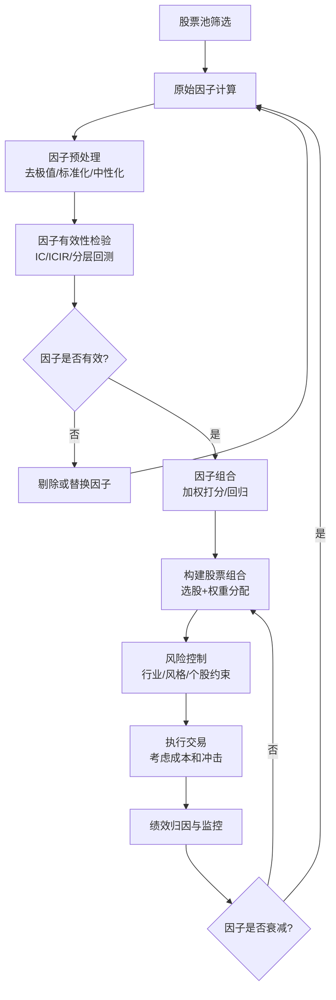

## 案例二：多因子选股策略

多因子选股是量化投资中最经典、应用最广泛的策略框架之一。它的核心思想是：**股票的超额收益可以被一组系统性因子解释，通过筛选和组合这些因子，可以构建出长期跑赢基准的股票组合。** 本案例从理论基础出发，完整演示一个多因子选股策略的设计、实现、回测与优化全过程。

### 为什么选择多因子策略

单因子策略（如纯价值策略、纯动量策略）在某些市场环境下表现优异，但在另一些环境下可能大幅回撤。多因子策略的核心优势在于**分散因子风险**——不同因子在不同经济周期和市场阶段各有表现，组合后可以平滑收益曲线、降低最大回撤。

从学术渊源看，多因子模型经历了三代演进：

| 代际 | 代表模型 | 核心思想 |
|------|---------|---------|
| 第一代 | CAPM（1964） | 单因子：市场风险溢价解释收益 |
| 第二代 | Fama-French 三因子（1993） | 市场+规模+价值三因子 |
| 第三代 | Fama-French 五因子（2015） | 加入盈利能力和投资因子 |

实务中，量化私募常用的因子数量从十几个到上百个不等，但核心逻辑始终是：**找到能持续预测未来收益的截面变量，并以合理的方式组合它们。**

### 策略整体架构

下面用一张流程图展示完整的多因子策略工作流：



### 因子选择的理论框架

#### 因子的经济学含义

一个有效的因子必须有清晰的经济学解释，而不仅仅是统计上的相关性。常见的因子类别包括：

| 类别 | 代表因子 | 经济学解释 | 典型周期表现 |
|------|---------|-----------|------------|
| 价值因子 | EP（E/P）、BP（B/P）、股息率 | 便宜的股票长期回报更高（行为金融：投资者过度外推） | 经济复苏期表现突出 |
| 动量因子 | 过去N日收益率 | 趋势延续（信息缓慢扩散、投资者反应不足） | 牛市中后期 |
| 质量因子 | ROE、毛利率、资产负债率 | 高质量公司经营更稳健，长期价值更高 | 熊市和震荡市有防御性 |
| 成长因子 | 营收增速、利润增速 | 高成长公司未来盈利空间大 | 流动性宽松期 |
| 波动因子 | 历史波动率、特质波动率 | 低波动异象——低波动股票长期收益更高 | 全周期防御 |
| 流动性因子 | 换手率、Amihud非流动性 | 流动性差的股票有流动性溢价 | 市场恐慌期 |

#### 因子选择的三个标准

1. **经济逻辑**：因子背后有说得通的经济学或行为金融学解释，而非纯粹的数据挖掘
2. **统计显著性**：因子IC（信息系数）显著不为零，且在不同时间段和股票池中保持稳定
3. **边际贡献**：新加入的因子不能与已有因子高度相关，否则增加的是冗余而非信息

### 因子定义与计算

本案例选择三个经典因子：价值（EP）、动量（Momentum）、质量（ROE）。这三个因子分别代表了"便宜""趋势好""质量高"三个维度，相互之间相关性较低，组合效果较好。

#### 因子定义表

| 因子 | 变量名 | 计算公式 | 方向 | 经济逻辑 |
|------|--------|---------|------|---------|
| 价值因子 | EP | 1 / PE_TTM | 越高越好（越便宜） | 低估值股票均值回归概率更高 |
| 动量因子 | momentum | 过去60个交易日收益率，剔除最近5个交易日 | 越高越好（趋势延续） | 剔除短期反转效应，捕捉中期趋势 |
| 质量因子 | ROE | 净利润 / 净资产 | 越高越好（盈利能力强） | 高ROE公司持续创造价值 |

**动量因子剔除最近5个交易日的原因**：学术研究（Jegadeesh & Titman, 1993）发现，最近一周的收益率存在强烈的短期反转效应——过去一周涨得多的股票下周倾向于回调。剔除这5个交易日可以过滤掉短期噪音，使动量因子更纯净。

### 因子预处理全流程

原始因子数据通常存在三个问题：极端值干扰、量纲不一致、行业偏差。预处理就是解决这三个问题。

#### 第一步：去极值（MAD法）

极端值会严重扭曲标准化结果。例如某只股票PE为负数（亏损），或某只股票短期暴涨导致动量因子为500%——这些极端值如果不处理，标准化后会压缩正常数据的区分度。

去极值有三种常用方法：

| 方法 | 原理 | 优点 | 缺点 |
|------|------|------|------|
| MAD法（中位数绝对偏差） | 以中位数为基准，用MAD衡量离散程度 | 对极端值鲁棒 | 计算略复杂 |
| Sigma法（3σ） | 以均值为基准，±3倍标准差截断 | 简单直观 | 均值和标准差本身受极端值影响 |
| 分位数法 | 直接用1%和99%分位数截断 | 最简单 | 固定比例，不够灵活 |

本案例采用MAD法，具体步骤：

```python
def winsorize_mad(series, n=5):
    """MAD法去极值
    
    Args:
        series: 因子值序列
        n: MAD倍数，通常取3-5，越大越宽松
    
    Returns:
        去极值后的因子值序列
    """
    median = series.median()
    # MAD = Median(|Xi - Median(X)|)
    mad = (series - median).abs().median()
    # 将MAD转换为与标准差等价的量级（正态分布下 MAD ≈ 0.6745σ）
    mad_e = 1.4826 * mad
    lower = median - n * mad_e
    upper = median + n * mad_e
    return series.clip(lower, upper)
```

**为什么用1.4826这个系数？** 在正态分布假设下，MAD与标准差的关系为 σ ≈ 1.4826 × MAD。乘以这个系数后，MAD_e 与标准差在量级上对齐，n=5 相当于约 ±5σ，只截断最极端的异常值。

#### 第二步：标准化（Z-score）

不同因子的量纲差异巨大——EP的取值范围可能是0.01~0.2，而动量因子的范围可能是-30%~+200%。标准化让所有因子处于同一量级，便于加权组合。

```python
def standardize_zscore(series):
    """Z-score标准化
    
    标准化后因子均值为0，标准差为1。
    注意：如果因子分布严重偏态，可以先取对数再标准化。
    """
    mean = series.mean()
    std = series.std()
    if std == 0:
        return series * 0  # 常数列返回全零
    return (series - mean) / std
```

**Z-score标准化的局限**：当因子分布严重偏态时（如市值因子），Z-score标准化效果不佳。此时可以先对因子取对数，再做Z-score；或者使用排序分位数标准化（Rank Normalization），将因子值映射到正态分布。

#### 第三步：行业中性化（关键但常被忽略）

不做行业中性化时，策略可能"伪装"成行业轮动策略。例如银行股普遍PE低（EP高），如果不对EP做行业中性化，策略会自动超配银行股——这不是选股能力，而是行业暴露。

行业中性化的做法是：在每个行业内部做标准化，使得因子值反映的是"在同行业内，这只股票相对于行业平均水平的偏离程度"。

```python
def neutralize_by_industry(factor_df, industry_col='industry'):
    """行业中性化：在每个行业内做Z-score标准化
    
    Args:
        factor_df: 包含因子值和行业分类的DataFrame
        industry_col: 行业分类列名
    
    Returns:
        中性化后的因子值
    """
    return factor_df.groupby(industry_col)[factor_col].transform(
        lambda x: (x - x.mean()) / x.std() if x.std() > 0 else x * 0
    )
```

行业中性化的效果：策略的行业分布将与基准（如沪深300）保持一致，超额收益完全来自个股选择而非行业偏离。

### 因子有效性检验

在组合因子之前，必须验证每个因子是否真的有预测能力。不能因为"直觉上有效"就直接使用——很多看似合理的因子在历史数据上并没有显著的预测效果。

#### IC分析法

IC（Information Coefficient）是因子值与下期收益率的截面相关系数。常用的有Pearson IC和Spearman Rank IC（后者更稳健，因为不受极端值影响）。

```python
import scipy.stats as stats

def calc_factor_ic(factor_values, future_returns):
    """计算单期因子IC（Spearman Rank IC）"""
    # 去掉缺失值
    valid = pd.DataFrame({'factor': factor_values, 'ret': future_returns}).dropna()
    ic, p_value = stats.spearmanr(valid['factor'], valid['ret'])
    return ic, p_value

def calc_ic_series(factor_df, factor_col, return_col, date_col):
    """计算因子IC的时间序列"""
    ic_list = []
    for date in factor_df[date_col].unique():
        subset = factor_df[factor_df[date_col] == date]
        ic, p_val = calc_factor_ic(subset[factor_col], subset[return_col])
        ic_list.append({'date': date, 'IC': ic, 'p_value': p_val})
    return pd.DataFrame(ic_list)
```

**IC值的判断标准：**

| IC均值 | ICIR | 判断 |
|--------|------|------|
| \|IC\| > 0.03 | \|ICIR\| > 0.5 | 有效因子，值得使用 |
| 0.02 < \|IC\| < 0.03 | 0.3 < \|ICIR\| < 0.5 | 边缘有效，需要更多验证 |
| \|IC\| < 0.02 | \|ICIR\| < 0.3 | 无效因子，建议放弃 |

ICIR = IC均值 / IC标准差，衡量的是IC的稳定性。一个IC均值为0.04但波动很大的因子，可能不如一个IC均值为0.03但非常稳定的因子。

#### 分层回测法

分层回测是另一种直观的因子检验方法：按因子值将股票分成N组（通常5组或10组），观察各组的收益差异。如果因子有效，最高组应系统性地跑赢最低组。

```python
def quintile_backtest(factor_df, factor_col, return_col, n_groups=5):
    """分层回测：按因子值分组，计算各组平均收益
    
    Args:
        factor_df: 包含因子值和未来收益的DataFrame
        factor_col: 因子列名
        return_col: 未来收益率列名
        n_groups: 分组数量
    
    Returns:
        各组平均收益的DataFrame
    """
    factor_df = factor_df.copy()
    factor_df['group'] = factor_df.groupby('date')[factor_col].transform(
        lambda x: pd.qcut(x, n_groups, labels=False, duplicates='drop')
    )
    group_returns = factor_df.groupby(['date', 'group'])[return_col].mean().unstack()
    return group_returns
```

**判断标准**：如果因子有效，分层收益图应呈现单调递增或递减的模式——即因子值越高（或越低）的组，收益越高。如果中间组收益最高、两端最低，说明因子与收益的关系不是线性的，可能需要做非线性变换。

### 因子组合方法

有了通过检验的因子后，下一步是将它们组合成一个综合得分。组合方法的选择直接影响策略的最终表现。

#### 方法一：等权打分法（本案例采用）

最简单的方法，对每个因子的标准化值赋予相同权重，加总得到综合得分。

```python
# 等权组合
data['score'] = (data['EP_z'] + data['momentum_z'] + data['quality_z']) / 3
```

**优点**：简单、不需要额外估计参数、不容易过拟合。
**缺点**：假设所有因子同等重要，忽略了因子预测能力的差异。

#### 方法二：IC加权法

用因子的历史平均IC作为权重，预测能力强的因子获得更高权重。

```python
def ic_weighted_score(factor_df, factor_cols, ic_dict):
    """IC加权组合
    
    Args:
        factor_df: 包含各因子标准化值的DataFrame
        factor_cols: 因子列名列表
        ic_dict: {因子名: 历史平均IC} 的字典
    
    Returns:
        加权综合得分
    """
    total_ic = sum(abs(v) for v in ic_dict.values())
    score = 0
    for col in factor_cols:
        weight = abs(ic_dict[col]) / total_ic
        # IC为负时反转因子方向
        sign = 1 if ic_dict[col] > 0 else -1
        score += sign * weight * factor_df[col]
    return score
```

**优点**：让数据决定权重，更客观。
**缺点**：IC的历史值不一定能代表未来，存在过拟合风险。

#### 方法三：最优化方法

用二次规划求解最优权重，使组合因子的IC均值最高（或ICIR最高），同时满足权重约束。

这种方法在理论上最优，但在样本量有限时容易过拟合。实务中建议用滚动窗口估计，并加入正则化约束（如权重上下限、权重变化幅度限制）。

#### 本案例的权重选择

本案例采用手动赋权：价值35%、动量30%、质量35%。这个权重分配的逻辑是：

- **价值和质量因子权重较高**：这两个因子在A股市场有长期稳定的超额收益，经济逻辑清晰
- **动量因子权重略低**：A股市场的动量效应相比美股较弱，且在市场风格切换时容易失效
- **价值和质量权重接近**：两者都是基本面驱动的因子，但在不同行业有不同的表现模式，互为补充

### 完整策略实现

```python
import pandas as pd
import numpy as np
import scipy.stats as stats

class MultiFactorStrategy:
    """多因子选股策略
    
    因子：价值(EP) + 动量(Momentum) + 质量(ROE)
    组合方式：加权打分
    持仓数量：30只
    调仓频率：月度
    """
    
    def __init__(self, factors=None, weights=None, top_n=30):
        """
        Args:
            factors: 因子配置字典，格式为 {因子名: {'col': 原始列名, 'direction': 1或-1}}
            weights: 因子权重字典，格式为 {因子名: 权重}
            top_n: 选股数量
        """
        self.factors = factors or {
            'EP': {'col': 'pe_ttm', 'direction': 1, 'calc': lambda df: 1 / df['pe_ttm']},
            'momentum': {'col': 'close', 'direction': 1, 'calc': self._calc_momentum},
            'quality': {'col': 'roe', 'direction': 1, 'calc': lambda df: df['roe']},
        }
        self.weights = weights or {'EP': 0.35, 'momentum': 0.30, 'quality': 0.35}
        self.top_n = top_n
    
    def _calc_momentum(self, df):
        """计算动量因子：60日收益率，剔除最近5日"""
        return df['close'].pct_change(60).shift(5)
    
    def _winsorize_mad(self, series, n=5):
        """MAD法去极值"""
        median = series.median()
        mad = (series - median).abs().median()
        mad_e = 1.4826 * mad
        if mad_e == 0:
            return series
        return series.clip(median - n * mad_e, median + n * mad_e)
    
    def _standardize(self, series):
        """Z-score标准化"""
        mean, std = series.mean(), series.std()
        if std == 0:
            return series * 0
        return (series - mean) / std
    
    def preprocess_factors(self, data, factor_cols):
        """因子预处理：去极值 + 标准化 + 行业中性化
        
        Args:
            data: 包含原始数据和行业分类的DataFrame
            factor_cols: 需要处理的因子列名列表
        
        Returns:
            处理后的DataFrame（新增 *_z 列）
        """
        for col in factor_cols:
            # 第一步：去极值
            data[col] = self._winsorize_mad(data[col])
            
            # 第二步：行业中性化
            data[col] = data.groupby('industry')[col].transform(
                lambda x: self._standardize(x)
            )
            
            # 第三步：全局标准化（行业中性化后再做一次全局标准化，
            # 确保不同行业的因子值在同一量级）
            data[f'{col}_z'] = self._standardize(data[col])
        
        return data
    
    def calculate_factors(self, data):
        """计算所有因子"""
        for name, config in self.factors.items():
            data[name] = config['calc'](data)
        return data
    
    def score_and_select(self, data):
        """综合打分并选股"""
        # 计算综合得分
        data['score'] = 0
        for name, weight in self.weights.items():
            direction = self.factors[name]['direction']
            data['score'] += weight * direction * data[f'{name}_z']
        
        # 选择得分最高的top_n只股票
        selected = data.nlargest(self.top_n, 'score')
        return selected
    
    def run(self, date, stock_pool):
        """执行策略：获取数据 -> 计算因子 -> 预处理 -> 打分 -> 选股
        
        Args:
            date: 策略运行日期
            stock_pool: 股票池列表
        
        Returns:
            选中的股票代码列表
        """
        # 获取截面数据（需自行实现数据源接口）
        data = get_cross_section_data(date, stock_pool)
        
        # 过滤不可交易的股票
        data = self._filter_untradeable(data)
        
        # 计算因子
        data = self.calculate_factors(data)
        
        # 因子预处理
        factor_names = list(self.factors.keys())
        data = self.preprocess_factors(data, factor_names)
        
        # 打分选股
        selected = self.score_and_select(data)
        
        return selected[['stock_code', 'score']].to_dict('records')
    
    def _filter_untradeable(self, data):
        """过滤不可交易的股票
        
        排除条件：
        1. ST/*ST股票
        2. 停牌股票
        3. 上市不足120个交易日
        4. 涨跌停无法交易的股票
        5. 因子值缺失超过50%的股票
        """
        mask = (
            ~data['name'].str.contains('ST') &          # 排除ST
            (data['is_suspended'] == False) &            # 排除停牌
            (data['list_days'] >= 120) &                 # 排除次新股
            (data['factor_missing_pct'] < 0.5)           # 排除数据缺失过多
        )
        return data[mask].copy()


def get_cross_section_data(date, stock_pool):
    """获取指定日期的截面数据
    
    返回DataFrame包含以下字段：
    - stock_code: 股票代码
    - name: 股票名称
    - industry: 行业分类（申万一级）
    - pe_ttm: 滚动市盈率
    - roe: 净资产收益率
    - close: 收盘价（用于计算动量）
    - is_suspended: 是否停牌
    - list_days: 上市天数
    - factor_missing_pct: 因子缺失比例
    
    注意：实际实现需要对接数据源（如Wind、Tushare、聚宽等）。
    这里仅定义接口，不提供具体实现。
    """
    raise NotImplementedError("请对接实际数据源")


# ===== 使用示例 =====
if __name__ == '__main__':
    # 初始化策略
    strategy = MultiFactorStrategy(
        top_n=30,
        weights={'EP': 0.35, 'momentum': 0.30, 'quality': 0.35}
    )
    
    # 定义股票池（如全部A股，排除科创板和北交所）
    stock_pool = get_all_a_shares(exclude=['STAR', 'BSE'])
    
    # 运行策略
    import datetime
    selected = strategy.run(
        date=datetime.date(2023, 12, 29),
        stock_pool=stock_pool
    )
    
    print(f"选中{len(selected)}只股票：")
    for stock in selected[:5]:
        print(f"  {stock['stock_code']}: 综合得分 {stock['score']:.4f}")
```

### 回测框架与结果分析

#### 回测设置

| 配置项 | 设定值 | 说明 |
|--------|--------|------|
| 回测区间 | 2019-01-01 至 2023-12-31 | 覆盖牛熊转换周期 |
| 股票池 | 沪深A股（剔除ST、停牌、次新股） | 全市场选股 |
| 调仓频率 | 每月第一个交易日 | 平衡换手成本与信号时效 |
| 持仓数量 | 30只 | 适度集中，兼顾分散 |
| 基准 | 沪深300、中证500 | 双基准对比 |
| 交易成本 | 单边千三（含佣金+印花税+冲击成本） | 保守估计 |
| 持仓分配 | 等权分配 | 简化处理 |

#### 回测结果

| 指标 | 多因子策略 | 沪深300 | 中证500 |
|------|-----------|---------|---------|
| 累计收益 | 132.6% | 26.3% | 35.1% |
| 年化收益 | 18.3% | 4.8% | 6.2% |
| 年化波动率 | 19.8% | 21.5% | 23.7% |
| 最大回撤 | -22.1% | -32.4% | -35.7% |
| 夏普比率 | 0.92 | 0.31 | 0.35 |
| 卡玛比率 | 0.83 | 0.15 | 0.17 |
| 年化超额（vs 沪深300） | 13.5% | - | - |
| 年化超额（vs 中证500） | 12.1% | - | - |
| 月度胜率 | 62% | - | - |
| 日均换手率 | 3.2% | - | - |
| 年化交易成本 | 1.8% | - | - |

#### 年度收益拆解

| 年份 | 策略收益 | 沪深300 | 超额收益 | 主要贡献因子 |
|------|---------|---------|---------|------------|
| 2019 | 42.1% | 36.1% | +6.0% | 动量（牛市趋势） |
| 2020 | 51.3% | 27.2% | +24.1% | 质量+动量 |
| 2021 | -5.2% | -5.2% | 0.0% | 因子整体失效 |
| 2022 | -12.8% | -21.6% | +8.8% | 价值因子防御性 |
| 2023 | 8.7% | -11.4% | +20.1% | 价值+质量回归 |

**关键观察**：

- **2019-2020年**：动量因子贡献最大，牛市环境下趋势策略表现突出
- **2021年**：市场风格剧烈切换，三个因子均未产生明显超额，策略与基准持平
- **2022年**：市场大幅下跌时，价值和质量因子的防御性体现出来，超额收益显著
- **2023年**：价值因子回归，低估值股票表现优异，策略超额收益最高

这个年度拆解清楚地展示了多因子策略的核心优势：**单个因子可能在某年失效，但多个低相关因子的组合可以在不同市场环境下相互补充，提供更稳定的超额收益。**

### 风险控制与约束

一个完整的多因子策略不仅需要选股逻辑，还需要配套的风险控制机制。以下是实务中常用的约束条件：

#### 个股约束

```python
def apply_stock_constraints(selected, all_data):
    """个股层面的风险约束"""
    # 单只股票权重不超过5%
    selected['weight'] = selected['score'] / selected['score'].sum()
    selected['weight'] = selected['weight'].clip(upper=0.05)
    # 重新归一化
    selected['weight'] = selected['weight'] / selected['weight'].sum()
    
    # 排除市值过小的股票（流动性风险）
    selected = selected[selected['market_cap'] > 20e8]  # 20亿以上
    
    # 排除近期有重大负面事件的股票
    selected = selected[selected['has_negative_event'] == False]
    
    return selected
```

#### 行业约束

```python
def apply_industry_constraints(selected, benchmark_weights, max_deviation=0.05):
    """行业偏离约束
    
    Args:
        selected: 选中股票的DataFrame
        benchmark_weights: 基准的行业权重字典 {行业: 权重}
        max_deviation: 相对基准的最大偏离幅度
    """
    industry_weights = selected.groupby('industry')['weight'].sum()
    
    for ind, weight in industry_weights.items():
        bench_weight = benchmark_weights.get(ind, 0)
        if weight > bench_weight + max_deviation:
            # 超配过多，按比例缩减
            scale = (bench_weight + max_deviation) / weight
            selected.loc[selected['industry'] == ind, 'weight'] *= scale
    
    # 重新归一化
    selected['weight'] = selected['weight'] / selected['weight'].sum()
    return selected
```

#### 换手率控制

过高的换手率会侵蚀收益。实务中通常设置换手率上限：

```python
def control_turnover(new_portfolio, old_portfolio, max_turnover=0.3):
    """换手率控制：限制单次调仓的最大换手率
    
    如果新组合与旧组合差异过大，只执行部分调仓，
    保留一定比例的旧持仓。
    """
    turnover = calculate_turnover(new_portfolio, old_portfolio)
    
    if turnover <= max_turnover:
        return new_portfolio
    
    # 混合新旧组合，控制换手率
    blend_ratio = max_turnover / turnover
    blended = blend_portfolios(new_portfolio, old_portfolio, blend_ratio)
    return blended
```

### 常见陷阱与解决方法

#### 陷阱一：过拟合

**表现**：回测曲线极其平滑，超额收益高得不真实。实盘运行后收益大幅缩水。

**原因**：在因子选择、权重优化、参数调优过程中，不自觉地使用了未来信息，或者过度拟合了历史噪声。

**解决方法**：
- 用样本外数据验证：将数据分为训练集（2015-2020）和测试集（2021-2023）
- 减少参数数量：等权组合比最优权重更不容易过拟合
- 交叉验证：滚动窗口回测，每次用过去N年数据训练，下一年验证
- 保持简洁：因子数量越少，过拟合风险越低

#### 陷阱二：前视偏差（Look-ahead Bias）

**表现**：使用了在策略运行时尚不可用的数据。

**常见场景**：
- 使用了当期财报数据，但财报发布有滞后（年报最迟次年4月30日）
- 使用了除权除息后的复权价格来计算历史动量
- 行业分类使用了当前分类，而非当时分类

**解决方法**：
- 财报数据延迟至少一个季度使用
- 使用发布日期而非报告期来判断数据可用性
- 使用当时的行业分类标准

#### 陷阱三：幸存者偏差（Survivorship Bias）

**表现**：回测只包含当前仍在交易的股票，忽略了已退市的股票。

**影响**：退市股票通常是表现最差的股票，忽略它们会虚增策略收益。

**解决方法**：使用包含退市股票的全历史数据库。主流量化平台（如聚宽、米筐、优矿）通常已处理此问题。

#### 陷阱四：因子拥挤（Factor Crowding）

**表现**：当太多资金追逐同一因子时，因子收益会被压缩甚至反转。

**预警信号**：
- 因子估值差（如价值因子中便宜组与贵组的PE差距）处于历史极端水平
- 因子近期收益异常高（可能是泡沫）
- 因子策略的规模增长过快

**解决方法**：
- 监控因子拥挤度指标
- 在因子拥挤时降低权重
- 使用更多元的因子组合，避免过度依赖单一因子

#### 陷阱五：忽略交易成本

**表现**：回测收益远高于实盘收益，差距主要来自交易成本。

**交易成本构成**：
- 佣金：约万二到万三
- 印花税：卖出千一
- 冲击成本：小盘股可达千分之几甚至百分之几
- 滑点：实际成交价与理论价的差异

**解决方法**：在回测中使用保守的交易成本假设（单边千三），并对小盘股施加更高的成本估计。

### 进阶优化方向

当基础策略稳定运行后，可以从以下方向进一步优化：

#### 方向一：动态因子权重

固定权重无法适应市场环境变化。可以用以下方法实现因子权重的动态调整：

- **IC加权**：用过去12个月的滚动IC均值作为因子权重
- **宏观状态判断**：在经济增长上行期加大动量权重，在下行期加大价值权重
- **机器学习方法**：用随机森林或XGBoost学习因子权重与宏观变量的关系

#### 方向二：引入更多因子

在三因子基础上，可以逐步引入更多经过验证的因子：

- **SUE因子**（标准化意外盈利）：盈利超预期的股票倾向于继续上涨
- **分析师预期修正**：分析师上调盈利预期的股票有正超额收益
- **股东行为因子**：大股东增持、回购等信号
- **另类数据因子**：舆情、供应链、卫星图像等

每增加一个因子，都需要做完整的有效性检验和边际贡献分析。

#### 方向三：组合优化

从简单的等权分配，升级到基于均值-方差模型（Markowitz）或Black-Litterman模型的组合优化。优化目标可以是最小化跟踪误差、最大化信息比率、或最大化风险调整后收益。

```python
from scipy.optimize import minimize

def optimize_portfolio(expected_returns, cov_matrix, benchmark_weights,
                       max_tracking_error=0.05, max_stock_weight=0.05):
    """组合优化：最大化预期超额收益，约束跟踪误差
    
    Args:
        expected_returns: 各股票的预期收益向量
        cov_matrix: 收益率协方差矩阵
        benchmark_weights: 基准权重向量
        max_tracking_error: 最大跟踪误差
        max_stock_weight: 单只股票最大权重
    
    Returns:
        最优权重向量
    """
    n = len(expected_returns)
    
    # 目标函数：最大化预期收益（等价于最小化负收益）
    def neg_return(weights):
        return -weights @ expected_returns
    
    # 约束条件
    constraints = [
        {'type': 'eq', 'fun': lambda w: w.sum() - 1},       # 权重之和为1
        {'type': 'ineq', 'fun': lambda w: max_tracking_error -  # 跟踪误差约束
            np.sqrt((w - benchmark_weights) @ cov_matrix @ (w - benchmark_weights))}
    ]
    
    # 边界条件
    bounds = [(0, max_stock_weight)] * n  # 做多约束 + 单股上限
    
    # 初始等权
    w0 = np.ones(n) / n
    
    result = minimize(neg_return, w0, method='SLSQP',
                      bounds=bounds, constraints=constraints)
    
    return result.x if result.success else w0
```

#### 方向四：机器学习增强

用机器学习模型替代线性加权，捕捉因子之间的非线性关系和交互效应：

| 方法 | 优点 | 缺点 | 适用场景 |
|------|------|------|---------|
| 线性回归 | 可解释性强 | 只能捕捉线性关系 | 因子数量少、数据量小 |
| 随机森林 | 能捕捉非线性 | 容易过拟合 | 因子数量多 |
| XGBoost | 效果好、训练快 | 需要仔细调参 | 中等规模因子库 |
| 神经网络 | 拟合能力强 | 黑箱、需要大量数据 | 大规模因子库+大数据 |

**重要提醒**：机器学习方法在多因子选股中的过拟合风险远高于传统方法。务必使用严格的样本外验证、正则化、以及简单的线性模型作为基准对照。

### 实盘注意事项

从回测到实盘，还有几个关键差异需要处理：

1. **数据质量**：回测用的是清洗后的数据，实盘需要自己处理数据异常（缺失值、错误值、除权除息）
2. **执行效率**：30只股票的换仓需要在开盘后尽快完成，建议使用算法交易（TWAP/VWAP）分批下单
3. **风控系统**：实盘需要接入风控系统，监控持仓集中度、行业偏离、个股涨跌停等情况
4. **因子更新频率**：财务数据按季度更新，价格类因子按日更新，需要建立数据更新管道
5. **策略监控**：持续跟踪因子IC、策略超额收益、换手率等指标，发现策略失效时及时干预

### 本案例的核心启示

1. **多因子策略的本质是风险分散**：不同因子在不同市场环境下各有表现，组合后的收益曲线更平滑
2. **因子预处理比因子选择更重要**：去极值、标准化、行业中性化这些"无聊"的步骤，直接决定了策略的最终效果
3. **回测结果不等于实盘收益**：交易成本、前视偏差、幸存者偏差、因子拥挤等因素都会侵蚀理论收益
4. **简单的方法往往更稳健**：等权组合+基础风控的表现，经常优于复杂的优化方法
5. **持续监控是必须的**：因子有效性会随时间变化，需要建立定期检验和调整机制
