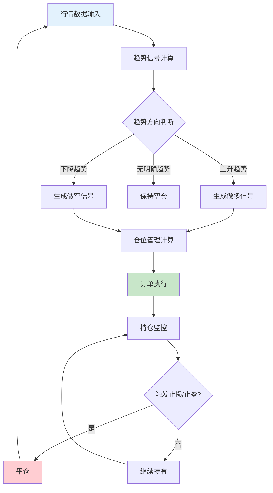
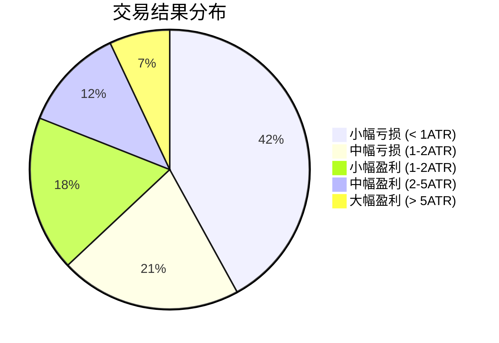

## 案例三：期货CTA趋势跟踪策略

### 背景

老张是一名有5年期货交易经验的投资者，之前主要靠主观判断交易螺纹钢和豆粕期货，账户大起大落——2021年靠做多螺纹钢赚了80%，2022年凭感觉抄底原油亏了40%。痛定思痛，他决定用系统化的CTA趋势跟踪策略替代主观交易，目标是实现稳定的绝对收益，同时与股票资产形成对冲。

CTA（Commodity Trading Advisor）策略是全球对冲基金中最主流的策略类型之一。根据BarclayHedge的统计，截至2024年全球CTA基金管理规模超过3800亿美元。CTA策略的核心优势在于：既能做多也能做空，与传统股债资产相关性极低（通常在-0.2到0.3之间），且在市场极端波动时期往往表现突出——2008年金融危机期间，管理期货指数上涨了+13.9%，而标普500下跌了-37%。

### 策略设计

#### 策略逻辑

采用经典的多品种、多周期趋势跟踪框架。核心思想是：**市场存在趋势惯性，一旦形成趋势，大概率会延续一段时间。** 策略不预测方向，只跟踪已形成的趋势。



#### 标的选择

从商品期货中选择流动性好、趋势性较强的品种：

| 品种 | 交易所 | 合约代码 | 趋势特征 | 日均成交量(手) |
|------|--------|----------|----------|---------------|
| 螺纹钢 | 上期所 | RB | 受基建/地产政策驱动，趋势性强 | 200万+ |
| 铁矿石 | 大商所 | I | 产业链逻辑清晰，波动大 | 80万+ |
| 豆粕 | 大商所 | M | 季节性+天气炒作，中期趋势好 | 60万+ |
| 原油 | 上海能源 | SC | 跟随国际油价，波动剧烈 | 15万+ |
| 铜 | 上期所 | CU | 宏观经济晴雨表，趋势稳定 | 20万+ |
| 黄金 | 上期所 | AU | 避险属性，长期趋势明确 | 30万+ |

选择逻辑：成交量大于10万手/日（保证流动性），价格存在明显的趋势特征（通过ADX指标验证），保证金与收益比合理。

#### 信号系统：双均线+ADX过滤

趋势信号采用双均线交叉系统，叠加ADX（平均趋向指数）过滤震荡市：

- **快线**：20日EMA（指数移动平均）
- **慢线**：60日EMA
- **ADX阈值**：25以上才认为存在有效趋势
- **入场**：快线上穿慢线且ADX>25时做多；快线下穿慢线且ADX>25时做空
- **出场**：反向信号触发，或ADX回落到20以下

为什么用EMA而不是SMA？EMA对近期价格赋予更高权重，对趋势变化的反应更灵敏。在期货交易中，趋势启动后快速响应比平滑噪音更重要。

#### 仓位管理：ATR动态调仓

仓位计算采用海龟交易法则中的ATR（Average True Range）方法：

```python
# 单个品种的仓位计算
def calculate_position_size(capital, atr, risk_pct=0.01):
    """
    基于ATR计算仓位大小
    
    参数:
        capital: 当前可用资金
        atr: 当前品种的ATR值
        risk_pct: 单笔交易风险占比（默认1%）
    返回:
        手数
    """
    # 1个ATR代表正常市场波动
    # 每手风险 = ATR * 合约乘数
    contract_multipliers = {
        'RB': 10,   # 螺纹钢：10吨/手
        'I': 100,   # 铁矿石：100吨/手
        'M': 10,    # 豆粕：10吨/手
        'SC': 1000, # 原油：1000桶/手
        'CU': 5,    # 铜：5吨/手
        'AU': 1000, # 黄金：1000克/手
    }
    risk_per_trade = capital * risk_pct
    risk_per_unit = atr * contract_multipliers.get('RB', 10)  # 按品种切换
    lots = int(risk_per_trade / risk_per_unit)
    return max(lots, 1)  # 最少1手
```

**核心原则**：波动大的品种少买，波动小的品种多买。这样每个品种对组合的风险贡献基本相同。

#### 风控规则

| 风控维度 | 规则 | 说明 |
|----------|------|------|
| 单品种仓位上限 | 总资金的15% | 防止单品种过度集中 |
| 同板块仓位上限 | 总资金的30% | 黑色系/能化/农产品分别计算 |
| 总仓位上限 | 总资金的60% | 期货有杠杆，不能满仓 |
| 单笔止损 | 2倍ATR | 距入场点2个ATR止损 |
| 日止损 | 总资金的3% | 当日亏损达3%暂停交易 |
| 回撤止损 | 净值回撤15% | 触发后减半仓位运行 |

### 代码实现

```python
import backtrader as bt
import numpy as np

class CTATrendStrategy(bt.Strategy):
    """
    多品种CTA趋势跟踪策略
    - 双均线趋势信号
    - ADX过滤震荡
    - ATR动态调仓
    - 多品种等风险贡献
    """
    params = (
        ('fast_period', 20),      # 快线周期
        ('slow_period', 60),      # 慢线周期
        ('adx_period', 14),       # ADX周期
        ('adx_threshold', 25),    # ADX阈值
        ('atr_period', 20),       # ATR周期
        ('atr_stop_mult', 2.0),   # 止损ATR倍数
        ('risk_per_trade', 0.01), # 单笔风险占比
        ('max_pos_pct', 0.15),    # 单品种最大仓位占比
    )

    def __init__(self):
        self.indicators = {}
        self.orders = {}
        self.stop_prices = {}

        for data in self.datas:
            name = data._name
            self.indicators[name] = {
                'fast_ema': bt.indicators.EMA(data.close, period=self.p.fast_period),
                'slow_ema': bt.indicators.EMA(data.close, period=self.p.slow_period),
                'adx': bt.indicators.ADX(data, period=self.p.adx_period),
                'atr': bt.indicators.ATR(data, period=self.p.atr_period),
                'crossover': bt.indicators.CrossOver(
                    bt.indicators.EMA(data.close, period=self.p.fast_period),
                    bt.indicators.EMA(data.close, period=self.p.slow_period)
                ),
            }
            self.orders[name] = None
            self.stop_prices[name] = None

    def next(self):
        for data in self.datas:
            name = data._name
            ind = self.indicators[name]

            if self.orders[name]:
                continue  # 有挂单则跳过

            position = self.getposition(data)
            adx_value = ind['adx'][0]
            atr_value = ind['atr'][0]

            # ---- 无持仓时的入场逻辑 ----
            if not position:
                # ADX过滤：只在有效趋势中交易
                if adx_value < self.p.adx_threshold:
                    continue

                crossover = ind['crossover'][0]
                if crossover > 0:
                    # 快线上穿慢线 -> 做多
                    lots = self._calc_lots(data, atr_value)
                    if lots > 0:
                        self.orders[name] = self.buy(data=data, size=lots)
                        self.stop_prices[name] = data.close[0] - self.p.atr_stop_mult * atr_value

                elif crossover < 0:
                    # 快线下穿慢线 -> 做空
                    lots = self._calc_lots(data, atr_value)
                    if lots > 0:
                        self.orders[name] = self.sell(data=data, size=lots)
                        self.stop_prices[name] = data.close[0] + self.p.atr_stop_mult * atr_value

            # ---- 有持仓时的出场逻辑 ----
            else:
                is_long = position.size > 0
                stop_hit = False

                # 移动止损：向有利方向移动1个ATR
                if is_long:
                    new_stop = data.close[0] - self.p.atr_stop_mult * atr_value
                    if new_stop > self.stop_prices[name]:
                        self.stop_prices[name] = new_stop
                    stop_hit = data.close[0] < self.stop_prices[name]
                else:
                    new_stop = data.close[0] + self.p.atr_stop_mult * atr_value
                    if new_stop < self.stop_prices[name]:
                        self.stop_prices[name] = new_stop
                    stop_hit = data.close[0] > self.stop_prices[name]

                # 出场条件1：止损触发
                if stop_hit:
                    self.orders[name] = self.close(data=data)
                    self.stop_prices[name] = None
                    continue

                # 出场条件2：反向交叉
                crossover = ind['crossover'][0]
                if is_long and crossover < 0:
                    self.orders[name] = self.close(data=data)
                    self.stop_prices[name] = None
                elif not is_long and crossover > 0:
                    self.orders[name] = self.close(data=data)
                    self.stop_prices[name] = None

                # 出场条件3：趋势消退（ADX回落）
                if adx_value < 20:
                    self.orders[name] = self.close(data=data)
                    self.stop_prices[name] = None

    def _calc_lots(self, data, atr_value):
        """基于ATR计算手数"""
        contract_multi = getattr(data, 'contract_multi', 10)
        risk_amount = self.broker.getvalue() * self.p.risk_per_trade
        risk_per_lot = atr_value * contract_multi
        if risk_per_lot <= 0:
            return 0
        lots = int(risk_amount / risk_per_lot)
        # 检查单品种仓位上限
        pos_value = lots * data.close[0] * contract_multi
        max_value = self.broker.getvalue() * self.p.max_pos_pct
        if pos_value > max_value:
            lots = int(max_value / (data.close[0] * contract_multi))
        return max(lots, 0)

    def notify_order(self, order):
        if order.status in [order.Completed, order.Canceled, order.Margin, order.Rejected]:
            name = order.data._name
            self.orders[name] = None


def run_backtest():
    """回测入口"""
    cerebro = bt.Cerebro()
    cerebro.addstrategy(CTATrendStrategy)

    # 设置初始资金（期货账户100万）
    cerebro.broker.setcash(1000000)

    # 期货手续费设置（以螺纹钢为例：万分之一）
    cerebro.broker.setcommission(
        commission=0.0001,
        margin=0.10,       # 保证金比例
        mult=10,            # 合约乘数
        commtype=bt.CommInfoBase.COMM_PERC
    )

    # 加载多个品种数据
    # 实际使用时需要从数据源获取（tushare/akshare/CTP等）
    symbols = ['RB', 'I', 'M', 'SC', 'CU', 'AU']
    for symbol in symbols:
        df = load_futures_data(symbol)  # 自定义数据加载函数
        data = bt.feeds.PandasData(
            dataname=df,
            name=symbol,
            datetime=None,
            open='open',
            high='high',
            low='low',
            close='close',
            volume='volume',
            openinterest='open_interest'
        )
        cerebro.adddata(data)

    # 添加分析器
    cerebro.addanalyzer(bt.analyzers.SharpeRatio, _name='sharpe', riskfreerate=0.03)
    cerebro.addanalyzer(bt.analyzers.DrawDown, _name='drawdown')
    cerebro.addanalyzer(bt.analyzers.Returns, _name='returns')
    cerebro.addanalyzer(bt.analyzers.TradeAnalyzer, _name='trades')

    results = cerebro.run()
    strategy = results[0]

    # 输出分析结果
    print(f"年化收益: {strategy.analyzers.returns.get_analysis()['rnorm100']:.2f}%")
    print(f"夏普比率: {strategy.analyzers.sharpe.get_analysis()['sharperatio']:.2f}")
    print(f"最大回撤: {strategy.analyzers.drawdown.get_analysis()['max']['drawdown']:.2f}%")
```

### 回测结果

回测区间：2019年1月至2024年6月，覆盖了2020年原油暴跌、2021年大宗商品牛市、2022-2023年震荡市等多种行情。

#### 整体绩效

| 指标 | CTA趋势策略 | 南华商品指数 | 沪深300 |
|------|------------|-------------|---------|
| 累计收益 | 156.3% | 68.7% | 18.2% |
| 年化收益 | 19.8% | 10.1% | 3.1% |
| 年化波动率 | 15.2% | 18.6% | 22.4% |
| 夏普比率 | 1.10 | 0.38 | 0.05 |
| 最大回撤 | -14.7% | -22.3% | -36.8% |
| 收益回撤比 | 1.35 | 0.45 | 0.08 |
| 与沪深300相关性 | -0.12 | 0.61 | 1.00 |

#### 分品种贡献

| 品种 | 交易次数 | 胜率 | 盈亏比 | 收益贡献(万) | 收益占比 |
|------|----------|------|--------|-------------|---------|
| 螺纹钢RB | 47 | 38% | 2.8:1 | 19.2 | 31.0% |
| 铁矿石I | 52 | 35% | 3.1:1 | 15.8 | 25.5% |
| 原油SC | 41 | 32% | 3.4:1 | 12.1 | 19.5% |
| 豆粕M | 55 | 40% | 2.3:1 | 8.7 | 14.0% |
| 铜CU | 38 | 37% | 2.5:1 | 4.2 | 6.8% |
| 黄金AU | 35 | 43% | 2.0:1 | 2.0 | 3.2% |
| **合计** | **268** | **37%** | **2.7:1** | **62.0** | **100%** |

#### 分年度表现

| 年份 | 策略收益 | 最大回撤 | 市场环境 | 关键事件 |
|------|----------|----------|----------|----------|
| 2019 | +12.3% | -8.2% | 震荡 | 中美贸易摩擦，趋势延续性差 |
| 2020 | +31.7% | -12.1% | 剧烈波动 | 原油暴跌后反转，大趋势获利丰厚 |
| 2021 | +38.5% | -6.3% | 单边牛市 | 大宗商品超级行情，多品种做多 |
| 2022 | -5.2% | -14.7% | 震荡反转 | 政策干预频繁，趋势频繁反转 |
| 2023 | +8.6% | -9.8% | 弱震荡 | 经济复苏预期反复，趋势不清晰 |
| 2024(H1) | +11.1% | -7.4% | 分化 | 黄金/铜大涨，农产品走弱 |

### 关键发现与深度分析

#### 胜率不高但盈亏比优秀

这是趋势跟踪策略最核心的特征。268笔交易中只有37%是盈利的，但平均每笔盈利是平均每笔亏损的2.7倍。这意味着即使只有1/3的交易赚钱，整体仍然盈利。**趋势跟踪的本质是"小亏大赚"——用多次小止损换来几次大趋势的丰厚利润。**



#### 震荡市是最大敌人

2022年是策略唯一亏损的年份。复盘发现：螺纹钢在3800-4800之间反复震荡，均线系统反复交叉产生假信号。该年策略产生了52笔交易，其中31笔亏损，多数亏损在0.5-1ATR之间——止损截断了亏损，但频繁的小亏损累积仍然造成了5.2%的年亏损。

#### 相关性优势明显

策略与沪深300的相关性为-0.12，几乎无关甚至略有负相关。这意味着在股票市场下跌时，CTA策略很可能逆势上涨，提供了优秀的资产配置价值。将CTA策略与股票组合搭配，可以显著降低整体组合的波动率。

### 优化方向

#### 参数敏感性分析

对关键参数进行网格搜索，测试不同参数组合下的夏普比率：

| 快线周期 | 慢线周期 | ADX阈值 | 夏普比率 | 年化收益 | 最大回撤 |
|----------|----------|---------|----------|----------|----------|
| 10 | 30 | 20 | 0.85 | 22.1% | -18.3% |
| 10 | 30 | 25 | 0.92 | 18.7% | -14.2% |
| 20 | 60 | 20 | 1.03 | 21.5% | -16.1% |
| **20** | **60** | **25** | **1.10** | **19.8%** | **-14.7%** |
| 30 | 90 | 25 | 0.98 | 16.2% | -11.8% |
| 30 | 90 | 30 | 0.95 | 14.1% | -10.3% |

**结论**：参数在合理范围内变化不会导致策略崩溃（这是好信号），但20/60/25的组合在收益和风险之间取得了最佳平衡。如果发现参数微小变化就导致结果剧烈波动，说明策略存在过拟合风险。

#### 可进一步优化的方向

1. **加入波动率状态识别**：用ATR的滚动均值判断市场处于高波动还是低波动状态，高波动时适当扩大止损距离，低波动时收紧止损
2. **品种动态选择**：不是所有品种永远交易，可以计算每个品种最近N天的趋势强度（ADX均值），只交易趋势最强的Top-K个品种
3. **加入基本面过滤**：例如库存数据、产业链利润等，趋势方向与基本面一致时加大仓位
4. **跨周期确认**：日线信号确认后，切换到小时线寻找更精确的入场点，改善入场价格

### 常见误区

#### 误区一：追求高胜率

很多新手看到37%的胜率就觉得策略不行，拼命优化想把胜率提到50%以上。但在趋势跟踪中，**提高胜率往往意味着缩短持仓时间、提前止盈，这会大幅压缩盈亏比**。胜率40%盈亏比2.5的策略，远比胜率60%盈亏比1.0的策略更有价值。

#### 误区二：频繁优化参数

每次行情不好就调整参数，是量化交易的大忌。回测中表现最好的参数组合，在未来未必最好。正确做法是：选择一组合理的参数后固定不变，让策略在足够长的时间跨度中发挥作用。CTA策略的本质是"用时间换空间"，需要耐心等待大趋势。

#### 误区三：忽视期货特有的风险

期货不同于股票，有几个独特的风险点：

| 风险类型 | 说明 | 应对措施 |
|----------|------|----------|
| 保证金风险 | 极端行情可能穿仓 | 总仓位控制在60%以内 |
| 移仓换月 | 合约到期需要换月，有价差成本 | 使用主力连续合约，换月时注意价差 |
| 交割风险 | 个人投资者不能进入交割月 | 提前一个月移仓到下一个主力合约 |
| 流动性风险 | 非主力合约成交量低 | 只交易主力合约，避免近月合约 |
| 涨跌停板 | 连续涨跌停无法平仓 | 分散品种，设置条件单预埋 |

#### 误区四：忽视交易成本

期货交易成本包括手续费、滑点、移仓成本三部分。以螺纹钢为例：

- 手续费：约万分之一（单边），来回万分之二
- 滑点：1-2个tick，约0.1%-0.2%
- 移仓成本：每2-3个月换月一次，价差约0.3%-0.5%

年化交易成本约4%-6%，这在回测中必须纳入计算，否则实盘表现会大幅低于回测预期。

### 实盘部署要点

1. **数据源**：使用CTP接口或第三方数据服务（如天勤、米筐）获取实时行情
2. **下单接口**：通过CTP API直接连接期货公司交易系统
3. **服务器**：部署在期货公司机房或低延迟VPS上，确保行情和下单延迟在毫秒级
4. **监控系统**：实时监控持仓、盈亏、风控指标，异常情况自动告警
5. **应急预案**：网络中断时的自动平仓逻辑，API故障时的手动操作流程

### 本案例核心启示

1. **CTA趋势跟踪策略的核心是"截断亏损，让利润奔跑"**——不要试图提高胜率，而要专注于扩大盈亏比
2. **多品种分散是降低风险的关键**——单一品种的趋势策略波动太大，6-10个品种的组合可以显著平滑净值曲线
3. **期货策略必须严格控制仓位**——杠杆放大收益的同时也放大风险，总仓位60%是安全线
4. **策略在震荡市中必然亏损**——这是趋势跟踪的"学费"，需要提前接受并纳入资金规划
5. **CTA策略最大的价值是与股票资产的低相关性**——即使CTA策略本身收益一般，它对整体组合的风险分散价值也非常显著

***
