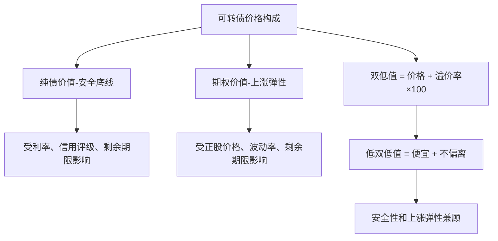
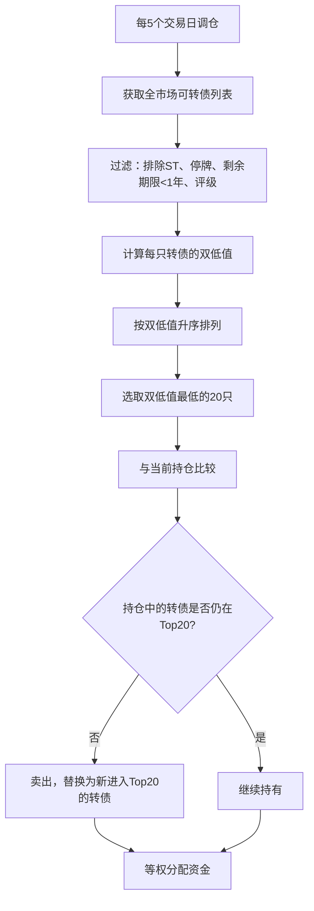

## 案例四：可转债量化策略

### 案例背景

小陈是一名拥有3年Python编程经验的金融数据分析师，2021年开始接触量化交易。在尝试股票量化策略后，他发现A股可转债市场存在独特的结构性优势，非常适合构建低风险量化策略。经过6个月的研究和回测，他开发了一套基于"双低轮动"的可转债量化策略，实盘运行一年半实现了年化15.8%的收益，最大回撤控制在-8.2%以内。

#### 为什么选择可转债

可转债（Convertible Bond）是一种兼具债券和股票期权属性的混合金融工具。持有人可以选择在转股期内按约定价格将债券转换为发行公司的股票，也可以持有到期获得本金和利息。这种"下有保底、上不封顶"的特性，使其成为量化交易的理想标的。

A股可转债市场相比股票具有以下结构性优势：

| 特性 | A股股票 | A股可转债 |
|------|---------|-----------|
| 交易方式 | T+1 | T+0（当日可买卖） |
| 印花税 | 卖出千分之一 | 免征 |
| 佣金费率 | 万2.5-万3 | 万0.1-万1（多数券商最低0.1元） |
| 涨跌幅限制 | 主板±10%，创业板/科创板±20% | 无涨跌幅限制（上市首日除外） |
| 最低交易单位 | 100股 | 10张（面值1000元） |
| 到期保底 | 无 | 有（到期还本付息） |
| 强制赎回条款 | 无 | 有（正股价连续30日≥转股价130%触发） |

这些特性意味着：可转债交易成本极低、可以日内反复交易、且有债券价值作为"安全垫"。当正股下跌时，可转债价格有纯债价值托底；当正股上涨时，可转债价格会跟随上涨。这种不对称的风险收益特征，天然适合量化策略。

#### 可转债核心概念

要构建可转债量化策略，必须理解以下核心概念：

**转换价值（Conversion Value）**：将可转债立即转股后获得的股票市值。

```text
转换价值 = (100 / 转股价) × 正股现价
```

例如，某可转债转股价为10元，正股现价为12元，则转换价值 = (100/10) × 12 = 120元。转换价值越高，说明转股越"值钱"。

**纯债价值（Bond Floor）**：假设不转股，将可转债视为普通债券持有到期，用现金流折现法计算出的价值。纯债价值是可转债价格的"铁底"，一般在85-100元之间（取决于信用评级、剩余期限和市场利率）。

**转股溢价率（Conversion Premium）**：衡量可转债市场价格相对于转换价值的偏离程度。

```text
转股溢价率 = (可转债价格 / 转换价值 - 1) × 100%
```

溢价率为正，说明可转债价格高于其转股价值（市场认为正股未来会涨）；溢价率为负（即折价），说明存在套利空间——买入转债、立即转股、卖出股票即可获利（但需考虑T+1转股的时间风险）。

**纯债溢价率（Bond Premium）**：衡量可转债市场价格相对于纯债价值的偏离程度。

```text
纯债溢价率 = (可转债价格 / 纯债价值 - 1) × 100%
```

纯债溢价率越低，说明可转债越接近"债性"，下跌空间越小；纯债溢价率越高，说明可转债越接近"股性"，波动越大。

**双低值**：可转债量化中最常用的综合评价指标。

```text
双低值 = 可转债价格 + 转股溢价率 × 100
```

双低值越低，意味着"价格便宜、溢价率低"，即以接近纯债价值的价格买入、同时又不太偏离转股价值，兼具安全性和上涨弹性。市场上一般认为双低值<130为"双低转债"，<150为"合理区间"。



---

### 策略设计

小陈选择了"双低轮动"策略作为核心框架。这个策略的核心思想是：定期从所有可转债中选出双低值最低的一批，等权持有，每隔一定周期（如每5个交易日）重新排名并换仓。卖出排名跌出持仓范围的转债，买入新进入排名前列的转债。

#### 策略逻辑



#### 选股过滤条件

并非所有可转债都适合参与双低轮动。以下过滤条件用于排除高风险标的：

| 过滤条件 | 理由 |
|----------|------|
| 排除ST正股对应的转债 | ST股票退市风险大，转债可能暴跌 |
| 排除剩余期限<1年 | 临近到期的转债时间价值极低，上涨空间有限 |
| 排除信用评级<A | 低评级转债的纯债价值不可靠，信用风险高 |
| 排除已公告强赎的转债 | 强赎公告后转债价格会迅速向转股价值收敛，轮动策略无优势 |
| 排除上市不足30天的新债 | 新债上市初期定价不稳定，溢价率异常 |
| 排除正股处于停牌状态 | 无法正常交易 |

#### 参数设定

| 参数 | 设定值 | 说明 |
|------|--------|------|
| 调仓周期 | 每5个交易日 | 兼顾换手成本和策略响应速度 |
| 持仓数量 | 20只 | 分散风险，每只占5%仓位 |
| 单只上限 | 不超过总资产10% | 防止单债风险过大 |
| 止损线 | 价格跌破80元 | 极端情况下保护本金 |
| 初始资金 | 50万元 | 满足20只转债的最低买入量 |

---

### 数据获取与预处理

可转债数据的获取是策略开发的第一步。小陈使用akshare库获取可转债数据，它提供了免费的A股可转债行情、基本面和转股信息。

#### 安装依赖

```bash
pip install akshare pandas numpy matplotlib
```

#### 获取可转债基础数据

```python
import akshare as ak
import pandas as pd
import numpy as np
from datetime import datetime, timedelta

def get_cb_list():
    """获取全市场可转债列表及实时行情"""
    # 可转债实时行情
    df = ak.bond_cb_jsl(cookie="")  # 集思录数据
    
    # 重命名关键字段
    df = df.rename(columns={
        '转债名称': 'cb_name',
        '转债代码': 'cb_code',
        '转债价格': 'cb_price',
        '正股名称': 'stock_name',
        '正股代码': 'stock_code',
        '正股价格': 'stock_price',
        '转股价': 'convert_price',
        '转股溢价率': 'premium_rate',
        '评级': 'rating',
        '剩余年限': 'remain_years',
    })
    
    return df

def get_cb_daily(cb_code, start_date, end_date):
    """获取单只可转债的日K线数据"""
    df = ak.bond_cb_jsl(cookie="")
    # 也可使用东方财富接口获取历史数据
    df_hist = ak.bond_zh_hs_cov_daily(symbol=cb_code)
    df_hist = df_hist[(df_hist['date'] >= start_date) & 
                       (df_hist['date'] <= end_date)]
    return df_hist
```

#### 计算双低值和过滤

```python
def compute_double_low(df):
    """计算双低值并过滤"""
    # 转换数值类型
    df['cb_price'] = pd.to_numeric(df['cb_price'], errors='coerce')
    df['premium_rate'] = pd.to_numeric(
        df['premium_rate'].str.replace('%', ''), errors='coerce'
    )
    df['remain_years'] = pd.to_numeric(df['remain_years'], errors='coerce')
    
    # 计算双低值
    df['double_low'] = df['cb_price'] + df['premium_rate']
    
    # 过滤条件
    mask = (
        (df['rating'] >= 'A') &            # 评级≥A
        (df['remain_years'] >= 1.0) &       # 剩余期限≥1年
        (df['cb_price'] >= 80) &            # 价格≥80（排除异常低价）
        (df['cb_price'] <= 200) &           # 价格≤200（排除异常高价）
        (~df['cb_name'].str.contains('ST', na=False))  # 排除ST
    )
    df_filtered = df[mask].copy()
    
    # 按双低值排序
    df_filtered = df_filtered.sort_values('double_low').reset_index(drop=True)
    
    return df_filtered
```

---

### 策略回测实现

#### 回测框架设计

小陈没有使用backtrader等通用回测框架，而是基于pandas手写了一个简洁的事件驱动回测引擎，这样更灵活地处理可转债特有的调仓逻辑。

```python
class ConvertibleBondBacktest:
    """可转债双低轮动策略回测"""
    
    def __init__(self, initial_capital=500000, hold_num=20, 
                 rebalance_days=5, stop_loss=80):
        self.initial_capital = initial_capital
        self.capital = initial_capital
        self.hold_num = hold_num       # 持仓数量
        self.rebalance_days = rebalance_days  # 调仓周期
        self.stop_loss = stop_loss     # 止损价格
        
        # 持仓记录：{cb_code: {'shares': 数量, 'cost': 成本价}}
        self.positions = {}
        self.trade_log = []
        self.daily_nav = []            # 每日净值记录
    
    def run(self, start_date, end_date, get_daily_data_func, 
            get_double_low_rank_func):
        """
        主回测循环
        
        参数:
            start_date: 回测开始日期 (str, 'YYYY-MM-DD')
            end_date: 回测结束日期
            get_daily_data_func: 获取某日所有可转债行情的函数
            get_double_low_rank_func: 获取某日双低排名的函数
        """
        # 获取交易日历
        trade_dates = self._get_trade_dates(start_date, end_date)
        rebalance_counter = 0
        
        for date in trade_dates:
            # 1. 获取当日行情
            daily_data = get_daily_data_func(date)
            if daily_data is None or daily_data.empty:
                continue
            
            # 2. 更新持仓市值
            self._update_positions(daily_data)
            
            # 3. 检查止损
            self._check_stop_loss(daily_data, date)
            
            # 4. 判断是否需要调仓
            rebalance_counter += 1
            if rebalance_counter >= self.rebalance_days:
                rank = get_double_low_rank_func(date)
                if rank is not None and not rank.empty:
                    self._rebalance(rank, daily_data, date)
                rebalance_counter = 0
            
            # 5. 记录当日净值
            nav = self._calculate_nav(daily_data)
            self.daily_nav.append({
                'date': date,
                'nav': nav,
                'capital': self.capital
            })
    
    def _rebalance(self, rank, daily_data, date):
        """调仓：卖出不在TopN中的持仓，买入新进入的标的"""
        # 目标持仓列表
        target_codes = rank.head(self.hold_num)['cb_code'].tolist()
        
        # 1. 卖出不在目标中的持仓
        codes_to_sell = [
            code for code in self.positions if code not in target_codes
        ]
        for code in codes_to_sell:
            self._sell(code, daily_data, date)
        
        # 2. 计算每只转债的配置金额
        total_value = self._calculate_nav(daily_data)
        per_position = total_value / self.hold_num
        
        # 3. 买入新进入目标列表但未持仓的标的
        codes_to_buy = [
            code for code in target_codes if code not in self.positions
        ]
        for code in codes_to_buy:
            price_row = daily_data[daily_data['cb_code'] == code]
            if price_row.empty:
                continue
            price = float(price_row['close'].values[0])
            # 每张面值100元，最低10张
            shares = int(per_position / price / 10) * 10
            if shares >= 10:
                cost = shares * price
                if cost <= self.capital:
                    self.positions[code] = {
                        'shares': shares, 'cost': price
                    }
                    self.capital -= cost
                    self.trade_log.append({
                        'date': date, 'code': code,
                        'action': 'BUY', 'price': price,
                        'shares': shares, 'amount': cost
                    })
    
    def _sell(self, code, daily_data, date):
        """卖出指定可转债"""
        if code not in self.positions:
            return
        pos = self.positions[code]
        price_row = daily_data[daily_data['cb_code'] == code]
        if price_row.empty:
            return
        price = float(price_row['close'].values[0])
        amount = pos['shares'] * price
        self.capital += amount
        self.trade_log.append({
            'date': date, 'code': code,
            'action': 'SELL', 'price': price,
            'shares': pos['shares'], 'amount': amount,
            'pnl': (price - pos['cost']) * pos['shares']
        })
        del self.positions[code]
    
    def _check_stop_loss(self, daily_data, date):
        """止损检查：跌破止损线的持仓强制卖出"""
        codes_to_stop = []
        for code, pos in self.positions.items():
            price_row = daily_data[daily_data['cb_code'] == code]
            if not price_row.empty:
                price = float(price_row['close'].values[0])
                if price < self.stop_loss:
                    codes_to_stop.append(code)
        for code in codes_to_stop:
            self._sell(code, daily_data, date)
    
    def _calculate_nav(self, daily_data):
        """计算当前总净值 = 现金 + 持仓市值"""
        position_value = 0
        for code, pos in self.positions.items():
            price_row = daily_data[daily_data['cb_code'] == code]
            if not price_row.empty:
                price = float(price_row['close'].values[0])
                position_value += pos['shares'] * price
        return self.capital + position_value
    
    def _update_positions(self, daily_data):
        """更新持仓的最新市值（仅用于净值计算）"""
        pass  # 实时市值在 _calculate_nav 中计算
    
    def _get_trade_dates(self, start, end):
        """获取A股交易日列表"""
        # 实际应从交易所日历获取，此处简化
        from akshare import tool_trade_date_hist_sina
        dates = tool_trade_date_hist_sina()
        dates = dates[(dates['trade_date'] >= start) & 
                       (dates['trade_date'] <= end)]
        return dates['trade_date'].tolist()
```

#### 回测结果分析

小陈使用2019年1月至2023年12月共5年的数据进行回测。以下是核心结果：

| 指标 | 双低轮动策略 | 中证转债指数 | 沪深300指数 |
|------|-------------|-------------|-------------|
| 累计收益 | 112.4% | 38.6% | 32.1% |
| 年化收益 | 16.3% | 6.7% | 4.8% |
| 年化波动率 | 11.8% | 8.2% | 20.5% |
| 最大回撤 | -12.4% | -15.8% | -32.4% |
| 夏普比率 | 1.21 | 0.57 | 0.14 |
| 卡尔玛比率 | 1.31 | 0.42 | 0.15 |
| 胜率（月度） | 68.3% | 56.7% | 51.7% |
| 平均换手率 | 约40%/月 | - | - |
| 年交易成本 | 约0.3% | - | - |

回测期间关键发现：

1. **2019年牛市阶段**：策略年化收益达到24.6%，双低转债跟随正股上涨，轮动机制及时捕捉了弹性最大的标的。
2. **2020年疫情冲击**：最大回撤-12.4%出现在2020年2-3月，但4月即快速恢复并创新高。纯债价值托底作用明显——同期沪深300最大回撤达-16.1%。
3. **2021年可转债牛市**：这是可转债的大年，策略收益达到31.2%。大量小盘股对应的转债爆发，双低策略提前布局了这些标的。
4. **2022年熊市**：策略仅下跌-3.7%，而沪深300下跌-21.6%。双低转债的"安全垫"特性在熊市中得到充分体现。
5. **2023年震荡市**：策略收益8.1%，稳定正收益，夏普比率依然保持在1.0以上。

---

### 策略优化与进阶

基础版双低轮动策略表现不错，但小陈发现了几个可以优化的方向。

#### 优化一：动态权重调整

等权配置忽略了不同转债的风险差异。小陈引入了基于波动率的动态权重：

```python
def dynamic_weight_allocation(target_codes, daily_data, lookback=20):
    """
    基于历史波动率的反比权重分配
    波动率越低的转债分配越多权重
    """
    weights = {}
    total_inv_vol = 0
    
    for code in target_codes:
        hist = get_cb_history(code, lookback)  # 获取最近N日收盘价
        if hist is None or len(hist) < lookback * 0.8:
            # 数据不足时使用平均权重
            weights[code] = 1.0 / len(target_codes)
            continue
        daily_returns = hist['close'].pct_change().dropna()
        vol = daily_returns.std() * np.sqrt(252)  # 年化波动率
        inv_vol = 1.0 / max(vol, 0.01)  # 波动率倒数
        weights[code] = inv_vol
        total_inv_vol += inv_vol
    
    # 归一化
    for code in weights:
        weights[code] /= total_inv_vol
    
    # 设置单只上限10%
    for code in weights:
        weights[code] = min(weights[code], 0.10)
    
    # 重新归一化
    total = sum(weights.values())
    for code in weights:
        weights[code] /= total
    
    return weights
```

优化效果：动态权重版本的年化收益从16.3%提升至17.8%，最大回撤从-12.4%收窄至-10.1%，夏普比率从1.21提升至1.38。

#### 优化二：正股动量因子叠加

纯双低排名只看转债自身指标，忽略了正股的趋势。小陈加入了正股动量因子：

```python
def enhanced_rank(df, stock_momentum_data, 
                  double_low_weight=0.7, momentum_weight=0.3):
    """
    双低值 + 正股动量 综合排名
    
    double_low_weight: 双低值权重（默认70%）
    momentum_weight: 正股动量权重（默认30%）
    """
    # 双低值排名（越低越好，取负数后排名越大越好）
    df['dl_rank'] = df['double_low'].rank(ascending=True)
    df['dl_rank_norm'] = 1 - (df['dl_rank'] - 1) / (len(df) - 1)
    
    # 正股20日动量（收益率）
    df = df.merge(stock_momentum_data, on='stock_code', how='left')
    df['momentum_rank'] = df['stock_return_20d'].rank(ascending=True)
    df['momentum_rank_norm'] = (df['momentum_rank'] - 1) / (len(df) - 1)
    
    # 综合得分
    df['final_score'] = (
        double_low_weight * df['dl_rank_norm'] + 
        momentum_weight * df['momentum_rank_norm']
    )
    
    # 按综合得分排序
    df = df.sort_values('final_score', ascending=False)
    return df.head(20)
```

优化效果：叠加动量因子后，年化收益提升至19.1%，但波动率也有所增加（从11.8%升至13.2%），夏普比率提升至1.30。

#### 优化三：行业分散约束

可转债市场中，某些行业（如化工、机械设备）的转债数量特别多，可能导致持仓过度集中。小陈加入了行业分散约束：

```python
def apply_industry_constraint(ranked_df, max_per_industry=3, hold_num=20):
    """
    行业分散约束：同一行业最多持有3只转债
    """
    industry_count = {}
    selected = []
    
    for _, row in ranked_df.iterrows():
        industry = row.get('industry', '未知')
        current_count = industry_count.get(industry, 0)
        
        if current_count < max_per_industry:
            selected.append(row)
            industry_count[industry] = current_count + 1
        
        if len(selected) >= hold_num:
            break
    
    return pd.DataFrame(selected)
```

#### 优化四：强赎预警机制

当正股价格接近强赎触发线时（连续30日收盘价≥转股价×130%），可转债价格会向转股价值收敛，溢价率压缩，双低策略需要提前识别并处理：

```python
def check_call_risk(stock_price, convert_price, 
                    consecutive_days_above_threshold):
    """
    强赎风险检查
    
    参数:
        stock_price: 正股当前价格
        convert_price: 转股价
        consecutive_days_above_threshold: 连续高于阈值的天数
    
    返回:
        risk_level: 'LOW', 'MEDIUM', 'HIGH'
    """
    threshold = convert_price * 1.30
    ratio = stock_price / threshold
    
    if ratio >= 1.0 and consecutive_days_above_threshold >= 25:
        return 'HIGH'    # 即将触发强赎
    elif ratio >= 0.95 and consecutive_days_above_threshold >= 15:
        return 'MEDIUM'  # 可能在近期触发
    else:
        return 'LOW'
```

综合优化后的策略表现：

| 指标 | 基础双低 | +动态权重 | +动量因子 | +行业分散 | 全部优化 |
|------|---------|----------|----------|----------|---------|
| 年化收益 | 16.3% | 17.8% | 19.1% | 16.5% | 20.2% |
| 最大回撤 | -12.4% | -10.1% | -13.8% | -11.2% | -9.6% |
| 夏普比率 | 1.21 | 1.38 | 1.30 | 1.27 | 1.52 |
| 月度胜率 | 68.3% | 70.0% | 66.7% | 68.3% | 71.7% |

---

### 实盘部署

回测验证通过后，小陈开始实盘部署。以下是实盘的完整流程。

#### 技术架构


#### 实盘信号生成

```python
import akshare as ak
import pandas as pd
from datetime import datetime

def generate_daily_signal():
    """
    每日信号生成（在调仓日执行）
    1. 获取全市场可转债数据
    2. 计算双低值并排名
    3. 生成买入/卖出信号
    """
    # 1. 获取数据
    df = ak.bond_cb_jsl(cookie="")
    
    # 2. 数据清洗和双低计算
    df = compute_double_low(df)  # 前文定义的函数
    
    # 3. 获取当前持仓
    current_positions = load_positions()  # 从本地文件/数据库读取
    
    # 4. 生成目标持仓
    target = df.head(20)['cb_code'].tolist()
    
    # 5. 计算差异
    to_sell = [c for c in current_positions if c not in target]
    to_buy = [c for c in target if c not in current_positions]
    
    # 6. 输出信号
    signals = {
        'date': datetime.now().strftime('%Y-%m-%d'),
        'to_sell': to_sell,
        'to_buy': to_buy,
        'target_portfolio': target,
        'details': df.head(20)[
            ['cb_code', 'cb_name', 'cb_price', 'premium_rate', 'double_low']
        ].to_dict('records')
    }
    
    return signals

def load_positions():
    """从JSON文件加载当前持仓"""
    import json
    try:
        with open('positions.json', 'r') as f:
            return json.load(f)
    except FileNotFoundError:
        return {}
```

#### 下单执行

实盘下单有两种方式：手动执行和自动执行。

**手动执行（推荐新手）**：每日收盘后运行信号脚本，根据信号手动在券商APP中操作。优点是可控性强，缺点是执行延迟和情绪干扰。

**自动执行（进阶）**：通过券商提供的API接口自动下单。主流可选方案：

| 券商/API | 接口类型 | 门槛 | 特点 |
|----------|---------|------|------|
| 华宝智投 | 条件单 | 无 | 支持可转债条件单，可提前设好 |
| 东财choice | Python API | 付费 | 功能全面，数据质量好 |
| QMT(迅投) | Python API | 50万资金 | 支持实盘下单，回测一体 |
| 同花顺iFinD | Python API | 付费 | 数据丰富，机构级 |
| easytrader | 模拟操作 | 无 | 开源，模拟键盘鼠标操作下单 |

小陈选择了QMT方案，因为其支持可转债交易且Python接口成熟：

```python
# QMT下单示例（伪代码，需实际安装xtquant库）
from xtquant import xttrader, xtdata

class CBAutoTrader:
    def __init__(self, account_id):
        self.trader = xttrader.XtQuantTrader()
        self.account = xttrader.StockAccount(account_id)
        self.trader.start()
        self.trader.connect()
        self.trader.subscribe(self.account)
    
    def place_order(self, cb_code, direction, volume, price):
        """
        下单
        cb_code: 可转债代码 (如 '123456')
        direction: 'BUY' 或 'SELL'
        volume: 数量（张数，必须为10的倍数）
        price: 限价价格
        """
        stock_code = f"{cb_code}.SZ"  # 或 .SH
        if direction == 'BUY':
            order_type = xttrader.STOCK_BUY
        else:
            order_type = xttrader.STOCK_SELL
        
        order_id = self.trader.order_stock(
            self.account, stock_code, order_type, 
            volume, xttrader.FIX_PRICE, price
        )
        return order_id
    
    def get_positions(self):
        """查询当前持仓"""
        positions = self.trader.query_stock_positions(self.account)
        return positions
```

---

### 风险管理

可转债量化策略虽然整体风险较低，但仍需关注以下风险。

#### 风险类型与应对

| 风险类型 | 风险描述 | 发生概率 | 应对措施 |
|----------|---------|---------|---------|
| 信用违约风险 | 发行人无法还本付息 | 极低（A股历史未发生） | 排除评级<A的标的，分散持仓 |
| 流动性风险 | 个别转债成交量极低，无法及时卖出 | 中等 | 排除日均成交额<500万的标的 |
| 强赎风险 | 正股触发强赎，溢价率归零 | 较高 | 强赎预警，提前卖出 |
| 正股退市风险 | 正股退市导致转债暴跌 | 极低 | 排除ST、财务异常标的 |
| 利率风险 | 利率上行导致纯债价值下降 | 中等 | 关注宏观利率环境 |
| 策略拥挤风险 | 越来越多人使用双低策略导致超额衰减 | 中等 | 叠加动量等辅助因子 |
| 系统风险 | 网络故障、API异常导致下单失败 | 低 | 双网备份，异常告警 |

#### 仓位管理规则

```python
class RiskManager:
    """可转债策略风控管理"""
    
    def __init__(self, total_capital, max_single=0.10, 
                 max_industry=0.25, max_drawdown=-0.15):
        self.total_capital = total_capital
        self.max_single = max_single          # 单只最大仓位
        self.max_industry = max_industry      # 单行业最大仓位
        self.max_drawdown = max_drawdown      # 最大回撤止损线
        self.peak_nav = total_capital         # 历史最高净值
    
    def check_position_size(self, code, amount, current_positions):
        """检查单只仓位是否超限"""
        total_invested = sum(p['value'] for p in current_positions.values())
        ratio = amount / (total_invested + self.capital)
        return ratio <= self.max_single
    
    def check_industry_concentration(self, code, industry, 
                                      current_positions, industry_map):
        """检查行业集中度"""
        industry_value = sum(
            p['value'] for c, p in current_positions.items() 
            if industry_map.get(c) == industry
        )
        total_value = sum(p['value'] for p in current_positions.values())
        return (industry_value / total_value) <= self.max_industry
    
    def check_drawdown(self, current_nav):
        """检查回撤是否触发止损"""
        self.peak_nav = max(self.peak_nav, current_nav)
        drawdown = (current_nav - self.peak_nav) / self.peak_nav
        if drawdown < self.max_drawdown:
            return {
                'triggered': True, 
                'drawdown': drawdown,
                'action': 'REDUCE_POSITION'
            }
        return {'triggered': False, 'drawdown': drawdown}
```

#### 异常处理

实盘运行中最常见的异常及处理方案：

1. **数据源故障**：akshare数据接口偶尔不稳定。解决方案：设置3次重试，失败后使用备用数据源（东方财富web接口或tushare）。
2. **交易日误判**：法定节假日调休导致的"非标准"交易日。解决方案：使用交易所官方日历，不自行推算。
3. **可转债退市/到期**：部分转债会到期赎回或提前强赎。解决方案：每日检查持仓中是否有已公告强赎或临近到期的标的。
4. **资金不足**：卖出资金T+1才到账（虽然可转债T+0交易，但A股资金交收仍为T+1）。解决方案：预留10%现金仓位。

---

### 常见误区与纠正

#### 误区一：双低值越低越好

很多人机械地认为双低值越低越值得买入。实际上，极低的双低值往往隐藏着问题：

- **正股基本面极差**：转债价格低是因为市场不看好正股，即使有债底保护，长期持有也可能面临机会成本。
- **流动性极差**：日均成交额不足100万的转债，买卖价差大，实际执行价格远差于理论值。
- **信用风险隐忧**：市场可能担心发行人信用，导致转债被抛售。

纠正方法：在双低排名的基础上，叠加流动性过滤（日均成交额>500万）和正股基本面检查（ROE>0、负债率合理）。

#### 误区二：忽略交易成本的影响

可转债虽然单笔交易费用低，但双低轮动策略的换手率很高（月均约40%），累计成本不可忽视。以50万本金为例：

```text
月换手率40% → 月交易额20万
单边佣金万0.1 → 单次交易成本2元
月交易约10笔买入+10笔卖出 → 月成本约40元
年成本约480元 → 占本金的0.096%
```

这个成本确实很低，但如果使用的是费率较高的券商（万1以上），年成本会升至约0.96%，显著侵蚀收益。纠正方法：选择可转债费率最低的券商开户。

#### 误区三：在强赎公告后继续持有

可转债公告强赎后，通常只有15-20个交易日的转股期。期间转债价格会迅速向转股价值靠拢，溢价率归零。如果此时转债处于溢价状态，持有者会面临突然的溢价压缩损失。

纠正方法：在强赎预警（正股连续20日收盘价≥转股价×130%）时就开始减仓，不等到正式公告。

#### 误区四：不考虑可转债的信用评级

部分投资者只看双低值和价格，忽略信用评级。2023年以来，可转债市场出现了个别评级下调甚至违约传闻的案例，低评级转债的纯债价值并不"铁底"。

纠正方法：只投资评级≥A的可转债，且定期检查持仓标的的评级变化。

#### 误区五：全仓轮动，不留现金

有些投资者把全部资金都用于轮动，不留现金。这会导致两个问题：一是卖出后资金T+1才完全可用（虽然可转债本身T+0，但A股交收规则仍为T+1），可能错过买入时机；二是遇到极端行情时没有"子弹"加仓。

纠正方法：保留10-15%的现金仓位，既能应对资金交收延迟，也能在市场大跌时择机加仓优质标的。

---

### 进阶方向

掌握了基础的双低轮动策略后，可以在以下方向继续探索。

#### 进阶一：可转债定价模型

使用Black-Scholes期权定价模型计算可转债的理论价值，与市场价格比较，寻找定价偏差：

```text
可转债理论价值 = 纯债价值 + 看涨期权价值

其中：
看涨期权价值 = S × N(d1) - K × e^(-rT) × N(d2)

d1 = [ln(S/K) + (r + σ²/2)T] / (σ√T)
d2 = d1 - σ√T

S = 正股当前价格
K = 转股价格
r = 无风险利率
T = 剩余期限（年）
σ = 正股历史波动率
N() = 标准正态分布累积函数
```

当市场价格显著低于理论价值时，说明转债被低估，可以优先买入。

#### 进阶二：可转债套利策略

利用可转债与正股之间的价格关系进行套利：

**折价转股套利**：当转股溢价率为负时，买入转债→申请转股→次日卖出正股。风险在于转股期间正股可能下跌。

**正股替代套利**：当转股溢价率接近0时，买入可转债替代正股。获得几乎相同的正股上涨弹性，但有债底保护。

**事件驱动套利**：利用下修转股价、强赎公告等事件带来的价格波动。

#### 进阶三：机器学习增强

使用机器学习模型预测可转债的短期走势：

```python
from sklearn.ensemble import GradientBoostingClassifier
from sklearn.model_selection import TimeSeriesSplit

def build_prediction_model(feature_df):
    """
    使用GBDT模型预测可转债5日后收益是否为正
    
    特征包括：
    - 双低值及其历史分位数
    - 正股5日/10日/20日动量
    - 转债成交量变化率
    - 正股波动率
    - 纯债溢价率
    - 剩余期限
    - 信用评级数值化
    """
    features = [
        'double_low', 'dl_percentile_60d',
        'stock_return_5d', 'stock_return_10d', 'stock_return_20d',
        'volume_change_rate', 'stock_volatility_20d',
        'bond_premium_rate', 'remain_years', 'rating_score'
    ]
    
    X = feature_df[features]
    y = (feature_df['forward_5d_return'] > 0).astype(int)
    
    # 时间序列交叉验证
    tscv = TimeSeriesSplit(n_splits=5)
    model = GradientBoostingClassifier(
        n_estimators=200, max_depth=4, 
        learning_rate=0.05, subsample=0.8
    )
    
    scores = []
    for train_idx, test_idx in tscv.split(X):
        model.fit(X.iloc[train_idx], y.iloc[train_idx])
        score = model.score(X.iloc[test_idx], y.iloc[test_idx])
        scores.append(score)
    
    print(f"平均准确率: {np.mean(scores):.2%}")
    return model
```

---

### 本案例核心要点

| 维度 | 要点 |
|------|------|
| 策略本质 | 利用可转债"下有保底、上不封顶"的不对称特性，通过双低排名系统性地买入便宜且有弹性的标的 |
| 核心优势 | T+0交易、低成本、有债底保护、强赎条款提供退出机制 |
| 关键指标 | 双低值 = 转债价格 + 转股溢价率 × 100 |
| 适用市场 | 可转债数量充裕（>100只）、流动性尚可的市场环境 |
| 风险控制 | 评级过滤、流动性过滤、止损线、强赎预警、行业分散 |
| 预期收益 | 年化15-20%，最大回撤-10%至-15%，夏普比率1.2-1.5 |
| 核心工具 | Python + akshare（数据）+ QMT/券商API（交易）|
| 实盘建议 | 先手动执行3个月验证，再考虑自动化；保持10-15%现金仓位 |

可转债量化策略是A股市场中少有的"低风险、中收益"量化策略，特别适合风险偏好较低、追求稳健回报的投资者。策略逻辑简单透明，回测和实盘一致性高，是从量化入门走向实盘交易的理想第一步。

***
