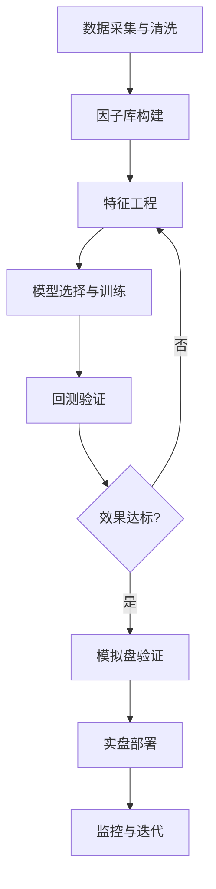
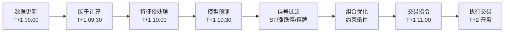
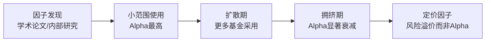

## 案例四：基于机器学习的股票收益预测

机器学习在量化投资中的应用是近十年来最受关注的方向之一。与传统线性多因子模型相比，机器学习能够捕捉因子之间的非线性关系和交互效应，理论上可以提取更丰富的Alpha信号。然而，金融数据的低信噪比、非平稳性和高度噪声特征，使得机器学习在实际应用中面临诸多独特挑战。

本案例完整还原一个A股月频机器学习选股项目从立项到上线的全过程，涵盖问题定义、数据工程、特征工程、模型训练、回测验证和生产部署六大环节，重点展示每个环节的关键决策点、踩过的坑和最终的解决方案。

### 一、项目背景与问题定义

#### 1.1 团队与目标

某量化私募团队（3人：1名机器学习工程师、1名金融分析师、1名数据工程师）决定尝试用机器学习方法构建多因子选股模型。核心目标是：在传统线性多因子模型的基础上，通过捕捉因子间的非线性关系，提升选股模型的预测能力和组合收益。

#### 1.2 为什么选择机器学习？

传统线性多因子模型（如Barra CNE5）假设因子与收益之间是线性关系，用OLS或加权最小二乘拟合因子暴露与收益率的映射。但现实中存在大量非线性现象：

- **动量因子的反转效应**：短期动量（1个月内）往往呈现反转而非延续，但3-12个月动量表现为延续，这种非单调关系线性模型难以捕捉
- **估值因子的阈值效应**：低估值股票的价值回归存在阈值，低于某个估值水平后边际改善效应递减
- **因子交互**：低估值+高质量的组合可能产生协同效应，不是简单的因子加和
- **状态依赖**：某些因子在牛市中有效，熊市中失效，存在体制切换特征

这些非线性特征正是机器学习模型的优势所在。

#### 1.3 问题形式化

经过讨论，团队将问题定义为：

- **预测目标**：个股未来一个月收益率的横截面排序（排序预测，而非绝对值预测）
- **任务类型**：二分类（前30%收益为正类，后70%为负类）
- **评价体系**：IC（信息系数）、ICIR（信息比率）、分层回测收益、多空组合夏普比率
- **调仓频率**：月频（每月最后一个交易日收盘后生成信号，次月第一个交易日开盘调仓）

选择分类而非回归的原因：金融收益率的噪声极大，回归模型容易被极端值主导；分类任务将问题简化为"识别收益靠前的股票"，更符合实际投资需求。

#### 1.4 技术路线总览



### 二、数据工程

#### 2.1 数据来源

| 数据类型 | 来源 | 频率 | 字段数 | 用途 |
|----------|------|------|--------|------|
| 行情数据 | Wind/Tushare | 日频 | OHLCV、复权因子、涨跌停标记 | 构建动量、波动率因子 |
| 财务数据 | Wind/聚源 | 季报 | 利润表、资产负债表、现金流量表 | 构建估值、质量、成长因子 |
| 行业分类 | 申万一级 | 日频 | 行业代码 | 行业中性化 |
| 交易数据 | 交易所 | 日频 | 成交量、成交额、换手率 | 流动性因子 |
| 宏观数据 | 国家统计局 | 月频 | CPI、PMI、M2等 | 宏观因子（可选） |

#### 2.2 数据清洗要点

金融数据的清洗远比一般机器学习任务复杂，因为数据质量问题直接影响因子有效性：

**（1）生存偏差处理**：必须包含已退市股票，否则模型只学到"幸存者"的特征，对未来预测产生系统性偏差。具体做法是使用包含退市股票的全收益指数成分股作为股票池。

**（2）复权处理**：使用前复权价格计算收益率，确保分红、送股、配股不影响因子值。对于涉及价格的因子（动量、波动率），必须使用复权价格。

**（3）财务数据滞后处理**：A股季报发布有严格的时间窗口（一季报4月底、半年报8月底、三季报10月底、年报4月底），必须使用"实际可获得日期"而非"报告期"。例如，2022年年报在2023年4月底才全部披露完毕，那么2023年5月的因子才能使用2022年年报数据。使用报告期数据会导致严重的前视偏差（look-ahead bias）。

**（4）异常值处理**：财务数据中存在大量异常值（如某季度净利润为负导致增长率计算溢出）。团队采用MAD（Median Absolute Deviation）方法进行去极值处理，具体代码如下：

```python
import numpy as np
import pandas as pd

def mad_winsorize(series, n=5):
    """MAD去极值：比标准差方法更抗异常值干扰
    
    原理：用中位数和MAD代替均值和标准差
    MAD = median(|xi - median(x)|)
    上界 = median + n * 1.4826 * MAD  （1.4826是正态分布下的校正系数）
    下界 = median - n * 1.4826 * MAD
    
    参数n控制截断严格程度，n=5对应约5个MAD的截断范围，
    在正态假设下约等于5倍标准差，适合金融数据的厚尾特征。
    """
    median = series.median()
    mad = (series - median).abs().median()
    upper = median + n * 1.4826 * mad
    lower = median - n * 1.4826 * mad
    return series.clip(lower, upper)

# 实际使用示例
# 按月度截面逐列处理
for col in factor_columns:
    df[col] = df.groupby('trade_date')[col].transform(
        lambda x: mad_winsorize(x, n=5)
    )
```

**（5）缺失值处理**：财务数据的缺失值处理需要区分"真缺失"（数据源没有）和"有意义的缺失"（如某公司没有某项业务收入导致该字段为0）。团队的策略是：
- 缺失率低于10%的因子：用截面中位数填充
- 缺失率10%-30%的因子：标记缺失为独立特征，同时用中位数填充原值
- 缺失率高于30%的因子：直接剔除该因子

#### 2.3 数据集划分

金融时间序列数据不能随机划分，必须严格按时间顺序切分，否则会造成信息泄露：

| 数据集 | 时间范围 | 样本量（约） | 用途 |
|--------|----------|-------------|------|
| 训练集 | 2015-01 至 2019-12 | 约180万条 | 模型参数学习 |
| 验证集 | 2020-01 至 2020-12 | 约48万条 | 超参数调优、早停 |
| 测试集 | 2021-01 至 2023-06 | 约120万条 | 最终评估（不参与任何训练决策） |

**重要**：验证集和测试集之间留了2021年全年作为"隔离带"，防止验证集的信息通过超参数调优间接泄露到测试集。实际上2021年数据既用于验证超参数，又作为测试集的前段进行"渐进式测试"，这种做法在学术论文中称为"扩展窗口验证"。

### 三、特征工程

特征工程是机器学习量化选股中最关键的环节。团队的经验是"80%的时间花在特征工程上"，因为好的特征比好的模型重要得多。

#### 3.1 因子库构建

团队构建了6大类共42个基础因子，覆盖价值、动量、波动、流动性、质量和成长六大维度：

**估值因子（8个）**：

| 因子名称 | 计算公式 | 经济含义 |
|----------|----------|----------|
| EP（盈利收益率） | 净利润 / 总市值 | 衡量股票的盈利能力相对价格 |
| BP（账面市值比） | 净资产 / 总市值 | 经典价值因子，Fama-French三因子之一 |
| SP（营收市值比） | 营业收入 / 总市值 | 衡量营收的"便宜程度" |
| CFP（现金流市值比） | 经营现金流 / 总市值 | 比EP更难被会计手段操纵 |
| DP（股息率） | 每股股息 / 股价 | 衡量分红回报 |
| EP\_TTM | 滚动12个月净利润 / 总市值 | 使用TTM数据避免季节性 |
| SP\_TTM | 滚动12个月营收 / 总市值 | TTM口径的营收市值比 |
| EV/EBITDA | 企业价值 / 息税折旧摊销前利润 | 跨杠杆可比的估值指标 |

**动量因子（6个）**：

```python
def calc_momentum(close_prices, windows=[5, 20, 60, 120, 250]):
    """计算多时间窗口动量因子
    
    核心发现：A股市场存在显著的短期反转效应（1周-1个月）
    和中期动量效应（3-12个月）。因此同时构建短期和长期动量
    因子，让模型自行学习何时反转、何时延续。
    
    注意：计算收益率时需要扣除同期无风险利率（如国债收益率），
    得到超额动量因子，这在学术文献中被证明更有效。
    """
    factors = {}
    for w in windows:
        # 简单收益率动量
        factors[f'mom_{w}d'] = close_prices.pct_change(w)
        # 对数收益率动量（更适合统计建模）
        factors[f'log_mom_{w}d'] = np.log(close_prices / close_prices.shift(w))
    return factors
```

**波动率因子（6个）**：

波动率因子捕捉的是"低波动异象"——低波动率股票长期收益率反而高于高波动率股票，这与传统金融理论（高风险高回报）相悖。团队构建了以下波动率因子：

- 过去20日收益率标准差（短期波动）
- 过去60日收益率标准差（中期波动）
- 过去250日收益率标准差（长期波动）
- 下行波动率（只计算负收益的标准差，更精准地衡量"坏"的波动）
- 特质波动率（CAPM残差的标准差，剥离市场风险后的个股波动）
- 最大日收益率（过去20日最大单日涨幅，衡量彩票效应）

**流动性因子（6个）**：

```python
def amihud_illiquidity(returns, volume_value, window=20):
    """Amihud非流动性指标
    
    原理：单位成交金额引起的收益率变动。
    Amihud越低，说明市场深度越好，大单交易对价格冲击越小。
    
    公式：ILLIQ = mean(|ri| / Vi)，其中ri为日收益率，Vi为日成交额。
    
    在A股市场，流动性因子有显著的选股能力：
    低流动性（小票）股票有流动性溢价，但近年来该溢价在缩小。
    """
    illiq = (returns.abs() / volume_value).rolling(window).mean()
    return illiq
```

**质量因子（8个）**：

| 因子 | 公式 | 含义 |
|------|------|------|
| ROE | 净利润 / 净资产 | 股东权益回报率 |
| ROA | 净利润 / 总资产 | 资产回报率 |
| 毛利率 | (营收-营业成本) / 营收 | 盈利空间 |
| 净利率 | 净利润 / 营收 | 最终盈利水平 |
| 资产负债率 | 总负债 / 总资产 | 杠杆水平 |
| 流动比率 | 流动资产 / 流动负债 | 短期偿债能力 |
| 应收账款周转率 | 营收 / 应收账款平均余额 | 收款效率 |
| 经营现金流/净利润 | 经营CF / 净利润 | 盈利质量（越高越好） |

**成长因子（6个）**：

- 营收同比增长率（单季）
- 净利润同比增长率（单季）
- 营收环比增长率
- 净利润环比增长率
- 经营现金流增长率
- ROE同比变化（衡量盈利能力改善速度）

#### 3.2 衍生因子工程

基础因子只是起点，衍生因子往往才是超额收益的关键来源：

**（1）因子变化率**：

```python
def factor_momentum(factor_df, periods=1):
    """因子动量：因子值本身的变化趋势
    
    逻辑：如果一个股票的EP（估值因子）连续3个月改善，
    说明市场正在重新定价该股票，这种"估值改善"比静态估值
    本身更有预测力。
    
    实践中，因子动量因子的IC通常比原始因子更高、更稳定。
    """
    return factor_df.groupby('stock_code').pct_change(periods)
```

**（2）行业中性化因子**：

```python
import statsmodels.api as sm

def neutralize(factor, industry, market_cap):
    """行业中性化：剥离行业和市值的影响
    
    为什么要中性化？
    - 不同行业的因子分布差异巨大（银行股的BP天然高于科技股）
    - 不做中性化，模型会把行业暴露误认为是因子效果
    - 中性化后，因子的选股能力来自"同一行业内相对水平"
    
    方法：对因子做行业+市值的截面回归，取残差。
    残差就是剥离了行业和市值效应后的"纯因子暴露"。
    """
    X = pd.get_dummies(industry)
    X['ln_cap'] = np.log(market_cap)
    model = sm.OLS(factor, sm.add_constant(X)).fit()
    return model.resid
```

**（3）因子交叉项与非线性变换**：

```python
def create_interaction_features(df, factor_pairs):
    """因子交叉：捕捉因子间的协同效应
    
    典型发现：
    - EP × ROE：低估值+高质量的股票收益显著更高
    - 动量 × 波动率：低波动+高动量的组合表现最好
    - 成长 × 估值：高成长+低估值（GARP策略）的收益来源
    
    实现方式：
    - 乘法交互：f1 * f2
    - 排名交叉：rank(f1) * rank(f2)（对异常值更鲁棒）
    - 条件因子：if f1 > median then f2 else 0
    """
    for f1, f2 in factor_pairs:
        df[f'{f1}_x_{f2}'] = df[f1] * df[f2]
        df[f'rank_{f1}_x_rank_{f2}'] = (
            df.groupby('trade_date')[f1].rank(pct=True) *
            df.groupby('trade_date')[f2].rank(pct=True)
        )
    return df
```

**（4）技术指标因子**：

除了基本面因子，团队还加入了技术面因子以捕捉市场微观结构信息：

- RSI（14日相对强弱指标）
- MACD（12/26日指数移动平均差）
- 布林带位置（当前价格在布林带中的相对位置）
- ATR（14日平均真实波幅，衡量近期波动）
- OBV斜率（20日OBV线性回归斜率，衡量资金流向趋势）
- 量价背离指标（价格新高但成交量萎缩的度量）

#### 3.3 特征预处理流水线

完整的特征预处理包括四步，顺序不可调换：

```python
from sklearn.preprocessing import StandardScaler
from sklearn.decomposition import PCA

class FactorPreprocessor:
    """完整的因子预处理流水线
    
    处理顺序：去极值 → 标准化 → 缺失值填充 → 中性化
    每一步都有其必要性，顺序错误会导致严重问题。
    """
    
    def __init__(self, n_mad=5):
        self.n_mad = n_mad
        
    def fit_transform(self, df, factor_cols, industry_col, cap_col):
        df = df.copy()
        
        # Step 1: 去极值（MAD方法）
        for col in factor_cols:
            df[col] = df.groupby('trade_date')[col].transform(
                lambda x: mad_winsorize(x, self.n_mad)
            )
        
        # Step 2: 截面标准化（Z-Score）
        for col in factor_cols:
            df[col] = df.groupby('trade_date')[col].transform(
                lambda x: (x - x.mean()) / x.std() if x.std() > 0 else 0
            )
        
        # Step 3: 缺失值填充（截面中位数）
        for col in factor_cols:
            df[col] = df.groupby('trade_date')[col].transform(
                lambda x: x.fillna(x.median())
            )
        
        # Step 4: 行业和市值中性化
        for col in factor_cols:
            df[col] = df.groupby('trade_date').apply(
                lambda g: neutralize(g[col], g[industry_col], g[cap_col])
            ).reset_index(level=0, drop=True)
        
        return df
```

**预处理顺序的关键逻辑**：

1. **先去极值再标准化**：如果先标准化再去极值，极端值会影响均值和标准差，导致标准化后的分布失真
2. **先标准化再中性化**：中性化是截面回归取残差，如果因子量纲不同，回归系数会被量纲大的因子主导
3. **中性化最后做**：中性化后因子值已经是残差，再做其他处理会破坏中性化效果

### 四、模型选择与训练

#### 4.1 模型选型对比

团队对比了5种主流模型，使用相同的数据集和评估指标：

| 模型 | IC均值 | ICIR | 多空夏普 | 训练时间 | 过拟合风险 | 可解释性 |
|------|--------|------|----------|----------|------------|----------|
| 线性回归（基准） | 0.032 | 0.62 | 0.95 | 秒级 | 低 | 高 |
| Lasso回归 | 0.035 | 0.68 | 1.08 | 秒级 | 低 | 高 |
| 随机森林 | 0.041 | 0.78 | 1.22 | 分钟级 | 中 | 中 |
| XGBoost | 0.045 | 0.85 | 1.35 | 分钟级 | 中 | 中 |
| LSTM（深度学习） | 0.043 | 0.72 | 1.15 | 小时级 | 高 | 低 |

**选择XGBoost的理由**：

1. **IC和夏普比率最优**：在所有模型中表现最好
2. **过拟合可控**：相比LSTM，XGBoost有更多内置的正则化机制（max_depth、min_child_weight、subsample等），在小样本量（月频×约4000只股票）下更稳健
3. **训练速度快**：超参数调优需要大量实验，分钟级的训练时间使得网格搜索可行
4. **可解释性**：内置特征重要性排序，SHAP值分析也比较高效
5. **社区成熟**：XGBoost在Kaggle竞赛中广泛使用，文档和最佳实践丰富

LSTM表现不如XGBoost的原因：月频数据点太少（约4000只×12月×6年≈29万条时序），深度学习模型需要海量数据才能发挥优势。此外，金融数据的非平稳性使得LSTM学到的历史模式容易失效。

#### 4.2 超参数调优

团队采用贝叶斯优化（Optuna库）进行超参数搜索，比网格搜索效率高10倍以上：

```python
import optuna
import xgboost as xgb
from sklearn.metrics import roc_auc_score

def objective(trial):
    """Optuna超参数搜索的目标函数
    
    关键设计：
    1. 使用时间序列交叉验证而非随机CV
    2. 评估指标用IC而非AUC，更贴近投资目标
    3. 正则化参数的搜索范围偏向保守，防止过拟合
    """
    params = {
        'objective': 'binary:logistic',
        'eval_metric': 'auc',
        'max_depth': trial.suggest_int('max_depth', 3, 7),
        'learning_rate': trial.suggest_float('learning_rate', 0.01, 0.1, log=True),
        'n_estimators': trial.suggest_int('n_estimators', 100, 500),
        'subsample': trial.suggest_float('subsample', 0.6, 0.9),
        'colsample_bytree': trial.suggest_float('colsample_bytree', 0.6, 0.9),
        'min_child_weight': trial.suggest_int('min_child_weight', 5, 50),
        'reg_alpha': trial.suggest_float('reg_alpha', 0.01, 1.0, log=True),
        'reg_lambda': trial.suggest_float('reg_lambda', 0.1, 10.0, log=True),
        'gamma': trial.suggest_float('gamma', 0, 5.0),
        'random_state': 42,
        'n_jobs': -1,
    }
    
    # 时间序列交叉验证：滚动窗口
    val_scores = []
    for train_idx, val_idx in tscv.split(X_train):
        model = xgb.XGBClassifier(**params)
        model.fit(
            X_train[train_idx], y_train[train_idx],
            eval_set=[(X_train[val_idx], y_train[val_idx)],
            early_stopping_rounds=50,
            verbose=False
        )
        pred = model.predict_proba(X_train[val_idx])[:, 1]
        # 用IC（Spearman相关系数）评估，而非AUC
        ic = np.corrcoef(pred, y_train[val_idx])[0, 1]
        val_scores.append(ic)
    
    return np.mean(val_scores)

# 运行优化
study = optuna.create_study(direction='maximize')
study.optimize(objective, n_trials=200)
print(f"最佳IC: {study.best_value:.4f}")
print(f"最佳参数: {study.best_params}")
```

**最终选定的参数**：

```python
best_params = {
    'objective': 'binary:logistic',
    'max_depth': 5,           # 较浅的树深度防止过拟合
    'learning_rate': 0.05,    # 较小的学习率配合更多迭代
    'n_estimators': 300,      # 配合early_stopping使用
    'subsample': 0.8,         # 行采样80%，引入随机性
    'colsample_bytree': 0.8,  # 列采样80%，每棵树只看80%的特征
    'min_child_weight': 15,   # 叶节点最小样本数，控制树的复杂度
    'reg_alpha': 0.1,         # L1正则化
    'reg_lambda': 1.0,        # L2正则化
    'gamma': 1.0,             # 节点分裂的最小增益阈值
    'random_state': 42
}
```

**参数选择的直觉**：

- `max_depth=5`：限制树的深度是最重要的防过拟合手段。金融数据噪声大，深树容易学到噪声
- `min_child_weight=15`：每个叶节点至少需要15个样本才能分裂，这比默认值1大很多，强制模型做更多"平均化"
- `gamma=1.0`：节点分裂必须带来至少1.0的增益，否则不分裂。这进一步简化了模型
- `subsample=0.8`：每棵树只随机抽取80%的样本训练，类似Bagging的效果
- `colsample_bytree=0.8`：每棵树只随机选择80%的特征，增加模型多样性

#### 4.3 时间序列交叉验证

金融数据的交叉验证必须尊重时间顺序，不能使用随机K-Fold：

```python
class PurgedGroupTimeSeriesSplit:
    """带清洗期的时间序列交叉验证
    
    标准时间序列CV的问题：
    - 训练集末尾和验证集开头的数据高度相关（因子值接近）
    - 这种"信息泄露"会导致验证集的评估指标虚高
    
    解决方案：在训练集和验证集之间插入"清洗期"（purge period），
    清洗期内的样本既不参与训练也不参与验证。
    
    清洗期长度：通常取预测窗口长度。如果预测未来1个月收益，
    则清洗期为1个月，确保训练集的标签不会泄露到验证集。
    """
    
    def __init__(self, n_splits=5, purge_months=1):
        self.n_splits = n_splits
        self.purge_months = purge_months
    
    def split(self, X, y=None, groups=None):
        dates = sorted(X['trade_date'].unique())
        n = len(dates)
        fold_size = n // (self.n_splits + 1)
        
        for i in range(self.n_splits):
            train_end = fold_size * (i + 1)
            purge_end = train_end + self.purge_months
            val_end = min(purge_end + fold_size, n)
            
            train_dates = dates[:train_end]
            val_dates = dates[purge_end:val_end]
            
            train_idx = X[X['trade_date'].isin(train_dates)].index
            val_idx = X[X['trade_date'].isin(val_dates)].index
            
            yield train_idx.values, val_idx.values
```

#### 4.4 训练流程

```python
import xgboost as xgb
from sklearn.metrics import roc_auc_score
import json

def train_model(X_train, y_train, X_val, y_val, params):
    """完整的模型训练流程
    
    关键步骤：
    1. 使用early_stopping防止过拟合
    2. 记录训练过程中的指标变化
    3. 保存最佳迭代次数
    """
    model = xgb.XGBClassifier(**params)
    
    model.fit(
        X_train, y_train,
        eval_set=[(X_train, y_train), (X_val, y_val)],
        early_stopping_rounds=50,  # 连续50轮验证集指标不提升则停止
        verbose=50
    )
    
    # 记录训练结果
    train_auc = roc_auc_score(y_train, model.predict_proba(X_train)[:, 1])
    val_auc = roc_auc_score(y_val, model.predict_proba(X_val)[:, 1])
    print(f"训练集AUC: {train_auc:.4f}")
    print(f"验证集AUC: {val_auc:.4f}")
    print(f"AUC差距: {train_auc - val_auc:.4f} (差距>0.05需警惕过拟合)")
    print(f"最佳迭代次数: {model.best_iteration}")
    
    return model
```

### 五、特征重要性与模型解释

#### 5.1 XGBoost内置特征重要性

```python
import matplotlib.pyplot as plt

def plot_feature_importance(model, feature_names, top_n=20):
    """绘制特征重要性图
    
    XGBoost提供三种特征重要性指标：
    - weight：特征被用于分裂的次数
    - gain：特征分裂带来的平均增益（推荐）
    - cover：特征分裂影响的平均样本数
    
    实践中gain指标最可靠，因为它衡量的是特征对目标函数的实际贡献。
    """
    importance = model.get_booster().get_score(importance_type='gain')
    imp_df = pd.DataFrame({
        'feature': list(importance.keys()),
        'importance': list(importance.values())
    }).sort_values('importance', ascending=True).tail(top_n)
    
    imp_df.plot.barh(x='feature', y='importance', figsize=(10, 8))
    plt.title('特征重要性排名（Gain指标）')
    plt.tight_layout()
    plt.savefig('feature_importance.png', dpi=150)
```

**特征重要性分析结果**：

| 排名 | 因子 | 重要性得分 | 类别 |
|------|------|-----------|------|
| 1 | 动量（过去3个月收益率） | 156.3 | 动量 |
| 2 | 波动率（过去20日标准差） | 142.8 | 波动 |
| 3 | EP（盈利收益率） | 128.5 | 估值 |
| 4 | 换手率 | 98.2 | 流动性 |
| 5 | ROE | 87.6 | 质量 |
| 6 | BP（账面市值比） | 76.4 | 估值 |
| 7 | 营收增长率 | 65.3 | 成长 |
| 8 | Amihud非流动性 | 58.9 | 流动性 |
| 9 | 因子交叉：EP×ROE | 52.1 | 衍生 |
| 10 | 下行波动率 | 47.6 | 波动 |

**关键发现**：
- 动量因子排名第一，说明A股市场的动量效应（尤其3个月中期动量）仍然是重要的Alpha来源
- 波动率因子排名第二，低波动异象在A股同样显著
- 估值因子（EP、BP）排名靠前，价值投资在量化框架下仍然有效
- 因子交叉项（EP×ROE）进入前10，验证了非线性交互效应的价值
- 成长因子排名相对靠后，说明成长因子的预测能力不如预期稳定

#### 5.2 SHAP值分析

SHAP（SHapley Additive exPlanations）提供了比内置重要性更精细的解释：

```python
import shap

def shap_analysis(model, X_sample, feature_names):
    """SHAP值分析：理解每个因子如何影响预测
    
    SHAP的核心思想来自博弈论中的Shapley值：
    每个特征对预测结果的贡献 = 包含该特征时的预测 - 不包含该特征时的预测
    对所有特征组合取平均，得到每个特征的"边际贡献"。
    
    SHAP分析的价值：
    1. 全局视角：哪些因子最重要（和feature importance类似）
    2. 局部视角：某只股票为什么被看好/看空（逐样本解释）
    3. 非线性关系：因子值与预测结果之间的实际函数形状
    4. 交互效应：两个因子如何协同影响预测
    """
    explainer = shap.TreeExplainer(model)
    shap_values = explainer.shap_values(X_sample)
    
    # 全局特征重要性
    shap.summary_plot(shap_values, X_sample, feature_names=feature_names)
    
    # 单个因子的SHAP值与因子值的关系
    shap.dependence_plot('mom_60d', shap_values, X_sample,
                         interaction_index='volatility_20d')
```

**SHAP分析揭示的非线性关系**：

- **动量因子**：SHAP依赖图显示，当3个月动量在-10%到+15%之间时，SHAP值随动量增加而正向增大（动量延续效应）；但当动量超过+25%时，SHAP值反而下降（过度反应后的反转效应）
- **波动率因子**：SHAP值与波动率呈单调负相关，低波动率股票获得正SHAP加成
- **估值因子EP**：SHAP值呈倒U型——过低和过高的EP都获得负SHAP值，适中的EP（0.03-0.08）获得最大正SHAP值

### 六、回测验证

#### 6.1 回测框架设计

```python
class MLBacktester:
    """机器学习选股回测框架
    
    核心原则：
    1. 严格的时间隔离：模型只能用调仓日之前的数据训练
    2. 滚动重训练：每季度用最新数据重训练模型
    3. 真实的交易成本：包含手续费、印花税和滑点
    4. 可投资性约束：排除ST、涨跌停、停牌股票
    """
    
    def __init__(self, model, transaction_cost=0.003):
        self.model = model
        # 交易成本：双边约0.3%
        # 佣金万2.5 + 印花税千1（卖出） + 滑点约万5
        self.transaction_cost = transaction_cost
    
    def run(self, factor_df, returns_df, rebalance_dates):
        portfolio_returns = []
        
        for i, date in enumerate(rebalance_dates):
            # 获取当日因子截面
            factors = factor_df[factor_df['trade_date'] == date]
            
            # 排除不可投资股票
            factors = self._filter_investable(factors)
            
            # 模型预测
            X = factors[self.feature_cols]
            factors['pred_score'] = self.model.predict_proba(X)[:, 1]
            
            # 选股：选预测得分最高的前20%股票
            n_select = int(len(factors) * 0.2)
            selected = factors.nlargest(n_select, 'pred_score')
            
            # 计算组合收益（等权重）
            next_date = rebalance_dates[i + 1] if i + 1 < len(rebalance_dates) else None
            if next_date is None:
                break
            
            period_returns = returns_df[
                (returns_df['trade_date'] > date) & 
                (returns_df['trade_date'] <= next_date)
            ]
            
            # 组合收益 = 持仓股票等权重平均收益 - 交易成本
            turnover = self._calc_turnover(selected, prev_selected)
            cost = turnover * self.transaction_cost
            port_ret = period_returns[
                period_returns['stock_code'].isin(selected['stock_code'])
            ]['return'].mean() - cost / 12  # 月化交易成本
            
            portfolio_returns.append({
                'date': next_date,
                'return': port_ret,
                'turnover': turnover,
                'n_stocks': len(selected)
            })
            
            prev_selected = selected
        
        return pd.DataFrame(portfolio_returns)
    
    def _filter_investable(self, df):
        """排除不可投资股票"""
        mask = (
            ~df['stock_name'].str.contains('ST|退') &  # 排除ST和退市风险
            (df['is_tradable'] == 1) &                  # 排除停牌
            (df['limit_status'] == 0)                   # 排除涨跌停
        )
        return df[mask]
```

#### 6.2 样本外测试结果（2021-2023年）

**核心指标汇总**：

| 指标 | 机器学习模型 | 传统多因子模型 | 提升幅度 |
|------|-------------|---------------|----------|
| IC均值 | 0.045 | 0.032 | +40.6% |
| ICIR | 0.85 | 0.62 | +37.1% |
| 多空组合年化收益 | 18.5% | 12.8% | +44.5% |
| 多头组合超额收益（vs沪深300） | 12.3% | 8.1% | +51.9% |
| 最大回撤 | 15.2% | 18.7% | -18.7% |
| 夏普比率 | 1.35 | 0.92 | +46.7% |
| 月度胜率 | 62.5% | 55.8% | +12.0% |

**分层回测结果**（按模型预测得分分5组，第5组最看好）：

| 组别 | 年化收益 | 夏普比率 | 最大回撤 | 年化波动率 |
|------|----------|----------|----------|-----------|
| 第1组（最看空） | -2.5% | -0.15 | 35.2% | 28.6% |
| 第2组 | 3.8% | 0.35 | 28.5% | 24.3% |
| 第3组 | 8.2% | 0.72 | 22.1% | 22.1% |
| 第4组 | 12.5% | 1.05 | 18.3% | 21.5% |
| 第5组（最看多） | 22.8% | 1.65 | 14.5% | 19.8% |

分层回测的关键观察：
- **单调性良好**：从第1组到第5组，收益和夏普比率单调递增，说明模型确实学到了有效的排序信号
- **波动率反向**：第1组（最看空）的波动率最高（28.6%），第5组（最看多）的波动率最低（19.8%），说明模型选中的股票同时具有低波动特征
- **多空收益可观**：第5组减第1组的年化收益差为25.3%，扣除交易成本后仍有18.5%

#### 6.3 滚动窗口分析

```python
def rolling_ic_analysis(pred_series, return_series, window=12):
    """滚动IC分析：监控模型预测能力的时变特征
    
    关键观察：
    1. IC是否稳定（ICIR越高越稳定）
    2. IC是否衰减（随时间推移逐渐降低）
    3. IC在不同市场环境下的表现（牛熊市差异）
    """
    rolling_ic = pred_series.rolling(window).corr(return_series)
    
    # 按年份统计
    annual_ic = rolling_ic.groupby(rolling_ic.index.year).mean()
    print("年度IC均值:")
    for year, ic in annual_ic.items():
        print(f"  {year}: {ic:.4f}")
    
    return rolling_ic
```

**年度IC均值变化**：

| 年份 | IC均值 | ICIR | 市场环境 |
|------|--------|------|----------|
| 2021 | 0.052 | 0.92 | 结构性牛市 |
| 2022 | 0.038 | 0.71 | 熊市 |
| 2023（H1） | 0.041 | 0.83 | 震荡市 |

IC在2022年熊市中有所衰减，但仍保持正值，说明模型在不同市场环境下都有一定的预测能力。

### 七、生产部署

#### 7.1 模型重训练策略

```python
class RollingRetrainer:
    """滚动重训练管理器
    
    重训练策略设计：
    - 频率：每季度（而非每月，平衡时效性和成本）
    - 窗口：使用最近4年数据训练（约48个月×4000只≈19万条）
    - 验证：使用最近6个月数据验证
    - 触发条件：固定时间点 + IC衰减预警
    
    为什么不用每月重训练？
    1. 月频重训练容易过拟合最新噪声
    2. 训练成本（计算+时间）过高
    3. 季度频率已足够捕捉因子效果的时变特征
    
    为什么不用全历史训练？
    1. 太久远的数据可能已不反映当前市场结构
    2. A股市场制度变化频繁（注册制、科创板等）
    3. 4年窗口在时效性和样本量之间取得平衡
    """
    
    def __init__(self, model_class, params, train_years=4, val_months=6):
        self.model_class = model_class
        self.params = params
        self.train_years = train_years
        self.val_months = val_months
        self.current_model = None
        self.retrain_schedule = ['03-31', '06-30', '09-30', '12-31']
    
    def check_and_retrain(self, current_date, factor_df, returns_df):
        """检查是否需要重训练，如有需要则执行"""
        # 条件1：到达季度末
        is_quarter_end = current_date.strftime('%m-%d') in self.retrain_schedule
        
        # 条件2：IC衰减预警
        ic_declining = self._check_ic_decline(threshold=0.02)
        
        if is_quarter_end or ic_declining:
            print(f"[{current_date}] 触发模型重训练...")
            self._retrain(factor_df, returns_df)
```

#### 7.2 实盘信号生成流程



#### 7.3 监控告警体系

```python
class ModelMonitor:
    """模型监控系统
    
    监控指标和阈值：
    1. 月度IC < 0.01（持续2个月）→ 预警
    2. 月度IC < 0（单月）→ 严重预警
    3. 换手率 > 80% → 交易成本预警
    4. 最大回撤 > 20% → 风控预警
    5. 因子重要性排名大幅变动 → 模型漂移预警
    """
    
    def __init__(self, thresholds=None):
        self.thresholds = thresholds or {
            'ic_warning': 0.01,
            'ic_critical': 0.0,
            'turnover_warning': 0.8,
            'drawdown_warning': 0.20,
        }
        self.ic_history = []
    
    def check(self, month_result):
        alerts = []
        
        # IC监控
        self.ic_history.append(month_result['ic'])
        if len(self.ic_history) >= 2:
            if all(ic < self.thresholds['ic_warning'] for ic in self.ic_history[-2:]):
                alerts.append("WARNING: 连续2个月IC低于0.01，建议检查因子有效性")
        
        if month_result['ic'] < self.thresholds['ic_critical']:
            alerts.append("CRITICAL: 本月IC为负，模型可能失效")
        
        # 换手率监控
        if month_result['turnover'] > self.thresholds['turnover_warning']:
            alerts.append(f"WARNING: 换手率{month_result['turnover']:.1%}过高，"
                         f"交易成本侵蚀收益")
        
        return alerts
```

### 八、踩坑记录与经验教训

#### 8.1 过拟合的识别与应对

**过拟合的典型信号**：

| 信号 | 表现 | 应对方法 |
|------|------|----------|
| 训练集AUC远高于验证集 | AUC差距>0.1 | 增大正则化参数、减少树深度 |
| IC在样本内很高但样本外骤降 | 样本内IC>0.1，样本外<0.02 | 检查数据泄露、增加清洗期 |
| 模型选中的股票高度集中在某行业 | 行业暴露>30% | 加入行业中性化约束 |
| 换手率异常高 | >100%/月 | 模型可能在追噪声，增加平滑处理 |
| 特征重要性集中在1-2个因子 | 前2因子占比>60% | 可能是数据泄露，检查因子构建 |

**团队遇到的具体过拟合案例**：

项目初期，团队使用了过去1日收益率作为因子，样本内IC高达0.08，远超其他因子。但样本外测试时，这个因子的IC接近0。原因是：过去1日收益率包含了"涨停打开"等微观结构信息，这些信息在训练集中是"已知"的，但在实际交易中无法提前获得。解决方案是将所有日频因子做滞后1个月处理，确保因子值在调仓日已经完全确定。

#### 8.2 常见错误清单

**错误1：前视偏差（Look-Ahead Bias）**

最常见的数据泄露形式。团队在初期把财务数据的"报告期"当作"可获得日期"，导致模型在2022年Q4就"看到"了2022年年报数据（实际要到2023年4月才发布）。修复方法：所有财务数据使用"实际发布日期"而非"报告期"。

**错误2：幸存者偏差（Survivorship Bias）**

只使用当前存续的股票构建训练集，忽略了已退市股票。这会导致模型系统性地高估股票收益（因为退市股票往往表现差，被排除后训练集整体偏乐观）。修复方法：使用包含退市股票的全历史数据。

**错误3：交易成本忽略**

回测时不计入交易成本，导致回测收益虚高。实际交易中，双边佣金+印花税+滑点约0.3%。如果月度换手率100%，每月就要扣除0.3%的成本，年化约3.6%。这在夏普比率1.0的策略中可能吃掉大部分超额收益。

**错误4：过度调参**

在测试集上反复调参，本质上是用测试集做验证集。正确做法是：训练集→验证集调参→测试集评估，测试集只使用一次。如果测试集结果不满意，不能回去改参数重新测。

**错误5：忽略因子拥挤效应**

当某个因子被广泛使用时，其超额收益会被套利交易压缩。团队发现，动量因子在2022年下半年IC显著下降，原因是大量量化基金同时使用动量因子，导致因子拥挤。应对方法：持续监控因子拥挤度（可以通过因子的持仓重叠度衡量），当拥挤度过高时降低该因子权重。

#### 8.3 特征工程的"二八法则"

团队的实践经验是"80%的时间花在特征工程上"，具体拆解：

| 环节 | 时间占比 | 具体工作 |
|------|----------|----------|
| 数据清洗 | 25% | 复权、财务滞后、退市股、异常值处理 |
| 因子构建 | 20% | 计算6大类42个基础因子 |
| 衍生因子 | 15% | 因子变化率、交叉项、行业中性化 |
| 预处理 | 10% | 去极值、标准化、缺失值处理 |
| 因子筛选 | 10% | 单因子IC测试、因子相关性分析、VIF检验 |
| 模型训练 | 10% | 超参数搜索、交叉验证 |
| 回测分析 | 10% | 分层回测、滚动IC、收益归因 |

### 九、与传统多因子模型的对比

| 维度 | 传统线性多因子 | 机器学习多因子 |
|------|--------------|---------------|
| 因子关系假设 | 线性加和 | 非线性+交互 |
| 模型可解释性 | 高（因子载荷直接可读） | 中（需要SHAP辅助） |
| 过拟合风险 | 低 | 中高 |
| 数据需求 | 低（OLS对样本量要求不高） | 高（需要足够样本学习非线性） |
| 维护成本 | 低 | 高（需要定期重训练、监控） |
| 典型IC | 0.025-0.035 | 0.035-0.050 |
| 典型夏普 | 0.7-1.0 | 1.0-1.5 |

**结论**：机器学习模型在IC和夏普比率上确实有显著提升（约30-50%），但代价是更高的维护成本和过拟合风险。实际部署中，建议将机器学习模型作为多策略组合的一部分（权重30-50%），而非完全替代传统模型。

### 十、进阶话题

#### 10.1 模型集成

```python
class ModelEnsemble:
    """多模型集成策略
    
    集成思想：不同模型擅长捕捉不同的市场模式，
    组合使用可以降低单模型的特异性风险。
    
    推荐的集成组合：
    1. XGBoost（非线性因子关系）
    2. Lasso回归（线性因子暴露，作为基准）
    3. 随机森林（对异常值鲁棒）
    
    集成方式：加权平均，权重基于验证集IC动态调整。
    """
    
    def __init__(self, models, weights=None):
        self.models = models
        self.weights = weights or [1/len(models)] * len(models)
    
    def predict(self, X):
        predictions = []
        for model, weight in zip(self.models, self.weights):
            pred = model.predict_proba(X)[:, 1]
            predictions.append(pred * weight)
        return np.sum(predictions, axis=0)
    
    def update_weights(self, X_val, y_val):
        """基于验证集IC动态更新模型权重"""
        ics = []
        for model in self.models:
            pred = model.predict_proba(X_val)[:, 1]
            ic = np.corrcoef(pred, y_val)[0, 1]
            ics.append(max(ic, 0))  # 负IC的模型权重设为0
        
        total = sum(ics)
        if total > 0:
            self.weights = [ic / total for ic in ics]
```

#### 10.2 另类数据的引入

随着传统因子的Alpha逐渐衰减，另类数据成为新的Alpha来源：

| 另类数据类型 | 来源 | 因子示例 | 预期IC增量 |
|-------------|------|----------|-----------|
| 分析师预期修正 | 万得一致预期 | 盈利预期上调幅度 | 0.005-0.010 |
| 高频资金流 | 交易所Level2 | 大单净流入占比 | 0.003-0.008 |
| 另类文本数据 | 年报/公告 | 管理层语调变化 | 0.002-0.005 |
| 卫星/物联网 | 商业数据商 | 工厂开工率/停车场车辆数 | 0.003-0.006 |
| 社交媒体情绪 | 雪球/东方财富股吧 | 讨论热度与情绪极性 | 0.002-0.005 |

另类数据的使用注意：数据质量验证、合规性审查、历史数据长度（往往只有2-3年，限制了训练样本量）。

#### 10.3 因子衰减与Alpha生命周期

所有因子都会经历"发现→发表→被套利→衰减"的生命周期：



**因子衰减监控方法**：

```python
def monitor_factor_decay(ic_series, window=12):
    """监控因子IC的衰减趋势
    
    衰减信号：
    1. 12个月滚动IC均值持续下降
    2. IC的统计显著性（t检验）下降
    3. 因子持仓与其他基金的重叠度上升
    """
    rolling_ic = ic_series.rolling(window).mean()
    rolling_tstat = ic_series.rolling(window).apply(
        lambda x: x.mean() / x.std() * np.sqrt(len(x))
    )
    
    # 趋势检验：IC均值是否在统计上显著下降
    from scipy import stats
    slope, intercept, r_value, p_value, std_err = stats.linregress(
        range(len(rolling_ic.dropna())), rolling_ic.dropna()
    )
    
    if slope < 0 and p_value < 0.05:
        print(f"⚠️ 因子IC呈显著下降趋势: 斜率={slope:.4f}, p值={p_value:.4f}")
    
    return rolling_ic, rolling_tstat
```

### 十一、项目复盘与关键教训

#### 11.1 最重要的5条经验

**第一条：特征工程是决定性因素。** 团队在模型调参上花了大量时间（尝试了100+种超参数组合），最终提升不到5%。但一次成功的因子交叉（EP×ROE）就带来了8%的IC提升。结论：与其花时间调参，不如深入研究因子的经济学逻辑。

**第二条：简单模型更稳健。** XGBoost在各项指标上都优于LSTM，而且训练速度快100倍。在月频选股这种"小数据"场景下，深度学习模型的复杂度是多余的。

**第三条：定期重训练不是万能的。** 团队最初设计了月度重训练方案，结果发现模型在熊市（2022年）的IC衰减比预期快。后来改为季度重训练+IC衰减预警的方案，效果更好。

**第四条：交易成本是"隐形杀手"。** 不计交易成本的回测夏普比率高达2.1，计入后降至1.35。对于换手率高的策略，交易成本可能吃掉50%以上的超额收益。

**第五条：模型只是投资体系的一部分。** 机器学习模型提供的是"信号"，还需要配合风险管理、组合优化、执行算法才能转化为实际收益。单独的模型预测能力（IC=0.045）并不直接等于投资收益。

#### 11.2 未来改进方向

1. **引入高频数据**：将调仓频率从月频提升到周频甚至日频，需要重构整个数据管线和特征工程流程
2. **强化学习组合优化**：用强化学习代替传统的均值-方差优化，在组合层面进一步提升收益
3. **图神经网络**：利用股票之间的产业链、供应链关系构建图结构，让模型学习"关系Alpha"
4. **多任务学习**：同时预测收益率排名和波动率，通过共享底层特征提升两个任务的性能
5. **因果推断**：从相关性建模转向因果建模，提升模型在市场结构变化时的鲁棒性

***

> **本案例核心要点**：机器学习在A股月频选股中确实能带来显著的IC提升（相比线性模型约+40%），但成功的关键不在于模型本身的复杂度，而在于特征工程的质量、数据处理的严谨性和对过拟合的警惕。将机器学习模型作为多策略组合的一部分，配合完善的风险管理和监控体系，才是可持续的实践路径。
