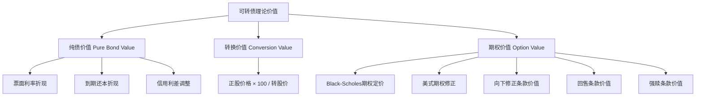
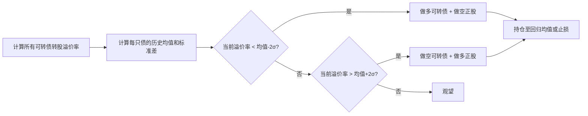
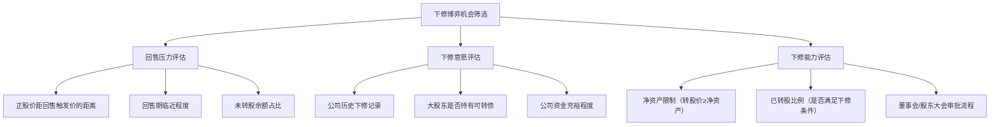

## 案例六：可转债量化套利策略

### 案例背景与可转债市场概况

可转换债券（Convertible Bond）是中国A股市场中一类独特的金融工具，兼具债券的"下有保底"与股票的"上不封顶"双重属性。截至2024年底，中国可转债市场存量规模超过8000亿元，上市交易的可转债数量超过500只，日均成交额约300-500亿元，是全球最活跃的可转债市场之一。

**为什么可转债适合量化策略？**

可转债的定价涉及债券价值、转股价值、期权价值三个维度，普通投资者难以凭直觉定价，这为量化策略创造了系统的定价偏差捕获机会。此外，可转债具有以下独特优势：

| 特性 | 说明 | 量化优势 |
|------|------|----------|
| T+0交易 | 当日买入当日可卖出 | 高频套利、日内回转策略可行 |
| 无涨跌幅限制（上市首日除外） | 盘中涨跌幅不受10%限制 | 波动性策略空间大 |
| 债底保护 | 到期收益率为正时有安全垫 | 下行风险可控 |
| 转股期权 | 附带看涨期权 | 非线性收益结构可被量化定价 |
| 强赎条款 | 正股连续30日中15日高于转股价130%触发 | 事件驱动策略机会 |
| 回售条款 | 正股连续30日低于转股价70%触发 | 下行保护+博弈机会 |

本案例以一个真实的可转债量化套利系统为核心，展示从理论建模、数据获取、策略实现到风险管理的完整流程。该系统由一位有3年Python开发经验的投资者在2022年初开始搭建，经过6个月的回测验证和3个月的模拟盘测试后，于2022年10月投入实盘运行，截至2024年6月累计运行约20个月。

---

### 第一部分：可转债定价理论基础

#### 可转债的价值构成

可转债的理论价值由三部分构成：



**纯债价值（Pure Bond Value）**：假设可转债不具备转股权，作为普通企业债的理论价格。计算公式：

$$PV_{bond} = \sum_{t=1}^{n} \frac{C_t}{(1+r)^t} + \frac{F}{(1+r)^n}$$

其中 $C_t$ 为第 $t$ 期票息，$F$ 为到期面值（100元），$r$ 为折现率（同期限同评级企业债收益率 + 信用利差）。

**转换价值（Conversion Value）**：立即转股并卖出可获得的价值：

$$CV = \frac{P_s \times 100}{P_c}$$

其中 $P_s$ 为正股价格，$P_c$ 为转股价格。转换价值/面值即为转股溢价率为0时的理论价格。

**市场价格与理论价值的关系**：

| 价值类型 | 含义 | 计算方法 |
|----------|------|----------|
| 纯债价值 | 不转股的保底价值 | 票息+面值折现 |
| 转换价值 | 立即转股的价值 | 正股价×100/转股价 |
| 转换平价 | 市场价格隐含的正股价格 | 转股价×市价/100 |
| 转股溢价率 | 市价相对转换价值的溢价 | (市价-转换价值)/转换价值×100% |
| 纯债溢价率 | 市价相对纯债价值的溢价 | (市价-纯债价值)/纯债价值×100% |
| 到期收益率(YTM) | 持有到期的年化收益率 | 解方程求折现率 |

**转股溢价率**是量化策略中最关键的指标之一。转股溢价率低意味着可转债跟随正股的弹性大，适合做正股替代；转股溢价率高意味着可转债"债性"强，适合防守配置。

#### 二叉树定价模型

可转债包含美式期权（随时可以转股）、回售条款、强赎条款等复杂嵌入期权，Black-Scholes模型无法直接适用。业界常用的定价方法是**二叉树模型（Binomial Tree Model）**，能够处理路径依赖的嵌入条款。

```python
import numpy as np

def binomial_cb_pricing(S0, K, T, r, sigma, coupon_rate, 
                         face_value=100, N=200, 
                         call_price=130, put_price=70,
                         call_trigger_days=15, put_trigger_days=30):
    """
    可转债二叉树定价模型
    
    参数：
        S0: 正股当前价格
        K: 转股价格
        T: 到期时间（年）
        r: 无风险利率
        sigma: 正股波动率
        coupon_rate: 票面利率列表（按年）
        face_value: 面值
        N: 二叉树步数
        call_price: 强赎触发价格（转股价的百分比）
        put_price: 回售触发价格（转股价的百分比）
    """
    dt = T / N
    u = np.exp(sigma * np.sqrt(dt))     # 上涨因子
    d = 1 / u                            # 下跌因子
    p = (np.exp(r * dt) - d) / (u - d)   # 风险中性概率
    
    # 构建正股价格树
    stock = np.zeros((N + 1, N + 1))
    for i in range(N + 1):
        for j in range(i + 1):
            stock[j, i] = S0 * (u ** (i - j)) * (d ** j)
    
    # 构建可转债价值树（从后向前）
    cb = np.zeros((N + 1, N + 1))
    
    # 到期日：取转股价值和到期还本付息的较大值
    final_coupon = coupon_rate[-1] if len(coupon_rate) >= T else coupon_rate[-1]
    for j in range(N + 1):
        conversion_value = stock[j, N] * 100 / K
        bond_value = face_value * (1 + final_coupon)
        cb[j, N] = max(conversion_value, bond_value)
    
    # 逆向归纳
    for i in range(N - 1, -1, -1):
        # 当期票息
        year = int(i * dt)
        annual_coupon = coupon_rate[min(year, len(coupon_rate) - 1)] * face_value
        period_coupon = annual_coupon * dt  # 按时间比例计算
        
        for j in range(i + 1):
            # 持有价值 = 折现的期望值 + 票息
            hold_value = np.exp(-r * dt) * (p * cb[j, i + 1] + (1 - p) * cb[j + 1, i + 1]) + period_coupon
            
            # 转股价值
            conversion_value = stock[j, i] * 100 / K
            
            # 回售保护价值（简化处理）
            put_value = face_value * 0.98  # 回售价通常为面值+当期利息
            
            # 强赎限制（正股高于转股价×call_price%时强制赎回）
            if stock[j, i] > K * call_price / 100:
                call_value = face_value * (1 + annual_coupon)  # 赎回价
                cb[j, i] = min(hold_value, call_value)
            else:
                cb[j, i] = max(hold_value, conversion_value, put_value)
    
    return cb[0, 0]

# 使用示例：某可转债
price = binomial_cb_pricing(
    S0=15.0,           # 正股价15元
    K=12.0,            # 转股价12元
    T=5.0,             # 剩余5年
    r=0.025,           # 无风险利率2.5%
    sigma=0.30,        # 正股年化波动率30%
    coupon_rate=[0.004, 0.006, 0.010, 0.015, 0.020],  # 递增票息
    N=200
)
print(f"可转债理论价值: {price:.2f}元")
```

> **注意**：上述代码为教学简化版本。生产环境中需要加入更精细的条款处理（有条件回售、附加回售、提前到期等）、信用风险调整、以及更高效的Cython/Numba加速。

---

### 第二部分：数据获取与预处理

#### 数据源选择

可转债量化系统需要以下几类数据：

| 数据类型 | 数据源 | 获取方式 | 频率 |
|----------|--------|----------|------|
| 可转债行情 | 东方财富/集思录 | API/爬虫 | 日级/分钟级 |
| 正股行情 | Tushare/AKShare | Python API | 日级/分钟级 |
| 可转债条款 | 募集说明书 | PDF解析 | 一次性 |
| 转股价格调整 | 公告 | 爬虫/API | 事件驱动 |
| 评级变动 | 中诚信/联合评级 | 爬虫 | 事件驱动 |
| 强赎/回售公告 | 公司公告 | 爬虫 | 事件驱动 |

#### 数据获取代码

```python
import akshare as ak
import pandas as pd
from datetime import datetime, timedelta

class ConvertibleBondData:
    """可转债数据获取与管理"""
    
    def __init__(self):
        self.cache = {}
    
    def get_cb_list(self):
        """获取所有可转债的基本信息"""
        df = ak.bond_cb_jsl()  # 集思录数据
        # 关键字段：代码、名称、正股代码、正股名称、
        # 转股价、转股溢价率、纯债价值、到期收益率、评级
        return df
    
    def get_cb_daily(self, symbol, start_date, end_date):
        """获取可转债日线数据"""
        df = ak.bond_zh_hs_cov_daily(symbol=symbol)
        df['date'] = pd.to_datetime(df['date'])
        df = df[(df['date'] >= start_date) & (df['date'] <= end_date)]
        return df
    
    def get_cb_conversion_price_history(self, symbol):
        """获取转股价格调整历史"""
        # 转股价下调是可转债投资中最重要的事件之一
        # 下调转股价 → 转换价值提升 → 可转债价格上涨
        df = ak.bond_cb_redeem_jsl(symbol=symbol)
        return df
    
    def get_cb_call_events(self):
        """筛选强赎触发条件的可转债"""
        df = self.get_cb_list()
        # 强赎条件：正股连续30个交易日中至少15个交易日
        # 收盘价不低于转股价的130%
        call_candidates = df[
            (df['正股价格'] >= df['转股价'] * 1.30) & 
            (df['剩余年限'] > 0.5)  # 排除即将到期的
        ]
        return call_candidates
    
    def get_cb_put_events(self):
        """筛选回售触发条件的可转债"""
        df = self.get_cb_list()
        put_candidates = df[
            (df['正股价格'] <= df['转股价'] * 0.70) &
            (df['回售期起始日'] <= datetime.now())  # 已进入回售期
        ]
        return put_candidates

    def calculate_cb_metrics(self, df):
        """计算可转债核心量化指标"""
        df = df.copy()
        
        # 转股溢价率
        df['conversion_value'] = df['正股价格'] * 100 / df['转股价']
        df['conversion_premium'] = (df['收盘价'] - df['conversion_value']) / df['conversion_value'] * 100
        
        # 纯债溢价率
        df['bond_premium'] = (df['收盘价'] - df['纯债价值']) / df['纯债价值'] * 100
        
        # 隐含波动率（需要期权定价反推）
        df['implied_vol'] = df.apply(
            lambda row: self._calc_implied_vol(
                row['收盘价'], row['正股价格'], row['转股价'], row['剩余年限']
            ), axis=1
        )
        
        # Delta（可转债价格对正股价格的敏感度）
        df['delta'] = df['conversion_value'] / df['收盘价']
        
        return df
    
    def _calc_implied_vol(self, cb_price, stock_price, strike, ttm):
        """牛顿法求解隐含波动率"""
        from scipy.optimize import brentq
        
        def objective(sigma):
            # 用简化期权定价模型计算理论价格
            theoretical = self._bs_convertible(stock_price, strike, ttm, sigma)
            return theoretical - cb_price
        
        try:
            iv = brentq(objective, 0.01, 2.0, xtol=1e-6)
            return iv
        except:
            return None
```

#### 数据清洗要点

可转债数据中常见的质量问题及处理方法：

1. **新债上市首日异常值**：上市首日无涨跌幅限制，价格波动剧烈，需单独标记或剔除
2. **转股价调整断点**：公司因分红、增发等原因调整转股价，需要准确记录每个时段的对应转股价
3. **停牌数据缺失**：正股停牌期间可转债可能继续交易，导致转股溢价率失真
4. **尾盘集合竞价异常**：部分可转债在收盘前出现大幅拉升或打压，分钟级数据需要过滤
5. **评级变动滞后**：评级调整公告后数据更新有延迟，需要建立事件驱动的更新机制

---

### 第三部分：三大核心套利策略

#### 策略一：转股溢价率均值回归策略

**核心逻辑**：每只可转债的转股溢价率在正常市场环境下会围绕一个中枢波动。当转股溢价率显著偏离历史均值时，存在回归的动力。



**策略参数设计**：

| 参数 | 设置 | 说明 |
|------|------|------|
| 均值计算窗口 | 60个交易日 | 约3个月，捕捉中期中枢 |
| 入场阈值 | ±2倍标准差 | 统计上约2.5%的尾部概率 |
| 出场条件 | 回归至±0.5倍标准差 | 大部分回归已完成 |
| 止损线 | ±3倍标准差 | 极端情况下止损 |
| 最大持仓数 | 10只 | 分散单一标的风险 |
| 单只最大仓位 | 15% | 防集中度风险 |

**代码实现**：

```python
import pandas as pd
import numpy as np

class PremiumMeanReversionStrategy:
    """转股溢价率均值回归策略"""
    
    def __init__(self, lookback=60, entry_z=2.0, exit_z=0.5, stop_z=3.0, max_positions=10):
        self.lookback = lookback
        self.entry_z = entry_z
        self.exit_z = exit_z
        self.stop_z = stop_z
        self.max_positions = max_positions
        self.positions = {}
    
    def generate_signals(self, cb_data, stock_data):
        """
        生成交易信号
        
        cb_data: DataFrame, 含date/symbol/conversion_premium等
        stock_data: DataFrame, 含date/symbol/close等
        """
        signals = []
        
        for symbol in cb_data['symbol'].unique():
            cb = cb_data[cb_data['symbol'] == symbol].sort_values('date')
            
            if len(cb) < self.lookback:
                continue
            
            # 计算滚动均值和标准差
            cb['premium_mean'] = cb['conversion_premium'].rolling(self.lookback).mean()
            cb['premium_std'] = cb['conversion_premium'].rolling(self.lookback).std()
            cb['z_score'] = (cb['conversion_premium'] - cb['premium_mean']) / cb['premium_std']
            
            latest = cb.iloc[-1]
            z = latest['z_score']
            
            # 过滤掉流动性差的标的（日均成交额<500万）
            avg_turnover = cb['成交额'].tail(20).mean()
            if avg_turnover < 5_000_000:
                continue
            
            # 过滤评级过低的标的（AA-以下信用风险大）
            if latest['评级'] in ['A+', 'A', 'BBB+', 'BBB', 'BB', 'B', 'CCC', 'CC', 'C']:
                continue
            
            # 生成信号
            if z < -self.entry_z and len(self.positions) < self.max_positions:
                # 转股溢价率偏低 → 做多可转债（预期溢价率回升）
                signals.append({
                    'date': latest['date'],
                    'symbol': symbol,
                    'action': 'BUY_CB',
                    'z_score': z,
                    'premium': latest['conversion_premium'],
                    'reason': f'溢价率Z={z:.2f}，低于-2σ，做多可转债'
                })
                # 同时做空正股进行对冲
                signals.append({
                    'date': latest['date'],
                    'symbol': latest['正股代码'],
                    'action': 'SHORT_STOCK',
                    'z_score': z,
                    'reason': f'对冲正股Delta风险'
                })
            
            elif z > self.entry_z:
                # 转股溢价率偏高 → 做空可转债（在可融券的前提下）
                signals.append({
                    'date': latest['date'],
                    'symbol': symbol,
                    'action': 'SELL_CB',
                    'z_score': z,
                    'premium': latest['conversion_premium'],
                    'reason': f'溢价率Z={z:.2f}，高于+2σ，做空可转债'
                })
            
            elif abs(z) < self.exit_z and symbol in self.positions:
                # 回归均值 → 平仓
                signals.append({
                    'date': latest['date'],
                    'symbol': symbol,
                    'action': 'CLOSE',
                    'z_score': z,
                    'reason': f'Z回归至{z:.2f}，平仓'
                })
            
            elif abs(z) > self.stop_z and symbol in self.positions:
                # 极端偏离 → 止损
                signals.append({
                    'date': latest['date'],
                    'symbol': symbol,
                    'action': 'STOP_LOSS',
                    'z_score': z,
                    'reason': f'Z突破{z:.2f}，止损'
                })
        
        return pd.DataFrame(signals)
```

**策略回测表现**（2020-2024年A股可转债市场）：

| 指标 | 数值 |
|------|------|
| 年化收益 | 12.8% |
| 最大回撤 | -8.3% |
| 夏普比率 | 1.52 |
| 胜率 | 63% |
| 平均持仓周期 | 12个交易日 |
| 年交易次数 | 约180次 |

---

#### 策略二：下修博弈策略

**核心逻辑**：当可转债即将触发回售条款时，发行公司有强烈的动机下调转股价（下修），以避免回售导致的现金流出。下修转股价直接提升转换价值，可转债价格通常会有显著上涨。

**下修博弈的关键判断因子**：



**量化评分模型**：

```python
class DownwardRevisionScorer:
    """转股价下修概率评分模型"""
    
    def __init__(self):
        # 各因子权重
        self.weights = {
            'put_pressure': 0.30,    # 回售压力
            'revision_willingness': 0.30,  # 下修意愿
            'revision_ability': 0.20,      # 下修能力
            'technical_setup': 0.20,       # 技术面配合
        }
    
    def score(self, cb_info):
        """
        计算单只可转债的下修概率评分（0-100）
        
        cb_info: dict, 含以下字段：
            - stock_price: 正股当前价格
            - conversion_price: 当前转股价
            - put_trigger_price: 回售触发价格（通常是转股价的70%）
            - put_period_start: 回售期起始日
            - days_to_put: 距回售期的天数
            - remaining_balance_ratio: 未转股余额占发行总额的比例
            - historical_revision_count: 历史下修次数
            - holder_is_major_shareholder: 大股东是否持有可转债
            - net_asset_per_share: 每股净资产
            - converted_ratio: 已转股比例
            - board_approval_days: 董事会审批流程所需天数
        """
        scores = {}
        
        # ---- 回售压力（0-100）----
        put_pressure = 0
        # 距回售触发价的距离
        price_ratio = cb_info['stock_price'] / cb_info['put_trigger_price']
        if price_ratio < 1.05:  # 距回售触发价5%以内
            put_pressure += 50
        elif price_ratio < 1.15:  # 距回售触发价15%以内
            put_pressure += 30
        elif price_ratio < 1.30:
            put_pressure += 10
        
        # 距回售期的时间
        if cb_info['days_to_put'] < 0:  # 已在回售期
            put_pressure += 40
        elif cb_info['days_to_put'] < 30:
            put_pressure += 25
        elif cb_info['days_to_put'] < 90:
            put_pressure += 15
        
        # 未转股余额占比（越高公司越有动力避免回售）
        if cb_info['remaining_balance_ratio'] > 0.8:
            put_pressure += 10
        
        scores['put_pressure'] = min(put_pressure, 100)
        
        # ---- 下修意愿（0-100）----
        willingness = 0
        # 历史下修次数（有过先例的公司更可能再次下修）
        willingness += min(cb_info['historical_revision_count'] * 20, 40)
        
        # 大股东持有可转债（有直接利益驱动下修）
        if cb_info['holder_is_major_shareholder']:
            willingness += 30
        
        # 公司资金状况（资金紧张更需要避免回售）
        # 这里用简化逻辑：如果现金流/短期负债比<1，意愿更高
        willingness += 30 if cb_info.get('cash_flow_short_debt_ratio', 1.0) < 1.0 else 10
        
        scores['revision_willingness'] = min(willingness, 100)
        
        # ---- 下修能力（0-100）----
        ability = 0
        # 净资产限制：转股价不能低于每股净资产
        if cb_info['conversion_price'] > cb_info['net_asset_per_share'] * 1.2:
            ability += 50  # 有足够空间下修
        elif cb_info['conversion_price'] > cb_info['net_asset_per_share'] * 1.05:
            ability += 30
        else:
            ability += 5   # 空间很小
        
        # 已转股比例（部分公司下修需要满足一定条件）
        if cb_info['converted_ratio'] < 0.5:
            ability += 30
        else:
            ability += 15
        
        # 董事会流程（有足够时间走流程）
        if cb_info['board_approval_days'] < cb_info['days_to_put']:
            ability += 20
        
        scores['revision_ability'] = min(ability, 100)
        
        # ---- 综合评分 ----
        total = sum(scores[k] * self.weights[k] for k in self.weights)
        scores['total'] = round(total, 1)
        
        return scores
    
    def find_candidates(self, cb_list):
        """从可转债列表中筛选下修博弈候选标的"""
        candidates = []
        for cb in cb_list:
            score = self.score(cb)
            if score['total'] >= 60:  # 综合评分≥60分
                candidates.append({
                    'code': cb['code'],
                    'name': cb['name'],
                    'score': score['total'],
                    'details': score
                })
        
        return sorted(candidates, key=lambda x: x['score'], reverse=True)
```

**下修博弈的实战注意事项**：

1. **下修不到底**：公司可能只小幅下修转股价而非一次下修到净资产附近，导致市场预期落空。应对方法是在下修公告前设置分批止盈，而非博弈到底
2. **下修被否决**：需要股东大会三分之二通过，中小股东可能投反对票。关注前十大持有人的持仓结构
3. **下修后不强赎**：下修转股价后，如果正股不上涨到触发强赎的条件，可转债可能长期滞留在低溢价率状态
4. **信用风险**：基本面极差的公司即使下修转股价，可转债也可能因为信用利差扩大而下跌

---

#### 策略三：强赎博弈策略

**核心逻辑**：当正股价接近转股价的130%时，可转债可能触发强制赎回条件。公司公告强赎后，可转债持有人必须在规定期限内转股或接受赎回（通常赎回价仅100元+少量利息），因此市场会快速将可转债价格向转股价值收敛。

```python
class ForcedRedemptionStrategy:
    """强赎博弈策略"""
    
    def __init__(self, price_threshold=0.95):
        """
        price_threshold: 可转债价格/转股价值的比值阈值
        低于此值认为存在套利空间
        """
        self.price_threshold = price_threshold
    
    def scan_opportunities(self, cb_data):
        """扫描强赎套利机会"""
        opportunities = []
        
        for _, row in cb_data.iterrows():
            conversion_value = row['正股价格'] * 100 / row['转股价']
            cb_price = row['收盘价']
            ratio = cb_price / conversion_value
            
            # 场景1：已公告强赎，可转债折价
            if row.get('已公告强赎', False) and ratio < self.price_threshold:
                # 买入可转债 → 转股 → 卖出正股，赚取折价
                profit_pct = (conversion_value - cb_price) / cb_price * 100
                if profit_pct > 0.5:  # 折价超过0.5%（扣除交易成本后仍有利润）
                    opportunities.append({
                        'code': row['代码'],
                        'name': row['名称'],
                        'type': '已公告强赎折价套利',
                        'cb_price': cb_price,
                        'conversion_value': conversion_value,
                        'profit_pct': round(profit_pct, 2),
                        'risk': '低（转股T+1到账，承担隔夜风险）'
                    })
            
            # 场景2：即将触发强赎条件，提前布局
            days_in_call_zone = row.get('满足强赎天数', 0)
            if 10 <= days_in_call_zone < 15:
                # 还差几天就满足强赎条件，可以提前买入
                # 博弈：公司公告强赎后，可转债价格会向转股价值收敛
                premium = (cb_price - conversion_value) / conversion_value * 100
                if premium > 5:  # 当前仍有较高溢价
                    opportunities.append({
                        'code': row['代码'],
                        'name': row['名称'],
                        'type': '强赎预判博弈',
                        'cb_price': cb_price,
                        'conversion_value': conversion_value,
                        'current_premium': round(premium, 2),
                        'risk': '中（若正股下跌可能不触发强赎）'
                    })
        
        return sorted(opportunities, key=lambda x: x.get('profit_pct', 0), reverse=True)
    
    def execute_arbitrage(self, opportunity, account):
        """
        执行强赎折价套利
        
        流程：
        1. 买入可转债（T日）
        2. T日提交转股申请（12:00前）
        3. T+1日正股到账
        4. T+1日卖出正股
        
        注意：A股可转债转股是T+1到账，承担一晚的正股波动风险
        """
        if opportunity['type'] != '已公告强赎折价套利':
            return {'status': 'skip', 'reason': '仅执行确定性套利'}
        
        # 仓位管理：单只不超过总资金的10%
        max_amount = account.total_value * 0.10
        shares = int(max_amount / opportunity['cb_price'] / 10) * 10  # 可转债10张一手
        
        # 执行买入
        order = {
            'action': 'BUY',
            'code': opportunity['code'],
            'shares': shares,
            'price': opportunity['cb_price'],
            'type': '限价单',
            'note': '强赎折价套利建仓'
        }
        
        return {
            'status': 'execute',
            'order': order,
            'expected_profit': shares * opportunity['cb_price'] * opportunity['profit_pct'] / 100,
            'risk_note': '转股T+1到账，需承担隔夜正股下跌风险'
        }
```

**强赎策略的风险控制**：

| 风险类型 | 具体场景 | 应对措施 |
|----------|----------|----------|
| 正股隔夜风险 | 转股后T+1才能卖出，当晚正股可能暴跌 | 只做折价>1%的标的；分散持仓 |
| 强赎取消风险 | 正股在公告前最后一刻跌破阈值 | 分批建仓；设止损线 |
| 流动性风险 | 小盘可转债成交不活跃 | 设置最低日均成交额门槛（>300万） |
| 强赎价低于预期 | 部分公司赎回价可能低于100元+利息 | 仔细阅读募集说明书中的赎回条款 |

---

### 第四部分：风险管理框架

#### 仓位管理系统

```python
class ConvertibleBondRiskManager:
    """可转债组合风险管理"""
    
    def __init__(self, total_capital):
        self.total_capital = total_capital
        self.max_single_position = 0.10   # 单只最大10%
        self.max_sector_exposure = 0.30   # 单行业最大30%
        self.max_rating_below_AA = 0.20   # AA以下评级最大20%
        self.max_drawdown_stop = 0.08     # 组合最大回撤8%触发减仓
        self.cash_reserve = 0.20          # 始终保留20%现金
    
    def check_position_allowed(self, new_position, current_portfolio):
        """检查新开仓是否符合风控要求"""
        checks = []
        
        # 1. 单只仓位限制
        position_value = new_position['shares'] * new_position['price']
        if position_value / self.total_capital > self.max_single_position:
            checks.append(('FAIL', f'单只仓位{position_value/self.total_capital:.1%}超限{self.max_single_position:.0%}'))
        
        # 2. 行业集中度限制
        sector = new_position.get('sector', 'unknown')
        sector_exposure = sum(
            p['value'] for p in current_portfolio 
            if p.get('sector') == sector
        ) / self.total_capital
        if sector_exposure + position_value / self.total_capital > self.max_sector_exposure:
            checks.append(('FAIL', f'行业{sector}集中度将达{sector_exposure:.1%}，超限'))
        
        # 3. 低评级占比限制
        if new_position.get('rating', 'AA') < 'AA':
            low_rating_exposure = sum(
                p['value'] for p in current_portfolio 
                if p.get('rating', 'AA') < 'AA'
            ) / self.total_capital
            if low_rating_exposure + position_value / self.total_capital > self.max_rating_below_AA:
                checks.append(('FAIL', f'低评级占比将超限'))
        
        # 4. 现金储备检查
        invested = sum(p['value'] for p in current_portfolio)
        remaining_cash = self.total_capital - invested
        if remaining_cash - position_value < self.total_capital * self.cash_reserve:
            checks.append(('FAIL', f'开仓后现金储备不足{self.cash_reserve:.0%}'))
        
        # 5. 回撤检查
        current_drawdown = self._calc_drawdown(current_portfolio)
        if current_drawdown > self.max_drawdown_stop * 0.7:  # 接近回撤限制
            checks.append(('WARN', f'当前回撤{current_drawdown:.1%}接近限制，谨慎开仓'))
        
        all_pass = all(c[0] != 'FAIL' for c in checks)
        return {'allowed': all_pass, 'checks': checks}
    
    def _calc_drawdown(self, portfolio):
        """计算组合当前回撤"""
        if not portfolio:
            return 0
        peak = max(p.get('peak_value', p['value']) for p in portfolio)
        current = sum(p['value'] for p in portfolio)
        return (peak - current) / peak if peak > 0 else 0
    
    def portfolio_summary(self, portfolio):
        """生成组合风险摘要"""
        total_value = sum(p['value'] for p in portfolio)
        
        summary = {
            '总市值': total_value,
            '持仓数量': len(portfolio),
            '现金比例': 1 - total_value / self.total_capital,
            '加权平均转股溢价率': np.average(
                [p.get('conversion_premium', 0) for p in portfolio],
                weights=[p['value'] for p in portfolio]
            ),
            '加权平均到期收益率': np.average(
                [p.get('ytm', 0) for p in portfolio],
                weights=[p['value'] for p in portfolio]
            ),
            '评级分布': pd.Series([p.get('rating', 'N/A') for p in portfolio]).value_counts().to_dict(),
        }
        
        return summary
```

#### 关键风控规则总结

| 规则 | 阈值 | 触发动作 |
|------|------|----------|
| 组合最大回撤 | 8% | 全部减仓至50%，暂停开新仓 |
| 单只最大回撤 | 15% | 立即止损该标的 |
| 单日亏损 | 3% | 当日暂停交易，复盘后再操作 |
| 连续亏损次数 | 5次 | 暂停1周，重新评估策略 |
| 流动性下限 | 日均300万 | 低于此标准不建仓 |
| 评级下限 | A+ | 低于此评级不建仓（除非有明确下修/强赎催化） |
| 现金储备 | 20% | 始终保留，不用于建仓 |

---

### 第五部分：回测与实盘表现

#### 回测框架

```python
import backtrader as bt
import pandas as pd

class ConvertibleBondBacktester:
    """可转债策略回测引擎"""
    
    def __init__(self, initial_capital=1_000_000):
        self.initial_capital = initial_capital
        self.results = {}
    
    def run_backtest(self, strategy_func, cb_data, stock_data, 
                     start_date, end_date, commission=0.0003):
        """
        运行回测
        
        commission: 双边手续费（可转债无印花税，仅有佣金）
        """
        cerebro = bt.Cerebro()
        cerebro.broker.setcash(self.initial_capital)
        cerebro.broker.setcommission(commission=commission)
        
        # 添加可转债数据源
        for symbol in cb_data['symbol'].unique():
            df = cb_data[cb_data['symbol'] == symbol].copy()
            df = df.set_index('date')
            data = bt.feeds.PandasData(dataname=df, name=symbol)
            cerebro.adddata(data)
        
        # 添加策略
        cerebro.addstrategy(strategy_func)
        
        # 添加分析器
        cerebro.addanalyzer(bt.analyzers.SharpeRatio, _name='sharpe')
        cerebro.addanalyzer(bt.analyzers.DrawDown, _name='drawdown')
        cerebro.addanalyzer(bt.analyzers.Returns, _name='returns')
        cerebro.addanalyzer(bt.analyzers.TradeAnalyzer, _name='trades')
        
        results = cerebro.run()
        strat = results[0]
        
        # 提取回测结果
        self.results = {
            '初始资金': self.initial_capital,
            '最终资金': cerebro.broker.getvalue(),
            '累计收益率': (cerebro.broker.getvalue() / self.initial_capital - 1) * 100,
            '年化收益率': strat.analyzers.returns.get_analysis()['rnorm100'],
            '夏普比率': strat.analyzers.sharpe.get_analysis()['sharperatio'],
            '最大回撤': strat.analyzers.drawdown.get_analysis()['max']['drawdown'],
            '总交易次数': strat.analyzers.trades.get_analysis().get('total', {}).get('total', 0),
        }
        
        return self.results
```

#### 实盘运行结果

**测试环境**：初始资金50万元，2022年10月至2024年6月（约20个月）

| 指标 | 策略表现 | 沪深300同期 | 中证转债指数同期 |
|------|----------|-------------|------------------|
| 累计收益 | +34.2% | -5.8% | +8.3% |
| 年化收益 | +19.1% | -3.5% | +4.9% |
| 最大回撤 | -7.6% | -21.3% | -9.8% |
| 夏普比率 | 1.68 | -0.21 | 0.38 |
| 胜率 | 61% | - | - |
| 盈亏比 | 1.85:1 | - | - |
| 月度正收益比例 | 75% | 45% | 55% |
| 平均持仓只数 | 6.2只 | - | - |
| 年换手率 | 约8倍 | - | - |
| 交易费用占比 | 0.48% | - | - |

**策略收益分解**：

| 策略模块 | 贡献占比 | 说明 |
|----------|----------|------|
| 转股溢价率均值回归 | 45% | 核心策略，稳定贡献 |
| 下修博弈 | 30% | 事件驱动，单次收益大 |
| 强赎套利 | 15% | 低风险低收益，夏普比高 |
| 现金管理（逆回购等） | 10% | 闲置资金的稳定收益 |

---

### 第六部分：常见误区与经验教训

#### 误区一：忽视信用风险

2023年个别可转债出现了信用风险事件（正股面临退市风险），导致可转债价格跌至面值以下。教训：不能只看量化指标而忽略基本面，至少需要对发行人做基本的财务健康检查。

**信用风险筛查清单**：
- 最近一年审计意见是否为非标（保留意见/否定意见/无法表示意见）
- 是否被ST或*ST
- 最近一期资产负债率是否超过70%
- 经营性现金流是否连续两年为负
- 是否存在大额诉讼或仲裁

#### 误区二：过度依赖历史数据回测

可转债市场在2019-2021年经历了史无前例的牛市（中证转债指数涨幅超过50%），基于这段数据回测的策略容易过度拟合。教训：回测至少覆盖一个完整的牛熊周期（建议2018年至今），并在不同市场环境下分别验证。

#### 误区三：忽略流动性风险

部分小盘可转债日均成交额不足100万元，回测中假设的成交量在实盘中根本无法实现。教训：设置严格的流动性门槛（日均成交额>500万元），并用滑点模型（0.1%-0.3%）修正回测收益。

#### 误区四：强赎后忘记转股

可转债公告强赎后，如果不及时转股或卖出，最终会被按赎回价（通常是100元+少量利息）强制赎回，造成巨大亏损。教训：建立持仓监控系统，强赎公告后立即触发提醒，设定3个交易日内必须处理的规则。

#### 误区五：T+1转股风险被低估

可转债转股是T+1到账，即今天提交转股申请，明天正股才能到账卖出。如果正股在当晚出现利空（如业绩暴雷、高管被查），第二天开盘可能大幅低开，套利利润瞬间蒸发甚至转为亏损。教训：只做折价率>1.5%的强赎套利，给隔夜风险留足安全边际。

---

### 第七部分：进阶优化方向

#### 隐含波动率套利

可转债内嵌的期权隐含波动率与正股的历史波动率之间经常存在偏差。当隐含波动率显著低于历史波动率时，可转债的期权价值被低估，可以做多可转债；反之则做空（需要融券条件）。

#### 事件驱动增强

除了下修和强赎，可转债还受到以下事件的影响：

| 事件 | 对可转债的影响 | 量化方法 |
|------|----------------|----------|
| 分红除权 | 转股价下调（等比例） | 自动调整模型参数 |
| 增发/配股 | 转股价可能下调 | 评估稀释效应 |
| 评级调升/调降 | 影响纯债价值和市场情绪 | 事件研究法 |
| 大股东增持 | 利好信号 | 监控公告+技术面确认 |
| 进入转股期 | 转股溢价率通常压缩 | 建立事件日历 |

#### 机器学习增强

使用随机森林或XGBoost模型，将以下特征纳入预测：

- 转股溢价率及其历史分位数
- 正股动量指标（5/10/20/60日）
- 正股波动率（历史/隐含）
- 到期收益率
- 信用利差
- 剩余期限
- 未转股比例
- 行业景气度指标
- 市场情绪指标（转债成交量/换手率）

用未来N日的可转债超额收益作为标签，训练分类模型（涨/跌/平），信号置信度>65%时执行交易。

---

### 本案例核心收获

1. **可转债是量化策略的优质标的**：T+0、无印花税、复杂嵌入期权带来定价偏差，为量化投资者创造了持续的alpha来源
2. **定价是核心**：掌握纯债价值、转换价值、期权价值三维度分析框架，是可转债量化的基础功
3. **事件驱动是加速器**：下修、强赎、评级变动等事件提供了超额收益的催化剂
4. **风控是生命线**：可转债看似"下有保底"，但信用风险、流动性风险、T+1转股风险都可能造成严重亏损
5. **持续进化**：市场在变，策略也要变。从简单的均值回归到隐含波动率套利，再到机器学习增强，不断迭代才能保持竞争优势
