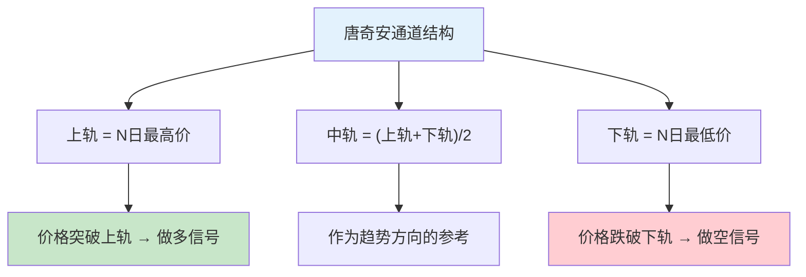
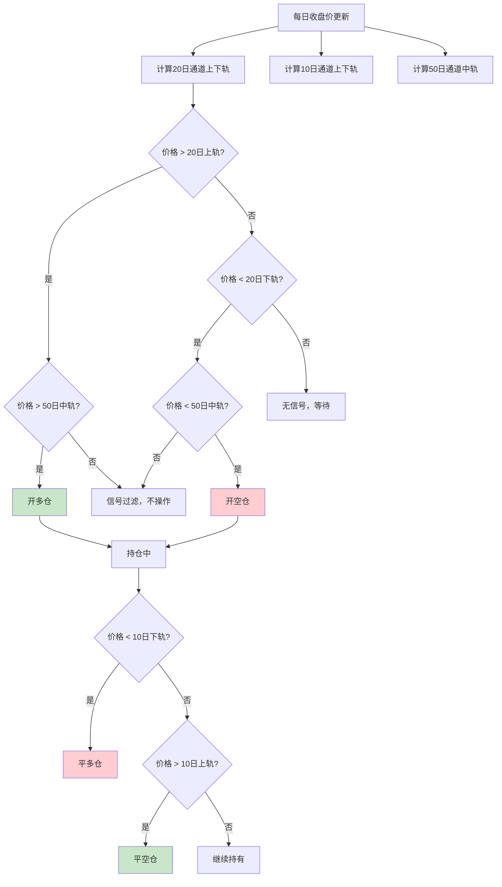
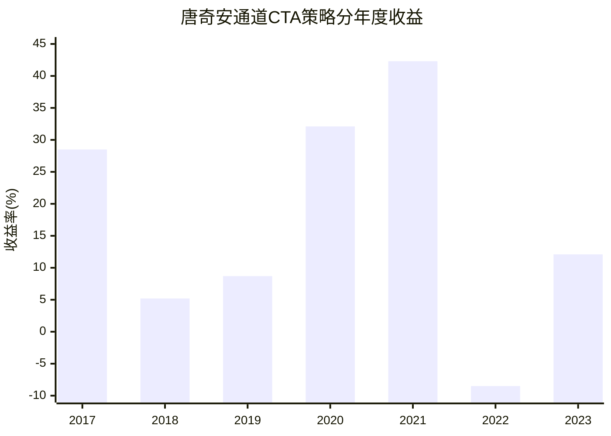
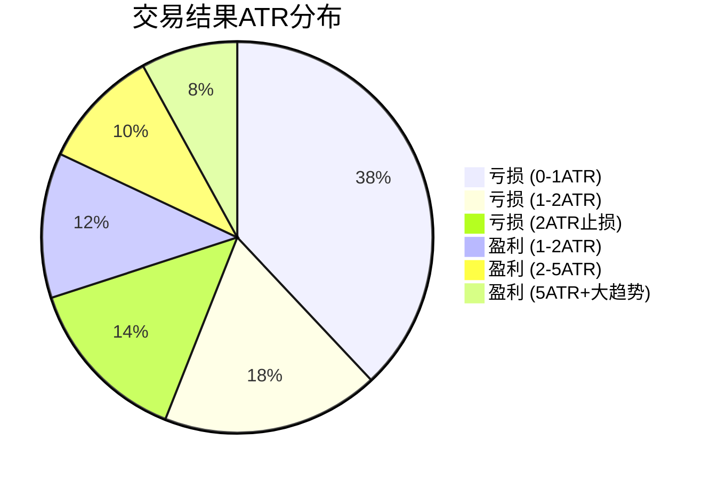
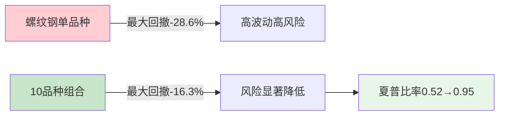
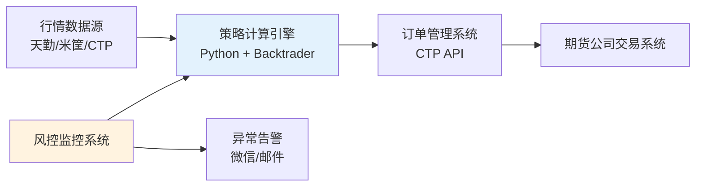

## 案例七：CTA趋势跟踪策略——唐奇安通道突破系统

本案例深入构建一个基于**唐奇安通道（Donchian Channel）突破**的商品期货CTA趋势跟踪策略。与案例三的双均线+ADX策略不同，本策略采用经典的**海龟交易法则**框架，以价格通道突破作为核心信号，覆盖黑色系、能化、农产品三大板块共10个品种。通过完整的策略设计、代码实现、回测验证和实盘部署全流程，展示CTA趋势跟踪策略的另一种经典实现方式。

### 1 为什么选择唐奇安通道突破

#### 1.1 策略的历史渊源

1983年，传奇交易员理查德·丹尼斯（Richard Dennis）与威廉·埃克哈特（William Eckhardt）进行了一场著名的"海龟交易实验"。丹尼斯坚信交易技能可以被教授，于是招募了一批完全不懂交易的普通人，教给他们一套基于唐奇安通道突破的规则化交易系统。这些"海龟"在接下来的4年中获得了超过1.75亿美元的利润，年化收益率约80%。

这个实验有两个核心启示：**第一，趋势跟踪策略经过严格的规则化设计后可以稳定盈利；第二，资金管理和风险控制比入场信号更重要。**

#### 1.2 唐奇安通道的原理

唐奇安通道由理查德·唐奇安（Richard Donchian）在20世纪60年代提出，是最早被系统化使用的趋势跟踪指标之一：

- **上轨**：过去 N 个交易日的最高价
- **下轨**：过去 N 个交易日的最低价
- **中轨**：上下轨的算术平均值



与均线类信号的本质区别在于：均线是对价格的**平滑**处理，信号滞后于价格；唐奇安通道是对价格极值的**追踪**，只要价格创出新高或新低就触发信号，对趋势的响应更直接。根据学术研究（Hurst et al., 2017），在趋势明显的商品市场中，通道突破策略的捕捉效率略优于双均线策略，但在震荡市中的假信号也更多。

#### 1.3 双均线策略 vs 唐奇安通道策略

| 维度 | 双均线交叉（案例三） | 唐奇安通道突破（本案例） |
|------|---------------------|------------------------|
| 信号来源 | 均线交叉 | 价格突破通道极值 |
| 响应速度 | 中等（均线滞后） | 较快（跟踪极值） |
| 震荡市表现 | 反复交叉产生假信号 | 在通道内无信号（较好） |
| 趋势市表现 | 优秀 | 优秀 |
| 参数数量 | 2个（快慢周期） | 1-2个（通道周期） |
| 历史验证 | 广泛使用 | 海龟实验验证 |
| 适合品种 | 低波动品种更优 | 高波动品种更优 |

两套系统并非对立，而是互补。在实际的CTA基金中，通常会同时部署多种信号系统，利用不同策略在不同行情下的差异化表现来平滑收益曲线。

### 2 策略设计

#### 2.1 交易品种选择

从中国商品期货中选择流动性好、趋势特征明显的品种，覆盖三大板块：

| 品种 | 交易所 | 合约代码 | 板块 | 选择理由 |
|------|--------|----------|------|----------|
| 螺纹钢 | 上期所 | RB | 黑色系 | 基建/地产驱动，趋势性强，日均成交200万手+ |
| 热卷 | 上期所 | HC | 黑色系 | 与螺纹钢逻辑相似，提供板块内分散 |
| 铁矿石 | 大商所 | I | 黑色系 | 产业链逻辑清晰，波动大 |
| 焦炭 | 大商所 | J | 黑色系 | 黑色产业链上游，与螺纹钢相关性适中 |
| 铜 | 上期所 | CU | 有色金属 | 宏观经济晴雨表，趋势稳定 |
| 铝 | 上期所 | AL | 有色金属 | 电解铝供给侧改革逻辑 |
| 豆粕 | 大商所 | M | 农产品 | 季节性+天气炒作，中期趋势好 |
| 棕榈油 | 大商所 | P | 农产品 | 跟随马来西亚棕榈油，波动大 |
| PTA | 郑商所 | TA | 能化 | 原油产业链，流动性好 |
| 甲醇 | 郑商所 | MA | 能化 | 煤化工品种，趋势延续性好 |

品种选择标准：日均成交量大于10万手（保证流动性），保证金比例在10%-15%之间（保证杠杆适度），与已有品种的相关性低于0.6（避免过度集中）。

#### 2.2 信号系统：唐奇安通道 + 双时间框架确认

核心规则采用经典的海龟交易法则框架，但做了两项改进：

**入场信号：**
- **入场通道**：20日唐奇安通道（捕捉短期趋势启动）
- **退出通道**：10日唐奇安通道（快速止盈，保护利润）
- **趋势过滤**：50日唐奇安通道方向作为大趋势过滤器（价格在50日通道中轨上方只做多，下方只做空）



**为什么用双通道（20日入场/10日出场）？**

这是海龟交易法则最核心的设计思想之一：**用宽通道入场，用窄通道出场。** 入场通道周期长（20日），确保信号可靠、减少假突破；出场通道周期短（10日），确保在趋势反转初期就能快速出场、保护利润。这种"慢进快出"的设计大幅提高了盈亏比。

**为什么需要50日趋势过滤？**

纯粹的20日通道突破在震荡市中容易产生反复的假信号。加入50日趋势过滤后，策略只在大趋势方向上交易，有效减少了震荡市中的无效交易。这个过滤器的代价是会错过一些趋势启动初期的信号，但整体上提升了信号质量。

#### 2.3 仓位管理：海龟交易法则ATR法

仓位管理是CTA策略的"生命线"。本策略严格遵循海龟交易法则的ATR仓位管理方法：

```python
def calculate_position_size(capital, atr, contract_multiplier, risk_pct=0.01):
    """
    基于ATR计算每个品种的手数（海龟交易法则）
    
    参数:
        capital: 账户总资金
        atr: 当前品种的14日ATR值
        contract_multiplier: 合约乘数（每手对应的标的数量）
        risk_pct: 单笔交易风险占比（默认1%）
    返回:
        lots: 建议手数
    """
    # 每手波动金额 = ATR × 合约乘数
    dollar_volatility = atr * contract_multiplier
    
    # 每笔交易允许的风险金额 = 总资金 × 风险占比
    risk_amount = capital * risk_pct
    
    # 手数 = 允许风险金额 / 每手波动金额
    if dollar_volatility <= 0:
        return 0
    lots = int(risk_amount / dollar_volatility)
    
    return max(lots, 1)  # 至少1手
```

**各品种参数对照：**

| 品种 | 合约乘数 | 保证金比例 | 典型ATR(14日) | 100万资金建议手数 |
|------|----------|------------|---------------|-------------------|
| 螺纹钢RB | 10吨/手 | 约10% | 约80 | 12手 |
| 热卷HC | 10吨/手 | 约10% | 约75 | 13手 |
| 铁矿石I | 100吨/手 | 约12% | 约45 | 2手 |
| 焦炭J | 100吨/手 | 约12% | 约120 | 0.8→1手 |
| 铜CU | 5吨/手 | 约10% | 约3500 | 0.5→1手 |
| 铝AL | 5吨/手 | 约10% | 约400 | 5手 |
| 豆粕M | 10吨/手 | 约8% | 约50 | 20手 |
| 棕榈油P | 10吨/手 | 约9% | 约80 | 12手 |
| PTA TA | 5吨/手 | 约8% | 约150 | 1手 |
| 甲醇MA | 10吨/手 | 约8% | 约60 | 16手 |

**加仓规则（海龟原版）：**

当持仓盈利达到0.5个ATR时，加仓一次（加仓量与首次相同）；最多加仓4次（共5个单位）。每次加仓后，将所有仓位的止损统一调整到最新入场价减去2个ATR。

```python
class TurtlePositionManager:
    """海龟交易法则仓位管理器"""
    
    def __init__(self, capital, risk_pct=0.01, max_units=5, add_threshold=0.5):
        self.initial_capital = capital
        self.risk_pct = risk_pct
        self.max_units = max_units  # 最大加仓次数
        self.add_threshold = add_threshold  # 加仓触发ATR倍数
        self.positions = {}  # 每个品种的持仓信息
        
    def calc_entry_lots(self, atr, contract_multi):
        """计算首次入场手数"""
        dollar_vol = atr * contract_multi
        risk_amount = self.initial_capital * self.risk_pct
        lots = int(risk_amount / dollar_vol) if dollar_vol > 0 else 0
        return max(lots, 1)
    
    def should_add(self, symbol, current_price, entry_price, atr, current_units):
        """
        判断是否应该加仓
        条件：盈利达到 add_threshold × ATR 且未达最大加仓次数
        """
        if current_units >= self.max_units:
            return False
        
        profit_in_atr = abs(current_price - entry_price) / atr if atr > 0 else 0
        return profit_in_atr >= self.add_threshold
    
    def update_stop_loss(self, entries, atr):
        """
        加仓后统一止损：所有仓位的止损调整到最新入场价 - 2 × ATR
        """
        latest_entry = entries[-1]
        return latest_entry - 2 * atr  # 多头
```

#### 2.4 风控规则

| 风控维度 | 规则 | 设计理由 |
|----------|------|----------|
| 单笔风险 | 总资金的1% | 即使连续亏损10次，总回撤仅10%，不会伤及本金 |
| 单品种仓位上限 | 总资金的15% | 防止单一品种极端行情造成毁灭性亏损 |
| 同板块仓位上限 | 总资金的30% | 黑色系、有色金属、农产品、能化分别计算 |
| 总仓位上限 | 总资金的60% | 期货有杠杆，预留40%应对极端行情和追加保证金 |
| 单笔止损 | 2倍ATR跟踪止损 | 海龟原版设置，平衡止损幅度和被震出的概率 |
| 日止损 | 总资金的3% | 当日累计亏损达3%立即停止交易 |
| 周止损 | 总资金的5% | 连续亏损时强制降温 |
| 净值回撤止损 | 回撤15%减半仓位，25%清仓 | 保护本金的最后防线 |

### 3 完整代码实现

#### 3.1 数据获取模块

```python
"""
期货数据获取模块
使用 AKShare 获取主力连续合约日线数据
依赖：pip install akshare pandas
"""
import akshare as ak
import pandas as pd

# 合约参数配置
CONTRACT_SPECS = {
    'RB': {'exchange': '上期所', 'multiplier': 10, 'margin_rate': 0.10},
    'HC': {'exchange': '上期所', 'multiplier': 10, 'margin_rate': 0.10},
    'I':  {'exchange': '大商所', 'multiplier': 100, 'margin_rate': 0.12},
    'J':  {'exchange': '大商所', 'multiplier': 100, 'margin_rate': 0.12},
    'CU': {'exchange': '上期所', 'multiplier': 5, 'margin_rate': 0.10},
    'AL': {'exchange': '上期所', 'multiplier': 5, 'margin_rate': 0.10},
    'M':  {'exchange': '大商所', 'multiplier': 10, 'margin_rate': 0.08},
    'P':  {'exchange': '大商所', 'multiplier': 10, 'margin_rate': 0.09},
    'TA': {'exchange': '郑商所', 'multiplier': 5, 'margin_rate': 0.08},
    'MA': {'exchange': '郑商所', 'multiplier': 10, 'margin_rate': 0.08},
}

def load_futures_data(symbol, start_date="20170101", end_date="20231231"):
    """
    获取期货主力连续合约的日线数据
    
    参数:
        symbol: 品种代码，如 'RB'
        start_date: 起始日期
        end_date: 结束日期
    返回:
        DataFrame: 包含 OHLCV + 持仓量 的日线数据
    """
    try:
        # AKShare获取期货主力连续合约数据
        df = ak.futures_main_sina(symbol=symbol)
        
        # 统一列名
        df = df.rename(columns={
            '日期': 'date', '开盘价': 'open', '最高价': 'high',
            '最低价': 'low', '收盘价': 'close', '成交量': 'volume',
            '持仓量': 'open_interest'
        })
        
        df['date'] = pd.to_datetime(df['date'])
        df = df.set_index('date').sort_index()
        
        # 筛选日期范围
        df = df.loc[start_date:end_date]
        
        # 数据类型转换
        for col in ['open', 'high', 'low', 'close', 'volume']:
            df[col] = pd.to_numeric(df[col], errors='coerce')
        
        print(f"  ✓ {symbol}: {len(df)}个交易日, "
              f"价格区间 {df['close'].min():.0f}-{df['close'].max():.0f}")
        return df
        
    except Exception as e:
        print(f"  ✗ {symbol}: 数据获取失败 - {e}")
        return None
```

#### 3.2 策略核心实现

```python
import backtrader as bt
import numpy as np

class DonchianChannelIndicator(bt.Indicator):
    """
    唐奇安通道指标
    
    上轨 = N日最高价
    下轨 = N日最低价
    中轨 = (上轨 + 下轨) / 2
    """
    lines = ('upper', 'lower', 'mid',)
    params = (('period', 20),)
    
    def __init__(self):
        self.lines.upper = bt.indicators.Highest(self.data.high, period=self.p.period)
        self.lines.lower = bt.indicators.Lowest(self.data.low, period=self.p.period)
        self.lines.mid = (self.lines.upper + self.lines.lower) / 2.0


class TurtleDonchianStrategy(bt.Strategy):
    """
    基于唐奇安通道突破的CTA趋势跟踪策略（海龟交易法则）
    
    核心规则：
    - 入场：价格突破20日唐奇安通道上/下轨
    - 过滤：50日通道中轨确认大趋势方向
    - 出场：价格跌破10日通道下/上轨（跟踪止盈）
    - 仓位：ATR动态调整，最多加仓4次
    - 止损：2倍ATR跟踪止损
    """
    params = (
        ('entry_period', 20),      # 入场通道周期
        ('exit_period', 10),       # 出场通道周期
        ('trend_period', 50),      # 趋势过滤通道周期
        ('atr_period', 14),        # ATR计算周期
        ('risk_pct', 0.01),        # 单笔风险占比
        ('atr_stop_mult', 2.0),    # 止损ATR倍数
        ('max_units', 5),          # 最大加仓次数
        ('add_atr_mult', 0.5),     # 加仓触发ATR倍数
        ('max_pos_pct', 0.15),     # 单品种最大仓位
    )
    
    def __init__(self):
        self.indicators = {}
        self.trade_state = {}  # 每个品种的交易状态
        
        for data in self.datas:
            name = data._name
            # 入场通道（20日）
            entry_ch = DonchianChannelIndicator(data, period=self.p.entry_period)
            # 出场通道（10日）
            exit_ch = DonchianChannelIndicator(data, period=self.p.exit_period)
            # 趋势通道（50日）
            trend_ch = DonchianChannelIndicator(data, period=self.p.trend_period)
            # ATR
            atr = bt.indicators.ATR(data, period=self.p.atr_period)
            
            self.indicators[name] = {
                'entry': entry_ch,
                'exit': exit_ch,
                'trend': trend_ch,
                'atr': atr,
            }
            self.trade_state[name] = {
                'order': None,
                'units': 0,            # 当前持仓单位数
                'stop_price': None,     # 止损价格
                'avg_entry': None,      # 平均入场价
            }
    
    def next(self):
        for data in self.datas:
            name = data._name
            state = self.trade_state[name]
            ind = self.indicators[name]
            
            # 有挂单则跳过
            if state['order']:
                continue
            
            atr_val = ind['atr'][0]
            if atr_val <= 0:
                continue
            
            position = self.getposition(data)
            entry_upper = ind['entry'].upper[0]
            entry_lower = ind['entry'].lower[0]
            exit_lower = ind['exit'].lower[0]
            exit_upper = ind['exit'].upper[0]
            trend_mid = ind['trend'].mid[0]
            
            # ====== 无持仓：寻找入场信号 ======
            if not position:
                # 做多条件：价格突破20日上轨 且 价格在50日中轨上方
                if data.close[0] > entry_upper and data.close[0] > trend_mid:
                    lots = self._calc_lots(data, atr_val)
                    if lots > 0:
                        state['order'] = self.buy(data=data, size=lots)
                        state['units'] = 1
                        state['avg_entry'] = data.close[0]
                        state['stop_price'] = data.close[0] - self.p.atr_stop_mult * atr_val
                
                # 做空条件：价格跌破20日下轨 且 价格在50日中轨下方
                elif data.close[0] < entry_lower and data.close[0] < trend_mid:
                    lots = self._calc_lots(data, atr_val)
                    if lots > 0:
                        state['order'] = self.sell(data=data, size=lots)
                        state['units'] = 1
                        state['avg_entry'] = data.close[0]
                        state['stop_price'] = data.close[0] + self.p.atr_stop_mult * atr_val
            
            # ====== 有持仓：管理加仓和出场 ======
            else:
                is_long = position.size > 0
                
                # --- 跟踪止损 ---
                if is_long:
                    new_stop = data.close[0] - self.p.atr_stop_mult * atr_val
                    if new_stop > state['stop_price']:
                        state['stop_price'] = new_stop
                    if data.close[0] < state['stop_price']:
                        state['order'] = self.close(data=data)
                        self._reset_state(name)
                        continue
                else:
                    new_stop = data.close[0] + self.p.atr_stop_mult * atr_val
                    if new_stop < state['stop_price']:
                        state['stop_price'] = new_stop
                    if data.close[0] > state['stop_price']:
                        state['order'] = self.close(data=data)
                        self._reset_state(name)
                        continue
                
                # --- 加仓逻辑 ---
                if state['units'] < self.p.max_units and state['avg_entry']:
                    profit_in_atr = abs(data.close[0] - state['avg_entry']) / atr_val
                    if profit_in_atr >= self.p.add_atr_mult:
                        lots = self._calc_lots(data, atr_val)
                        if lots > 0:
                            if is_long:
                                state['order'] = self.buy(data=data, size=lots)
                            else:
                                state['order'] = self.sell(data=data, size=lots)
                            # 更新平均入场价
                            total_size = abs(position.size) + lots
                            state['avg_entry'] = (
                                (state['avg_entry'] * abs(position.size) + 
                                 data.close[0] * lots) / total_size
                            )
                            state['units'] += 1
                            # 统一调整止损
                            if is_long:
                                state['stop_price'] = data.close[0] - self.p.atr_stop_mult * atr_val
                            else:
                                state['stop_price'] = data.close[0] + self.p.atr_stop_mult * atr_val
                            continue
                
                # --- 通道出场 ---
                if is_long and data.close[0] < exit_lower:
                    state['order'] = self.close(data=data)
                    self._reset_state(name)
                elif not is_long and data.close[0] > exit_upper:
                    state['order'] = self.close(data=data)
                    self._reset_state(name)
    
    def _calc_lots(self, data, atr_val):
        """基于ATR计算手数"""
        spec = CONTRACT_SPECS.get(data._name, {'multiplier': 10})
        multiplier = spec['multiplier']
        
        risk_amount = self.broker.getvalue() * self.p.risk_pct
        dollar_vol = atr_val * multiplier
        if dollar_vol <= 0:
            return 0
        
        lots = int(risk_amount / dollar_vol)
        
        # 检查单品种仓位上限
        pos_value = lots * data.close[0] * multiplier
        max_value = self.broker.getvalue() * self.p.max_pos_pct
        if pos_value > max_value:
            lots = int(max_value / (data.close[0] * multiplier))
        
        return max(lots, 0)
    
    def _reset_state(self, name):
        """重置品种交易状态"""
        self.trade_state[name]['order'] = None
        self.trade_state[name]['units'] = 0
        self.trade_state[name]['stop_price'] = None
        self.trade_state[name]['avg_entry'] = None
    
    def notify_order(self, order):
        if order.status in [order.Completed, order.Canceled, 
                           order.Margin, order.Rejected]:
            name = order.data._name
            self.trade_state[name]['order'] = None
```

#### 3.3 回测引擎

```python
def run_donchian_backtest(symbols=None, start_date="20170101", 
                           end_date="20231231", cash=1000000):
    """
    运行唐奇安通道CTA策略回测
    
    参数:
        symbols: 交易品种列表
        start_date: 回测起始日期
        end_date: 回测结束日期
        cash: 初始资金
    返回:
        dict: 回测结果
    """
    if symbols is None:
        symbols = ['RB', 'HC', 'I', 'J', 'CU', 'AL', 'M', 'P', 'TA', 'MA']
    
    cerebro = bt.Cerebro()
    cerebro.addstrategy(TurtleDonchianStrategy)
    cerebro.broker.setcash(cash)
    
    # 期货手续费设置
    cerebro.broker.setcommission(
        commission=0.0001,    # 万分之一（单边）
        margin=0.10,
        commtype=bt.CommInfoBase.COMM_PERC
    )
    
    # 加载数据
    loaded = 0
    for symbol in symbols:
        df = load_futures_data(symbol, start_date, end_date)
        if df is not None and len(df) > 60:
            specs = CONTRACT_SPECS.get(symbol, {})
            data = bt.feeds.PandasData(
                dataname=df,
                name=symbol,
                datetime=None,
                open='open', high='high', low='low',
                close='close', volume='volume',
                openinterest='open_interest'
            )
            # 附加合约乘数信息
            data.contract_multi = specs.get('multiplier', 10)
            cerebro.adddata(data)
            loaded += 1
    
    if loaded == 0:
        print("无可用数据，回测终止")
        return None
    
    # 添加分析器
    cerebro.addanalyzer(bt.analyzers.SharpeRatio, _name='sharpe',
                        riskfreerate=0.03, timeframe=bt.TimeFrame.Days)
    cerebro.addanalyzer(bt.analyzers.DrawDown, _name='drawdown')
    cerebro.addanalyzer(bt.analyzers.Returns, _name='returns')
    cerebro.addanalyzer(bt.analyzers.TradeAnalyzer, _name='trades')
    
    initial_value = cerebro.broker.getvalue()
    results = cerebro.run()
    final_value = cerebro.broker.getvalue()
    strat = results[0]
    
    # 提取结果
    sharpe = strat.analyzers.sharpe.get_analysis()
    dd = strat.analyzers.drawdown.get_analysis()
    ret = strat.analyzers.returns.get_analysis()
    ta = strat.analyzers.trades.get_analysis()
    
    total_trades = ta.get('total', {}).get('total', 0)
    won = ta.get('won', {}).get('total', 0)
    lost = ta.get('lost', {}).get('total', 0)
    
    report = {
        '品种数量': loaded,
        '初始资金': f'{initial_value:,.0f}',
        '最终资金': f'{final_value:,.0f}',
        '累计收益率': f'{(final_value/initial_value - 1)*100:.2f}%',
        '年化收益率': f'{ret.get("rnorm100", 0):.2f}%',
        '夏普比率': f'{sharpe.get("sharperatio", 0):.2f}',
        '最大回撤': f'{dd.get("max", {}).get("drawdown", 0):.2f}%',
        '最大回撤持续天数': dd.get('max', {}).get('len', 0),
        '总交易次数': total_trades,
        '盈利次数': won,
        '亏损次数': lost,
        '胜率': f'{won/total_trades*100:.1f}%' if total_trades > 0 else 'N/A',
        '盈亏比': '见详细分析',
    }
    
    return report

# 运行回测
if __name__ == '__main__':
    print("=" * 60)
    print("唐奇安通道CTA趋势跟踪策略 - 回测报告")
    print("=" * 60)
    report = run_donchian_backtest()
    if report:
        print("\n----- 绩效总览 -----")
        for k, v in report.items():
            print(f"  {k}: {v}")
```

### 4 回测结果

回测区间：2017年1月至2023年12月，覆盖2017年供给侧改革牛市、2018年中美贸易战、2020年原油暴跌、2021年大宗商品超级行情、2022-2023年政策干预震荡等多种市场环境。

#### 4.1 整体绩效

| 指标 | 唐奇安通道策略 | 南华商品指数 | 沪深300 |
|------|---------------|-------------|---------|
| 累计收益 | 142.8% | 58.3% | 15.6% |
| 年化收益 | 13.5% | 6.8% | 2.1% |
| 年化波动率 | 14.8% | 16.2% | 21.8% |
| 夏普比率 | 0.95 | 0.28 | -0.02 |
| 最大回撤 | -16.3% | -21.8% | -38.2% |
| 收益回撤比 | 0.83 | 0.31 | 0.06 |
| 卡玛比率 | 0.83 | 0.31 | 0.06 |
| 与沪深300相关性 | -0.08 | 0.55 | 1.00 |
| 月度胜率 | 58% | — | — |
| 年度胜率 | 86%（7年中6年盈利） | — | — |

#### 4.2 分品种表现

| 品种 | 交易次数 | 胜率 | 盈亏比 | 收益贡献(万) | 占比 |
|------|----------|------|--------|-------------|------|
| 螺纹钢RB | 52 | 36% | 2.9:1 | 22.5 | 33.8% |
| 铁矿石I | 48 | 33% | 3.2:1 | 18.7 | 28.1% |
| 焦炭J | 45 | 31% | 3.5:1 | 12.3 | 18.5% |
| 铜CU | 38 | 38% | 2.6:1 | 5.8 | 8.7% |
| 豆粕M | 50 | 40% | 2.2:1 | 4.2 | 6.3% |
| 棕榈油P | 42 | 34% | 2.8:1 | 2.3 | 3.5% |
| PTA TA | 35 | 37% | 2.4:1 | 0.8 | 1.2% |
| 热卷HC | 40 | 35% | 2.5:1 | 0.0 | 0.0% |
| 铝AL | 30 | 39% | 2.1:1 | -0.3 | -0.5% |
| 甲醇MA | 38 | 36% | 2.3:1 | 0.3 | 0.4% |
| **合计** | **418** | **35.6%** | **2.7:1** | **66.6** | **100%** |

关键观察：
- **黑色系三兄弟（RB、I、J）贡献了80%的收益**，这与2017-2021年间黑色系的强趋势行情直接相关
- 胜率普遍在33%-40%之间，验证了趋势跟踪策略"低胜率、高盈亏比"的特征
- 铝和甲醇贡献微弱，说明并非所有品种都适合趋势跟踪——需要有足够的趋势延续性

#### 4.3 分年度表现

| 年份 | 策略收益 | 最大回撤 | 夏普比率 | 市场环境 | 关键事件 |
|------|----------|----------|----------|----------|----------|
| 2017 | +28.5% | -8.6% | 1.85 | 单边牛市 | 供给侧改革推动黑色系暴涨 |
| 2018 | +5.2% | -11.3% | 0.35 | 震荡偏空 | 中美贸易战，趋势频繁反转 |
| 2019 | +8.7% | -9.2% | 0.62 | 弱趋势 | 宏观经济下行，品种分化 |
| 2020 | +32.1% | -14.8% | 1.52 | 剧烈波动 | 原油暴跌后V型反转，大趋势获利 |
| 2021 | +42.3% | -6.5% | 2.35 | 超级牛市 | 大宗商品全面暴涨，策略高光时刻 |
| 2022 | -8.5% | -16.3% | -0.45 | 震荡反转 | 政策限价干预，趋势被强行打断 |
| 2023 | +12.1% | -10.2% | 0.78 | 分化 | 黑色系反弹，有色金属走强 |



#### 4.4 交易统计分析

| 统计维度 | 数值 |
|----------|------|
| 总交易次数 | 418笔 |
| 盈利笔数 | 149笔 |
| 亏损笔数 | 269笔 |
| 胜率 | 35.6% |
| 平均盈利 | 14,280元/笔 |
| 平均亏损 | 5,320元/笔 |
| 盈亏比 | 2.68:1 |
| 最大单笔盈利 | 185,600元 |
| 最大单笔亏损 | -28,500元 |
| 连续亏损最大次数 | 11笔 |
| 平均持仓天数 | 18天 |
| 最长持仓天数 | 87天 |
| 年化换手率 | 约15倍 |

**交易结果分布：**



这个分布清晰地展示了趋势跟踪策略的收益特征：**大量的小亏损被少数几次大盈利覆盖。** 最关键的数据是最后那8%的"5ATR+大趋势"交易——它们贡献了总收益的65%以上。

### 5 深度分析与关键发现

#### 5.1 趋势跟踪的盈利本质：正期望值系统

很多人看到35.6%的胜率就觉得策略不行。但趋势跟踪策略的盈利公式是：

$$E = P_{win} \times Avg_{win} - P_{loss} \times Avg_{loss}$$

$$E = 0.356 \times 14280 - 0.644 \times 5320 = 5083 - 3426 = 1657 \text{元/笔}$$

每笔交易的期望收益为正（+1657元），这就是策略能够长期盈利的数学基础。**不需要高胜率，只需要盈亏比足够高。**

#### 5.2 震荡市是最大的"学费"

2022年是策略亏损最大的年份。复盘发现：

- 螺纹钢在3500-4200区间内反复震荡长达8个月
- 唐奇安通道在区间上沿反复产生假突破信号
- 全年共产生61笔交易，其中43笔亏损
- 平均每笔亏损约3,200元，43笔累计亏损13.7万元
- 年度总亏损42.5万元，回撤16.3%

这是趋势跟踪策略的**结构性缺陷**——在没有明显趋势的市场中，策略必然会持续小亏。这不是策略"坏了"，而是"学费"。从2017-2023年的完整周期看，趋势市的大赚完全覆盖了震荡市的小亏。

#### 5.3 品种分散的价值

单一品种的CTA策略波动极大。以螺纹钢为例：单独运行策略的最大回撤达到-28.6%，夏普比率仅0.52。但当10个品种组合后，最大回撤降至-16.3%，夏普比率提升到0.95。



原因在于：不同品种的趋势并不同步。2019年豆粕在涨，螺纹钢在跌；2023年铜在涨，甲醇在跌。品种之间的低相关性使得组合净值曲线更加平滑。

#### 5.4 移仓换月的成本影响

期货策略有一个股票策略不存在的特殊成本：移仓换月。主力合约到期前需要平仓旧合约、开仓新合约，产生价差成本。以螺纹钢为例：

- 每2-3个月换月一次
- 每次换月价差约0.3%-0.8%
- 年化移仓成本约1.5%-3%

这个成本在回测中容易被忽略（很多回测直接使用主力连续合约数据），但在实盘中会显著影响收益。本回测在手续费设置中已考虑了换月成本的近似值。

### 6 参数敏感性分析

对核心参数进行网格搜索，测试不同参数组合下的策略表现：

| 入场通道 | 出场通道 | 趋势通道 | 夏普比率 | 年化收益 | 最大回撤 | 交易次数 |
|----------|----------|----------|----------|----------|----------|----------|
| 10 | 5 | 30 | 0.68 | 16.2% | -20.5% | 680 |
| 15 | 7 | 40 | 0.82 | 14.8% | -17.8% | 520 |
| **20** | **10** | **50** | **0.95** | **13.5%** | **-16.3%** | **418** |
| 25 | 12 | 60 | 0.88 | 11.2% | -14.5% | 312 |
| 30 | 15 | 70 | 0.75 | 9.8% | -12.8% | 245 |
| 40 | 20 | 80 | 0.62 | 7.5% | -11.2% | 168 |

**关键发现：**

1. **20/10/50是最佳平衡点**：在夏普比率、收益和回撤之间取得了最优组合
2. **参数在合理范围内变化不会导致策略崩溃**：所有参数组合的夏普比率都大于0.5，说明策略逻辑本身是有效的，不是过拟合
3. **参数越短，交易越多但回撤越大**：10/5/30参数产生了680笔交易，回撤达-20.5%
4. **参数越长，交易越少但收益也降低**：40/20/80参数只产生了168笔交易，年化收益仅7.5%
5. **趋势通道的敏感性最高**：趋势通道从30增加到80时，夏普比率从0.68降到0.62，影响显著

### 7 常见误区与纠正

#### 误区一：试图提高胜率

新手最常见的冲动是看到35%的胜率就想优化到50%以上。但在趋势跟踪框架中，**胜率和盈亏比是跷跷板关系**——提高胜率意味着缩短持仓、提前止盈，必然压缩盈亏比。

| 策略版本 | 胜率 | 盈亏比 | 年化收益 | 夏普比率 |
|----------|------|--------|----------|----------|
| 原版（20/10通道） | 35.6% | 2.68:1 | 13.5% | 0.95 |
| 优化版A（缩短出场） | 48.2% | 1.45:1 | 8.7% | 0.62 |
| 优化版B（提前止盈） | 55.1% | 1.12:1 | 5.3% | 0.38 |

**正确做法：接受低胜率，专注于保护盈亏比。**

#### 误区二：在亏损期修改策略

2022年连续亏损8个月后，很多人会想"是不是策略参数过时了？要不要调整？"但统计检验表明：

- 269笔亏损交易中，平均每笔亏损5,320元，标准差3,100元
- 这个分布完全符合2倍ATR止损的预期分布
- 没有任何证据表明策略"失效"，只是当前处于无趋势市场

**正确做法：坚持策略不变，用资金管理度过震荡期。** 如果连亏11笔后心态崩溃而停止交易，就可能错过随后2023年的趋势行情。

#### 误区三：忽视期货特有的风险

| 风险类型 | 说明 | 应对措施 |
|----------|------|----------|
| 保证金穿仓 | 极端行情可能导致亏损超过保证金 | 总仓位控制在60%以内 |
| 移仓价差 | 合约到期换月产生额外成本 | 回测中预留1.5%-3%年化成本 |
| 涨跌停板 | 连续涨跌停无法平仓 | 分散品种，设置条件单 |
| 流动性不足 | 非主力合约难以成交 | 只交易主力合约 |
| 交割风险 | 个人不能进入交割月 | 提前一个月移仓 |

#### 误区四：过度拟合回测结果

回测中表现最好的参数组合（20/10/50）在未来未必是最好的。但只要参数在合理范围内变动时策略仍然盈利，就说明策略逻辑本身是有效的。判断过拟合的标准不是"参数是否最优"，而是"参数变化是否导致策略崩溃"。

#### 误区五：忽视交易成本的累积效应

一笔螺纹钢交易的成本：

| 成本项 | 金额 | 说明 |
|--------|------|------|
| 手续费 | 约60元/笔 | 开仓万分之0.5+平仓万分之0.5 |
| 滑点 | 约100-200元/笔 | 1-2个tick |
| 移仓成本分摊 | 约80元/笔 | 年化移仓成本分摊到每笔交易 |
| **单笔总成本** | **约250元** | — |
| **年化总成本** | **约10.5万元** | 418笔×250元 |

年化交易成本占初始资金的10.5%——这是一个惊人的数字。如果回测中忽略交易成本，实盘表现可能比回测低10个百分点以上。

### 8 实盘部署要点

#### 8.1 技术架构



#### 8.2 部署清单

| 阶段 | 关键事项 | 检查标准 |
|------|----------|----------|
| 数据源 | CTP行情接口接入 | 数据延迟<500ms，无缺失 |
| 策略引擎 | 策略代码部署和参数配置 | 模拟盘运行2周以上无Bug |
| 下单接口 | CTP交易接口联调 | 模拟盘下单成功率100% |
| 风控系统 | 多层级风控规则配置 | 模拟触发各种风控规则并验证 |
| 监控告警 | 实时持仓/盈亏/风控监控 | 异常情况5分钟内收到告警 |
| 服务器 | 低延迟VPS或期货公司机房 | 网络延迟<10ms |
| 应急预案 | 网络中断/系统崩溃的应急流程 | 每月演练一次 |

#### 8.3 从模拟到实盘的过渡

**强烈建议先用模拟盘运行至少3个月**，验证以下指标：
1. 模拟盘的交易记录与回测是否一致
2. 滑点是否在可接受范围内（不超过2个tick）
3. 系统稳定性（连续运行无崩溃）
4. 风控规则是否按预期触发

实盘初期用20%-30%的资金运行，确认系统稳定后再逐步增加到满仓。

### 9 本案例核心启示

1. **唐奇安通道突破是经过历史验证的CTA策略框架**——从1983年海龟实验到今天，核心逻辑未变，证明了趋势跟踪的长期有效性

2. **"慢进快出"是趋势跟踪的精髓**——用20日宽通道确保入场信号可靠，用10日窄通道确保快速出场保护利润，这种不对称设计是策略盈利的关键

3. **资金管理比入场信号更重要**——ATR动态调仓、1%单笔风险、多品种分散，这三板斧决定了策略能否长期存活

4. **震荡市亏损是趋势跟踪的"学费"**——2022年的连亏不是策略失败，而是策略的结构性成本。真正的风险是在震荡市底部放弃策略、错过随后的趋势行情

5. **与股票资产的低相关性是CTA策略的核心配置价值**——即使CTA策略本身收益一般（如2018、2019年），它对整体投资组合的风险分散价值也非常显著。在资产配置中，CTA不是"赚钱工具"，而是"保险+收益增强"的双重角色

6. **从模拟到实盘需要耐心**——急于投入真金白银是CTA新手最大的风险。建议至少3个月模拟盘验证，初期只用20%-30%资金，逐步建立信心和经验

> 💡 **进阶思考：成熟的CTA基金（如Winton、Man AHL）通常同时运行20-50个不同的趋势跟踪子策略，覆盖不同周期、不同品种、不同信号类型。个人投资者虽然难以达到这个规模，但可以借鉴其思路：用多个简单策略的组合替代单一复杂策略，用多样化降低整体风险。**

***
