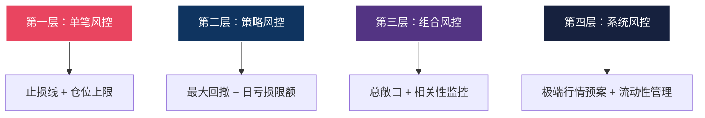

## 案例总结与深度反思

本章通过七个实战案例——A股双均线策略、多因子选股策略、期货CTA趋势跟踪策略、可转债量化策略、量化交易的失败教训、基于机器学习的股票收益预测、ETF轮动策略——完整地展示了量化交易从策略设计到实盘验证的全流程。本节作为全章的收束，不是简单地重复前面的内容，而是从更高的维度对这些案例进行交叉对比、深度反思和体系化总结，帮助读者建立起属于自己的量化交易认知框架。

### 七个案例的全景对比

在深入反思之前，先将七个案例的核心参数放在同一张表中进行横向对比。这种对比能帮助读者直观地看到不同策略之间的差异、适用场景和优劣势，避免"只见树木不见森林"的碎片化理解。

| 维度 | 案例一：双均线 | 案例二：多因子 | 案例三：CTA | 案例四：可转债 | 案例五：失败教训 | 案例六：ML预测 | 案例七：ETF轮动 |
|------|--------------|--------------|------------|--------------|----------------|--------------|----------------|
| **策略类型** | 趋势跟踪 | 截面选股 | 趋势跟踪 | 套利+固收增强 | — | 预测型 | 资产配置 |
| **标的市场** | A股ETF | A股全市场 | 期货 | 可转债 | — | A股 | 全球ETF |
| **核心逻辑** | 均线交叉 | 多因子打分 | 趋势突破 | 转股溢价率 | — | 特征工程+模型 | 动量轮动 |
| **复杂度** | ★☆☆ | ★★☆ | ★★☆ | ★★★ | — | ★★★★ | ★★☆ |
| **年化收益参考** | 8-12% | 15-25% | 10-20% | 12-18% | — | 不稳定 | 10-15% |
| **最大回撤** | 15-25% | 20-35% | 15-30% | 10-20% | — | 可能很大 | 12-20% |
| **换手率** | 低 | 中 | 高 | 中 | — | 高 | 低 |
| **适合阶段** | 入门 | 进阶 | 进阶 | 高级 | 所有阶段 | 专业 | 进阶 |
| **核心风险** | 震荡市反复止损 | 因子失效 | 极端行情反转 | 信用风险 | 认知偏差 | 过拟合 | 相关性突变 |

这张表格揭示了一个重要规律：**没有"最好"的策略，只有"最合适"的策略**。策略的选择取决于投资者的风险偏好、资金规模、技术能力和市场环境。入门者从双均线开始是正确的——它足够简单，能帮助理解量化交易的基本逻辑；但不能止步于此，必须逐步拓展到更复杂的策略类型。

### 从案例中提炼的核心规律

#### 规律一：策略越简单，鲁棒性越强

七个案例中，双均线策略（案例一）和ETF轮动策略（案例七）的逻辑最简单，但它们在不同市场环境下的表现也最稳定。这不是巧合——简单策略依赖的核心假设更少，在假设不成立时受到的冲击也更小。

具体而言，双均线策略只依赖一个假设：价格趋势具有惯性。这个假设在大多数市场环境下都成立，只是在震荡市中表现不佳。而机器学习策略（案例六）可能依赖数十个特征，每个特征的有效性都会随时间变化，任何一个特征的失效都可能导致整个模型崩溃。


**实践启示**：当你设计一个新策略时，先问自己："这个策略依赖哪些假设？这些假设在什么条件下会不成立？"如果一个策略依赖5个假设，每个假设在80%的时间成立，那么所有假设同时成立的概率只有 0.8⁵ ≈ 32.8%。这就是为什么复杂策略在回测中看起来很好，但实盘中经常表现不佳。

#### 规律二：回测收益和实盘收益之间存在系统性差距

七个案例反复验证了一个残酷的事实：**回测收益几乎总是高于实盘收益**。这种差距不是偶然的，而是由一系列系统性因素造成的。

| 差距来源 | 影响程度 | 应对方法 |
|----------|----------|----------|
| **滑点成本** | 年化1-3% | 使用限价单、选择流动性好的标的 |
| **冲击成本** | 小资金影响小，大资金显著 | 控制单笔交易占日均成交量的比例 |
| **幸存者偏差** | 可能高估收益5-15% | 使用包含退市股票的全样本数据 |
| **前视偏差** | 可能严重高估 | 严格使用T日数据生成T+1日信号 |
| **过度拟合** | 可能使收益归零 | 样本外测试、交叉验证、参数稳定性分析 |
| **市场环境变化** | 不可预测 | 定期评估策略有效性，准备失效预案 |

一个经验法则：**将回测年化收益打七折，大概率接近实盘表现**。如果打完七折后收益仍然令人满意，这个策略才值得实盘验证。如果打完七折后收益低于无风险利率，说明这个策略很可能存在过度拟合或回测方法问题。

#### 规律三：风控决定生死，收益决定生活质量

案例五（量化交易的失败教训）深刻地说明了一个道理：在量化交易中，风控不是"锦上添花"的附加项，而是"生死攸关"的基础设施。一个没有完善风控的量化系统，就像一辆没有刹车的跑车——速度越快，死得越惨。

从七个案例中提取的风控核心原则：

1. **单笔止损不可省略**：任何一笔交易的最大亏损不应超过总资金的2%。这不是保守，而是数学——如果你单笔亏损2%，连续亏损10次也只损失18.3%（1 - 0.98¹⁰），还有翻身的机会。但如果单笔亏损10%，连续亏损10次就只剩 0.9¹⁰ = 34.9%的本金，需要翻近两倍才能回本。

2. **组合层面的风控更重要**：单笔止损只是第一道防线。还需要考虑：策略之间是否有相关性？同时运行的策略总敞口是多少？极端行情下所有策略是否可能同时亏损？

3. **风控必须自动化**：人工风控在关键时刻往往失效——因为关键时刻通常伴随着极端情绪（恐惧或贪婪）。风控规则必须写入代码，由系统自动执行，不给人为干预留空间。

```python
# 风控层级示例：从单笔到组合的完整风控体系
class RiskManager:
    def __init__(self, total_capital):
        self.total_capital = total_capital
        self.max_single_loss = 0.02       # 单笔最大亏损2%
        self.max_daily_loss = 0.05        # 日最大亏损5%
        self.max_drawdown = 0.15          # 最大回撤15%
        self.peak_capital = total_capital
        self.daily_pnl = 0
        
    def check_single_trade(self, entry_price, stop_loss, quantity):
        """单笔交易风控检查"""
        loss_per_share = abs(entry_price - stop_loss)
        total_loss = loss_per_share * quantity
        if total_loss > self.total_capital * self.max_single_loss:
            # 自动缩小仓位，使单笔亏损不超过2%
            max_quantity = int(
                self.total_capital * self.max_single_loss / loss_per_share
            )
            return False, max_quantity
        return True, quantity
    
    def check_daily_limit(self, current_pnl):
        """日内亏损限额检查"""
        self.daily_pnl = current_pnl
        if abs(current_pnl) > self.total_capital * self.max_daily_loss:
            return False  # 触发日内熔断，停止交易
        return True
    
    def check_drawdown(self, current_capital):
        """最大回撤检查"""
        self.peak_capital = max(self.peak_capital, current_capital)
        drawdown = (self.peak_capital - current_capital) / self.peak_capital
        if drawdown > self.max_drawdown:
            return False  # 触发回撤熔断，全面清仓
        return True
    
    def should_trade(self, current_capital, current_pnl):
        """综合风控判断"""
        return (
            self.check_daily_limit(current_pnl) and
            self.check_drawdown(current_capital)
        )
```

#### 规律四：因子选择决定了策略的天花板

案例二（多因子选股）和案例六（机器学习预测）共同揭示了一个关键认知：**因子的质量决定了策略收益的上限，而交易系统只是在不突破上限的前提下尽量逼近它**。

用一个比喻来说明：如果因子是"矿藏"，那么交易系统就是"采矿设备"。再先进的设备，如果矿藏贫瘠，也挖不出多少矿石。反之，即使设备一般，如果矿藏丰富，也能获得不错的产出。

在量化交易中，真正有价值的因子（即Alpha因子）需要满足三个条件：

1. **有经济学解释**：因子与收益之间的关系不是随机的，而是有合理的因果逻辑。例如，小市值因子有效是因为小公司面临更大的不确定性，投资者要求更高的风险补偿。没有经济学解释的因子很可能是数据挖掘的产物。

2. **在不同时间段都有效**：如果一个因子只在2019-2020年有效，但在2017-2018年和2021-2022年都无效，那么它很可能只是噪声。真正有效的因子应该在至少两个完整的牛熊周期中都能产生正向收益。

3. **因子收益有合理的衰减速度**：如果一个因子的收益突然大幅下降，说明市场已经发现了这个规律并进行了套利，因子失效了。好的因子应该有一个可预测的衰减曲线，让投资者有时间调整策略。

### 量化交易成功的核心要素模型

综合七个案例的经验教训，可以用一个公式来概括量化交易成功的要素：

```text
成功 = 正确的逻辑 × 严格的执行 × 科学的风控 × 持续的迭代

其中任何一个为零，结果都为零。
```

这四个要素不是并列关系，而是乘法关系——任何一个要素的缺失都会导致整个系统的崩溃。

#### 要素一：正确的逻辑——策略的"道"

正确的逻辑意味着你的策略有清晰的经济学解释，超额收益的来源是明确的，而不是数据挖掘的巧合。

**检验标准**：你能否用三句话向一个非专业人士解释你的策略为什么能赚钱？如果不能，说明你自己可能也没有真正理解策略的盈利逻辑。

**具体要求**：
- 策略有明确的Alpha来源（如动量效应、价值回归、信息不对称）
- 策略在不同市场环境下有合理的预期（牛市怎样、熊市怎样、震荡市怎样）
- 策略的核心假设经过了独立验证（不是你自己的循环论证）

#### 要素二：严格的执行——策略的"法"

量化交易的优势在于纪律性，但如果交易者频繁手动干预，这个优势就荡然无存。

**常见的人为干预陷阱**：
- "这次行情不一样，我要手动止损"——结果错过了反弹
- "策略信号说该买，但我感觉还会跌"——结果错过了上涨
- "昨天亏了，今天我要加大仓位扳回来"——结果亏得更多

**解决方案**：将策略完全自动化，从信号生成到下单执行全部由程序完成。如果你必须手动执行（比如小资金无法接入API），至少要制定严格的执行清单，每次交易前对照检查。

#### 要素三：科学的风控——策略的"术"

风控的核心思想是：**先保证活着，再追求收益**。

一个完整的风控体系应该包含四个层级：



- **第一层（单笔风控）**：每笔交易的最大亏损不超过总资金的2%，止损点在入场时就确定
- **第二层（策略风控）**：单个策略的最大回撤不超过15%，日亏损不超过5%
- **第三层（组合风控）**：所有策略的总敞口不超过80%，策略之间的相关系数低于0.5
- **第四层（系统风控）**：极端行情下的应急预案（如2015年股灾、2020年疫情），流动性枯竭时的应对措施

#### 要素四：持续的迭代——策略的"器"

市场在变化，策略也必须与时俱进。持续迭代不是"推倒重来"，而是在保持策略核心逻辑不变的前提下，对细节进行微调和优化。

**迭代的正确节奏**：
- **每日**：检查策略运行状态，确认交易记录无异常
- **每周**：回顾本周策略表现，对比基准和预期
- **每月**：分析策略收益归因，检查因子有效性
- **每季度**：评估策略是否需要参数调整，检查市场环境是否发生重大变化
- **每年**：全面审视策略体系，决定是否需要开发新策略或淘汰旧策略

### 量化交易的常见误区与纠正

#### 误区一：追求"圣杯"策略

**错误认知**：存在一个完美的策略，能在所有市场环境下都赚钱，只要找到它就能躺赚。

**事实**：不存在这样的策略。市场的本质是动态博弈，当一个规律被足够多的人发现并利用时，这个规律就会消失。量化交易者的真正优势不是找到"圣杯"，而是建立一个能够持续发现和利用短期有效规律的系统。

**纠正方法**：把目标从"找到最好的策略"转变为"建立最好的策略开发流程"。一个好的流程能持续产出60-70分的策略，比一个只产出过一次100分策略的方法更有价值。

#### 误区二：过度优化参数

**错误认知**：通过不断调整参数，总能找到一组"最优"参数使回测收益最大化。

**事实**：参数优化的极限不是策略的极限，而是过度拟合的起点。当你用200组参数回测，选出收益最高的那组，你实际上是在拟合噪声而非信号。

**纠正方法**：
- 参数数量越少越好，理想情况下不超过3个
- 参数在一定范围内变化时，策略表现应该相对稳定（参数平原而非参数尖峰）
- 使用Walk-Forward优化而非全局优化
- 留出至少30%的样本外数据进行验证

```python
# 参数稳定性检验示例
def parameter_stability_test(strategy_class, data, param_range):
    """检验参数稳定性：好的策略在参数变化时表现应该相对稳定"""
    results = []
    for fast in param_range['fast']:
        for slow in param_range['slow']:
            sharpe = run_backtest(strategy_class, data, fast, slow)
            results.append({
                'fast': fast, 'slow': slow, 'sharpe': sharpe
            })
    
    df = pd.DataFrame(results)
    sharpe_std = df['sharpe'].std()
    sharpe_mean = df['sharpe'].mean()
    
    # 变异系数小于0.3说明参数相对稳定
    cv = sharpe_std / sharpe_mean if sharpe_mean > 0 else float('inf')
    
    return {
        'mean_sharpe': sharpe_mean,
        'std_sharpe': sharpe_std,
        'cv': cv,
        'is_stable': cv < 0.3
    }
```

#### 误区三：忽视交易成本

**错误认知**：交易成本只是"小钱"，对策略收益影响不大。

**事实**：对于高频策略，交易成本可能是决定策略盈亏的关键因素。假设一个策略每天交易一次，单边手续费万分之三，那么一年的交易成本约为 0.03% × 2 × 250 = 15%。这意味着策略的年化收益必须超过15%才能盈利——这已经超过了大多数策略的收益能力。

**纠正方法**：在回测的第一步就加入真实的交易成本（手续费+印花税+滑点），而不是"先回测再扣成本"。这样可以尽早淘汰那些依赖高频交易但扣除成本后亏损的策略。

#### 误区四：幸存者偏差

**错误认知**：用当前市场上存在的股票来回测，就能得到可靠的策略表现。

**事实**：当前存在的股票都是"幸存者"——那些表现差的公司已经退市了。如果你只用幸存的股票回测，你的策略会系统性地高估收益，因为它自动排除了那些可能导致亏损的退市公司。

**纠正方法**：使用包含退市股票的全样本数据库。在A股市场，可以使用Tushare Pro的`adj_factor`接口获取包含退市股票的完整数据集。

#### 误区五：把回测当实盘

**错误认知**：回测收益就是实盘收益，回测能赚钱的策略实盘一定能赚钱。

**事实**：回测和实盘之间至少有以下差距：滑点、冲击成本、流动性限制、数据延迟、系统故障风险、情绪干扰。这些差距加起来，可能使回测收益打对折甚至归零。

**纠正方法**：在实盘之前，至少经过三个阶段的验证：
1. **回测验证**：使用历史数据，严格遵守不使用未来信息的原则
2. **模拟盘验证**：使用实时数据但不实际交易，验证信号生成和执行逻辑
3. **小资金实盘**：用总资金的10-20%实盘运行3-6个月，验证实际表现

#### 误区六：盲目追求高夏普比率

**错误认知**：夏普比率越高，策略越好。

**事实**：高夏普比率可能来源于：短回测周期（刚好赶上好行情）、低波动率策略（收益也很低）、过度拟合（未来不会持续）、或者幸存者偏差。一个夏普比率为3的策略如果只回测了6个月，几乎没有参考价值。

**纠正方法**：综合考虑夏普比率、最大回撤、收益持续性、回测周期、样本外表现等多个指标。一个回测3年、夏普比率1.5的策略，远比回测6个月、夏普比率3的策略可靠。

#### 误区七：忽视策略容量

**错误认知**：策略在小资金上表现好，加大资金也能获得同样的收益。

**事实**：每个策略都有容量上限——当交易规模超过市场的流动性容量时，冲击成本会急剧上升，策略收益会显著下降。一个在100万资金上年化收益20%的策略，放到1亿资金上可能只有5%甚至亏损。

**纠正方法**：在策略开发阶段就考虑目标资金规模。可以通过分析标的的日均成交量来估算策略容量，一般建议单笔交易不超过日均成交量的1-5%。

### 不同阶段投资者的行动指南

#### 入门阶段（0-6个月）：建立基础认知

**核心目标**：理解量化交易是什么，掌握基本的编程和金融知识。

**具体行动**：
1. 学习Python基础语法，重点掌握pandas、numpy、matplotlib三个库
2. 阅读《量化投资：策略与技术》（丁鹏）或《打开量化投资的黑箱》（里什·纳兰）
3. 在聚宽（JoinQuant）或米筐（RiceQuant）平台上注册账号，跑通第一个示例策略
4. 用自己的话解释：什么是Alpha？什么是夏普比率？什么是最大回撤？
5. 复现案例一的双均线策略，理解每一行代码的作用

**避免的错误**：不要在这个阶段追求复杂策略或高收益。重点是建立正确的认知框架，而不是赚多少钱。

#### 进阶阶段（6-18个月）：开发第一个实盘策略

**核心目标**：独立开发一个经过严格验证的策略，并用小资金实盘运行。

**具体行动**：
1. 学习统计学基础，重点理解假设检验、回归分析、时间序列分析
2. 深入研究2-3种策略类型（如多因子选股、趋势跟踪、统计套利），选择一种深入
3. 开发自己的第一个策略，要求：不超过3个参数，有经济学解释，回测周期不少于3年
4. 进行严格的回测验证：样本内测试、样本外测试、参数稳定性测试
5. 在模拟盘上运行至少3个月，然后用不超过总资产10%的资金开始实盘

**避免的错误**：不要同时开发太多策略。一个经过严格验证的策略，比十个草率开发的策略有价值得多。

#### 实战阶段（18-36个月）：构建多策略组合

**核心目标**：从单策略过渡到多策略组合，实现收益的稳定性和可持续性。

**具体行动**：
1. 开发3-5个相关性较低的策略，覆盖不同的市场状态（趋势、震荡、反转）
2. 学习组合优化方法（如均值方差优化、风险平价）
3. 搭建完整的自动化交易系统，包括信号生成、风控检查、订单执行、监控告警
4. 建立策略监控和迭代机制，定期评估策略有效性
5. 逐步增加资金规模，但始终保持总亏损在可承受范围内

**避免的错误**：不要忽视策略之间的相关性。在极端行情下，看似不相关的策略可能同时亏损（相关性趋同效应）。

#### 专业阶段（36个月以上）：体系化运营

**核心目标**：建立可持续运营的量化交易体系，实现稳定的超额收益。

**具体行动**：
1. 构建系统化的策略研发流程：假设→数据收集→回测验证→实盘测试→正式上线→监控迭代
2. 探索进阶方法：机器学习、另类数据（如卫星图像、社交媒体情绪）
3. 建立策略生命周期管理机制：新策略开发、老策略维护、失效策略淘汰
4. 考虑资金管理：是否接受外部资金？如何制定投资协议？
5. 持续学习：关注学术前沿、参加量化社区交流、阅读顶级对冲基金的研究报告

### 量化交易的本质认知

经过七个案例的学习，有必要回到最根本的问题：**量化交易到底是什么？**

量化交易不是"用电脑炒股"，不是"躺着赚钱"，不是"数学天才的专利"，更不是"高风险的赌博"。

**量化交易是一种将投资决策从主观判断转变为客观系统的方法论。** 它的核心价值不在于"赚更多的钱"，而在于"用更可控的方式赚钱"。一个年化收益15%、最大回撤10%的量化策略，比一个年化收益50%、最大回撤60%的主观交易更有价值——因为前者能让你安然入睡，后者可能让你在某个凌晨3点惊出一身冷汗。

量化交易的终极目标不是打败市场，而是**打败自己的情绪**。人类天生不适合做投资决策——我们会在贪婪时追高，在恐惧时割肉，在亏损时加仓，在盈利时过早止盈。量化系统的作用就是把这些情绪因素从决策过程中剔除，让理性而非本能来驱动每一个交易决策。

### 量化交易的风险认知

最后，必须诚实地面对量化交易的风险。任何回避风险的宣传都是不负责任的。

#### 不可回避的系统性风险

1. **黑天鹅事件**：2008年金融危机、2015年A股股灾、2020年新冠疫情——这些事件的特点是"发生概率极低，但一旦发生影响极大"。没有任何历史数据能准确预测下一次黑天鹅何时到来、以何种形式出现。量化交易者能做的不是预测黑天鹅，而是在设计策略时就假设黑天鹅一定会发生，并确保自己能在黑天鹅中存活下来。

2. **政策突变**：A股市场的T+1制度、涨跌停限制、IPO暂停、印花税调整等政策变化，都可能在一夜之间改变策略的运行环境。例如，2015年股指期货被限制交易后，大量依赖股指期货对冲的量化策略被迫停止运作。

3. **流动性危机**：在极端行情下，市场流动性可能急剧枯竭。你可能想卖出但找不到对手盘，或者必须以远低于预期的价格成交。这种情况在小市值股票和期货市场尤为常见。

4. **技术基础设施风险**：服务器宕机、网络中断、数据源错误、交易所系统故障——这些技术问题在平时可能只是小麻烦，但在关键时刻可能导致重大损失。

#### 个人投资者的适当性建议

量化交易并不适合所有人。以下是一些客观的建议：

- **资金门槛**：建议至少有50万可投资资产再考虑量化交易。资金太少时，交易成本占比过高，策略的收益空间被严重压缩
- **时间投入**：量化交易不是"设好就忘"的被动投资。初期需要大量时间学习和开发策略，后期也需要定期监控和维护
- **知识储备**：至少需要掌握Python编程、基础统计学、金融市场基础知识
- **心理准备**：接受"大部分策略会失败"的事实。开发10个策略，最终能稳定盈利的可能只有1-2个
- **风险承受**：只用"亏了不心疼"的钱来做量化交易，不要借钱、不要用生活费、不要挪用应急储备

#### 一个清醒的认知

量化交易的长期平均年化收益（扣除所有成本后）大约在10-20%之间。这个数字可能让你失望——毕竟网上到处都是"年化翻倍"的宣传。但请记住：那些宣传"年化翻倍"的人，要么是在骗你，要么是只展示了某一段时间的最好成绩，要么根本没有扣除真实成本。

10-20%的年化收益，如果能持续10年以上，复利效应是非常可观的。100万本金，年化15%，10年后是404万，20年后是1637万。这才是量化交易的真正价值——不是一夜暴富，而是**稳定的复利增长**。

> **核心启示**：量化交易不是"躺赚"的工具，而是一种科学的投资方法论。它需要扎实的数学和编程基础、严格的风控纪律、以及持续的学习和优化能力。对于个人投资者，建议从最简单的策略开始，在理解原理的基础上逐步提升复杂度，永远把风控放在收益之前。记住：在投资中，活下来比赚大钱更重要——因为只有活下来，才有机会赚大钱。
