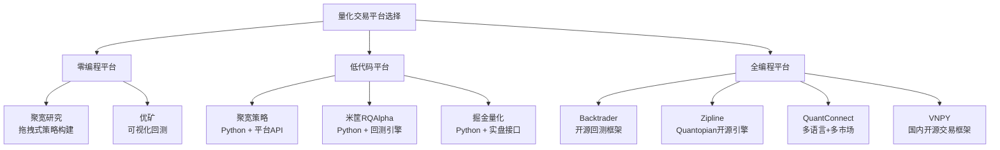

## 本章学习资源推荐

量化交易是一门高度交叉的学科，融合了金融学、统计学、计算机科学和数学等多个领域。要在这条路上走得远，仅靠一本书或一门课程远远不够——你需要构建一个立体化的学习体系：经典书籍打地基，在线课程补体系，社区论坛拓视野，实战平台练手感，数据工具提效率。本节按学习阶段和资源类型，为你梳理一份尽可能完整的学习地图。

***

### 一、经典书籍推荐

书籍是构建系统化知识框架最可靠的途径。以下按难度和主题分类推荐。

#### 1.1 量化交易入门

| 书名 | 作者 | 推荐理由 | 适合阶段 |
|------|------|----------|----------|
| 《打开量化投资的黑箱》(Inside the Black Box) | Rishi K. Narang | 不涉及复杂公式，用通俗语言解释量化交易的核心逻辑，是零基础读者的最佳起点 | 入门 |
| 《Python for Finance》(O'Reilly) | Yves Hilpisch | 系统讲解如何用Python处理金融数据、构建定价模型和回测系统，代码示例丰富且可运行 | 入门→进阶 |
| 《量化投资：策略与技术》 | 丁鹏 | 国内量化入门的经典之作，涵盖常见策略类型和A股市场的实操经验，语言平实，案例贴合国内市场 | 入门 |
| 《主动投资组合管理》(Active Portfolio Management) | Ronald Kahn & Richard Grinold | 讲述Alpha与Beta分离、信息比率等量化投资的核心理论框架，被称为"量化投资圣经" | 入门→进阶 |

#### 1.2 策略开发与回测

| 书名 | 作者 | 推荐理由 | 适合阶段 |
|------|------|----------|----------|
| 《Advances in Financial Machine Learning》 | Marcos López de Prado | 金融机器学习领域的里程碑之作，详细讲解了金融数据特有的陷阱（如数据窥探、过拟合）及应对方法，提出了Meta-Labeling、Triple-Barrier等创新方法论 | 进阶→高阶 |
| 《Quantitative Trading》 | Ernest Chan | 从零开始教你构建第一个量化策略，覆盖数据获取、策略设计、回测、实盘部署的完整流程，实操性极强 | 进阶 |
| 《Machine Learning for Asset Managers》 | Marcos López de Prado | 上书的精简版，聚焦于机器学习在资产管理中的实际应用，适合已有基础想快速上手的读者 | 进阶 |
| 《Algorithmic Trading》 | Ernest Chan | 详解均值回归、动量等经典策略的数学原理和Python实现，每章都有可运行的代码 | 进阶 |

#### 1.3 统计学与数学基础

| 书名 | 作者 | 推荐理由 | 适合阶段 |
|------|------|----------|----------|
| 《统计学习方法》 | 李航 | 国内机器学习教材的经典，覆盖从感知机到深度学习的完整算法体系，公式推导严谨 | 进阶 |
| 《All of Statistics》 | Larry Wasserman | 用精炼的篇幅覆盖概率论与统计学的核心内容，是量化交易从业者的统计学参考手册 | 进阶 |
| 《The Elements of Statistical Learning》 | Hastie, Tibshirani, Friedman | 统计学习的权威教科书，详细讲解了回归、分类、聚类、降维等核心算法的数学原理 | 高阶 |
| 《时间序列分析》(Time Series Analysis) | James Hamilton | 金融时间序列建模的权威参考，覆盖ARIMA、GARCH、状态空间模型等核心方法 | 高阶 |

#### 1.4 风险管理与金融工程

| 书名 | 作者 | 推荐理由 | 适合阶段 |
|------|------|----------|----------|
| 《Options, Futures, and Other Derivatives》 | John Hull | 金融衍生品领域的"圣经"，覆盖期权定价、希腊字母、波动率建模等核心知识 | 进阶 |
| 《The Volatility Surface》 | Jim Gatheral | 系统讲解波动率曲面的构建和应用，是期权交易者的必读书目 | 高阶 |
| 《Risk Management and Financial Institutions》 | John Hull | 从机构视角讲解风险管理框架，覆盖VaR、信用风险、操作风险等核心主题 | 进阶 |

#### 1.5 中文特色推荐

| 书名 | 作者 | 推荐理由 |
|------|------|----------|
| 《A股量化交易实战》 | 王咏 | 专注A股市场的量化策略开发，用Python代码演示完整的策略开发流程 |
| 《Python与量化投资》 | 赵信 | 从数据获取到策略回测，使用聚宽平台进行A股量化实战 |
| 《因子投资：方法与实践》 | 石川、刘洋溢、连祥斌 | 国内因子投资领域的系统性著作，理论与A股实证并重 |

***

### 二、在线课程与视频资源

在线课程的优势在于系统性和互动性——跟着课程走，可以避免自学时的知识盲区和方向偏差。

#### 2.1 国际平台

| 平台/课程 | 内容 | 费用 | 推荐指数 |
|-----------|------|------|----------|
| Coursera: Financial Engineering and Risk Management (哥伦比亚大学) | 金融工程基础，包含期权定价、利率模型、风险管理等核心内容 | 可旁听免费/证书付费 | ⭐⭐⭐⭐⭐ |
| Coursera: Machine Learning (Andrew Ng) | 机器学习入门经典课程，是量化交易学习ML的基础课 | 可旁听免费 | ⭐⭐⭐⭐⭐ |
| Udemy: Python for Financial Analysis and Algorithmic Trading | Python金融分析与算法交易实战，涵盖Pandas、NumPy、回测等核心工具 | 付费（常有折扣） | ⭐⭐⭐⭐ |
| QuantInsti: Executive Programme in Algorithmic Trading (EPAT) | 系统化的量化交易培训课程，覆盖策略开发、实盘部署、风险管理全流程 | 付费（约5000美元） | ⭐⭐⭐⭐⭐ |
| edX: Computational Investing (佐治亚理工) | 计算投资学，从算法视角理解市场微观结构和交易执行 | 可旁听免费 | ⭐⭐⭐⭐ |

#### 2.2 国内平台

| 平台/课程 | 内容 | 费用 |
|-----------|------|------|
| 聚宽社区: 量化入门系列教程 | 从零开始在聚宽平台上开发A股量化策略，图文+代码，适合中文读者 | 免费 |
| 米筐学院: 量化策略开发实战 | 覆盖多因子模型、CTA策略等进阶内容，配合米筐平台实操 | 部分免费/部分付费 |
| B站: 量化交易系列视频 | 搜索"量化交易 Python"可找到大量免费教程，质量参差不齐，建议选择播放量高、评论正面的系列 | 免费 |
| 极客时间: 量化交易专栏 | 偏工程实践角度讲解量化系统的搭建，包括数据管道、策略引擎、订单管理等模块 | 付费 |

#### 2.3 YouTube频道推荐

| 频道 | 内容特色 |
|------|----------|
| QuantPy | Python量化实战教程，从基础到高级策略，代码讲解清晰 |
| sentdex | Python编程教程+金融数据分析，风格轻松易懂 |
| The Math Sorcerer | 数学基础教程，适合需要补数学的量化学习者 |
| Algovibes | 量化策略回测教程，侧重Backtrader框架的使用 |

***

### 三、量化交易平台与工具

平台是量化策略从纸上谈兵到真刀实枪的桥梁。不同平台适合不同阶段的学习者。

#### 3.1 回测与实盘平台



**各平台详细对比：**

| 平台 | 数据源 | 编程语言 | 回测能力 | 实盘对接 | 社区活跃度 | 适合阶段 | 月费参考 |
|------|--------|----------|----------|----------|------------|----------|----------|
| **聚宽 (JoinQuant)** | A股、期货、基金等 | Python | 支持分钟/Tick级 | 支持（需对接券商） | 非常活跃 | 入门→进阶 | 免费版可用/付费版更完整 |
| **米筐 (RiceQuant)** | A股、期货等 | Python | 支持分钟级 | 支持 | 活跃 | 进阶→专业 | 付费 |
| **优矿 (Uqer)** | A股为主 | Python | 支持日线级 | 有限 | 一般 | 入门 | 免费/付费 |
| **掘金量化 (Myquant)** | A股、期货 | Python/C++ | 支持Tick级 | 支持 | 活跃 | 进阶→专业 | 付费 |
| **QuantConnect** | 全球市场 | Python/C# | 支持Tick级 | 支持（IB等） | 非常活跃 | 进阶→专业 | 免费版可用/付费版更完整 |
| **Backtrader** | 自备数据 | Python | 支持任意频率 | 需自行开发 | 活跃 | 进阶→高阶 | 开源免费 |
| **VNPY** | 自备/部分接入 | Python | 支持Tick级 | 支持（CTP等） | 活跃 | 进阶→高阶 | 开源免费 |
| **Zipline** | 自备/Quandl | Python | 支持日线级 | 不支持 | 一般 | 学习用 | 开源免费 |

#### 3.2 数据源

数据是量化交易的"原材料"，数据质量直接决定了策略的上限。

**A股数据源：**

| 数据源 | 数据类型 | 获取方式 | 费用 | 数据质量 |
|--------|----------|----------|------|----------|
| **Tushare Pro** | A股日线/分钟/财务/资金流 | REST API + Python SDK | 基础免费/高级积分制 | 高 |
| **AKShare** | A股/港股/期货/宏观/另类 | Python库直接调用 | 完全免费 | 中高 |
| **baostock** | A股日线/分钟 | Python库 | 免费 | 中 |
| **JQData（聚宽）** | A股全品种高质量数据 | Python SDK | 注册即送/付费 | 高 |
| **RQData（米筐）** | A股Tick级数据 | Python SDK | 付费 | 很高 |
| **Wind万得** | 全品种专业金融数据 | 专业终端 | 很贵（机构用） | 最高 |
| **通达信/同花顺** | A股行情数据 | 本地导出/接口 | 免费（行情软件） | 高 |

**国际数据源：**

| 数据源 | 数据类型 | 获取方式 | 费用 |
|--------|----------|----------|------|
| **Yahoo Finance (yfinance)** | 全球股票/ETF/指数 | Python库 | 免费 |
| **Alpha Vantage** | 全球股票/外汇/加密货币 | REST API | 免费（有限额）/付费 |
| **Quandl** | 多种另类数据和金融数据 | REST API + Python库 | 部分免费/部分付费 |
| **Polygon.io** | 美股实时+历史行情 | REST API + WebSocket | 免费（延迟15分钟）/付费（实时） |
| **Interactive Brokers** | 全球多市场行情+交易 | TWS API | 开户免费/行情部分付费 |

**Python数据获取示例：**

```python
# Tushare Pro - A股日线数据
import tushare as ts
ts.set_token('your_token_here')
pro = ts.pro_api()

# 获取贵州茅台日线数据
df = pro.daily(ts_code='600519.SH', start_date='20240101', end_date='20241231')
print(df.head())

# AKShare - 免费获取A股数据
import akshare as ak

# 获取个股行情
stock_df = ak.stock_zh_a_hist(symbol="600519", period="daily",
                               start_date="20240101", end_date="20241231")
print(stock_df.head())

# yfinance - 获取美股数据
import yfinance as yf

# 获取苹果公司历史数据
aapl = yf.download('AAPL', start='2024-01-01', end='2024-12-31')
print(aapl.head())
```

#### 3.3 开发工具链

| 工具 | 用途 | 推荐理由 |
|------|------|----------|
| **Jupyter Notebook** | 交互式编程、数据分析、可视化 | 量化研究的标准工具，边写代码边看结果 |
| **VS Code** | 代码编辑、调试、版本管理 | 插件生态丰富，Python支持优秀 |
| **PyCharm** | 大型项目开发、专业调试 | 重构和代码分析能力强 |
| **Git** | 版本控制 | 策略代码必须用版本管理，记录每次修改 |
| **Docker** | 环境隔离、部署 | 保证回测和实盘环境一致性 |
| **Redis** | 高速缓存、实时数据存储 | 实盘系统中缓存实时行情数据 |
| **PostgreSQL** | 策略结果存储、因子库 | 存储历史因子值、交易记录、绩效指标 |

***

### 四、社区与论坛

量化交易是一个信息密度极高的领域，与同行交流可以大幅提升学习效率，避免重复造轮子。

#### 4.1 国际社区

| 社区 | 网址 | 特色 |
|------|------|------|
| **QuantConnect Community** | community.quantconnect.com | 活跃的策略分享社区，大量开源策略代码和讨论帖 |
| **Quantitative Finance Stack Exchange** | quant.stackexchange.com | 量化金融问答社区，提问质量高，回答专业 |
| **r/algotrading (Reddit)** | reddit.com/r/algotrading | 算法交易讨论区，从入门到高阶话题都有覆盖 |
| **Elite Trader** | elitetrader.com | 老牌交易论坛，涵盖期货、期权、外汇等多个市场 |
| **Wilmott Forum** | wilmott.com | 偏学术向的量化金融论坛，讨论定价模型和风险管理 |

#### 4.2 国内社区

| 社区 | 网址 | 特色 |
|------|------|------|
| **聚宽社区** | joinquant.com | 国内最活跃的量化社区之一，大量A股策略分享和讨论 |
| **米筐社区** | ricequant.com | 专业量化社区，有策略大赛和因子库分享 |
| **知乎量化交易话题** | zhihu.com (搜索"量化交易") | 大量量化交易入门和进阶内容，适合系统化学习 |
| **淘股吧量化版块** | taoguba.com.cn | 偏实盘经验分享，讨论A股量化实战问题 |
| **VNPY社区** | vnpy.com | 开源量化交易框架社区，讨论CTA策略和实盘部署 |
| **掘金量化社区** | myquant.cn | 策略分享和回测平台讨论 |

#### 4.3 GitHub开源项目推荐

| 项目 | Stars | 内容 |
|------|-------|------|
| **vnpy/vnpy** | 25K+ | 国内最流行的开源量化交易框架，支持CTP、XTP等多种交易接口 |
| **polakowo/vectorbt** | 5K+ | 基于Pandas的高性能向量化回测框架，回测速度远超传统逐K线回测 |
| **quantopian/zipline** | 17K+ | Quantopian开源的事件驱动回测引擎，曾是业界标准 |
| **mementum/backtrader** | 14K+ | 功能完善的Python回测框架，文档和教程丰富 |
| **waditu/tushare** | 13K+ | 国内A股数据获取的标准Python库 |
| **akfamily/akshare** | 10K+ | 免费的多市场数据获取库，数据源覆盖极广 |
| **scikit-learn-contrib/lightgbm** | 17K+ | 微软开源的梯度提升框架，量化因子模型的常用工具 |
| **stefan-jansen/machine-learning-for-trading** | 12K+ | 《Machine Learning for Trading》一书的配套代码仓库 |

***

### 五、学术论文与研究资源

对于希望深入理解策略底层逻辑的学习者，阅读学术论文是必不可少的环节。

#### 5.1 经典必读论文

| 论文 | 作者 | 核心贡献 |
|------|------|----------|
| The Cross-Section of Expected Stock Returns | Fama & French (1992) | 三因子模型，现代因子投资的基石 |
| Common Risk Factors in the Returns on Stocks and Bonds | Fama & French (1993) | 系统化了市场、规模、价值三个风险因子 |
| A Five-Factor Asset Pricing Model | Fama & French (2015) | 五因子模型，增加了盈利和投资因子 |
| Factoring, Factoring, and Multi-Factoring | Carhart (1997) | 四因子模型，增加了动量因子 |
| Limits to Arbitrage | Shleifer & Vishny (1997) | 解释了为什么市场无效性可以长期存在 |
| Market Microstructure in Practice | Laruelle & Lehalle | 市场微观结构的实践指南，涉及最优执行和交易成本分析 |
| Advances in Financial Machine Learning | López de Prado (2018) | 金融机器学习方法论的系统化总结 |

#### 5.2 论文获取渠道

| 渠道 | 内容 | 费用 |
|------|------|------|
| **arXiv (q-fin)** | 量化金融预印本，最新研究前沿 | 免费 |
| **SSRN** | 社科类研究论文，包含大量金融学论文 | 免费注册 |
| **Google Scholar** | 学术搜索引擎，可追踪引用链 | 免费 |
| **NBER Working Papers** | 美国国家经济研究局工作论文，宏观金融研究前沿 | 免费 |
| **中国知网 (CNKI)** | 国内学术论文，搜索量化投资相关研究 | 机构付费/部分免费 |
| **Sci-Hub** | 学术论文获取（注意版权合规性） | 免费 |

***

### 六、数据集与竞赛

通过竞赛检验自己的量化能力，是检验学习成果最直接的方式。

#### 6.1 量化投资竞赛

| 竞赛/平台 | 内容 | 频率 |
|-----------|------|------|
| **聚宽策略大赛** | A股量化策略竞赛，有实盘对接机会 | 不定期 |
| **WorldQuant Brain** | WorldQuant的在线模拟量化平台，可创建因子和策略 | 常驻 |
| **Kaggle: Two Sigma Financial Modeling** | 基于另类数据的金融预测竞赛 | 不定期 |
| **QuantConnect Fund** | QuantConnect的策略基金，表现优秀的策略可获得实盘资金 | 常驻 |
| **天池量化大赛** | 阿里天池平台的量化策略竞赛 | 不定期 |

#### 6.2 练习用数据集

| 数据集 | 内容 | 来源 |
|--------|------|------|
| **Yahoo Finance历史数据** | 全球股票/ETF/指数的日线数据 | yfinance库 |
| **Tushare样本数据** | A股日线、财务、资金流数据 | Tushare Pro |
| **Kaggle金融数据集** | 各种金融相关的公开数据集 | Kaggle |
| **Quandl免费数据** | 经济指标、商品、ETF等数据 | Quandl |
| **WRDS** | 学术级金融数据库（需机构账号） | Wharton |

***

### 七、按学习阶段的资源整合路线图

不同阶段的学习者需要不同的资源组合。以下是一条经过验证的学习路径。

#### 7.1 入门阶段（0-6个月）：打基础

**目标：** 理解量化交易是什么，学会用Python处理金融数据。

**推荐路线：**

1. **读书**：《打开量化投资的黑箱》建立概念框架 → 《Python for Finance》学习Python金融编程
2. **课程**：Coursera "Machine Learning" (Andrew Ng) 补机器学习基础 → 聚宽社区免费教程
3. **实操**：注册聚宽账号，跟随平台教程完成第一个回测策略
4. **工具**：安装Anaconda，学习Jupyter Notebook和Pandas基本操作
5. **社区**：关注聚宽社区、知乎量化话题，每周阅读3-5篇优质文章

**里程碑：** 能够独立用Python获取A股数据，计算常用技术指标，完成简单的双均线策略回测。

#### 7.2 进阶阶段（6-18个月）：建体系

**目标：** 掌握主流策略类型，理解因子投资框架，能够独立开发和回测策略。

**推荐路线：**

1. **读书**：《Quantitative Trading》系统学习策略开发 → 《因子投资：方法与实践》深入因子投资 → 《主动投资组合管理》建立理论框架
2. **课程**：QuantInsti EPAT 或 Coursera "Financial Engineering" 系统学习金融工程
3. **实操**：在聚宽/米筐上开发多因子选股策略 → 使用Backtrader本地回测 → 学习VNPY进行期货CTA策略开发
4. **工具**：掌握Tushare/AKShare数据获取 → 学习Git版本管理 → 学习SQL基础
5. **论文**：阅读Fama-French三因子/五因子论文，理解因子投资的学术基础
6. **竞赛**：参加聚宽策略大赛，用实战检验策略

**里程碑：** 能够独立开发包含数据获取、信号生成、回测评估、风险控制的完整量化策略系统。

#### 7.3 实战阶段（18-36个月）：小资金实盘

**目标：** 将回测策略部署到实盘，积累真实交易经验。

**推荐路线：**

1. **读书**：《Advances in Financial Machine Learning》学习金融ML方法论 → 《Options, Futures, and Other Derivatives》扩展到衍生品领域
2. **实操**：用小资金（建议不超过总资金5%）实盘验证策略 → 搭建自动化交易系统（VNPY/QMT）→ 学习订单执行优化
3. **工具**：学习Docker部署 → 学习Redis缓存实时数据 → 搭建策略监控系统
4. **论文**：阅读市场微观结构、交易成本分析相关论文
5. **社区**：参与QuantConnect Community讨论 → 关注VNPY社区的实盘经验分享

**里程碑：** 有至少1个策略经过3个月以上的实盘验证，能够持续记录和分析交易表现。

#### 7.4 高阶阶段（36个月以上）：构建体系

**目标：** 构建多策略、多品种的完整量化投资体系。

**推荐路线：**

1. **读书**：《The Volatility Surface》深入波动率建模 → 《Machine Learning for Asset Managers》 → 阅读最新学术论文保持前沿
2. **实操**：构建多策略组合管理系统 → 学习另类数据的获取和处理 → 探索机器学习策略
3. **工具**：自建因子数据库 → 搭建策略监控和告警系统 → 学习高性能计算（多进程/异步/缓存）
4. **社区**：在知乎/聚宽发表自己的研究成果 → 参与WorldQuant Brain → 与同行组建学习小组

**里程碑：** 拥有完整的多策略投资体系，策略组合有经过验证的风险调整后收益，具备独立管理量化基金的知识储备。

***

### 八、学习中的常见陷阱与提醒

在学习量化交易的过程中，很多人会掉入以下陷阱。提前了解，可以少走很多弯路。

#### 8.1 资源选择陷阱

| 陷阱 | 表现 | 正确做法 |
|------|------|----------|
| **囤积不学** | 收藏了100个教程，一个都没看完 | 选1-2本经典书+1门课程，坚持学完再扩展 |
| **追新弃旧** | 不断跳到最新的框架和工具 | 先精通一个平台（如聚宽），再横向扩展 |
| **只看不练** | 看了很多策略讲解，但从不写代码 | 每学一个概念，立即用Python实现 |
| **迷信秘籍** | 相信有"必胜策略"可以一劳永逸 | 量化交易没有圣杯，持续学习和迭代才是正道 |
| **忽视基础** | 跳过统计学和金融理论，直接学策略 | 基础不牢，策略设计和风险评估都会出问题 |

#### 8.2 实践中的误区

| 误区 | 为什么是错的 | 正确做法 |
|------|-------------|----------|
| **过度优化参数** | 参数越多，过度拟合风险越大，回测越好不代表实盘越好 | 使用Walk-Forward分析和交叉验证检验策略稳健性 |
| **忽视交易成本** | 很多策略在扣除手续费和滑点后就是亏损的 | 回测时必须包含真实的交易成本假设 |
| **只看收益率** | 高收益往往伴随高风险，单看收益率没有意义 | 综合评估夏普比率、最大回撤、收益回撤比等指标 |
| **盲目跟单** | 别人的策略适合他的资金规模和风险偏好，不一定适合你 | 理解策略逻辑后再决定是否使用，不要盲目复制 |
| **忽略数据质量** | 脏数据会导致错误的回测结论 | 使用可靠数据源，做数据清洗和异常值处理 |

***

### 九、持续学习建议

量化交易是一个需要终身学习的领域。市场在变，工具在变，策略在变——唯一不变的是持续学习的必要性。

**建立信息渠道：** 订阅3-5个高质量的量化交易博客或Newsletter，如Quantocracy（量化交易内容聚合站）、Alpha Architect Blog（因子投资研究）、Marcos López de Prado的领英动态。中文方面，关注知乎量化交易话题的高赞回答者和聚宽社区的精选文章。

**保持代码习惯：** 每周至少花3-4小时写量化代码。可以是回测一个新策略、学习一个新工具、或者复现一篇论文的结论。量化交易是实践性极强的技能，不动手就会生疏。

**参与社区讨论：** 在聚宽、知乎或QuantConnect上分享自己的策略思路和回测结果，接受社区的反馈和挑战。与同行交流不仅能发现自己的盲点，还能获得新的灵感。

**定期复盘：** 每月对自己的策略表现进行系统复盘，分析盈利和亏损的原因，记录策略的假设是否成立、市场环境是否发生了变化。复盘记录将成为你最宝贵的个人资产。

**关注学术前沿：** 定期浏览arXiv的q-fin（量化金融）板块和SSRN的最新论文，了解学术界的最新研究成果。很多前沿的方法论（如强化学习做组合管理、图神经网络做产业链分析）会在学术论文发表后的1-3年内逐步进入实践领域。

***

> 💡 **核心建议：学习资源不在多，在于精和用。** 选1-2本经典书作为主线，选1个平台作为实操阵地，选1个社区作为交流渠道，然后持续投入时间和精力。量化交易的学习曲线是先陡后缓的——前期需要大量投入来建立知识体系和编程能力，但一旦过了某个临界点，你会发现自己的策略开发效率和分析能力会有质的飞跃。坚持下去，你一定能看到成果。
