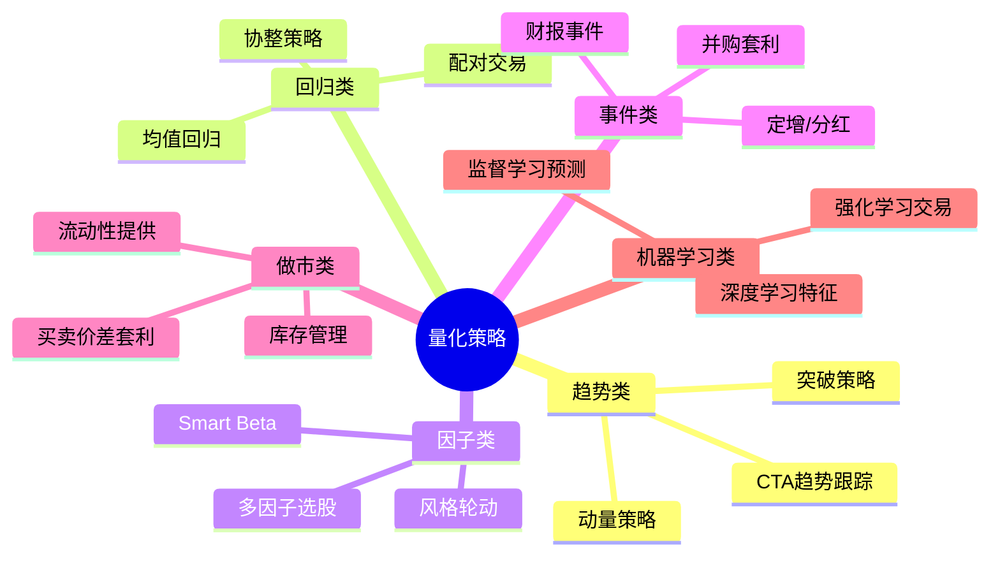
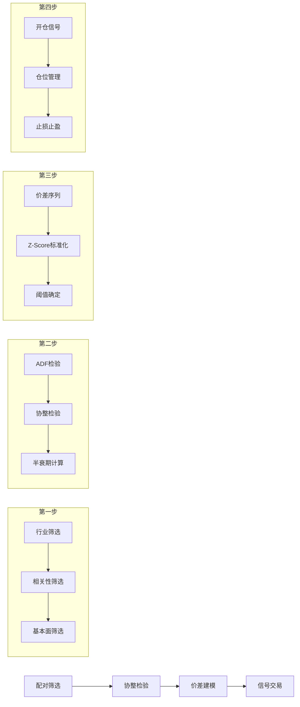
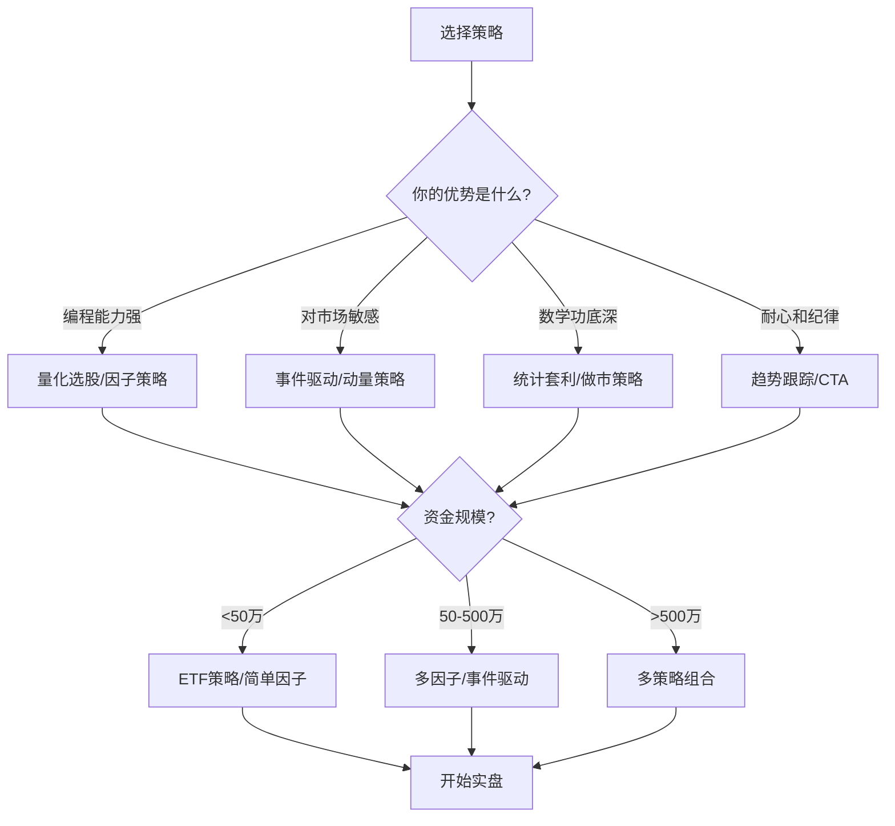

## 一、常见量化策略详解

量化交易的核心在于将投资逻辑转化为可执行、可回测、可优化的系统化规则。本节深入剖析八大主流量化策略家族，从理论机制到代码实现，从适用场景到风险陷阱，帮助你建立完整的策略认知体系。

### 1.0 策略全景图

在进入具体策略之前，先建立全局视角。量化策略可以从两个维度进行分类：**逻辑维度**（你赚的是什么钱）和**频率维度**（你多快进出）。



**不同策略的核心收益来源对比**：

| 策略类型 | 收益来源 | 典型持仓期 | 资金容量 | 技术门槛 | A股适用性 |
|---------|---------|-----------|---------|---------|----------|
| 均值回归 | 价格偏离回归 | 1-10天 | 中等 | ★★★ | ★★★★ |
| 动量策略 | 趋势延续 | 5-60天 | 大 | ★★ | ★★★ |
| 统计套利 | 价差收敛 | 1-20天 | 中等 | ★★★★ | ★★★ |
| CTA趋势 | 期货趋势 | 1-30天 | 大 | ★★★ | ★★★★ |
| 多因子 | 风格溢价 | 5-30天 | 很大 | ★★★ | ★★★★★ |
| 事件驱动 | 信息不对称 | 1-10天 | 中等 | ★★★ | ★★★★ |
| 做市策略 | 买卖价差 | 秒-分钟 | 中等 | ★★★★★ | ★★ |
| 机器学习 | 非线性模式 | 灵活 | 中等 | ★★★★★ | ★★★ |

### 1.1 均值回归策略

#### 1.1.1 理论基础

均值回归（Mean Reversion）的理论根基可以追溯到金融学的**有效市场假说**与**行为金融学**的交叉地带。

从统计学角度看，如果一个时间序列是**平稳的**（stationary），那么它偏离均值后必然回归。问题在于：股票价格本身通常是非平稳的（有趋势），但**价差**、**波动率**、**估值比率**等指标往往是平稳的。

从行为金融学角度看，均值回归源于两种力量：
- **过度反应修正**：投资者对短期信息过度反应，导致价格超调，随后修正
- **理性套利**：专业交易者发现价格偏离后进行反向交易，推动价格回归

**关键前提条件**：均值回归策略能盈利，需要满足三个条件——
1. 价格序列确实存在均值回归特性（需要统计检验）
2. 偏离幅度足够大，覆盖交易成本后仍有利润
3. 回归速度足够快，不至于占用资金过久

#### 1.1.2 布林带均值回归策略

布林带（Bollinger Bands）是均值回归策略中最经典的技术工具，由约翰·布林格（John Bollinger）在1980年代提出。

**核心原理**：假设价格服从正态分布，那么95%的价格应该落在均值±2个标准差范围内。当价格突破上下轨时，有较大概率回归中轨。

```python
import pandas as pd
import numpy as np

class BollingerMeanReversion:
    """布林带均值回归策略"""
    
    def __init__(self, window=20, num_std=2.0, rsi_period=14):
        self.window = window          # 均线周期
        self.num_std = num_std        # 标准差倍数
        self.rsi_period = rsi_period  # RSI周期（用于过滤）
    
    def calculate_indicators(self, df):
        """计算所有技术指标"""
        # 布林带
        df['ma'] = df['close'].rolling(self.window).mean()
        df['std'] = df['close'].rolling(self.window).std()
        df['upper'] = df['ma'] + self.num_std * df['std']
        df['lower'] = df['ma'] - self.num_std * df['std']
        df['bandwidth'] = (df['upper'] - df['lower']) / df['ma']  # 带宽
        
        # RSI（用于过滤假信号）
        delta = df['close'].diff()
        gain = delta.where(delta > 0, 0).rolling(self.rsi_period).mean()
        loss = (-delta.where(delta < 0, 0)).rolling(self.rsi_period).mean()
        rs = gain / loss
        df['rsi'] = 100 - (100 / (1 + rs))
        
        # 成交量比率（确认信号）
        df['vol_ratio'] = df['volume'] / df['volume'].rolling(20).mean()
        
        return df
    
    def generate_signals(self, df):
        """生成交易信号"""
        df = self.calculate_indicators(df)
        
        df['signal'] = 0
        
        # 买入条件：价格跌破下轨 + RSI<30（超卖） + 放量确认
        buy_condition = (
            (df['close'] < df['lower']) &
            (df['rsi'] < 30) &
            (df['vol_ratio'] > 1.2)  # 成交量放大20%以上
        )
        df.loc[buy_condition, 'signal'] = 1
        
        # 卖出条件：价格突破上轨 + RSI>70（超买）
        sell_condition = (
            (df['close'] > df['upper']) &
            (df['rsi'] > 70)
        )
        df.loc[sell_condition, 'signal'] = -1
        
        # 止损：价格跌破中轨下方3个标准差
        stop_loss = df['close'] < (df['ma'] - 3 * df['std'])
        df.loc[stop_loss, 'signal'] = -1
        
        return df
```

#### 1.1.3 均值回归策略的变体与进阶

**① Z-Score均值回归**

不使用固定标准差，而是使用Z-Score动态衡量偏离程度：

```python
def zscore_reversion(prices, lookback=60, entry_z=2.0, exit_z=0.5):
    """
    Z-Score均值回归
    - entry_z: 开仓阈值（偏离多少个标准差）
    - exit_z: 平仓阈值（回归到多少个标准差内）
    """
    mean = prices.rolling(lookback).mean()
    std = prices.rolling(lookback).std()
    zscore = (prices - mean) / std
    
    signals = pd.Series(0, index=prices.index)
    position = 0  # 当前持仓状态
    
    for i in range(1, len(zscore)):
        if position == 0:  # 无持仓
            if zscore.iloc[i] < -entry_z:
                signals.iloc[i] = 1   # 超卖买入
                position = 1
            elif zscore.iloc[i] > entry_z:
                signals.iloc[i] = -1  # 超买卖出
                position = -1
        elif position == 1:  # 持有多头
            if zscore.iloc[i] > -exit_z:
                signals.iloc[i] = 0   # 回归平仓
                position = 0
        elif position == -1:  # 持有空头
            if zscore.iloc[i] < exit_z:
                signals.iloc[i] = 0   # 回归平仓
                position = 0
    
    return signals
```

**② 自适应布林带（Adaptive Bollinger Bands）**

固定参数的布林带在波动率变化时表现不稳定。自适应版本根据近期波动率动态调整带宽：

```python
def adaptive_bollinger(df, base_window=20, base_std=2.0):
    """
    自适应布林带：波动率高时收紧带宽，波动率低时放宽带宽
    目的：减少高波动时的假信号，低波动时不错过机会
    """
    # 计算历史波动率分位数
    vol = df['close'].pct_change().rolling(60).std()
    vol_percentile = vol.rolling(252).apply(
        lambda x: pd.Series(x).rank(pct=True).iloc[-1]
    )
    
    # 波动率越高，标准差倍数越大（收紧信号）
    adaptive_std = base_std * (0.8 + 0.4 * vol_percentile)
    
    df['ada_ma'] = df['close'].rolling(base_window).mean()
    df['ada_std'] = df['close'].rolling(base_window).std()
    df['ada_upper'] = df['ada_ma'] + adaptive_std * df['ada_std']
    df['ada_lower'] = df['ada_ma'] - adaptive_std * df['ada_std']
    
    return df
```

**③ 半衰期计算——判断均值回归速度**

并非所有资产都适合做均值回归。**半衰期**（Half-Life）是衡量均值回归速度的关键指标：

```python
def calculate_half_life(spread):
    """
    计算均值回归半衰期
    使用OLS回归：Δy(t) = λ * y(t-1) + ε
    半衰期 = -ln(2) / λ
    """
    spread_lag = spread.shift(1).dropna()
    spread_diff = spread.diff().dropna()
    
    # 对齐索引
    spread_lag = spread_lag.iloc[1:]
    spread_diff = spread_diff.iloc[1:]
    
    # OLS回归
    from sklearn.linear_model import LinearRegression
    model = LinearRegression()
    model.fit(spread_lag.values.reshape(-1, 1), spread_diff.values)
    
    lambda_coeff = model.coef_[0]
    
    if lambda_coeff >= 0:
        return float('inf')  # 不具备均值回归特性
    
    half_life = -np.log(2) / lambda_coeff
    return half_life

# 使用示例
hl = calculate_half_life(df['close'])
print(f"半衰期: {hl:.1f} 天")
# 半衰期在5-30天之间最适合做均值回归
# 半衰期<3天：回归太快，利润空间小
# 半衰期>60天：回归太慢，资金效率低
```

#### 1.1.4 均值回归策略的适用场景与陷阱

**最佳适用场景**：
- 横盘震荡市场（A股约60-70%的时间处于震荡）
- 波动率适中的品种（波动率太低无利可图，太高容易止损）
- 流动性好的标的（成交量日均5000万以上）

**致命陷阱**：
- **趋势市场中的持续亏损**：当市场进入单边趋势时，均值回归策略会反复"抄底"被套。2015年A股暴跌期间，纯均值回归策略回撤可达30%以上
- **波动率突变**：黑天鹅事件导致波动率急剧放大，布林带瞬间被突破，止损来不及执行
- **参数过拟合**：回测中window=20效果好，实盘可能window=15更好，过度优化参数是最大的陷阱

**防护措施**：
1. 加入趋势过滤器（如200日均线方向），只在震荡市启用
2. 设置硬止损（单笔亏损不超过本金的2%）
3. 仓位管理：波动率越高，仓位越低
4. 多品种分散：同时在10个以上标的上运行，分散单品种风险

### 1.2 动量策略

#### 1.2.1 理论基础

动量效应（Momentum Effect）是金融学中最稳健的异象之一，由Jegadeesh和Titman在1993年的经典论文中首次系统记录。

**核心发现**：过去3-12个月表现最好的股票，在未来3-12个月继续表现好的概率显著高于随机水平。这一现象在全球数十个国家的市场中都得到了验证。

**动量效应的行为金融学解释**：
- **反应不足假说**（Underreaction）：投资者对基本面信息的反应存在滞后，好消息需要时间才能完全反映在价格中
- **正反馈交易**（Positive Feedback）：趋势形成后，趋势跟踪者的加入进一步推动价格，形成自我强化
- **处置效应**（Disposition Effect）：投资者倾向于过早卖出盈利股票、过久持有亏损股票，延缓了价格对信息的充分反应

**动量效应的风险**：
动量策略的最大风险是**动量崩溃**（Momentum Crash）。在市场剧烈反转时（如2009年3月、2020年3月），前期表现最差的股票急剧反弹，前期表现最好的股票急剧下跌，动量策略遭受巨大损失。

#### 1.2.2 经典时序动量策略

时序动量（Time-Series Momentum）关注单个资产自身的历史收益：

```python
class TimeSeriesMomentum:
    """
    时序动量策略
    核心逻辑：资产过去N天收益为正则做多，为负则做空/减仓
    """
    
    def __init__(self, lookback=20, threshold=0.05, vol_target=0.15):
        self.lookback = lookback       # 回看周期
        self.threshold = threshold     # 动量阈值（过滤噪音）
        self.vol_target = vol_target   # 目标波动率
    
    def calculate_momentum(self, df):
        """计算动量信号"""
        # 1. 计算过去N天收益率
        df['return_n'] = df['close'].pct_change(self.lookback)
        
        # 2. 计算波动率（用于仓位管理）
        df['volatility'] = df['close'].pct_change().rolling(
            self.lookback
        ).std() * np.sqrt(252)  # 年化波动率
        
        # 3. 生成原始信号
        df['raw_signal'] = 0
        df.loc[df['return_n'] > self.threshold, 'raw_signal'] = 1
        df.loc[df['return_n'] < -self.threshold, 'raw_signal'] = -1
        
        # 4. 波动率调整仓位（核心风控）
        # 波动率越高，仓位越低；目标是让策略的波动率恒定
        df['position_size'] = self.vol_target / df['volatility'].clip(lower=0.05)
        df['position_size'] = df['position_size'].clip(upper=2.0)  # 最大2倍杠杆
        
        # 5. 最终信号 = 方向 × 仓位大小
        df['signal'] = df['raw_signal'] * df['position_size']
        
        return df
```

#### 1.2.3 截面动量策略

截面动量（Cross-Sectional Momentum）在多个资产之间进行比较，做多相对最强的，做空相对最弱的：

```python
def cross_sectional_momentum(stock_returns, top_pct=0.1, bottom_pct=0.1):
    """
    截面动量策略
    - stock_returns: DataFrame，每列是一只股票的日收益率
    - top_pct: 做多排名前X%的股票
    - bottom_pct: 做空排名后X%的股票
    """
    # 计算过去20日累计收益（动量因子）
    momentum = stock_returns.rolling(20).sum()
    
    # 每日截面排名
    n_stocks = momentum.shape[1]
    n_top = max(1, int(n_stocks * top_pct))
    n_bottom = max(1, int(n_stocks * bottom_pct))
    
    weights = pd.DataFrame(0.0, index=momentum.index, columns=momentum.columns)
    
    for date in momentum.index:
        row = momentum.loc[date].dropna()
        if len(row) < 10:
            continue
        
        # 做多前10%，做空后10%
        ranked = row.rank(pct=True)
        long_stocks = ranked[ranked >= (1 - top_pct)].index
        short_stocks = ranked[ranked <= bottom_pct].index
        
        # 等权分配
        weights.loc[date, long_stocks] = 1.0 / len(long_stocks)
        weights.loc[date, short_stocks] = -1.0 / len(short_stocks)
    
    return weights
```

#### 1.2.4 A股动量策略的特殊性

A股市场的动量效应与海外市场存在显著差异，直接照搬海外策略会踩坑：

**A股动量效应的三个特征**：

| 时间维度 | A股表现 | 与美股差异 | 实操建议 |
|---------|--------|-----------|---------|
| 短期（1-5天） | 强反转效应 | 美股短期也是反转 | 做反转而非动量 |
| 中期（1-3个月） | 弱动量或无效 | 美股中期动量强 | 需结合其他因子 |
| 长期（6-12个月） | 明显反转 | 美股长期动量存在 | 做反转策略 |

**为什么A股短期反转强？**
- 散户占比高（交易量约70%），追涨杀跌导致短期过度反应
- T+1制度和涨跌停板限制了价格发现效率
- 市场情绪驱动明显，短期获利盘抛压大

**A股动量策略的本土化调整**：

```python
def a_share_momentum_adjusted(df, lookback_short=5, lookback_long=60):
    """
    A股本土化动量策略
    核心调整：
    1. 短期做反转（5日收益为负则买入）
    2. 中期做动量（60日收益为正且趋势向上）
    3. 加入换手率过滤（避免流动性陷阱）
    """
    # 短期反转信号
    df['ret_5d'] = df['close'].pct_change(lookback_short)
    short_reversal = df['ret_5d'] < -0.05  # 5日跌幅超5%
    
    # 中期动量信号
    df['ret_60d'] = df['close'].pct_change(lookback_long)
    mid_momentum = df['ret_60d'] > 0.1  # 60日涨幅超10%
    
    # 趋势过滤：价格在120日均线之上
    df['ma120'] = df['close'].rolling(120).mean()
    trend_up = df['close'] > df['ma120']
    
    # 换手率过滤
    vol_ok = df['turnover_rate'] > 0.5  # 换手率>0.5%
    
    # 组合信号：短期反转 + 中期动量 + 趋势向上
    df['signal'] = 0
    buy = short_reversal & mid_momentum & trend_up & vol_ok
    df.loc[buy, 'signal'] = 1
    
    return df
```

### 1.3 统计套利策略

#### 1.3.1 配对交易的完整框架

配对交易（Pairs Trading）是统计套利中最经典的策略，由摩根士丹利的量化团队在1980年代首创。其核心思想是：找到两只价格高度相关的股票，当它们的价格关系暂时偏离时，做多被低估的、做空被高估的，等待关系恢复后获利。

**配对交易的完整四步流程**：



#### 1.3.2 配对筛选与协整检验

```python
import statsmodels.api as sm
from statsmodels.tsa.stattools import coint, adfuller

class PairsTrading:
    """
    配对交易策略完整实现
    """
    
    def __init__(self, entry_z=2.0, exit_z=0.5, stop_z=3.5, max_holding=20):
        self.entry_z = entry_z        # 开仓阈值
        self.exit_z = exit_z          # 平仓阈值
        self.stop_z = stop_z          # 止损阈值
        self.max_holding = max_holding # 最大持仓天数
    
    def find_pairs(self, price_df, sector_map, min_corr=0.7):
        """
        第一步：筛选潜在配对
        
        参数:
            price_df: DataFrame，每列为一只股票的收盘价
            sector_map: dict，股票代码→行业分类
            min_corr: 最低相关性阈值
        """
        pairs = []
        stocks = price_df.columns.tolist()
        
        # 计算收益率相关性矩阵
        returns = price_df.pct_change().dropna()
        corr_matrix = returns.corr()
        
        for i in range(len(stocks)):
            for j in range(i+1, len(stocks)):
                s1, s2 = stocks[i], stocks[j]
                
                # 条件1：同行业
                if sector_map.get(s1) != sector_map.get(s2):
                    continue
                
                # 条件2：相关性足够高
                if corr_matrix.loc[s1, s2] < min_corr:
                    continue
                
                # 条件3：协整检验通过
                score, pvalue, _ = coint(price_df[s1], price_df[s2])
                if pvalue > 0.05:
                    continue
                
                # 条件4：半衰期合理（5-30天）
                spread = price_df[s1] - price_df[s2]
                hl = self._half_life(spread)
                if hl < 5 or hl > 30:
                    continue
                
                # 计算对冲比率
                hedge_ratio = self._calc_hedge_ratio(price_df[s1], price_df[s2])
                
                pairs.append({
                    'stock_a': s1,
                    'stock_b': s2,
                    'correlation': corr_matrix.loc[s1, s2],
                    'coint_pvalue': pvalue,
                    'half_life': hl,
                    'hedge_ratio': hedge_ratio
                })
        
        # 按协整p值排序
        pairs.sort(key=lambda x: x['coint_pvalue'])
        return pairs
    
    def _half_life(self, spread):
        """计算均值回归半衰期"""
        spread_lag = spread.shift(1).iloc[1:]
        spread_diff = spread.diff().iloc[1:]
        
        X = sm.add_constant(spread_lag)
        model = sm.OLS(spread_diff, X).fit()
        
        lambda_coeff = model.params.iloc[1] if hasattr(model.params, 'iloc') else model.params[1]
        if lambda_coeff >= 0:
            return float('inf')
        return -np.log(2) / lambda_coeff
    
    def _calc_hedge_ratio(self, y, x):
        """计算对冲比率（OLS回归斜率）"""
        X = sm.add_constant(x)
        model = sm.OLS(y, X).fit()
        return model.params.iloc[1] if hasattr(model.params, 'iloc') else model.params[1]
    
    def trade_pair(self, stock_a, stock_b, hedge_ratio):
        """
        第四步：对已确认的配对进行交易
        
        返回信号序列：1=做多价差, -1=做空价差, 0=无仓位
        """
        spread = stock_a - hedge_ratio * stock_b
        
        # 使用60日滚动窗口计算Z-Score
        spread_mean = spread.rolling(60).mean()
        spread_std = spread.rolling(60).std()
        zscore = (spread - spread_mean) / spread_std
        
        signals = pd.Series(0, index=spread.index)
        position = 0
        holding_days = 0
        
        for i in range(1, len(zscore)):
            z = zscore.iloc[i]
            
            if position == 0:
                if z < -self.entry_z:
                    signals.iloc[i] = 1    # 做多价差（买A卖B）
                    position = 1
                    holding_days = 0
                elif z > self.entry_z:
                    signals.iloc[i] = -1   # 做空价差（卖A买B）
                    position = -1
                    holding_days = 0
            else:
                holding_days += 1
                # 平仓条件：回归、止损、超时
                if position == 1 and (z > -self.exit_z or z < -self.stop_z or holding_days > self.max_holding):
                    signals.iloc[i] = 0
                    position = 0
                elif position == -1 and (z < self.exit_z or z > self.stop_z or holding_days > self.max_holding):
                    signals.iloc[i] = 0
                    position = 0
        
        return signals
```

#### 1.3.3 统计套利的风险

**最大的风险不是策略本身，而是配对关系的永久性断裂。**

经典案例：
- 2008年金融危机期间，许多历史协整关系突然失效，"配对交易"变成了"双向亏损"
- A股中同一行业的两只股票，如果一家出现重大利好/利空（如财务造假、被收购），价差可能永远不回归

**防护策略**：
1. **硬止损**：价差Z-Score超过3.5必须止损，不要心存幻想
2. **最大持仓时间**：超过20天未回归就平仓，避免资金被长期占用
3. **动态重新检验**：每季度重新做协整检验，关系失效的配对立即剔除
4. **资金分配**：单个配对最多占用总资金的10%，同时运行10-20个配对

### 1.4 CTA策略（商品交易顾问策略）

#### 1.4.1 趋势跟踪的本质

CTA策略的核心是**趋势跟踪**（Trend Following）。趋势跟踪为什么能盈利？有三个理论解释：

1. **市场效率的局部失效**：新信息传播需要时间，价格不会瞬间到位，形成趋势
2. **央行干预与政策惯性**：货币政策的变化往往是渐进的，形成宏观趋势
3. **行为金融学的锚定效应**：投资者对新信息的反应存在系统性滞后

**趋势跟踪的核心矛盾**：大多数时间市场是震荡的（约70%），趋势跟踪策略在震荡期持续亏损。但当趋势来临时，盈利幅度远超震荡期的亏损。这意味着趋势跟踪策略的收益分布是**正偏态**的——大多数交易是小亏，少数交易贡献了绝大部分利润。

#### 1.4.2 经典海龟交易法则

海龟交易法则由Richard Dennis在1983年著名的"海龟实验"中创立，是趋势跟踪策略的教科书级范例：

```python
class TurtleTrading:
    """
    海龟交易法则完整实现
    
    入场规则：
    - 系统1：突破20日最高价入场
    - 系统2：突破55日最高价入场
    
    出场规则：
    - 系统1：跌破10日最低价出场
    - 系统2：跌破20日最低价出场
    
    仓位管理：
    - 基于ATR计算每个"交易单位"的仓位
    - 每个单位承担总资金1%的风险
    """
    
    def __init__(self, capital=1000000, risk_pct=0.01):
        self.capital = capital
        self.risk_pct = risk_pct
        self.max_units = 4          # 单品种最大单位数
        self.max_risk_pct = 0.04    # 单品种最大风险4%
    
    def calculate_atr(self, df, period=20):
        """计算ATR（平均真实波幅）"""
        high = df['high']
        low = df['low']
        close_prev = df['close'].shift(1)
        
        tr1 = high - low
        tr2 = abs(high - close_prev)
        tr3 = abs(low - close_prev)
        
        true_range = pd.concat([tr1, tr2, tr3], axis=1).max(axis=1)
        atr = true_range.rolling(period).mean()
        
        return atr
    
    def calculate_unit_size(self, atr_value):
        """
        计算交易单位大小
        公式：单位大小 = (资金 × 风险比例) / ATR
        含义：持有一个单位时，如果价格反向波动1个ATR，损失恰好等于资金的1%
        """
        dollar_volatility = atr_value  # 每点波动的价值（假设1:1）
        unit_size = (self.capital * self.risk_pct) / dollar_volatility
        return int(unit_size)
    
    def generate_signals(self, df, system=1):
        """生成海龟交易信号"""
        df = df.copy()
        df['atr'] = self.calculate_atr(df)
        
        if system == 1:
            entry_period = 20
            exit_period = 10
        else:
            entry_period = 55
            exit_period = 20
        
        # 入场/出场通道
        df['entry_high'] = df['high'].rolling(entry_period).max()
        df['exit_low'] = df['low'].rolling(exit_period).min()
        
        signals = []
        position = 0
        units = 0
        last_add_price = 0
        
        for i in range(max(entry_period, exit_period), len(df)):
            price = df['close'].iloc[i]
            entry_high = df['entry_high'].iloc[i-1]  # 用昨日的通道
            exit_low = df['exit_low'].iloc[i-1]
            atr = df['atr'].iloc[i]
            
            if position == 0:
                # 无仓位：突破入场
                if price > entry_high:
                    unit_size = self.calculate_unit_size(atr)
                    position = 1
                    units = 1
                    last_add_price = price
                    signals.append(('BUY', price, unit_size))
                else:
                    signals.append(('HOLD', price, 0))
            
            elif position == 1:
                # 有仓位：检查加仓或出场
                if units < self.max_units and price >= last_add_price + 0.5 * atr:
                    # 每上涨0.5个ATR加仓一个单位
                    unit_size = self.calculate_unit_size(atr)
                    units += 1
                    last_add_price = price
                    signals.append(('ADD', price, unit_size))
                elif price < exit_low:
                    # 跌破出场通道
                    position = 0
                    units = 0
                    signals.append(('SELL', price, 0))
                else:
                    signals.append(('HOLD', price, 0))
        
        return signals
```

#### 1.4.3 现代CTA策略的改进

经典海龟法则的参数是固定的，现代CTA策略在此基础上做了大量改进：

**① 自适应趋势跟踪**

```python
def adaptive_trend_signal(df, fast_period=10, slow_period=60):
    """
    自适应趋势信号：根据市场状态动态调整趋势判断速度
    
    核心思想：
    - 趋势明确时（ADX高）：用快速均线，尽早入场
    - 震荡市场时（ADX低）：用慢速均线，减少假信号
    """
    # 计算ADX（趋势强度指标）
    # ADX > 25 表示趋势市场，ADX < 20 表示震荡市场
    plus_dm = df['high'].diff()
    minus_dm = -df['low'].diff()
    
    # 简化ADX计算
    tr = pd.concat([
        df['high'] - df['low'],
        abs(df['high'] - df['close'].shift(1)),
        abs(df['low'] - df['close'].shift(1))
    ], axis=1).max(axis=1)
    
    atr_14 = tr.rolling(14).mean()
    plus_di = (plus_dm.rolling(14).mean() / atr_14) * 100
    minus_di = (minus_dm.rolling(14).mean() / atr_14) * 100
    dx = abs(plus_di - minus_di) / (plus_di + minus_di) * 100
    adx = dx.rolling(14).mean()
    
    # 根据ADX调整均线周期
    # ADX高→用快速均线，ADX低→用慢速均线
    alpha = ((adx - 20) / 30).clip(0, 1)  # 归一化到[0,1]
    adaptive_period = (slow_period - alpha * (slow_period - fast_period)).astype(int)
    
    # 计算自适应均线（简化版）
    df['fast_ma'] = df['close'].rolling(fast_period).mean()
    df['slow_ma'] = df['close'].rolling(slow_period).mean()
    df['trend_signal'] = np.where(df['fast_ma'] > df['slow_ma'], 1, -1)
    
    return df
```

**② CTA策略的多品种组合**

单品种CTA策略的夏普比率通常只有0.3-0.5，但通过多品种组合可以显著提升：

```python
def multi_cta_portfolio(returns_dict, vol_target=0.15):
    """
    多品种CTA组合
    核心思想：每个品种贡献独立的趋势收益，品种间的低相关性提供分散化收益
    
    参数:
        returns_dict: dict，品种名→策略收益率序列
        vol_target: 组合目标波动率
    """
    # 构建收益率矩阵
    returns_df = pd.DataFrame(returns_dict)
    
    # 计算各品种波动率
    vols = returns_df.std() * np.sqrt(252)
    
    # 反波动率加权（Inverse Volatility Weighting）
    inv_vols = 1.0 / vols
    weights = inv_vols / inv_vols.sum()
    
    # 组合收益
    portfolio_returns = (returns_df * weights).sum(axis=1)
    
    # 波动率目标调整
    port_vol = portfolio_returns.std() * np.sqrt(252)
    leverage = vol_target / port_vol
    
    print(f"各品种权重: {weights.to_dict()}")
    print(f"组合波动率: {port_vol:.2%}")
    print(f"目标波动率: {vol_target:.2%}")
    print(f"杠杆倍数: {leverage:.2f}")
    
    return portfolio_returns * leverage, weights * leverage
```

#### 1.4.4 CTA策略在A股的局限与适配

A股做CTA策略有几个特殊限制：

1. **做空限制**：A股不能直接做空个股，只能通过融券（券源有限、成本高）或股指期货
2. **期货品种有限**：国内商品期货品种虽然在增加，但流动性和市场深度不如海外市场
3. **涨跌停板**：10%的涨跌停限制了趋势跟踪的盈利空间
4. **夜盘风险**：商品期货夜盘时段可能出现大幅跳空

**A股CTA的可行方案**：
- 使用**ETF轮动**替代个股趋势跟踪（如行业ETF、宽基ETF）
- 使用**股指期货**做趋势跟踪（IF/IH/IC）
- 使用**商品期货**组合CTA策略（需要期货账户）

### 1.5 多因子选股策略

#### 1.5.1 因子投资的理论基础

因子投资（Factor Investing）是当前量化投资的主流范式，其核心思想是：**股票的超额收益可以被少数几个系统性因子所解释。**

**学术界的因子模型演进**：

| 模型 | 年代 | 因子数 | 核心发现 |
|------|------|--------|---------|
| CAPM | 1964 | 1 | 市场风险是唯一系统性因子 |
| Fama-French三因子 | 1993 | 3 | 市场+规模+价值 |
| Carhart四因子 | 1997 | 4 | 三因子+动量 |
| Fama-French五因子 | 2015 | 5 | 三因子+盈利+投资 |
| 机器学习因子 | 2019+ | 数百 | 非线性因子组合 |

#### 1.5.2 A股核心因子详解

在A股市场，经过大量实证研究，以下因子被证明具有持续的超额收益：

**① 价值因子**

```python
def value_factor(financial_data):
    """
    价值因子：低估值股票长期跑赢高估值股票
    
    A股有效的价值指标：
    - EP（市盈率倒数）：EP = 净利润 / 总市值
    - BP（市净率倒数）：BP = 净资产 / 总市值
    - DP（股息率）：DP = 每股股息 / 股价
    
    注意：A股的"价值陷阱"比美股更严重
    低PE不一定好，可能是业绩下滑的前兆
    """
    # 综合价值因子（多指标加权）
    financial_data['value_score'] = (
        financial_data['ep'].rank(pct=True) * 0.4 +
        financial_data['bp'].rank(pct=True) * 0.3 +
        financial_data['dp'].rank(pct=True) * 0.3
    )
    
    # 排除价值陷阱：剔除过去4个季度利润连续下滑的股票
    mask = financial_data['profit_declining_quarters'] < 4
    financial_data.loc[~mask, 'value_score'] = np.nan
    
    return financial_data
```

**② 质量因子**

```python
def quality_factor(financial_data):
    """
    质量因子：高质量公司的股票长期表现更好
    
    质量的定义：
    - ROE（净资产收益率）：盈利能力
    - 毛利率稳定性：盈利质量
    - 资产负债率：财务健康
    - 应收账款周转率：经营效率
    """
    financial_data['quality_score'] = (
        financial_data['roe'].rank(pct=True) * 0.35 +
        financial_data['gross_margin_stability'].rank(pct=True) * 0.25 +
        (1 - financial_data['debt_ratio'].rank(pct=True)) * 0.2 +  # 负债率越低越好
        financial_data['receivable_turnover'].rank(pct=True) * 0.2
    )
    
    return financial_data
```

**③ 低波因子**

```python
def low_volatility_factor(price_data, lookback=60):
    """
    低波动率因子：低波动股票的风险调整收益更高
    
    这是一个"反直觉"的发现——按CAPM理论，高风险应该对应高收益。
    但实证发现低波动股票的夏普比率反而更高，这就是著名的"低波动率异象"。
    
    原因解释：
    - 彩票偏好：散户喜欢追逐高波动股票（类似买彩票），导致高波动股票被高估
    - 机构约束：基金经理有跟踪误差约束，偏好高波动股票以追求相对排名
    """
    daily_returns = price_data.pct_change()
    volatility = daily_returns.rolling(lookback).std() * np.sqrt(252)
    
    # 低波动因子：波动率越低越好
    low_vol_score = 1 - volatility.rank(pct=True)
    
    return low_vol_score
```

#### 1.5.3 多因子组合与实战

```python
class MultiFactorStrategy:
    """
    多因子选股策略
    
    核心流程：
    1. 计算各因子得分
    2. 因子加权合成综合得分
    3. 选股并分配权重
    4. 定期调仓
    """
    
    def __init__(self, factor_weights=None, n_stocks=50, rebalance_days=20):
        self.factor_weights = factor_weights or {
            'value': 0.25,
            'quality': 0.25,
            'momentum': 0.25,
            'low_vol': 0.25
        }
        self.n_stocks = n_stocks
        self.rebalance_days = rebalance_days
    
    def calculate_composite_score(self, factor_df):
        """
        计算综合因子得分
        
        关键步骤：
        1. 各因子分别排名（0-1百分位）
        2. 去极值处理（MAD法）
        3. 标准化
        4. 加权合成
        """
        scores = pd.DataFrame(index=factor_df.index)
        
        for factor_name, weight in self.factor_weights.items():
            if factor_name not in factor_df.columns:
                continue
            
            raw_score = factor_df[factor_name]
            
            # MAD去极值
            median = raw_score.median()
            mad = (raw_score - median).abs().median()
            upper = median + 5 * 1.4826 * mad
            lower = median - 5 * 1.4826 * mad
            clipped = raw_score.clip(lower, upper)
            
            # Z-Score标准化
            normalized = (clipped - clipped.mean()) / clipped.std()
            
            scores[factor_name] = normalized * weight
        
        scores['composite'] = scores.sum(axis=1)
        return scores
    
    def select_stocks(self, composite_scores):
        """选股：取综合得分最高的N只"""
        ranked = composite_scores['composite'].sort_values(ascending=False)
        selected = ranked.head(self.n_stocks)
        
        # 等权分配
        weights = pd.Series(1.0 / self.n_stocks, index=selected.index)
        return weights
    
    def sector_neutralize(self, scores, sector_map):
        """
        行业中性化：确保选股不会过度集中在某个行业
        
        方法：在每个行业内分别排名选股，而非全市场排名
        """
        neutralized_scores = scores.copy()
        
        for sector in set(sector_map.values()):
            sector_stocks = [s for s, sec in sector_map.items() if sec == sector]
            sector_mask = scores.index.isin(sector_stocks)
            
            if sector_mask.sum() < 2:
                continue
            
            sector_scores = scores.loc[sector_mask, 'composite']
            neutralized_scores.loc[sector_mask, 'composite'] = sector_scores.rank(pct=True)
        
        return neutralized_scores
```

#### 1.5.4 因子投资的常见陷阱

**① 因子拥挤（Factor Crowding）**

当太多资金追逐同一个因子时，因子收益会被压缩甚至反转。A股的"核心资产"行情（2019-2021年）就是典型的因子拥挤——大量资金涌入"质量+成长"因子，推高估值，最终在2021年初崩塌。

**② 因子择时的困难**

理论上应该在因子估值高时减配、低时超配。但实证表明，因子择时的难度远大于股票择时，大多数因子择时模型的样本外表现接近随机。

**③ 数据窥探偏差（Data Snooping）**

在A股有限的历史数据（约30年）中测试数百个因子，总能找到一些"有效"的因子。但这些因子中很多是统计巧合，而非真正的市场规律。**建议**：每个因子都需要经济学直觉来解释，纯数据挖掘的因子要高度怀疑。

### 1.6 事件驱动策略

#### 1.6.1 事件驱动策略概述

事件驱动策略（Event-Driven Strategy）利用特定事件带来的价格异动进行交易。与趋势跟踪和均值回归不同，事件驱动策略的收益来源是**信息不对称**和**事件冲击后的价格调整**。

**A股常见的事件驱动机会**：

| 事件类型 | 典型收益 | 持仓期 | 数据来源 |
|---------|---------|--------|---------|
| 财报超预期 | 3-10% | 1-5天 | 财报公告 |
| 分红/高送转 | 2-5% | 5-30天 | 公告 |
| 定向增发 | 5-15% | 30-180天 | 公告 |
| 股东增持 | 2-8% | 5-30天 | 公告 |
| 行业政策 | 5-20% | 1-10天 | 新闻 |
| 指数调样 | 1-3% | 1-5天 | 指数公司公告 |

#### 1.6.2 财报事件策略

```python
def earnings_surprise_strategy(earnings_data, price_data):
    """
    财报超预期策略
    
    逻辑：
    1. 财报公告后，计算实际EPS与分析师一致预期的偏差
    2. 超预期幅度超过阈值的股票，买入并持有数天
    3. 利用市场对超预期信息的反应不足获利
    
    A股特殊性：
    - 财报披露有时间窗口（年报4月底前，一季报4月底前）
    - 业绩预告和业绩快报会提前释放信息
    - "利好出尽"现象明显，需要严格控制持仓期
    """
    signals = {}
    
    for stock in earnings_data.index:
        actual_eps = earnings_data.loc[stock, 'actual_eps']
        consensus_eps = earnings_data.loc[stock, 'consensus_eps']
        
        # 计算超预期幅度
        surprise_pct = (actual_eps - consensus_eps) / abs(consensus_eps)
        
        # 只做超预期的，不做低于预期的（A股做空受限）
        if surprise_pct > 0.1:  # 超预期10%以上
            signals[stock] = {
                'signal': 1,
                'surprise_pct': surprise_pct,
                'hold_days': min(5, max(1, int(surprise_pct * 20)))  # 超预期越大持仓越久
            }
    
    return signals
```

#### 1.6.3 指数调样策略

指数成分股调样是一个相对稳定的事件驱动机会：

```python
def index_rebalance_strategy(index_changes, price_data, days_before=5, days_after=3):
    """
    指数调样策略
    
    逻辑：
    - 被纳入指数的股票：跟踪该指数的基金必须买入→推高股价
    - 被剔除指数的股票：基金必须卖出→压低股价
    
    执行时机：
    - 提前N天建仓（市场已经开始预期）
    - 调样生效后M天平仓（买入力量释放完毕）
    
    风险：
    - 预期已被充分定价，调样后反而反向波动
    - 流动性差的小盘股可能无法在目标价成交
    """
    results = []
    
    for change in index_changes:
        stock = change['stock']
        action = change['action']  # 'add' or 'remove'
        effective_date = change['effective_date']
        
        # 获取生效日前后的价格
        pre_price = price_data.loc[
            price_data.index < effective_date, stock
        ].iloc[-days_before:]
        
        post_price = price_data.loc[
            price_data.index >= effective_date, stock
        ].iloc[:days_after]
        
        if action == 'add':
            # 做多被纳入的股票
            entry_price = pre_price.iloc[-1]
            exit_price = post_price.iloc[-1] if len(post_price) > 0 else entry_price
            ret = (exit_price - entry_price) / entry_price
        else:
            # 做空被剔除的股票（如果可以）
            entry_price = pre_price.iloc[-1]
            exit_price = post_price.iloc[-1] if len(post_price) > 0 else entry_price
            ret = (entry_price - exit_price) / entry_price
        
        results.append({
            'stock': stock,
            'action': action,
            'return': ret
        })
    
    return pd.DataFrame(results)
```

### 1.7 做市策略与高频交易

#### 1.7.1 做市策略概述

做市策略（Market Making）通过在买卖双方同时挂单，赚取买卖价差。做市商为市场提供流动性，同时从价差中获利。

**做市策略的收益与风险**：

- **收益来源**：买卖价差（Bid-Ask Spread）
- **主要风险**：库存风险（Inventory Risk）——持有的头寸在价格不利变动时产生亏损
- **技术要求**：极低延迟的交易系统、实时风控、精确的定价模型

```python
class SimpleMarketMaker:
    """
    简化做市策略模型
    
    核心思想：
    - 在当前中间价上下各挂一个限价单
    - 价差宽度根据波动率和库存水平动态调整
    - 库存过高时收紧买单、放宽卖单（反之亦然）
    """
    
    def __init__(self, spread_pct=0.002, max_inventory=1000, risk_aversion=0.1):
        self.spread_pct = spread_pct          # 基础价差
        self.max_inventory = max_inventory    # 最大库存
        self.risk_aversion = risk_aversion    # 风险厌恶系数
    
    def calculate_quotes(self, mid_price, inventory, volatility):
        """
        计算买卖报价
        
        核心公式：
        - 买价 = 中间价 - 价差/2 - 库存调整
        - 卖价 = 中间价 + 价差/2 - 库存调整
        
        库存调整原理：
        - 库存为正（持有多头）→ 降低卖价，鼓励卖出减库存
        - 库存为负（持有空头）→ 提高买价，鼓励买入减库存
        """
        # 基础半价差
        half_spread = mid_price * self.spread_pct / 2
        
        # 波动率调整：波动率高时扩大价差
        vol_adjustment = volatility / 0.02  # 假设0.02为基准波动率
        half_spread *= vol_adjustment
        
        # 库存调整
        inventory_skew = self.risk_aversion * inventory / self.max_inventory
        inventory_adjustment = mid_price * inventory_skew
        
        bid_price = mid_price - half_spread - inventory_adjustment
        ask_price = mid_price + half_spread - inventory_adjustment
        
        return {
            'bid': round(bid_price, 2),
            'ask': round(ask_price, 2),
            'spread': round(ask_price - bid_price, 4),
            'inventory_skew': round(inventory_skew, 6)
        }
```

**做市策略的现实门槛**：

做市策略是所有量化策略中技术门槛最高的，个人投资者几乎无法参与：
- 需要交易所提供的做市商资格
- 需要极低延迟的交易系统（微秒级）
- 需要大量的资金支持库存
- 需要实时风控系统

本节介绍做市策略主要是为了知识完整性，个人投资者了解原理即可。

### 1.8 机器学习策略

#### 1.8.1 机器学习在量化中的应用

机器学习为量化交易带来了新的可能性，但也带来了新的陷阱。**最重要的原则：金融数据的信噪比极低（约1:100），不要期望机器学习在金融领域达到图像识别或自然语言处理的精度。**

**机器学习在量化中的三个层次**：

| 层次 | 应用 | 复杂度 | 效果 |
|------|------|--------|------|
| 辅助工具 | 因子挖掘、特征选择 | 低 | 有帮助 |
| 信号生成 | 预测收益/波动率 | 中 | 有风险 |
| 端到端交易 | 强化学习自动交易 | 高 | 不稳定 |

#### 1.8.2 机器学习选股实战

```python
from sklearn.ensemble import RandomForestClassifier, GradientBoostingClassifier
from sklearn.model_selection import TimeSeriesSplit
from sklearn.metrics import accuracy_score, precision_score

class MLStockSelector:
    """
    机器学习选股模型
    
    关键设计原则：
    1. 使用时间序列交叉验证（不能用随机分割！）
    2. 特征必须是截面标准化的（同一天的股票之间比较）
    3. 标签是收益率排名的分位数（分类问题比回归更稳定）
    4. 定期重新训练（如每月）
    """
    
    def __init__(self, n_estimators=200, max_depth=5):
        self.model = GradientBoostingClassifier(
            n_estimators=n_estimators,
            max_depth=max_depth,
            learning_rate=0.05,
            subsample=0.8
        )
    
    def prepare_features(self, df):
        """
        特征工程：从原始数据构建模型输入
        
        常用特征：
        - 技术指标：动量、波动率、换手率
        - 基本面因子：估值、盈利、成长
        - 市场微观结构：买卖价差、成交量分布
        """
        features = pd.DataFrame(index=df.index)
        
        # 动量特征
        for period in [5, 10, 20, 60]:
            features[f'mom_{period}d'] = df['close'].pct_change(period)
        
        # 波动率特征
        features['vol_20d'] = df['close'].pct_change().rolling(20).std()
        features['vol_ratio'] = features['vol_20d'] / df['close'].pct_change().rolling(60).std()
        
        # 换手率特征
        features['turnover_20d'] = df['turnover_rate'].rolling(20).mean()
        features['turnover_change'] = df['turnover_rate'].pct_change(5)
        
        # 价格位置特征
        features['price_vs_ma20'] = df['close'] / df['close'].rolling(20).mean() - 1
        features['price_vs_ma60'] = df['close'] / df['close'].rolling(60).mean() - 1
        
        # 量价背离
        features['vol_price_corr'] = (
            df['close'].pct_change()
            .rolling(20)
            .corr(df['volume'].pct_change())
        )
        
        return features.dropna()
    
    def prepare_labels(self, returns, quantile_cutoff=0.8):
        """
        标签构造：将收益率分为"强"和"弱"两类
        
        取收益率排名前20%的为正样本（label=1），其余为负样本（label=0）
        """
        labels = (returns > returns.quantile(quantile_cutoff)).astype(int)
        return labels
    
    def train_and_predict(self, features, labels, train_ratio=0.7):
        """
        训练与预测
        
        关键：必须使用时间序列分割，不能随机分割
        原因：金融数据有时间依赖性，随机分割会导致信息泄露
        """
        # 时间序列交叉验证
        tscv = TimeSeriesSplit(n_splits=5)
        
        scores = []
        for train_idx, test_idx in tscv.split(features):
            X_train = features.iloc[train_idx]
            y_train = labels.iloc[train_idx]
            X_test = features.iloc[test_idx]
            y_test = labels.iloc[test_idx]
            
            self.model.fit(X_train, y_train)
            y_pred = self.model.predict(X_test)
            
            acc = accuracy_score(y_test, y_pred)
            prec = precision_score(y_test, y_pred, zero_division=0)
            scores.append({'accuracy': acc, 'precision': prec})
        
        # 最终模型：使用全部数据训练
        self.model.fit(features, labels)
        
        return pd.DataFrame(scores)
```

#### 1.8.3 机器学习策略的常见陷阱

**① 过拟合是最大的敌人**

金融数据的信噪比极低，模型很容易学到噪音而非信号。表现指标：
- 训练集准确率70%，测试集55% → 严重过拟合
- 训练集准确率55%，测试集53% → 模型可能是有效的

**② 前视偏差（Look-Ahead Bias）**

最常见的错误是使用了未来信息。例如：
- 用当天的收盘价计算特征，但用当天收盘价的涨跌作为标签（已经知道了结果）
- 用全样本的均值和标准差做标准化（包含了未来数据的信息）

**③ 样本不足**

A股历史数据约30年，有效样本可能只有几千个交易日。对于深度学习等需要大量数据的模型，样本量远远不够。

**防护建议**：
1. 使用简单模型（线性回归、随机森林），避免深度学习
2. 特征数量控制在样本量的1/10以内
3. 使用时间序列交叉验证，绝不随机分割
4. 样本外收益要打5折看待
5. 定期重新训练，模型会随时间衰退

### 1.9 策略选择与组合框架

#### 1.9.1 如何选择适合自己的策略

选择策略不是选择"最好的"，而是选择**最适合自己的**。需要考虑三个维度：



#### 1.9.2 多策略组合的威力

单一策略都有其失效期。通过组合不同类型、不同周期的策略，可以显著降低回撤、提高夏普比率：

```python
def multi_strategy_portfolio(strategy_returns, vol_target=0.10):
    """
    多策略组合
    
    策略组合的核心价值：
    - 均值回归和趋势跟踪天然互补（一个在震荡市赚钱，一个在趋势市赚钱）
    - 不同策略的相关性通常较低（0.1-0.3）
    - 组合后的夏普比率 ≈ 单策略夏普 × √(1 + 平均相关性×(n-1)) / √n
    """
    returns_df = pd.DataFrame(strategy_returns)
    
    # 策略间相关性矩阵
    corr = returns_df.corr()
    print("策略间相关性:")
    print(corr.round(2))
    
    # 反波动率加权
    vols = returns_df.std() * np.sqrt(252)
    inv_vols = 1.0 / vols
    weights = inv_vols / inv_vols.sum()
    
    # 组合收益
    port_returns = (returns_df * weights).sum(axis=1)
    
    # 计算关键指标
    annual_return = port_returns.mean() * 252
    annual_vol = port_returns.std() * np.sqrt(252)
    sharpe = annual_return / annual_vol
    
    # 最大回撤
    cumulative = (1 + port_returns).cumprod()
    running_max = cumulative.cummax()
    drawdown = (cumulative - running_max) / running_max
    max_drawdown = drawdown.min()
    
    print(f"\n组合绩效:")
    print(f"年化收益: {annual_return:.2%}")
    print(f"年化波动: {annual_vol:.2%}")
    print(f"夏普比率: {sharpe:.2f}")
    print(f"最大回撤: {max_drawdown:.2%}")
    print(f"\n各策略权重: {weights.to_dict()}")
    
    return port_returns, weights
```

#### 1.9.3 策略生命周期管理

每个策略都有生命周期，不存在永远有效的策略：


**策略何时该退役？**
- 连续6个月跑输基准，且无明确的市场环境解释
- 策略容量明显不足（滑点大幅增加）
- 策略逻辑被市场广泛知晓，因子收益被竞争侵蚀
- 市场结构发生根本性变化（如交易制度改变）

### 1.10 常见误区与纠正

**误区一：回测收益高就是好策略**

回测收益高很可能是过拟合的结果。真正重要的指标是**样本外夏普比率**和**最大回撤**。一个年化30%但回撤50%的策略，远不如年化15%但回撤10%的策略。

**误区二：参数越多越精确**

参数越多，过拟合风险越大。一个好的策略应该在参数大范围内都有效（参数鲁棒性）。如果window=19效果很好但window=21效果很差，这个策略大概率是过拟合的。

**误区三：A股不能做量化**

A股虽然有T+1、涨跌停等限制，但恰恰因为这些限制导致市场效率不高，为量化策略创造了更多机会。A股量化私募的规模已经超过万亿，说明市场空间巨大。

**误区四：越复杂越好**

在金融领域，简单策略往往比复杂策略更稳健。一个基于3个因子的线性模型，通常比一个基于100个特征的深度学习模型更可靠。复杂模型的参数更多，过拟合风险更大。

**误区五：只看收益不看风险**

年化收益20%但最大回撤40%的策略，在实际操作中很少有人能扛住回撤坚持运行。**能坚持运行的策略才是好策略**。风险控制比收益追求更重要。

### 1.11 本节要点总结

| 策略类型 | 核心逻辑 | A股适用性 | 入门难度 | 关键指标 |
|---------|---------|----------|---------|---------|
| 均值回归 | 价格偏离后回归 | ★★★★ | 中 | 半衰期、Z-Score |
| 动量 | 强者恒强 | ★★★ | 低 | 回看期、阈值 |
| 统计套利 | 价差收敛 | ★★★ | 高 | 协整p值、对冲比率 |
| CTA趋势 | 跟随趋势 | ★★★★ | 中 | ATR、突破周期 |
| 多因子 | 风格溢价 | ★★★★★ | 中 | IC、因子收益 |
| 事件驱动 | 信息冲击 | ★★★★ | 中 | 超预期幅度 |
| 做市 | 买卖价差 | ★★ | 极高 | 价差、库存 |
| 机器学习 | 非线性模式 | ★★★ | 高 | 样本外精度 |

**选择策略的黄金法则**：
1. 先理解策略赚的是什么钱（收益来源必须清晰）
2. 再确认这个钱在当前市场环境下还能赚到（市场有效性）
3. 然后验证你有执行这个策略的能力（技术/资金/心理）
4. 最后从小资金开始，逐步放大（不要一上来就All-in）

> **下一节预告**：下一节将介绍量化交易的程序化工具选择与环境搭建，帮助你把策略逻辑转化为可执行的代码。
