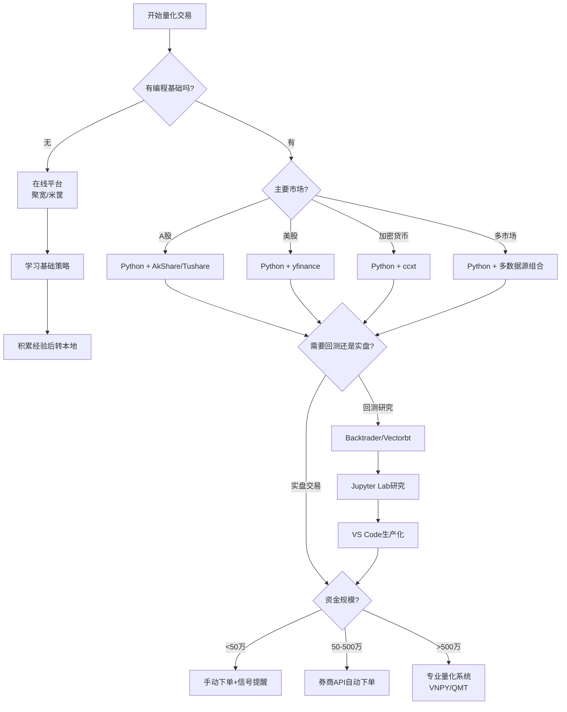

## 二、程序化交易工具

程序化交易的核心在于"用代码替代人工判断"。工欲善其事，必先利其器——选择合适的工具链，决定了你能否高效地将策略想法转化为可执行的交易系统。本节从Python量化生态、在线平台、本地环境搭建、数据基础设施、开发工作流五个维度，系统梳理程序化交易的工具体系。

### 2.1 Python量化生态全景

Python之所以成为量化交易的首选语言，并非因为它运行速度最快（C++和Rust在低延迟场景中更有优势），而是因为它的生态系统覆盖了量化交易的每一个环节——从数据获取、清洗、分析、回测到实盘部署，都有成熟的开源库支撑。

#### 2.1.1 基础计算层

| 库名 | 核心功能 | 为什么不可替代 | 典型用法 |
|------|----------|----------------|----------|
| **NumPy** | 多维数组运算、线性代数、随机数 | 几乎所有量化库的底层依赖，向量化运算比纯Python循环快100倍以上 | 收益率矩阵计算、协方差矩阵、蒙特卡洛模拟 |
| **Pandas** | 时间序列数据处理、DataFrame操作 | 量化分析的"瑞士军刀"，日期索引、滚动窗口、分组聚合一体化 | K线数据处理、因子计算、信号生成 |
| **SciPy** | 科学计算、优化求解、统计分布 | 投资组合优化（均值-方差模型）、假设检验的首选工具 | 最小方差组合求解、t检验、正态性检验 |

```python
import numpy as np
import pandas as pd

# 向量化计算日收益率 —— 比逐行循环快100倍
df['daily_return'] = df['close'].pct_change()

# 滚动计算20日波动率
df['volatility_20d'] = df['daily_return'].rolling(20).std() * np.sqrt(252)

# 计算滚动夏普比率（假设无风险利率2%）
risk_free_daily = 0.02 / 252
df['sharpe_60d'] = (
    (df['daily_return'].rolling(60).mean() - risk_free_daily) 
    / df['daily_return'].rolling(60).std() 
    * np.sqrt(252)
)
```

#### 2.1.2 数据获取层

数据是量化交易的"原材料"。不同数据源覆盖的市场、数据质量和接入方式差异很大：

| 库名 | 覆盖市场 | 是否免费 | 接入门槛 | 数据频率 | 适用场景 |
|------|----------|----------|----------|----------|----------|
| **Tushare** | A股、港股、期货、基金 | 基础免费（积分制） | 注册获取token | 日线/分钟线/实时 | A股策略开发首选 |
| **AkShare** | A股、港股、期货、外汇、加密货币 | 完全免费 | 无需注册 | 日线/分钟线 | 多市场数据获取 |
| **BaoStock** | A股历史数据 | 完全免费 | 无需注册 | 日线/周线/月线 | A股历史回测 |
| **yfinance** | 美股、全球指数 | 完全免费 | 无需注册 | 日线/分钟线 | 美股策略开发 |
| **ccxt** | 加密货币（100+交易所） | 完全免费 | 无需注册 | 实时/K线 | 加密货币量化 |

```python
# Tushare —— A股日线数据
import tushare as ts
ts.set_token('你的token')
pro = ts.pro_api()
df = pro.daily(ts_code='000001.SZ', start_date='20200101', end_date='20231231')

# AkShare —— 多市场数据，无需注册
import akshare as ak
df = ak.stock_zh_a_hist(symbol="000001", period="daily", 
                         start_date="20200101", end_date="20231231")

# BaoStock —— A股历史数据
import baostock as bs
bs.login()
rs = bs.query_history_k_data_plus("sh.600000", 
    "date,open,high,low,close,volume", start_date='2020-01-01')
df = rs.get_data()
bs.logout()
```

**数据源选择建议**：入门阶段用AkShare（免费、无需注册、覆盖面广）；A股深入开发用Tushare（数据更全、社区支持好）；多市场策略用ccxt（加密货币）+yfinance（美股）组合。

#### 2.1.3 策略回测层

回测框架是量化交易的"时间机器"——它让你用历史数据验证策略是否有效，而不用冒真金白银的风险。

| 框架 | 特点 | 学习曲线 | 社区活跃度 | 适合场景 |
|------|------|----------|------------|----------|
| **Backtrader** | 事件驱动、架构清晰、扩展性强 | 中等 | ★★★★★ | 通用回测，入门首选 |
| **Zipline** | Quantopian开源、pipeline机制 | 较高 | ★★★☆☆ | 因子研究、学术用途 |
| **Vectorbt** | 向量化回测、速度极快 | 中等 | ★★★★☆ | 参数优化、批量回测 |
| **VNPY** | 国产开源、支持实盘 | 较高 | ★★★★☆ | 回测+实盘一体化 |

```python
# Backtrader —— 最经典的Python回测框架
import backtrader as bt

class DualMAStrategy(bt.Strategy):
    """双均线策略示例"""
    params = (
        ('fast_period', 10),
        ('slow_period', 60),
        ('printlog', False),
    )
    
    def __init__(self):
        self.fast_ma = bt.indicators.SMA(period=self.p.fast_period)
        self.slow_ma = bt.indicators.SMA(period=self.p.slow_period)
        self.crossover = bt.indicators.CrossOver(self.fast_ma, self.slow_ma)
        self.order = None
    
    def next(self):
        if self.order:  # 有未完成订单则跳过
            return
        if not self.position:  # 无持仓
            if self.crossover > 0:  # 金叉
                self.order = self.buy()
        else:
            if self.crossover < 0:  # 死叉
                self.order = self.sell()
    
    def notify_order(self, order):
        if order.status in [order.Completed, order.Canceled, order.Margin]:
            self.order = None

# 初始化引擎
cerebro = bt.Cerebro()
cerebro.addstrategy(DualMAStrategy)
cerebro.broker.setcash(100000)
cerebro.broker.setcommission(commission=0.001)  # 万三手续费

# 添加数据并运行
data = bt.feeds.PandasData(dataname=df)
cerebro.adddata(data)
cerebro.addanalyzer(bt.analyzers.SharpeRatio, _name='sharpe')
cerebro.addanalyzer(bt.analyzers.DrawDown, _name='drawdown')
cerebro.addanalyzer(bt.analyzers.Returns, _name='returns')

results = cerebro.run()
strat = results[0]

print(f"夏普比率: {strat.analyzers.sharpe.get_analysis()['sharperatio']:.2f}")
print(f"最大回撤: {strat.analyzers.drawdown.get_analysis()['max']['drawdown']:.2f}%")
print(f"年化收益: {strat.analyzers.returns.get_analysis()['rnorm100']:.2f}%")
```

#### 2.1.4 技术分析层

| 库名 | 核心功能 | 特点 |
|------|----------|------|
| **TA-Lib** | 150+技术指标（MA/RSI/MACD/Bollinger等） | C语言实现，速度极快，行业标准 |
| **pandas-ta** | 纯Python技术指标库 | 安装简单（无需编译C扩展），覆盖主流指标 |
| **talipp** | 流式技术指标计算 | 支增量更新，适合实时行情处理 |

```python
# TA-Lib —— 行业标准技术指标库（需单独安装C库）
import talib

df['rsi_14'] = talib.RSI(df['close'], timeperiod=14)
df['macd'], df['macd_signal'], df['macd_hist'] = talib.MACD(
    df['close'], fastperiod=12, slowperiod=26, signalperiod=9
)
upper, middle, lower = talib.BBANDS(df['close'], timeperiod=20, nbdevup=2, nbdevdn=2)

# pandas-ta —— 纯Python替代方案（pip install pandas-ta即可）
import pandas_ta as ta
df.ta.rsi(length=14, append=True)  # 自动添加 RSI_14 列
df.ta.macd(fast=12, slow=26, signal=9, append=True)
```

> **TA-Lib安装注意事项**：TA-Lib的Python包依赖底层C库。Linux系统需先`apt install ta-lib`或从源码编译；macOS用`brew install ta-lib`；Windows需下载预编译的`.whl`文件。如果安装困难，pandas-ta是零门槛的替代方案。

#### 2.1.5 机器学习与因子分析层

| 库名 | 核心功能 | 典型用途 |
|------|----------|----------|
| **scikit-learn** | 经典机器学习（分类/回归/聚类） | 因子挖掘、收益预测、股票分类 |
| **XGBoost/LightGBM** | 梯度提升树 | 多因子选股模型、非线性因子组合 |
| **statsmodels** | 统计建模、时间序列分析 | 协整检验、ADF检验、VAR模型 |
| **Alphalens** | 因子分析（Quantopian出品） | IC分析、分层回测、因子衰减检测 |
| **PyPortfolioOpt** | 投资组合优化 | 均值-方差优化、Black-Litterman模型 |

```python
# 因子分析示例 —— Alphalens
import alphalens

# 准备因子数据和价格数据
factor = df['momentum_factor']  # 某个因子值
prices = df.pivot_table(values='close', index='date', columns='symbol')

# 生成Alphalens分析
factor_data = alphalens.utils.get_clean_factor_and_forward_returns(
    factor, prices, quantiles=5, periods=(1, 5, 10)
)

# 因子IC分析（信息系数）—— 衡量因子预测能力
alphalens.performance.factor_information_coefficient(factor_data)
alphalens.plotting.plot_ic_ts(factor_data)  # IC时间序列图
```

#### 2.1.6 可视化层

| 库名 | 特点 | 适用场景 |
|------|------|----------|
| **Matplotlib** | 基础绑图库，高度可定制 | 净值曲线、因子分布图 |
| **Plotly** | 交互式图表，支持缩放/悬停 | K线图、策略仪表盘 |
| **mplfinance** | 专注金融图表 | K线图（蜡烛图）、成交量图 |

```python
# mplfinance —— 专业K线图
import mplfinance as mpf

# 设置K线样式
mc = mpf.make_marketcolors(up='red', down='green',  # A股红涨绿跌
                            edge='inherit', wick='inherit')
s = mpf.make_mpf_style(marketcolors=mc, gridstyle='--')

# 绘制K线图（含均线和成交量）
mpf.plot(df.set_index('date'), type='candle', style=s,
         mav=(5, 20, 60), volume=True, title='平安银行日K线',
         figsize=(14, 8))
```

### 2.2 在线量化平台深度对比

在线平台的最大优势是"开箱即用"——无需搭建本地环境，注册即可开始策略开发。对于初学者和快速验证想法的场景，在线平台远比本地开发高效。

#### 2.2.1 主流平台对比

| 平台 | 费用模式 | 数据覆盖 | 回测速度 | 实盘接入 | 社区生态 | 最适合 |
|------|----------|----------|----------|----------|----------|--------|
| **聚宽（JoinQuant）** | 免费+付费 | A股/港股/期货/基金 | 分钟级快 | 支持（需付费） | ★★★★★ | 入门到进阶，社区学习 |
| **米筐（RiceQuant）** | 付费为主 | A股/港股/期货 | 快 | 支持 | ★★★★☆ | 专业研究，Jupyter集成 |
| **优矿（Uqer）** | 免费+付费 | A股/港股 | 中等 | 有限 | ★★★☆☆ | 机构用户，数据全面 |
| **掘金量化（Myquant）** | 付费 | A股/期货 | 快 | 支持 | ★★★★☆ | 本地+云端混合开发 |
| **Quantconnect** | 免费+付费 | 全球市场 | 快 | 支持 | ★★★★★ | 美股/全球策略 |

#### 2.2.2 聚宽平台使用指南

聚宽是国内用户量最大的在线量化平台，适合从零开始学习量化交易。

**核心功能模块**：

```text
聚宽平台
├── 数据中心
│   ├── 股票数据（日线/分钟线/Level2）
│   ├── 财务数据（三大报表/财务指标）
│   ├── 指数数据（沪深300/中证500等）
│   └── 另类数据（分析师预期/资金流）
├── 研究环境
│   ├── Jupyter Notebook
│   ├── 策略模板
│   └── 因子研究工具
├── 回测引擎
│   ├── 日级回测
│   ├── 分钟级回测
│   └── Tick级回测（付费）
├── 模拟交易
│   ├── 实时行情
│   └── 模拟下单
└── 社区
    ├── 策略分享
    ├── 学习教程
    └── 策略克隆
```

**聚宽策略开发流程**：

```python
# 聚宽策略示例 —— 均线交叉（平台内置API）
def initialize(context):
    """初始化函数，只运行一次"""
    set_benchmark('000300.XSHG')  # 设置基准为沪深300
    set_commission(PerTrade(buy_cost=0.0003, sell_cost=0.0003))  # 佣金
    set_slippage(PriceRelatedSlippage(0.002))  # 滑点
    context.stock = '000001.XSHE'  # 平安银行
    
def handle_data(context, data):
    """每个交易日运行一次"""
    stock = context.stock
    close = data.history(stock, 'close', 60, '1d')  # 获取60日收盘价
    
    ma_5 = close[-5:].mean()
    ma_20 = close[-20:].mean()
    
    current_position = context.portfolio.positions[stock].amount
    
    if ma_5 > ma_20 and current_position == 0:  # 金叉且无持仓
        order_target_value(stock, context.portfolio.available_cash * 0.95)
    elif ma_5 < ma_20 and current_position > 0:  # 死叉且有持仓
        order_target(stock, 0)
```

#### 2.2.3 在线平台的局限性

在线平台虽然方便，但有几个硬性限制需要了解：

| 局限性 | 具体表现 | 应对方案 |
|--------|----------|----------|
| **计算资源受限** | 回测时间有上限，复杂策略可能超时 | 简化逻辑或迁移到本地 |
| **数据权限分层** | 免费版数据范围有限，Tick数据需付费 | 关键数据本地存储 |
| **策略保密性** | 代码存储在第三方服务器 | 核心策略本地开发 |
| **实盘延迟** | 信号到下单有网络延迟 | 对延迟敏感的策略用本地 |
| **平台依赖风险** | 平台可能调整政策或停止服务 | 代码模块化，便于迁移 |

**经验法则**：初学阶段用在线平台快速验证想法；策略成熟后迁移到本地环境做深度优化和实盘部署。

### 2.3 本地开发环境搭建

当策略复杂度超出在线平台的承载能力，或者涉及核心策略的保密需求时，本地开发环境是必然选择。

#### 2.3.1 环境搭建步骤

```bash
# 第一步：安装Python（推荐3.10+）
# macOS（Homebrew）
brew install python@3.12

# Ubuntu/Debian
sudo apt update && sudo apt install python3.12 python3.12-venv

# Windows：从 python.org 下载安装包，勾选"Add to PATH"

# 第二步：创建独立虚拟环境（避免包冲突）
python3.12 -m venv ~/quant_env
source ~/quant_env/bin/activate  # Linux/Mac
# ~/quant_env/Scripts/activate   # Windows

# 第三步：升级pip并配置国内镜像
pip install --upgrade pip
pip config set global.index-url https://pypi.tuna.tsinghua.edu.cn/simple

# 第四步：安装核心库
pip install numpy pandas scipy matplotlib seaborn
pip install tushare akshare baostock yfinance
pip install backtrader vectorbt
pip install scikit-learn xgboost lightgbm statsmodels
pip install ta-lib  # 需先安装C库，见2.1.4节说明
pip install pandas-ta  # TA-Lib的纯Python替代
pip install jupyter notebook jupyterlab
pip install alphalens-reloaded pyfolio empyrical-reloaded

# 第五步：启动Jupyter Lab
jupyter lab --ip=0.0.0.0 --port=8888 --no-browser
```

#### 2.3.2 推荐的项目目录结构

```text
quant_project/
├── data/                    # 数据存储
│   ├── raw/                 # 原始数据
│   ├── processed/           # 清洗后数据
│   └── cache/               # 缓存数据
├── strategies/              # 策略代码
│   ├── dual_ma.py           # 双均线策略
│   ├── mean_reversion.py    # 均值回归策略
│   └── momentum.py          # 动量策略
├── backtest/                # 回测脚本
│   ├── run_backtest.py
│   └── results/             # 回测结果
├── live/                    # 实盘相关
│   ├── broker_api.py        # 券商接口封装
│   └── order_manager.py     # 订单管理
├── utils/                   # 工具函数
│   ├── data_loader.py       # 数据加载
│   ├── indicators.py        # 技术指标
│   └── risk_metrics.py      # 风险指标
├── notebooks/               # Jupyter研究笔记
├── config.yaml              # 配置文件
├── requirements.txt         # 依赖清单
└── README.md
```

#### 2.3.3 依赖管理最佳实践

```bash
# 生成精确的依赖清单（含版本号）
pip freeze > requirements.txt

# 从清单重建环境（团队协作或换机器时用）
pip install -r requirements.txt

# 推荐使用conda管理复杂依赖（特别是涉及C库时）
conda create -n quant python=3.12
conda activate quant
conda install numpy pandas scipy matplotlib
conda install -c conda-forge ta-lib  # conda安装TA-Lib更省心
```

### 2.4 数据基础设施

数据质量直接决定了策略研究的上限。垃圾数据进去，垃圾结果出来——再精妙的策略也救不了脏数据。

#### 2.4.1 数据分类与获取

**按市场分类**：

| 数据类型 | 内容 | 免费来源 | 付费来源 |
|----------|------|----------|----------|
| A股行情 | 日线/分钟线/Tick | AkShare/Tushare/BaoStock | Wind/Choice/通联 |
| A股财务 | 三大报表/财务指标 | Tushare/AkShare | Wind/Choice |
| 港股行情 | 日线/分钟线 | AkShare/Tushare | Wind/Bloomberg |
| 美股行情 | 日线/分钟线 | yfinance/Alpha Vantage | Wind/Bloomberg |
| 期货行情 | 日线/Tick | AkShare/Tushare | CTP接口/文华财经 |
| 加密货币 | 实时/K线 | ccxt/Binance API | — |

**按频率分类**：

```text
数据频率层级
├── Tick数据（逐笔成交）
│   ├── 存储量大（单只股票每天数万条）
│   ├── 适合高频策略
│   └── 获取成本高（Level2数据需付费）
├── 分钟线数据
│   ├── 存储量中等（每只股票每天~240条）
│   ├── 适合日内策略
│   └── 免费源可获取
├── 日线数据
│   ├── 存储量小（每只股票每年~250条）
│   ├── 适合中低频策略
│   └── 免费源覆盖完整
└── 财务/基本面数据
    ├── 季度更新
    ├── 适合价值投资/因子策略
    └── 免费源质量参差不齐
```

#### 2.4.2 数据清洗清单

获取原始数据后，必须进行清洗，否则回测结果不可信：

```python
def clean_stock_data(df):
    """A股数据清洗标准流程"""
    
    # 1. 处理缺失值
    df = df.dropna(subset=['open', 'high', 'low', 'close', 'volume'])
    
    # 2. 处理异常值（价格为0或负数）
    df = df[(df['close'] > 0) & (df['volume'] > 0)]
    
    # 3. 处理复权问题（前复权或后复权）
    df['adj_factor'] = df['adj_close'] / df['close']
    df['close_adj'] = df['close'] * df['adj_factor']
    
    # 4. 处理停牌日（移除无交易的日期）
    df = df[df['volume'] > 0]
    
    # 5. 处理涨跌停（A股涨跌停限制影响成交判断）
    df['pct_change'] = df['close_adj'].pct_change()
    df['is_limit_up'] = df['pct_change'] >= 0.095    # 涨停（近似10%）
    df['is_limit_down'] = df['pct_change'] <= -0.095  # 跌停
    
    # 6. 处理除权除息日
    # 除权日价格跳变不反映真实涨跌，需要复权处理
    
    # 7. 统一日期格式
    df['date'] = pd.to_datetime(df['date'])
    df = df.set_index('date').sort_index()
    
    return df
```

**存活者偏差（Survivorship Bias）**：这是量化回测中最容易犯的错误之一。如果你只用当前还在交易的股票做回测，就自动排除了那些退市、摘牌的股票——这些往往是最差的标的。正确的做法是使用"全样本"数据库，包含历史上所有上市过的股票。

#### 2.4.3 本地数据存储方案

当策略频繁读取数据时，每次都从API拉取既慢又不稳定。建议建立本地数据仓库：

```python
import sqlite3
import pandas as pd

class LocalDataStore:
    """基于SQLite的本地数据存储"""
    
    def __init__(self, db_path='data/stock_data.db'):
        self.conn = sqlite3.connect(db_path)
    
    def save_daily(self, symbol, df):
        """保存日线数据（增量更新）"""
        df.to_sql(f'daily_{symbol}', self.conn, 
                  if_exists='replace', index=False)
    
    def load_daily(self, symbol, start_date=None, end_date=None):
        """加载日线数据"""
        query = f"SELECT * FROM daily_{symbol}"
        if start_date:
            query += f" WHERE date >= '{start_date}'"
        if end_date:
            query += f" AND date <= '{end_date}'"
        return pd.read_sql(query, self.conn, parse_dates=['date'])
    
    def update_all(self, symbols, data_source):
        """批量增量更新"""
        for symbol in symbols:
            existing = self.load_daily(symbol)
            if len(existing) > 0:
                last_date = existing['date'].max()
                new_data = data_source(symbol, start=last_date)
            else:
                new_data = data_source(symbol)
            if len(new_data) > 0:
                self.save_daily(symbol, pd.concat([existing, new_data]))
```

**进阶方案**：数据量较大时（百万级记录以上），可以用**ClickHouse**（列式存储，查询极快）或**Parquet文件**（列式存储，压缩率高）替代SQLite。

### 2.5 开发工具与工作流

#### 2.5.1 IDE选择

| 工具 | 优势 | 适合场景 |
|------|------|----------|
| **VS Code + Python插件** | 轻量、扩展丰富、远程开发 | 日常开发首选 |
| **PyCharm Professional** | 调试强大、重构方便 | 大型项目开发 |
| **Jupyter Lab** | 交互式探索、可视化友好 | 策略研究、数据分析 |
| **Cursor/Windsurf** | AI辅助编程、代码生成 | 快速原型开发 |

**推荐工作流**：用Jupyter Lab做探索性研究（快速试错、可视化验证），策略逻辑验证后用VS Code/PyCharm将其重构为模块化的Python脚本。

#### 2.5.2 版本控制

量化策略开发必须使用Git进行版本管理。理由很简单：策略参数调整后效果可能变差，你需要能快速回退到任何一个历史版本。

```bash
# 初始化项目
git init && git flow init

# 策略开发使用feature分支
git checkout -b feature/momentum-v2

# 每次参数调整都要commit，写清变更内容
git add strategies/momentum.py
git commit -m "momentum: 将动量周期从20日调整为60日"

# 回测通过后合并到主分支
git checkout main && git merge feature/momentum-v2
```

#### 2.5.3 配置管理

将策略参数、数据源配置、回测参数集中管理，避免硬编码：

```yaml
# config.yaml —— 策略配置文件
strategy:
  name: "dual_ma"
  params:
    fast_period: 10
    slow_period: 60
    stop_loss: 0.05  # 5%止损

backtest:
  start_date: "2020-01-01"
  end_date: "2023-12-31"
  initial_capital: 100000
  commission: 0.0003
  slippage: 0.002

data:
  source: "tushare"  # 或 akshare
  token: "${TUSHARE_TOKEN}"  # 从环境变量读取
  cache_dir: "data/cache/"
```

```python
import yaml
import os

with open('config.yaml') as f:
    config = yaml.safe_load(f)

# 环境变量替换
token = os.environ.get('TUSHARE_TOKEN')
```

### 2.6 工具选择决策树

面对众多工具，初学者往往不知从何下手。以下决策树可以帮助你快速定位适合自己的工具组合：



**不同阶段的推荐工具组合**：

| 阶段 | 工具组合 | 预算 | 目标 |
|------|----------|------|------|
| **入门期**（0-3个月） | 聚宽 + Jupyter | 0元 | 理解量化逻辑，跑通第一个策略 |
| **成长期**（3-12个月） | Python本地 + AkShare + Backtrader | 0元 | 独立开发回测框架 |
| **进阶期**（1-2年） | Python + Tushare + Vectorbt + SQLite | Tushare积分 | 多策略组合、因子研究 |
| **实战期**（2年+） | VNPY/QMT + Wind/Choice + 生产数据库 | 数万元/年 | 实盘自动交易 |

### 2.7 常见工具使用误区

**误区一：一上来就搭本地环境**

很多初学者花大量时间配置环境、安装依赖，结果还没写过一行策略代码。正确做法是先用在线平台跑通一个简单策略，理解量化交易的完整流程后再迁移到本地。

**误区二：追求工具的"大而全"**

安装了20个库，用了不到5个。工具不是越多越好，核心组合是：Pandas（数据处理）+ 一个回测框架 + 一个数据源。把这三样用熟，比什么都装一点但都不精要强得多。

**误区三：忽略数据质量**

花了大量精力优化策略逻辑，但用的数据没有做复权处理、没有处理停牌、没有考虑存活者偏差。结果回测收益漂亮，实盘一塌糊涂。数据清洗应该在策略开发之前完成。

**误区四：在回测框架中纠结太久**

Backtrader、Zipline、Vectorbt各有优劣，但对于大多数策略而言，任何一个都能满足需求。不要花三个月对比框架，而是选一个开始写策略。

**误区五：忽视版本控制**

"这个参数昨天调过，效果更好，但我不记得具体值了。"——如果你用Git管理代码，这种事永远不会发生。每调一个参数就commit一次，附上回测结果截图，这就是你的策略研发日志。

***

