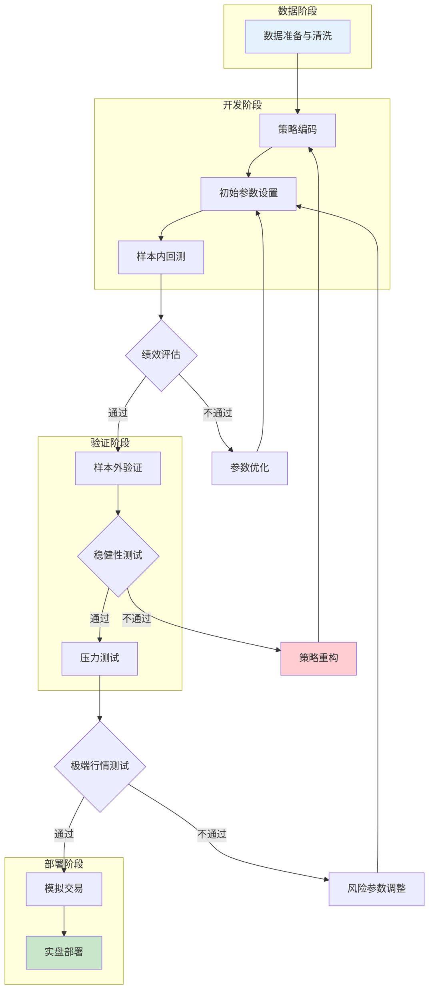

## 三、回测框架与方法

回测是量化策略从"想法"到"可执行方案"的关键验证环节。理论基础篇已经讲清了回测的原理和常见陷阱，本节聚焦实操——如何选择框架、如何写出正确的回测代码、如何解读报告、如何避免过度拟合、以及如何用高级方法提升回测的可靠性。

### 3.0 回测流程全景图

一个严谨的回测流程不是"跑一遍看收益"那么简单。下图展示了从数据准备到实盘部署的完整路径，每个环节都有明确的通过/不通过标准：



**各阶段核心任务**：

| 阶段 | 核心任务 | 通过标准 | 常见失败原因 |
|------|----------|----------|-------------|
| 数据阶段 | 获取、清洗、对齐历史数据 | 无缺失值、无未来数据泄露 | 存活者偏差、除权除息未处理 |
| 开发阶段 | 编码策略逻辑、设置参数、样本内回测 | 年化收益>无风险利率+风险溢价、夏普>1.0 | 逻辑错误、交易成本低估 |
| 验证阶段 | 样本外测试、参数稳健性、压力测试 | 样本外衰减<30%、参数敏感度低 | 过度拟合、极端行情崩溃 |
| 部署阶段 | 模拟盘运行、小资金实盘 | 模拟盘与回测偏差<20% | 滑点估计不足、执行延迟 |

### 3.1 主流回测框架对比与选择

Python生态中有多个成熟的回测框架，各有侧重。选择框架时需要考虑：数据源、回测速度、实盘对接能力、社区活跃度。

#### 3.1.1 框架全景对比

| 框架 | 驱动模式 | 回测速度 | 实盘对接 | A股支持 | 学习曲线 | 适用场景 |
|------|----------|----------|----------|---------|----------|----------|
| **Backtrader** | 事件驱动 | 中等 | 需扩展 | 需自行对接数据 | 中等 | 策略研究、中低频策略 |
| **VectorBT** | 向量化 | 极快 | 不支持 | 需自行对接数据 | 较低 | 快速原型验证、参数扫描 |
| **Zipline** | 事件驱动 | 中等 | 不支持 | 不原生支持 | 较高 | 美股研究、学术用途 |
| **VNPY** | 事件驱动 | 中等 | 原生支持 | 原生支持 | 较高 | 从研究到实盘的全流程 |
| **聚宽平台** | 事件驱动 | 快（云端） | 支持模拟盘 | 原生支持 | 低 | 入门学习、快速验证 |
| **QMT** | 事件驱动 | 快 | 券商直连 | 原生支持 | 中等 | 券商账户实盘交易 |

**选择建议**：

- **纯研究阶段**：聚宽/米筐平台（零部署、数据全、社区活跃）
- **本地化研究**：Backtrader（灵活、文档丰富）或 VectorBT（速度快10-100倍）
- **研究到实盘**：VNPY（国产、原生支持A股实盘）
- **券商实盘**：QMT（券商级稳定性、Level-2数据）
- **参数优化/扫描**：VectorBT（向量化计算，批量回测极快）

#### 3.1.2 VectorBT快速入门

VectorBT采用向量化计算，不需要逐K线循环，回测速度比事件驱动框架快10-100倍，非常适合参数扫描和快速验证：

```python
import vectorbt as vbt
import pandas as pd
import numpy as np

# 获取数据
price = vbt.YFData.download("AAPL", start="2020-01-01", end="2024-01-01").get("Close")

# 定义参数空间：快速均线 5-20，慢速均线 30-100
fast_windows = np.arange(5, 21, 1)
slow_windows = np.arange(30, 101, 5)

# 向量化计算所有均线组合
fast_ma, slow_ma = vbt.MA.run_combs(
    price, 
    window=np.concatenate([fast_windows, slow_windows]),
    r=2,  # 两两组合
    short_names=["fast", "slow"]
)

# 生成信号：金叉买入、死叉卖出
entries = fast_ma.ma_crossed_above(slow_ma)
exits = fast_ma.ma_crossed_below(slow_ma)

# 批量回测所有参数组合（一次完成，无需循环）
portfolio = vbt.Portfolio.from_signals(
    price, entries, exits,
    init_cash=100000,
    fees=0.001,
    freq="1D"
)

# 查看所有参数组合的收益
returns = portfolio.total_return()
print(returns.sort_values(ascending=False).head(10))

# 可视化热力图
returns_matrix = returns.vbt.unstack_to_dataframe()
returns_matrix.vbt.heatmap(
    xaxis_title="Slow Window",
    yaxis_title="Fast Window"
).show()
```

VectorBT的核心优势在于：一次向量化运算就能完成数千个参数组合的回测，而事件驱动框架需要逐个循环。当你需要做参数敏感性分析时，VectorBT的效率优势是压倒性的。

#### 3.1.3 VNPY入门与实盘对接

VNPY是国内量化交易者的首选框架之一，它不仅支持回测，还原生支持A股、期货的实盘交易：

```python
from vnpy.app.cta_strategy import (
    CtaTemplate,
    StopOrder,
    TickData,
    BarData,
    TradeData,
    BarGenerator,
    ArrayManager,
)

class DualMaStrategy(CtaTemplate):
    """双均线策略 - VNPY版本"""
    author = "quant_trader"
    
    fast_window = 10
    slow_window = 60
    
    fast_ma0 = 0.0
    slow_ma0 = 0.0
    
    parameters = ["fast_window", "slow_window"]
    variables = ["fast_ma0", "slow_ma0"]
    
    def __init__(self, cta_engine, strategy_name, vt_symbol, setting):
        super().__init__(cta_engine, strategy_name, vt_symbol, setting)
        self.bg = BarGenerator(self.on_bar)
        self.am = ArrayManager()
    
    def on_bar(self, bar: BarData):
        self.am.update_bar(bar)
        if not self.am.inited:
            return
        
        fast_ma = self.am.sma(self.fast_window)
        slow_ma = self.am.sma(self.slow_window)
        
        if self.pos == 0:
            if fast_ma > slow_ma:
                self.buy(bar.close_price, 100)
            elif fast_ma < slow_ma:
                self.short(bar.close_price, 100)
        elif self.pos > 0:
            if fast_ma < slow_ma:
                self.sell(bar.close_price, 100)
        elif self.pos < 0:
            if fast_ma > slow_ma:
                self.cover(bar.close_price, 100)
        
        self.fast_ma0 = fast_ma
        self.slow_ma0 = slow_ma
```

VNPY的优势在于回测代码几乎可以直接用于实盘，只需切换数据源和交易接口即可。但它的学习曲线比Backtrader陡峭，建议先在聚宽或Backtrader上跑通策略逻辑，再迁移到VNPY进行实盘对接。

### 3.2 Backtrader深度实战

Backtrader是Python回测框架中功能最全面、扩展性最强的选择。本节从基础到高级，覆盖Backtrader的核心用法。

#### 3.2.1 核心架构

Backtrader采用事件驱动架构，核心组件包括：

- **Cerebro**：引擎，管理数据、策略、经纪商、分析器之间的协调
- **Strategy**：策略类，定义交易逻辑
- **Broker**：经纪商模拟，管理资金、持仓、订单撮合
- **DataFeed**：数据源，支持CSV、Pandas DataFrame、在线数据等
- **Indicator**：技术指标，内置100+指标，支持自定义
- **Analyzer**：分析器，计算各类绩效指标
- **Observer**：观察者，实时跟踪交易、资金等状态

#### 3.2.2 完整回测模板

以下是一个生产级的Backtrader回测模板，包含了交易成本、滑点、分析器等关键配置：

```python
import backtrader as bt
import pandas as pd
from datetime import datetime

class DualMAStrategy(bt.Strategy):
    """双均线策略 - 带止损止盈"""
    params = (
        ('fast', 10),          # 快速均线周期
        ('slow', 60),          # 慢速均线周期
        ('stop_loss', 0.05),   # 止损比例 5%
        ('take_profit', 0.15), # 止盈比例 15%
        ('printlog', True),    # 是否打印日志
    )
    
    def __init__(self):
        self.fast_ma = bt.indicators.SMA(period=self.p.fast)
        self.slow_ma = bt.indicators.SMA(period=self.p.slow)
        self.crossover = bt.indicators.CrossOver(self.fast_ma, self.slow_ma)
        self.atr = bt.indicators.ATR(period=14)  # ATR用于动态止损
        self.order = None
        self.buy_price = None
        self.buy_comm = None
    
    def log(self, txt, dt=None):
        if self.p.printlog:
            dt = dt or self.datas[0].datetime.date(0)
            print(f'{dt.isoformat()} {txt}')
    
    def notify_order(self, order):
        if order.status in [order.Submitted, order.Accepted]:
            return
        if order.status in [order.Completed]:
            if order.isbuy():
                self.buy_price = order.executed.price
                self.buy_comm = order.executed.comm
                self.log(f'买入: 价格={order.executed.price:.2f}, '
                        f'成本={order.executed.comm:.2f}')
            else:
                self.log(f'卖出: 价格={order.executed.price:.2f}, '
                        f'成本={order.executed.comm:.2f}')
        elif order.status in [order.Canceled, order.Margin, order.Rejected]:
            self.log('订单被拒绝/取消')
        self.order = None
    
    def notify_trade(self, trade):
        if not trade.isclosed:
            return
        self.log(f'交易利润: 毛利={trade.pnl:.2f}, 净利={trade.pnlcomm:.2f}')
    
    def next(self):
        if self.order:
            return
        if not self.position:
            if self.crossover > 0:
                self.order = self.buy()
        else:
            # 止损检查
            if self.buy_price:
                stop_price = self.buy_price * (1.0 - self.p.stop_loss)
                if self.data.close[0] < stop_price:
                    self.log(f'触发止损: 当前={self.data.close[0]:.2f}, '
                            f'止损线={stop_price:.2f}')
                    self.order = self.sell()
                    return
                # 止盈检查
                take_profit_price = self.buy_price * (1.0 + self.p.take_profit)
                if self.data.close[0] > take_profit_price:
                    self.log(f'触发止盈: 当前={self.data.close[0]:.2f}, '
                            f'止盈线={take_profit_price:.2f}')
                    self.order = self.sell()
                    return
            # 死叉卖出
            if self.crossover < 0:
                self.order = self.sell()


def run_backtest(strategy_class, data_df, params=None, cash=100000):
    """标准化回测运行函数"""
    cerebro = bt.Cerebro()
    
    # 添加策略
    if params:
        cerebro.addstrategy(strategy_class, **params)
    else:
        cerebro.addstrategy(strategy_class)
    
    # 设置经纪商
    cerebro.broker.setcash(cash)
    cerebro.broker.setcommission(commission=0.001)  # 万分之十
    cerebro.broker.set_slippage_perc(0.001)          # 0.1%滑点
    
    # 添加数据
    data = bt.feeds.PandasData(dataname=data_df)
    cerebro.adddata(data)
    
    # 添加分析器
    cerebro.addanalyzer(bt.analyzers.SharpeRatio, 
                       _name='sharpe', riskfreerate=0.03)
    cerebro.addanalyzer(bt.analyzers.DrawDown, _name='drawdown')
    cerebro.addanalyzer(bt.analyzers.TradeAnalyzer, _name='trades')
    cerebro.addanalyzer(bt.analyzers.Returns, _name='returns')
    cerebro.addanalyzer(bt.analyzers.SQN, _name='sqn')
    
    # 运行回测
    results = cerebro.run()
    strat = results[0]
    
    # 提取结果
    sharpe = strat.analyzers.sharpe.get_analysis()
    drawdown = strat.analyzers.drawdown.get_analysis()
    trades = strat.analyzers.trades.get_analysis()
    returns = strat.analyzers.returns.get_analysis()
    sqn = strat.analyzers.sqn.get_analysis()
    
    report = {
        '初始资金': cash,
        '最终资金': cerebro.broker.getvalue(),
        '总收益率': (cerebro.broker.getvalue() / cash - 1) * 100,
        '年化收益率': returns.get('rnorm100', 0),
        '夏普比率': sharpe.get('sharperatio', 0),
        '最大回撤': drawdown.max.drawdown,
        '最大回撤持续天数': drawdown.max.len,
        '总交易次数': trades.total.total,
        '盈利交易次数': trades.total.won,
        '亏损交易次数': trades.total.lost,
        '胜率': trades.won.total / trades.total.total * 100 if trades.total.total > 0 else 0,
        'SQN': sqn.get('sqn', 0),
    }
    
    return report, cerebro


# 使用示例
if __name__ == '__main__':
    # 假设 df 是包含 datetime, open, high, low, close, volume 的 DataFrame
    df = pd.read_csv('stock_data.csv', parse_dates=['datetime'], index_col='datetime')
    
    report, cerebro = run_backtest(
        DualMAStrategy, 
        df, 
        params={'fast': 10, 'slow': 60, 'stop_loss': 0.05},
        cash=100000
    )
    
    for key, value in report.items():
        if isinstance(value, float):
            print(f'{key}: {value:.2f}')
        else:
            print(f'{key}: {value}')
    
    cerebro.plot(style='candle')
```

#### 3.2.3 自定义佣金模型

不同市场、不同券商的佣金结构差异很大。Backtrader支持自定义佣金模型：

```python
class ChinaStockCommission(bt.CommInfoBase):
    """A股佣金模型：包含佣金、印花税、过户费"""
    params = (
        ('commission', 0.0003),   # 佣金万三
        ('stamp_tax', 0.0005),    # 印花税千分之五（仅卖出）
        ('transfer_fee', 0.00001),# 过户费万分之0.1
        ('min_commission', 5),    # 最低佣金5元
        ('stocklike', True),
        ('commtype', bt.CommInfoBase.COMM_PERC),
    )
    
    def _getcommission(self, size, price, pseudoexec):
        # 计算基础佣金
        turnover = abs(size) * price
        commission = turnover * self.p.commission
        # 最低佣金限制
        commission = max(commission, self.p.min_commission)
        # 印花税（仅卖出收取）
        if size < 0:
            commission += turnover * self.p.stamp_tax
        # 过户费
        commission += turnover * self.p.transfer_fee
        return commission

# 使用自定义佣金模型
cerebro.broker.addcommissioninfo(ChinaStockCommission())
```

#### 3.2.4 多品种回测

实际策略往往涉及多个品种，Backtrader支持多数据源同时回测：

```python
class PairTradingStrategy(bt.Strategy):
    """配对交易策略示例"""
    params = (
        ('spread_mean', 0),
        ('spread_std', 1),
        ('z_entry', 2.0),    # Z-score开仓阈值
        ('z_exit', 0.5),     # Z-score平仓阈值
        ('lookback', 60),    # 计算均值的回看周期
    )
    
    def __init__(self):
        self.spread = self.datas[0].close - self.datas[1].close
        self.spread_mean = bt.indicators.SMA(self.spread, period=self.p.lookback)
        self.spread_std = bt.indicators.StdDev(self.spread, period=self.p.lookback)
        self.zscore = (self.spread - self.spread_mean) / self.spread_std
    
    def next(self):
        z = self.zscore[0]
        if not self.position:
            if z > self.p.z_entry:   # 价差过高：做空价差
                self.sell(data=self.datas[0])
                self.buy(data=self.datas[1])
            elif z < -self.p.z_entry: # 价差过低：做多价差
                self.buy(data=self.datas[0])
                self.sell(data=self.datas[1])
        else:
            if abs(z) < self.p.z_exit:  # 价差回归：平仓
                self.close(data=self.datas[0])
                self.close(data=self.datas[1])

# 添加多个数据源
cerebro = bt.Cerebro()
data1 = bt.feeds.PandasData(dataname=stock_a_df, name='StockA')
data2 = bt.feeds.PandasData(dataname=stock_b_df, name='StockB')
cerebro.adddata(data1)
cerebro.adddata(data2)
cerebro.addstrategy(PairTradingStrategy)
```

### 3.3 回测报告深度解读

回测报告不是"收益越高越好"。一份有意义的回测报告需要从多个维度交叉验证策略质量。

#### 3.3.1 核心指标详解

| 指标 | 计算公式 | 合格标准 | 意义 | 常见误区 |
|------|----------|----------|------|----------|
| **年化收益率** | (最终净值/初始净值)^(252/交易日数) - 1 | >无风险利率+风险溢价(约8-15%) | 策略的盈利能力 | 牛市中不能说明策略好坏 |
| **夏普比率** | (年化收益-无风险利率)/年化波动率 | >1.0为良好，>2.0为优秀 | 单位风险的超额收益 | 波动率低时夏普虚高 |
| **最大回撤** | 最高点到最低点的最大跌幅 | <20%为稳健，<10%为优秀 | 最坏情况的损失 | 不代表未来最大回撤 |
| **卡玛比率** | 年化收益率/最大回撤 | >1.0为良好，>3.0为优秀 | 收益与极端风险的权衡 | 回撤小时卡玛虚高 |
| **胜率** | 盈利次数/总交易次数 | 因策略而异(趋势30-40%，均值回归60-70%) | 交易的准确度 | 高胜率不代表高收益 |
| **盈亏比** | 平均盈利/平均亏损 | >1.5为良好，>2.0为优秀 | 盈利交易的质量 | 需结合胜率看 |
| **SQN** | sqrt(交易次数)*平均R/标准差R | >2.0为良好，>3.0为优秀 | 系统质量的综合度量 | 交易次数少时不可靠 |
| **年化波动率** | 日收益率标准差 * sqrt(252) | <20%为稳健 | 策略的风险水平 | 不区分上行和下行波动 |
| **Sortino比率** | (年化收益-目标收益)/下行波动率 | >2.0为优秀 | 下行风险调整收益 | 比夏普更精确 |

#### 3.3.2 指标之间的关系

单独看任何一个指标都可能产生误导。以下是关键的指标组合分析：

**收益-风险三角**：年化收益率、最大回撤、夏普比率三者相互制约。高收益+低回撤+高夏普几乎不可能长期维持——如果回测结果显示这三者都极好，几乎可以肯定策略存在过度拟合或数据问题。

**胜率-盈亏比权衡**：趋势跟踪策略通常胜率低（30-40%）但盈亏比高（3-5倍），靠少数大盈利覆盖多数小亏损。均值回归策略通常胜率高（60-70%）但盈亏比低（1-2倍），靠频繁小盈利积累收益。两种模式都能赚钱，但逻辑完全不同。

**交易频率与统计显著性**：交易次数太少，任何指标都不可靠。经验法则是至少需要30-50次交易才能对胜率做出统计推断，至少需要3-5年的数据才能评估策略在不同市场环境下的表现。

#### 3.3.3 自动化报告生成

```python
import backtrader as bt
import pandas as pd
from datetime import datetime

def generate_backtest_report(results, cerebro, benchmark_return=None):
    """生成完整的回测报告"""
    strat = results[0]
    
    # 提取各项分析结果
    sharpe = strat.analyzers.sharpe.get_analysis()
    drawdown = strat.analyzers.drawdown.get_analysis()
    trades = strat.analyzers.trades.get_analysis()
    returns = strat.analyzers.returns.get_analysis()
    sqn = strat.analyzers.sqn.get_analysis()
    
    # 计算额外指标
    final_value = cerebro.broker.getvalue()
    initial_value = cerebro.broker.getvalue()  # 需要在运行前保存初始值
    total_return = (final_value / initial_value - 1) * 100
    
    # 交易统计
    total_trades = trades.total.total if hasattr(trades, 'total') else 0
    won_trades = trades.total.won if hasattr(trades, 'total') else 0
    lost_trades = trades.total.lost if hasattr(trades, 'total') else 0
    win_rate = won_trades / total_trades * 100 if total_trades > 0 else 0
    
    # 平均盈亏
    avg_won = trades.won.pnl.average if hasattr(trades, 'won') and trades.won.total > 0 else 0
    avg_lost = trades.lost.pnl.average if hasattr(trades, 'lost') and trades.lost.total > 0 else 0
    profit_factor = abs(avg_won / avg_lost) if avg_lost != 0 else float('inf')
    
    report = {
        '--- 资金概况 ---': '',
        '初始资金': f'{initial_value:,.0f}',
        '最终资金': f'{final_value:,.0f}',
        '总收益率': f'{total_return:.2f}%',
        '年化收益率': f'{returns.get("rnorm100", 0):.2f}%',
        '--- 风险指标 ---': '',
        '年化波动率': f'{returns.get("annual_vol", 0)*100:.2f}%',
        '最大回撤': f'{drawdown.max.drawdown:.2f}%',
        '最大回撤持续天数': f'{drawdown.max.len}天',
        '夏普比率': f'{sharpe.get("sharperatio", 0):.2f}',
        'SQN': f'{sqn.get("sqn", 0):.2f}',
        '--- 交易统计 ---': '',
        '总交易次数': f'{total_trades}',
        '盈利次数': f'{won_trades}',
        '亏损次数': f'{lost_trades}',
        '胜率': f'{win_rate:.1f}%',
        '平均盈利': f'{avg_won:,.2f}',
        '平均亏损': f'{avg_lost:,.2f}',
        '盈亏比': f'{profit_factor:.2f}',
    }
    
    # 如果有基准收益，计算超额收益
    if benchmark_return is not None:
        alpha = returns.get("rnorm100", 0) - benchmark_return
        report['基准收益率'] = f'{benchmark_return:.2f}%'
        report['超额收益(Alpha)'] = f'{alpha:.2f}%'
    
    # 打印报告
    print('\n' + '='*50)
    print('         回 测 报 告')
    print('='*50)
    for key, value in report.items():
        if value == '':
            print(f'\n{key}')
        else:
            print(f'  {key:<20} {value}')
    print('='*50)
    
    return report
```

### 3.4 过度拟合的识别与防范

过度拟合是量化策略开发中最隐蔽、最致命的陷阱。一个在回测中表现完美的策略，往往在实盘中表现糟糕，根源就在于过度拟合。

#### 3.4.1 过度拟合的本质

过度拟合的本质是：策略参数过多地适配了历史数据中的噪声，而非真正的市场规律。类比机器学习中的概念——策略在训练集（样本内数据）上表现优异，但在测试集（样本外数据）上表现糟糕。

过度拟合的危险在于它"看起来很好"。回测曲线平滑上升、夏普比率很高、最大回撤很小——这些都是过度拟合的典型特征。真正有效的策略在回测中通常不会"完美"，因为市场本身充满噪声。

#### 3.4.2 识别信号

以下信号提示策略可能存在过度拟合：

| 信号 | 描述 | 检验方法 |
|------|------|----------|
| 参数敏感 | 参数微调后收益剧变 | 参数网格扫描，绘制热力图 |
| 规则过多 | 策略包含5个以上条件分支 | 统计策略代码中的if/else数量 |
| 样本外衰减 | 样本外收益<样本内收益的50% | 分段回测对比 |
| 交易次数少 | 策略只产生了很少的交易信号 | 检查总交易次数是否>30次 |
| 逻辑说不通 | 签略规则无法用经济学原理解释 | 写出策略的经济学逻辑链 |
| 参数过多 | 需要优化的参数>4个 | 统计策略的可调参数数量 |

#### 3.4.3 防范方法一：样本内/样本外划分

最基本的防范方法是将数据划分为训练集和测试集：

```python
def split_data(df, train_ratio=0.7):
    """将数据划分为样本内和样本外"""
    split_idx = int(len(df) * train_ratio)
    train_data = df.iloc[:split_idx]
    test_data = df.iloc[split_idx:]
    print(f'样本内期间: {train_data.index[0]} 至 {train_data.index[-1]}')
    print(f'样本外期间: {test_data.index[0]} 至 {test_data.index[-1]}')
    print(f'样本内数据量: {len(train_data)} 条')
    print(f'样本外数据量: {len(test_data)} 条')
    return train_data, test_data

# 在样本内数据上优化参数
train_df, test_df = split_data(df, train_ratio=0.7)
report_in, _ = run_backtest(DualMAStrategy, train_df, params={'fast': 10, 'slow': 60})
report_out, _ = run_backtest(DualMAStrategy, test_df, params={'fast': 10, 'slow': 60})

# 比较样本内外表现
print(f'样本内年化收益: {report_in["年化收益率"]:.2f}%')
print(f'样本外年化收益: {report_out["年化收益率"]:.2f}%')
decay = 1 - report_out["年化收益率"] / report_in["年化收益率"]
print(f'收益衰减: {decay*100:.1f}%')
if decay > 0.5:
    print('警告：样本外收益衰减超过50%，可能存在过度拟合')
```

#### 3.4.4 防范方法二：Walk-Forward优化

Walk-Forward（滚动优化）是最接近实盘场景的验证方法。它模拟了"定期重新优化参数"的实际操作流程：

```python
def walk_forward_backtest(df, strategy_class, param_grid, 
                          train_window=504, test_window=63, step=63):
    """
    Walk-Forward优化
    train_window: 训练窗口（交易日数，504≈2年）
    test_window: 测试窗口（交易日数，63≈3个月）
    step: 滚动步长（交易日数，63≈3个月）
    """
    results = []
    n = len(df)
    
    for start in range(0, n - train_window - test_window + 1, step):
        train_end = start + train_window
        test_end = train_end + test_window
        
        train_data = df.iloc[start:train_end]
        test_data = df.iloc[train_end:test_end]
        
        # 在训练集上寻找最优参数
        best_sharpe = -999
        best_params = None
        for params in param_grid:
            report, _ = run_backtest(strategy_class, train_data, params=params)
            if report['夏普比率'] and report['夏普比率'] > best_sharpe:
                best_sharpe = report['夏普比率']
                best_params = params
        
        # 在测试集上验证最优参数
        if best_params:
            report, _ = run_backtest(strategy_class, test_data, params=best_params)
            report['训练期'] = f'{train_data.index[0].date()} - {train_data.index[-1].date()}'
            report['测试期'] = f'{test_data.index[0].date()} - {test_data.index[-1].date()}'
            report['最优参数'] = best_params
            results.append(report)
    
    # 汇总Walk-Forward结果
    wf_df = pd.DataFrame(results)
    avg_return = wf_df['年化收益率'].mean()
    avg_sharpe = wf_df['夏普比率'].mean()
    print(f'Walk-Forward平均年化收益: {avg_return:.2f}%')
    print(f'Walk-Forward平均夏普比率: {avg_sharpe:.2f}')
    print(f'各期收益标准差: {wf_df["年化收益率"].std():.2f}%')
    return wf_df

# 参数网格
import itertools
fast_range = range(5, 21, 5)
slow_range = range(40, 101, 10)
param_grid = [{'fast': f, 'slow': s} for f, s in itertools.product(fast_range, slow_range)]

wf_results = walk_forward_backtest(df, DualMAStrategy, param_grid)
```

Walk-Forward的核心思想是：你不能用未来数据优化参数，就像在实盘中你不可能提前知道未来3个月的最佳参数一样。如果策略在Walk-Forward测试中仍然稳定盈利，说明它确实捕捉到了某种持续有效的市场规律。

#### 3.4.5 防范方法三：参数敏感性分析

稳健的策略应该在参数小范围变化时仍然表现良好。如果策略参数从(10, 60)变为(11, 61)后收益剧变，说明策略对参数过于敏感，实盘中很难维持回测时的表现。

```python
import numpy as np

def parameter_sensitivity(df, strategy_class, base_params, param_name, 
                          test_values):
    """
    单参数敏感性分析
    base_params: 基准参数字典
    param_name: 要测试的参数名
    test_values: 测试值列表
    """
    results = []
    for val in test_values:
        params = base_params.copy()
        params[param_name] = val
        report, _ = run_backtest(strategy_class, df, params=params)
        results.append({
            'param_value': val,
            'annual_return': report['年化收益率'],
            'sharpe': report['夏普比率'],
            'max_drawdown': report['最大回撤'],
        })
    
    result_df = pd.DataFrame(results)
    
    # 计算敏感性指标
    return_std = result_df['annual_return'].std()
    return_mean = result_df['annual_return'].mean()
    cv = return_std / abs(return_mean) if return_mean != 0 else float('inf')
    
    print(f'参数 {param_name} 敏感性分析:')
    print(f'  收益均值: {return_mean:.2f}%')
    print(f'  收益标准差: {return_std:.2f}%')
    print(f'  变异系数(CV): {cv:.2f}')
    if cv > 0.5:
        print(f'  警告：变异系数>0.5，策略对该参数敏感')
    else:
        print(f'  良好：变异系数<0.5，策略对该参数稳健')
    
    return result_df

# 测试快速均线参数敏感性
sensitivity = parameter_sensitivity(
    df, DualMAStrategy, 
    base_params={'slow': 60},
    param_name='fast',
    test_values=range(5, 21)
)
```

#### 3.4.6 防范方法四：蒙特卡洛模拟

蒙特卡洛模拟通过随机打乱交易顺序，生成收益分布的置信区间，帮助你理解策略收益的不确定性范围：

```python
import numpy as np

def monte_carlo_simulation(trade_returns, n_simulations=10000, 
                           initial_capital=100000):
    """
    蒙特卡洛模拟：打乱交易顺序，生成收益分布
    trade_returns: 每笔交易的收益率列表
    """
    n_trades = len(trade_returns)
    final_values = []
    max_drawdowns = []
    
    for _ in range(n_simulations):
        # 随机打乱交易顺序
        shuffled = np.random.permutation(trade_returns)
        # 计算累积收益曲线
        equity = initial_capital * np.cumprod(1 + shuffled)
        final_values.append(equity[-1])
        # 计算最大回撤
        peak = np.maximum.accumulate(equity)
        drawdown = (equity - peak) / peak
        max_drawdowns.append(drawdown.min() * -100)
    
    final_values = np.array(final_values)
    max_drawdowns = np.array(max_drawdowns)
    
    print('蒙特卡洛模拟结果 (10000次):')
    print(f'  最终资金 - 均值: {np.mean(final_values):,.0f}')
    print(f'  最终资金 - 5%分位: {np.percentile(final_values, 5):,.0f}')
    print(f'  最终资金 - 95%分位: {np.percentile(final_values, 95):,.0f}')
    print(f'  最大回撤 - 均值: {np.mean(max_drawdowns):.2f}%')
    print(f'  最大回撤 - 95%分位: {np.percentile(max_drawdowns, 95):.2f}%')
    print(f'  亏损概率: {(final_values < initial_capital).mean()*100:.1f}%')
    
    return final_values, max_drawdowns

# 假设从回测中提取了每笔交易的收益率
# trade_returns = [0.02, -0.01, 0.03, -0.02, ...]
# mc_final, mc_dd = monte_carlo_simulation(trade_returns)
```

蒙特卡洛模拟的核心价值在于：即使回测显示策略盈利，如果蒙特卡洛模拟显示亏损概率超过30%，说明策略的盈利可能只是特定交易顺序下的运气。95%分位的最大回撤可以作为实盘中的风险预算参考。

### 3.5 回测陷阱与调试方法

回测中的bug比普通程序更难发现——因为即使代码有错，回测也能"正常"运行并输出结果。以下是最常见的回测错误及其调试方法。

#### 3.5.1 常见错误清单

| 错误类型 | 具体表现 | 后果 | 调试方法 |
|----------|----------|------|----------|
| **未来函数** | 使用了t时刻才能获得的数据 | 回测收益虚高 | 逐日打印信号，检查信号是否在收盘前产生 |
| **价格错误** | 使用收盘价而非下一开盘价成交 | 回测收益偏高 | 对比成交价与实际可获得价格 |
| **成本遗漏** | 未计算滑点、印花税 | 回测收益偏高 | 加入成本后对比收益差异 |
| **存活者偏差** | 只用当前存续股票回测 | 回测收益系统性偏高 | 使用包含退市股票的数据库 |
| **整数除法** | Python 2的整数除法问题 | 计算结果错误 | 使用Python 3或显式float转换 |
| **时区混乱** | 混用不同时区的时间戳 | 信号错位 | 统一使用UTC或本地时间 |
| **数据对齐** | 多品种数据时间戳不对齐 | 信号延迟或提前 | 检查数据索引是否完全一致 |

#### 3.5.2 调试流程

当回测结果"太好"时，按以下流程排查：

```python
def debug_strategy(cerebro, results, df):
    """回测结果调试检查清单"""
    strat = results[0]
    
    print("=== 回测调试检查清单 ===\n")
    
    # 1. 检查数据
    print("1. 数据检查:")
    print(f"   数据起止: {df.index[0]} 至 {df.index[-1]}")
    print(f"   数据条数: {len(df)}")
    print(f"   是否有缺失值: {df.isnull().any().any()}")
    print(f"   是否有零值: {(df['close'] == 0).any()}")
    
    # 2. 检查交易统计
    trades = strat.analyzers.trades.get_analysis()
    total = trades.total.total if hasattr(trades, 'total') else 0
    print(f"\n2. 交易统计:")
    print(f"   总交易次数: {total}")
    if total < 30:
        print(f"   警告: 交易次数<30，统计意义不足")
    if total > len(df) * 0.5:
        print(f"   警告: 交易频率过高，可能存在未来函数")
    
    # 3. 检查收益合理性
    returns = strat.analyzers.returns.get_analysis()
    annual_return = returns.get('rnorm100', 0)
    print(f"\n3. 收益合理性:")
    print(f"   年化收益率: {annual_return:.2f}%")
    if annual_return > 100:
        print(f"   警告: 年化收益>100%，请重点检查是否存在未来函数")
    if annual_return < 0:
        print(f"   注意: 策略亏损，需要重新审视策略逻辑")
    
    # 4. 检查夏普比率
    sharpe = strat.analyzers.sharpe.get_analysis()
    sharpe_val = sharpe.get('sharperatio', 0)
    print(f"\n4. 夏普比率: {sharpe_val:.2f}")
    if sharpe_val > 3:
        print(f"   警告: 夏普>3，极不寻常，强烈建议检查是否存在未来函数或数据错误")
    
    # 5. 检查最大回撤
    drawdown = strat.analyzers.drawdown.get_analysis()
    max_dd = drawdown.max.drawdown
    print(f"\n5. 最大回撤: {max_dd:.2f}%")
    if max_dd < 5:
        print(f"   警告: 最大回撤<5%，过于完美，建议检查")
    
    print("\n=== 调试完成 ===")
```

#### 3.5.3 常见陷阱深度解析

**陷阱一：成交价格假设不现实**

回测中最常见的错误是假设以信号产生时的价格成交。例如，策略在日线级别以收盘价产生买入信号，但实际执行时只能以次日开盘价买入。如果次日跳空高开，实际成本会高于回测假设。

解决方案是在Backtrader中设置合理的执行价格：

```python
# 不好的做法：以当日收盘价成交（不现实）
# 好的做法：以下一日开盘价成交
cerebro.broker.set_coc(True)  # cheat-on-close: 以当日收盘价成交（仅用于特定场景）
# 或者更好：不设置coc，默认以次日开盘价成交
```

**陷阱二：滑点模型过于简单**

固定的百分比滑点（如0.1%）不够真实。实际上，滑点与流动性、波动率、订单大小密切相关。更精确的滑点模型应该考虑这些因素：

```python
class VariableSlippage(bt.CommInfoBase):
    """基于波动率的动态滑点模型"""
    params = (
        ('slippage_factor', 0.5),  # 滑点因子
        ('stocklike', True),
        ('commtype', bt.CommInfoBase.COMM_PERC),
    )
    
    def _getcommission(self, size, price, pseudoexec):
        # 基于ATR的动态滑点
        atr = self.strategy.atr[0] if hasattr(self.strategy, 'atr') else price * 0.02
        slippage_pct = (atr / price) * self.p.slippage_factor
        turnover = abs(size) * price
        return turnover * slippage_pct
```

### 3.6 高级回测技术

#### 3.6.1 多时间框架回测

很多策略需要结合不同时间周期的信息。例如，日线级别判断趋势方向，小时级别寻找入场时机：

```python
class MultiTimeframeStrategy(bt.Strategy):
    """多时间框架策略示例"""
    params = (
        ('daily_trend_period', 20),   # 日线趋势周期
        ('hourly_entry_period', 5),   # 小时线入场周期
    )
    
    def __init__(self):
        # self.datas[0] 是小时线数据
        # self.datas[1] 是日线数据
        self.hourly_ma = bt.indicators.SMA(
            self.datas[0], period=self.p.hourly_entry_period)
        self.daily_ma = bt.indicators.SMA(
            self.datas[1], period=self.p.daily_trend_period)
    
    def next(self):
        # 日线趋势向上 + 小时线金叉 → 买入
        daily_up = self.datas[1].close[0] > self.daily_ma[0]
        hourly_cross = self.datas[0].close[0] > self.hourly_ma[0]
        
        if daily_up and hourly_cross and not self.position:
            self.buy()
        elif not daily_up and self.position:
            self.sell()
```

#### 3.6.2 机器学习信号集成

将机器学习模型的预测信号集成到回测框架中：

```python
class MLSignalStrategy(bt.Strategy):
    """集成机器学习信号的策略"""
    params = (
        ('signal_threshold', 0.6),  # 预测概率阈值
    )
    
    def __init__(self):
        # 假设ml_signal是一个预先计算好的预测信号序列
        # 每个值代表下一个周期上涨的概率
        self.ml_signal = self.datas[0].ml_signal  # 自定义数据源
    
    def next(self):
        prob = self.ml_signal[0]
        if prob > self.p.signal_threshold and not self.position:
            self.buy()
        elif prob < (1 - self.p.signal_threshold) and self.position:
            self.sell()
```

#### 3.6.3 组合策略回测

实际投资中通常不是单一策略，而是多个策略的组合。回测组合策略需要考虑策略间的相关性：

```python
def portfolio_backtest(strategies_with_weights, data_dict, cash=1000000):
    """
    组合策略回测
    strategies_with_weights: [(strategy_class, params, weight), ...]
    data_dict: {symbol: dataframe, ...}
    """
    total_weight = sum(w for _, _, w in strategies_with_weights)
    
    portfolio_returns = []
    
    for strategy_class, params, weight in strategies_with_weights:
        # 对每个子策略进行回测
        report, cerebro = run_backtest(
            strategy_class, 
            data_dict['default'],
            params=params,
            cash=cash * weight / total_weight
        )
        # 提取每日收益率
        # ... (需要自定义分析器提取每日净值)
    
    # 计算组合收益（按权重加权）
    # 计算组合夏普、最大回撤等
    # 分析策略间的相关性
```

### 3.7 回测最佳实践清单

将以上内容总结为可执行的检查清单，在每次回测时逐项确认：

| 检查项 | 具体内容 | 通过标准 |
|--------|----------|----------|
| 数据质量 | 检查缺失值、零值、异常值 | 无明显数据问题 |
| 存活者偏差 | 使用包含退市股票的数据库 | 数据源确认包含退市股票 |
| 前视偏差 | 逐日检查信号是否使用了未来数据 | t时刻信号只依赖t-1及之前数据 |
| 交易成本 | 包含佣金+印花税+过户费+滑点 | 成本假设不低于实际水平 |
| 流动性 | 限制持仓占日均成交量比例 | 单只持仓<日均成交量的10% |
| 样本外验证 | 30%数据不参与参数优化 | 样本外收益衰减<30% |
| 参数稳健性 | 参数微调后收益变化不大 | 变异系数<0.5 |
| 交易次数 | 足够的交易次数支撑统计结论 | 总交易次数>30次 |
| 市场环境 | 分别检验牛市/熊市/震荡市 | 至少在两种环境下盈利 |
| 蒙特卡洛 | 打乱交易顺序验证 | 亏损概率<30% |

> **核心原则**：回测的目的是验证策略逻辑是否成立，而不是制造一条漂亮的收益曲线。如果你发现自己在反复调整参数以获得更好的回测结果，你大概率正在过度拟合。好的策略应该"讲得通"——有清晰的经济学或行为学逻辑支撑，而不是靠参数堆砌出来的巧合。

***

