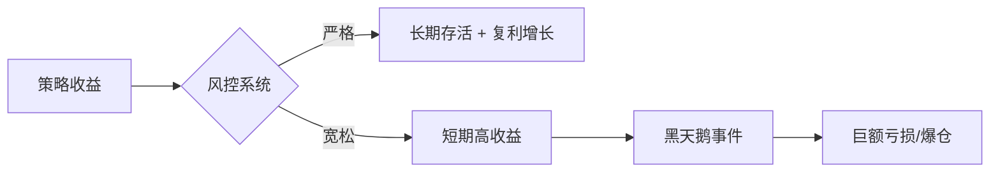

## 四、风险管理与ATR止损

> "交易的首要规则是生存，第二条规则是不要忘记第一条。" —— Ed Seykota

在量化交易中，风险管理不是策略的附属品，而是策略的骨架。一个收益平庸但风控严格的系统，长期表现往往优于收益亮眼但风控粗糙的系统。本节从量化交易者最常用的工具——ATR（Average True Range，平均真实波幅）出发，系统讲解止损设定、仓位管理、风险预算分配等核心风控技术，并提供可直接运行的 Python 代码。

### 4.1 为什么风险管理是量化交易的第一优先级

#### 4.1.1 亏损的数学不对称性

亏损和盈利之间存在一个容易被忽视的数学事实：亏损的百分比永远比对应的回本百分比更大。

| 亏损幅度 | 回本所需涨幅 |
|----------|-------------|
| -10%     | +11.1%      |
| -20%     | +25.0%      |
| -30%     | +42.9%      |
| -50%     | +100.0%     |
| -70%     | +233.3%     |
| -90%     | +900.0%     |

这意味着：如果你的账户亏损了 50%，你需要翻倍才能回本。而在实际交易中，翻倍的难度远超想象。这就是为什么"控制亏损"比"追求盈利"更优先。

#### 4.1.2 凯利公式的启示

凯利公式（Kelly Criterion）给出了理论上的最优下注比例：

$$f^* = \frac{p \cdot b - q}{b}$$

其中 $p$ 为胜率，$b$ 为盈亏比（平均盈利 / 平均亏损），$q = 1 - p$。

假设一个策略胜率 45%，盈亏比 2:1，则最优下注比例：

$$f^* = \frac{0.45 \times 2 - 0.55}{2} = \frac{0.35}{2} = 17.5\%$$

这意味着每次交易最多投入总资金的 17.5%。实际操作中，多数量化交易者使用半凯利（Half Kelly）甚至四分之一凯利，以降低波动性：

| 凯利比例 | 理论收益 | 最大回撤风险 |
|----------|----------|-------------|
| 全凯利   | 最高     | 极高        |
| 半凯利   | 约75%    | 显著降低    |
| 1/4凯利  | 约56%    | 较低        |

#### 4.1.3 失败的量化基金案例

LTCM（长期资本管理公司）是风险管理失败的经典案例。1998 年，这家由诺贝尔经济学奖得主创办的对冲基金，因为杠杆过高（资产负债比超过 25:1）且低估了极端事件的概率，在俄罗斯债务违约中亏损 46 亿美元，最终由美联储协调救助。教训是：**再精密的模型，如果风险管理缺失，也会在黑天鹅面前崩塌。**



### 4.2 ATR（平均真实波幅）详解

#### 4.2.1 ATR 的定义与计算

ATR 由 J. Welles Wilder Jr. 在其 1978 年的著作《New Concepts in Technical Trading Systems》中首次提出。ATR 衡量的是市场在特定周期内的波动幅度，不考虑方向。

**真实波幅（True Range, TR）** 的定义：

$$TR = \max(H - L,\ |H - C_{prev}|,\ |L - C_{prev}|)$$

其中：
- $H$ = 当日最高价
- $L$ = 当日最低价
- $C_{prev}$ = 前一日收盘价

三个值取最大值的原因：如果市场出现跳空缺口（开盘价远离前一日收盘价），仅用 $H - L$ 会低估实际波动。

**ATR** 是 TR 的 N 日指数移动平均：

$$ATR_t = \frac{ATR_{t-1} \times (N-1) + TR_t}{N}$$

Wilder 原始设定 N=14，这也是最常用的周期。

#### 4.2.2 ATR 的直觉理解

ATR 的核心意义：它告诉你"这个品种平均每天（或每根 K 线）波动多少钱"。

举例：如果沪深 300 ETF 的 ATR(14) = 0.05 元，说明近 14 天平均每天波动 5 分钱。如果当前价格 4.00 元，则 ATR/价格 = 1.25%，说明日波动率约 1.25%。

ATR 的几个重要特性：
- **绝对值随价格变化**：价格 100 元的股票 ATR 大于价格 10 元的股票，不代表前者波动更大
- **相对 ATR（ATR%）更有可比性**：ATR% = ATR / Close × 100%
- **ATR 是滞后指标**：它基于历史数据计算，不能预测未来波动
- **ATR 在趋势行情中上升，在盘整行情中下降**

#### 4.2.3 Python 计算 ATR

```python
import pandas as pd
import numpy as np

def calculate_atr(df: pd.DataFrame, period: int = 14) -> pd.Series:
    """
    计算ATR（平均真实波幅）

    参数:
        df: 包含 'high', 'low', 'close' 列的DataFrame
        period: ATR周期，默认14
    返回:
        ATR序列
    """
    high = df['high']
    low = df['low']
    prev_close = df['close'].shift(1)

    # 计算真实波幅 TR
    tr1 = high - low
    tr2 = (high - prev_close).abs()
    tr3 = (low - prev_close).abs()
    tr = pd.concat([tr1, tr2, tr3], axis=1).max(axis=1)

    # Wilder 平滑法（指数移动平均）
    atr = tr.ewm(alpha=1/period, min_periods=period, adjust=False).mean()

    return atr


# 使用示例
if __name__ == '__main__':
    # 假设从CSV读取OHLC数据
    df = pd.read_csv('stock_data.csv', parse_dates=['date'])
    df.set_index('date', inplace=True)

    df['atr_14'] = calculate_atr(df, period=14)
    df['atr_pct'] = df['atr_14'] / df['close'] * 100

    # 打印最近10天的ATR
    print(df[['close', 'atr_14', 'atr_pct']].tail(10))
```

输出示例：

```text
            close  atr_14  atr_pct
date
2026-06-13  4.12    0.053    1.29%
2026-06-16  4.18    0.055    1.32%
2026-06-17  4.15    0.054    1.30%
2026-06-18  4.22    0.056    1.33%
2026-06-19  4.30    0.059    1.37%
```

### 4.3 ATR 止损的核心方法

#### 4.3.1 固定倍数 ATR 止损

最经典的方法：止损位 = 入场价 - N × ATR

N 的选择取决于交易风格：

| 交易风格 | ATR倍数 | 持仓周期 | 适用场景 |
|----------|---------|----------|----------|
| 超短线    | 1.0-1.5 | 1-3天    | 高频日内/隔夜 |
| 短线      | 1.5-2.5 | 3-10天   | 趋势突破/波段 |
| 中线      | 2.5-3.5 | 10-30天  | 主要趋势跟踪 |
| 长线      | 3.5-5.0 | 30天+    | 大周期趋势投资 |

**计算示例：**

假设买入价 50.00 元，ATR(14) = 1.50 元：
- 2 倍 ATR 止损：50.00 - 2 × 1.50 = 47.00 元（止损幅度 6%）
- 3 倍 ATR 止损：50.00 - 3 × 1.50 = 45.50 元（止损幅度 9%）

#### 4.3.2 动态追踪止损（Chandelier Exit）

Chandelier Exit（吊灯止损）由 Chuck LeBeau 提出，是一种随趋势推进而移动的止损方法：

**多头止损 = 最高价 - N × ATR**
**空头止损 = 最低价 + N × ATR**

其中"最高价/最低价"是入场以来的历史极值。这种方法的优势是：趋势持续时止损位不断上移锁定利润，但不会因为正常回调而过早止损。

```python
def chandelier_exit(df: pd.DataFrame, period: int = 22,
                    atr_period: int = 14, multiplier: float = 3.0):
    """
    计算吊灯止损位

    参数:
        df: OHLC数据
        period: 回望周期（用于计算最高/最低点）
        atr_period: ATR计算周期
        multiplier: ATR倍数
    返回:
        (long_stop, short_stop) 两个Series
    """
    atr = calculate_atr(df, atr_period)

    # 回望周期内的最高价和最低价
    highest_high = df['high'].rolling(window=period).max()
    lowest_low = df['low'].rolling(window=period).min()

    # 多头止损（做多时使用）
    long_stop = highest_high - multiplier * atr

    # 空头止损（做空时使用）
    short_stop = lowest_low + multiplier * atr

    return long_stop, short_stop
```

#### 4.3.3 波动率调整止损

在市场波动率变化剧烈时，固定倍数可能不够灵活。波动率调整止损根据近期 ATR 变化动态调整倍数：

```python
def volatility_adjusted_stop(entry_price: float, atr: float,
                              atr_percentile: float) -> float:
    """
    根据当前波动率在历史中的百分位调整止损倍数

    参数:
        entry_price: 入场价
        atr: 当前ATR值
        atr_percentile: ATR在历史数据中的百分位(0-100)
    返回:
        止损价格
    """
    # 波动率越高，给越大的空间（避免被噪音止损）
    # 波动率越低，收紧止损（控制风险）
    if atr_percentile > 80:
        multiplier = 3.5   # 高波动期给更多空间
    elif atr_percentile > 60:
        multiplier = 2.5
    elif atr_percentile > 40:
        multiplier = 2.0
    elif atr_percentile > 20:
        multiplier = 1.5
    else:
        multiplier = 1.2   # 低波动期收紧

    stop_loss = entry_price - multiplier * atr
    return stop_loss
```

#### 4.3.4 时间止损与 ATR 止损结合

单纯的价格止损可能让你在一个没有方向的品种上耗尽时间。时间止损解决这个问题：如果在 N 个交易日内价格没有达到预期方向的移动幅度，无论盈亏都平仓。

```python
def should_exit(entry_price: float, current_price: float,
                stop_price: float, bars_held: int,
                max_bars: int = 10,
                min_profit_atr: float = 0.5,
                atr: float = 1.0) -> tuple[bool, str]:
    """
    综合判断是否应该退出

    返回:
        (should_exit: bool, reason: str)
    """
    # 1. 触发价格止损
    if current_price <= stop_price:
        return True, "触发ATR止损"

    # 2. 时间止损：持仓超过max_bars天且未达到最小盈利
    profit_in_atr = (current_price - entry_price) / atr
    if bars_held >= max_bars and profit_in_atr < min_profit_atr:
        return True, f"时间止损：持仓{bars_held}天，盈利{profit_in_atr:.1f}ATR"

    return False, "继续持有"
```

### 4.4 基于 ATR 的仓位管理

#### 4.4.1 波动率标准化仓位

ATR 最强大的应用之一是**波动率标准化仓位管理**。核心思想：让每个品种在组合中的风险贡献相等。

**公式：**

$$\text{头寸规模} = \frac{\text{账户资金} \times \text{风险比例}}{ATR \times \text{合约乘数}}$$

**实例：**

假设账户资金 100 万元，每笔交易风险 2%（即最多亏 2 万），ATR = 1.50 元，合约乘数为 1（股票）：

$$\text{头寸} = \frac{1{,}000{,}000 \times 0.02}{1.50 \times 1} = 13{,}333 \text{股}$$

如果用 3 倍 ATR 止损，最大亏损 = 13,333 × 1.50 × 3 = 60,000... 不对，应该是 13,333 × (1.50 × 3) = 13,333 × 4.50 = 60,000。

等等，我们限制风险为 2 万，所以正确公式应该是：

$$\text{头寸} = \frac{\text{账户资金} \times \text{风险比例}}{\text{ATR倍数} \times \text{ATR} \times \text{合约乘数}} = \frac{1{,}000{,}000 \times 0.02}{3 \times 1.50 \times 1} = 4{,}444 \text{股}$$

验证：最大亏损 = 4,444 × 3 × 1.50 = 19,998 ≈ 20,000（2%）。正确。

```python
def calculate_position_size(capital: float, risk_pct: float,
                             atr: float, atr_multiplier: float,
                             contract_multiplier: int = 1,
                             lot_size: int = 100) -> int:
    """
    计算基于ATR的标准化仓位

    参数:
        capital: 账户总资金
        risk_pct: 每笔交易风险比例 (如0.02代表2%)
        atr: 当前ATR值
        atr_multiplier: ATR止损倍数
        contract_multiplier: 合约乘数（期货用）
        lot_size: 最小交易单位（A股为100股/手）
    返回:
        头寸数量（取整到lot_size的整数倍）
    """
    risk_amount = capital * risk_pct
    risk_per_unit = atr * atr_multiplier * contract_multiplier
    position = risk_amount / risk_per_unit

    # 向下取整到最小交易单位
    position = int(position // lot_size) * lot_size

    return max(position, lot_size)  # 至少1手


# 示例
pos = calculate_position_size(
    capital=1_000_000,
    risk_pct=0.02,
    atr=1.50,
    atr_multiplier=3.0,
    contract_multiplier=1,
    lot_size=100
)
print(f"建议买入: {pos} 股")  # 建议买入: 4400 股
```

#### 4.4.2 组合级风险管理

单个仓位的风险控制只是基础，组合级别的风险预算才是真正的护城河。

**核心原则：**

| 风控维度 | 限制值 | 说明 |
|----------|--------|------|
| 单笔风险 | ≤2% | 任何一笔交易的最大亏损 |
| 日风险预算 | ≤5% | 一天内所有交易的总风险 |
| 组合总风险 | ≤15% | 所有持仓的总风险敞口 |
| 单行业暴露 | ≤25% | 避免行业黑天鹅 |
| 相关品种合计 | ≤10% | 高度相关的品种视为同一风险源 |
| 最大回撤熔断 | -15% | 触发后暂停交易1周 |

```python
class RiskBudget:
    """组合级风险预算管理器"""

    def __init__(self, capital: float,
                 max_risk_per_trade: float = 0.02,
                 max_daily_risk: float = 0.05,
                 max_portfolio_risk: float = 0.15,
                 max_sector_exposure: float = 0.25,
                 max_drawdown_halt: float = 0.15):
        self.capital = capital
        self.initial_capital = capital
        self.max_risk_per_trade = max_risk_per_trade
        self.max_daily_risk = max_daily_risk
        self.max_portfolio_risk = max_portfolio_risk
        self.max_sector_exposure = max_sector_exposure
        self.max_drawdown_halt = max_drawdown_halt

        self.positions = {}        # symbol -> position info
        self.daily_risk_used = 0.0
        self.peak_capital = capital

    def can_open_position(self, symbol: str, risk_amount: float,
                          sector: str = 'unknown') -> tuple[bool, str]:
        """检查是否允许开新仓"""
        # 1. 单笔风险检查
        if risk_amount > self.capital * self.max_risk_per_trade:
            return False, f"单笔风险 {risk_amount:.0f} 超过限额 {self.capital * self.max_risk_per_trade:.0f}"

        # 2. 日风险预算检查
        if self.daily_risk_used + risk_amount > self.capital * self.max_daily_risk:
            return False, f"日风险预算已用 {self.daily_risk_used:.0f}，剩余不足"

        # 3. 组合总风险检查
        total_risk = sum(p['risk'] for p in self.positions.values()) + risk_amount
        if total_risk > self.capital * self.max_portfolio_risk:
            return False, f"组合总风险 {total_risk:.0f} 超过限额"

        # 4. 行业暴露检查
        sector_risk = sum(p['risk'] for p in self.positions.values()
                         if p.get('sector') == sector) + risk_amount
        if sector_risk > self.capital * self.max_sector_exposure:
            return False, f"行业 {sector} 风险暴露超限"

        # 5. 最大回撤熔断检查
        drawdown = (self.peak_capital - self.capital) / self.peak_capital
        if drawdown >= self.max_drawdown_halt:
            return False, f"最大回撤 {drawdown:.1%} 触发熔断，暂停交易"

        return True, "通过所有风控检查"

    def record_open(self, symbol: str, risk_amount: float,
                    sector: str = 'unknown'):
        """记录开仓"""
        self.positions[symbol] = {
            'risk': risk_amount,
            'sector': sector
        }
        self.daily_risk_used += risk_amount

    def record_close(self, symbol: str, pnl: float):
        """记录平仓"""
        if symbol in self.positions:
            del self.positions[symbol]
        self.capital += pnl
        self.peak_capital = max(self.peak_capital, self.capital)

    def reset_daily(self):
        """每日重置"""
        self.daily_risk_used = 0.0

    def summary(self) -> dict:
        """风险概览"""
        total_risk = sum(p['risk'] for p in self.positions.values())
        drawdown = (self.peak_capital - self.capital) / self.peak_capital
        return {
            'capital': self.capital,
            'positions': len(self.positions),
            'total_risk': total_risk,
            'total_risk_pct': total_risk / self.capital * 100,
            'daily_risk_used': self.daily_risk_used,
            'drawdown': drawdown * 100,
            'halted': drawdown >= self.max_drawdown_halt
        }
```

### 4.5 超越 ATR：其他量化风控技术

#### 4.5.1 最大回撤控制

最大回撤（Maximum Drawdown, MDD）是从账户峰值到谷底的最大跌幅，是衡量策略风险最直观的指标。

$$MDD = \max_{t \in [0,T]} \left( \frac{\text{Peak}_t - \text{Value}_t}{\text{Peak}_t} \right)$$

```python
def calculate_max_drawdown(equity_curve: pd.Series) -> dict:
    """
    计算最大回撤及其相关信息

    参数:
        equity_curve: 权益曲线序列
    返回:
        包含最大回撤信息的字典
    """
    peak = equity_curve.cummax()
    drawdown = (equity_curve - peak) / peak
    max_dd = drawdown.min()
    max_dd_end = drawdown.idxmin()
    max_dd_start = equity_curve[:max_dd_end].idxmax()

    # 计算回撤恢复时间
    recovery = equity_curve[max_dd_end:]
    peak_value = equity_curve[max_dd_start]
    recovery_date = recovery[recovery >= peak_value].first_valid_index()

    return {
        'max_drawdown': abs(max_dd),
        'start_date': max_dd_start,
        'trough_date': max_dd_end,
        'recovery_date': recovery_date,
        'duration_days': (max_dd_end - max_dd_start).days if max_dd_start else None,
    }
```

**常见策略的最大回撤参考：**

| 策略类型 | 可接受MDD | 警戒MDD | 熔断MDD |
|----------|----------|---------|---------|
| 低频趋势跟踪 | 10-15% | 20% | 25% |
| 高频统计套利 | 3-5% | 8% | 12% |
| 多因子选股 | 10-20% | 25% | 30% |
| CTA期货策略 | 15-25% | 30% | 35% |

#### 4.5.2 VaR（在险价值）

VaR 回答的问题是："在给定置信水平下，N 天内最多亏多少？"

**历史模拟法计算 VaR：**

```python
def calculate_var(returns: pd.Series, confidence: float = 0.95,
                  holding_period: int = 1) -> float:
    """
    使用历史模拟法计算VaR

    参数:
        returns: 日收益率序列
        confidence: 置信水平（默认95%）
        holding_period: 持有期天数
    返回:
        VaR值（正数表示亏损）
    """
    var_1d = -returns.quantile(1 - confidence)
    # 持有期调整（平方根法则）
    var_nd = var_1d * np.sqrt(holding_period)
    return var_nd

# 示例：95% VaR
returns = pd.Series([0.01, -0.02, 0.015, -0.008, 0.003,
                     -0.015, 0.02, -0.01, 0.005, -0.025])
var_95 = calculate_var(returns, confidence=0.95)
print(f"95% VaR (1天): {var_95:.2%}")
```

**VaR 的局限性：**
- 不告诉超过 VaR 时亏损多大（尾部风险）
- 基于历史数据，无法预测极端事件
- 正态分布假设在金融市场中往往不成立

**改进：CVaR（条件在险价值）**，又称 Expected Shortfall（ES），计算超过 VaR 时的平均亏损：

```python
def calculate_cvar(returns: pd.Series, confidence: float = 0.95) -> float:
    """计算CVaR（条件在险价值）"""
    var = -returns.quantile(1 - confidence)
    cvar = -returns[returns <= -var].mean()
    return cvar
```

#### 4.5.3 相关性风险管理

当组合中的持仓高度相关时，分散化效果消失，风险实际上集中在同一方向。以下是管理相关性风险的方法：

```python
def correlation_check(returns_df: pd.DataFrame,
                      threshold: float = 0.7) -> list:
    """
    检查组合持仓的相关性，找出高度相关的品种对

    参数:
        returns_df: 各品种收益率的DataFrame
        threshold: 相关性阈值
    返回:
        高度相关的品种对列表
    """
    corr_matrix = returns_df.corr()
    high_corr_pairs = []

    for i in range(len(corr_matrix.columns)):
        for j in range(i + 1, len(corr_matrix.columns)):
            if abs(corr_matrix.iloc[i, j]) >= threshold:
                high_corr_pairs.append({
                    'pair': (corr_matrix.columns[i], corr_matrix.columns[j]),
                    'correlation': corr_matrix.iloc[i, j]
                })

    return sorted(high_corr_pairs, key=lambda x: abs(x['correlation']),
                  reverse=True)
```

**相关性风控规则：**
- 组合内任意两品种的相关系数绝对值不超过 0.7
- 同方向（正相关 > 0.5）品种的合计风险不超过组合总风险的 40%
- 定期（至少每周）重新计算相关性矩阵
- 注意：危机时期所有品种的相关性会趋向 1.0（流动性枯竭效应）

### 4.6 心理风险管理

#### 4.6.1 情绪化的代价

量化交易的核心优势是消除情绪干扰，但在实际执行中，交易者仍可能被情绪左右：

| 情绪陷阱 | 表现 | 后果 |
|----------|------|------|
| 恐惧 | 过早平仓，不敢入场 | 错失盈利机会 |
| 贪婪 | 加大仓位，取消止损 | 单笔巨亏 |
| 报复交易 | 亏损后立即加仓想回本 | 亏损放大 |
| 过度自信 | 连胜后放松风控 | 利润回吐 |
| 锚定效应 | 执着于入场价，不愿止损 | 越套越深 |

#### 4.6.2 系统化克服情绪

```python
class EmotionGuard:
    """
    交易情绪守卫器
    通过规则限制来防止情绪化操作
    """
    def __init__(self, max_consecutive_losses: int = 3,
                 cooldown_after_loss: int = 1,
                 max_daily_trades: int = 10):
        self.max_consecutive_losses = max_consecutive_losses
        self.cooldown_after_loss = cooldown_after_loss
        self.max_daily_trades = max_daily_trades
        self.consecutive_losses = 0
        self.daily_trade_count = 0
        self.cooldown_remaining = 0

    def can_trade(self) -> tuple[bool, str]:
        # 连续亏损后冷却
        if self.consecutive_losses >= self.max_consecutive_losses:
            return False, (f"连续亏损{self.consecutive_losses}次，"
                           f"需冷却{self.cooldown_remaining}笔")

        # 日内交易次数限制
        if self.daily_trade_count >= self.max_daily_trades:
            return False, f"已达日内交易上限{self.max_daily_trades}次"

        return True, "允许交易"

    def record_trade(self, pnl: float):
        self.daily_trade_count += 1
        if pnl < 0:
            self.consecutive_losses += 1
            if self.consecutive_losses >= self.max_consecutive_losses:
                self.cooldown_remaining = self.cooldown_after_loss
        else:
            self.consecutive_losses = 0
            self.cooldown_remaining = 0

        if self.cooldown_remaining > 0:
            self.cooldown_remaining -= 1
```

### 4.7 完整的 ATR 风控系统示例

将前面所有模块整合为一个可运行的完整系统：

```python
import pandas as pd
import numpy as np

class ATRRiskManager:
    """
    基于ATR的完整风险管理框架

    功能：
    1. ATR计算与动态止损
    2. 波动率标准化仓位
    3. 组合风险预算
    4. 追踪止损
    5. 风控检查与报告
    """

    def __init__(self, capital: float, config: dict = None):
        self.capital = capital
        self.peak_capital = capital
        self.config = config or {
            'risk_per_trade': 0.02,       # 单笔风险2%
            'max_daily_risk': 0.05,       # 日风险预算5%
            'max_portfolio_risk': 0.15,   # 组合总风险15%
            'atr_period': 14,             # ATR周期
            'atr_multiplier': 2.5,        # 止损ATR倍数
            'trailing_atr_mult': 3.0,     # 追踪止损ATR倍数
            'trailing_lookback': 20,      # 追踪止损回望周期
            'max_drawdown_halt': 0.15,    # 最大回撤熔断15%
            'max_correlation': 0.7,       # 相关性上限
        }
        self.positions = {}
        self.trade_log = []

    def calculate_atr(self, df: pd.DataFrame) -> pd.Series:
        """计算ATR"""
        period = self.config['atr_period']
        high = df['high']
        low = df['low']
        prev_close = df['close'].shift(1)

        tr = pd.concat([
            high - low,
            (high - prev_close).abs(),
            (low - prev_close).abs()
        ], axis=1).max(axis=1)

        return tr.ewm(alpha=1/period, min_periods=period, adjust=False).mean()

    def calculate_stop_loss(self, entry_price: float, atr: float,
                            direction: str = 'long') -> float:
        """计算初始止损价"""
        mult = self.config['atr_multiplier']
        if direction == 'long':
            return entry_price - mult * atr
        else:
            return entry_price + mult * atr

    def calculate_position_size(self, entry_price: float,
                                stop_price: float,
                                contract_mult: int = 1,
                                lot_size: int = 100) -> int:
        """计算头寸规模"""
        risk_per_share = abs(entry_price - stop_price)
        if risk_per_share == 0:
            return 0

        risk_amount = self.capital * self.config['risk_per_trade']
        position = risk_amount / (risk_per_share * contract_mult)
        position = int(position // lot_size) * lot_size

        return max(position, 0)

    def calculate_trailing_stop(self, df: pd.DataFrame,
                                 current_stop: float) -> float:
        """计算追踪止损位"""
        lookback = self.config['trailing_lookback']
        mult = self.config['trailing_atr_mult']
        atr = self.calculate_atr(df)

        highest = df['high'].tail(lookback).max()
        new_stop = highest - mult * atr.iloc[-1]

        # 止损只能上移，不能下移
        return max(current_stop, new_stop)

    def check_portfolio_risk(self) -> dict:
        """检查组合整体风险状态"""
        total_position_risk = sum(
            p['risk_per_share'] * p['quantity'] * p.get('contract_mult', 1)
            for p in self.positions.values()
        )

        drawdown = (self.peak_capital - self.capital) / self.peak_capital
        halt = drawdown >= self.config['max_drawdown_halt']

        return {
            'total_risk': total_position_risk,
            'risk_pct': total_position_risk / self.capital * 100,
            'drawdown_pct': drawdown * 100,
            'halted': halt,
            'positions': len(self.positions),
            'capital': self.capital,
        }

    def open_position(self, symbol: str, entry_price: float,
                      atr: float, direction: str = 'long',
                      sector: str = 'unknown',
                      contract_mult: int = 1,
                      lot_size: int = 100) -> dict:
        """开仓全流程"""
        # 1. 计算止损
        stop_price = self.calculate_stop_loss(entry_price, atr, direction)

        # 2. 计算仓位
        quantity = self.calculate_position_size(
            entry_price, stop_price, contract_mult, lot_size
        )
        if quantity == 0:
            return {'success': False, 'reason': '仓位计算为0，风险过大'}

        # 3. 检查组合风险
        risk_amount = abs(entry_price - stop_price) * quantity * contract_mult
        total_risk = sum(
            p['risk_per_share'] * p['quantity'] * p.get('contract_mult', 1)
            for p in self.positions.values()
        ) + risk_amount

        max_risk = self.capital * self.config['max_portfolio_risk']
        if total_risk > max_risk:
            return {'success': False,
                    'reason': f'组合风险 {total_risk:.0f} 超限 {max_risk:.0f}'}

        # 4. 执行开仓
        self.positions[symbol] = {
            'direction': direction,
            'entry_price': entry_price,
            'quantity': quantity,
            'stop_price': stop_price,
            'atr': atr,
            'sector': sector,
            'contract_mult': contract_mult,
            'risk_per_share': abs(entry_price - stop_price),
        }

        return {
            'success': True,
            'symbol': symbol,
            'direction': direction,
            'entry_price': entry_price,
            'quantity': quantity,
            'stop_price': stop_price,
            'risk_amount': risk_amount,
            'risk_pct': risk_amount / self.capital * 100,
        }

    def close_position(self, symbol: str,
                       exit_price: float) -> dict:
        """平仓"""
        if symbol not in self.positions:
            return {'success': False, 'reason': '持仓不存在'}

        pos = self.positions.pop(symbol)
        if pos['direction'] == 'long':
            pnl = (exit_price - pos['entry_price']) * pos['quantity'] * pos['contract_mult']
        else:
            pnl = (pos['entry_price'] - exit_price) * pos['quantity'] * pos['contract_mult']

        self.capital += pnl
        self.peak_capital = max(self.peak_capital, self.capital)

        return {
            'success': True,
            'symbol': symbol,
            'pnl': pnl,
            'pnl_pct': pnl / (pos['entry_price'] * pos['quantity'] * pos['contract_mult']) * 100,
            'remaining_capital': self.capital,
        }


# === 使用示例 ===
if __name__ == '__main__':
    rm = ATRRiskManager(capital=1_000_000)

    # 模拟开仓
    result = rm.open_position(
        symbol='510300.SH',  # 沪深300ETF
        entry_price=4.00,
        atr=0.06,
        direction='long',
        sector='宽基指数'
    )
    print("开仓结果:", result)
    print("组合状态:", rm.check_portfolio_risk())

    # 模拟平仓
    result = rm.close_position('510300.SH', exit_price=4.15)
    print("平仓结果:", result)
```

运行输出：

```text
开仓结果: {'success': True, 'symbol': '510300.SH', 'direction': 'long',
  'entry_price': 4.0, 'quantity': 22200, 'stop_price': 3.85,
  'risk_amount': 3330.0, 'risk_pct': 0.33}

组合状态: {'total_risk': 3330.0, 'risk_pct': 0.33, 'drawdown_pct': 0.0,
  'halted': False, 'positions': 1, 'capital': 1000000}

平仓结果: {'success': True, 'symbol': '510300.SH', 'pnl': 3330.0,
  'pnl_pct': 3.75, 'remaining_capital': 1003330.0}
```

### 4.8 常见误区与纠正

#### 误区一：止损设得太紧

**错误做法**：用 1 倍 ATR 甚至更小的幅度止损，试图减少每笔亏损。

**后果**：正常的价格噪音就会触发止损，导致频繁"被洗出来"，即使方向判断正确也赚不到钱。

**纠正**：根据品种特性和交易周期选择合适的 ATR 倍数。短线交易至少 1.5 倍 ATR，中线至少 2.5 倍。如果你发现止损触发率超过 70%，说明止损可能太紧了。

#### 误区二：止损设好后不再调整

**错误做法**：入场时设了止损价，之后再也不管它。

**后果**：趋势行情中利润无法锁定，价格回调到止损位后又继续上涨，白白错过一大段行情。

**纠正**：使用追踪止损。随着价格向有利方向移动，止损位也应该跟着移动（只往上移，不下移）。

#### 误区三：所有品种用同一个 ATR 倍数

**错误做法**：不管什么品种，统一用 2 倍 ATR 止损。

**后果**：低波动品种止损太松（亏损超出预期），高波动品种止损太紧（频繁被洗出）。

**纠正**：用波动率标准化的仓位管理（见 4.4.1 节），让每个品种的风险贡献相等，而不是止损倍数相等。

#### 误区四：忽视相关性风险

**错误做法**：组合里买了银行 ETF、证券 ETF、保险 ETF，认为是"分散投资"。

**后果**：金融板块同涨同跌，三者高度相关（相关系数可能 0.8+），实际上等同于满仓一个品种。

**纠正**：定期计算持仓间的相关系数矩阵，确保高相关品种的合计风险不超标。真正的分散是跨行业、跨风格、甚至跨资产类别（股 + 债 + 商品）。

#### 误区五：回撤触发后立即恢复交易

**错误做法**：最大回撤达到 -15%，暂停了一天后就恢复交易。

**后果**：如果市场环境没有改变，恢复交易后回撤可能继续扩大到 -20%、-25%。

**纠正**：回撤熔断后需要：(1) 暂停交易至少一周；(2) 复盘所有交易记录；(3) 回测验证策略是否失效；(4) 如果策略有效但市场环境差，降低仓位 50% 后恢复。

### 4.9 进阶：机器学习辅助风控

对于有编程基础的读者，可以尝试用机器学习方法优化风控参数：

```python
from sklearn.ensemble import RandomForestClassifier
import warnings
warnings.filterwarnings('ignore')

def optimize_atr_multiplier(historical_trades: pd.DataFrame) -> float:
    """
    使用随机森林找到最优ATR止损倍数

    参数:
        historical_trades: 历史交易数据，包含列:
            atr_multiplier, atr_pct, volatility_regime,
            trend_strength, is_profitable
    返回:
        建议的ATR倍数
    """
    features = ['atr_multiplier', 'atr_pct', 'volatility_regime',
                'trend_strength']
    X = historical_trades[features]
    y = historical_trades['is_profitable']

    model = RandomForestClassifier(n_estimators=100, random_state=42)
    model.fit(X, y)

    # 在不同ATR倍数下模拟预测
    test_mults = np.arange(1.0, 5.5, 0.5)
    best_mult = 2.5
    best_win_rate = 0

    for mult in test_mults:
        test_data = X.copy()
        test_data['atr_multiplier'] = mult
        win_prob = model.predict_proba(test_data)[:, 1].mean()
        if win_prob > best_win_rate:
            best_win_rate = win_prob
            best_mult = mult

    return best_mult
```

**注意**：机器学习方法容易过拟合。建议：(1) 使用交叉验证；(2) 用滚动窗口回测；(3) 最终参数还是需要人工判断合理性。

### 4.10 本节要点总结

| 要点 | 核心内容 |
|------|----------|
| ATR 是什么 | 平均真实波幅，衡量市场波动幅度的指标 |
| 止损公式 | 止损价 = 入场价 ± N × ATR |
| N 怎么选 | 短线 1.5-2.5，中线 2.5-3.5，长线 3.5-5.0 |
| 仓位公式 | 头寸 = 账户资金 × 风险比 / (N × ATR) |
| 追踪止损 | 止损位随趋势移动，只往有利方向调整 |
| 组合风控 | 单笔 ≤2%，日 ≤5%，总 ≤15% |
| 相关性 | 高相关品种合计风险不超标 |
| 情绪控制 | 连续亏损后冷却，日内交易次数限制 |
| 回撤熔断 | 达到阈值暂停交易，复盘后降低仓位恢复 |

> **记住**：风险管理的目的不是消灭亏损，而是确保任何一笔亏损都不会威胁到你的生存。在量化交易中，活得久比赚得多更重要。
