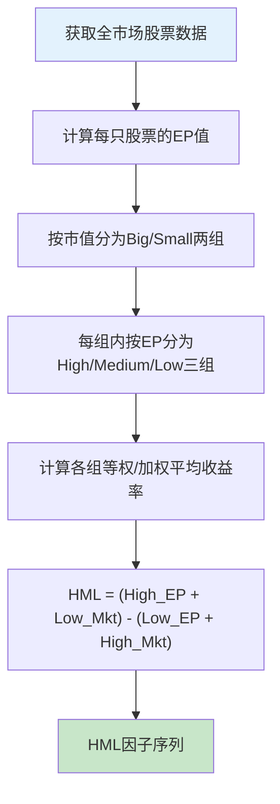

## 计算PE倒数（EP）作为价值因子

在Fama-French五因子模型中，价值因子（HML, High Minus Low）是解释股票横截面收益差异的核心变量之一。实践中，**EP（Earnings-to-Price，即市盈率的倒数）** 是构建价值因子最直接、最常用的代理指标。本节将从原理推导到代码实现，完整覆盖EP因子的构建流程。

### 1. 为什么用EP而不是直接用P/E

#### 1.1 数学性质差异

市盈率 P/E 与 EP 互为倒数：EP = 1 / (P/E) = EPS / Price。虽然信息量相同，但EP在统计性质上优于P/E：

| 特性 | P/E | EP |
|------|-----|-----|
| 分布形态 | 右偏严重（极端高PE拉长尾部） | 近似正态分布 |
| 极端值处理 | 负PE难以排序（亏损公司） | 负EP自然排在左侧 |
| 因子构建 | 需要额外Winsorize处理 | 离群值影响较小 |
| 经济含义 | 每元盈利的价格倍数 | 每元价格对应的盈利（收益率） |
| 多因子回归 | 非正态导致t统计量失真 | 分布更理想，回归更稳健 |

核心优势在于：EP是一个**收益率型指标**，可以直接与其他收益率型因子（如股息率、现金流收益率）在同一量纲下比较和组合。

#### 1.2 亏损公司的特殊处理

当公司EPS为负时，P/E无意义（负数无倒数），但EP可以直接取负值，在排序中自然排在低价值端。这避免了P/E方法中"亏损公司到底是PE=-100还是PE=无穷大"的排序困境。

实操中常用规则：
- **方法A**：亏损公司EP直接取负值参与排序
- **方法B**：亏损公司EP设为NaN，仅用盈利公司构建因子（Fama-French原始做法）
- **方法C**：使用过去4个季度滚动EPS（TTM），平滑单季度亏损波动

推荐方法C——TTM方式最为稳健，减少单季度异常值影响。

### 2. Fama-French价值因子的完整构建流程

#### 2.1 五因子模型回顾

Fama-French五因子模型（2015）用五个因子解释股票收益：

```text
R_i - R_f = α + β_MKT·(R_m - R_f) + β_SMB·SMB + β_HML·HML + β_RMW·RMW + β_CMA·CMA + ε
```

| 因子 | 全称 | 含义 | 价值代理指标 |
|------|------|------|-------------|
| MKT | Market | 市场超额收益 | 综合指数收益率 - 无风险利率 |
| SMB | Small Minus Big | 规模因子 | 总市值分组 |
| HML | High Minus Low | 价值因子 | B/M 或 EP 分组 |
| RMW | Robust Minus Weak | 盈利因子 | 毛利率/资产 分组 |
| CMA | Conservative Minus Aggressive | 投资因子 | 资产增长率 分组 |

HML因子传统上用**账面市值比（B/M）**构建，但学术研究和业界实践均表明，**EP（盈利收益率）在A股市场对HML有更好的解释力**。原因是A股公司账面价值受会计政策影响大，而盈利质量相对更可比。

#### 2.2 EP-HML因子构建的完整步骤

构建EP-HML因子需要以下步骤：



具体而言：

1. **截面分组**：每年6月末，用总市值中位数将全市场分为Big和Small两组
2. **EP排序**：每组内按EP值的30%和70%分位数分为High（高EP=便宜）、Medium、Low（低EP=贵）三组
3. **组合构建**：形成6个组合（Small-High、Small-Medium、Small-Low、Big-High、Big-Medium、Big-Low）
4. **因子收益**：每月计算HML = ½(Small_High + Big_High) - ½(Small_Low + Big_Low)

### 3. Python实操：从数据到因子

#### 3.1 数据准备

```python
import pandas as pd
import numpy as np
from datetime import datetime

def prepare_factor_data(stock_data: pd.DataFrame) -> pd.DataFrame:
    """
    准备因子计算所需的基础数据。
    
    Parameters
    ----------
    stock_data : DataFrame
        必须包含列：code, date, close, total_shares, eps_ttm, industry
        - code: 股票代码（str）
        - date: 交易日期（datetime）
        - close: 收盘价（float）
        - total_shares: 总股本（float，单位：万股）
        - eps_ttm: 滚动12个月每股收益（float）
        - industry: 行业分类（str）
    
    Returns
    -------
    DataFrame: 包含计算后的市值(market_cap)和EP值
    """
    df = stock_data.copy()
    
    # 计算总市值（亿元）
    df['market_cap'] = df['close'] * df['total_shares'] / 1e8
    
    # 计算EP = EPS_TTM / 股价
    df['ep'] = df['eps_ttm'] / df['close']
    
    # 排除ST股票和上市不足120天的新股
    df = df[~df['code'].str.contains('ST|\\*ST')]
    
    # 排除市值过小的股票（日均市值低于10亿元）
    min_cap_threshold = 10  # 亿元
    df = df[df['market_cap'] >= min_cap_threshold]
    
    # 排除极端EP值（上下1% Winsorize）
    for date, group in df.groupby('date'):
        lower = group['ep'].quantile(0.01)
        upper = group['ep'].quantile(0.99)
        df.loc[group.index, 'ep'] = group['ep'].clip(lower, upper)
    
    return df
```

#### 3.2 因子分组与收益计算

```python
def construct_hml_factor(
    df: pd.DataFrame,
    market_returns: pd.DataFrame,
    return_col: str = 'monthly_return'
) -> pd.DataFrame:
    """
    构建基于EP的HML价值因子。
    
    Parameters
    ----------
    df : DataFrame
        包含code, date, ep, market_cap, monthly_return列
    market_returns : DataFrame
        包含date, rf（无风险利率）列
    return_col : str
        收益率列名
    
    Returns
    -------
    DataFrame: HML因子月度收益率序列
    """
    results = []
    
    # 按年度-月份获取每年6月末的截面数据做分组
    rebalance_dates = df[df['date'].dt.month == 6]['date'].unique()
    
    for i, rebal_date in enumerate(rebalance_dates):
        # 确定持仓期：从当年7月到次年6月
        next_rebal = rebalance_dates[i + 1] if i + 1 < len(rebalance_dates) else None
        
        # 截面数据：6月末的市值和EP
        cross_section = df[df['date'] == rebal_date].copy()
        if len(cross_section) < 100:
            continue
        
        # 按市值中位数分为Big和Small
        median_cap = cross_section['market_cap'].median()
        cross_section['size_group'] = np.where(
            cross_section['market_cap'] >= median_cap, 'Big', 'Small'
        )
        
        # 每个Size组内按EP分为High(30%)、Medium(40%)、Low(30%)
        for size in ['Small', 'Big']:
            mask = cross_section['size_group'] == size
            group = cross_section[mask]
            
            p30 = group['ep'].quantile(0.30)
            p70 = group['ep'].quantile(0.70)
            
            cross_section.loc[mask & (group['ep'] <= p30), 'ep_group'] = 'Low'
            cross_section.loc[mask & (group['ep'] > p30) & 
                             (group['ep'] <= p70), 'ep_group'] = 'Medium'
            cross_section.loc[mask & (group['ep'] > p70), 'ep_group'] = 'High'
        
        # 收集6个组合的股票列表
        portfolios = {}
        for size in ['Small', 'Big']:
            for ep_grp in ['High', 'Medium', 'Low']:
                key = f'{size}_{ep_grp}'
                portfolios[key] = set(
                    cross_section[
                        (cross_section['size_group'] == size) & 
                        (cross_section['ep_group'] == ep_grp)
                    ]['code']
                )
        
        # 计算持仓期内每月的组合收益率
        period_data = df[
            (df['date'] > rebal_date) & 
            (df['date'] <= (next_rebal if next_rebal is not None else df['date'].max()))
        ]
        
        for month_date in period_data['date'].unique():
            month_data = period_data[period_data['date'] == month_date]
            
            portfolio_returns = {}
            for key, codes in portfolios.items():
                stocks = month_data[month_data['code'].isin(codes)]
                if len(stocks) > 0:
                    # 等权平均收益率
                    portfolio_returns[key] = stocks[return_col].mean()
                else:
                    portfolio_returns[key] = 0.0
            
            # HML = ½(Small_High + Big_High) - ½(Small_Low + Big_Low)
            hml = 0.5 * (portfolio_returns.get('Small_High', 0) + 
                         portfolio_returns.get('Big_High', 0)) - \
                  0.5 * (portfolio_returns.get('Small_Low', 0) + 
                         portfolio_returns.get('Big_Low', 0))
            
            results.append({
                'date': month_date,
                'hml_ep': hml,
                'small_high': portfolio_returns.get('Small_High', 0),
                'small_low': portfolio_returns.get('Small_Low', 0),
                'big_high': portfolio_returns.get('Big_High', 0),
                'big_low': portfolio_returns.get('Big_Low', 0),
            })
    
    factor_df = pd.DataFrame(results).sort_values('date').reset_index(drop=True)
    return factor_df
```

#### 3.3 因子检验：IC与分层回测

构建因子后，必须检验其有效性。两个核心指标：**IC（信息系数）** 和 **分层组合收益单调性**。

```python
def calculate_ic_series(
    df: pd.DataFrame,
    factor_col: str = 'ep',
    return_col: str = 'fwd_1m_return'  # 下个月收益率
) -> pd.DataFrame:
    """
    计算因子IC（截面Rank IC）时间序列。
    
    IC = corr(rank(factor), rank(future_return))
    要求IC均值 > 0.03，IC_IR > 0.5 才认为因子有效。
    """
    ic_list = []
    
    for date, group in df.groupby('date'):
        if len(group) < 50:
            continue
        
        valid = group[[factor_col, return_col]].dropna()
        if len(valid) < 50:
            continue
        
        # Rank IC（Spearman相关系数）
        ic = valid[factor_col].corr(valid[return_col], method='spearman')
        ic_list.append({'date': date, 'ic': ic})
    
    ic_df = pd.DataFrame(ic_list)
    
    # 因子有效性统计
    ic_mean = ic_df['ic'].mean()
    ic_std = ic_df['ic'].std()
    ic_ir = ic_mean / ic_std if ic_std > 0 else 0
    ic_positive_ratio = (ic_df['ic'] > 0).mean()
    
    print(f"IC均值: {ic_mean:.4f}")
    print(f"IC标准差: {ic_std:.4f}")
    print(f"IC_IR (IC/IC_std): {ic_ir:.4f}")
    print(f"IC > 0 占比: {ic_positive_ratio:.2%}")
    print(f"因子有效性判定: {'有效' if ic_mean > 0.03 and ic_ir > 0.5 else '无效'}")
    
    return ic_df


def layered_backtest(
    df: pd.DataFrame,
    factor_col: str = 'ep',
    return_col: str = 'fwd_1m_return',
    n_groups: int = 5
) -> pd.DataFrame:
    """
    分层回测：按因子值分N组，观察各组收益是否单调递增。
    
    理想情况：EP最高的组（最便宜）收益最高，
    EP最低的组（最贵）收益最低，形成单调递减阶梯。
    """
    group_returns = []
    
    for date, group in df.groupby('date'):
        valid = group[[factor_col, return_col, 'code']].dropna()
        if len(valid) < n_groups * 10:
            continue
        
        # 按因子值等频分组
        valid['group'] = pd.qcut(
            valid[factor_col], n_groups, labels=range(1, n_groups + 1),
            duplicates='drop'
        )
        
        for grp, grp_data in valid.groupby('group'):
            group_returns.append({
                'date': date,
                'group': int(grp),
                'return': grp_data[return_col].mean(),
                'stock_count': len(grp_data)
            })
    
    result = pd.DataFrame(group_returns)
    
    # 计算各组累计收益和年化收益
    summary = result.groupby('group')['return'].agg(['mean', 'std'])
    summary.columns = ['月均收益', '月收益标准差']
    summary['年化收益'] = summary['月均收益'] * 12
    summary['年化波动'] = summary['月收益标准差'] * np.sqrt(12)
    summary['夏普比率'] = summary['年化收益'] / summary['年化波动']
    
    print("=== EP因子分层回测结果 ===")
    print(summary.to_string())
    print(f"\n多空收益（第{n_groups}组 - 第1组）: "
          f"{summary.loc[n_groups, '年化收益'] - summary.loc[1, '年化收益']:.2%}")
    
    return result
```

### 4. A股市场的EP因子实证特征

#### 4.1 A股价值因子的独特性

与美股相比，A股的EP因子呈现以下独特特征：

| 特征 | 美股 | A股 |
|------|------|-----|
| 因子持续性 | 长期有效但近年衰减 | 有效但周期性明显 |
| 行业偏差 | 科技股集中于低EP | 金融/地产/周期股集中于高EP |
| 价值陷阱 | 成熟市场已部分定价 | 信息不对称更严重 |
| 因子拥挤 | 机构投资者多，因子被套利 | 散户主导，定价效率偏低 |
| 周期特征 | 弱周期 | 强周期——牛市中成长跑赢，熊市中价值抗跌 |

#### 4.2 行业中性化处理

A股EP因子的行业偏差非常大：银行股EP普遍在8%-12%，而医药、科技股EP在1%-3%。如果不做行业中性化，高EP组合会被银行股主导。

```python
def industry_neutralize(
    df: pd.DataFrame,
    factor_col: str = 'ep',
    industry_col: str = 'industry'
) -> pd.DataFrame:
    """
    行业中性化：每个行业内对因子做Z-Score标准化，
    消除行业间的系统性差异。
    """
    df = df.copy()
    
    def zscore_by_group(group):
        mean = group[factor_col].mean()
        std = group[factor_col].std()
        if std > 0:
            group[f'{factor_col}_neutral'] = (group[factor_col] - mean) / std
        else:
            group[f'{factor_col}_neutral'] = 0
        return group
    
    df = df.groupby([industry_col, 'date'], group_keys=False).apply(zscore_by_group)
    return df
```

行业中性化后的EP因子（`ep_neutral`）在截面上消除了行业系统性偏差，选股信号更加纯粹——它捕捉的是"同一行业内，哪些股票相对更便宜"。

#### 4.3 市值中性化

类似地，大市值和小市值公司存在系统性EP差异。市值中性化通过对EP做市值回归取残差实现：

```python
def size_neutralize(
    df: pd.DataFrame,
    factor_col: str = 'ep'
) -> pd.DataFrame:
    """
    市值中性化：对因子值与对数市值做截面回归，取残差作为中性化因子。
    """
    import statsmodels.api as sm
    
    df = df.copy()
    df['log_cap'] = np.log(df['market_cap'])
    
    residuals = []
    for date, group in df.groupby('date'):
        valid = group[[factor_col, 'log_cap']].dropna()
        if len(valid) < 30:
            continue
        
        X = sm.add_constant(valid['log_cap'])
        model = sm.OLS(valid[factor_col], X).fit()
        
        group[f'{factor_col}_size_neutral'] = np.nan
        group.loc[valid.index, f'{factor_col}_size_neutral'] = model.resid
        residuals.append(group)
    
    return pd.concat(residuals)
```

#### 4.4 双重中性化（行业+市值）

实际生产中推荐先行业标准化再市值中性化，或者使用截面回归同时控制行业虚拟变量和市值：

```python
def double_neutralize(df: pd.DataFrame, factor_col: str = 'ep') -> pd.DataFrame:
    """
    双重中性化：同时控制行业和市值的影响。
    用行业虚拟变量 + log(市值) 做截面回归，取残差。
    """
    import statsmodels.api as sm
    
    df = df.copy()
    df['log_cap'] = np.log(df['market_cap'])
    
    results = []
    for date, group in df.groupby('date'):
        if len(group) < 50:
            continue
        
        # 行业虚拟变量（去掉第一个避免多重共线性）
        dummies = pd.get_dummies(group['industry'], drop_first=True, dtype=float)
        X = pd.concat([group[['log_cap']].reset_index(drop=True), 
                        dummies.reset_index(drop=True)], axis=1)
        X = sm.add_constant(X)
        
        y = group[factor_col].reset_index(drop=True)
        valid_mask = y.notna() & X.notna().all(axis=1)
        
        if valid_mask.sum() < 50:
            continue
        
        model = sm.OLS(y[valid_mask], X[valid_mask]).fit()
        
        group = group.copy()
        group[f'{factor_col}_neutral'] = np.nan
        group.loc[valid_mask.values, f'{factor_col}_neutral'] = model.resid.values
        results.append(group)
    
    return pd.concat(results)
```

### 5. 多因子组合：EP与其他因子的协同

#### 5.1 EP + 盈利质量（RMW）

单纯的EP策略存在"价值陷阱"——高EP可能是由于盈利即将恶化（股价下跌导致PE被动降低）。结合盈利质量因子（ROE稳定性、毛利率趋势）可以过滤掉假便宜股。

```python
def ep_quality_filter(
    df: pd.DataFrame,
    ep_col: str = 'ep',
    roe_col: str = 'roe_ttm',
    roe_stability_col: str = 'roe_std_8q',  # 过去8个季度ROE标准差
    margin_trend_col: str = 'gross_margin_yoy'  # 毛利率同比变化
) -> pd.DataFrame:
    """
    EP + 质量双因子筛选：
    1. EP排名前30%（便宜）
    2. ROE > 10%（盈利能力强）
    3. ROE波动率低（盈利稳定）
    4. 毛利率同比不下降（盈利趋势向好）
    """
    df = df.copy()
    
    # 计算EP百分位
    df['ep_pct'] = df.groupby('date')[ep_col].rank(pct=True)
    
    # 多条件筛选
    df['quality_score'] = (
        (df['ep_pct'] >= 0.70).astype(int) +      # 便宜
        (df[roe_col] > 0.10).astype(int) +          # 盈利强
        (df[roe_stability_col] < df[roe_stability_col].quantile(0.5)).astype(int) +  # 稳定
        (df[margin_trend_col] >= 0).astype(int)      # 趋势向好
    )
    
    # 保留质量分 >= 3 的股票（4个条件满足3个以上）
    df['selected'] = df['quality_score'] >= 3
    
    return df
```

#### 5.2 EP + 动量（MOM）

学术研究表明，价值因子和动量因子存在负相关性——过去涨得多的股票（高动量）往往是低EP的成长股。将EP和动量结合可以构建更稳健的多因子模型。

```python
def ep_momentum_combined(
    df: pd.DataFrame,
    ep_col: str = 'ep',
    mom_col: str = 'return_12m_1m',  # 过去12个月收益，剔除最近1个月
    ep_weight: float = 0.6,
    mom_weight: float = 0.4
) -> pd.DataFrame:
    """
    EP+动量复合因子：将两个因子的截面排名加权合成。
    
    剔除最近1个月动量（短期反转效应），
    使用过去2-12个月动量（中期趋势延续）。
    """
    df = df.copy()
    
    # 截面Rank标准化到[0, 1]
    df['ep_rank'] = df.groupby('date')[ep_col].rank(pct=True)
    df['mom_rank'] = df.groupby('date')[mom_col].rank(pct=True)
    
    # 加权合成
    df['composite_score'] = ep_weight * df['ep_rank'] + mom_weight * df['mom_rank']
    
    return df
```

#### 5.3 五因子综合评分模型

将EP（价值）、规模（SMB）、盈利质量（RMW）、投资因子（CMA）、动量全部纳入：

```python
def five_factor_score(
    df: pd.DataFrame,
    weights: dict = None
) -> pd.DataFrame:
    """
    五因子综合评分：各因子截面Rank加权求和。
    
    默认权重可根据历史IC动态调整。
    """
    if weights is None:
        weights = {
            'ep': 0.25,          # 价值
            'size': 0.15,        # 规模（小市值得分高）
            'roe': 0.25,         # 盈利质量
            'asset_growth': 0.15, # 投资因子（低投资得分高）
            'momentum': 0.20,    # 动量
        }
    
    df = df.copy()
    
    # 各因子截面Rank
    rank_cols = {}
    for factor, w in weights.items():
        col_name = f'{factor}_rank'
        ascending = factor in ['size', 'asset_growth']  # 小市值和低投资偏好
        df[col_name] = df.groupby('date')[factor].rank(
            pct=True, ascending=ascending
        )
        rank_cols[col_name] = w
    
    # 加权综合得分
    df['multi_factor_score'] = sum(
        df[col] * w for col, w in rank_cols.items()
    )
    
    # 按综合得分排名，取前20%构建投资组合
    df['final_rank'] = df.groupby('date')['multi_factor_score'].rank(
        pct=True, ascending=False
    )
    df['selected'] = df['final_rank'] <= 0.20
    
    return df
```

### 6. 常见误区与纠正

#### 误区一：忽视EP的时序不稳定性

**错误做法**：计算一次EP，长期持有不更新。

**正确做法**：EP必须随财报更新。上市公司季报在披露后需要重新计算TTM EPS，年报披露后需要全面更新。建议：
- 季报披露截止日（4月30日、8月31日、10月31日）后强制更新
- 使用`eps_ttm = 最近4个季度EPS之和`，而非单季度EPS
- 注意A股财报披露滞后：Q1报4月30日前，半年报8月31日前，Q3报10月31日前，年报4月30日前

#### 误区二：忽略EP中的非经常性损益

**错误做法**：直接使用报表EPS计算EP。

**问题**：A股公司经常通过出售资产、政府补贴、投资收益等方式调节利润，导致EPS失真。

**正确做法**：
```python
def adjusted_ep(row):
    """扣除非经常性损益后的EP"""
    if row['eps_deducted_ttm'] is not None and row['eps_deducted_ttm'] > 0:
        return row['eps_deducted_ttm'] / row['close']
    else:
        return row['eps_ttm'] / row['close']
```

#### 误区三：价值陷阱——高EP≠便宜

高EP可能源于以下情况，需要逐一排查：
- **周期顶部盈利**：如资源股在商品价格高点时EP很高，但盈利不可持续
- **一次性收益**：如出售子公司导致的利润暴增
- **盈利下行趋势**：股价已反映未来盈利下滑预期，当前EP是虚高的
- **治理风险折价**：大股东占款、关联交易等问题导致市场给折价

**排查方法**：结合经营性现金流验证盈利质量。如果经营现金流/净利润长期低于0.7，说明盈利含金量不足。

```python
def cash_flow_quality_filter(df: pd.DataFrame) -> pd.Series:
    """
    现金流质量过滤：经营现金流/净利润 > 0.7 才认为盈利可靠。
    """
    cf_ratio = df['operating_cf_ttm'] / df['net_profit_ttm']
    return cf_ratio > 0.7
```

#### 误区四：忽略交易成本对因子收益的侵蚀

EP因子需要定期调仓（至少每季度一次），高换手率带来的交易成本可能吞噬因子溢价。

**控制方法**：
- 设定缓冲区（buffer zone）：只在EP排名变化超过5个名次时才换股
- 增加持仓数量：从20只增加到50只，降低单只股票权重，减少冲击成本
- 使用加权而非等权：按EP值加权，高EP股票权重更大但不要过度集中

```python
def buffer_rebalance(
    current_holdings: set,
    new_candidates: set,
    buffer_size: int = 5
) -> tuple:
    """
    缓冲区调仓：减少不必要的换手。
    
    只有当候选股票排名显著优于持仓股票时才替换，
    避免边界附近的频繁换手。
    """
    keep = current_holdings & new_candidates  # 在新旧候选中的保留
    drop_candidates = current_holdings - new_candidates  # 可能移除的
    add_candidates = new_candidates - current_holdings  # 可能新增的
    
    # 简化逻辑：只替换排名差距超过buffer的股票
    final_holdings = keep | drop_candidates  # 暂时保留
    
    # 实际应用中需要根据排名做更精细的决策
    # 此处仅展示缓冲区的核心思想
    return final_holdings, add_candidates, drop_candidates
```

### 7. 实盘注意事项

#### 7.1 数据源选择

| 数据源 | EP数据质量 | 费用 | 适用场景 |
|--------|-----------|------|---------|
| Tushare Pro | 良好，含TTM计算 | 免费/付费积分 | 个人研究 |
| Wind（万得） | 专业级，含预期EP | 机构级费用 | 机构投资 |
| 东方财富Choice | 良好 | 中等 | 量化私募 |
| AKShare | 基础可用 | 免费 | 学习入门 |
| 自建爬虫 | 取决于数据源 | 开发成本 | 定制需求 |

#### 7.2 回测陷阱

- **前视偏差**：使用了财报发布前不存在的数据（如用12月31日的EPS，但年报4月才披露）
- **幸存者偏差**：只用当前存续股票回测，忽略了退市股票
- **交易成本遗漏**：未计入印花税（卖出0.05%）、佣金（万1-万3）、冲击成本
- **数据窥探**：反复调参导致过拟合历史数据

#### 7.3 生产环境部署检查清单

```text
□ 数据更新：财报数据T+1日内入库
□ 因子计算：EP使用TTM口径，扣非优先
□ 中性化：行业+市值双重中性化
□ 分组检验：IC > 0.03 且 IC_IR > 0.5
□ 调仓频率：季度调仓（每年1/4/7/10月第一个交易日）
□ 缓冲区：排名变动>5%才换股
□ 交易成本：回测中计入双边0.3%成本
□ 风控：单只股票权重上限5%，单行业上限30%
□ 监控：每日检查因子值异常和数据缺失
□ 备份：因子库每日增量备份，月度全量备份
```

### 8. 进阶：自适应EP因子

传统EP因子使用固定分位数分组，但市场环境变化时（如2020年疫情冲击导致大面积亏损），固定阈值可能产生大量无效分组。自适应方案：

```python
def adaptive_ep_group(
    df: pd.DataFrame,
    ep_col: str = 'ep',
    min_valid_ratio: float = 0.3
) -> pd.DataFrame:
    """
    自适应EP分组：
    - 当盈利公司占比 > 70%：标准三分法
    - 当盈利公司占比 30%-70%：仅用盈利公司分组，亏损公司归入Low组
    - 当盈利公司占比 < 30%：暂停因子，发出预警信号
    """
    df = df.copy()
    
    for date, group in df.groupby('date'):
        profitable_ratio = (group[ep_col] > 0).mean()
        
        if profitable_ratio >= 0.7:
            # 标准分组
            p30 = group[ep_col].quantile(0.30)
            p70 = group[ep_col].quantile(0.70)
            df.loc[group.index, 'ep_group'] = pd.cut(
                group[ep_col], bins=[-np.inf, p30, p70, np.inf],
                labels=['Low', 'Medium', 'High']
            )
        elif profitable_ratio >= min_valid_ratio:
            # 仅用盈利公司分组
            profitable = group[group[ep_col] > 0]
            p30 = profitable[ep_col].quantile(0.30)
            p70 = profitable[ep_col].quantile(0.70)
            
            df.loc[profitable.index, 'ep_group'] = pd.cut(
                profitable[ep_col], bins=[-np.inf, p30, p70, np.inf],
                labels=['Low', 'Medium', 'High']
            )
            # 亏损公司归入Low
            df.loc[group[group[ep_col] <= 0].index, 'ep_group'] = 'Low'
        else:
            # 盈利公司过少，暂停因子
            df.loc[group.index, 'ep_group'] = 'Suspended'
            print(f"[WARN] {date}: 盈利公司占比仅{profitable_ratio:.1%}，"
                  f"EP因子暂停，建议使用替代价值指标")
    
    return df
```

### 9. 总结

EP因子作为Fama-French价值因子的核心代理变量，其构建看似简单，实操中涉及数据清洗、行业中性化、质量过滤、缓冲调仓等多个关键环节。核心要点回顾：

1. **EP优于P/E**：数学性质更优，适合多因子回归和截面排序
2. **数据质量是根基**：使用TTM口径、扣非优先、排除ST和新股
3. **行业中性化必不可少**：A股行业偏差严重，不做中性化会被银行/地产主导
4. **质量过滤防价值陷阱**：结合ROE稳定性和现金流质量排除假便宜股
5. **交易成本决定实盘收益**：缓冲区调仓、控制换手率是盈亏分水岭
6. **定期维护**：随财报更新因子值，检查IC衰减，必要时调整参数
