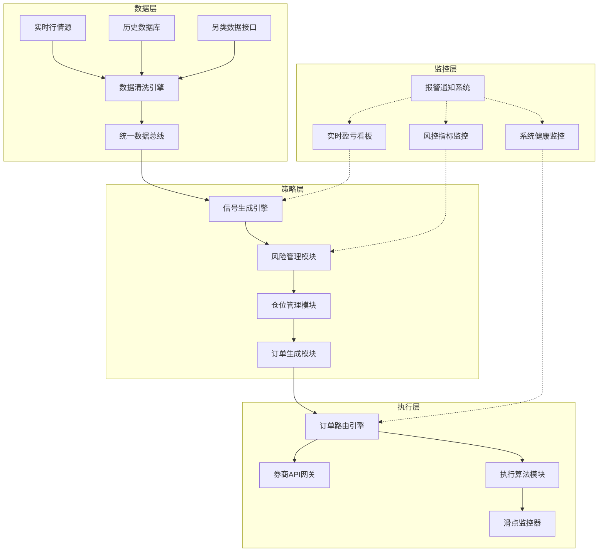
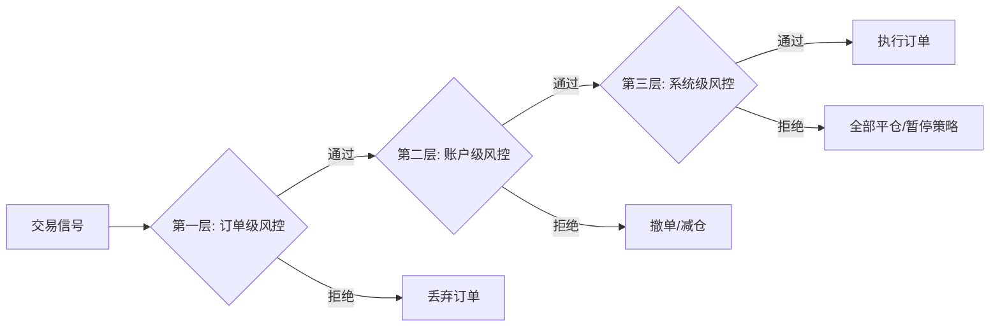
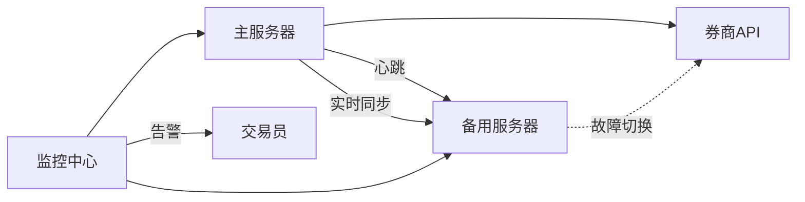
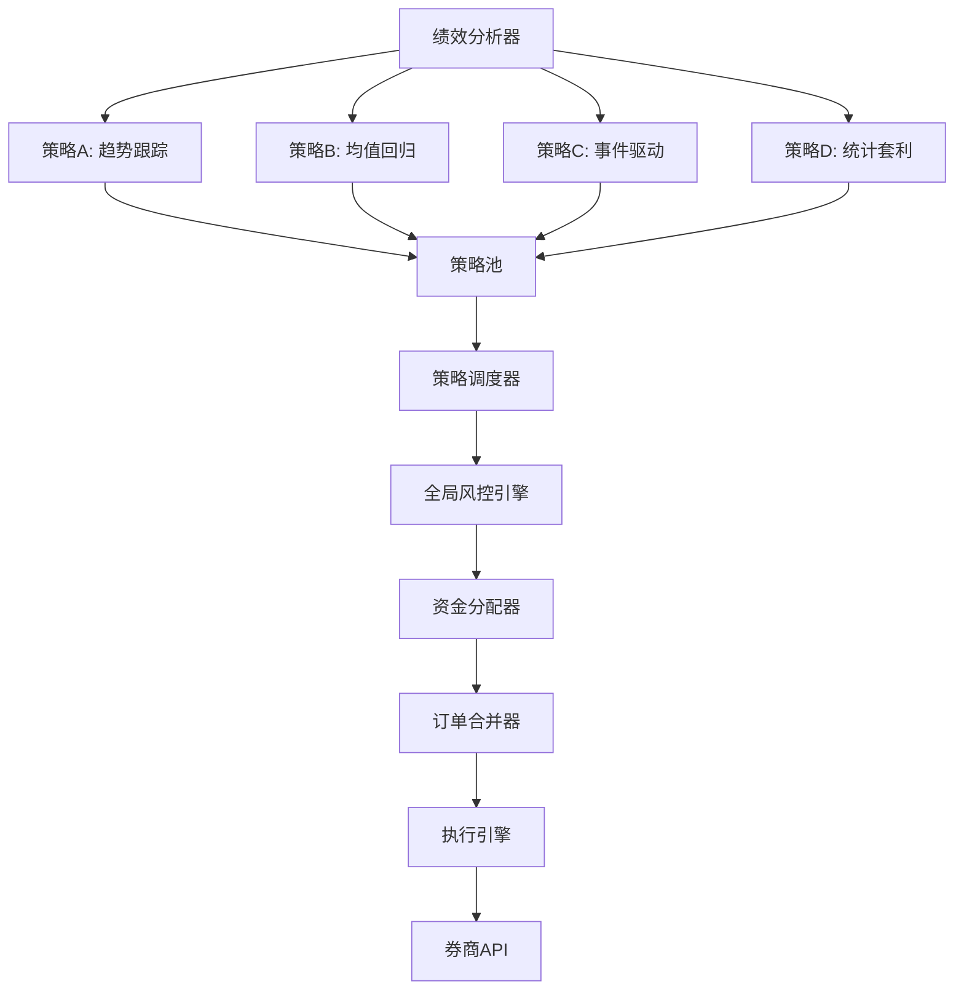

## 六、量化交易实盘部署

回测漂亮的策略，放到实盘可能一塌糊涂。实盘部署是量化交易从"纸上谈兵"到"真金白银"的关键跨越，涉及系统工程、网络通信、风控机制、运维监控等多个技术领域。本章从架构设计到日常运维，系统讲解如何将一个经过验证的策略安全、稳定地部署到实盘环境。

### 6.1 回测到实盘的鸿沟

很多新手量化交易者有一个误区：回测年化50%的策略，实盘也能赚50%。现实是残酷的，回测和实盘之间存在多层"损耗"。

**回测与实盘的核心差异：**

| 维度 | 回测环境 | 实盘环境 | 影响程度 |
|------|----------|----------|----------|
| 成本模型 | 简化或忽略 | 佣金+印花税+过户费+滑点 | 高——可能吃掉20%-40%利润 |
| 执行速度 | 瞬间成交 | 网络延迟+排队+部分成交 | 中——信号衰减、滑点增加 |
| 流动性假设 | 无限流动性 | 真实盘口深度有限 | 高——大资金无法按信号价成交 |
| 数据质量 | 清洗后的干净数据 | 实时数据可能有错误/延迟 | 中——信号被脏数据干扰 |
| 心理因素 | 无情绪 | 恐惧、贪婪、犹豫 | 高——手动干预破坏策略纪律 |
| 市场冲击 | 不考虑 | 下单本身影响价格 | 低到中——取决于资金量 |
| 制度约束 | 可能忽略 | T+1、涨跌停、停牌 | 高——策略无法执行 |

**衰减幅度的行业经验：**

- 趋势跟踪策略：回测到实盘衰减约15%-30%
- 统计套利策略：衰减约20%-40%
- 高频策略：衰减可能超过50%（执行质量是命门）
- 事件驱动策略：衰减约10%-20%（信号本身有时间优势）

**降低衰减的关键措施：**

1. 回测时使用真实成本模型（佣金万2.5+印花税千1+滑点千0.5）
2. 回测时加入成交概率模拟，不假设100%成交
3. 使用样本外数据验证，避免过拟合
4. 模拟盘运行至少1-3个月再上实盘
5. 初始实盘用小资金（总资金的5%-10%）验证

### 6.2 实盘交易系统架构

一个生产级的量化交易系统不是"一个Python脚本跑到底"，而是需要分层设计、模块解耦的工程系统。

**四层架构全景：**



**各层职责详解：**

**数据层**是整个系统的基础。数据质量直接决定策略信号的质量。数据层需要处理的核心问题包括：多数据源统一接入（不同券商/数据商的API格式各异）、数据清洗（处理缺失值、异常值、复权因子）、数据同步（确保多个策略看到的数据一致）和数据持久化（历史数据存储用于回测和分析）。

**策略层**是系统的大脑。信号生成引擎根据策略逻辑产生买卖信号；风险管理模块在信号通过之前进行全局风险检查（总仓位、行业集中度、个股集中度、最大回撤阈值等）；仓位管理模块决定每笔交易的具体数量；订单生成模块将交易意图转化为可执行的订单。

**执行层**是系统的手脚。订单路由引擎决定订单发往哪个券商账户、使用何种执行算法；券商API网关负责与券商系统的通信；执行算法模块实现TWAP、VWAP等智能拆单逻辑；滑点监控器实时比较目标价和实际成交价。

**监控层**是系统的感官。实时盈亏看板展示策略表现；风控指标监控跟踪各项风控参数；系统健康监控关注CPU、内存、网络、磁盘等资源；报警通知系统在异常发生时第一时间通知交易员。

**单机部署 vs 分布式部署：**

| 维度 | 单机部署 | 分布式部署 |
|------|----------|------------|
| 适用场景 | 个人交易者、小资金 | 团队/机构、大资金 |
| 技术栈 | Python脚本+SQLite/MySQL | 微服务+消息队列+分布式数据库 |
| 延迟 | 低（本地通信） | 需要优化网络 |
| 可靠性 | 单点故障风险 | 高可用、自动故障转移 |
| 扩展性 | 有限 | 水平扩展 |
| 运维复杂度 | 低 | 高 |
| 成本 | 低（一台服务器） | 高（多台服务器+运维） |

对于个人交易者，单机部署完全够用。关键是做好进程管理和异常处理，而不是盲目追求分布式架构。

### 6.3 部署环境搭建

**服务器选择：**

- **物理位置**：尽量选择离交易所机房近的服务器。上交所和深交所的撮合机房在上海张江和深圳福田，选择同城市的云服务器可以降低网络延迟
- **操作系统**：推荐 Ubuntu 22.04 LTS 或 CentOS Stream 9，稳定且社区支持好
- **硬件配置**：CPU 4核以上、内存16GB以上、SSD硬盘500GB以上（存储历史数据）、千兆网络
- **云服务商**：阿里云、腾讯云、华为云都可。高频交易建议使用券商托管的专用服务器

**基础环境配置：**

```bash
# 1. 系统更新
sudo apt update && sudo apt upgrade -y

# 2. 安装Python环境管理工具
curl -sSL https://install.python-poetry.org | python3 -
# 或使用conda
wget https://repo.anaconda.com/miniconda/Miniconda3-latest-Linux-x86_64.sh
bash Miniconda3-latest-Linux-x86_64.sh -b

# 3. 创建项目虚拟环境
python -m venv /opt/quant/venv
source /opt/quant/venv/bin/activate

# 4. 安装核心依赖
pip install numpy pandas scipy matplotlib
pip install tushare akshare  # 数据源
pip install redis psycopg2-binary  # 缓存和数据库
pip install apscheduler  # 定时任务
pip install loguru  # 日志
pip install requests websocket-client  # 网络通信

# 5. 配置系统时区（与交易所一致）
sudo timedatectl set-timezone Asia/Shanghai

# 6. 同步系统时钟（交易对时间精度要求高）
sudo apt install chrony
sudo systemctl enable chrony
```

**项目目录结构：**

```text
quant-trading/
├── config/
│   ├── settings.yaml          # 全局配置
│   ├── strategies/            # 策略参数配置
│   └── accounts.yaml          # 账户信息（加密存储）
├── core/
│   ├── data/                  # 数据层模块
│   │   ├── market_data.py     # 实时行情
│   │   ├── history_data.py    # 历史数据
│   │   └── data_cleaner.py    # 数据清洗
│   ├── strategy/              # 策略层模块
│   │   ├── signals.py         # 信号生成
│   │   ├── risk_manager.py    # 风控
│   │   └── position_manager.py # 仓位管理
│   ├── execution/             # 执行层模块
│   │   ├── order_manager.py   # 订单管理
│   │   ├── broker_api.py      # 券商接口
│   │   └── algo_engine.py     # 执行算法
│   └── monitor/               # 监控模块
│       ├── pnl_tracker.py     # 盈亏跟踪
│       ├── health_check.py    # 健康检查
│       └── alert.py           # 报警通知
├── data/
│   ├── market/                # 行情数据存储
│   ├── factors/               # 因子数据
│   └── trades/                # 交易记录
├── logs/
│   ├── trade/                 # 交易日志
│   ├── system/                # 系统日志
│   └── error/                 # 错误日志
├── scripts/
│   ├── start.sh               # 启动脚本
│   ├── stop.sh                # 停止脚本
│   └── restart.sh             # 重启脚本
├── tests/                     # 单元测试
├── main.py                    # 主入口
└── requirements.txt           # 依赖清单
```

**进程管理——使用systemd：**

```ini
# /etc/systemd/system/quant-trading.service
[Unit]
Description=Quantitative Trading System
After=network.target
Wants=network-online.target

[Service]
Type=simple
User=quant
Group=quant
WorkingDirectory=/opt/quant-trading
Environment=PYTHONPATH=/opt/quant-trading
ExecStart=/opt/quant/venv/bin/python main.py
ExecStop=/bin/kill -SIGTERM $MAINPID
Restart=always
RestartSec=10
StandardOutput=append:/opt/quant-trading/logs/system/stdout.log
StandardError=append:/opt/quant-trading/logs/system/stderr.log

# 安全加固
NoNewPrivileges=true
ProtectSystem=strict
ReadWritePaths=/opt/quant-trading

[Install]
WantedBy=multi-user.target
```

```bash
# 启用并启动服务
sudo systemctl daemon-reload
sudo systemctl enable quant-trading
sudo systemctl start quant-trading

# 查看状态
sudo systemctl status quant-trading
sudo journalctl -u quant-trading -f
```

### 6.4 券商API接入

**国内主流量化交易接口对比：**

| 券商/平台 | API名称 | 支持市场 | 延迟 | 门槛 | 适合人群 |
|-----------|---------|----------|------|------|----------|
| 中泰证券 | XTP | A股/期货/期权 | <1ms | 50万+ | 专业交易者 |
| 华鑫证券 | 奇点(SIMBA) | A股 | <0.5ms | 100万+ | 高频交易者 |
| 迅投科技 | QMT | A股/期货 | <5ms | 无硬性门槛 | 入门/中级 |
| 掘金量化 | Myquant | A股/期货 | <3ms | 无 | 研究+交易一体化 |
| 聚宽 | JoinQuant | A股 | 中等 | 无 | 学习和研究 |
| 恒生电子 | UFT/LDP | 全市场 | <0.1ms | 机构级 | 机构交易者 |
| 中泰XTP | XTP | A股/港股通 | <1ms | 50万+ | 跨市场交易 |

**API接入完整流程：**

**第一步：券商开户与权限申请**

携带身份证到券商营业部开通证券账户，同时申请程序化交易权限。部分券商支持线上申请。需要签署《程序化交易风险揭示书》和《API使用协议》。资金门槛因券商而异，QMT和掘金基本无门槛，XTP通常要求50万以上。

**第二步：获取开发凭证**

券商审核通过后，会提供以下信息：
- API Key（应用标识）
- Secret Key（签名密钥，务必保密）
- 行情服务器地址和端口
- 交易服务器地址和端口
- 模拟交易环境地址（用于测试）

**第三步：SDK安装与环境配置**

以XTP API为例：

```bash
# 安装XTP Python SDK
pip install xtp-api

# 或从GitHub克隆源码编译
git clone https://github.com/nicai0609/xtp_api_python.git
cd xtp_api_python
python setup.py install
```

**第四步：连接与认证代码**

```python
import xtp_api
from datetime import datetime

class BrokerConnection:
    """券商API连接管理器"""
    
    def __init__(self, config):
        self.config = config
        self.trader_api = None
        self.quote_api = None
        self.is_connected = False
        self.is_authenticated = False
    
    def connect_trading(self):
        """连接交易服务器"""
        self.trader_api = xtp_api.TraderApi()
        
        # 设置回调
        self.trader_api.register_callback(self._on_order_response)
        self.trader_api.register_callback(self._on_trade_report)
        
        # 登录
        login_result = self.trader_api.login(
            ip=self.config['trade_host'],
            port=self.config['trade_port'],
            user=self.config['user_id'],
            password=self.config['password'],
            sock_type=1  # TCP
        )
        
        if login_result['error_id'] == 0:
            self.is_connected = True
            self.is_authenticated = True
            print(f"交易服务器连接成功: {datetime.now()}")
        else:
            raise ConnectionError(
                f"连接失败: {login_result['error_msg']}"
            )
    
    def connect_market_data(self):
        """连接行情服务器"""
        self.quote_api = xtp_api.QuoteApi()
        
        login_result = self.quote_api.login(
            ip=self.config['quote_host'],
            port=self.config['quote_port'],
            user=self.config['user_id'],
            password=self.config['password']
        )
        
        if login_result['error_id'] == 0:
            print(f"行情服务器连接成功")
        else:
            raise ConnectionError(
                f"行情连接失败: {login_result['error_msg']}"
            )
    
    def _on_order_response(self, data):
        """订单响应回调"""
        print(f"订单状态更新: {data['order_id']}, "
              f"状态: {data['order_status']}")
    
    def _on_trade_report(self, data):
        """成交通知回调"""
        print(f"成交回报: {data['ticker']}, "
              f"价格: {data['price']}, "
              f"数量: {data['quantity']}")
```

**第五步：测试下单功能**

```python
def test_order_flow(broker):
    """测试完整下单流程"""
    
    # 1. 查询账户资金
    balance = broker.trader_api.get_balance()
    print(f"可用资金: {balance['available']}")
    
    # 2. 查询持仓
    positions = broker.trader_api.get_positions()
    for pos in positions:
        print(f"持仓: {pos['ticker']}, "
              f"数量: {pos['quantity']}, "
              f"成本: {pos['cost_price']}")
    
    # 3. 下一笔小额限价单测试
    order_id = broker.trader_api.place_order(
        ticker='510300',       # 沪深300ETF
        market=1,              # 上海市场
        price=4.00,            # 限价
        quantity=100,          # 1手
        direction=0,           # 买入
        order_type=1           # 限价单
    )
    print(f"下单成功，订单号: {order_id}")
    
    # 4. 查询订单状态
    order_info = broker.trader_api.get_order(order_id)
    print(f"订单状态: {order_info['order_status']}")
    
    # 5. 撤单测试
    if order_info['order_status'] in ['已报', '部成']:
        cancel_result = broker.trader_api.cancel_order(order_id)
        print(f"撤单结果: {cancel_result}")
```

**第六步：生产环境安全配置**

```python
# config/settings.yaml 生产环境配置示例
broker:
  # 使用环境变量存储敏感信息，不硬编码
  user_id: ${BROKER_USER_ID}
  password: ${BROKER_PASSWORD}
  api_key: ${BROKER_API_KEY}
  
  # 交易服务器（生产环境）
  trade_host: "xxx.xxx.xxx.xxx"
  trade_port: xxxxx
  
  # 行情服务器
  quote_host: "xxx.xxx.xxx.xxx"
  quote_port: xxxxx
  
  # 连接参数
  heartbeat_interval: 30      # 心跳间隔（秒）
  reconnect_attempts: 5       # 断线重连次数
  reconnect_delay: 5          # 重连间隔（秒）
  order_timeout: 60           # 订单超时时间（秒）
```

### 6.5 订单执行算法

当策略产生交易信号后，如何把订单高效地执行是一门学问。直接用市价单"梭哈"在大资金量下会产生严重滑点，执行算法（Execution Algorithm）就是为了解决这个问题。

**TWAP（时间加权平均价格）：**

将大单拆分成等量小单，在指定时间窗口内均匀下单。适用于对执行时间没有严格限制的场景。

```python
import time
import math

class TWAPExecutor:
    """TWAP执行算法"""
    
    def __init__(self, broker_api, total_quantity, 
                 duration_minutes=30, num_slices=10):
        self.api = broker_api
        self.total_qty = total_quantity
        self.duration = duration_minutes * 60  # 转为秒
        self.num_slices = num_slices
        self.slice_qty = math.ceil(total_quantity / num_slices)
        self.interval = self.duration / num_slices
        self.executed_qty = 0
        self.executed_prices = []
    
    def execute(self, ticker, market, direction):
        """执行TWAP算法"""
        print(f"TWAP开始: {ticker}, 总量={self.total_qty}, "
              f"分{self.num_slices}批, 间隔={self.interval:.0f}秒")
        
        for i in range(self.num_slices):
            # 计算本批次数量
            remaining = self.total_qty - self.executed_qty
            current_slice = min(self.slice_qty, remaining)
            
            if current_slice <= 0:
                break
            
            # 获取当前盘口价格
            quote = self.api.get_quote(ticker)
            
            if direction == 'buy':
                # 买入时取卖一价，确保能成交
                price = quote['ask_price_1']
            else:
                # 卖出时取买一价
                price = quote['bid_price_1']
            
            # 下单
            order_id = self.api.place_order(
                ticker=ticker,
                market=market,
                price=price,
                quantity=current_slice,
                direction=direction,
                order_type=1  # 限价单
            )
            
            # 等待成交
            time.sleep(2)
            order_status = self.api.get_order(order_id)
            
            if order_status['order_status'] == '全部成交':
                self.executed_qty += current_slice
                self.executed_prices.append(price)
                print(f"  第{i+1}批成交: {current_slice}股@{price}")
            elif order_status['order_status'] == '部分成交':
                filled = order_status['filled_quantity']
                self.executed_qty += filled
                self.executed_prices.append(price)
                print(f"  第{i+1}批部分成交: {filled}股@{price}")
                # 撤销未成交部分
                self.api.cancel_order(order_id)
            else:
                print(f"  第{i+1}批未成交，跳过")
                self.api.cancel_order(order_id)
            
            # 等待下一批次
            if i < self.num_slices - 1:
                time.sleep(self.interval)
        
        # 计算执行结果
        avg_price = (sum(p * q for p, q in 
                     zip(self.executed_prices, 
                         [self.slice_qty] * len(self.executed_prices)))
                     / self.executed_qty 
                     if self.executed_qty > 0 else 0)
        
        print(f"\nTWAP执行完成:")
        print(f"  已执行: {self.executed_qty}/{self.total_qty}")
        print(f"  平均价格: {avg_price:.3f}")
        print(f"  完成率: {self.executed_qty/self.total_qty*100:.1f}%")
        
        return avg_price, self.executed_qty
```

**VWAP（成交量加权平均价格）：**

根据历史成交量分布来分配每个时段的下单量，在成交量大的时段多下、成交量小的时段少下，目标是使执行均价接近全天VWAP。

```python
class VWAPExecutor:
    """VWAP执行算法"""
    
    def __init__(self, broker_api, total_quantity):
        self.api = broker_api
        self.total_qty = total_quantity
        
        # A股典型成交量日内分布（占比）
        # 基于历史统计：开盘和尾盘成交量大，午盘前和午后成交量小
        self.volume_profile = {
            '09:30-10:00': 0.15,  # 开盘活跃
            '10:00-10:30': 0.10,
            '10:30-11:00': 0.08,
            '11:00-11:30': 0.07,  # 午盘前萎缩
            '13:00-13:30': 0.08,  # 午后开盘
            '13:30-14:00': 0.07,
            '14:00-14:30': 0.10,
            '14:30-14:57': 0.20,  # 尾盘活跃
            '14:57-15:00': 0.15   # 集合竞价
        }
    
    def calculate_slice_quantities(self):
        """根据成交量分布计算每个时段的下单量"""
        slices = {}
        allocated = 0
        periods = list(self.volume_profile.items())
        
        for i, (period, ratio) in enumerate(periods):
            if i == len(periods) - 1:
                # 最后一个时段分配剩余全部
                qty = self.total_qty - allocated
            else:
                qty = round(self.total_qty * ratio / 100) * 100
                # 确保是100的整数倍
                qty = max(100, qty)
            slices[period] = qty
            allocated += qty
        
        return slices
```

**常用执行算法对比：**

| 算法 | 核心思想 | 适用场景 | 优点 | 缺点 |
|------|----------|----------|------|------|
| TWAP | 时间均匀拆单 | 不急不慢的调仓 | 简单、可预测 | 忽略成交量分布 |
| VWAP | 跟随成交量拆单 | 追踪基准指数 | 降低市场冲击 | 需要历史成交量数据 |
| IS（Implementation Shortfall） | 最小化执行差价 | 对价格敏感的大单 | 最优执行 | 算法复杂 |
| 冰山单 | 只暴露部分订单 | 隐藏真实交易意图 | 减少信息泄露 | 可能成交缓慢 |
| 收盘单 | 集中在收盘执行 | 指数基金调仓 | 价格确定性高 | 只适合收盘策略 |

### 6.6 风险管理体系

实盘交易中，风控是生命线。再好的策略，没有风控保护都可能在一次黑天鹅事件中爆仓。

**三层风控架构：**



**第一层：订单级风控（单笔交易检查）**

```python
class OrderLevelRiskCheck:
    """订单级风控"""
    
    def __init__(self, config):
        self.max_single_order_value = config.get(
            'max_single_order_value', 500000)   # 单笔最大金额50万
        self.max_single_order_ratio = config.get(
            'max_single_order_ratio', 0.05)     # 单笔不超过总资产5%
        self.price_deviation_limit = config.get(
            'price_deviation_limit', 0.03)      # 价格偏离不超过3%
        self.min_order_interval = config.get(
            'min_order_interval', 1)            # 最小下单间隔1秒
    
    def check(self, order, account_balance, current_price):
        """检查单笔订单是否合规"""
        checks = []
        
        # 1. 金额检查
        order_value = order.price * order.quantity
        if order_value > self.max_single_order_value:
            checks.append(
                f"单笔金额{order_value:.0f}超过限制"
                f"{self.max_single_order_value:.0f}"
            )
        
        # 2. 占比检查
        ratio = order_value / account_balance['total_assets']
        if ratio > self.max_single_order_ratio:
            checks.append(
                f"单笔占比{ratio:.2%}超过限制"
                f"{self.max_single_order_ratio:.2%}"
            )
        
        # 3. 价格偏离检查（防止乌龙指）
        if current_price > 0:
            deviation = abs(order.price - current_price) / current_price
            if deviation > self.price_deviation_limit:
                checks.append(
                    f"委托价{order.price}偏离现价"
                    f"{current_price}超过{deviation:.2%}"
                )
        
        # 4. 数量检查（必须是100的整数倍）
        if order.quantity % 100 != 0:
            checks.append(
                f"委托数量{order.quantity}不是100的整数倍"
            )
        
        if checks:
            return False, "; ".join(checks)
        return True, "通过"
```

**第二层：账户级风控（整体仓位检查）**

```python
class AccountLevelRiskCheck:
    """账户级风控"""
    
    def __init__(self, config):
        self.max_total_position_ratio = config.get(
            'max_total_position_ratio', 0.8)    # 最大总仓位80%
        self.max_single_stock_ratio = config.get(
            'max_single_stock_ratio', 0.15)     # 单股最大15%
        self.max_industry_ratio = config.get(
            'max_industry_ratio', 0.30)         # 单行业最大30%
        self.max_drawdown_limit = config.get(
            'max_drawdown_limit', 0.15)         # 最大回撤15%
        self.daily_loss_limit = config.get(
            'daily_loss_limit', 0.03)           # 单日亏损3%停止
    
    def check(self, order, portfolio):
        """检查账户整体风险"""
        alerts = []
        
        # 1. 总仓位检查
        new_total_ratio = (
            portfolio['market_value'] + 
            order.price * order.quantity
        ) / portfolio['total_assets']
        
        if new_total_ratio > self.max_total_position_ratio:
            alerts.append(
                f"总仓位将达到{new_total_ratio:.2%}，"
                f"超过{self.max_total_position_ratio:.2%}限制"
            )
        
        # 2. 单股集中度检查
        ticker = order.ticker
        current_holding = portfolio['positions'].get(ticker, {})
        new_holding_value = (
            current_holding.get('market_value', 0) + 
            order.price * order.quantity
        )
        stock_ratio = new_holding_value / portfolio['total_assets']
        
        if stock_ratio > self.max_single_stock_ratio:
            alerts.append(
                f"{ticker}仓位将达到{stock_ratio:.2%}，"
                f"超过{self.max_single_stock_ratio:.2%}限制"
            )
        
        # 3. 当日亏损检查
        daily_pnl_ratio = (
            portfolio['daily_pnl'] / portfolio['total_assets']
        )
        if daily_pnl_ratio < -self.daily_loss_limit:
            alerts.append(
                f"当日亏损已达{daily_pnl_ratio:.2%}，"
                f"触发{self.daily_loss_limit:.2%}止损线"
            )
        
        if alerts:
            return False, "; ".join(alerts)
        return True, "通过"
```

**第三层：系统级风控（极端情况保护）**

```python
class SystemLevelRiskControl:
    """系统级风控——极端情况下的最后防线"""
    
    def __init__(self, config):
        self.circuit_breaker_drawdown = config.get(
            'circuit_breaker_drawdown', 0.20)    # 20%回撤熔断
        self.max_order_per_minute = config.get(
            'max_order_per_minute', 60)          # 每分钟最多60笔
        self.max_cancel_per_minute = config.get(
            'max_cancel_per_minute', 100)        # 每分钟最多撤单100次
        self.broker_disconnect_timeout = config.get(
            'broker_disconnect_timeout', 300)    # 断线5分钟平仓
        
        self.order_count_window = []
        self.cancel_count_window = []
        self.is_emergency = False
    
    def check_emergency(self, portfolio):
        """检查是否触发紧急熔断"""
        # 最大回撤熔断
        drawdown = (
            portfolio['peak_value'] - portfolio['current_value']
        ) / portfolio['peak_value']
        
        if drawdown >= self.circuit_breaker_drawdown:
            self.trigger_emergency(
                f"最大回撤{drawdown:.2%}触发熔断，"
                f"阈值{self.circuit_breaker_drawdown:.2%}"
            )
            return True
        
        return False
    
    def check_order_frequency(self):
        """检查下单频率是否异常"""
        now = time.time()
        # 清理60秒前的记录
        self.order_count_window = [
            t for t in self.order_count_window 
            if now - t < 60
        ]
        
        if len(self.order_count_window) >= self.max_order_per_minute:
            self.trigger_emergency(
                f"下单频率异常：1分钟内{len(self.order_count_window)}笔"
            )
            return True
        
        self.order_count_window.append(now)
        return False
    
    def trigger_emergency(self, reason):
        """触发紧急保护措施"""
        self.is_emergency = True
        print(f"!!! 紧急熔断触发 !!! 原因: {reason}")
        
        # 1. 撤销所有未成交订单
        # 2. 暂停所有策略
        # 3. 发送紧急通知
        # 4. 记录详细日志
```

**止损机制的分层设计：**

| 止损层级 | 触发条件 | 动作 | 恢复方式 |
|----------|----------|------|----------|
| 单股止损 | 个股亏损超过8% | 卖出该股 | 自动恢复交易 |
| 策略止损 | 单策略回撤超过10% | 暂停该策略 | 人工审核后恢复 |
| 账户止损 | 总账户回撤超过15% | 全部平仓 | 人工审核后恢复 |
| 熔断止损 | 总账户回撤超过20% | 全部平仓+停止系统 | 需要全面复盘后重启 |

### 6.7 策略监控与运维

策略上线不意味着万事大吉，持续的监控和运维才是长期盈利的保障。

**每日监控清单：**

```text
开盘前（9:00-9:15）：
  □ 检查系统进程是否正常运行
  □ 确认数据源连接正常
  □ 验证券商API连接正常
  □ 检查账户资金和持仓是否与昨日一致
  □ 确认今日是否有股票停牌/退市/分红等事件
  □ 检查风控参数是否需要调整（如遇极端行情）

盘中（9:30-15:00）：
  □ 策略信号是否正常生成
  □ 订单是否正常执行
  □ 持仓是否符合策略预期
  □ 当日盈亏是否在合理范围内
  □ 是否有异常交易（大量下单/撤单/重复信号）
  □ 系统资源使用情况（CPU/内存/网络）

收盘后（15:00-15:30）：
  □ 核对当日交易记录
  □ 计算当日盈亏和交易成本
  □ 检查策略衰减指标
  □ 备份当日数据和日志
  □ 记录异常事件和处理结果
```

**策略衰减检测——多维度监控：**

策略衰减不是突然发生的，而是一个渐进的过程。单一指标（如夏普比率）可能产生误判，需要多维度综合判断。

```python
import numpy as np
import pandas as pd

class StrategyDecayDetector:
    """多维度策略衰减检测器"""
    
    def __init__(self, returns, window=60, lookback=30):
        self.returns = returns
        self.window = window          # 滚动窗口
        self.lookback = lookback      # 近期观察窗口
    
    def detect(self):
        """综合检测策略衰减"""
        results = {
            'sharpe_decay': self._check_sharpe_decay(),
            'win_rate_decay': self._check_win_rate_decay(),
            'profit_factor_decay': self._check_profit_factor_decay(),
            'max_drawdown_alert': self._check_max_drawdown(),
            'consecutive_losses': self._check_consecutive_losses(),
            'overall_status': '正常'
        }
        
        # 综合判断
        warning_count = sum(
            1 for v in results.values() 
            if isinstance(v, dict) and v.get('status') == '警告'
        )
        danger_count = sum(
            1 for v in results.values() 
            if isinstance(v, dict) and v.get('status') == '危险'
        )
        
        if danger_count >= 2:
            results['overall_status'] = '危险——建议立即暂停策略'
        elif danger_count >= 1 or warning_count >= 2:
            results['overall_status'] = '警告——需要密切关注'
        else:
            results['overall_status'] = '正常'
        
        return results
    
    def _check_sharpe_decay(self):
        """夏普比率衰减检测"""
        rolling_sharpe = (
            self.returns.rolling(self.window).mean() / 
            self.returns.rolling(self.window).std() * 
            np.sqrt(252)
        )
        
        recent = rolling_sharpe.iloc[-self.lookback:].mean()
        historical = rolling_sharpe.mean()
        
        ratio = recent / historical if historical != 0 else 1
        
        if ratio < 0.3:
            return {'status': '危险', 'value': ratio, 
                    'detail': f'夏普比率衰减至历史的{ratio:.1%}'}
        elif ratio < 0.5:
            return {'status': '警告', 'value': ratio,
                    'detail': f'夏普比率衰减至历史的{ratio:.1%}'}
        return {'status': '正常', 'value': ratio}
    
    def _check_win_rate_decay(self):
        """胜率衰减检测"""
        recent = self.returns.iloc[-self.lookback:]
        historical = self.returns
        
        recent_wr = (recent > 0).mean()
        hist_wr = (historical > 0).mean()
        
        if recent_wr < hist_wr * 0.6:
            return {'status': '危险', 'recent': recent_wr, 
                    'historical': hist_wr}
        elif recent_wr < hist_wr * 0.8:
            return {'status': '警告', 'recent': recent_wr, 
                    'historical': hist_wr}
        return {'status': '正常', 'recent': recent_wr, 
                'historical': hist_wr}
    
    def _check_profit_factor_decay(self):
        """盈亏比衰减检测"""
        recent = self.returns.iloc[-self.lookback:]
        
        gains = recent[recent > 0].sum()
        losses = abs(recent[recent < 0].sum())
        
        profit_factor = gains / losses if losses > 0 else float('inf')
        
        # 盈亏比低于1.2视为危险
        if profit_factor < 1.0:
            return {'status': '危险', 'value': profit_factor}
        elif profit_factor < 1.2:
            return {'status': '警告', 'value': profit_factor}
        return {'status': '正常', 'value': profit_factor}
    
    def _check_max_drawdown(self):
        """最大回撤检测"""
        cummax = (1 + self.returns).cumprod().cummax()
        drawdown = (
            (1 + self.returns).cumprod() - cummax
        ) / cummax
        
        recent_max_dd = drawdown.iloc[-self.lookback:].min()
        
        if recent_max_dd < -0.15:
            return {'status': '危险', 'value': recent_max_dd}
        elif recent_max_dd < -0.10:
            return {'status': '警告', 'value': recent_max_dd}
        return {'status': '正常', 'value': recent_max_dd}
    
    def _check_consecutive_losses(self):
        """连续亏损检测"""
        recent = self.returns.iloc[-self.lookback:]
        
        max_consecutive = 0
        current_consecutive = 0
        for r in recent:
            if r < 0:
                current_consecutive += 1
                max_consecutive = max(
                    max_consecutive, current_consecutive
                )
            else:
                current_consecutive = 0
        
        if max_consecutive >= 7:
            return {'status': '危险', 
                    'value': max_consecutive}
        elif max_consecutive >= 5:
            return {'status': '警告', 
                    'value': max_consecutive}
        return {'status': '正常', 'value': max_consecutive}
```

**日志规范——结构化日志是运维的生命线：**

```python
import json
from datetime import datetime
from loguru import logger

# 配置日志输出
logger.add(
    "logs/trade/trade_{time:YYYY-MM-DD}.log",
    format="{time:YYYY-MM-DD HH:mm:ss.SSS} | {level} | {message}",
    rotation="00:00",       # 每天零点切割
    retention="90 days",    # 保留90天
    compression="gz",       # 压缩旧日志
    level="INFO"
)

logger.add(
    "logs/error/error_{time:YYYY-MM-DD}.log",
    rotation="00:00",
    retention="180 days",
    level="ERROR"
)

def log_trade(action, ticker, price, quantity, order_id=None, 
              reason=None):
    """记录结构化交易日志"""
    log_entry = {
        'timestamp': datetime.now().isoformat(),
        'action': action,           # BUY/SELL/CANCEL
        'ticker': ticker,
        'price': price,
        'quantity': quantity,
        'order_id': order_id,
        'reason': reason
    }
    logger.info(json.dumps(log_entry, ensure_ascii=False))

def log_signal(strategy, ticker, signal_type, strength, 
               indicators=None):
    """记录策略信号日志"""
    log_entry = {
        'timestamp': datetime.now().isoformat(),
        'strategy': strategy,
        'ticker': ticker,
        'signal': signal_type,      # BUY/SELL/HOLD
        'strength': strength,       # 0-1
        'indicators': indicators or {}
    }
    logger.info(json.dumps(log_entry, ensure_ascii=False))

def log_risk_check(order, result, reason=None):
    """记录风控检查日志"""
    log_entry = {
        'timestamp': datetime.now().isoformat(),
        'ticker': order.ticker,
        'action': order.direction,
        'quantity': order.quantity,
        'risk_result': result,      # PASS/REJECT
        'reason': reason
    }
    level = "INFO" if result == "PASS" else "WARNING"
    logger.log(level, json.dumps(log_entry, ensure_ascii=False))
```

**报警通知——分级通知机制：**

```python
import requests
from enum import IntEnum

class AlertLevel(IntEnum):
    INFO = 0      # 信息——仅记录日志
    WARNING = 1   # 警告——发送消息通知
    ERROR = 2     # 错误——发送消息+电话通知
    CRITICAL = 3  # 严重——发送消息+电话+自动处置

class AlertNotifier:
    """报警通知系统"""
    
    def __init__(self, config):
        self.wechat_webhook = config.get('wechat_webhook')
        self.phone_api = config.get('phone_api')
        self.dingtalk_webhook = config.get('dingtalk_webhook')
    
    def send(self, level, title, message):
        """根据级别发送通知"""
        if level >= AlertLevel.WARNING:
            self._send_wechat(title, message)
        
        if level >= AlertLevel.ERROR:
            self._send_dingtalk(title, message)
            self._send_phone_alert(title)
        
        if level >= AlertLevel.CRITICAL:
            self._send_wechat(f"🚨 紧急: {title}", message)
            self._send_phone_alert(f"紧急: {title}")
    
    def _send_wechat(self, title, message):
        """发送企业微信消息"""
        payload = {
            'msgtype': 'markdown',
            'markdown': {
                'content': f"### {title}\n{message}"
            }
        }
        try:
            requests.post(self.wechat_webhook, json=payload, 
                         timeout=5)
        except Exception as e:
            print(f"微信通知发送失败: {e}")
    
    def _send_dingtalk(self, title, message):
        """发送钉钉消息"""
        payload = {
            'msgtype': 'text',
            'text': {'content': f"{title}\n{message}"}
        }
        try:
            requests.post(self.dingtalk_webhook, json=payload, 
                         timeout=5)
        except Exception as e:
            print(f"钉钉通知发送失败: {e}")
    
    def _send_phone_alert(self, title):
        """电话告警（通过第三方服务）"""
        # 接入阿里云语音通知/腾讯云语音通知等服务
        pass
```

### 6.8 数据管理与备份

数据是量化交易的核心资产，包括历史行情数据、交易记录、策略参数、因子数据等。数据丢失或损坏可能导致无法复盘、无法回测、甚至无法恢复持仓。

**数据备份策略：**

```bash
#!/bin/bash
# backup_quant_data.sh — 每日数据备份脚本

BACKUP_DIR="/opt/quant-backup"
DATA_DIR="/opt/quant-trading/data"
DATE=$(date +%Y%m%d)

# 创建备份目录
mkdir -p ${BACKUP_DIR}/${DATE}

# 1. 备份交易记录（最重要）
cp -r ${DATA_DIR}/trades/ ${BACKUP_DIR}/${DATE}/trades/

# 2. 备份策略配置
cp -r /opt/quant-trading/config/ ${BACKUP_DIR}/${DATE}/config/

# 3. 备份日志
tar -czf ${BACKUP_DIR}/${DATE}/logs.tar.gz \
    /opt/quant-trading/logs/

# 4. 备份因子数据（如果更新了的话）
cp -r ${DATA_DIR}/factors/ ${BACKUP_DIR}/${DATE}/factors/

# 5. 备份数据库
pg_dump quant_db > ${BACKUP_DIR}/${DATE}/quant_db.sql

# 6. 上传到远程存储（OSS/S3）
# ossutil cp ${BACKUP_DIR}/${DATE}/ oss://your-bucket/quant-backup/${DATE}/ -r

# 7. 清理30天前的本地备份
find ${BACKUP_DIR} -maxdepth 1 -type d -mtime +30 -exec rm -rf {} \;

echo "备份完成: ${DATE}"
```

**数据库选型建议：**

| 数据类型 | 推荐存储 | 原因 |
|----------|----------|------|
| 实时行情（tick级） | Redis + TimescaleDB | 高写入性能+时序查询 |
| 日K/分钟K历史数据 | PostgreSQL + TimescaleDB | 复杂查询+时序优化 |
| 交易记录 | PostgreSQL | 事务一致性 |
| 因子数据 | Parquet文件/ClickHouse | 列式存储，分析高效 |
| 配置信息 | YAML文件 + Git版本控制 | 可追溯变更历史 |
| 日志文件 | 本地文件 + ELK | 快速写入+全文检索 |

### 6.9 灾备与高可用

生产系统必须考虑各种故障场景，并提前准备好应对方案。

**常见故障场景与应对：**

| 故障场景 | 影响 | 应对方案 | 恢复时间目标 |
|----------|------|----------|-------------|
| 服务器宕机 | 策略停止运行 | 双机热备+自动切换 | <30秒 |
| 网络中断 | 无法下单/接收行情 | 双网络线路+心跳检测 | <1分钟 |
| 券商API故障 | 无法交易 | 备用券商通道 | <5分钟 |
| 数据源异常 | 信号可能错误 | 多数据源交叉验证 | 即时切换 |
| 磁盘满 | 系统无法写入日志 | 磁盘监控+自动清理 | <1分钟 |
| 数据库故障 | 无法查询历史数据 | 主从复制+自动故障转移 | <30秒 |

**双机热备方案：**



主服务器负责实际交易，备用服务器实时同步策略状态和持仓数据。监控中心持续检测主服务器的心跳信号。当主服务器心跳中断超过阈值（如30秒），监控中心自动将交易权限切换到备用服务器。

### 6.10 合规与审计

量化交易不是"法外之地"，需要遵守交易所和监管机构的各项规定。

**A股量化交易主要合规要求：**

1. **程序化交易报备**：根据沪深交易所规定，达到一定标准的程序化交易需要向交易所报备
2. **异常交易监控**：频繁撤单（单账户单日撤单超过500笔）、频繁申报、拉抬打压等行为可能被认定为异常交易
3. **内幕信息利用**：利用未公开信息进行交易属于违法行为
4. **操纵市场**：通过程序化交易操纵股价属于违法行为
5. **信息报告义务**：持仓达到5%需要举牌公告

**审计日志要求：**

```python
class AuditLogger:
    """审计日志——不可篡改的交易记录"""
    
    def __init__(self, db_connection):
        self.db = db_connection
    
    def log_order(self, order):
        """记录完整的订单生命周期"""
        self.db.execute("""
            INSERT INTO audit_orders (
                timestamp, order_id, ticker, direction,
                price, quantity, order_type, strategy_name,
                signal_reason, risk_check_result,
                broker_response, status
            ) VALUES (%s, %s, %s, %s, %s, %s, %s, %s, %s, %s, %s, %s)
        """, (
            datetime.now(), order.id, order.ticker, 
            order.direction, order.price, order.quantity,
            order.type, order.strategy, order.reason,
            order.risk_result, order.broker_response, 
            order.status
        ))
    
    def generate_daily_report(self, date):
        """生成每日交易报告"""
        return self.db.query("""
            SELECT 
                COUNT(*) as total_orders,
                SUM(CASE WHEN status='filled' THEN 1 ELSE 0 END) as filled_orders,
                SUM(CASE WHEN status='cancelled' THEN 1 ELSE 0 END) as cancelled_orders,
                SUM(filled_quantity * filled_price) as total_turnover,
                AVG(slippage) as avg_slippage
            FROM audit_orders
            WHERE DATE(timestamp) = %s
        """, (date,))
```

### 6.11 实盘部署检查清单

在正式上线前，逐项检查以下内容，确保万无一失：

**技术检查：**

```text
□ 策略代码经过完整的单元测试和集成测试
□ 回测结果经过样本外验证，未发现明显过拟合
□ 模拟盘运行至少1个月，实盘偏差在可接受范围内
□ 券商API连接测试通过，下单/撤单/查询功能正常
□ 数据源连接稳定，具备备用数据源
□ 风控模块经过极端场景测试（闪崩、熔断、停牌）
□ 日志系统正常运行，日志轮转配置正确
□ 报警通知系统测试通过（微信/钉钉/短信/电话）
□ 数据备份脚本测试通过，恢复流程验证完毕
□ 系统进程管理（systemd/supervisor）配置正确
□ 服务器时钟同步（NTP/Chrony）正常
□ 网络连接稳定，具备备用网络方案
□ 磁盘空间充足，监控告警已设置
□ 所有敏感信息（API Key、密码）使用环境变量或加密存储
□ Git版本控制已启用，代码变更可追溯
```

**业务检查：**

```text
□ 券商账户已开通程序化交易权限
□ 账户资金到位，与策略设计的资金规模匹配
□ 交易品种的交易规则已确认（涨跌停、T+1、最小单位等）
□ 交易成本模型已更新（佣金率、印花税率）
□ 持仓限制和申报限制已确认
□ 合规报备已完成（如适用）
□ 应急联系人列表已准备（券商技术对接人、运维人员）
```

**上线首日特别事项：**

```text
□ 用最小资金（如1万元）进行首笔实盘交易
□ 逐笔核对信号→下单→成交的完整链路
□ 对比实盘滑点与模拟盘的差异
□ 监控系统资源使用是否在预期范围内
□ 首日收盘后全面复盘，记录所有异常
□ 连续观察3个交易日无异常后，逐步增加资金
```

### 6.12 量化交易常见问题与解决方案

| 问题 | 可能原因 | 解决方案 | 预防措施 |
|------|----------|----------|----------|
| 实盘收益远低于回测 | 滑点被低估；成本模型过于简化；过拟合 | 使用更保守的成本假设；用Walk-Forward验证 | 回测时加入真实滑点模型 |
| 策略突然大幅亏损 | 市场风格切换；黑天鹅事件；策略同质化 | 多策略组合降低单一策略暴露；设置硬止损 | 定期检查策略相关性 |
| 信号延迟严重 | 网络延迟；代码性能差；数据源延迟 | 优化热点代码；使用C++核心模块；就近部署 | 性能压测；关键路径profiling |
| 订单未成交 | 流动性不足；价格偏离；涨跌停 | 使用限价单；分批下单；设置成交超时 | 选择流动性好的标的 |
| 数据异常导致错误信号 | 数据源错误；除权除息未处理；数据延迟 | 多数据源交叉验证；及时更新复权因子 | 数据质量监控告警 |
| 资金利用率低 | 仓位管理过于保守；信号频率低 | 优化仓位管理模型；增加策略覆盖范围 | 动态仓位调整 |
| 系统频繁重启 | 未捕获异常；内存泄漏；依赖服务崩溃 | 完善异常处理；内存监控；健康检查 | 压力测试；代码审查 |
| 券商API频繁断连 | 网络不稳定；API限流；心跳超时 | 自动重连机制；请求限速；增加心跳频率 | 双通道冗余 |
| 盘中策略卡死 | 死锁；无限循环；资源耗尽 | 设置执行超时； watchdog进程监控 | 代码审查；单元测试覆盖 |

### 6.13 进阶：从单策略到多策略管理系统

当你的量化交易走向成熟，管理多个策略将是一个必然的挑战。多策略管理需要解决策略间冲突、资金分配、相关性管理等问题。

**多策略管理架构：**



**策略间冲突处理：**

当多个策略对同一标的产生相反信号时，需要有明确的优先级和仲裁机制：

```python
class StrategyArbiter:
    """策略信号仲裁器"""
    
    def __init__(self):
        # 策略优先级（数值越大优先级越高）
        self.priority = {
            'risk_management': 100,   # 风控最高优先
            'event_driven': 80,       # 事件驱动次之
            'stat_arb': 60,           # 统计套利
            'mean_reversion': 40,     # 均值回归
            'trend_following': 20     # 趋势跟踪
        }
    
    def arbitrate(self, signals):
        """仲裁多个策略的信号冲突"""
        # 按ticker分组
        ticker_signals = {}
        for sig in signals:
            ticker = sig['ticker']
            if ticker not in ticker_signals:
                ticker_signals[ticker] = []
            ticker_signals[ticker].append(sig)
        
        final_orders = []
        for ticker, sigs in ticker_signals.items():
            if len(sigs) == 1:
                final_orders.append(sigs[0])
                continue
            
            # 多个策略信号冲突时，取优先级最高的
            buy_signals = [s for s in sigs if s['direction'] == 'BUY']
            sell_signals = [s for s in sigs if s['direction'] == 'SELL']
            
            if buy_signals and sell_signals:
                # 买卖冲突——取高优先级
                max_buy = max(buy_signals, 
                             key=lambda s: self.priority.get(s['strategy'], 0))
                max_sell = max(sell_signals, 
                              key=lambda s: self.priority.get(s['strategy'], 0))
                
                if (self.priority[max_buy['strategy']] > 
                    self.priority[max_sell['strategy']]):
                    final_orders.append(max_buy)
                else:
                    final_orders.append(max_sell)
                
                print(f"  {ticker}: 信号冲突——{max_buy['strategy']} "
                      f"买入 vs {max_sell['strategy']} 卖出, "
                      f"选择高优先级")
            elif buy_signals:
                # 同方向——合并数量（取均值避免过度交易）
                avg_qty = int(np.mean([s['quantity'] for s in buy_signals]))
                merged = buy_signals[0].copy()
                merged['quantity'] = avg_qty
                merged['strategy'] = '+'.join(
                    s['strategy'] for s in buy_signals
                )
                final_orders.append(merged)
            else:
                avg_qty = int(np.mean([s['quantity'] for s in sell_signals]))
                merged = sell_signals[0].copy()
                merged['quantity'] = avg_qty
                merged['strategy'] = '+'.join(
                    s['strategy'] for s in sell_signals
                )
                final_orders.append(merged)
        
        return final_orders
```

实盘部署是量化交易中最具工程挑战的环节。它不仅仅是"让代码跑起来"，更是一个涵盖系统架构、网络通信、风控体系、监控运维、灾备恢复的完整工程体系。做好实盘部署，才能让经过验证的策略在真实市场中稳定运行，持续产生收益。
