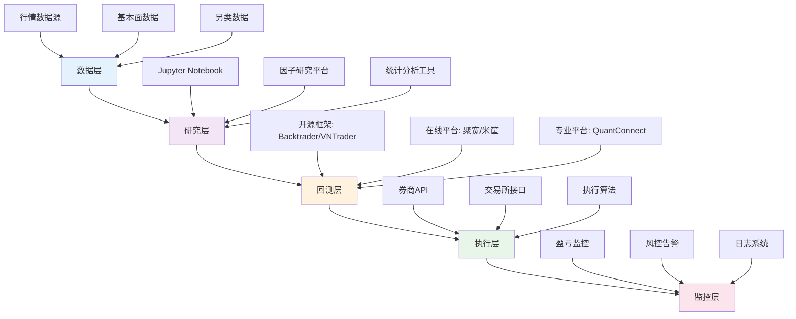
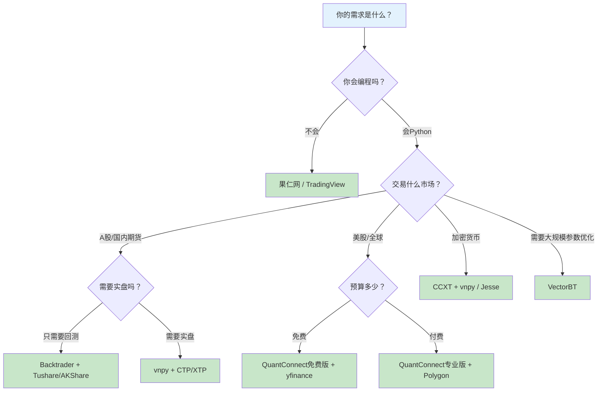

## 七、量化交易平台与工具推荐

工欲善其事，必先利其器。量化交易的工具链直接决定了策略开发的效率、回测的可靠性和实盘的稳定性。本节将从国内到海外、从在线平台到本地框架、从数据源到执行层，系统梳理量化交易的完整工具生态，帮助你根据自身阶段和需求选择最合适的工具组合。

### 7.1 工具链全景图

一个完整的量化交易工具链包含五个层次，每个层次都有多种选择：



**工具选择的核心原则**：

- **不追求最贵，追求最合适**：初学者用聚宽免费版足够，不需要一上来就买Wind
- **从在线到本地逐步迁移**：先在在线平台验证策略逻辑，再迁移到本地做精细化开发
- **数据质量优先于工具花哨**：再好的回测框架，配上错误的数据，结果也是垃圾
- **生态完整性比单点能力更重要**：一个工具链的衔接是否顺畅，决定了开发效率

***

### 7.2 国内量化平台深度对比

国内量化平台经过十余年发展，已经形成了几个梯队。以下从功能、数据、成本、适用场景四个维度进行深度对比。

#### 7.2.1 第一梯队：全功能平台

**聚宽（JoinQuant）**

聚宽是国内用户量最大的量化平台之一，其核心优势在于数据丰富度和社区生态。

| 维度 | 详情 |
|------|------|
| 数据覆盖 | A股（含退市股）、港股、期货、基金、指数，分钟级数据回溯至2005年 |
| 回测引擎 | 支持日频/分钟频/Tick级回测，回测速度中等 |
| 研究环境 | 内置Jupyter Notebook，支持自定义因子研究 |
| 实盘支持 | 对接券商实盘（需付费），支持模拟交易 |
| 费用模式 | 免费版：3个策略、日频回测；付费版：199-999元/月，解锁分钟频、更多策略槽位 |
| 社区生态 | 策略分享活跃，有量化课程和比赛 |
| 适合人群 | 零基础入门到中级量化开发者 |

**优势**：数据质量在国内免费平台中属上乘，社区学习资源丰富，降低了入门门槛。

**劣势**：回测速度不如本地框架，付费版性价比一般；实盘对接的券商有限；策略运行在云端，对数据安全有顾虑的用户不太适合。

**米筐（RiceQuant / 聚宽旗下）**

米筐后被聚宽收购，两者在数据和引擎层面有共享，但定位有差异。

| 维度 | 详情 |
|------|------|
| 数据覆盖 | 与聚宽类似，A股/港股/期货全覆盖 |
| 回测引擎 | 分钟级回测，支持多品种组合 |
| 研究环境 | 支持Jupyter Notebook，研究-回测-模拟一体化 |
| 费用模式 | 偏向机构用户，个人版功能受限 |
| 适合人群 | 有一定基础的个人投资者和小型私募 |

#### 7.2.2 第二梯队：特色平台

**掘金量化（Myquant）**

掘金的定位更偏向专业用户，其核心优势在于本地化部署能力和实盘对接。

| 维度 | 详情 |
|------|------|
| 数据覆盖 | A股、期货、期权，Tick级数据质量较高 |
| 回测引擎 | 事件驱动架构，支持高频策略回测 |
| 实盘支持 | 对接CTP期货接口、券商股票接口，延迟较低 |
| 费用模式 | 数据服务按年收费，实盘交易有佣金分成 |
| 适合人群 | 期货CTA策略开发者、追求低延迟的交易者 |

**优矿（Uqer）**

优矿是通联数据旗下的量化平台，背靠通联的数据资源。

| 维度 | 详情 |
|------|------|
| 数据覆盖 | 通联数据支持，基本面数据尤其丰富（财务报表、分析师预期等） |
| 回测引擎 | 日频/分钟频回测 |
| 特色功能 | 因子分析工具完善，适合多因子策略研究 |
| 费用模式 | 免费版功能有限，付费版面向机构 |
| 适合人群 | 因子投资研究者、机构量化团队 |

**果仁网**

果仁网的定位是"可视化量化"，不需要编程即可构建策略。

| 维度 | 详情 |
|------|------|
| 核心特色 | 拖拽式策略构建，无需编程 |
| 数据覆盖 | A股日线数据，基本面数据 |
| 回测引擎 | 日频回测，支持多因子选股 |
| 费用模式 | 免费版够用，高级功能付费 |
| 适合人群 | 不会编程但想尝试量化选股的投资者 |

**注意**：果仁网的可视化方式虽然降低了门槛，但也限制了策略的复杂度。当你需要实现更复杂的逻辑（如动态仓位管理、多品种联动）时，还是需要转向编程方式。

#### 7.2.3 国内平台综合对比表

| 平台 | 费用 | 数据质量 | 回测速度 | 实盘支持 | 编程门槛 | 最佳适用场景 |
|------|------|----------|----------|----------|----------|-------------|
| 聚宽 | 免费/付费199-999元/月 | ★★★★ | ★★★ | 支持（付费） | 中 | 入门学习、策略验证 |
| 掘金 | 付费 | ★★★★★ | ★★★★ | 支持 | 高 | 期货CTA、高频策略 |
| 优矿 | 免费/付费 | ★★★★★ | ★★★ | 有限 | 中 | 因子研究、多因子选股 |
| 果仁网 | 免费/付费 | ★★★ | ★★ | 不支持 | 无 | 零编程量化选股 |
| 聚宽JQData | 按量付费 | ★★★★ | N/A | N/A | 中 | 纯数据获取（本地开发用） |

***

### 7.3 海外量化平台

如果你交易美股、港股或加密货币，海外平台是更好的选择。

#### 7.3.1 QuantConnect

QuantConnect是全球最大的开源量化交易平台，支持股票、期货、外汇、加密货币等多市场。

**核心特点**：

- **开源引擎LEAN**：用C#和Python编写策略，引擎代码完全开源（GitHub 7000+ Star）
- **数据覆盖**：全球60+市场的Tick/分钟/日线数据，历史数据回溯数十年
- **云端+本地双模式**：可以在云端回测和实盘，也可以下载LEAN在本地运行
- **券商对接**：支持Interactive Brokers、Binance、OANDA等20+券商/交易所
- **Alpha Streams**：策略市场，可以出售策略信号给机构投资者

**费用结构**：

| 层级 | 月费 | 功能 |
|------|------|------|
| 免费 | $0 | 有限回测次数，单线程 |
| 研究员 | $8/月 | 更多回测，Jupyter支持 |
| 专业 | $20/月 | 无限回测，多线程，实盘 |
| 机构 | $800+/月 | 高性能，团队协作 |

**适合人群**：有Python/C#基础、交易海外市场的量化开发者。

**代码示例（QuantConnect Python策略）**：

```python
class MomentumStrategy(QCAlgorithm):
    def Initialize(self):
        self.SetStartDate(2020, 1, 1)
        self.SetCash(100000)
        self.AddEquity("SPY", Resolution.Daily)
        self.AddEquity("QQQ", Resolution.Daily)

    def OnData(self, data):
        # 20日动量：过去20天收益率
        spy_momentum = self.Securities["SPY"].Price / \
                       self.Securities["SPY"].Price - 1  # 简化示例
        if spy_momentum > 0:
            self.SetHoldings("SPY", 0.5)
            self.SetHoldings("QQQ", 0.5)
        else:
            self.Liquidate()
```

#### 7.3.2 Zipline（Quantopian遗产）

Zipline最初由Quantopian开发，是Python量化回测的标杆框架。虽然Quantopian已于2020年关闭，但Zipline作为开源项目依然活跃。

**核心特点**：

- 事件驱动架构，设计优雅
- 与pandas深度集成，数据处理方便
- Pyfolio集成，自动生成专业绩效报告
- 社区维护版本Zipline-reloaded支持Python 3.8+

**适用场景**：学术研究、因子投资回测、日频策略开发。

**局限性**：原版Zipline只支持美股数据，接入A股数据需要自行适配数据接口。

#### 7.3.3 TradingView

TradingView是全球最大的图表分析和社交交易平台，虽然不直接执行交易，但在策略可视化和信号发现方面极为强大。

**核心功能**：

- **Pine Script**：TradingView内置的脚本语言，语法简洁，适合快速原型验证
- **图表分析**：支持数百种技术指标，多时间框架联动
- **报警系统**：基于策略信号的实时提醒
- **社交功能**：可以发布和订阅策略脚本
- **Broker连接**：对接多家券商，支持图表下单

**Pine Script示例**：

```javascript
//@version=5
strategy("双均线策略", overlay=true)
fast = input.int(10, "快线周期")
slow = input.int(60, "慢线周期")
ma_fast = ta.sma(close, fast)
ma_slow = ta.sma(close, slow)
plot(ma_fast, color=color.blue, title="快线")
plot(ma_slow, color=color.red, title="慢线")
if ta.crossover(ma_fast, ma_slow)
    strategy.entry("买入", strategy.long)
if ta.crossunder(ma_fast, ma_slow)
    strategy.close("买入")
```

**适合人群**：技术分析爱好者、需要快速验证交易想法的交易者。Pine Script不适合复杂策略，但在"想法验证"阶段效率极高。

#### 7.3.4 海外平台综合对比

| 平台 | 支持市场 | 语言 | 费用 | 实盘对接 | 最佳场景 |
|------|----------|------|------|----------|----------|
| QuantConnect | 全球60+市场 | Python/C# | 免费-$800/月 | IB/Binance等 | 全品类量化开发 |
| Zipline | 需自适配 | Python | 免费开源 | 需自行开发 | 学术研究、因子回测 |
| TradingView | 全球 | Pine Script | 免费-$60/月 | 部分券商 | 图表分析、信号发现 |
| Backtrader | 自备数据 | Python | 免费开源 | 需自行开发 | 本地回测、策略验证 |
| vnpy | A股/期货/数字货币 | Python | 免费开源 | CTP/XTP等 | 国内实盘交易 |

***

### 7.4 自托管回测与交易框架

对于追求灵活性和数据安全的开发者，自托管框架是最终归宿。以下是主流开源框架的深度对比。

#### 7.4.1 Backtrader

Backtrader是Python量化回测社区中最流行的框架，架构清晰，文档相对完善。

**架构设计**：

```text
Backtrader核心架构
├── Cerebro（大脑：调度引擎）
│   ├── 策略加载与参数管理
│   ├── 数据源管理
│   └── 经纪商模拟
├── Strategy（策略：交易逻辑）
│   ├── __init__: 指标定义
│   ├── next: 信号逻辑
│   └── notify_order: 订单回调
├── Broker（经纪商：模拟交易）
│   ├── 资金管理
│   ├── 佣金计算
│   └── 订单撮合
├── Data Feed（数据源）
│   ├── CSV/ Pandas/ 实时数据
│   └── 多品种多时间框架
└── Analyzers（分析器）
    ├── 夏普比率、最大回撤
    ├── 交易明细
    └── 自定义分析器
```

**核心优势**：

- **多时间框架**：同时使用日线和分钟线数据
- **内置指标库**：130+技术指标，开箱即用
- **扩展性强**：可以自定义数据源、经纪商、分析器
- **社区活跃**：GitHub 14000+ Star，问题解答较快

**局限性**：

- 回测速度在大规模数据上不如向量化框架
- 实盘对接需要额外开发（可以通过ccxt或自定义Store实现）
- 项目更新频率下降，最后一次大版本更新较久

**典型使用模式**：

```python
import backtrader as bt

class MyStrategy(bt.Strategy):
    params = (
        ('fast_period', 10),
        ('slow_period', 60),
        ('risk_per_trade', 0.02),
    )

    def __init__(self):
        self.fast_ma = bt.indicators.EMA(period=self.p.fast_period)
        self.slow_ma = bt.indicators.EMA(period=self.p.slow_period)
        self.atr = bt.indicators.ATR(period=14)
        self.crossover = bt.indicators.CrossOver(self.fast_ma, self.slow_ma)

    def next(self):
        if not self.position:
            if self.crossover > 0:
                # 基于ATR的仓位管理
                risk_amount = self.broker.getvalue() * self.p.risk_per_trade
                size = int(risk_amount / (self.atr[0] * 2))
                self.buy(size=size)
        else:
            if self.crossover < 0:
                self.close()

    def notify_trade(self, trade):
        if trade.isclosed:
            print(f'交易利润: {trade.pnlcomm:.2f}')

cerebro = bt.Cerebro()
cerebro.addstrategy(MyStrategy)
cerebro.broker.setcash(100000)
cerebro.broker.setcommission(commission=0.001)
cerebro.addanalyzer(bt.analyzers.SharpeRatio, _name='sharpe')
cerebro.addanalyzer(bt.analyzers.DrawDown, _name='drawdown')
cerebro.addanalyzer(bt.analyzers.TradeAnalyzer, _name='trades')
```

#### 7.4.2 vnpy

vnpy是国内最成熟的开源量化交易框架，专注于实盘交易能力。

**核心特点**：

- **全市场覆盖**：A股（XTP/恒生）、期货（CTP）、数字货币（币安/OKX）
- **事件驱动引擎**：高性能事件处理，适合中高频策略
- **GUI界面**：基于PyQt的图形化交易界面
- **插件架构**：策略应用、数据服务、风控模块均可插拔
- **社区生态**：有配套的VeighNa Station扩展管理器

**适用场景**：需要实盘交易的个人量化交易者、小型私募团队。

**与Backtrader的对比**：

| 维度 | Backtrader | vnpy |
|------|-----------|------|
| 核心定位 | 回测框架 | 实盘交易框架 |
| 回测能力 | ★★★★★ | ★★★ |
| 实盘能力 | ★★（需开发） | ★★★★★ |
| 数据覆盖 | 自备数据 | 内置数据服务 |
| 学习曲线 | 中等 | 较陡 |
| 社区规模 | 更大（国际） | 国内活跃 |
| 最佳场景 | 策略研究与回测 | 实盘交易系统 |

#### 7.4.3 VectorBT

VectorBT是新一代的向量化回测框架，用pandas/numpy的向量运算替代逐Bar遍历，回测速度比Backtrader快10-100倍。

**核心优势**：

- **极速回测**：向量化运算，适合参数优化和大规模回测
- **参数扫描**：内置参数优化功能，可以一次运行数千种参数组合
- **交互式报告**：基于Plotly的交互式可视化
- **与pandas无缝集成**：直接操作DataFrame

**代码示例**：

```python
import vectorbt as vbt
import pandas as pd

# 获取数据
price = vbt.YFData.download("AAPL", start="2020-01-01").get("Close")

# 参数扫描：快速线1-20，慢速线20-100
fast_ma = vbt.MA.run(price, window=range(1, 21))
slow_ma = vbt.MA.run(price, window=range(20, 101))

# 生成交叉信号
entries = fast_ma.ma_crossed_above(slow_ma)
exits = fast_ma.ma_crossed_below(slow_ma)

# 一次性回测所有参数组合
portfolio = vbt.Portfolio.from_signals(price, entries, exits, init_cash=100000)

# 查看最优参数
print(portfolio.sharpe_ratio().idxmax())  # 最高夏普比率的参数组合
```

**适用场景**：需要大规模参数优化的研究者、机器学习策略的信号筛选。

**局限性**：不支持实盘交易，只做回测和研究；对复杂的订单管理逻辑（如条件单、冰山单）支持有限。

#### 7.4.4 其他值得关注的框架

| 框架 | 语言 | 特点 | 适用场景 |
|------|------|------|----------|
| Jesse | Python | 专注加密货币，内置实盘 | 加密货币交易者 |
| Catalyst | Python | Zipline的加密货币分支 | 加密货币因子研究 |
| Lean (QuantConnect) | C#/Python | 完全开源，支持多市场 | 专业量化团队 |
| Rqalpha | Python | 米筐开源A股回测引擎 | A股策略研究 |
| Hikyuu | Python/C++ | 国产框架，C++内核 | A股高频策略 |

***

### 7.5 数据源与数据工具

数据是量化交易的血液。数据质量直接决定了策略研究的可靠性。

#### 7.5.1 国内数据源

**免费数据源**：

| 数据源 | 数据类型 | 更新频率 | 获取方式 | 特点 |
|--------|----------|----------|----------|------|
| Tushare | A股日线/分钟线/财务/公告 | 日更新 | API（需注册token） | 数据全面，社区活跃，Pro版积分制 |
| AKShare | A股/港股/期货/外汇/宏观 | 实时/日更新 | API（免费） | 覆盖面最广，无需注册 |
| BaoStock | A股历史日线 | 日更新 | API（免费） | 无需注册，数据稳定 |
| JQData | A股全品种 | 日更新 | API（付费/积分） | 聚宽数据接口，质量高 |

**Tushare使用示例**：

```python
import tushare as ts

# 初始化（需要先在tushare.pro注册获取token）
ts.set_token('你的token')
pro = ts.pro_api()

# 获取日线数据
df = pro.daily(ts_code='000001.SZ', start_date='20230101', end_date='20231231')

# 获取财务数据
income = pro.income(ts_code='000001.SZ', period='20231231')

# 获取指数成分股
members = pro.index_weight(index_code='399300.SZ', start_date='20230101')
```

**AKShare使用示例**：

```python
import akshare as ak

# 获取个股日线
df = ak.stock_zh_a_hist(symbol="000001", period="daily",
                         start_date="20230101", end_date="20231231")

# 获取实时行情
realtime = ak.stock_zh_a_spot_em()

# 获取期货主力合约
futures = ak.futures_main_sina(symbol="RB0")

# 获取宏观经济数据
gdp = ak.macro_china_gdp()
```

**付费数据源**：

| 数据源 | 年费 | 数据质量 | 适合人群 |
|--------|------|----------|----------|
| Wind万得 | 2-5万元/年 | 机构标配，最全最准 | 专业机构、高端个人 |
| Choice东方财富 | 3000-8000元/年 | 性价比高 | 个人专业投资者 |
| 聚宽JQData | 按量付费 | 质量高 | 本地开发的量化研究者 |
| 通联数据 | 按量付费 | 基本面数据优秀 | 因子研究者 |

#### 7.5.2 海外数据源

| 数据源 | 市场 | 费用 | 特点 |
|--------|------|------|------|
| Yahoo Finance (yfinance) | 全球股票/ETF/指数 | 免费 | 最易获取，适合研究 |
| Alpha Vantage | 全球股票/外汇/加密 | 免费（限速）/付费 | API友好，文档清晰 |
| Polygon.io | 美股Tick级 | $29-$199/月 | 专业级实时数据 |
| Quandl (Nasdaq Data Link) | 多市场另类数据 | 按数据集付费 | 另类数据丰富 |
| IEX Cloud | 美股 | $9-$99/月 | 实时数据，API简洁 |
| CCXT | 100+加密交易所 | 免费开源 | 加密货币统一接口 |

**yfinance使用示例**：

```python
import yfinance as yf

# 获取单只股票
aapl = yf.download("AAPL", start="2023-01-01", end="2023-12-31")

# 批量获取
tickers = ["AAPL", "GOOGL", "MSFT", "AMZN"]
data = yf.download(tickers, start="2023-01-01", end="2023-12-31")

# 获取财务数据
stock = yf.Ticker("AAPL")
income_stmt = stock.income_stmt
balance_sheet = stock.balance_sheet
```

#### 7.5.3 数据存储方案

当数据量增大时，需要考虑本地存储方案：

| 方案 | 适合数据量 | 读写速度 | 查询灵活性 | 部署难度 |
|------|-----------|----------|-----------|----------|
| CSV文件 | <1GB | 慢 | 差 | 最简单 |
| SQLite | <10GB | 中 | SQL查询 | 简单 |
| HDF5 (pandas) | <50GB | 快 | 有限 | 中等 |
| Parquet | <100GB | 快 | Spark/Pandas | 中等 |
| PostgreSQL | 任意 | 快 | SQL全功能 | 较复杂 |
| InfluxDB | 时序数据 | 极快 | 时序优化 | 较复杂 |
| ClickHouse | 海量数据 | 极快 | 列式分析 | 复杂 |

**推荐方案**：个人量化研究者使用 **SQLite + Parquet** 组合足够。SQLite存储元数据（股票列表、交易日历等），Parquet存储行情数据（列式存储，压缩率高，pandas读写快）。

```python
import pandas as pd

# Parquet存储行情数据（压缩后体积约为CSV的1/5）
df.to_parquet('data/aapl_daily.parquet', compression='snappy')
df = pd.read_parquet('data/aapl_daily.parquet')

# SQLite存储元数据
import sqlite3
conn = sqlite3.connect('quant_data.db')
df.to_sql('daily_prices', conn, if_exists='append', index=False)
```

***

### 7.6 量化专用Python库

以下是量化交易开发中常用的Python库，按功能分类整理。

#### 7.6.1 技术指标计算

| 库名 | 功能 | 特点 | 安装 |
|------|------|------|------|
| TA-Lib | 200+技术指标 | C语言实现，速度极快 | `pip install TA-Lib`（需先装C库） |
| pandas-ta | 130+技术指标 | 纯Python，易安装 | `pip install pandas_ta` |
| Tulipy | 80+技术指标 | TA-Lib的轻量替代 | `pip install tulipy` |
| finta | 60+技术指标 | 纯Python，接口友好 | `pip install finta` |

**TA-Lib安装注意**：TA-Lib底层是C库，直接`pip install TA-Lib`可能失败。Linux系统需要先安装C库：

```bash
# Ubuntu/Debian
sudo apt-get install libta-lib-dev
pip install TA-Lib

# macOS
brew install ta-lib
pip install TA-Lib

# 或者使用conda
conda install -c conda-forge ta-lib
```

**TA-Lib使用示例**：

```python
import talib
import numpy as np

# 假设已有OHLCV数据
close = df['close'].values
high = df['high'].values
low = df['low'].values

# 计算技术指标
df['rsi'] = talib.RSI(close, timeperiod=14)
df['macd'], df['macd_signal'], df['macd_hist'] = talib.MACD(close)
df['atr'] = talib.ATR(high, low, close, timeperiod=14)
df['bb_upper'], df['bb_mid'], df['bb_lower'] = talib.BBANDS(close, timeperiod=20)

# 形态识别
doji = talib.CDLDOJI(df['open'].values, high, low, close)
hammer = talib.CDLHAMMER(df['open'].values, high, low, close)
```

#### 7.6.2 绩效分析

| 库名 | 功能 | 特点 |
|------|------|------|
| Pyfolio | 组合绩效分析报告 | Quantopian出品，生成专业HTML报告 |
| Empyrical | 绩效指标计算 | 轻量级，计算夏普/回撤/阿尔法等 |
| QuantStats | 绩效分析+报告 | 功能全面，支持html报告生成 |

**Pyfolio使用示例**：

```python
import pyfolio as pf

# 假设returns是策略日收益率Series
pf.create_full_tear_sheet(
    returns,
    benchmark_rets=benchmark_returns,  # 基准收益率
    positions=positions_df,            # 持仓数据（可选）
    transactions=transactions_df,      # 交易记录（可选）
)
# 自动生成：收益曲线、回撤图、月度热力图、风险指标表等
```

**QuantStats使用示例**：

```python
import quantstats as qs

# 一键生成HTML报告
qs.reports.html(returns, benchmark='SPY', output='report.html')

# 在Jupyter中直接显示
qs.reports.full(returns, benchmark='SPY')

# 计算单个指标
print(f"夏普比率: {qs.stats.sharpe(returns):.2f}")
print(f"最大回撤: {qs.stats.max_drawdown(returns):.2%}")
print(f"年化收益: {qs.stats.cagr(returns):.2%}")
```

#### 7.6.3 因子分析

| 库名 | 功能 | 特点 |
|------|------|------|
| Alphalens | 因子有效性分析 | Quantopian出品，因子研究标配 |
| alphalens-reloaded | Alphalens的维护版本 | 支持新版pandas |

**Alphalens核心功能**：

- 因子分组收益分析（按因子值分5/10组，看各组收益差异）
- 因子IC值（信息系数）分析
- 因子换手率分析
- 因子与收益的单调性检验

```python
from alphalens.utils import get_clean_factor_and_forward_returns
from alphalens.tears import create_full_tear_sheet

# factor: 因子值Series（MultiIndex: date, asset）
# prices: 价格DataFrame（index=date, columns=asset）
factor_data = get_clean_factor_and_forward_returns(
    factor=factor,
    prices=prices,
    quantiles=5,       # 分5组
    periods=(1, 5, 10) # 1天/5天/10天收益
)

create_full_tear_sheet(factor_data)
```

#### 7.6.4 机器学习与因子挖掘

| 库名 | 功能 | 在量化中的应用 |
|------|------|---------------|
| scikit-learn | 经典机器学习 | 因子筛选、收益预测、分类模型 |
| XGBoost | 梯度提升树 | 非线性因子建模，抗噪能力强 |
| LightGBM | 轻量梯度提升 | 大规模数据训练，速度快 |
| CatBoost | 类别特征优化 | 处理行业/板块等类别特征 |
| statsmodels | 统计建模 | 协整检验、时间序列分析、回归分析 |
| arch | ARCH/GARCH模型 | 波动率建模 |
| hmmlearn | 隐马尔可夫模型 | 市场状态识别（牛市/熊市/震荡） |

**LightGBM因子选股示例**：

```python
import lightgbm as lgb
import pandas as pd
from sklearn.model_selection import TimeSeriesSplit

# 假设features是因子矩阵，target是未来收益率
features = ['pe_ratio', 'pb_ratio', 'roe', 'momentum_20d', 'volatility_60d']

# 时间序列交叉验证（不能随机划分，必须按时间顺序）
tscv = TimeSeriesSplit(n_splits=5)

for train_idx, test_idx in tscv.split(X):
    X_train, X_test = X.iloc[train_idx], X.iloc[test_idx]
    y_train, y_test = y.iloc[train_idx], y.iloc[test_idx]

    model = lgb.LGBMRegressor(
        n_estimators=500,
        max_depth=5,
        learning_rate=0.05,
        subsample=0.8,
        colsample_bytree=0.8,
    )
    model.fit(X_train, y_train,
              eval_set=[(X_test, y_test)],
              callbacks=[lgb.early_stopping(50)])

    # 特征重要性
    importance = pd.Series(model.feature_importances_, index=features)
    print(importance.sort_values(ascending=False))
```

**重要提醒**：机器学习在量化交易中的应用必须警惕过拟合。金融数据的信噪比极低（噪声远大于信号），模型很容易学到的是噪声而非规律。务必使用严格的时间序列交叉验证，不要用随机划分。

***

### 7.7 可视化与分析工具

#### 7.7.1 Python可视化库

| 库名 | 特点 | 适用场景 |
|------|------|----------|
| Matplotlib | 最基础，完全可控 | 静态图表、论文级别图表 |
| Plotly | 交互式，支持缩放悬停 | 策略分析报告、网页展示 |
| mplfinance | 专业K线图 | K线+成交量+技术指标 |
| Bokeh | 交互式，支持大数据 | 实时监控仪表盘 |
| Seaborn | 统计图表美化 | 因子分布、相关性分析 |

**mplfinance专业K线图**：

```python
import mplfinance as mpf

# 假设df是包含OHLCV的DataFrame，index为DatetimeIndex
mpf.plot(df, type='candle', volume=True,
         mav=(5, 10, 20),           # 均线
         style='charles',            # 暗色主题
         title='AAPL K线图',
         ylabel='Price',
         figsize=(16, 9),
         savefig='kline.png')
```

#### 7.7.2 监控仪表盘

对于实盘交易，监控仪表盘是必备工具：

| 工具 | 类型 | 特点 |
|------|------|------|
| Grafana | 开源仪表盘 | 配合InfluxDB/Prometheus使用，适合系统监控 |
| Streamlit | Python Web应用 | 快速搭建策略监控页面 |
| Dash (Plotly) | Python Web框架 | 专业级数据仪表盘 |
| Panel (HoloViz) | Python仪表盘 | 与pandas/bokeh深度集成 |

**Streamlit策略监控示例**：

```python
import streamlit as st
import pandas as pd
import plotly.graph_objects as go

st.title("策略监控面板")

# 策略选择
strategy = st.selectbox("选择策略", ["双均线", "动量", "均值回归"])

# 实时数据展示
col1, col2, col3 = st.columns(3)
col1.metric("今日收益", "+1.2%", "+0.3%")
col2.metric("累计收益", "+15.6%", "+2.1%")
col3.metric("最大回撤", "-8.3%", "+0.5%")

# 收益曲线
fig = go.Figure()
fig.add_trace(go.Scatter(x=dates, y=cumulative_returns, name='策略'))
fig.add_trace(go.Scatter(x=dates, y=benchmark_returns, name='基准'))
st.plotly_chart(fig, use_container_width=True)
```

***

### 7.8 工具选择决策框架

面对如此多的工具，如何选择？以下决策树可以帮助你快速定位：



#### 7.8.1 按阶段推荐的工具组合

**阶段一：入门学习（0-3个月）**

目标：理解量化交易的基本流程，能运行第一个策略。

| 工具 | 用途 |
|------|------|
| 聚宽（免费版） | 在线学习，无需搭建环境 |
| Jupyter Notebook | 代码实验和笔记 |
| AKShare | 免费获取A股数据 |
| Matplotlib | 基础可视化 |

**阶段二：策略开发（3-12个月）**

目标：能独立开发和回测策略，理解回测陷阱。

| 工具 | 用途 |
|------|------|
| Backtrader | 本地回测，理解回测引擎原理 |
| TA-Lib / pandas-ta | 技术指标计算 |
| Tushare Pro | 更全面的A股数据 |
| Pyfolio / QuantStats | 绩效分析报告 |
| Plotly | 交互式策略分析 |

**阶段三：因子研究（6-18个月）**

目标：掌握多因子投资方法论。

| 工具 | 用途 |
|------|------|
| Alphalens | 因子有效性分析 |
| statsmodels | 统计检验 |
| LightGBM / XGBoost | 因子非线性建模 |
| JQData | 高质量基本面数据 |

**阶段四：实盘交易（12个月+）**

目标：策略稳定运行，资金持续增长。

| 工具 | 用途 |
|------|------|
| vnpy | 实盘交易引擎 |
| Streamlit / Grafana | 监控仪表盘 |
| SQLite / InfluxDB | 数据存储 |
| Docker | 环境隔离和部署 |

***

### 7.9 工具使用常见误区

#### 误区一：工具越多越好

很多人一开始就安装了十几个库，结果每个都只会用最基础的功能。**正确的做法**是：先精通一个核心工具链（如Backtrader + Tushare + Pyfolio），等遇到瓶颈时再引入新工具。

#### 误区二：忽视数据质量

用免费数据源做回测，结果和实盘差异巨大，往往不是策略问题而是数据问题。常见数据陷阱：

- **存活者偏差**：只包含当前还在交易的股票，退市股数据丢失
- **除权复权**：未正确处理送转配股，导致收益率计算错误
- **停牌处理**：停牌期间的数据应该如何处理
- **未来数据泄露**：使用了当时不可能获取到的数据（如用当日收盘价生成当日开盘时的信号）

#### 误区三：盲目追求回测速度

VectorBT确实比Backtrader快100倍，但在策略开发初期，回测速度根本不是瓶颈。一天回测10次和回测1000次，对策略质量的影响微乎其微。**先把策略逻辑写对，再优化速度**。

#### 误区四：忽略工具的维护状态

量化交易领域的开源项目更新频率差异很大。选择工具时，要关注：

- GitHub最近一次提交时间
- Issue的响应速度
- 是否支持最新Python版本
- 依赖库是否有安全漏洞

#### 误区五：在错误的层次使用工具

用Pine Script（TradingView）尝试实现复杂的多品种联动策略，或者用Backtrader做高频Tick级交易，都是在错误的层次使用工具。每种工具都有其设计意图和能力边界，选错工具会浪费大量时间。

***

### 7.10 本节要点回顾

| 要点 | 说明 |
|------|------|
| 工具链分层 | 数据层→研究层→回测层→执行层→监控层 |
| 入门推荐 | 聚宽/果仁网（在线） + AKShare（数据） |
| 回测推荐 | Backtrader（通用）/ VectorBT（参数优化） |
| 实盘推荐 | vnpy（国内）/ QuantConnect（海外） |
| 数据源选择 | 免费先用AKShare/Tushare，进阶用JQData/Choice |
| 核心原则 | 数据质量 > 工具花哨，先精通一个再扩展 |

记住：**工具是手段，策略思维才是核心**。最好的工具是你能熟练使用的工具，而不是功能最多的工具。先把一个工具链用到极致，再考虑扩展。量化交易的竞争力来自于策略的独创性和执行的一致性，而不是你用了多少个库。

***
