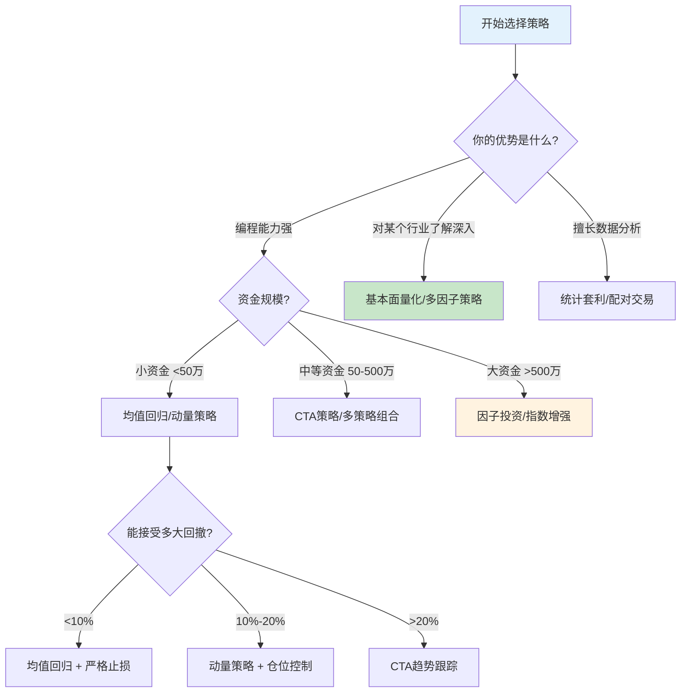
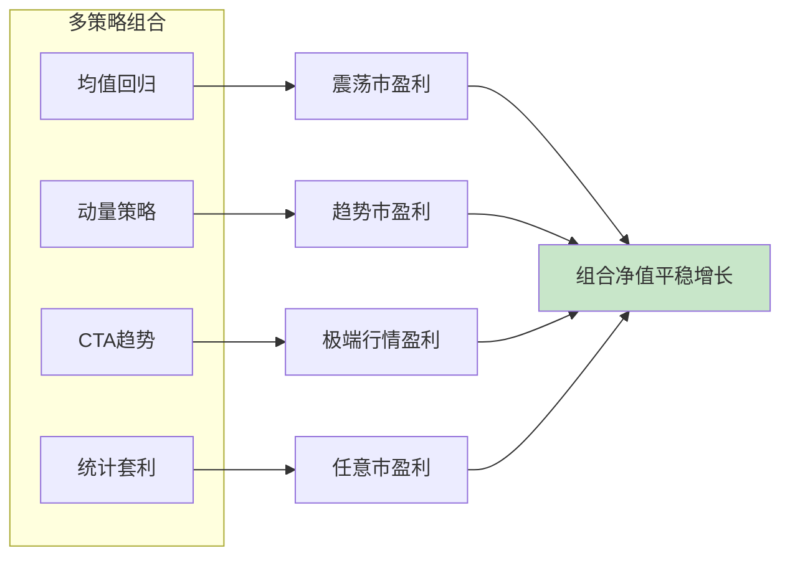
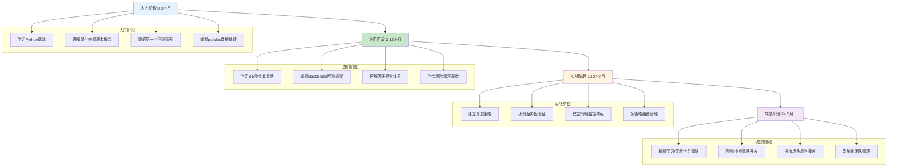

## 本节小结

"核心技巧"一节从策略设计、工具选型、回测验证、风险管理、因子投资、实盘部署到平台推荐，系统性地构建了量化交易从理论到实战的完整方法论框架。本节小结将梳理各部分的核心要点，帮助你建立全局视角，形成可操作的量化投资知识体系。

***

### 一、策略体系全景回顾

本节介绍了四大类经典量化策略，每种策略都有其适用的市场环境和核心假设：

#### 1.1 四大策略对比

| 策略类型 | 核心思想 | 适用市场 | 持仓周期 | 风险特征 | 典型年化收益 |
|----------|----------|----------|----------|----------|-------------|
| 均值回归 | 价格偏离均值后回归 | 震荡市 | 短中期（数日到数周） | 均值不回归时亏损加剧 | 8%-15% |
| 动量策略 | 强者恒强，弱者恒弱 | 趋势市 | 中期（1-12个月） | 趋势反转时回撤较大 | 10%-20% |
| 统计套利 | 相关资产价差收敛 | 任意市场 | 短期（数日） | 协整关系破裂风险 | 6%-12% |
| CTA趋势跟踪 | 期货市场趋势追踪 | 趋势明显的期货市场 | 中长期（数周到数月） | 震荡市频繁止损 | 10%-25% |

#### 1.2 策略选择决策树

选择策略时，需要根据市场环境、资金规模、风险偏好和自身技术能力综合判断：



#### 1.3 策略开发的黄金流程

每个策略从构思到上线，都必须经历以下标准化流程，任何环节的缺失都可能导致实盘亏损：

1. **明确投资目标**：收益预期、风险承受能力、投资期限、资金规模
2. **策略逻辑推演**：为什么这个策略能赚钱？超额收益的来源是什么？
3. **数据获取与清洗**：选择可靠数据源，处理缺失值、异常值、存活者偏差
4. **因子构建与测试**：将策略逻辑转化为可量化的信号
5. **样本内回测**：在历史数据上验证策略可行性
6. **样本外验证**：用未参与优化的数据检验策略稳健性
7. **参数敏感性分析**：确认策略不依赖特定参数组合
8. **压力测试**：模拟极端市场环境下的策略表现
9. **小资金实盘**：用可承受损失的资金进行真实市场验证
10. **正式上线与持续监控**：建立监控体系，定期评估策略健康度

***

### 二、工具链与技术栈总结

#### 2.1 Python量化生态核心组件

量化交易的技术栈可以分为四个层次，从数据获取到策略执行形成完整闭环：

```text
┌─────────────────────────────────────────────────────┐
│                   应用层                              │
│   策略引擎 / 风控模块 / 监控面板 / 报警系统            │
├─────────────────────────────────────────────────────┤
│                   框架层                              │
│   Backtrader(回测) / vnpy(实盘) / Zipline(研究)      │
├─────────────────────────────────────────────────────┤
│                   分析层                              │
│   pandas(数据) / numpy(计算) / statsmodels(统计)      │
│   scikit-learn(ML) / TA-Lib(技术指标) / pyfolio(绩效) │
├─────────────────────────────────────────────────────┤
│                   数据层                              │
│   tushare / akshare / baostock / Wind / Choice       │
└─────────────────────────────────────────────────────┘
```

#### 2.2 平台选型指南

不同阶段的交易者应选择不同平台：

| 你的情况 | 推荐平台 | 理由 |
|----------|----------|------|
| 零基础入门 | 聚宽(JoinQuant) | 免费、数据丰富、社区活跃、无需搭建环境 |
| 有Python基础 | Backtrader + akshare | 灵活度最高、代码完全可控 |
| 想快速实盘 | 迅投QMT | 门槛低、接口简洁、支持A股和期货 |
| 专业/机构 | 米筐 + Wind | 数据质量最高、功能最全 |
| 美股/全球市场 | Zipline + yfinance | 开源、社区支持好 |

#### 2.3 环境搭建速查

本地开发环境的标准搭建流程：

```bash
# 第一步：创建隔离环境
python -m venv quant_env
source quant_env/bin/activate

# 第二步：安装核心依赖
pip install numpy pandas matplotlib seaborn
pip install tushare akshare baostock        # 数据获取
pip install backtrader                       # 回测框架
pip install scikit-learn statsmodels         # 统计与机器学习
pip install ta-lib                           # 技术指标（需先安装C库）
pip install pyfolio empyrical alphalens      # 绩效分析
pip install jupyter notebook                 # 交互式研究

# 第三步：配置数据源token（以tushare为例）
import tushare as ts
ts.set_token('你的token')
pro = ts.pro_api()
```

***

### 三、回测方法论核心要点

回测是量化交易中最重要的验证环节。回测结果不可靠，实盘必然亏损。

#### 3.1 回测质量的五大支柱

| 支柱 | 要求 | 常见错误 |
|------|------|----------|
| 数据质量 | 完整、准确、无存活者偏差 | 使用退市股票数据被删除的数据 |
| 成本假设 | 包含佣金、印花税、滑点、冲击成本 | 回测时不计成本，实盘收益大幅缩水 |
| 样本划分 | 训练集/验证集/测试集严格分离 | 用全量数据优化参数后直接看结果 |
| 信号生成 | 不能使用未来信息（前视偏差） | 用当日收盘价生成当日信号 |
| 统计显著性 | 足够的交易次数、置信区间 | 只有10次交易就宣称策略有效 |

#### 3.2 过度拟合的三重防线

过度拟合是量化交易中最常见也最致命的错误——策略在历史数据上表现完美，在实盘中却持续亏损。

**第一重防线：样本外验证**

```python
# 正确的样本划分方式
train_size = int(len(data) * 0.7)
train_data = data[:train_size]       # 用于策略优化
test_data = data[train_size:]        # 用于验证，优化过程中不能看

# 如果样本外夏普比率低于样本内的50%，高度怀疑过度拟合
if test_sharpe < train_sharpe * 0.5:
    print("警告：策略可能过度拟合")
```

**第二重防线：参数敏感性分析**

稳健的策略应该在参数小幅变化时仍然表现良好。如果均线参数从10变到11，年化收益从15%暴跌到2%，说明策略对参数过于敏感，实盘中很可能失效。

**第三重防线：Walk-Forward优化**

```python
# Walk-Forward：滚动窗口优化
# 每隔一段时间用最新数据重新优化参数
# 更贴近真实的使用场景
for i in range(0, len(data) - window_size, step):
    train = data[i:i+train_window]
    test = data[i+train_window:i+window_size]
    # 在train上优化参数
    # 在test上验证效果
    # 将test结果拼接为完整的样本外曲线
```

#### 3.3 回测报告关键指标速查

一份合格的回测报告至少应包含以下指标：

| 指标 | 含义 | 合格线（参考） |
|------|------|---------------|
| 年化收益率 | 策略的盈利能力 | >无风险利率+5% |
| 夏普比率 | 每承担一单位风险获得的超额收益 | >1.0 |
| 最大回撤 | 从最高点到最低点的最大亏损 | <20% |
| 胜率 | 盈利交易占总交易的比例 | >40%（趋势策略）/>50%（均值回归） |
| 盈亏比 | 平均盈利金额/平均亏损金额 | >1.5 |
| 年化波动率 | 收益率的标准差（年化） | <25% |
| 交易次数 | 总交易笔数 | >100次（统计显著性） |
| 持仓周期 | 平均每笔交易持仓天数 | 策略特征决定 |
| 收益回撤比 | 年化收益/最大回撤 | >1.0 |

***

### 四、风险管理核心框架

风险管理是量化交易的生命线。没有风控的策略，无论回测多么漂亮，都注定在实盘中失败。

#### 4.1 风险管理的三层架构

```text
第一层：单笔交易风控
├── 止损：固定比例止损 / ATR止损 / 技术位止损
├── 止盈：固定比例止盈 / 移动止盈 / 目标位止盈
└── 仓位：单笔风险不超过总资金的1%-2%

第二层：组合层面风控
├── 仓位上限：总仓位不超过80%
├── 行业集中度：单行业不超过30%
├── 个股集中度：单只股票不超过10%
└── 相关性控制：组合内资产相关性<0.6

第三层：账户层面风控
├── 日亏损限额：单日亏损超过3%暂停交易
├── 周亏损限额：单周亏损超过5%降低仓位
├── 月亏损限额：单月亏损超过10%停止交易并复盘
└── 最大回撤线：回撤达到15%触发全面审查
```

#### 4.2 止损方法对比

| 止损方法 | 计算方式 | 优点 | 缺点 | 适用策略 |
|----------|----------|------|------|----------|
| 固定比例止损 | 亏损达到X%即止损 | 简单明确 | 不考虑市场波动 | 短线交易 |
| ATR止损 | 止损位=入场价-N倍ATR | 自适应市场波动 | 需要计算ATR | CTA/趋势策略 |
| 技术位止损 | 跌破支撑位止损 | 有技术逻辑支撑 | 支撑位可能被假突破 | 技术分析策略 |
| 时间止损 | 持仓超过N天未盈利则平仓 | 控制资金占用 | 可能错过后续行情 | 均值回归策略 |
| 移动止损 | 止损位随价格上移 | 保护浮盈 | 可能被震荡洗出 | 趋势跟踪策略 |

#### 4.3 仓位管理的核心公式

**凯利公式（Kelly Criterion）**——理论上最优的仓位计算方法：

```text
f* = (bp - q) / b

其中：
f* = 最优仓位比例
b  = 盈亏比（平均盈利/平均亏损）
p  = 胜率
q  = 1 - p（败率）

示例：胜率60%，盈亏比1.5
f* = (1.5 × 0.6 - 0.4) / 1.5 = 0.333 = 33.3%
```

**实际使用建议**：由于凯利公式假设条件严格，实际使用时建议取半凯利（f*/2），即上例中仓位控制在16.7%左右，以降低破产风险。

#### 4.4 策略组合的风险分散效应

多策略组合能显著降低整体风险，因为不同策略在不同市场环境下表现各异：



**组合配置建议**：

| 组合规模 | 策略数量 | 预期效果 | 注意事项 |
|----------|----------|----------|----------|
| 初级组合 | 2-3个策略 | 降低30%-40%波动 | 确保策略间相关性低 |
| 中级组合 | 4-6个策略 | 降低50%-60%波动 | 需要更多资金支持 |
| 高级组合 | 8-10个策略 | 降低60%-70%波动 | 管理复杂度显著增加 |

***

### 五、因子投资实操要点

因子投资是现代量化投资的主流范式，通过识别和利用影响资产收益的系统性因素来获取超额收益。

#### 5.1 A股常用因子体系

| 因子类别 | 具体因子 | 有效性（A股） | 逻辑解释 |
|----------|----------|---------------|----------|
| 价值因子 | EP(PE倒数)、BP(PB倒数)、股息率 | 强 | 低估值股票长期跑赢高估值 |
| 成长因子 | 营收增速、净利润增速、ROE变化 | 中等 | 高成长公司获得估值溢价 |
| 动量因子 | 过去3-12个月收益率 | 中等偏弱 | A股短期反转效应明显 |
| 质量因子 | ROE、毛利率、资产负债率 | 强 | 优质公司长期表现更好 |
| 波动因子 | 历史波动率、特异性波动率 | 强 | 低波动股票长期跑赢高波动 |
| 流动性因子 | 换手率、成交额 | 中等 | 低流动性溢价 |
| 规模因子 | 总市值、流通市值 | 中等偏弱 | 小盘股效应近年减弱 |

#### 5.2 多因子模型构建流程

```python
# 伪代码：多因子选股流程

# 第一步：计算各因子值
factors = {}
factors['ep'] = 1 / pe_ratio                    # 价值因子
factors['roe'] = net_profit / equity             # 质量因子
factors['turnover'] = volume / float_shares      # 流动性因子
factors['volatility'] = returns.rolling(60).std() # 波动因子

# 第二步：因子标准化（z-score）
for name, factor in factors.items():
    factors[name] = (factor - factor.mean()) / factor.std()

# 第三步：因子合成（等权或IC加权）
composite_score = sum(factors.values()) / len(factors)

# 第四步：选股（取综合得分最高的N只）
selected_stocks = composite_score.nlargest(50)
```

#### 5.3 因子有效性检验

在使用任何因子之前，必须验证其有效性：

| 检验方法 | 具体操作 | 通过标准 |
|----------|----------|----------|
| IC分析 | 计算因子值与下期收益的秩相关系数 | IC均值>0.03，IC_IR>0.5 |
| 分层回测 | 按因子值分5组，比较各组收益 | 多头组显著跑赢空头组 |
| 换手率分析 | 计算因子选股的月度换手率 | 换手率<30%（考虑交易成本） |
| 因子衰减检测 | 检验因子在不同时期的有效性 | 近3年IC均值仍显著 |

***

### 六、实盘部署核心清单

从回测到实盘是量化交易中最危险的跨越，很多策略在这一环节"阵亡"。

#### 6.1 实盘前的检查清单

在将任何策略投入实盘之前，逐项确认以下内容：

```text
策略层面
□ 样本外测试通过（夏普比率不低于样本内的70%）
□ 参数敏感性分析通过（参数±20%变化，收益变化<30%）
□ 极端行情压力测试通过（2015股灾、2018熊市、2020疫情）
□ 交易成本假设保守（佣金+印花税+滑点≥0.3%）
□ 交易次数充足（>100次，确保统计显著性）

系统层面
□ 数据源稳定可靠（有备用数据源）
□ 交易接口测试通过（下单、撤单、查询）
□ 网络连接稳定（有断线重连机制）
□ 系统有日志记录（便于问题排查）
□ 有异常报警机制（微信/短信/邮件通知）

风控层面
□ 单笔止损已设置
□ 仓位上限已设置
□ 日/周/月亏损限额已设置
□ 策略衰减检测已部署
□ 紧急停止机制已测试
```

#### 6.2 实盘运行的黄金法则

1. **小资金起步**：初始资金不超过总可投资资产的10%-20%
2. **逐步加仓**：连续盈利3个月后，再逐步增加资金
3. **保持日志**：记录每笔交易的信号、执行、滑点、盈亏
4. **定期复盘**：每周回顾策略表现，每月做全面绩效分析
5. **敬畏市场**：任何时候都不假设策略"永远有效"

#### 6.3 策略衰减预警信号

策略衰减是量化交易中最隐蔽的风险，以下是需要高度警惕的信号：

| 预警信号 | 判断标准 | 应对措施 |
|----------|----------|----------|
| 夏普比率持续下降 | 近60日夏普<历史均值的50% | 降低仓位，排查原因 |
| 最大回撤突破历史 | 回撤超过历史最大回撤的1.5倍 | 暂停策略，全面审查 |
| 胜率显著下降 | 近30笔交易胜率<历史胜率的70% | 降低单笔仓位 |
| 信号频率异常 | 信号数量突然增加或减少50% | 检查数据源和策略逻辑 |
| 与基准相关性上升 | 策略收益与指数相关性>0.7 | 重新评估Alpha来源 |

***

### 七、常见陷阱与避坑指南

#### 7.1 新手最容易犯的10个错误

| 错误 | 表现 | 后果 | 纠正方法 |
|------|------|------|----------|
| 1. 过度拟合 | 回测年化50%+，实盘亏损 | 亏钱+信心崩溃 | 严格样本外验证+参数敏感性分析 |
| 2. 忽视交易成本 | 回测不含滑点和佣金 | 实盘收益大幅缩水 | 至少假设0.3%单边成本 |
| 3. 前视偏差 | 用当日数据生成当日信号 | 回测结果虚假 | 确保信号只使用历史数据 |
| 4. 存活者偏差 | 只用现存股票回测 | 高估策略收益 | 使用包含退市股票的全量数据 |
| 5. 数据窥探 | 反复优化同一数据集 | 统计显著性丧失 | 保留独立测试集，只用一次 |
| 6. 忽视流动性 | 选入小市值低流动性股票 | 实盘无法成交 | 过滤日均成交额<500万的标的 |
| 7. 全仓单策略 | 只跑一个策略 | 一次失效即重伤 | 多策略组合分散风险 |
| 8. 不设止损 | 亏损后死扛 | 小亏变大亏 | 每笔交易必须有止损计划 |
| 9. 频繁换策略 | 亏损就换策略 | 永远在优化从未盈利 | 坚持一个策略至少6个月 |
| 10. 忽视市场环境 | 所有行情用同一套参数 | 牛熊切换时大亏 | 加入市场环境识别模块 |

#### 7.2 从回测到实盘的"收益衰减"问题

几乎所有量化策略在从回测到实盘的过程中都会出现收益衰减，这是正常现象。了解衰减原因并做好预期管理至关重要：

```text
回测收益 ──────────────────────────────────────── 100%
扣除交易成本 ─────────────────────────────────── 70%-85%
消除前视偏差 ─────────────────────────────────── 60%-75%
考虑流动性约束 ───────────────────────────────── 50%-65%
扣除滑点 ─────────────────────────────────────── 45%-60%
市场环境变化 ─────────────────────────────────── 35%-50%
实际可获得收益 ───────────────────────────────── 35%-50%
```

**经验法则**：如果回测年化收益为30%，实际能拿到15%就已经是非常优秀的策略了。如果回测收益低于15%，实盘大概率跑不赢指数基金，不值得投入精力。

***

### 八、能力成长路径

#### 8.1 量化交易学习路线图



#### 8.2 每个阶段的关键里程碑

| 阶段 | 时间 | 关键里程碑 | 检验标准 |
|------|------|-----------|----------|
| 入门 | 0-3个月 | 跑通第一个双均线回测 | 能独立生成回测报告并解读 |
| 进阶 | 3-12个月 | 掌握3种以上策略+因子体系 | 能独立完成多因子选股回测 |
| 实战 | 12-24个月 | 小资金实盘稳定盈利3个月+ | 实盘夏普比率>0.5，最大回撤<15% |
| 成熟 | 24个月+ | 多策略组合管理，持续盈利 | 年化收益>15%，收益回撤比>1.0 |

***

### 九、核心要点速记卡

以下是从"核心技巧"全节提炼的10条核心认知，建议打印贴在显示器旁：

1. **策略必须有逻辑基础**：不是"均线金叉涨了"就行，要回答"为什么这个信号能带来超额收益"
2. **回测不等于实盘**：回测收益打5折才是实盘预期
3. **过度拟合是第一杀手**：样本外验证、参数敏感性、Walk-Forward是三重防线
4. **交易成本是隐形杀手**：忽略0.3%的单边成本，年化可能少10%-20%
5. **风险管理优先于收益追求**：先想好亏多少，再想赚多少
6. **单一策略必死**：市场会变，策略会衰减，多策略组合是生存之道
7. **小资金起步**：用能承受全部亏损的钱去验证策略
8. **纪律是最后的护城河**：策略再好，不严格执行等于零
9. **持续学习不可停**：市场在变，工具在变，方法论在变
10. **量化不是圣杯**：它是工具，不是印钞机，保持敬畏

***

> **核心技巧总结**：量化交易的核心技巧可以概括为"选好策略、用对工具、验准回测、控严风险"。这四句话看似简单，每一句背后都是大量的理论知识和实践经验。建议读者按照本节内容，从策略设计开始，逐步掌握工具使用、回测方法、风控框架，最终形成自己的量化交易体系。记住，最好的策略不是收益最高的，而是你能理解、能执行、能坚持的策略。
