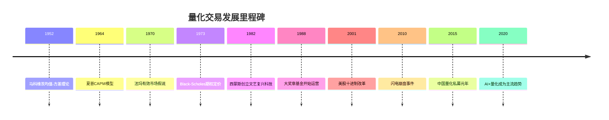
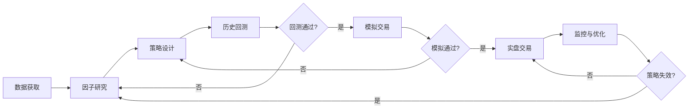

## 一、什么是量化交易？

### 1.1 从一个故事说起

2012年8月1日，骑士资本（Knight Capital）部署了一套新的交易软件。由于代码中的一个bug，系统在45分钟内疯狂下单，买入和卖出了大量股票。等人类交易员反应过来时，公司已经亏损了4.4亿美元——接近其全部净资产。骑士资本的股价当天暴跌75%，两周后被收购，一家成立了20年的公司就此消亡。

这个故事的另一面同样值得关注：在骑士资本崩溃的过程中，市场上成千上万的量化交易系统冷静地识别出了异常价格波动，迅速执行了套利交易，从骑士资本的失误中获利。没有恐慌，没有犹豫，没有情绪——只有代码和数据。

这就是量化交易的双面性：它既是人类构建的最精密的投资工具，也是一个一旦出错就可能造成灾难性后果的系统。

### 1.2 量化交易的严格定义

**量化交易（Quantitative Trading）** 是指利用数学模型、统计分析和计算机程序，对金融市场数据进行系统化分析，自动识别投资机会并执行交易决策的方法论。

这个定义包含四个核心要素：

| 要素 | 含义 | 为什么缺一不可 |
|------|------|----------------|
| **数学模型** | 将市场规律抽象为可计算的公式 | 没有模型就没有判断依据，只能靠直觉 |
| **统计分析** | 用历史数据验证模型的有效性 | 没有验证的模型可能是随机噪声 |
| **计算机程序** | 将模型转化为可执行的代码 | 人工无法处理海量数据和毫秒级决策 |
| **系统化方法** | 有明确的规则和流程 | 没有系统就无法复制和改进 |

四个要素环环相扣。缺少任何一个，你做的就不是量化交易，而是：

- 只有数学模型没有程序 → 手工量化（效率低，容易犯错）
- 只有程序没有数学模型 → 盲目自动化（把亏损也自动化了）
- 只有统计分析没有系统化 → 数据挖掘偏差（在数据中找到了不存在的规律）
- 只有系统化没有统计验证 → 拍脑袋定规则（和主观交易没有本质区别）

### 1.3 量化交易的历史演进

理解量化交易的历史，有助于理解它为什么是今天这个样子。

#### 1.3.1 萌芽期（1950s-1970s）：理论奠基

量化交易的思想根源可以追溯到现代金融理论的诞生：

- **1952年**，哈里·马科维茨（Harry Markowitz）发表《投资组合选择》论文，提出均值-方差优化理论，首次用数学语言描述了"分散投资"的直觉。这为量化投资奠定了数学基础。
- **1964年**，威廉·夏普（William Sharpe）提出资本资产定价模型（CAPM），引入了Beta的概念，将投资收益分解为市场收益和超额收益。
- **1970年**，尤金·法玛（Eugene Fama）提出有效市场假说（EMH），引发了关于"市场是否可以被战胜"的持续争论——而量化交易者的工作，本质上就是在回答这个问题。
- **1973年**，费舍尔·布莱克（Fischer Black）和迈伦·斯科尔斯（Myron Scholes）发表了期权定价公式（Black-Scholes公式），催生了金融衍生品市场，也为后来的期权量化交易提供了理论武器。

这个阶段的特点是：理论先行，实践滞后。计算机还不普及，数据获取困难，大多数理论停留在学术论文中。

#### 1.3.2 实践期（1980s-1990s）：机构入场

- **1982年**，詹姆斯·西蒙斯（James Simons）创立了文艺复兴科技公司（Renaissance Technologies），后来打造了传奇的大奖章基金（Medallion Fund），在1988-2018年间实现了年化66%的收益率（扣费前），是人类投资史上最成功的基金之一。
- **1980年代末**，摩根士丹利的量化团队开发了统计套利策略，利用股票之间的价格关系进行配对交易。
- **1990年代**，随着互联网的普及，数据获取成本大幅降低，量化交易开始从少数精英机构向更广泛的投资者群体扩散。

这个阶段的特点是：技术推动实践。计算机性能的提升和数据的电子化，使得大规模回测和自动化交易成为可能。

#### 1.3.3 爆发期（2000s-2010s）：全民量化

- **2001年**，美国股市全面转向十进制报价（之前是分数制），最小价格变动单位从1/16美元变为0.01美元，为高频交易创造了巨大的套利空间。
- **2005年**，美国证监会（SEC）颁布全国市场系统规则（Reg NMS），促进了交易所之间的竞争，进一步推动了高频交易的发展。
- **2010年**，"闪电崩盘"（Flash Crash）事件中，道琼斯指数在几分钟内暴跌近1000点，暴露了算法交易的系统性风险。
- **2010年代**，Python成为量化交易的主流编程语言，开源量化框架（如Zipline、Backtrader、vnpy）的出现大幅降低了量化交易的技术门槛。

#### 1.3.4 智能化时期（2020s至今）：AI赋能

- 机器学习和深度学习技术开始广泛应用于因子挖掘、信号生成和风险管理。
- 另类数据（卫星图像、社交媒体情绪、信用卡消费数据等）成为新的Alpha来源。
- 中国量化私募行业快速崛起，幻方量化、九坤投资、明汯投资等机构管理规模突破千亿。

### 1.4 量化交易的本质：将投资转化为工程问题

传统投资和量化交易的根本区别，不在于是否使用计算机，而在于**思维方式的差异**。

传统投资的思维方式是"艺术家模式"：

1. 研究一家公司的基本面（财报、行业、管理层）
2. 形成主观判断（"这家公司被低估了"）
3. 做出交易决策（买入）
4. 根据市场变化调整判断（可能卖出，也可能死扛）

量化交易的思维方式是"工程师模式"：

1. 观察市场数据中的统计规律（"股价突破20日均线后继续上涨的概率是X%"）
2. 将规律转化为可验证的假设
3. 用历史数据检验假设是否成立
4. 如果成立，将假设编码为交易规则
5. 用程序自动执行规则
6. 监控策略表现，持续优化

这两种模式的核心差异可以用一个表格概括：

| 维度 | 传统投资（艺术家模式） | 量化交易（工程师模式） |
|------|----------------------|----------------------|
| **决策基础** | "我觉得这家公司不错" | "历史数据显示这类股票平均跑赢大盘3%" |
| **验证方式** | 靠市场结果检验（风险大） | 先回测再实盘（风险可控） |
| **情绪影响** | 恐惧和贪婪会扭曲判断 | 程序不受情绪影响 |
| **可复制性** | 依赖个人能力，难以复制 | 规则明确，可以复制和扩展 |
| **失效判断** | "可能是我的判断错了" | "策略的统计假设不再成立" |
| **改进方式** | 积累经验，靠悟性 | 修改参数，重新回测，数据驱动 |

### 1.5 量化交易的工作流程

一个完整的量化交易系统包含以下环节，每个环节都不可或缺：

**环节一：数据获取**

量化交易的燃料是数据。没有数据，再精巧的模型也是空中楼阁。常用的数据类型包括：

| 数据类型 | 具体内容 | 获取方式 | 成本 |
|----------|----------|----------|------|
| 行情数据 | 开盘价、收盘价、最高价、最低价、成交量 | Tushare、AKShare、Wind | 免费-昂贵 |
| 基本面数据 | 财报、估值指标、行业分类 | 巨潮资讯、东方财富 | 免费-中等 |
| 宏观数据 | GDP、CPI、PMI、利率 | 国家统计局、美联储 | 免费 |
| 另类数据 | 社交媒体情绪、卫星图像、消费数据 | 专业数据商 | 昂贵 |
| 高频数据 | 逐笔成交、订单簿快照 | 交易所Level 2数据 | 非常昂贵 |

**环节二：因子研究**

因子（Factor）是量化交易的核心概念。一个因子就是一个能够预测资产收益的变量。例如：

- **价值因子**：低市盈率的股票是否跑赢高市盈率的股票？
- **动量因子**：过去3个月涨得多的股票，未来1个月是否继续涨？
- **波动率因子**：低波动率的股票是否跑赢高波动率的股票？

因子研究的目标是找到那些具有**持续预测能力**的因子，而不是在历史数据中挖出的统计噪声。这个区分至关重要，后面"因子投资入门"一节会详细展开。

**环节三：策略设计**

策略是将因子信号转化为具体买卖规则的过程。一个好的策略需要回答以下问题：

- **买什么**：选股范围是什么？沪深300？全A股？某个行业？
- **什么时候买**：什么信号触发买入？
- **买多少**：仓位如何分配？等权重？按因子强度加权？
- **什么时候卖**：什么信号触发卖出？止损线在哪里？
- **交易成本如何处理**：手续费、印花税、滑点、冲击成本

**环节四：历史回测**

回测是将策略应用到历史数据上，模拟策略在过去的表现。这是量化交易区别于传统投资的核心优势——你可以在投入真金白银之前，先用历史数据检验策略是否有效。

回测的关键原则：

1. **使用样本外数据**：用一部分数据训练（样本内），用另一部分数据验证（样本外）
2. **考虑交易成本**：不考虑交易成本的回测结果毫无意义
3. **避免前视偏差**：确保你在做决策时只使用了当时已经知道的信息
4. **测试多种市场环境**：牛市、熊市、震荡市都要测试

**环节五：模拟交易**

模拟交易（也叫纸交易或Paper Trading）是在真实市场环境中，用虚拟资金执行策略。它的价值在于：

- 验证策略在实时数据上的表现（而不是历史数据）
- 测试交易系统的稳定性和延迟
- 发现回测中没有考虑到的实际问题（如流动性不足、涨跌停限制等）

**环节六：实盘交易**

实盘交易是最终的检验。即便回测和模拟都表现良好，实盘仍然可能面临新的挑战：

- 市场冲击：你的下单本身会影响价格
- 滑点：实际成交价和预期价格之间的差异
- 系统故障：网络中断、服务器宕机、API超时
- 策略拥挤：当太多人使用相同策略时，Alpha会被摊薄

**环节七：监控与优化**

策略上线后，需要持续监控其表现。关键监控指标包括：

- 策略收益是否偏离预期
- 最大回撤是否在可接受范围内
- 胜率和盈亏比是否稳定
- 交易频率是否正常（异常高频可能意味着系统bug）

### 1.6 量化交易的参与者

量化交易的生态系统中，不同参与者扮演着不同的角色：

#### 1.6.1 机构量化

| 类型 | 代表机构 | 特点 | 管理规模 |
|------|----------|------|----------|
| 对冲基金 | 文艺复兴科技、Two Sigma、D.E. Shaw | 顶尖人才、海量数据、高频策略 | 数百亿美元 |
| 量化私募 | 幻方量化、九坤投资、明汯投资 | 中国市场主力、中低频策略为主 | 数百亿人民币 |
| 券商自营 | 中金公司、中信证券自营部 | 有牌照优势、资金成本低 | 数十亿人民币 |
| 公募量化 | 华泰柏瑞、景顺长城 | 产品透明、策略偏保守 | 数十亿人民币 |

#### 1.6.2 个人量化

个人量化交易者通常有以下特征：

- **资金规模**：几万到几百万人民币
- **策略类型**：以中低频策略为主（日频、周频），高频策略对硬件和数据要求过高
- **技术栈**：Python为主，辅以Excel、MATLAB
- **交易品种**：A股、ETF、可转债、期货（需开通相应账户）
- **主要挑战**：数据获取成本、交易成本占比高、资金规模限制策略多样性

### 1.7 量化交易能做什么，不能做什么

对量化交易建立合理的期望值，是学习的第一步。很多人带着不切实际的幻想进入量化领域，最终失望而归。

**量化交易能做到的：**

1. **系统化执行投资纪律**。程序不会在暴跌时恐慌卖出，也不会在暴涨时贪婪追高。它严格按规则执行，这是人类很难做到的。
2. **处理海量数据**。一个量化系统可以同时监控数千只股票、数十个因子，这是人类分析师无法企及的。
3. **回溯验证策略**。在投入真金白银之前，先用历史数据检验策略的有效性，大幅降低了试错成本。
4. **消除情绪干扰**。恐惧、贪婪、过度自信、锚定效应——这些行为金融学中的认知偏差，在量化交易中被程序化规则取代。
5. **实现多策略并行**。一个人可以同时运行多个不相关的策略，分散风险，而人类交易员通常只能专注于少数标的。

**量化交易做不到的：**

1. **预测黑天鹅事件**。新冠疫情、俄乌冲突、政策突变——这些无法用历史数据建模的事件，量化交易同样无法预测。事实上，在极端行情中，量化策略可能因为同质化而加剧市场波动。
2. **保证盈利**。没有任何策略能永远盈利。市场在变，参与者在变，过去有效的规律未来可能失效。量化交易者的工作不是找到一个"圣杯"策略，而是持续发现、验证、部署新策略。
3. **消除风险**。量化交易可以管理风险，但不能消除风险。降低风险的代价通常是降低收益。夏普比率的提升有其上限。
4. **替代理解**。如果你不理解一个策略为什么赚钱，你就不知道它什么时候会亏钱。量化交易需要你理解策略背后的逻辑，而不仅仅是运行一个黑箱模型。
5. **超越市场本身**。在完全有效的市场中，量化交易无法创造超额收益。Alpha的来源本质上是市场无效性——信息不对称、行为偏差、制度约束等。当这些无效性被越来越多的量化交易者利用时，Alpha会逐渐消失。

### 1.8 量化交易与相关概念的区分

初学者经常混淆以下几个概念，有必要在这里厘清：

| 概念 | 定义 | 与量化交易的关系 |
|------|------|------------------|
| **算法交易** | 用算法执行交易指令，优化执行价格和速度 | 是量化交易的执行层，不涉及策略决策 |
| **高频交易** | 在极短时间内（毫秒到秒级）进行大量交易 | 是量化交易的一个子类，对硬件和数据要求极高 |
| **程序化交易** | 将交易规则编码为程序自动执行 | 与量化交易高度重叠，但程序化交易的规则不一定基于数学模型 |
| **自动化交易** | 交易指令的自动发送和执行 | 是技术实现层面的概念，不涉及策略本身 |
| **人工智能交易** | 用机器学习/深度学习方法进行交易决策 | 是量化交易的一个分支，使用AI技术作为建模工具 |

用一句话概括：**量化交易是方法论，算法交易是执行工具，高频交易是速度竞争，程序化交易是实现方式。**

### 1.9 一个简单的量化交易思维实验

为了帮助你建立直觉，我们来做一个思维实验。

假设你观察到一个现象：每当一只股票的5日均线向上突破20日均线时，该股票在未来20个交易日内平均上涨5%。你把这个现象叫做"金叉效应"。

作为传统投资者，你可能会：
- 在看到某只股票出现金叉时，凭感觉决定是否买入
- 买入后每天盯盘，心情随股价波动
- 如果股价下跌5%，你可能恐慌卖出，也可能死扛不卖
- 你不确定这个"金叉效应"是真的还是巧合

作为量化交易者，你会：

1. **收集数据**：获取A股所有股票过去10年的日线数据
2. **定义规则**：5日均线上穿20日均线时买入，持有20个交易日后卖出
3. **回测验证**：统计所有满足条件的交易，计算平均收益、胜率、最大回撤
4. **控制变量**：对比不同市场环境（牛市/熊市/震荡市）下的表现
5. **考虑成本**：扣除手续费、印花税、滑点后的净收益
6. **统计检验**：检验收益是否显著异于零（t检验、p值）
7. **如果有效**：将规则编码为程序，自动执行
8. **如果无效**：放弃这个假设，寻找下一个

这个过程的核心是：**用数据说话，用统计检验，用程序执行。** 不是"我觉得金叉有用"，而是"数据显示金叉在过去10年的A股市场中，在扣除交易成本后，平均产生了X%的超额收益，t统计量为Y，p值为Z"。

### 1.10 量化交易在中国市场的特殊性

中国A股市场有一些独特的特征，使得量化交易的实践与欧美市场有所不同：

**市场结构方面：**

- **散户占比高**：A股散户交易量占比约60-70%，这意味着市场存在更多的行为偏差和定价无效性，为量化策略提供了Alpha来源。
- **T+1制度**：A股实行T+1交易制度（当天买入的股票次日才能卖出），限制了日内交易策略的设计。
- **涨跌停限制**：主板涨跌幅限制为10%（创业板/科创板为20%），ST股为5%。这既是一种风险保护，也增加了策略回测的复杂性。
- **做空机制有限**：融券成本高、券源少，限制了多空策略的实施。

**数据方面：**

- **数据质量参差不齐**：财务数据的修正（如财报更正）、停牌复牌处理、新股上市效应等，都需要在数据预处理中仔细处理。
- **历史数据相对较短**：A股从1990年开市至今只有30多年历史，相比美股上百年的数据，样本量有限。
- **免费数据源丰富**：Tushare、AKShare等开源数据工具提供了丰富的免费数据，降低了入门门槛。

**监管方面：**

- **程序化交易报备**：达到一定交易频率的程序化交易需要向交易所报备。
- **异常交易监控**：交易所对频繁撤单、对倒交易等行为有严格的监控机制。
- **私募基金备案**：以量化策略发行产品需要在中国证券投资基金业协会备案。

### 1.11 常见误区

在开始学习量化交易之前，有必要纠正几个常见的认知偏差：

**误区一："量化交易=高频交易"**

很多人一提到量化交易，就想到华尔街那些在毫秒级别抢跑的高频交易公司。实际上，高频交易只是量化交易的一个子类，而且对硬件（服务器托管在交易所机房、使用FPGA芯片）、数据（Level 2逐笔数据）和资金（数百万美元的基础设施投入）的要求极高，不适合个人投资者。

绝大多数个人量化交易者使用的是中低频策略（日频、周频甚至月频），这在技术上完全可行，不需要特殊硬件。

**误区二："量化交易能稳赚不赔"**

没有任何策略能保证稳赚不赔。量化交易的优势在于用系统化方法管理风险和提高概率优势，但市场本身充满不确定性。即使是文艺复兴科技的大奖章基金，也有亏损的月份。量化交易追求的是"大数定律"——在足够多的交易次数下，正期望值的策略会趋向于盈利，但短期内完全可能亏损。

**误区三："学量化交易需要高深的数学"**

入门级的量化交易只需要高中水平的数学知识：均值、标准差、百分比、简单的概率统计。进阶的量化交易确实需要线性代数、概率论、时间序列分析等知识，但这些都是在实践中逐步学习的，不需要先成为数学家再开始做量化。

**误区四："回测表现好，实盘就一定好"**

这是量化交易中最危险的幻觉。回测和实盘之间存在巨大的鸿沟：

- **过拟合**：策略过度适应历史数据中的噪声，而非真正的规律
- **前视偏差**：在回测中使用了未来才能知道的信息
- **交易成本低估**：回测中的滑点和冲击成本往往被低估
- **生存者偏差**：只回测了现在还在交易的股票，忽略了已经退市的股票
- **市场容量**：回测不考虑策略对市场的冲击，实盘中你的交易本身会影响价格

一个经验法则：**实盘表现通常是回测表现的50-70%。** 如果一个策略的回测年化收益是30%，实盘能做到15-20%就已经很好了。

**误区五："量化交易就是找一个完美的策略"**

很多初学者花大量时间寻找一个"万能策略"，希望它在所有市场环境下都能盈利。这是不现实的。市场是动态变化的，今天有效的策略明天可能失效。成功的量化交易者不是找到了一个完美策略，而是建立了一套**持续发现、验证、部署新策略的流程**。策略会失效，但流程不会。

### 1.12 本节要点

- 量化交易是利用数学模型、统计分析和计算机程序进行系统化投资决策的方法论，核心是将投资从"艺术"转化为"工程"。
- 量化交易的工作流程包括数据获取、因子研究、策略设计、历史回测、模拟交易、实盘交易和监控优化七个环节，每个环节都不可或缺。
- 中国市场具有散户占比高、T+1制度、做空机制有限等独特特征，量化策略的设计需要考虑这些约束。
- 量化交易能系统化执行纪律、处理海量数据、回溯验证策略，但不能预测黑天鹅、保证盈利或消除风险。
- 初学者最容易犯的错误是将量化交易等同于高频交易、追求稳赚不赔、过度依赖回测结果、寻找万能策略。
- 学习量化交易的正确心态是：把它当作一种**方法论**而非**摇钱树**，重视**理解原理**而非**复制代码**，追求**持续改进**而非**一劳永逸**。
