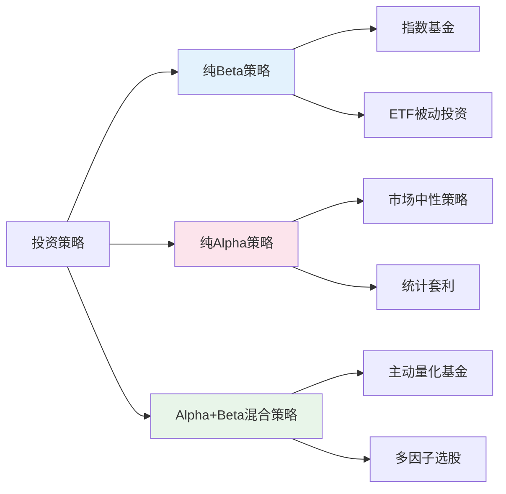
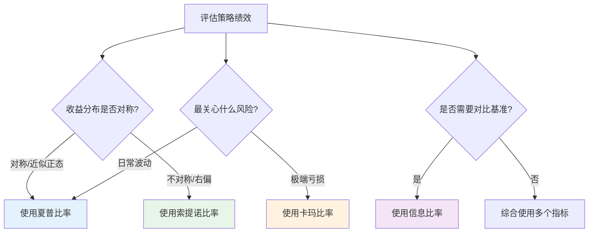
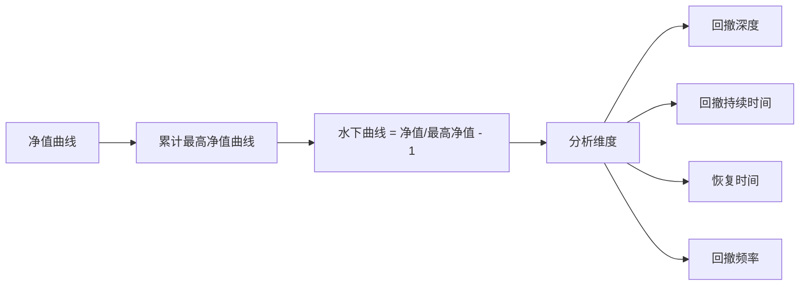
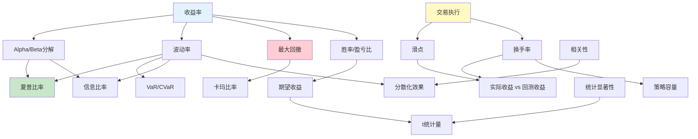

## 二、核心概念解析

量化交易建立在一套精确的数学语言之上。每一个核心概念都不是孤立的数字，而是理解市场、评估策略、控制风险的透镜。本节系统梳理量化交易中最关键的概念体系——从收益分解到风险度量，从交易执行到统计检验——帮助你建立扎实的理论基础。

### 2.1 收益分解：Alpha与Beta

理解Alpha和Beta是进入量化投资的第一步，也是理解"为什么有些策略跑赢市场而有些跑输"的核心框架。

#### 2.1.1 CAPM模型与收益分解

1964年，William Sharpe提出了资本资产定价模型（CAPM），将投资收益分解为两个来源：

$$R_p = R_f + \beta \times (R_m - R_f) + \alpha$$

其中：
- $R_p$：投资组合收益率
- $R_f$：无风险收益率（中国常用10年期国债收益率，约2.5%-3%）
- $R_m$：市场组合收益率
- $\beta$：系统性风险暴露
- $\alpha$：超额收益（主动管理创造的价值）

这个公式的深远意义在于：它把"赚钱"这件事拆成了两部分——**靠市场赚钱（Beta）** 和 **靠能力赚钱（Alpha）**。

#### 2.1.2 Beta（β）详解

Beta衡量的是投资组合对市场波动的敏感度，本质上是系统性风险的度量。

| Beta值 | 含义 | 典型资产 | 适用场景 |
|--------|------|----------|----------|
| β = 0 | 与市场无关 | 国债、现金 | 避险配置 |
| 0 < β < 1 | 波动小于市场 | 公用事业股、消费必需品 | 稳健型组合 |
| β = 1 | 与市场同步 | 沪深300ETF | 指数复制 |
| β > 1 | 波动大于市场 | 科技股、券商股 | 进攻型配置 |
| β < 0 | 与市场反向 | 黄金、看跌期权 | 对冲工具 |

**Beta的计算方法**：

$$\beta = \frac{Cov(R_p, R_m)}{Var(R_m)} = \frac{\rho_{p,m} \times \sigma_p}{\sigma_m}$$

其中 $\rho_{p,m}$ 是组合与市场的相关系数，$\sigma_p$ 和 $\sigma_m$ 分别是组合和市场的波动率。

**实操要点**：

在A股市场，Beta的计算通常使用沪深300指数作为市场基准。计算周期的选择会影响结果——用日收益率计算的Beta与用周收益率计算的Beta可能不同。一般建议使用至少250个交易日的数据，并定期更新（Beta不是稳定的，会随市场环境变化）。

```python
import numpy as np
import pandas as pd

def calculate_beta(portfolio_returns, market_returns, window=250):
    """
    计算滚动Beta值
    
    参数:
        portfolio_returns: 组合日收益率序列
        market_returns: 市场日收益率序列
        window: 滚动窗口（交易日数）
    返回:
        beta_series: 滚动Beta序列
    """
    cov = portfolio_returns.rolling(window).cov(market_returns)
    var = market_returns.rolling(window).var()
    beta_series = cov / var
    return beta_series

# 示例：计算某策略相对沪深300的Beta
# beta = calculate_beta(strategy_returns, hs300_returns, window=250)
```

#### 2.1.3 Alpha（α）详解

Alpha代表投资组合相对于市场基准的超额收益，即主动管理带来的"纯能力"回报。

**Jensen's Alpha**（最常用的Alpha度量）：

$$\alpha_J = R_p - [R_f + \beta \times (R_m - R_f)]$$

如果 $\alpha_J > 0$，说明基金经理（或策略）创造了超越市场风险调整后预期的收益。

**A股市场的Alpha特征**：

A股市场的Alpha机会比成熟市场更丰富，主要原因包括：
- **散户占比高**：A股散户交易量占比约60%-70%，行为偏差（追涨杀跌、过度交易）为量化策略提供了持续的Alpha来源
- **信息不对称**：分析师覆盖不均匀，中小盘股信息效率较低
- **政策驱动**：政策变动带来事件驱动型Alpha机会
- **市场结构**：涨跌停板、T+1交易制度等独特规则创造了特殊的交易机会

但Alpha也在持续衰减——随着量化资金规模增长，同一个Alpha信号被越来越多的人发现和使用，超额收益会逐渐消失。这就是为什么量化机构需要不断研发新的Alpha因子。

#### 2.1.4 Alpha与Beta的投资策略映射



**市场中性策略**是最纯粹的Alpha捕获方式：做多看好的股票，同时做空等市值的股指期货，使得Beta暴露接近于零。这样无论市场涨跌，策略都只赚Alpha的钱。但代价是：如果市场大涨，你只能赚Alpha；如果Alpha本身为负，你还会亏钱。

### 2.2 风险调整收益指标

只看收益率是不够的——年化50%的收益，如果是靠承担巨大风险换来的，可能并不比年化15%但风险可控的策略更好。风险调整收益指标就是用来回答"每单位风险换来多少收益"这个问题的。

#### 2.2.1 夏普比率（Sharpe Ratio）

夏普比率是衡量投资策略风险调整后收益的最广泛使用的指标，由William Sharpe于1966年提出。

**计算公式**：

$$S = \frac{R_p - R_f}{\sigma_p}$$

其中 $R_p$ 为策略年化收益率，$R_f$ 为无风险收益率，$\sigma_p$ 为策略年化波动率。

**年化处理**：如果用日收益率计算，年化波动率 = 日波动率 × $\sqrt{252}$（252为A股年交易日数）。

| 夏普比率 | 评级 | 说明 |
|----------|------|------|
| < 0 | 亏损 | 策略不盈利，连无风险收益都跑不赢 |
| 0 - 0.5 | 较差 | 承担的风险远超获得的收益 |
| 0.5 - 1.0 | 一般 | 可以接受，但有改进空间 |
| 1.0 - 2.0 | 较好 | 成熟策略的典型水平 |
| 2.0 - 3.0 | 优秀 | 机构级策略 |
| > 3.0 | 极优 | 需高度警惕过拟合 |

**案例对比**：

| 策略 | 年化收益 | 年化波动率 | 夏普比率 | 评价 |
|------|----------|------------|----------|------|
| 策略A | 50% | 80% | 0.625 | 高收益高波动，风险调整后表现一般 |
| 策略B | 15% | 10% | 1.5 | 低收益低波动，风险调整后更优 |
| 策略C | 30% | 15% | 2.0 | 收益和风险平衡良好 |

策略A看似"赚得多"，但夏普比率只有0.625——你承担了80%的波动才换来50%的收益。策略B虽然只赚15%，但波动率仅10%，夏普比率1.5，是更好的策略。

**夏普比率的局限性**：

1. **假设收益率正态分布**：现实中的金融收益率通常有"肥尾"特征（极端事件比正态分布预测的更频繁），这会低估真实风险
2. **对称对待上下波动**：夏普比率用总波动率作为风险度量，但投资者通常只关心下行风险。一个向上波动大的策略（涨得多）和一个向下波动大的策略（跌得多）在夏普比率看来是一样的
3. **依赖无风险收益率的选择**：不同无风险收益率会导致不同的夏普比率
4. **容易被操纵**：通过降低交易频率或使用流动性差的资产，可以人为降低波动率从而"美化"夏普比率

#### 2.2.2 索提诺比率（Sortino Ratio）

索提诺比率改进了夏普比率的"对称对待上下波动"问题，只惩罚下行波动：

$$Sortino = \frac{R_p - R_f}{\sigma_d}$$

其中 $\sigma_d$ 为下行偏差（Downside Deviation），只计算低于目标收益率（通常为0或无风险收益率）的那些收益的波动。

```python
import numpy as np

def sortino_ratio(returns, risk_free_rate=0.03, periods_per_year=252):
    """
    计算年化索提诺比率
    
    参数:
        returns: 日收益率序列（pandas Series）
        risk_free_rate: 年化无风险收益率
        periods_per_year: 每年交易日数
    """
    rf_per_period = (1 + risk_free_rate) ** (1 / periods_per_year) - 1
    excess_returns = returns - rf_per_period
    
    # 只取负的超额收益来计算下行偏差
    downside = excess_returns[excess_returns < 0]
    downside_std = np.sqrt((downside ** 2).mean()) * np.sqrt(periods_per_year)
    
    annual_return = returns.mean() * periods_per_year
    return (annual_return - risk_free_rate) / downside_std
```

**适用场景**：当策略收益分布明显不对称时（例如趋势跟踪策略——大部分时候小幅亏损，偶尔大幅盈利），索提诺比率比夏普比率更能反映策略的真实质量。

#### 2.2.3 卡玛比率（Calmar Ratio）

卡玛比率用最大回撤代替波动率来衡量风险，更直观地回答了"你最多会亏多少"这个问题：

$$Calmar = \frac{R_p}{|MaxDrawdown|}$$

| 卡玛比率 | 评级 | 说明 |
|----------|------|------|
| < 1 | 较差 | 年化收益低于最大回撤 |
| 1 - 2 | 一般 | 勉强可接受 |
| 2 - 3 | 良好 | 收益与回撤平衡 |
| > 3 | 优秀 | 收益远超最大回撤 |

**卡玛比率 vs 夏普比率**：

| 对比维度 | 夏普比率 | 卡玛比率 |
|----------|----------|----------|
| 风险度量 | 波动率（上下都算） | 最大回撤（只看最坏情况） |
| 敏感性 | 对日常波动敏感 | 对极端事件敏感 |
| 适用场景 | 日常绩效评估 | 尾部风险管理 |
| 弱点 | 忽略肥尾风险 | 样本依赖性强（一个极端事件改变一切） |

#### 2.2.4 综合对比：何时用哪个指标



**最佳实践**：不要只看单一指标。一个成熟的策略评估至少应同时报告夏普比率、卡玛比率和最大回撤。如果策略的收益分布明显不对称（如趋势策略、期权策略），还应额外报告索提诺比率。

### 2.3 最大回撤与回撤分析

最大回撤是量化交易中最直观、最让人心痛的指标——它告诉你"从最高峰到最低谷，你会亏多少"。

#### 2.3.1 最大回撤的定义与计算

**计算公式**：

$$MDD = \max_{t \in [0,T]} \left( \frac{\max_{s \in [0,t]} V_s - V_t}{\max_{s \in [0,t]} V_s} \right)$$

其中 $V_t$ 为t时刻的净值。

直观理解：在策略运行的整个历史中，找到净值从某个高点下跌到某个低点的最大幅度。

```python
import numpy as np
import pandas as pd

def max_drawdown_analysis(nav_series):
    """
    完整的回撤分析
    
    参数:
        nav_series: 净值序列（pandas Series，index为日期）
    返回:
        dict: 最大回撤、起始日期、结束日期、恢复日期、持续天数
    """
    # 计算累计最高净值
    running_max = nav_series.cummax()
    
    # 计算每日回撤
    drawdown = (running_max - nav_series) / running_max
    
    # 最大回撤及其发生时间
    mdd = drawdown.max()
    mdd_end_date = drawdown.idxmax()
    mdd_start_date = nav_series[:mdd_end_date].idxmax()
    
    # 回撤恢复时间
    recovery_mask = nav_series[mdd_end_date:] >= running_max[mdd_start_date]
    if recovery_mask.any():
        recovery_date = recovery_mask.idxmax()
        recovery_days = (recovery_date - mdd_end_date).days
    else:
        recovery_date = None
        recovery_days = None  # 尚未恢复
    
    return {
        'max_drawdown': mdd,
        'start_date': mdd_start_date,
        'end_date': mdd_end_date,
        'recovery_date': recovery_date,
        'drawdown_duration': (mdd_end_date - mdd_start_date).days,
        'recovery_duration': recovery_days,
    }
```

#### 2.3.2 回撤的完整生命周期

很多新手只关注最大回撤的幅度，忽略了回撤的持续时间和恢复时间。实际上，一个20%的回撤如果3天就恢复了，和一个20%的回撤持续了6个月才恢复，对投资者的心理冲击和资金效率影响是天壤之别。

| 回撤幅度 | 评级 | 典型场景 | 心理影响 |
|----------|------|----------|----------|
| < 5% | 微回撤 | 日常波动 | 几乎无感 |
| 5% - 10% | 小回撤 | 短期调整 | 轻微焦虑 |
| 10% - 20% | 中等回撤 | 市场修正 | 明显不安 |
| 20% - 30% | 大回撤 | 趋势反转 | 严重焦虑，可能触发止损 |
| 30% - 50% | 重大回撤 | 系统性风险 | 恐慌，可能放弃策略 |
| > 50% | 灾难性回撤 | 黑天鹅事件 | 本金大幅缩水，恢复极其困难 |

**回撤恢复的数学现实**：

| 回撤幅度 | 恢复所需收益率 | 以年化20%收益需时 |
|----------|----------------|-------------------|
| 10% | 11.1% | 约7个月 |
| 20% | 25% | 约1年3个月 |
| 30% | 42.9% | 约2年1个月 |
| 50% | 100% | 约3年7个月 |
| 70% | 233% | 约6年8个月 |

这个表格揭示了一个残酷的事实：**亏损和盈利是不对称的**。亏50%需要赚100%才能回本。这就是为什么控制回撤比追求高收益更重要。

#### 2.3.3 水下曲线（Underwater Equity Curve）

水下曲线是回撤分析的可视化工具——它展示的是策略净值相对于历史最高点的距离，始终在0线以下。



一个健康的策略，水下曲线应该呈现以下特征：
- 回撤深度可控（< 20%）
- 回撤持续时间短（快速恢复）
- 没有长期"泡在水下"的情况
- 回撤之间有足够的时间"呼吸"（盈利期足够长）

### 2.4 信息比率（Information Ratio）

信息比率衡量的是策略相对于基准的超额收益与跟踪误差的比值，本质上回答的是"你偏离基准的每一单位风险，换来了多少超额收益"。

$$IR = \frac{R_p - R_b}{\sigma(R_p - R_b)} = \frac{\text{超额收益}}{\text{跟踪误差}}$$

其中 $R_b$ 为基准收益率，$\sigma(R_p - R_b)$ 为超额收益的标准差（即跟踪误差）。

**信息比率 vs 夏普比率**：

| 对比维度 | 夏普比率 | 信息比率 |
|----------|----------|----------|
| 分子 | 超过无风险收益 | 超过基准收益 |
| 分母 | 策略总波动率 | 超额收益波动率 |
| 衡量的是 | 绝对风险调整收益 | 相对基准的主动管理能力 |
| 适用场景 | 对冲基金、绝对收益策略 | 公募基金、指数增强策略 |

| 信息比率 | 评级 | 说明 |
|----------|------|------|
| < 0 | 无能力 | 跑输基准 |
| 0 - 0.5 | 一般 | 略有超额收益，但不稳定 |
| 0.5 - 1.0 | 良好 | 较稳定的选股能力 |
| 1.0 - 2.0 | 优秀 | 机构级主动管理能力 |
| > 2.0 | 顶级 | 极少数基金经理能达到 |

**在A股的实际应用**：指数增强基金的核心目标就是追求高信息比率。一只优秀的沪深300增强基金，目标信息比率通常在0.8-1.5之间，年化超额收益5%-15%，跟踪误差控制在5%-8%。

### 2.5 胜率与盈亏比

胜率和盈亏比是描述策略交易特征的一对核心指标，它们共同决定了策略的数学期望。

#### 2.5.1 期望收益公式

$$E = P_{win} \times \bar{W} - P_{loss} \times \bar{L}$$

其中 $P_{win}$ 为胜率，$\bar{W}$ 为平均盈利，$P_{loss} = 1 - P_{win}$ 为败率，$\bar{L}$ 为平均亏损。

或者用盈亏比 $R = \bar{W} / \bar{L}$ 来表示：

$$E = P_{win} \times R \times \bar{L} - (1 - P_{win}) \times \bar{L} = \bar{L} \times (P_{win} \times R - 1 + P_{win})$$

期望收益为正的条件：

$$P_{win} \times (R + 1) > 1$$

即 $P_{win} > \frac{1}{R+1}$

#### 2.5.2 胜率与盈亏比的组合分析

| 盈亏比 | 盈亏平衡胜率 | 40%胜率时的期望 | 50%胜率时的期望 | 60%胜率时的期望 |
|--------|-------------|----------------|----------------|----------------|
| 1:1 | 50% | -20% | 0 | +20% |
| 2:1 | 33.3% | +20% | +50% | +80% |
| 3:1 | 25% | +60% | +100% | +140% |
| 4:1 | 20% | +100% | +150% | +200% |

（表中"期望"为相对平均亏损的比例，即每笔交易的期望收益/平均亏损）

**关键洞察**：高胜率不等于高收益，低胜率也不等于低收益。

| 策略类型 | 胜率 | 盈亏比 | 期望 | 典型策略 |
|----------|------|--------|------|----------|
| 高胜率低盈亏比 | 70% | 0.8:1 | +0.26 | 做市策略、高频套利 |
| 低胜率高盈亏比 | 30% | 4:1 | +0.50 | 趋势跟踪、CTA |
| 均衡型 | 50% | 1.5:1 | +0.25 | 多因子选股 |

趋势跟踪策略的典型特征就是"低胜率、高盈亏比"——大部分交易是小亏损（被止损），但偶尔抓住一次大趋势就能覆盖多次亏损。理解这一点，就不会因为连续亏损而放弃一个长期有效的策略。

#### 2.5.3 连续亏损的心理挑战

即使一个策略的期望收益为正，连续亏损也是不可避免的。假设胜率为40%，连续亏损N次的概率为：

$$P(\text{连续N次亏损}) = 0.6^N$$

| 连续亏损次数 | 概率 | 出现频率（每100笔交易） |
|-------------|------|------------------------|
| 3次 | 21.6% | 约22次 |
| 5次 | 7.8% | 约8次 |
| 7次 | 2.8% | 约3次 |
| 10次 | 0.6% | 约0.6次 |

一个胜率40%的策略，每100笔交易中大约会出现8次"连亏5次"的情况。如果你没有对此做好心理准备，很可能在连续亏损时放弃策略——恰好错过了接下来可能的大盈利。

### 2.6 波动率

波动率是量化交易中最基础的风险度量之一，它衡量的是资产价格的离散程度。

#### 2.6.1 历史波动率

历史波动率基于过去一段时间的收益率标准差计算：

$$\sigma_{hist} = \sqrt{\frac{1}{N-1} \sum_{i=1}^{N}(r_i - \bar{r})^2} \times \sqrt{252}$$

其中 $r_i$ 为日收益率，$\bar{r}$ 为日均收益率，乘以 $\sqrt{252}$ 进行年化。

**窗口期选择的影响**：

| 窗口期 | 特点 | 适用场景 |
|--------|------|----------|
| 20日 | 对近期波动敏感，噪声大 | 短期风险管理 |
| 60日 | 平衡敏感性和稳定性 | 季度风险评估 |
| 250日 | 反映长期波动水平 | 年度风险预算 |

#### 2.6.2 EWMA波动率

指数加权移动平均（EWMA）波动率对近期数据赋予更高权重，能更快响应市场状态变化：

$$\sigma^2_t = \lambda \sigma^2_{t-1} + (1-\lambda) r^2_t$$

RiskMetrics推荐 $\lambda = 0.94$（日数据）或 $\lambda = 0.97$（月数据）。

```python
import numpy as np

def ewma_volatility(returns, lam=0.94, annualize=True):
    """
    计算EWMA波动率
    
    参数:
        returns: 日收益率序列
        lam: 衰减因子（0 < lam < 1）
        annualize: 是否年化
    """
    var_t = returns.iloc[0] ** 2  # 初始化
    ewma_var = [var_t]
    
    for r in returns.iloc[1:]:
        var_t = lam * var_t + (1 - lam) * r ** 2
        ewma_var.append(var_t)
    
    vol = np.sqrt(np.array(ewma_var))
    if annualize:
        vol = vol * np.sqrt(252)
    return vol
```

#### 2.6.3 波动率聚类现象

金融市场的波动率具有"聚类"特征——高波动之后往往还是高波动，低波动之后往往还是低波动。这就是Engle提出ARCH模型和Bollerslev提出GARCH模型的动机。

这个现象的实际含义是：**用过去一段时间的波动率来预测未来波动率，在短期内是有效的**。这也是风险管理和仓位控制中使用波动率目标（Volatility Targeting）策略的理论基础。

### 2.7 交易执行相关概念

理论上的策略收益和实际执行之间存在巨大鸿沟。以下概念帮助你理解这个鸿沟有多大，以及如何缩小它。

#### 2.7.1 滑点（Slippage）

滑点是指预期成交价格与实际成交价格之间的差异。它是策略从回测到实盘的最大"杀手"之一。

**滑点的来源**：

| 来源 | 说明 | 典型影响 |
|------|------|----------|
| 市场冲击 | 大额订单推动价格 | 大盘股0.01%-0.05%，小盘股0.1%-0.5% |
| 时间延迟 | 下单到成交的时间差 | 高频策略0.01%-0.1% |
| 买卖价差 | 买入价高于卖出中间价 | 流动性差的股票0.1%-0.3% |
| 涨跌停 | 无法以目标价格成交 | 极端行情下可能无法成交 |

**滑点估计的经验法则**：

$$\text{滑点} \approx k \times \sigma \times \sqrt{\frac{Q}{ADV}}$$

其中 $\sigma$ 为日波动率，$Q$ 为交易量，$ADV$ 为日均成交量，$k$ 为经验系数（通常0.5-1.0）。

**关键规则**：你的交易量不应超过个股日均成交量的5%-10%。超过这个比例，市场冲击成本会急剧上升。

#### 2.7.2 换手率（Turnover Rate）

换手率衡量的是策略的交易频率，是评估交易成本和策略容量的关键指标。

$$\text{换手率} = \frac{\text{期间买入金额 + 卖出金额}}{\text{期间平均持仓市值}}$$

| 换手率（年化） | 策略类型 | 交易成本敏感度 |
|---------------|----------|---------------|
| < 100% | 低频策略 | 低 |
| 100% - 500% | 中频策略 | 中等 |
| 500% - 2000% | 中高频策略 | 高 |
| > 2000% | 高频策略 | 极高 |

**换手率与策略容量的关系**：换手率越高，策略容量越小。一个年化换手率2000%的策略，每1%的持仓每年要交易20次，如果策略管理10亿资金，每次交易就是数千万的单子，市场冲击巨大。

**成本敏感性分析**：

假设双边交易成本为0.2%，不同换手率下的年化成本：

| 年化换手率 | 年化交易成本 | 需要多少Alpha才能覆盖 |
|-----------|-------------|---------------------|
| 100% | 0.2% | 0.2% |
| 500% | 1.0% | 1.0% |
| 1000% | 2.0% | 2.0% |
| 2000% | 4.0% | 4.0% |
| 5000% | 10.0% | 10.0% |

一个年化换手5000%的策略，需要至少10%的Alpha才能仅仅覆盖交易成本——这对Alpha的要求极高。

#### 2.7.3 策略容量（Strategy Capacity）

策略容量是指一个策略在保持其超额收益水平的前提下，能够管理的最大资金规模。

$$\text{容量} \propto \frac{\text{日均成交量} \times \text{可参与比例}}{\text{换手率}}$$

影响容量的因素：
- **市场流动性**：A股日均成交额约1万亿，但分布极不均匀——大盘股日成交数十亿，小盘股可能只有几百万
- **换手率**：换手率越高，容量越小
- **冲击成本模型**：对小盘股的冲击成本假设直接影响容量估计
- **Alpha衰减速度**：如果Alpha随资金规模快速衰减，实际容量更小

### 2.8 风险度量指标

#### 2.8.1 在险价值（VaR）

VaR回答的问题是："在给定的置信水平下，未来N天内最大可能亏损是多少？"

$$P(Loss > VaR_\alpha) = 1 - \alpha$$

例如，95%置信水平的1日VaR为100万元，意味着：有95%的把握，明天的亏损不会超过100万元；但有5%的概率，亏损会超过100万元。

**VaR的三种计算方法**：

| 方法 | 原理 | 优点 | 缺点 |
|------|------|------|------|
| 历史模拟法 | 用历史收益率分布直接计算 | 不假设分布，简单直观 | 依赖历史数据，对极端事件不敏感 |
| 参数法 | 假设正态分布，用均值和方差计算 | 计算快速 | 正态假设不成立时偏差大 |
| 蒙特卡洛模拟 | 生成大量随机路径计算 | 灵活，可处理复杂组合 | 计算量大，依赖模型假设 |

```python
import numpy as np

def calculate_var(returns, confidence=0.95, holding_period=1, method='historical'):
    """
    计算VaR
    
    参数:
        returns: 日收益率序列
        confidence: 置信水平
        holding_period: 持有期（天数）
        method: 'historical' 或 'parametric'
    """
    if method == 'historical':
        var = np.percentile(returns, (1 - confidence) * 100)
    elif method == 'parametric':
        from scipy import stats
        z = stats.norm.ppf(1 - confidence)
        var = returns.mean() + z * returns.std()
    
    # 持有期调整（平方根法则）
    var_adjusted = var * np.sqrt(holding_period)
    return var_adjusted
```

**VaR的致命缺陷**：VaR只告诉你"不超过这个亏损"的概率，但不告诉你超过了会亏多少。在极端市场中，实际亏损可能是VaR的2倍、5倍甚至更多。

#### 2.8.2 条件在险价值（CVaR / Expected Shortfall）

CVaR弥补了VaR的缺陷——它告诉你"当损失超过VaR时，平均会亏多少"：

$$CVaR_\alpha = E[Loss | Loss > VaR_\alpha]$$

| 指标 | 回答的问题 | 是否考虑尾部风险 |
|------|-----------|----------------|
| VaR | 有α%概率亏损不超过多少？ | 否 |
| CVaR | 超过VaR时平均亏多少？ | 是 |

CVaR在风险管理中比VaR更受青睐，因为它满足"次可加性"（subadditivity）——组合的CVaR不会超过各组成部分CVaR之和，而VaR不满足这一性质。

### 2.9 统计显著性

策略的超额收益可能来自真实的Alpha，也可能只是运气。统计检验帮助你区分两者。

#### 2.9.1 t统计量

$$t = \frac{\bar{r}_{excess}}{\sigma / \sqrt{N}}$$

其中 $\bar{r}_{excess}$ 为平均超额收益，$\sigma$ 为超额收益标准差，$N$ 为样本数量（交易次数）。

| t统计量 | p值（近似） | 含义 |
|---------|------------|------|
| < 1.65 | > 10% | 不显著，很可能是运气 |
| 1.65 - 1.96 | 5% - 10% | 边缘显著 |
| 1.96 - 2.58 | 1% - 5% | 显著，Alpha大概率真实 |
| > 2.58 | < 1% | 高度显著 |

**样本量的重要性**：即使策略有真实的Alpha，如果交易次数太少（比如只做了20笔交易），t统计量也会很低——因为你无法区分"20次中有12次盈利"是因为能力还是运气。一般建议至少100次以上的独立交易才能得出有意义的结论。

#### 2.9.2 策略评估的统计检验清单

| 检验项目 | 方法 | 判断标准 |
|----------|------|----------|
| 收益是否显著非零 | t检验 | t > 2.0 |
| 是否跑赢基准 | 配对t检验 | t > 2.0 |
| 收益是否正态分布 | Shapiro-Wilk检验 / QQ图 | 偏态/峰度检验 |
| 收益是否自相关 | Durbin-Watson检验 | DW ≈ 2（无自相关） |
| 参数是否稳定 | 滚动回归 | 系数变化范围可控 |

### 2.10 相关性与分散化

#### 2.10.1 相关系数

$$\rho_{xy} = \frac{Cov(X, Y)}{\sigma_x \sigma_y}$$

| 相关系数 | 含义 | 分散化效果 |
|----------|------|-----------|
| +1 | 完全正相关 | 无分散化效果 |
| 0 | 不相关 | 有分散化效果 |
| -1 | 完全负相关 | 最大分散化效果 |

**关键陷阱**：相关性不是稳定的。在市场危机时期，资产间的相关性往往会急剧上升——平时不相关的资产突然变得高度相关（"所有资产同时下跌"）。这就是为什么基于历史相关性的分散化在危机中常常失效。

#### 2.10.2 分散化的数学

N个等权重、两两相关系数为ρ、单个波动率为σ的资产组合波动率：

$$\sigma_p = \sigma \sqrt{\frac{1}{N} + \frac{N-1}{N} \rho}$$

当 $\rho = 0$ 时，$\sigma_p = \sigma / \sqrt{N}$——分散化的理想效果。
当 $\rho = 1$ 时，$\sigma_p = \sigma$——分散化无效。

| 持有资产数 | ρ=0时波动率降低 | ρ=0.3时波动率降低 | ρ=0.7时波动率降低 |
|-----------|----------------|-------------------|-------------------|
| 5 | 55% | 38% | 18% |
| 10 | 68% | 46% | 22% |
| 20 | 78% | 52% | 24% |
| 50 | 86% | 55% | 25% |

可以看到，当相关性较高时（ρ=0.7），即使持有50只股票，波动率也只能降低25%。这就是为什么A股市场中，"选股"比"分散"更重要——因为A股内部股票的相关性普遍较高。

### 2.11 概念之间的关联图谱

所有核心概念不是孤立的，它们构成了一个相互关联的体系：



### 2.12 常见误区与纠正

#### 误区一：只看收益率，忽视风险

**错误表现**：看到某策略年化收益100%就趋之若鹜。

**纠正**：必须同时看夏普比率、最大回撤和卡玛比率。年化100%但最大回撤80%的策略，你可能在回撤50%时就割肉了，根本拿不到100%的收益。

#### 误区二：追求高胜率

**错误表现**：认为胜率越高越好，70%胜率的策略一定比40%的好。

**纠正**：胜率必须结合盈亏比看。一个40%胜率、3:1盈亏比的策略，期望收益远高于70%胜率、0.5:1盈亏比的策略。

#### 误区三：忽略交易成本

**错误表现**：回测中只计算了佣金，没有考虑滑点和冲击成本。

**纠正**：对于中高频策略，交易成本可能是收益的最大消耗者。必须在回测中加入保守的交易成本假设（佣金+印花税+滑点），并进行敏感性分析。

#### 误区四：过度依赖单一指标

**错误表现**：只看夏普比率高就认为策略好。

**纠正**：综合使用夏普比率、卡玛比率、索提诺比率、最大回撤、胜率、盈亏比、换手率等多个指标，从不同维度评估策略。

#### 误区五：混淆相关性和因果性

**错误表现**：发现某因子与收益相关，就认为该因子能预测收益。

**纠正**：相关性可能是巧合（数据挖掘），必须有经济学逻辑支撑，并在样本外验证。两个完全无关的变量，如果测试足够多的组合，总能找到统计上"显著"的相关性——这就是多重假设检验问题。

### 2.13 本节要点回顾

| 概念 | 核心问题 | 关键公式/指标 |
|------|----------|-------------|
| Alpha/Beta | 收益来自市场还是能力？ | CAPM分解 |
| 夏普比率 | 每单位波动换来多少收益？ | $(R_p - R_f) / \sigma_p$ |
| 最大回撤 | 最坏情况亏多少？ | 从峰值到谷底的最大跌幅 |
| 信息比率 | 相对基准的主动管理能力？ | 超额收益/跟踪误差 |
| 胜率/盈亏比 | 策略的交易特征是什么？ | 期望收益 = 胜率×盈利 - 败率×亏损 |
| 波动率 | 价格波动有多剧烈？ | 历史波动率、EWMA |
| 滑点 | 预期与实际成交的差距？ | 冲击成本模型 |
| 换手率 | 策略的交易频率？ | 买卖总额/平均持仓 |
| VaR/CVaR | 极端风险有多大？ | 置信水平下的最大亏损 |
| 统计显著性 | 收益是能力还是运气？ | t统计量、p值 |

掌握这些核心概念，你就拥有了量化交易的"通用语言"——无论是阅读研报、评估策略还是与同行交流，这些概念都是沟通的基础。在后续章节中，我们将基于这些概念，深入探讨因子投资、策略分类和风险管理等实战主题。

***

