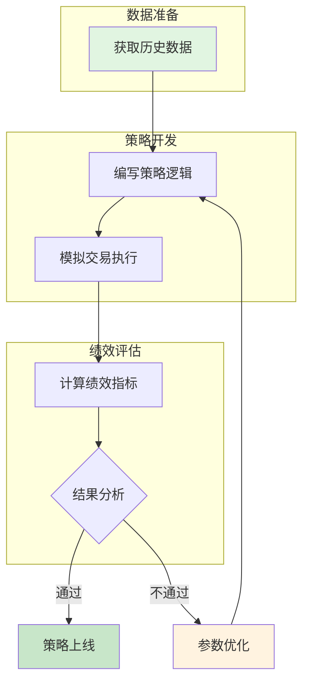
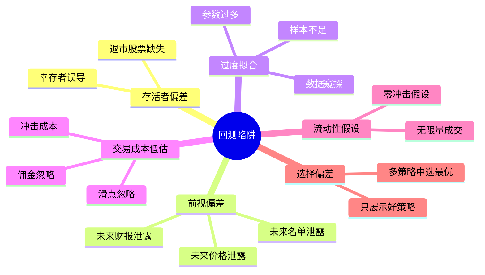

## 三、回测的基本原理

回测是量化交易的"试飞"环节——你的策略在真正投入真金白银之前，必须先在历史数据上证明自己。很多新手觉得回测就是跑个程序看收益曲线，但实际上，一个不严谨的回测比没有回测更危险，因为它会给你虚假的信心。本节从底层原理出发，系统讲解回测的理论基础、核心流程、六大常见陷阱、统计学检验方法，以及结果解读的完整框架。

### 3.1 什么是回测？

回测（Backtesting）是将交易策略应用于历史数据，模拟策略在过去一段时间内的表现，以评估策略的有效性和风险特征。它的核心逻辑是：**如果这个策略在过去运行，结果会怎样？**

这个定义看似简单，但包含三个关键假设：

1. **历史可重复假设**：市场的行为模式会在未来重现。这是回测存在的理论基础，但也是其最大的局限——市场并非物理系统，不存在恒定的规律
2. **无影响假设**：策略本身的交易行为不会影响市场价格。对于小资金策略成立，但对于大资金策略则需要考虑市场冲击
3. **数据可得假设**：回测中使用的数据在当时是可获取的。这是前视偏差问题的根源

#### 3.1.1 回测回答的核心问题

| 问题维度 | 具体问题 | 为什么重要 |
|----------|----------|------------|
| 收益性 | 这个策略能不能赚钱？ | 策略存在的根本意义 |
| 风险性 | 赚钱的同时会亏多少？ | 决定仓位和资金分配 |
| 极端风险 | 最糟糕的情况是什么？ | 决定你能否"活下来" |
| 稳定性 | 收益是来自策略还是运气？ | 决定策略是否有持续盈利能力 |
| 容量性 | 这个策略能管理多少资金？ | 决定策略的实用价值 |
| 适应性 | 策略在不同市场环境下表现如何？ | 决定策略的生命周期 |

#### 3.1.2 回测与模拟盘、实盘的关系

理解回测在整个策略验证体系中的位置至关重要：

| 验证方式 | 数据来源 | 撮合方式 | 情绪因素 | 可信度 |
|----------|----------|----------|----------|--------|
| 回测 | 历史数据 | 理想化模型 | 无 | ★★☆ |
| 模拟盘 | 实时数据 | 近似真实 | 弱（知道不是真钱） | ★★★ |
| 小资金实盘 | 实时数据 | 真实交易所 | 中等 | ★★★★ |
| 正式实盘 | 实时数据 | 真实交易所 | 强烈 | ★★★★★ |

回测是必要但不充分条件——通过回测不代表能实盘赚钱，但通不过回测的策略一定不要上实盘。

### 3.2 回测的基本流程



#### 第一步：数据获取与清洗

数据质量决定了回测的上限。数据问题无法通过策略优化来弥补——垃圾数据只能产出垃圾结果。

**数据质量的五个维度：**

| 维度 | 说明 | 典型问题 |
|------|------|----------|
| 完整性 | 是否包含停牌、除权除息、分红送转 | 忽略分红导致收益率偏低 |
| 准确性 | 价格和成交量是否正确 | 复权数据错误、成交量单位混淆 |
| 频率 | 日线/分钟线/Tick级数据 | 日线策略用Tick数据会引入噪声 |
| 存活者偏差 | 是否包含已退市股票 | 只用存续股票使收益虚高 |
| 时区对齐 | 不同数据源的时间戳是否一致 | 跨市场数据对齐错误 |

**A股常用数据源对比：**

| 数据源 | 费用 | 数据范围 | 更新频率 | 存活者偏差处理 | 适合人群 |
|--------|------|----------|----------|----------------|----------|
| Tushare | 免费/付费 | A股全历史 | 日更 | 有 | 入门-进阶 |
| AKShare | 免费 | A股+基金+期货 | 日更 | 部分 | 入门 |
| Wind | 付费（万/年级） | 全球全资产 | 实时 | 完善 | 机构 |
| 聚宽 | 平台内置 | A股+期货 | 日更 | 完善 | 入门 |
| 米筐 | 平台内置 | A股+期货 | 日更 | 完善 | 入门 |
| 通达信/同花顺 | 免费/付费 | A股 | 日更 | 有限 | 传统投资者 |

**数据清洗清单：**

1. 检查缺失值：停牌日是否标记？复权因子是否连续？
2. 检查异常值：价格是否出现非正常的0值或极端值？成交量是否出现异常跳变？
3. 复权处理：明确使用前复权还是后复权（推荐后复权用于回测，前复权用于实盘显示）
4. 除权除息对齐：分红、送股、配股是否正确反映在价格中
5. 时区与交易日历：A股节假日、临时停牌是否正确处理

#### 第二步：策略逻辑编写

将交易想法转化为明确的规则。策略必须是**完全确定性的**——任何一个时点，给定相同的市场状态，策略必须给出唯一的信号。不能有"看情况"这种模糊表述。

**策略逻辑的确定性检查：**

```text
❌ 模糊规则："当股票涨得差不多了就卖出"
✅ 确定规则："当收盘价突破20日均线且RSI>70时，以次日开盘价卖出"

❌ 模糊规则："在市场恐慌时买入"
✅ 确定规则："当VIX指数>30且沪深300跌破60日均线时，等额买入ETF组合"
```

策略信号的类型也需要明确定义：

- **入场信号**：什么条件下开始建仓
- **出场信号**：什么条件下平仓（止盈、止损、信号反转）
- **仓位信号**：每次交易多少（固定仓位、凯利公式、波动率加权）
- **过滤信号**：什么市场条件下不交易（如重大事件期间暂停）

#### 第三步：模拟交易执行

这一步最容易出错。你需要模拟：

**撮合价格的选择：**

| 撮合方式 | 说明 | 适用场景 | 偏差方向 |
|----------|------|----------|----------|
| 收盘价 | 以当日收盘价成交 | 日线级别趋势策略 | 乐观（实际很难精确收盘成交） |
| 次日开盘价 | 以次日开盘价成交 | 日线级别信号 | 较为真实 |
| VWAP | 成交量加权平均价 | 日内策略 | 较为真实 |
| TWAP | 时间加权平均价 | 大单拆分策略 | 较为真实 |
| 对手价 | 以买一/卖一价成交 | 高频策略 | 真实 |

**常见错误**：使用收盘价作为信号触发点和成交价——这意味着你在收盘价出现之前就知道了收盘价，属于典型的前视偏差。正确做法是：t时刻产生信号，t+1时刻执行交易。

#### 第四步：绩效指标计算

核心指标包括：年化收益率、最大回撤、夏普比率、胜率、盈亏比、卡玛比率等。这些指标在后续章节有详细讲解，此处只列出判断标准：

| 指标 | 计算公式 | "及格"标准 | "优秀"标准 |
|------|----------|------------|------------|
| 年化收益率 | 复利计算 | > 10% | > 20% |
| 最大回撤 | 峰值到谷底 | < 20% | < 10% |
| 夏普比率 | (收益-无风险)/波动率 | > 1.0 | > 2.0 |
| 胜率 | 盈利次数/总次数 | > 40% | > 55% |
| 盈亏比 | 平均盈利/平均亏损 | > 1.5 | > 2.5 |
| 卡玛比率 | 年化收益/最大回撤 | > 1.0 | > 3.0 |
| 年化波动率 | 日收益标准差×√252 | < 20% | < 12% |
| 交易次数 | 总交易笔数 | > 100次 | > 300次 |

**关于交易次数的特别说明**：统计学上，你需要足够的样本量才能判断一个策略是否有效。经验法则是至少需要100次以上的交易才能获得基本的统计置信度。如果一个策略三年只交易了20次，即使全部盈利，你也无法排除运气因素。

### 3.3 回测中的六大经典陷阱

这是本节最重要的部分。很多看起来"年化50%"的策略，一上线就亏钱，问题几乎都出在以下陷阱中。



#### 陷阱一：存活者偏差（Survivorship Bias）

**问题**：只使用当前存在的股票进行回测，忽略了历史上退市的股票。

**危害**：假设你回测一个"买入低市值股票"的策略，当前存续的低市值股票历史上确实涨了不少，但那些退市的、被并购的低市值股票已经被"幸存者偏差"悄悄删除了。你的回测结果会系统性地偏高。

**量化影响**：学术研究显示，存活者偏差可使回测年化收益率虚高2%-5%。在小盘股策略中，这个偏差可能更大，达到5%-10%。

**真实案例**：2015-2018年期间，A股有超过50家公司退市或暂停上市。如果你的回测数据集不包含这些公司，你的小盘股策略在那段时期的表现将被严重高估。某些"仙股"策略在回测中显示稳定盈利，但实际上买入退市股票的损失可能完全抹平收益。

**解决方法**：
- 使用包含退市股票的"全历史"数据库
- 聚宽、米筐等平台通常已经处理了这个问题
- 自建数据库时，确保从历史快照重建而非使用当前列表
- 定期验证：检查你的数据集中是否包含已退市股票的历史数据

#### 陷阱二：前视偏差（Look-ahead Bias）

**问题**：在策略中使用了未来信息。这是回测中最隐蔽、最常见的错误。

**常见场景**：

| 场景 | 错误做法 | 正确做法 |
|------|----------|----------|
| 价格数据 | 用当天收盘价在当天开盘时做决策 | 信号基于t日数据，t+1日执行 |
| 财务数据 | 用Q2财报数据在4月做决策 | Q2财报要到8-9月才公布，需设置滞后 |
| 指数成分 | 用今天沪深300成分股筛选 | 用调整生效日之前的成分股名单 |
| 宏观数据 | GDP数据发布日即使用 | GDP数据有1-2周发布滞后 |
| 分析师预期 | 使用最新一致预期 | 使用预测发布日时点的预期值 |

**深度分析——财务数据的时滞问题**：

A股上市公司财务报告的披露规则：
- 年报：次年4月30日前
- 一季报：4月30日前
- 半年报：8月31日前
- 三季报：10月31日前

这意味着：如果你在5月使用一季报数据，可能还算合理（大部分公司4月底已披露）；但如果你在7月使用半年报数据，那就是严重的前视偏差——半年报要到8月底才全部披露完毕。

**解决方法**：
- 严格区分"已知信息"和"未知信息"
- 在回测代码中，t时刻只能使用t-1及之前的数据
- 对财务数据设置明确的"可用日期"：`可用日期 = 报告期 + 最大披露延迟天数 + 安全缓冲`
- 使用"point-in-time"数据库，记录每个数据点的实际可获取时间

#### 陷阱三：过度拟合（Overfitting）

**问题**：策略参数过度适配历史数据，在样本外表现急剧下降。

**形象比喻**：就像一个学生把历年真题全部背下来，考试遇到原题就满分，但换个新题就不会了。

**过度拟合的数学本质**：

假设你有N个数据点，策略有k个自由参数。当k接近N时，策略可以完美拟合历史数据，但完全没有预测能力。这就是著名的"偏差-方差权衡"（Bias-Variance Tradeoff）：

```text
总误差 = 偏差² + 方差 + 不可约噪声

- 偏差：模型太简单，无法捕捉真实规律（欠拟合）
- 方差：模型太复杂，拟合了噪声（过度拟合）
- 不可约噪声：市场本身的随机性，无法消除
```

**过度拟合的识别信号：**

| 信号 | 说明 | 严重程度 |
|------|------|----------|
| 参数敏感 | 参数稍作调整，收益变化剧烈 | ★★★★★ |
| 参数过多 | 策略有5个以上自由参数 | ★★★★ |
| 逻辑说不通 | 策略在回测期表现完美，但无法解释为什么 | ★★★★★ |
| 交易次数少 | 回测期内只发生了少量交易 | ★★★★ |
| 过于完美 | 夏普比率>5，几乎零回撤 | ★★★★★ |
| 挑选痕迹 | 参数组合看起来是"挑"出来的最优解 | ★★★ |

**解决方案体系：**

1. **样本内/外测试（In-sample / Out-of-sample）**：
   - 用70%数据开发，30%数据验证
   - 如果样本外表现下降超过30%，则很可能过度拟合
   - 注意：样本内外的时间顺序很重要，应该用过去的数据开发，用未来的数据验证

2. **Walk-forward分析（滚动前推测试）**：
   - 将数据分为多个滚动窗口
   - 每个窗口内训练，下一个窗口测试
   - 最终结果是所有测试窗口的拼接
   - 这种方法最接近策略在实盘中的实际运行方式

```text
   窗口1: [训练期 2015-2017] → [测试期 2018]
   窗口2: [训练期 2016-2018] → [测试期 2019]
   窗口3: [训练期 2017-2019] → [测试期 2020]
   窗口4: [训练期 2018-2020] → [测试期 2021]
   最终评估：拼接2018-2021的所有测试结果
   ```

3. **参数稳健性检验（Parameter Robustness）**：
   - 在最优参数附近取多个值，观察收益是否平滑变化
   - 如果参数从10变到11，收益从年化50%骤降到5%，说明参数极度敏感
   - 健康的策略：参数在合理范围内变化时，收益曲线呈平滑的"高原"而非"尖峰"

4. **交叉验证（Cross-Validation）**：
   - 金融数据不能简单使用K-fold交叉验证（因为时间序列有顺序依赖）
   - 应使用"时序交叉验证"：始终用过去的数据训练，用未来的数据测试
   - 或使用"purged交叉验证"：在训练集和测试集之间留出gap期，避免信息泄露

5. **逻辑优先原则**：
   - 策略必须有经济学或行为学上的解释
   - 如果你说不清策略为什么能赚钱，它大概率不能持续赚钱
   - 例：动量策略有行为金融学解释（投资者反应不足），均线策略有趋势跟踪的逻辑基础

6. **多重检验修正**：
   - 如果你测试了100个策略，纯靠运气也会有几个"显著"的
   - 使用Bonferroni修正或FDR（False Discovery Rate）控制
   - 经验法则：如果你测试了N个策略，最终策略的p值应该 < 0.05/N

#### 陷阱四：交易成本低估

**问题**：回测中忽略了真实的交易成本，或严重低估了实际成本。

**A股的完整交易成本明细：**

| 项目 | 费率 | 说明 |
|------|------|------|
| 佣金 | 万1-万3 | 券商收取，最低5元/笔 |
| 印花税 | 0.05% | 仅卖出收取（2023年下调） |
| 过户费 | 0.001% | 双向收取，沪深都收 |
| 经手费 | 0.00341% | 交易所收取 |
| 证管费 | 0.002% | 证监会收取 |
| 滑点 | 因策略而异 | 实际成交价与预期价格的偏差 |

**合计**：单边约0.1%-0.15%，双边约0.2%-0.3%。

**滑点的量化估算**：

滑点是最容易被低估的成本。它取决于：
- 股票流动性：日均成交额越小，滑点越大
- 订单大小：占当日成交比例越大，滑点越大
- 市场波动：波动越大，滑点越大
- 下单方式：市价单滑点大于限价单

经验估算公式：

```text
滑点 ≈ 常数 × 股票日均波动率 × √(订单量/日均成交量)
```

对于A股小盘股（日均成交5000万以下），滑点可能高达0.3%-0.5%单边。

**特别注意**：对于高频策略，交易成本是收益的最大杀手。一个日均换手100%的策略，即使每次只赚0.1%，扣除双边0.2%的成本后也是亏损的。下表展示了换手率与成本的关系：

| 日均换手率 | 年化交易成本（双边0.25%） | 策略需达到的年化收益 |
|------------|---------------------------|---------------------|
| 10% | 5% | >5% |
| 50% | 25% | >25% |
| 100% | 50% | >50% |
| 200% | 100% | >100% |

**结论**：日均换手超过50%的策略，除非有极高的胜率和盈亏比，否则很难覆盖交易成本。

#### 陷阱五：流动性假设

**问题**：假设你可以在任意价格买入任意数量。

**现实冲击**：小盘股日均成交可能只有几百万，你的策略如果需要买入100万，就会显著推高股价（市场冲击），实际成本远高于回测假设。

**市场冲击的理论模型**：

市场冲击与订单量的关系通常呈非线性：

```text
冲击成本 ≈ σ × k × (Q/V)^α

其中：
σ = 股票波动率
k = 常数（通常0.1-0.5）
Q = 订单金额
V = 日均成交额
α = 冲击指数（通常0.5-0.6）
```

**量化示例**：

| 股票类型 | 日均成交额 | 订单金额 | 占比 | 估算冲击成本 |
|----------|-----------|----------|------|-------------|
| 大盘蓝筹 | 10亿 | 100万 | 0.1% | 0.01% |
| 中盘股 | 1亿 | 100万 | 1% | 0.1% |
| 小盘股 | 3000万 | 100万 | 3.3% | 0.3% |
| 微盘股 | 500万 | 100万 | 20% | 1.5%+ |

**解决方法**：
- 限制持仓占个股日均成交量的比例（通常不超过10%-20%）
- 对小盘股施加流动性折扣：`实际收益 = 回测收益 - 估算冲击成本`
- 使用VWAP或TWAP模拟成交价格
- 在回测中加入成交量限制：当日买入量不超过当日成交量的某个比例

#### 陷阱六：选择偏差与数据窥探（Selection Bias & Data Snooping）

**问题**：这是最容易被忽视的陷阱。当你反复在同一个数据集上测试、修改策略、再测试，本质上你在"偷看"数据。

**为什么这很危险**：

假设你测试了100个随机策略，在95%置信水平下，纯靠运气也会有5个策略"显著"盈利。如果你只展示这5个策略，外人会觉得你的策略很厉害，但实际上这只是统计噪声。

**数据窥探的典型场景**：

1. **参数扫描**：尝试了100组参数，选了最好的那组报告
2. **策略筛选**：开发了20个策略，选了回测最好的那个
3. **特征选择**：测试了50个技术指标，选了最有效的那个
4. **时间窗口选择**：在某个特定时间段内策略表现最好，就报告那个时间段

**数据窥探偏差的量化**：

Harvey, Liu & Zhu (2016) 的研究表明，由于大量研究者在相同数据上测试策略，传统的t统计量阈值（t>2）已经不够严格。他们建议使用t>3作为新的阈值。

**实操建议**：

- 预注册策略：在测试之前先写下策略逻辑和预期，而不是事后找理由
- 保留最终测试集：将最近20%的数据完全隔离，只在策略最终确定后使用一次
- 记录所有尝试：记录你测试过的每一个策略和参数组合，包括失败的
- 多市场验证：如果一个策略在A股、美股、港股都有效，更可能是真信号

### 3.4 回测的统计学基础

理解回测背后的统计学原理，是避免被虚假结果欺骗的关键。

#### 3.4.1 样本量与统计显著性

一个策略是否有效，不是看收益高低，而是看收益是否"统计显著"。

**核心问题**：策略的收益是真实的信号，还是随机噪声？

**假设检验框架**：

```text
H0（零假设）：策略没有预测能力，收益来自随机波动
H1（备择假设）：策略有预测能力，收益来自真实信号

如果p值 < 0.05，拒绝H0，认为策略有效
如果p值 >= 0.05，无法拒绝H0，策略可能只是运气
```

**样本量计算**：

要检测一个年化收益为μ、波动率为σ的策略是否显著，需要的最少交易次数：

```text
n ≥ (z_α/2 + z_β)² × σ² / μ²

其中：
z_α/2 = 1.96（95%置信度）
z_β = 0.84（80%检验效能）
σ = 策略波动率
μ = 策略预期超额收益
```

**实际含义**：要验证一个年化超额收益5%、年化波动率20%的策略是否有效，在95%置信度和80%检验效能下，你需要至少约250个独立观察值（约一年的日数据）。如果策略波动率更高或超额收益更低，需要的样本量会更大。

#### 3.4.2 蒙特卡洛模拟

蒙特卡洛模拟是检验策略稳健性的强大工具。其核心思想是：如果策略的收益完全来自随机过程，那么随机生成的策略能产生类似的结果吗？

**方法一：排列检验（Permutation Test）**

1. 保留策略的所有交易记录
2. 随机打乱交易的盈亏顺序
3. 重新计算收益曲线和最大回撤
4. 重复1000次
5. 如果真实策略的表现优于95%的随机排列，则策略在95%置信度下有效

**方法二：Bootstrap检验**

1. 从策略的历史日收益中，有放回地随机抽样
2. 构造1000条模拟收益曲线
3. 计算置信区间
4. 如果年化收益的95%置信区间下限>0，则策略有效

**方法三：随机策略基准**

1. 生成1000个"随机策略"（随机买卖信号）
2. 确保随机策略的交易频率与真实策略一致
3. 比较真实策略在所有随机策略中的排名
4. 排名>95%分位说明策略可能有效

#### 3.4.3 多重检验问题

这是量化交易研究中最被低估的统计陷阱。

**问题**：如果你同时测试了多个策略/参数/数据集，总体犯错概率会急剧上升。

```text
单次检验犯错概率：α = 0.05
N次独立检验后至少犯一次错的概率：1 - (1-α)^N

N=10:  犯错概率 = 40%
N=50:  犯错概率 = 92%
N=100: 犯错概率 = 99.4%
```

**修正方法**：

| 方法 | 原则 | 适用场景 |
|------|------|----------|
| Bonferroni修正 | α' = α/N | 最严格，适合独立检验 |
| Holm-Bonferroni | 逐步修正 | 比Bonferroni更有检验效能 |
| FDR控制 | 控制假发现率 | 适合大量同时检验 |
| 预注册策略 | 提前声明假设 | 最佳实践，但实操中较少见 |

### 3.5 回测框架的选择

回测框架的选择影响开发效率和结果可信度。

#### 3.5.1 框架对比

| 框架 | 语言 | 类型 | 特点 | 适合人群 |
|------|------|------|------|----------|
| Backtrader | Python | 事件驱动 | 功能强大、灵活、社区活跃 | 策略研究者 |
| vnpy | Python | 事件驱动 | 国产开源，支持实盘交易 | 从研究到实盘的开发者 |
| Zipline | Python | 事件驱动 | Quantopian开源，成熟稳定 | 美股研究者 |
| 聚宽（JoinQuant） | Python | 在线平台 | 数据丰富，免部署 | 入门者 |
| 米筐（RiceQuant） | Python | 在线平台 | 界面友好 | 入门者 |
| QMT | Python/C++ | 券商级 | 支持实盘，速度快 | 有券商账户的实盘交易者 |
| VectorBT | Python | 向量化 | 极速，适合批量回测 | 需要快速筛选策略的研究者 |
| 自建框架 | 任意 | 自定义 | 完全可控，但开发成本高 | 机构/高级开发者 |

#### 3.5.2 事件驱动 vs 向量化回测

这两种是回测的核心架构范式：

| 维度 | 事件驱动 | 向量化 |
|------|----------|--------|
| 原理 | 逐根K线模拟，按时间顺序处理 | 一次性处理全部数据，用numpy/pandas运算 |
| 速度 | 较慢（Python循环） | 极快（矩阵运算） |
| 真实性 | 高（逐笔模拟） | 中（批量处理） |
| 灵活性 | 高（可模拟复杂逻辑） | 中（简单策略更方便） |
| 前视风险 | 低（天然防前视） | 高（容易不小心用到未来数据） |
| 适合场景 | 实盘对接、复杂策略 | 策略筛选、参数优化 |

**建议**：先用向量化方法快速筛选策略，再用事件驱动方法精细验证。

#### 3.5.3 新手推荐路径

```text
入门阶段 → 聚宽/米筐在线平台（免部署、数据全、社区活跃）
    ↓
进阶阶段 → 本地Backtrader + Tushare（数据自主、灵活定制）
    ↓
实战阶段 → vnpy/QMT（支持实盘对接、券商直连）
    ↓
专业阶段 → 自建框架（完全可控、性能最优）
```

### 3.6 回测结果的正确解读

回测结果不是考试分数，不是越高越好。正确解读回测结果需要建立系统的评估框架。

#### 3.6.1 收益来源分析

区分收益的来源是解读回测的第一步：

```text
总收益 = Alpha（策略能力）+ Beta（市场暴露）+ 残差（噪声/运气）
```

**检验方法**：
- 将策略收益对市场收益做回归分析
- 如果Alpha显著>0，说明策略有真正的超额能力
- 如果Alpha不显著，收益主要来自Beta暴露——这意味着在牛市中任何策略都能赚钱

**实际案例**：在2020年A股牛市中，沪深300全年上涨27.2%。如果你的策略回测显示年化收益30%，其中可能有25%来自Beta，只有5%来自Alpha。而在2022年熊市中（沪深300下跌21.6%），Beta暴露会让你亏损严重。

#### 3.6.2 不同市场环境的表现

一个真正稳健的策略应该在多种市场环境下都能生存：

| 市场环境 | 测试方法 | 健康表现 |
|----------|----------|----------|
| 牛市 | 2019-2020年A股 | 跟涨或跑赢 |
| 熊市 | 2022年A股 | 小亏或不亏 |
| 震荡市 | 2021年A股 | 微利或持平 |
| 极端行情 | 2015年股灾、2020年3月 | 最大回撤可控 |
| 流动性危机 | 2016年熔断 | 不爆仓 |

#### 3.6.3 收益曲线的形态分析

不要只看总收益，要仔细分析收益曲线的形态：

**健康形态**：
- 收益曲线呈稳定的上升斜率
- 回撤小且恢复快（快速V型反弹）
- 不依赖少数几天的大赚

**危险形态**：
- 收益曲线呈阶梯形（依赖少数大赚日）
- 回撤大且恢复慢（U型或L型反弹）
- 收益集中在某个特定时间段

#### 3.6.4 最大回撤的实际意义

最大回撤不仅是一个数字，它决定了你能否在实盘中坚持这个策略：

| 最大回撤 | 实盘心理影响 | 建议 |
|----------|------------|------|
| < 5% | 几乎无感 | 可以全仓执行 |
| 5%-10% | 略有不安 | 可以接受 |
| 10%-20% | 相当焦虑 | 需要风控辅助 |
| 20%-30% | 非常痛苦 | 大多数人会在此放弃 |
| > 30% | 极度恐惧 | 几乎无人能坚持 |

**重要提醒**：回测中的最大回撤通常比实盘小。实盘中你还需要承受执行偏差、情绪波动、技术故障等额外风险。经验法则是：**实盘最大回撤 ≈ 回测最大回撤 × 1.5**。

#### 3.6.5 交易次数与统计置信度

| 回测期内交易次数 | 统计意义 | 建议 |
|-----------------|----------|------|
| < 30次 | 几乎无统计意义 | 不可作为决策依据 |
| 30-100次 | 初步统计意义 | 需要谨慎参考 |
| 100-300次 | 基本可信 | 可以初步决策 |
| > 300次 | 较强统计意义 | 可以做正式决策 |

### 3.7 从回测到实盘的过渡

回测通过只是第一步，从回测到实盘还需要跨越多个鸿沟。

#### 3.7.1 回测与实盘的系统性差异

| 差异维度 | 回测环境 | 实盘环境 | 影响程度 |
|----------|----------|----------|----------|
| 交易成本 | 简化假设 | 真实成本+冲击 | ★★★★ |
| 撮合质量 | 理想化撮合 | 真实交易所撮合 | ★★★ |
| 滑点 | 可能被低估 | 实际存在 | ★★★★ |
| 数据延迟 | 无延迟 | 网络延迟+处理延迟 | ★★★ |
| 情绪因素 | 不存在 | 巨大影响 | ★★★★★ |
| 技术风险 | 不存在 | 程序bug/网络中断/交易所故障 | ★★★★ |
| 资金限制 | 无限资金假设 | 有限资金约束 | ★★★ |

#### 3.7.2 过渡路径

**推荐路径**：

```text
回测通过 → 纸上交易(1-2周) → 模拟盘(1-3个月) → 小资金实盘(3-6个月) → 正式实盘
```

**每个阶段的目标**：
- **纸上交易**：验证执行流程是否顺畅，发现代码bug
- **模拟盘**：验证策略在实时数据上的表现，建立交易信心
- **小资金实盘**：验证真实交易成本和心理承受能力
- **正式实盘**：逐步加仓至目标仓位

### 3.8 常见误区与纠正

| 误区 | 正确认识 |
|------|----------|
| "回测年化50%，实盘也能赚50%" | 回测收益几乎总是高于实盘，扣除交易成本和执行偏差后可能只有20%-30% |
| "夏普比率越高越好" | 夏普比率>5通常意味着过度拟合或数据错误 |
| "回测时间越长越好" | 时间太早的数据可能已经不适用于当前市场结构 |
| "参数优化就是过度拟合" | 合理的参数优化（Walk-forward）不是过度拟合，关键是方法 |
| "回测不赚钱的策略就放弃" | 有些策略回测平庸但实盘优秀（因为实盘有执行优势） |
| "只需要看总收益" | 收益曲线形态、回撤特征、夏普比率同样重要 |
| "用日线数据就够了" | 日内策略必须使用分钟线甚至Tick数据 |
| "回测框架不重要" | 框架的撮合逻辑、成本模型直接影响结果可信度 |

### 3.9 实操建议

- **从简单策略开始**：均线交叉、动量策略等经典策略，先跑通流程
- **记录每一步的假设**：回测报告应该清晰记录数据范围、交易成本假设、滑点假设等
- **不要追求完美回测**：回测的目的是验证逻辑，不是制造漂亮曲线
- **回测通过不等于实盘成功**：回测是必要条件，不是充分条件。建议先用小资金实盘验证3-6个月
- **建立回测清单**：每次回测前检查数据质量、前视偏差、交易成本、流动性假设
- **版本控制**：使用Git管理策略代码和回测结果，便于回溯和比较
- **写回测日志**：记录每次回测的参数、数据范围、结果和结论

> **风险提示**：回测结果不代表未来表现。量化交易存在模型风险、技术风险和市场风险。任何策略都可能在特定市场环境下失效。建议用可承受损失的资金进行实盘验证，切勿借钱或使用生活必需资金进行量化交易。

***
