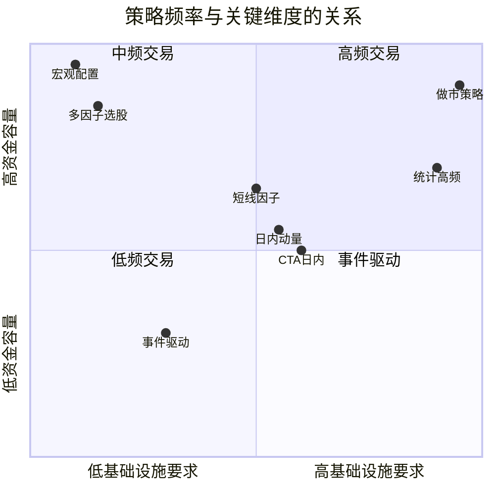
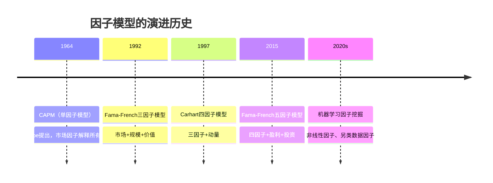
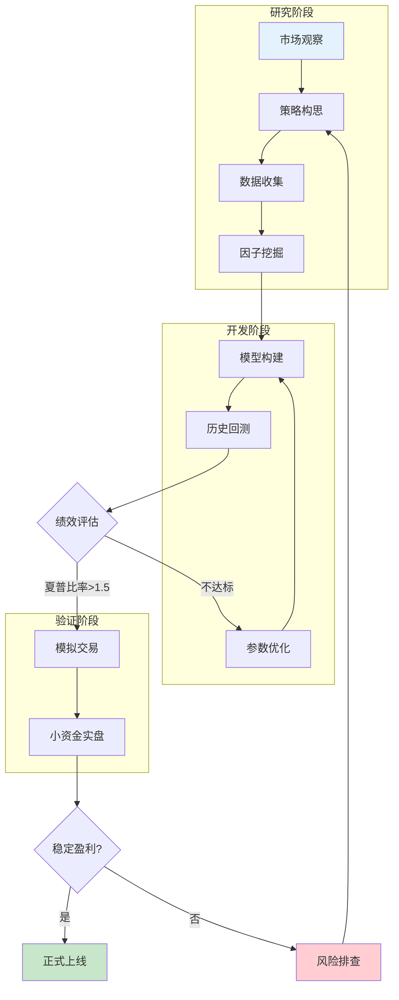
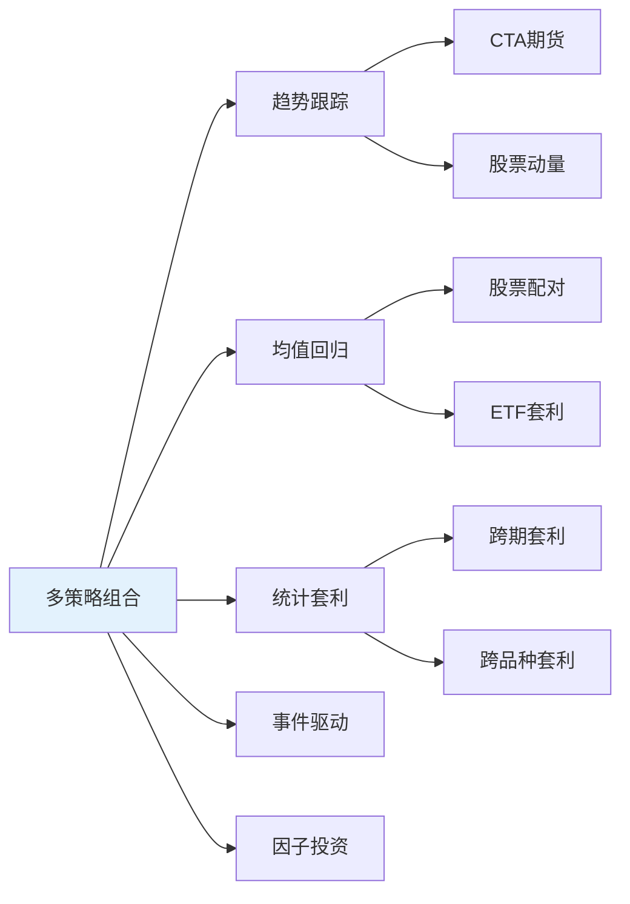

## 四、量化策略的分类

量化策略的世界并非铁板一块。初学者常犯的一个错误是把"量化交易"当作一种单一策略来理解，实际上它是一个庞大的策略家族，从毫秒级的高频做市到跨年度的因子轮动，逻辑截然不同，技术要求天差地别，适合的资金规模和投资者类型也完全不同。

理解策略分类的意义不在于"背名词"，而在于**建立坐标系**——当你听说一个新策略时，能迅速判断它属于哪个象限，它的收益来源是什么，它在什么市场环境下会失效。这才是分类学的核心价值。

### 4.1 按交易频率分类：从毫秒到年

交易频率是策略分类最直观的维度，因为它直接决定了基础设施要求、资金容量和收益特征。

#### 4.1.1 高频交易（High-Frequency Trading, HFT）

**定义**：持仓时间从毫秒到分钟级，单笔利润极薄但交易次数极多（日均数万到数十万笔）。

**核心特征**：

| 维度 | 具体要求 |
|------|----------|
| 持仓时间 | 毫秒~5分钟 |
| 日均交易次数 | 10,000~100,000+ |
| 单笔利润 | 0.001%~0.01% |
| 基础设施 | 交易所机房托管（Co-location）、FPGA硬件加速、专线网络 |
| 网络延迟要求 | <1毫秒（微秒级优化） |
| 资金门槛 | 通常需要数千万到数亿 |
| 监管要求 | 需要做市商牌照或特殊资质 |

**主要子策略**：

- **做市策略（Market Making）**：同时挂出买单和卖单，赚取买卖价差（Bid-Ask Spread）。需要极快的报价更新速度和精准的库存管理。做市商为市场提供流动性，但也承担库存方向性风险。
- **统计高频（Statistical HFT）**：利用超短期的统计规律（如订单簿不平衡、价格动量微结构）进行预测性交易。持仓时间通常在秒级。
- **延迟套利（Latency Arbitrage）**：利用不同交易所或不同数据源之间的信息传播时间差获利。例如，A交易所的价格更新比B交易所快几十毫秒，利用这个时间差在B交易所抢先交易。
- **事件驱动高频**：在宏观数据发布（如CPI、非农就业）的瞬间进行交易，利用算法对数据的解析速度优势。

**对普通投资者的现实**：HFT不是一个"策略"，而是一个完整的工程体系。它需要专业硬件、交易所直连、团队级的运维能力。个人投资者几乎不可能参与，了解即可。国内头部HFT公司包括九坤、明汯、锐天等，管理规模均在百亿以上。

#### 4.1.2 中频交易（Medium-Frequency Trading）

**定义**：持仓时间从几小时到几天，日均交易次数从几次到几十次。这是当前量化私募的主流策略频段。

**核心特征**：

| 维度 | 具体范围 |
|------|----------|
| 持仓时间 | 1小时~5天 |
| 日均交易次数 | 5~50笔 |
| 年化换手率 | 30~100倍 |
| 基础设施 | 普通服务器即可，无需机房托管 |
| 数据需求 | 分钟线/Tick数据 |
| 资金容量 | 1亿~100亿 |

**典型策略类型**：

- **日内动量/反转策略**：利用日内价格模式（如开盘跳空回补、尾盘效应）进行交易。
- **短线因子轮动**：基于量价因子（如成交额排名变化、波动率异动）每日或隔日调仓。
- **CTA日内趋势**：在期货市场中，利用5分钟~1小时级别的趋势信号进行交易。

**中频交易的"甜蜜区"**：这个频段既能捕捉到短期市场无效性（信息传播的延迟、投资者行为偏差），又不像HFT那样对基础设施有极端要求，同时资金容量足够支撑较大的管理规模。这就是为什么大部分量化私募选择在这个频段竞争。

#### 4.1.3 低频交易（Low-Frequency Trading）

**定义**：持仓时间从几周到几个月，调仓频率低，更接近传统主动投资，但决策过程完全系统化。

**核心特征**：

| 维度 | 具体范围 |
|------|----------|
| 持仓时间 | 1周~6个月 |
| 调仓频率 | 周度/月度/季度 |
| 年化换手率 | 2~15倍 |
| 基础设施 | 普通PC即可 |
| 数据需求 | 日线数据、财务数据 |
| 资金容量 | 不限（百亿级以上仍适用） |

**典型策略类型**：

- **多因子选股**：基于价值、质量、动量、规模等因子，每月或每季度调仓一次。这是公募量化基金的主流策略。
- **宏观配置**：基于宏观经济指标（PMI、利率、通胀）进行大类资产配置。
- **基本面量化**：通过分析财务报表、行业数据来做出投资决策，本质上是用系统化方法做基本面投资。

**低频策略的优势与劣势**：

- 优势：交易成本低、资金容量大、逻辑透明可解释、不需要复杂技术架构
- 劣势：策略拥挤（大量资金涌入相同因子）、短期可能跑输主观投资、对市场风格切换反应慢

#### 4.1.4 频率选择指南

**选择建议**：

| 投资者类型 | 推荐频率 | 原因 |
|------------|----------|------|
| 个人投资者（10万~500万） | 低频~中低频 | 不需要复杂基础设施，交易成本可控 |
| 小型私募（500万~5亿） | 中频 | 平衡收益和容量，是最佳甜蜜区 |
| 大型私募（5亿以上） | 中低频~低频 | 高频容量不足，需要低频策略吸收资金 |
| 机构投资者（公募/保险） | 低频 | 合规要求、资金规模决定了只能做低频 |

### 4.2 按策略逻辑分类：理解收益的来源

策略逻辑决定了你在赚谁的钱，以及这种赚钱方式能否持续。这是策略分类中最核心的维度。

#### 4.2.1 趋势跟踪（Trend Following）

**核心假设**：价格运动存在惯性，上涨趋势大概率延续，下跌趋势也大概率延续。

**原理机制**：

趋势跟踪的理论基础来自行为金融学——投资者对新信息的反应存在"锚定效应"和"渐进反应"。当利好消息出现时，投资者不会一步到位地重新定价，而是逐步调整预期，这个过程就产生了趋势。此外，机构投资者的大规模建仓/平仓行为本身也会推动价格形成趋势。

**实现方式**：

| 方法 | 具体技术 | 适用场景 |
|------|----------|----------|
| 均线突破 | 价格突破N日均线时入场 | 通用 |
| 通道突破 | 价格突破N日最高/最低价时入场（如海龟交易法则） | 期货CTA |
| 动量信号 | 过去N日收益率排名靠前时做多 | 股票多头 |
| 技术指标组合 | MACD+ADX+布林带等多指标确认 | 通用 |
| 突破+回调 | 趋势确认后等待回调再入场 | 降低入场成本 |

**趋势跟踪的数学特征**：

- 胜率通常只有30%~45%（多数交易是小亏）
- 盈亏比通常在2:1到5:1之间（靠少数大赚的交易覆盖大量小亏）
- 回撤特征：在震荡市中持续亏损，但趋势来临时快速回本
- 与均值回归策略天然形成对冲

**趋势跟踪的困境**：

1. **震荡市磨损**：市场70%的时间处于震荡状态，趋势跟踪在这段时间持续产生小额亏损
2. **假突破**：价格短暂突破后迅速回落，导致反复止损
3. **趋势拥挤**：当大量资金都使用趋势跟踪时，趋势的持续性下降
4. **尾部风险**：趋势反转时可能产生较大回撤

#### 4.2.2 均值回归（Mean Reversion）

**核心假设**：价格偏离其"正常水平"后，大概率会回归。偏离越大，回归的概率和幅度越大。

**原理机制**：

均值回归的理论基础是"价格围绕价值波动"。在短期内，投资者情绪会导致价格过度偏离基本面价值，但套利者和理性投资者的存在会将价格拉回合理区间。另一个解释是"过度反应理论"——投资者对负面消息的过度恐慌和对正面消息的过度乐观，都会创造均值回归的机会。

**实现方式**：

| 方法 | 具体技术 | 核心参数 |
|------|----------|----------|
| 布林带 | 价格突破N倍标准差通道时反向交易 | 均线周期、标准差倍数 |
| RSI超买超卖 | RSI低于30买入，高于70卖出 | RSI周期、超买超卖阈值 |
| 配对交易 | 两只相关股票的价差偏离均值时交易 | 协整关系、价差均值和标准差 |
| 日内反转 | 前日大跌的股票今日反弹 | 回看天数、偏离阈值 |
| ETF折溢价 | ETF价格偏离净值时套利 | 偏离阈值、申赎效率 |

**均值回归的关键难题——如何定义"均值"**：

这是均值回归策略最核心的技术问题。"均值"不是一个固定的数字，它随时间变化。常见的定义方式：

1. **移动平均**：简单但滞后，常用20日/60日均线
2. **指数加权移动平均（EWMA）**：对近期数据赋予更高权重，响应更快
3. **卡尔曼滤波**：自适应估计"真实价值"，适合状态持续变化的场景
4. **基本面锚定**：用PE/PB等估值指标定义"合理价格"
5. **协整关系**：在配对交易中，用两只股票的线性组合作为均值参考

**均值回归的风险**——"均值迁移"：

最大的风险不是价格不回归，而是**均值本身发生了变化**。当一家公司的基本面发生根本性恶化时，股价的"均值"会下移，此时"逢低买入"不是均值回归，而是"接飞刀"。应对方法是结合基本面因子做过滤，避免买入基本面恶化的标的。

#### 4.2.3 统计套利（Statistical Arbitrage）

**核心假设**：相关资产之间的统计关系在短期内是稳定的，当这种关系出现暂时性偏离时，存在套利机会。

**与均值回归的区别**：均值回归关注单一资产价格相对于其自身均值的偏离，统计套利关注多个资产之间关系的偏离。统计套利通常是市场中性的（不承担方向性风险），而均值回归可能是有方向性的。

**主要子策略**：

**配对交易（Pairs Trading）**

这是统计套利最经典的形态。两只历史走势高度相关的股票（如同行业的中国平安和中国太保），当价差偏离正常范围时，做多被低估的、做空被高估的。

关键步骤：
1. 从同行业/同板块中筛选候选配对
2. 使用Engle-Granger两步法或Johansen检验验证协整关系
3. 计算价差序列的均值和标准差
4. 价差偏离2倍标准差时开仓，回归均值时平仓
5. 设置止损（价差偏离3倍标准差时强制平仓）

**跨期套利（Calendar Spread）**

利用同一品种不同到期月份期货合约之间的价差进行交易。例如，当近月合约相对远月合约出现异常折价时（Backwardation加深），做多近月、做空远月。

**跨市场套利**

利用同一资产在不同市场的价差进行交易。例如，A+H股的价差、ETF一二级市场价差、期现基差套利等。

**统计套利的核心风险**：

- **关系破裂风险**：两只股票的协整关系可能因为并购、重组、行业格局变化而永久性失效
- **拥挤风险**：当太多资金追逐同一组配对时，价差偏离被压缩，收益下降
- **做空限制**：A股做空机制不完善（融券困难、费率高），限制了统计套利的实施

#### 4.2.4 因子投资（Factor Investing）

**核心假设**：资产收益可以被分解为若干个系统性因子的暴露收益加上残差。通过暴露于特定因子，可以获得对应的风险溢价。

**经典因子模型的演进**：

**主流因子详解**：

| 因子 | 定义 | 理论基础 | A股有效性 | 拥挤程度 |
|------|------|----------|-----------|----------|
| 价值（Value） | 低PE/PB的股票跑赢高PE/PB | 行为金融：投资者过度外推成长性 | 中等（A股成长偏好削弱了价值因子） | 中等 |
| 规模（Size） | 小市值股票跑赢大市值 | 流动性溢价、信息不对称 | 较强（但近年减弱） | 高 |
| 动量（Momentum） | 过去3-12个月表现好的股票继续跑赢 | 投资者反应不足、信息渐进传播 | 弱（A股短期反转效应更强） | 低 |
| 质量（Quality） | 高ROE、低杠杆、稳定盈利的股票跑赢 | 投资者忽视基本面质量 | 较强 | 中等 |
| 低波动（Low Vol） | 低波动率股票跑赢高波动率 | 彩票偏好、杠杆限制 | 较强 | 高 |
| 红利（Dividend） | 高股息率股票跑赢低股息率 | 收益偏好、纪律效应 | 较强（近年热门） | 高 |

**因子投资的"因子动物园"问题**：

学术界已发现了400+个因子，但其中大部分是数据挖掘的产物，没有真正的经济学解释。Harvey, Liu & Zhu (2016) 的经典论文 "...and the Cross-Section of Expected Returns" 指出，经过多重检验校正后，真正有效的因子可能只有少数几个。

判断因子是否"真因子"的三个标准：
1. **有经济学解释**：为什么这个因子能获得超额收益？是风险补偿还是行为偏差？
2. **样本外有效**：在论文发表后、在其他市场、在其他时间段是否仍然有效？
3. **经得起交易成本**：考虑换手率和交易成本后，净收益是否仍然显著？

#### 4.2.5 事件驱动（Event-Driven）

**核心假设**：特定事件（财报发布、并购重组、政策出台、指数调样）会对股价产生可预测的影响。

**主要子策略**：

- **财报后漂移（Post-Earnings Announcement Drift, PEAD）**：超预期的公司在财报发布后会持续上涨一段时间。这是被研究最多的市场异象之一，自1968年发现以来持续有效。
- **指数调样套利**：当MSCI、沪深300等指数宣布调整成分股时，被纳入的股票会因被动基金的买入而上涨，被剔除的股票会下跌。这种效应在宣布日到生效日之间最为显著。
- **并购套利（Merger Arbitrage）**：当A公司宣布收购B公司时，B公司股价通常会涨到接近收购价但略低于收购价。做多B公司，等待交易完成赚取差价。
- **定增/可转债事件**：上市公司发布定增预案、可转债发行等事件后，股价通常有规律性反应。

**事件驱动策略的特殊性**：

事件驱动策略的收益不依赖于市场的方向性走势，而依赖于特定事件的规律性影响。这使得它与传统策略的相关性较低，是组合中很好的分散化工具。但事件频率有限，单个策略的容量通常不大。

#### 4.2.6 机器学习/深度学习策略

**核心假设**：市场中存在复杂的非线性关系，传统统计方法无法捕捉，机器学习可以。

**与传统量化的关系**：机器学习不是一种独立的策略逻辑，而是一种**建模工具**。它可以用于趋势跟踪（用LSTM预测趋势）、均值回归（用随机森林判断回归概率）、因子投资（用XGBoost做因子合成）等任何策略类型。

**常用模型及适用场景**：

| 模型 | 适用场景 | 优势 | 劣势 |
|------|----------|------|------|
| 线性回归/Lasso | 因子合成、收益预测 | 可解释性强、不易过拟合 | 无法捕捉非线性关系 |
| 随机森林/XGBoost | 因子组合、信号生成 | 捕捉非线性、自动特征选择 | 特征工程仍需人工 |
| LSTM/Transformer | 时序预测、订单流分析 | 捕捉时序依赖 | 数据需求大、过拟合风险高 |
| 强化学习 | 动态仓位管理、执行优化 | 自适应、端到端 | 训练不稳定、样本效率低 |
| GAN/扩散模型 | 金融数据增强、情景模拟 | 生成逼真市场数据 | 生成质量难以验证 |

**机器学习策略的常见陷阱**：

1. **数据窥探（Data Snooping）**：尝试了100个模型，选了最好的一个——这本身就是过拟合
2. **非平稳性**：金融数据的分布随时间变化，模型训练集和测试集的分布可能不同
3. **特征泄露**：无意中使用了未来信息作为特征（如用当天的收盘价预测当天的收益）
4. **黑箱问题**：无法解释模型为什么做出某个决策，难以判断是否只是在拟合噪声

### 4.3 按资产类别分类

不同资产类别的交易机制、流动性和市场微观结构差异巨大，策略需要针对性设计。

#### 4.3.1 股票量化

**A股特殊性**：

| 规则 | 影响 |
|------|------|
| T+1交易 | 无法日内止损，日内策略受限 |
| 10%/20%涨跌停 | 限制极端行情的利润/亏损 |
| 融券困难 | 做空策略难以实施 |
| 印花税0.05%（卖出） | 增加做空和高频换手成本 |
| 散户占比高 | 行为偏差更多，Alpha机会更多 |

**A股量化策略的主流方向**：

1. **指数增强**：在跟踪基准指数的基础上，通过量化选股获取超额收益。通常年化超额5%~15%。
2. **市场中性**：多头持有一篮子股票，同时做空股指期货对冲市场风险。追求与市场涨跌无关的绝对收益。
3. **量化多头**：不做对冲，纯粹依靠量化选股能力。本质上是用系统化方法做股票投资。

**港股/美股量化**：

- 港股：做空机制完善，T+0交易，但流动性集中在大盘股，小盘股流动性差
- 美股：做空方便，T+0交易，但竞争极其激烈（大量HFT和机构），个人投资者的Alpha空间有限

#### 4.3.2 期货量化（CTA）

**CTA的全称是Commodity Trading Advisor**，源自美国的监管分类，现在泛指所有期货市场的量化策略。

**CTA策略的独特优势**：

1. **双向交易**：做多做空都方便，不存在A股的做空限制
2. **T+0交易**：可以日内反复开平仓
3. **杠杆交易**：保证金交易，资金效率高
4. **危机Alpha**：在股市大跌时，CTA策略（特别是趋势跟踪）往往表现突出，因为大跌通常伴随着强烈的下跌趋势
5. **与股市低相关**：CTA策略的收益与股票市场相关性低，是资产配置的重要工具

**CTA的主要品种分类**：

| 品种类别 | 代表品种 | 波动率特征 | 策略适配 |
|----------|----------|------------|----------|
| 黑色系 | 螺纹钢、铁矿石、焦炭 | 高波动，受政策影响大 | 趋势跟踪、事件驱动 |
| 有色金属 | 铜、铝、锌 | 中等波动，与宏观经济相关 | 趋势跟踪、宏观驱动 |
| 能源化工 | 原油、PTA、甲醇 | 高波动，受地缘政治影响 | 趋势跟踪 |
| 农产品 | 豆粕、玉米、棉花 | 中低波动，季节性强 | 季节性策略、供需驱动 |
| 贵金属 | 黄金、白银 | 中等波动，避险属性 | 宏观驱动、套利 |
| 金融期货 | 股指期货、国债期货 | 与对应标的高度相关 | 套利、对冲 |

**CTA策略的关键技术**：

- **波动率标准化**：不同品种的波动率差异巨大，需要标准化后才能公平比较和分配仓位
- **展期管理**：期货合约有到期日，需要在到期前移仓换月，展期成本是CTA策略的隐性成本
- **保证金管理**：杠杆交易需要精确管理保证金，避免极端行情下的强制平仓

#### 4.3.3 期权量化

期权是量化策略中工具属性最强的品种——它不是一种独立的策略，而是一种**风险收益的定制化工具**。

**期权策略的核心维度**：

1. **方向（Delta）**：看涨/看跌/中性
2. **波动率（Vega）**：预期波动率上升/下降/中性
3. **时间（Theta）**：赚取/支付时间价值衰减
4. **凸性（Gamma）**：正Gamma（做多波动率）/ 负Gamma（做空波动率）

**常见期权量化策略**：

| 策略 | 逻辑 | 适用场景 | 风险特征 |
|------|------|----------|----------|
| 波动率套利 | 历史波动率 vs 隐含波动率的偏离 | 波动率均值回归 | 波动率大幅偏离时亏损 |
| Delta对冲 | 期权做多波动率，动态对冲Delta | 波动率上升时获利 | 对冲频率影响成本 |
| 卖出跨式/宽跨式 | 赚取时间价值（Theta） | 低波动率环境 | 大行情时亏损巨大 |
| 价差交易 | 利用期权定价偏差 | 识别错误定价 | 关系破裂风险 |
| 尾部对冲 | 买入深度虚值看跌期权 | 黑天鹅保护 | 持续支付权利金 |

**期权做市**是HFT的一个重要分支——做市商同时挂出看涨和看跌期权的买卖价，赚取价差并动态对冲方向性风险。这需要极其精密的定价模型和对冲执行系统。

#### 4.3.4 加密货币量化

加密货币市场为量化策略提供了独特的环境：

**与传统市场的差异**：

| 维度 | 传统市场 | 加密货币市场 |
|------|----------|--------------|
| 交易时间 | 工作日特定时段 | 7×24小时 |
| 做空限制 | A股受限，美股方便 | 永续合约方便做空 |
| T+0 | A股T+1 | T+0 |
| 波动率 | 日均1%~3% | 日均3%~10% |
| 监管 | 成熟 | 不完善 |
| 流动性 | 集中于头部 | 分散于多个交易所 |
| 市场微观结构 | 以机构为主 | 以散户和做市商为主 |

**加密货币量化的主要策略**：

- **跨交易所套利**：同一币种在不同交易所的价差可达0.1%~1%，扣除提币手续费后仍有利可图
- **资金费率套利**：永续合约有资金费率机制（每8小时结算一次），当资金费率为正时，做多现货+做空永续合约，赚取资金费率
- **趋势跟踪**：加密货币的趋势性极强（动量效应显著），趋势跟踪策略在牛市中表现优异
- **做市**：在流动性较差的交易对中提供做市服务，赚取价差

### 4.4 按模型类型分类

#### 4.4.1 规则驱动型（Rule-Based）

**特点**：策略逻辑完全由人工定义的规则构成，不使用统计模型或机器学习。

**示例**：
- "当5日均线上穿20日均线时买入，下穿时卖出"
- "当PE低于10且ROE高于15%时买入"

**优势**：逻辑透明、可解释、不易过拟合、执行确定性强
**劣势**：无法处理复杂关系、需要人工经验判断

#### 4.4.2 统计模型驱动型（Statistical Model）

**特点**：使用统计学方法（回归分析、时间序列分析等）建立模型。

**常见模型**：

- **线性回归**：用多个因子预测收益
- **ARIMA/GARCH**：预测波动率和收益的时序特征
- **向量自回归（VAR）**：多变量时序建模
- **状态空间模型/卡尔曼滤波**：动态估计不可观测的状态变量

**优势**：有统计理论支撑、可以量化不确定性
**劣势**：对线性关系假设较强、对非平稳数据处理能力有限

#### 4.4.3 机器学习驱动型（ML-Based）

**特点**：使用机器学习算法从数据中自动学习模式。

**策略开发流程与传统量化的区别**：

| 环节 | 传统量化 | 机器学习量化 |
|------|----------|--------------|
| 因子构建 | 人工设计因子 | 自动特征工程+人工特征 |
| 模型选择 | 线性回归为主 | 随机森林、XGBoost、深度学习 |
| 参数优化 | 网格搜索、经验调参 | 交叉验证、贝叶斯优化 |
| 过拟合控制 | 样本外测试 | Dropout、正则化、集成学习 |
| 可解释性 | 高 | 低（需要SHAP等解释工具） |

### 4.5 策略开发完整流程

无论采用哪种分类的策略，开发流程都遵循以下系统化路径：

**关键节点详解**：

**1. 策略构思——想法从哪来？**

好的策略想法通常有三个来源：

- **学术研究**：金融学期刊（Journal of Finance, Review of Financial Studies）中发表的市场异象。学术论文的优势是有严谨的统计检验，劣势是发表后策略可能已经被市场消化。
- **市场观察**：对市场微观结构的长期观察。例如，观察到"尾盘集合竞价有大量被动订单涌入"这一现象，可以设计相应的交易策略。
- **跨领域借鉴**：将其他领域的方法移植到金融领域。例如，自然语言处理技术用于分析新闻情绪、计算机视觉用于分析卫星图像以预测零售数据。

**构思阶段必须回答的四个问题**：

1. 这个策略的收益来源是什么？（是风险补偿还是市场无效？）
2. 为什么这个机会还没有被其他人套走？（你的优势是什么？）
3. 策略在什么环境下会失效？（了解策略的局限性）
4. 策略的资金容量有多大？（能管理多少钱？）

**2. 因子挖掘——从数据中发现规律**

因子挖掘是量化研究中最核心的环节。一个有效的因子应该满足：

- **统计显著性**：t统计量 > 2.0（或者经过多重检验校正后仍然显著）
- **经济显著性**：因子的多空收益在扣除交易成本后仍然有利可图
- **稳定性**：因子在不同时间段、不同市场环境中都有效
- **低相关性**：与已有因子的相关性低，能提供增量信息

**因子挖掘的常见方法**：

| 方法 | 优势 | 劣势 |
|------|------|------|
| 学术文献复现 | 有理论基础，经过同行评审 | 可能已经过时或被套利 |
| 经济逻辑推导 | 因子有明确的经济学解释 | 覆盖面有限 |
| 数据驱动探索 | 能发现非直觉的规律 | 容易过度拟合、缺乏解释 |
| 另类数据挖掘 | 独特的信息来源 | 数据质量不稳定、成本高 |

**3. 模型构建——从因子到信号**

有了因子之后，需要将因子组合成交易信号。常见的组合方法：

- **等权合成**：最简单，各因子等权加总。适用于因子有效性相近的场景。
- **IC加权**：根据因子的IC值（信息系数，即因子与未来收益的相关性）加权。IC越高权重越大。
- **回归法**：用历史数据回归因子与收益的关系，用回归系数作为权重。
- **机器学习法**：用XGBoost、神经网络等非线性模型学习因子与收益的关系。

**4. 参数优化——避免过拟合的艺术**

参数优化是策略开发中最容易犯错的环节。正确的做法：

- **参数空间要小**：尽量减少需要优化的参数数量。参数越多，过拟合风险越大。
- **参数要有意义**：每个参数都应该有经济学或统计学上的解释。
- **稳健性检验**：在最优参数的邻域内，收益应该平滑变化，而不是剧烈波动。
- **Walk-forward优化**：滚动窗口训练和测试，模拟真实的策略更新过程。

**5. 模拟交易——桥接回测与实盘**

模拟交易是策略上线前的最后一道防线。它与回测的关键区别：

| 维度 | 回测 | 模拟交易 |
|------|------|----------|
| 数据 | 历史数据（已知） | 实时数据（未知） |
| 执行 | 假设完美执行 | 使用实时行情和真实交易接口 |
| 延迟 | 无延迟 | 有网络延迟和计算延迟 |
| 情绪 | 无情绪影响 | 有真实的心理压力 |
| 滑点 | 固定假设 | 实际滑点 |

**模拟交易的最低要求**：运行至少3个月，覆盖至少一次市场大幅波动，交易次数不低于100次。

### 4.6 策略组合：多策略架构

实际的量化基金很少只运行单一策略，而是构建**多策略组合**来分散风险、平滑收益。

#### 4.6.1 为什么要组合策略？

单一策略面临的最大问题是**策略周期性**——任何策略都有表现好和表现差的时期。趋势跟踪在震荡市中亏损，均值回归在趋势市中亏损。组合多个低相关性的策略，可以平滑整体收益曲线。

#### 4.6.2 常见的多策略架构

**组合权重分配方法**：

| 方法 | 原理 | 适用场景 |
|------|------|----------|
| 等权分配 | 各策略等权（如每个20%） | 策略数量少、风险特征相似 |
| 风险平价 | 每个策略贡献相同的风险 | 风险特征差异大 |
| 均值-方差优化 | 最大化夏普比率 | 对收益分布有信心 |
| 动态分配 | 根据近期表现动态调整权重 | 策略有动量效应 |

#### 4.6.3 策略间的相关性管理

多策略组合的核心是**控制策略间的相关性**。相关性过高意味着策略在极端行情中可能同时亏损，失去了组合的意义。

理想的策略组合：趋势跟踪 + 均值回归。这两个策略在逻辑上天然对冲——市场出现趋势时趋势跟踪赚钱、均值回归亏钱；市场进入震荡时则相反。两者的相关性通常在-0.3到0之间。

### 4.7 策略分类的常见误区

#### 误区一：把"量化"等同于"高频"

很多人一提到量化交易就想到高频交易，认为需要超级计算机和交易所机房。实际上，大部分量化策略是中低频的，用一台普通电脑就能运行。多因子选股、宏观配置这些低频策略，本质上是用系统化方法做投资决策，与"快"无关。

#### 误区二：认为某种策略"最好"

没有放之四海而皆准的"最好策略"。趋势跟踪在2008年金融危机中大放异彩，但在2011-2015年的震荡市中持续亏损。价值因子在2000-2007年表现优异，但在2018-2020年严重跑输。**策略的优劣取决于市场环境**，而不是策略本身。

#### 误区三：忽视策略的容量和成本

一个在小资金（100万）上年化50%的策略，在大资金（10亿）上可能只年化5%甚至亏损。这是因为：
- 大资金的交易会推动价格（市场冲击），增加执行成本
- 大资金需要更分散的持仓，稀释了策略的集中度优势
- 大资金的建仓/平仓需要更长时间，增加了时间风险

#### 误区四：过度关注收益率，忽视风险调整收益

年化30%、最大回撤60%的策略，不如年化15%、最大回撤10%的策略。前者在回撤时可能让你心理崩溃而放弃策略，后者才能长期持有。**夏普比率、卡玛比率等风险调整指标才是衡量策略质量的核心指标**。

#### 误区五：将策略分类当作非此即白

现实中的策略往往是多种逻辑的混合。例如，一个"多因子选股+择时"的策略，同时包含了因子投资（选股）和趋势跟踪（择时）两种逻辑。分类是为了帮助理解，不是为了贴标签。

### 4.8 本节核心要点

| 维度 | 分类 | 核心特征 | 适合人群 |
|------|------|----------|----------|
| 按频率 | 高频/中频/低频 | 决定了基础设施和资金容量要求 | 根据资金规模和技术能力选择 |
| 按逻辑 | 趋势/均值回归/套利/因子/事件 | 决定了收益来源和适用市场环境 | 根据市场观点和风险偏好选择 |
| 按资产 | 股票/期货/期权/加密货币 | 决定了交易规则和策略设计空间 | 根据熟悉领域和资金门槛选择 |
| 按模型 | 规则驱动/统计/机器学习 | 决定了复杂度和可解释性 | 根据技术能力和数据资源选择 |

**选择策略的核心原则**：

1. **从简单开始**：不要一开始就上机器学习。均线交叉、多因子选股这些经典策略，是理解市场的最好起点。
2. **理解收益来源**：你必须清楚地知道策略在赚谁的钱，以及为什么这些钱会被你赚到。
3. **匹配自身条件**：你的资金规模、技术能力、时间精力决定了适合你的策略类型。个人投资者做高频是不现实的。
4. **关注策略容量**：再好的策略也有资金上限。在评估策略时，必须考虑它能管理多少资金。
5. **做好失效准备**：任何策略都有失效的时候。在策略设计阶段就应该想清楚：什么情况下策略会失效？失效了怎么办？

> **风险提示**：量化策略的分类是为了帮助理解，不构成投资建议。任何策略都有亏损风险，过往表现不代表未来收益。投资者应根据自身风险承受能力谨慎决策。

***
