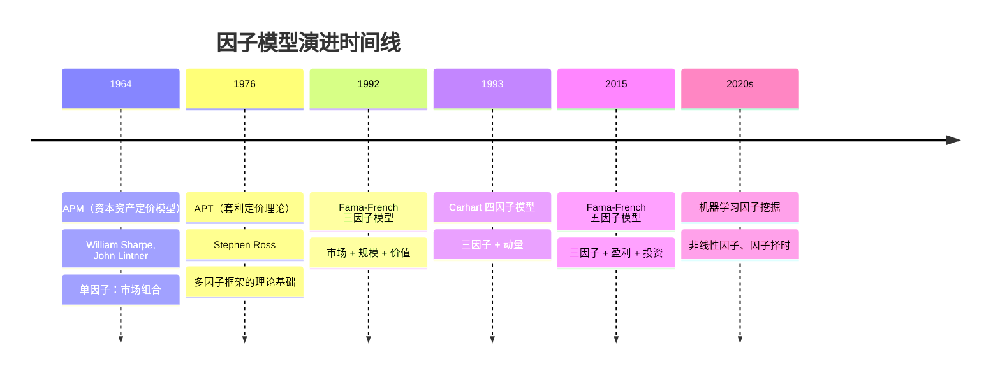
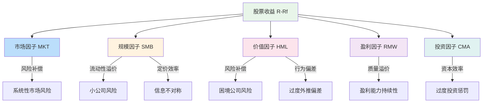

## 五、因子投资入门

因子投资（Factor Investing）是量化投资领域最重要的范式之一。它将驱动资产收益的来源拆解为若干个可度量、可解释的"因子"，然后围绕这些因子构建投资组合。2013年诺贝尔经济学奖得主尤金·法玛（Eugene F. Fama）和肯尼斯·弗伦奇（Kenneth R. French）提出的五因子模型，是这一领域的里程碑式成果，也是每一位量化投资者必须掌握的基础理论框架。

### 5.1 什么是因子

#### 5.1.1 因子的本质

在第二章中我们讲解了Alpha和Beta的概念。Beta衡量的是组合与市场的同步波动，而Alpha衡量的是超额收益。因子模型的思路更进一步：**将Beta本身也拆解为多个来源**，每个来源对应一个"因子"。

**因子的严格定义**：一个因子是一组资产的共同特征，能够系统性地解释这些资产收益的横截面差异。换言之，如果按某个特征（如市净率）将股票分成两组，两组的收益存在持久且显著的差异，那么这个特征就构成一个候选因子。

因子必须满足两个条件：

1. **有经济学逻辑**：能从风险补偿或行为偏差的角度给出合理解释
2. **在统计上显著**：收益差异不能是随机噪声，必须经过严格检验

#### 5.1.2 因子投资 vs 传统投资

| 维度 | 传统投资 | 因子投资 |
|------|----------|----------|
| 选股逻辑 | 基于个股基本面分析 | 基于因子暴露的系统性筛选 |
| 分散化 | 持仓集中，依赖个股判断 | 高度分散，依赖因子组合 |
| 可复制性 | 依赖基金经理个人能力 | 规则明确，可程序化执行 |
| 成本 | 研究团队成本高 | 可通过ETF/指数基金低成本实现 |
| 归因 | 难以解释为何赚钱/亏钱 | 收益可归因到具体因子 |
| 容量 | 受限于个股流动性 | 因子策略容量通常更大 |

### 5.2 因子模型的演进历史

因子投资不是一夜之间出现的，它经历了几十年的理论迭代。



#### 5.2.1 CAPM：单因子时代

1964年，威廉·夏普提出资本资产定价模型（CAPM），认为所有资产的预期收益只由一个因子决定——市场风险（Beta）：

$$E(R_i) = R_f + \beta_i \times (E(R_m) - R_f)$$

其中 $R_f$ 是无风险利率，$E(R_m) - R_f$ 是市场风险溢价。

CAPM的局限很快暴露：大量实证研究发现，小盘股、低估值股票的收益系统性地高于CAPM的预测。这意味着市场Beta不足以解释全部收益差异，需要更多因子。

#### 5.2.2 三因子模型：规模与价值的发现

1992年，法玛和弗伦奇发表了划时代的论文《The Cross-Section of Expected Stock Returns》，提出了三因子模型：

$$R_i - R_f = \alpha_i + \beta_i(R_m - R_f) + s_i \cdot SMB + h_i \cdot HML + \epsilon_i$$

这个模型加入两个新因子：
- **SMB**（Small Minus Big）：小市值股票相对大市值股票的超额收益
- **HML**（High Minus Low）：高市净率（价值股）相对低市净率（成长股）的超额收益

三因子模型解释了CAPM无法解释的"小盘效应"和"价值效应"，横截面回归的R²从CAPM的约70%提升到约90%。

#### 5.2.3 四因子模型：动量的加入

1993年，马克·卡哈特（Mark Carhart）在三因子基础上增加了动量因子（MOM），形成四因子模型。动量因子捕捉的是"过去赢家继续赢、过去输家继续输"的市场惯性现象，由Jegadeesh和Titman（1993）首先系统性记录。

#### 5.2.4 五因子模型：盈利与投资的发现

2015年，法玛和弗伦奇在顶级期刊《Journal of Financial Economics》发表了五因子模型论文。他们发现，三因子模型仍然无法解释两类股票的超额收益：

1. **高盈利能力的公司**收益高于低盈利能力的公司
2. **保守投资的公司**收益高于激进扩张的公司

这催生了两个新因子——RMW和CMA。

### 5.3 五因子模型详解

五因子模型的完整公式：

$$R_i - R_f = \alpha_i + \beta_i(R_m - R_f) + s_i \cdot SMB + h_i \cdot HML + r_i \cdot RMW + c_i \cdot CMA + \epsilon_i$$

下面逐一解析每个因子。

#### 5.3.1 市场因子（MKT = R_m - R_f）

**含义**：市场组合相对于无风险资产的超额收益，衡量承担系统性市场风险的补偿。

**经济学逻辑**：股票比债券风险更高，投资者要求更高的预期收益作为补偿。这是最基本的"风险-收益"对价关系。

**构造方法**：
- 使用全市场加权指数的收益率减去无风险利率
- 美国：CRSP全市场指数 - 国库券利率
- A股：沪深300全收益指数 - 一年期定期存款利率
- 港股：恒生指数 - HIBOR

**历史数据**：美国市场1926-2023年，市场风险溢价年化约7-8%，但存在巨大的年度波动（最差年份-40%以上）。

**A股特征**：A股市场因子波动远大于成熟市场。2005-2024年，沪深300年化波动率约25%，而标普500约15%。这意味着在A股做因子投资，必须更加重视风险管理。

#### 5.3.2 规模因子（SMB = Small Minus Big）

**含义**：小市值股票组合相对于大市值股票组合的收益差异。

**经济学逻辑**：
- **风险补偿说**：小公司流动性差、经营风险高、信息不透明，投资者要求更高的风险补偿
- **行为偏差说**：机构投资者受持仓限制偏好大盘股，小盘股定价效率低，存在系统性低估

**构造方法**：
1. 每年6月底，按市值中位数将全市场股票分为Small和Big两组
2. 每组再按B/M（账面市值比）、OP（盈利能力）、Inv（投资率）各分为三组，共6个小组
3. SMB = 三个Small小组平均收益 - 三个Big小组平均收益
4. 这种构造方式控制了价值、盈利、投资因子的干扰

**历史表现**：

| 市场 | 时期 | SMB年化收益 | t统计量 | 显著性 |
|------|------|-------------|---------|--------|
| 美国 | 1963-2023 | 约2.5% | 约2.0 | 边缘显著 |
| 日本 | 1982-2023 | 约3.0% | 约1.8 | 边缘显著 |
| 欧洲 | 1982-2023 | 约2.0% | 约1.5 | 不显著 |
| A股 | 2000-2024 | 约8-12% | >3.0 | 高度显著 |

**A股特殊性**：A股的规模效应远强于全球其他市场。原因包括：散户主导导致小盘股定价效率低、壳资源价值、游资偏好小盘股炒作。但需注意，随着注册制全面推行和机构化加速，A股规模效应正在逐步衰减。

#### 5.3.3 价值因子（HML = High Minus Low）

**含义**：高账面市值比（B/M）股票相对于低B/M股票的收益差异。高B/M代表价值股（股价相对于账面价值偏低），低B/M代表成长股。

**经济学逻辑**：
- **风险补偿说（Fama-French）**：价值股通常是陷入困境的公司，经营风险更高，投资者要求更高的风险溢价
- **行为偏差说（Lakonishok等）**：投资者过度外推成长股的未来业绩，导致成长股定价过高、价值股定价过低，最终均值回归

**构造方法**：
1. 每年6月底，计算所有股票的B/M = 账面价值 / 总市值
2. 按B/M的30%和70%分位数分为High（价值）、Neutral、Low（成长）三组
3. HML = High组平均收益 - Low组平均收益

**替代指标**：除了B/M，常用的价值代理指标还有：
- **EP（盈利收益率）** = 净利润 / 市值，即PE的倒数
- **CF/P（现金流收益率）** = 经营现金流 / 市值
- **DP（股息率）** = 每股股息 / 股价
- **SP（销售额市值比）** = 营收 / 市值

**全球价值因子的困境**：2007-2020年，全球价值因子经历了历史性的回撤，累计跑输成长股超过50%。主要原因是科技巨头的崛起扭曲了传统估值框架，以及低利率环境降低了价值股的吸引力。2021年后价值因子有所回归，但争议持续存在。

**A股价值因子表现**：A股的价值因子表现弱于全球平均水平，且极不稳定。用EP（盈利收益率）代替B/M在A股效果更好，因为A股的账面价值受会计政策影响较大。

#### 5.3.4 盈利因子（RMW = Robust Minus Weak）

**含义**：高盈利能力公司相对于低盈利能力公司的收益差异。

**经济学逻辑**：
- **质量溢价**：高盈利能力的公司现金流稳定、抗风险能力强，在不确定时期更受投资者青睐
- **定价偏误**：市场对盈利能力的定价存在系统性低估，尤其是对持续高盈利能力的公司

**盈利因子的度量**：法玛-弗伦奇使用营业利润率（Operating Profitability）：

$$OP = \frac{营业收入 - 营业成本 - 销售费用 - 管理费用}{账面权益}$$

其他常用的盈利能力指标：

| 指标 | 公式 | 特点 |
|------|------|------|
| ROE | 净利润 / 股东权益 | 最常用，但受杠杆影响大 |
| ROA | 净利润 / 总资产 | 不受资本结构影响 |
| 毛利率 | (营收-营业成本) / 营收 | 衡量核心业务盈利能力 |
| FCF/Assets | 自由现金流 / 总资产 | 不受会计政策影响 |
| Novy-Marx GP/A | 毛利润 / 总资产 | 学术研究中表现最好的盈利因子 |

**构造方法**：
1. 每年6月底，按OP的30%和70%分位数分为Robust（强盈利）、Neutral、Weak（弱盈利）三组
2. RMW = Robust组平均收益 - Weak组平均收益

**历史表现**：

| 市场 | 时期 | RMW年化收益 | t统计量 |
|------|------|-------------|---------|
| 美国 | 1963-2023 | 约3.5% | 约3.5 |
| 全球 | 1990-2023 | 约2.8% | 约2.5 |
| A股 | 2005-2024 | 约5-8% | >2.5 |

盈利因子是近年来学术界和业界最关注的因子之一。AQR的Cliff Asness将"质量"（Quality）视为被严重低估的系统性风险溢价来源。

#### 5.3.5 投资因子（CMA = Conservative Minus Aggressive）

**含义**：保守投资公司相对于激进扩张公司的收益差异。

**经济学逻辑**：
- **资产增长效应**：大量资本支出和资产扩张的公司，往往高估了投资的未来回报，导致股价被高估
- **资源错配**：过度投资的公司可能在追逐热门赛道而非创造股东价值，保守投资的公司更注重资本效率
- **实物期权折损**：大规模投资消耗了公司的实物期权（灵活性），在不确定性高的环境中价值降低

**投资因子的度量**：

$$Inv = \frac{总资产_{t-1} - 总资产_{t-2}}{总资产_{t-2}}$$

即过去一年的总资产增长率。资产增长越快，投资越激进。

**构造方法**：
1. 每年6月底，按Inv的30%和70%分位数分为Conservative（保守）、Neutral、Aggressive（激进）三组
2. CMA = Conservative组平均收益 - Aggressive组平均收益

**Hou, Xue, Zhang（2015）的补充**：Hou等学者提出的q因子模型也包含了投资因子，但用的是权益发行和净股票发行来度量投资，两者的解释力有所不同。

**A股投资因子**：A股的投资因子表现非常强，年化溢价可达6-10%，t统计量通常超过3.0。这与A股特殊的融资环境有关——上市公司频繁增发、配股、发行可转债，激进融资扩张的公司往往稀释了老股东权益。

#### 5.3.6 五因子模型的联合解读



**关键发现**：

当五因子模型同时包含HML和RMW/CMA时，HML的解释力大幅下降。法玛和弗伦奇在2015年的论文中坦承：**价值因子可能是盈利因子和投资因子的代理变量**。也就是说，传统"价值股跑赢成长股"的规律，可能只是"高盈利、保守投资的公司跑赢低盈利、激进扩张的公司"的一个侧面。

这个发现引发了学界和业界的巨大争议，至今没有定论。

### 5.4 因子投资的实操框架

#### 5.4.1 因子投资的三种实现方式

**方式一：因子指数基金/ETF**

最简单的方式，购买跟踪因子指数的产品：

```text
美股因子ETF示例：
├── 规模因子：iShares Russell 2000 ETF (IWM)
├── 价值因子：Vanguard Value ETF (VTV)
├── 质量因子：iShares MSCI USA Quality Factor ETF (QUAL)
├── 动量因子：iShares MSCI USA Momentum Factor ETF (MTUM)
└── 多因子：Dimensional US Core Equity Market ETF (DFAU)

A股因子ETF示例：
├── 规模因子：华夏中证1000ETF (159845)
├── 价值因子：华泰柏瑞中证红利低波ETF (512890)
├── 质量因子：国泰中证质量成长ETF (159806)
└── 动量因子：暂无纯动量ETF，可用Smart Beta替代
```

**方式二：Smart Beta策略**

将因子倾斜嵌入传统的市值加权指数：

$$w_i = w_i^{cap} \times s_i$$

其中 $w_i^{cap}$ 是市值权重，$s_i$ 是因子得分的倾斜系数。因子得分越高，权重越大。

**方式三：自建因子组合**

完全自定义因子筛选和组合构建流程，灵活度最高但复杂度也最高。

#### 5.4.2 自建因子组合的完整流程

以Python为例，构建一个简化的多因子选股策略：

```python
import pandas as pd
import numpy as np

class MultiFactorStrategy:
    """
    五因子多策略选股框架
    
    核心逻辑：
    1. 计算每只股票在每个因子上的得分
    2. 加权合成综合得分
    3. 选择得分最高的股票构建组合
    """
    
    def __init__(self):
        # 因子权重配置（可根据回测结果调整）
        self.factor_weights = {
            'value': 0.20,    # 价值因子权重
            'size': 0.15,     # 规模因子权重
            'profitability': 0.25,  # 盈利因子权重（通常最高）
            'investment': 0.20,     # 投资因子权重
            'momentum': 0.20,       # 动量因子权重
        }
        
    def compute_value_score(self, stocks: pd.DataFrame) -> pd.Series:
        """
        价值因子得分：综合EP和BP
        
        EP（盈利收益率）= 净利润TTM / 总市值
        BP（账面市值比）= 股东权益 / 总市值
        """
        ep = stocks['net_profit_ttm'] / stocks['market_cap']
        bp = stocks['book_equity'] / stocks['market_cap']
        
        # 分别标准化后等权合成
        ep_rank = ep.rank(pct=True)
        bp_rank = bp.rank(pct=True)
        
        return 0.5 * ep_rank + 0.5 * bp_rank
    
    def compute_size_score(self, stocks: pd.DataFrame) -> pd.Series:
        """
        规模因子得分：市值越小得分越高
        """
        # 取负数后排名，市值越小排名越高
        return (-stocks['market_cap']).rank(pct=True)
    
    def compute_profitability_score(self, stocks: pd.DataFrame) -> pd.Series:
        """
        盈利因子得分：综合ROE和毛利率
        
        ROE = 净利润TTM / 股东权益
        GP/A = 毛利润TTM / 总资产
        """
        roe = stocks['net_profit_ttm'] / stocks['book_equity']
        gpa = stocks['gross_profit_ttm'] / stocks['total_assets']
        
        roe_rank = roe.rank(pct=True)
        gpa_rank = gpa.rank(pct=True)
        
        return 0.5 * roe_rank + 0.5 * gpa_rank
    
    def compute_investment_score(self, stocks: pd.DataFrame) -> pd.Series:
        """
        投资因子得分：资产增长率越低（保守）得分越高
        """
        asset_growth = (
            stocks['total_assets'] - stocks['total_assets_prev']
        ) / stocks['total_assets_prev']
        
        # 资产增长率越低越好
        return (-asset_growth).rank(pct=True)
    
    def compute_momentum_score(self, stocks: pd.DataFrame) -> pd.Series:
        """
        动量因子得分：过去12个月收益（剔除最近1个月）
        
        经典的12-1动量策略：用过去12个月（剔除最近1个月）
        的累计收益率作为动量信号
        """
        return stocks['return_12m_minus_1m'].rank(pct=True)
    
    def compute_composite_score(self, stocks: pd.DataFrame) -> pd.Series:
        """
        综合因子得分：加权合成
        """
        scores = {
            'value': self.compute_value_score(stocks),
            'size': self.compute_size_score(stocks),
            'profitability': self.compute_profitability_score(stocks),
            'investment': self.compute_investment_score(stocks),
            'momentum': self.compute_momentum_score(stocks),
        }
        
        composite = sum(
            scores[factor] * weight 
            for factor, weight in self.factor_weights.items()
        )
        
        return composite
    
    def select_portfolio(self, stocks: pd.DataFrame, 
                         top_n: int = 50) -> list:
        """
        选股：选择综合因子得分最高的top_n只股票
        
        参数：
            stocks: 包含所有因子原始数据的DataFrame
            top_n: 持仓股票数量
        
        返回：
            选中股票的代码列表
        """
        # 过滤掉不满足基本条件的股票
        valid = stocks[
            (stocks['market_cap'] > 0) &           # 市值为正
            (stocks['total_assets'] > 0) &          # 总资产为正
            (stocks['book_equity'] > 0) &           # 账面权益为正
            (~stocks['is_st']) &                    # 排除ST股
            (stocks['listing_days'] > 250)          # 上市满一年
        ].copy()
        
        # 计算综合因子得分
        valid['composite_score'] = self.compute_composite_score(valid)
        
        # 选择得分最高的top_n只
        selected = valid.nlargest(top_n, 'composite_score')
        
        return selected.index.tolist()


class FactorBacktester:
    """
    因子策略回测器
    
    功能：
    - 月度调仓回测
    - 因子IC（信息系数）计算
    - 分组回测（分5组或10组）
    - 多空组合收益计算
    """
    
    def __init__(self, price_data: pd.DataFrame, 
                 factor_data: pd.DataFrame):
        """
        参数：
            price_data: 日频价格数据，index为日期，columns为股票代码
            factor_data: 月频因子数据，MultiIndex(日期, 股票代码)
        """
        self.price_data = price_data
        self.factor_data = factor_data
        
    def compute_monthly_returns(self) -> pd.DataFrame:
        """计算月度收益率"""
        monthly = self.price_data.resample('ME').last()
        return monthly.pct_change()
    
    def compute_ic(self, factor_name: str) -> pd.Series:
        """
        计算因子IC（Information Coefficient）
        
        IC = 截面上因子值与下期收益的Rank相关系数
        
        IC > 0.03 且 IC均值稳定为正：因子有效
        IC_IR = IC均值/IC标准差 > 0.5：因子稳定性好
        """
        monthly_returns = self.compute_monthly_returns()
        ic_series = []
        
        for date in self.factor_data.index.get_level_values(0).unique():
            # 当期因子值
            factor_values = self.factor_data.loc[date, factor_name]
            
            # 下期收益
            next_date = monthly_returns.index[
                monthly_returns.index > date
            ]
            if len(next_date) == 0:
                continue
            next_returns = monthly_returns.loc[next_date[0]]
            
            # 取交集
            common = factor_values.index.intersection(
                next_returns.index
            )
            if len(common) < 30:
                continue
            
            # Spearman秩相关
            ic = factor_values[common].corr(
                next_returns[common], method='spearman'
            )
            ic_series.append({'date': date, 'ic': ic})
        
        ic_df = pd.DataFrame(ic_series).set_index('date')
        
        return ic_df['ic']
    
    def quantile_backtest(self, factor_name: str, 
                          n_groups: int = 5) -> pd.DataFrame:
        """
        分组回测：按因子值将股票分为n组，计算每组的等权收益
        
        返回：每组的累计收益曲线
        """
        monthly_returns = self.compute_monthly_returns()
        group_returns = {f'Q{i+1}': [] for i in range(n_groups)}
        
        for date in self.factor_data.index.get_level_values(0).unique():
            factor_values = self.factor_data.loc[date, factor_name]
            
            next_date = monthly_returns.index[
                monthly_returns.index > date
            ]
            if len(next_date) == 0:
                continue
            next_ret = monthly_returns.loc[next_date[0]]
            
            common = factor_values.index.intersection(
                next_ret.index
            )
            if len(common) < n_groups * 10:
                continue
            
            # 按因子值分组
            groups = pd.qcut(
                factor_values[common], n_groups, labels=False
            )
            
            for g in range(n_groups):
                mask = groups == g
                group_returns[f'Q{g+1}'].append({
                    'date': next_date[0],
                    'return': next_ret[common][mask].mean()
                })
        
        result = {}
        for group, data in group_returns.items():
            df = pd.DataFrame(data).set_index('date')
            result[group] = (1 + df['return']).cumprod()
        
        return pd.DataFrame(result)
```

#### 5.4.3 因子IC分析实战

因子IC（Information Coefficient）是评估因子有效性的核心指标：

```python
def analyze_factor_quality(ic_series: pd.Series) -> dict:
    """
    全面评估因子质量
    
    返回指标：
    - IC均值：因子预测方向
    - IC标准差：预测稳定性
    - IC_IR：信息比率（IC均值/IC标准差）
    - IC>0占比：因子正向预测的概率
    - IC绝对值>0.02占比：有效预测的比例
    """
    results = {
        'IC均值': ic_series.mean(),
        'IC标准差': ic_series.std(),
        'IC_IR': ic_series.mean() / ic_series.std(),
        'IC>0占比': (ic_series > 0).mean(),
        '|IC|>0.02占比': (ic_series.abs() > 0.02).mean(),
        'IC最大值': ic_series.max(),
        'IC最小值': ic_series.min(),
        'IC偏度': ic_series.skew(),
        'IC峰度': ic_series.kurtosis(),
    }
    
    # 因子评级
    ic_ir = results['IC_IR']
    if ic_ir > 0.5:
        results['评级'] = '优秀'
    elif ic_ir > 0.3:
        results['评级'] = '良好'
    elif ic_ir > 0.15:
        results['评级'] = '一般'
    else:
        results['评级'] = '较差'
    
    return results


# 输出示例
"""
因子质量分析报告
================
IC均值:        0.045
IC标准差:      0.082
IC_IR:         0.549  (优秀)
IC>0占比:      62.3%
|IC|>0.02占比: 78.1%
IC最大值:      0.213
IC最小值:      -0.156
IC偏度:        0.12   (近似对称)
IC峰度:        2.85   (近似正态)
评级:          优秀
"""
```

#### 5.4.4 因子间的相关性管理

多个因子组合时，需要关注因子间的相关性：

```python
def factor_correlation_analysis(factor_data: pd.DataFrame) -> pd.DataFrame:
    """
    分析因子间的截面相关性
    
    低相关因子组合效果更好：
    - 相关系数 < 0.3：可以放心组合
    - 相关系数 0.3-0.6：需要调整权重
    - 相关系数 > 0.6：考虑二选一
    """
    # 计算因子间的Rank相关系数
    factor_cols = ['value', 'size', 'profitability', 'investment', 'momentum']
    
    # 每个截面计算相关系数，取时间序列均值
    corr_list = []
    for date in factor_data.index.get_level_values(0).unique():
        cross_section = factor_data.loc[date, factor_cols]
        corr_matrix = cross_section.corr(method='spearman')
        corr_list.append(corr_matrix)
    
    avg_corr = pd.concat(corr_list).groupby(level=0).mean()
    
    return avg_corr
```

**经验数据**（基于A股2005-2024年回测）：

| 因子对 | 平均相关系数 | 组合建议 |
|--------|-------------|----------|
| 价值-规模 | 0.15 | 可放心组合 |
| 价值-盈利 | -0.25 | 天然对冲，组合效果好 |
| 价值-投资 | 0.35 | 适当降低价值权重 |
| 盈利-投资 | -0.10 | 可放心组合 |
| 盈利-动量 | 0.05 | 可放心组合 |
| 投资-动量 | -0.20 | 天然对冲，组合效果好 |
| 规模-动量 | -0.30 | 小盘股动量效应弱，需谨慎 |

### 5.5 因子投资的A股实战要点

#### 5.5.1 A股因子的独特性

A股市场的因子表现与全球市场有显著差异，直接照搬海外经验容易踩坑：

| 特征 | 美股 | A股 | 实操含义 |
|------|------|------|----------|
| 规模效应 | 弱/消失 | 强但衰减中 | 小盘因子可配但需控制风险 |
| 价值效应 | 弱 | 非常弱/不稳定 | 用EP替代BP，慎用纯价值 |
| 盈利效应 | 中等 | 强 | 盈利因子是A股最稳定的alpha来源 |
| 投资效应 | 中等 | 非常强 | A股融资扩张频繁，投资因子溢价高 |
| 动量效应 | 强 | 短期反转为主 | A股1-3个月存在反转效应，6-12个月动量弱 |
| 换手率 | 因子之一 | 反转因子 | 高换手率在A股反而是负面信号 |

#### 5.5.2 A股因子构建注意事项

```text
A股因子构建的10个实操要点：

1. 基准日选择：用6月底数据构建因子，避免使用未来信息
2. 财报滞后：4月底前用上年年报，5-8月用一季报/半年报
3. 排除ST和次新股：上市不满一年的股票因子值不稳定
4. 处理极端值：用MAD（中位数绝对偏差）法，比Winsorize更稳健
5. 中性化处理：对行业和市值做中性化，避免因子暴露集中
6. 频率选择：月度调仓是最佳平衡点（兼顾效果和交易成本）
7. 交易成本：A股印花税单边千分之一，佣金约万三
8. 滑点处理：小盘股滑点可达0.5-1%，必须在回测中扣除
9. 涨跌停处理：涨跌停时无法交易，回测中需标记
10. 停牌处理：停牌股票应从持仓中剔除，不可假设能成交
```

#### 5.5.3 行业中性化

在A股做因子投资，行业中性化是必不可少的步骤。不做中性化，你的"价值因子"可能只是"银行因子"，你的"盈利因子"可能只是"白酒因子"。

```python
def neutralize_factor(factor_values: pd.Series, 
                      industry_labels: pd.Series,
                      market_cap: pd.Series) -> pd.Series:
    """
    因子行业中性化 + 市值中性化
    
    方法：将因子值对行业哑变量和对数市值做截面回归，
    取残差作为中性化后的因子值
    
    这样可以确保因子收益不是由行业偏差或市值偏差驱动的
    """
    import statsmodels.api as sm
    
    # 行业哑变量
    industry_dummies = pd.get_dummies(industry_labels, drop_first=True)
    
    # 自变量：行业哑变量 + 对数市值
    X = pd.concat([industry_dummies, np.log(market_cap)], axis=1)
    X = sm.add_constant(X)
    
    # 截面回归，取残差
    model = sm.OLS(factor_values, X, missing='drop')
    result = model.fit()
    
    return result.resid
```

### 5.6 常见误区与纠正

#### 误区一：因子越多越好

**错误做法**：把能找到的因子全部加入模型，追求最高的回测收益。

**问题**：
- 因子过多导致过拟合，回测漂亮但实盘失效
- 因子间可能存在共线性，系数估计不稳定
- 维度灾难：样本量不足以支撑太多参数

**纠正方法**：
- 从3-5个经典因子开始，逐步验证新增因子的增量贡献
- 新因子必须有经济学逻辑，不能纯数据挖掘
- 使用样本外检验：用2020年之前的数据构建，2020年之后的数据验证
- 计算因子的t统计量，只有t>2.0的因子才考虑纳入

#### 误区二：忽视因子衰减

**错误做法**：回测2005-2015年的数据发现某因子效果好，就认为未来也会好。

**问题**：
- 因子被发现后会吸引大量资金追逐，溢价逐渐消失（"因子拥挤"）
- 市场结构变化可能导致因子失效

**纠正方法**：
- 持续监控因子IC的时间序列，IC持续下降说明因子在衰减
- 关注因子拥挤度指标（如因子估值分位数、因子换手率）
- 因子投资需要动态调整权重，而非一成不变

#### 误区三：把因子回测等同于实盘收益

**错误做法**：看到因子多空组合年化收益15%，就以为实盘能赚15%。

**问题**：
- 多空组合包含做空端，而A股做空成本高、限制多
- 回测通常不考虑交易成本、冲击成本、滑点
- 小盘股因子在实盘中的冲击成本远高于回测假设

**纠正方法**：
- 只做多头组合（Long-Only），关注多头端相对基准的超额收益
- 严格扣除交易成本：佣金+印花税+冲击成本
- 对小盘股因子，冲击成本按市值分档设置（微盘股1%，中盘股0.3%）

#### 误区四：忽视因子的经济周期敏感性

**错误做法**：用同样的因子权重穿越牛熊。

**问题**：
- 价值因子在经济复苏期表现好，但在衰退期和低利率期表现差
- 盈利因子在熊市中防御性好，但牛市中可能跑输
- 动量因子在趋势反转时会遭受重大回撤

**纠正方法**：
- 根据宏观环境调整因子权重（因子择时）
- 在组合中同时配置周期性因子和防御性因子
- 设置因子回撤阈值，超过阈值时自动降权

```python
def regime_based_factor_timing(macro_indicators: dict) -> dict:
    """
    基于宏观环境的因子权重调整
    
    输入宏观指标：
    - pmi: 制造业PMI（>50为扩张）
    - credit_impulse: 信贷脉冲（信用扩张速度）
    - yield_curve: 收益率曲线斜率（10Y-2Y）
    - vix: 波动率指数
    
    输出调整后的因子权重
    """
    weights = {
        'value': 0.20,
        'size': 0.15,
        'profitability': 0.25,
        'investment': 0.20,
        'momentum': 0.20,
    }
    
    # 经济扩张期：增加价值和规模因子
    if macro_indicators['pmi'] > 52 and macro_indicators['credit_impulse'] > 0:
        weights['value'] += 0.05
        weights['size'] += 0.05
        weights['profitability'] -= 0.05
        weights['momentum'] -= 0.05
    
    # 经济收缩期：增加盈利（质量）因子
    elif macro_indicators['pmi'] < 48:
        weights['profitability'] += 0.10
        weights['value'] -= 0.05
        weights['size'] -= 0.05
    
    # 高波动期：增加盈利因子，减少动量因子
    if macro_indicators['vix'] > 25:
        weights['profitability'] += 0.05
        weights['momentum'] -= 0.05
    
    # 收益率曲线倒挂：增加投资因子（保守投资偏好）
    if macro_indicators['yield_curve'] < 0:
        weights['investment'] += 0.05
        weights['size'] -= 0.05
    
    return weights
```

### 5.7 进阶：因子投资的前沿发展

#### 5.7.1 机器学习因子挖掘

传统因子研究依赖人类先验知识提出假设，而机器学习方法可以从海量数据中自动发现因子：

```python
from sklearn.ensemble import GradientBoostingRegressor
from sklearn.model_selection import TimeSeriesSplit

class MLFactorMiner:
    """
    使用机器学习挖掘非线性因子
    
    核心思路：
    1. 用大量原始特征（财务指标、技术指标、另类数据）
    2. 训练GBDT模型预测下期收益
    3. 从模型中提取特征重要性，发现新因子
    4. 用SHAP值解释因子的经济学含义
    """
    
    def __init__(self):
        self.model = GradientBoostingRegressor(
            n_estimators=500,
            max_depth=4,
            learning_rate=0.05,
            subsample=0.8,
            min_samples_leaf=50,  # 避免过拟合
        )
        
    def extract_factor_importance(self, X, y):
        """
        提取因子重要性并排序
        """
        # 时间序列交叉验证
        tscv = TimeSeriesSplit(n_splits=5)
        
        importance_list = []
        for train_idx, test_idx in tscv.split(X):
            X_train, X_test = X.iloc[train_idx], X.iloc[test_idx]
            y_train, y_test = y.iloc[train_idx], y.iloc[test_idx]
            
            self.model.fit(X_train, y_train)
            importance_list.append(
                pd.Series(
                    self.model.feature_importances_,
                    index=X.columns
                )
            )
        
        # 取平均重要性
        avg_importance = pd.concat(
            importance_list, axis=1
        ).mean(axis=1).sort_values(ascending=False)
        
        return avg_importance
```

**注意事项**：
- 机器学习因子容易过拟合，必须严格的样本外检验
- GBDT等树模型无法给出因子方向（正/负），需要配合SHAP分析
- 黑箱因子缺乏经济学解释，实盘中难以坚持

#### 5.7.2 因子择时的最新研究

因子择时（Factor Timing）试图预测哪个因子未来会表现好，是因子投资中最具挑战性的问题：

**有效的择时信号**：

| 信号类型 | 指标 | 效果 | 机理 |
|----------|------|------|------|
| 估值信号 | 因子多空组合的估值价差 | 中等 | 估值便宜的因子未来回报更高 |
| 拥挤度信号 | 因子暴露集中度 | 中等 | 过度拥挤的因子容易踩踏 |
| 动量信号 | 因子过去12个月收益 | 弱-中等 | 因子本身也有动量效应 |
| 宏观信号 | 经济周期指标 | 弱 | 不同因子在不同周期表现不同 |
| 情绪信号 | 投资者情绪指数 | 中等 | 情绪极端时反转概率大 |

#### 5.7.3 另类因子数据

除了传统的财务和交易数据，新的数据来源正在拓展因子投资的边界：

```text
另类因子数据来源：

1. 文本数据
   - 新闻情绪：NLP分析新闻报道的正面/负面情绪
   - 分析师报告：报告措辞变化的量化分析
   - 社交媒体：雪球/东财股吧的投资者情绪指标
   - 专利文本：技术实力和创新能力的代理指标

2. 卫星数据
   - 工厂热力图：预测制造业产出
   - 零售停车场：预测零售销售
   - 油罐浮顶阴影：预测原油库存
   - 农作物长势：预测农产品产量和价格

3. 交易数据
   - 高频订单簿：预测短期价格走势
   - 资金流向：北向资金/主力资金净流入
   - 融资融券数据：多空力量对比
   - 大宗交易：机构调仓信号

4. 网络数据
   - 供应链关系图：关联公司间的传导效应
   - 机构持仓网络：机构投资者的抱团行为
   - 董监高任职网络：关联公司的治理风险
```

### 5.8 本节要点总结

```text
核心要点回顾：

1. 因子是驱动资产收益差异的系统性来源，必须同时满足
   经济学逻辑和统计显著性两个条件

2. Fama-French五因子模型包含：市场（MKT）、规模（SMB）、
   价值（HML）、盈利（RMW）、投资（CMA）

3. 五因子模型的关键发现：当RMW和CMA加入后，HML的
   独立解释力大幅下降，价值因子可能是盈利和投资因子的代理

4. A股因子特征与全球市场有显著差异：
   - 规模效应强但衰减中
   - 价值效应非常弱，用EP替代BP
   - 盈利和投资因子是A股最稳定的alpha来源
   - A股以短期反转为主，而非动量

5. 因子投资实操核心：
   - 行业中性化是必须步骤
   - 严格扣除交易成本和冲击成本
   - 因子IC是评估因子有效性的核心指标
   - IC_IR > 0.3的因子值得纳入模型

6. 因子投资的常见陷阱：
   - 过拟合：因子越多不代表越好
   - 因子衰减：被发现的因子溢价会逐渐消失
   - 回测与实盘差异：交易成本和冲击成本不容忽视
   - 周期敏感性：不同因子在不同宏观环境下表现迥异
```
