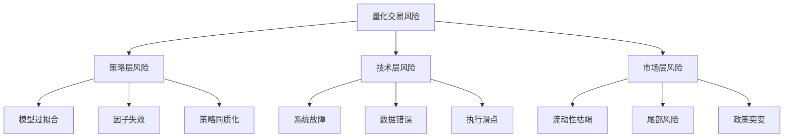
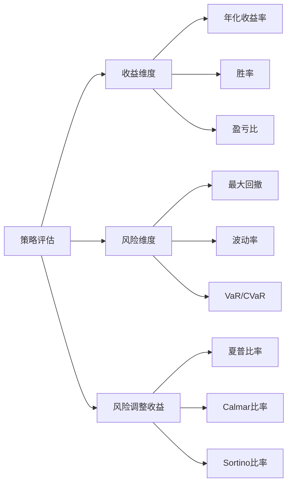

## 六、量化交易的风险认知

量化交易用数学模型和计算机程序替代人工判断，这在消除情绪干扰的同时，也引入了一类全新的、传统交易者难以直觉感知的风险。理解这些风险的本质，是构建任何量化策略之前的第一课——不是学会之后再风控，而是从一开始就带着风险意识去设计策略。

### 1. 量化交易风险的本质特征

#### 1.1 与主观交易的风险差异

主观交易者面临的核心风险是"人性弱点"——贪婪、恐惧、犹豫、过度自信。量化交易通过规则化消除了这些问题，却把风险转移到了更隐蔽的层面：

| 维度 | 主观交易的风险 | 量化交易的风险 |
|------|---------------|---------------|
| 决策来源 | 个人情绪与偏见 | 模型假设与数据质量 |
| 失效方式 | 亏损时人能感知并停止 | 模型可能无声失效，持续亏损 |
| 风险感知 | 直觉可感知（"感觉不对"） | 需要数据才能发现 |
| 极端事件 | 人可以灵活应对 | 程序按规则执行，可能放大损失 |
| 可解释性 | "我觉得要跌" | 需要追溯模型逻辑和数据 |
| 系统性 | 个人错误影响有限 | 代码Bug可能瞬间造成巨额损失 |

核心区别在于：主观交易的风险是**人的不确定性**，量化交易的风险是**系统的确定性**——系统一定会执行你写的代码，无论代码是否正确。

#### 1.2 量化风险的三个层次



这三个层次的风险相互叠加：市场发生极端事件（第三层）时，流动性下降（第三层），同质化策略同时止损（第一层），加剧市场波动，系统来不及处理大量订单（第二层），最终形成"风险螺旋"。2010年美股闪电崩盘、2015年A股股灾、2020年原油负价格事件，都是这种多层风险叠加的典型案例。

### 2. 策略层风险：模型本身的陷阱

#### 2.1 过拟合——量化交易的头号杀手

过拟合（Overfitting）是指策略在历史数据上表现优异，但在新数据上表现糟糕。这不是"优化过度"这么简单，而是一个深刻的统计学问题。

**过拟合的数学本质**

假设你有 N 个数据点，用 K 个参数的模型去拟合。当 K 相对于 N 过大时，模型学到的不是市场规律，而是数据中的噪声。统计学中的偏差-方差权衡（Bias-Variance Tradeoff）告诉我们：

- 低复杂度模型：偏差高（欠拟合），方差低（稳定但不准）
- 高复杂度模型：偏差低（拟合好），方差高（对新数据不稳定）

量化策略的参数越多、规则越复杂、回测区间越短，过拟合的概率就越高。

**过拟合的常见表现**

- 回测年化收益 50%+，实盘亏损或勉强跑赢无风险利率
- 策略对参数极度敏感——移动均线从 20 天改为 21 天，收益断崖下跌
- 最优参数恰好是整数或"巧合"数字（如刚好在某次大涨前一天发出信号）
- 加入更多过滤条件后回测曲线越来越"完美"，但实盘失效

**对抗过拟合的方法**

| 方法 | 原理 | 操作要点 |
|------|------|---------|
| 样本外测试 | 保留未参与优化的数据做验证 | 留出最近 20-30% 的数据不参与参数选择 |
| 交叉验证 | 多次划分训练/验证集 | Walk-forward analysis，滚动窗口验证 |
| 参数稳健性检验 | 测试参数变化是否影响结论 | 参数在 ±20% 范围内，策略收益不应剧变 |
| 正则化 | 限制模型复杂度 | 对参数数量施加惩罚（如 AIC/BIC 准则） |
| 多市场/多品种验证 | 跨市场检验策略普适性 | 在不同标的上测试，而非只在一个股票上优化 |
| 经济学直觉 | 策略必须有合理的经济学解释 | "为什么这个模式存在？谁在为此买单？" |

最后一个方法最关键：如果你无法用经济学逻辑解释策略为什么赚钱，它大概率是过拟合的产物。一个均线策略之所以可能有效，是因为趋势存在正反馈机制（动量效应有行为金融学解释）；但如果一个策略是"当某三个不相关指标同时满足奇怪条件时买入"，那大概率是在拟合噪声。

#### 2.2 因子失效——昨天的Alpha今天是噪声

量化策略的收益来源是"因子"（Factor）——某种能解释资产收益差异的系统性变量。但因子不是永恒的：

**因子失效的典型路径**

1. **发现期**：学术界或机构发现某个因子有超额收益（如小市值效应）
2. **公开期**：论文发表或策略被媒体曝光，大量资金涌入
3. **拥挤期**：因子变得拥挤，买入信号发出时价格已被推高
4. **衰减期**：超额收益逐渐消失，甚至出现反转
5. **反噬期**：因子策略集体踩踏，如2019年A股小市值因子大反转

**A股市场的因子生命周期**

以"市值因子"为例：2010-2016年，小市值股票长期跑赢大市值股票，年化超额收益可达 15-20%。但2017年以后，随着量化资金大量涌入小市值策略，加上注册制扩容稀释了壳资源价值，小市值因子出现持续回撤，部分量化产品因此大幅亏损。

这告诉我们：**没有永远有效的因子，只有处于不同生命周期的因子**。策略开发者必须持续监控因子的表现衰减，而不是假设过去有效的因子会一直有效。

#### 2.3 策略同质化——当所有人都在做同一件事

量化策略有一个悖论：有效的策略被越多的人使用，就越可能失效。当大量资金使用相似的策略时：

- **买入信号拥挤**：大家都在同一时点买入，推高价格，压缩利润空间
- **卖出信号踩踏**：止损信号触发时，所有人同时卖出，流动性瞬间枯竭
- **市场微观结构改变**：策略本身改变了它试图利用的市场特征

这在量化行业被称为"Alpha衰减"或"策略拥挤"（Strategy Crowding）。2020年9月美股科技股闪崩中，大量动量策略同时平仓，导致纳斯达克指数在三天内下跌超过10%。这不是基本面变化，而是策略同质化的连锁反应。

#### 2.4 前视偏差——用了未来才知道的信息

前视偏差（Look-Ahead Bias）是指在回测中使用了在实际交易时不可能获得的信息。这听起来低级，但在实践中极其常见：

**典型场景**

- 使用了未来财务数据：年报在次年4月才公布，但回测中在当年12月就使用了
- 使用了复权价格：使用了后来才确定的分红/送股数据
- 交易时点错误：在收盘价发出信号，却假设以收盘价成交（实际只能以收盘后才知的价格交易）
- 数据修正偏差：使用了经过事后修正的经济数据，而交易时只能获得初值

前视偏差的危险性在于：它让回测结果系统性地优于实盘，而且错误很隐蔽，不仔细检查根本发现不了。

### 3. 技术层风险：系统可靠性的隐忧

#### 3.1 数据风险——垃圾进，垃圾出

量化策略的全部决策都基于数据，数据质量问题直接决定策略质量：

**常见数据陷阱**

| 问题类型 | 具体表现 | 影响 |
|---------|---------|------|
| 幸存者偏差 | 数据库只包含当前存续的股票，退市股被移除 | 高估收益，低估风险 |
| 除权除息处理错误 | 复权因子计算不一致 | 产生虚假的价格跳变信号 |
| 数据缺失 | 某些日期数据为空或异常值 | 策略信号混乱 |
| 交易所数据差异 | 不同数据源的成交价/量不一致 | 回测结果不可复现 |
| 高频数据失真 | tick数据包含大量虚假报价和撤单 | 产生无效的微观信号 |

**幸存者偏差的量化影响**

这是一个值得特别强调的问题。假设你用当前沪深300成分股的历史数据回测过去10年的策略——你实际上在用"事后已知的好公司"的过去数据去测试，这系统性地排除了那些曾经是好公司但后来退市或大跌的股票。研究表明，幸存者偏差可以使回测年化收益虚高 2-5 个百分点。

解决方案：使用**包含退市股票的全历史数据库**（Point-in-Time数据库），确保每个时间点使用的股票池都是那个时点实际存在的。

#### 3.2 执行风险——从信号到成交的鸿沟

策略发出信号到实际成交之间，存在一系列损耗：

**滑点的构成**

1. **报价滑点**：实际成交价与信号价格的差异。流动性差的股票可能相差 0.5-2%
2. **冲击成本**：大额订单对市场价格的推动。资金量越大，冲击成本越高
3. **时间延迟**：信号产生到订单提交之间的延迟。网络延迟、系统处理都需要时间
4. **部分成交**：订单未能全部成交，导致实际仓位偏离目标仓位

**滑点的量化估算**

对于日频策略，一个保守但合理的假设是：每次交易的单边滑点约为成交金额的 0.1-0.3%（A股中小盘股可能更高）。这意味着一个年换手率 100 倍（每月买卖约4次）的策略，仅滑点成本就会消耗 20-60% 的理论收益。

```python
# 滑点对策略收益的影响估算
def slippage_impact(turnover_ratio, slippage_pct):
    """
    turnover_ratio: 年换手率（如100表示年交易100次）
    slippage_pct: 单边滑点百分比（如0.15表示0.15%）
    """
    annual_slippage_cost = turnover_ratio * slippage_pct / 100 * 2  # 双边
    return annual_slippage_cost

# 示例：年换手率50倍，单边滑点0.2%
cost = slippage_impact(50, 0.2)
print(f"年滑点成本: {cost:.1%}")  # 输出: 年滑点成本: 20.0%
```

#### 3.3 系统故障风险

量化交易依赖技术基础设施，任何环节故障都可能造成损失：

- **网络中断**：无法下单或无法接收行情，策略处于"盲飞"状态
- **服务器宕机**：策略停止运行，已持有的仓位无人管理
- **数据源异常**：行情数据中断或错误，策略基于错误数据做出决策
- **程序Bug**：逻辑错误导致疯狂下单、错误的仓位计算、无限循环等
- **交易所接口问题**：API限频、接口变更、认证失败

**2012年骑士资本事件**是系统故障风险的经典教训：一个软件部署错误导致45分钟内产生超过4.6亿美元的交易亏损，公司直接濒临破产。起因仅仅是一个旧的交易模块没有被正确关闭，新代码与旧代码冲突，导致疯狂发送异常订单。

### 4. 市场层风险：不可控的外部冲击

#### 4.1 流动性风险

流动性是量化交易最容易被低估的风险。策略回测时假设"想买就能买，想卖就能卖"，但实际市场远非如此。

**流动性风险的三种形态**

1. **日常流动性不足**：小盘股日均成交额低，大额订单需要分多天完成，信号时效性大打折扣
2. **流动性突然枯竭**：极端行情下，买盘消失，卖单只能以远低于预期的价格成交
3. **流动性虚假繁荣**：平时流动性很好，但危机时刻流动性瞬间消失——正是你最需要流动性的时候，它反而不在

**流动性与策略容量**

每个策略都有"容量上限"——能容纳的最大资金量。超过这个上限，策略的交易行为本身就会成为影响市场价格的主要因素，收益会被冲击成本吞噬。

一般来说：
- 高频策略：容量几百万到几千万（依赖微观结构）
- 日频策略：容量几千万到几亿（取决于换手率和标的流动性）
- 周频/月频策略：容量几亿到几十亿（换手低，冲击小）

#### 4.2 尾部风险——黑天鹅事件

正态分布假设是许多量化模型的基础，但金融市场收益分布具有"肥尾"（Fat Tail）特征——极端事件发生的概率远高于正态分布的预测。

**真实数据对比**

| 事件 | 正态分布预测概率 | 实际发生概率 |
|------|----------------|-------------|
| 单日跌幅超 4%（A股） | 约 0.01%（百年一遇） | 实际每1-2年发生一次 |
| 单日跌幅超 7%（A股） | 约 0.0001%（几乎不可能） | 2015年7月发生多次 |
| 连续3天跌幅超10% | 统计上不可能 | 2020年3月美股实际发生 |

这意味着基于正态分布计算的风险指标（如传统VaR）会系统性地低估极端风险。一个VaR显示"99%置信度下最大单日亏损2%"的策略，在现实中可能遇到5%甚至10%的单日亏损。

**量化策略在尾部风险中的脆弱性**

尾部风险对量化策略的打击尤为致命，原因有三：

1. **止损策略的正反馈效应**：当大量量化策略同时触及止损线，集体卖出加剧下跌，形成"下跌→止损→继续下跌"的恶性循环
2. **相关性突变**：正常市场中不相关的资产在危机时刻相关性趋近于1，分散化失效
3. **保证金追缴**：使用杠杆的策略面临强制平仓，可能在最低点被迫卖出

#### 4.3 政策与监管风险

政策变化是量化策略难以建模的外部冲击，尤其在中国A股市场：

- **交易规则变更**：如T+0改T+1、涨跌停板调整、融券规则变化，直接使策略失效
- **IPO政策变化**：注册制改革改变了壳资源价值，影响小市值策略
- **量化限制政策**：2023年证监会对程序化交易的报备要求、对高频交易的额外监管
- **行业政策冲击**：教育双减、互联网反垄断等政策使相关行业股票剧烈波动

这些风险无法通过历史数据建模预测，只能通过仓位管理和风控框架来应对。

### 5. 风险度量：用数字量化风险

理解风险之后，需要用量化指标来度量风险，这是风险管理的基础。

#### 5.1 核心风险指标

**最大回撤（Maximum Drawdown, MDD）**

最大回撤衡量从最高点到最低点的最大跌幅，是最直观的风险指标：

```python
import numpy as np

def max_drawdown(equity_curve):
    """计算最大回撤"""
    peak = np.maximum.accumulate(equity_curve)
    drawdown = (equity_curve - peak) / peak
    return drawdown.min()  # 返回负数，如 -0.25 表示 25% 回撤
```

最大回撤的局限性在于它是事后指标——只能告诉你过去发生了什么，不能预测未来。但它仍然是最重要的风险约束：如果一个策略历史最大回撤30%，你必须做好承受40-50%回撤的心理准备，因为未来可能比历史更糟。

**在险价值（Value at Risk, VaR）**

VaR回答一个简单问题："在给定置信水平下，未来N天的最大损失是多少？"

例如，95% 的日VaR为 1.5%，意味着：在正常市场条件下，有 95% 的把握明天亏损不超过 1.5%；但有 5% 的概率亏损会超过这个数字。

VaR的计算方法主要有三种：

| 方法 | 原理 | 优点 | 缺点 |
|------|------|------|------|
| 历史模拟法 | 用历史收益率分布直接估计 | 不需要分布假设 | 依赖历史数据长度 |
| 参数法 | 假设正态分布，用均值和方差计算 | 计算简单快速 | 正态假设不成立时失效 |
| 蒙特卡洛法 | 模拟大量随机路径 | 灵活，可处理复杂情况 | 计算量大，模型风险 |

**条件在险价值（CVaR / Expected Shortfall）**

VaR只告诉你"最坏情况的门槛"，CVaR告诉你"超过门槛后的平均损失"。例如，95% CVaR为 2.5%，意味着当损失超过VaR门槛时，平均亏损为 2.5%。CVaR比VaR更能反映尾部风险的严重程度。

**夏普比率（Sharpe Ratio）的风险含义**

夏普比率 = (策略收益 - 无风险利率) / 收益标准差

它衡量的是每承担一单位风险获得的超额收益。夏普比率 > 2 的策略非常优秀，> 3 的策略极其罕见（往往意味着过拟合或策略容量极小）。如果回测中夏普比率 > 5，大概率是过拟合。

**Calmar比率**

Calmar比率 = 年化收益 / 最大回撤

它直接回答"承担的最大亏损换来了多少收益"。Calmar比率 > 1 表示收益可以覆盖最大回撤，> 2 表示策略相当优秀。

#### 5.2 风险指标的综合运用

单一指标无法全面刻画风险，需要多维度综合评估：



**Sortino比率**是夏普比率的改进版——分母只计算下行波动率（亏损的标准差），而非全部波动率。这更合理，因为投资者只关心亏损风险，不关心"涨太多"的风险。

### 6. 经典风险事件复盘

#### 6.1 2015年A股股灾中的量化风险

2015年6-8月的A股股灾是量化交易风险的集中暴露：

- **流动性枯竭**：千股跌停、千股停牌，量化策略无法执行止损
- **杠杆爆仓**：场外配资和融资盘被强制平仓，加剧下跌
- **策略同质化踩踏**：大量趋同的量化策略同时发出卖出信号
- **流动性幻觉**：之前日均成交万亿的市场，在关键时刻流动性消失

教训：流动性是"晴天借伞、雨天收伞"的。策略必须在回测中模拟流动性枯竭场景，而非假设永远有足够的对手盘。

#### 6.2 2020年"原油宝"事件

2020年4月WTI原油期货价格跌至负值（-37.63美元/桶），持有原油相关产品的投资者遭受远超本金的损失。这对量化交易的启示是：

- **尾部风险比你想象的更极端**：教科书说商品价格不低于零，现实告诉你它可以为负
- **模型假设可能失效**：任何基于"价格不会为负"假设的模型在这一天全部崩溃
- **交割机制风险**：不了解标的物的交割规则可能导致灾难性后果

#### 6.3 2023年A股量化监管风暴

2023年A股市场出现"量化砸盘"争议，监管层随后出台了一系列针对程序化交易的监管措施：

- 要求程序化交易者报备
- 对高频交易加收流量费
- 限制融券T+0策略

这提醒量化交易者：**监管风险是不可建模的外部冲击**。一个策略在技术上可行、在回测中盈利，但可能因为监管政策变化而无法执行。在设计策略时，必须考虑策略的"监管稳健性"——过于依赖特定交易制度（如T+0、融券便利性）的策略，面临更高的监管风险。

### 7. 风险认知的常见误区

#### 误区一："回测收益高=策略好"

回测收益只是策略评估的一个维度，甚至不是最重要的维度。一个回测年化30%但最大回撤50%的策略，远不如回测年化15%但最大回撤10%的策略。后者意味着你可以在实际交易中保持理性，前者意味着你很可能在回撤时恐慌退出。

#### 误区二："分散投资=分散风险"

分散投资能分散**非系统性风险**（个股风险），但无法分散**系统性风险**（市场整体下跌）。更危险的是，危机时刻资产相关性趋近于1，你以为的分散投资实际上高度集中。

#### 误区三："止损可以控制风险"

止损是必要的，但它不是万能的。在跳空缺口、涨跌停板、流动性枯竭等场景下，止损可能无法执行或以远低于止损价的价格成交。止损不能消除风险，只能将风险从"无限"转化为"有限但可能很大"。

#### 误区四："模型越复杂越好"

复杂模型有更多参数，更容易过拟合。在量化领域，简单的策略往往比复杂的策略更稳健。一个只有两个参数的动量策略，可能比一个有20个参数的机器学习模型在实盘中表现更好，因为前者更不容易过拟合。

#### 误区五："历史会重演"

所有量化策略都基于一个隐含假设：历史数据中发现的模式在未来会持续存在。但市场在演化，参与者在学习，规则在改变。过去的规律可能是暂时的、偶然的、或者已经被套利消失了。保持对模型假设的持续检验，是量化交易者最重要的习惯。

#### 误区六："用更多数据就能解决问题"

大数据时代有一种迷信：数据越多，模型越好。但金融数据有其特殊性——信噪比极低（噪声远多于信号），非平稳性（数据生成过程随时间变化），样本有限（金融历史只有几十年）。盲目增加数据量或特征维度，反而可能引入更多噪声，加剧过拟合。

### 8. 建立正确的风险观

#### 8.1 风险不是敌人，是成本

量化交易中的风险不是要消灭的对象，而是需要管理的成本。就像开店要付租金一样，获取收益必须承担风险。关键问题不是"有没有风险"，而是"承担的风险是否获得了足够的补偿"。

#### 8.2 最重要的风险是你不知道的风险

纳西姆·塔勒布在《黑天鹅》中提出了"未知的未知"（Unknown Unknowns）概念——你不仅不知道未来会发生什么，你甚至不知道自己不知道什么。对于量化交易者，这意味着：

- 你的模型一定有盲区，但你不知道盲区在哪里
- 历史数据一定没有涵盖所有极端情况
- 一定会发生你完全没有预料到的事件

应对方式：**永远不要把全部资金投入单一策略，永远保留足够的现金缓冲，永远假设明天可能发生"不可能"的事。**

#### 8.3 风险管理的优先级

1. **生存第一**：先确保不会被淘汰出局，再考虑赚钱
2. **分散化**：策略分散、品种分散、时间分散
3. **杠杆控制**：杠杆放大收益的同时放大亏损，新手应避免使用杠杆
4. **持续监控**：建立自动化的风险监控系统，设置预警阈值
5. **定期审视**：定期检查策略假设是否仍然成立

量化交易是一场长跑，不是百米冲刺。在风险认知上建立正确的底层框架，比开发一个高收益策略更重要。活下来，才有机会赚钱。

> **本节小结**：量化交易的风险是多层次的——策略层（过拟合、因子失效、策略同质化）、技术层（数据质量、执行损耗、系统故障）、市场层（流动性、尾部风险、政策变化）。正确的风险认知不是消除风险，而是理解风险、度量风险、在可控范围内承担风险。回测收益高不等于策略好，模型复杂不等于策略强，历史有效不等于未来有效。始终以"生存第一"作为风控的最高原则。
