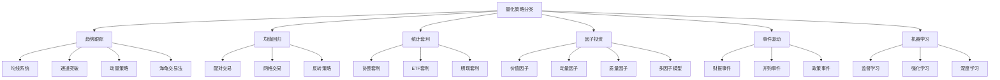
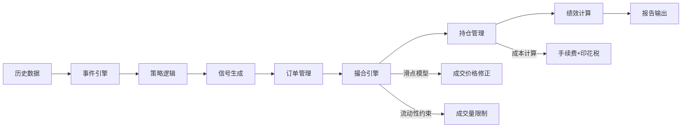
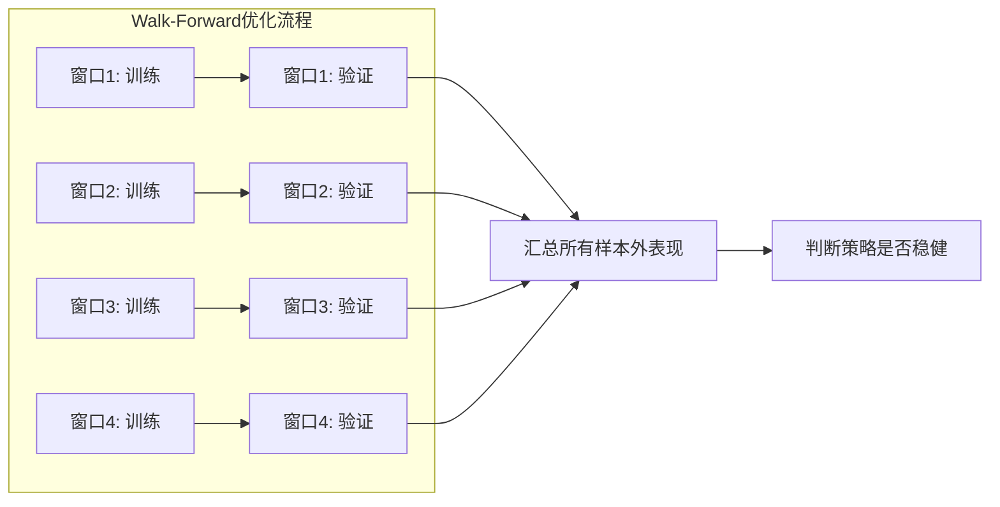
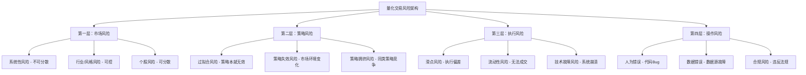

## 七、量化交易策略开发方法论

量化交易策略的开发是将投资理念转化为可执行、可验证、可迭代的系统工程。与主观交易依赖直觉和经验不同，量化策略开发遵循科学方法论——提出假设、收集数据、建立模型、验证假设、实盘检验、持续优化。本章系统阐述策略开发的完整生命周期，从策略构思到实盘部署，再到持续监控和迭代，为读者提供一套可直接落地的方法论框架。

### 7.1 策略分类体系

在动手开发策略之前，必须先理解量化策略的全景图。不同类型的策略在数据需求、开发难度、资金门槛、风险特征上差异巨大，选对方向比埋头苦干更重要。

#### 7.1.1 按持仓周期分类

| 类型 | 持仓时间 | 交易频率 | 数据需求 | 资金门槛 | 典型策略 |
|------|----------|----------|----------|----------|----------|
| 高频交易（HFT） | 毫秒~分钟 | 日均数千~数万笔 | Tick级/L2数据 | 极高（千万级） | 做市策略、统计套利 |
| 中高频交易 | 分钟~小时 | 日均数十~数百笔 | 分钟线数据 | 高（百万级） | 动量突破、均值回归 |
| 中频交易 | 天~周 | 周均数笔~数十笔 | 日线数据 | 中等（数十万） | 因子选股、事件驱动 |
| 低频交易 | 周~月 | 月均数笔 | 日线/周线数据 | 较低（十万级） | 基本面量化、宏观对冲 |

**选择建议：** 个人投资者从中频策略起步最为现实——数据获取成本低、技术门槛适中、资金要求可控。高频策略需要专用硬件（co-location）、极低延迟的交易通道和大量初始资金，不适合个人投资者。

#### 7.1.2 按策略逻辑分类

**趋势跟踪（Trend Following）**

核心思想：价格沿趋势运动的概率大于反转。当市场出现明确趋势时顺势而为，通过多次小亏损换取少数大盈利。

- 适用市场：商品期货、外汇、股指
- 典型信号：均线交叉、通道突破、动量指标
- 盈利特征：胜率偏低（30%-40%），盈亏比高（>2:1）
- 最大挑战：震荡市中反复止损，产生持续小额亏损

**均值回归（Mean Reversion）**

核心思想：价格偏离均值后有回归均值的倾向。在价格过度偏离时反向建仓，等待价格回归。

- 适用市场：股票配对交易、ETF套利、波动率交易
- 典型信号：布林带、RSI超买超卖、Z-Score偏离
- 盈利特征：胜率较高（60%-70%），盈亏比偏低（<1:1）
- 最大挑战：趋势市中逆势持仓造成大额亏损

**统计套利（Statistical Arbitrage）**

核心思想：利用资产间的统计关系（协整、相关性）进行配对或多资产交易，赚取价差收敛的收益。

- 适用市场：同行业股票配对、ETF与成分股、期现套利
- 典型方法：协整检验、PCA降维、机器学习分类
- 盈利特征：收益稳定但容量有限，夏普比率通常较高
- 最大挑战：关系断裂风险（如公司并购导致配对失效）

**因子投资（Factor Investing）**

核心思想：系统性地暴露于已知的风险因子（价值、动量、质量、规模等），获取因子风险溢价。

- 适用市场：股票市场（A股、美股、全球）
- 典型方法：多因子打分、回归排序、机器学习因子挖掘
- 盈利特征：长期有效但短期波动大，需要3-5年验证周期
- 最大挑战：因子拥挤导致溢价衰减，因子时序择时困难

**事件驱动（Event-Driven）**

核心思想：利用特定事件（财报发布、并购公告、政策变动）对价格的短期影响获取收益。

- 适用市场：股票、可转债、期权
- 典型事件：财报超预期、股东增持、分析师评级变动
- 盈利特征：事件窗口期收益明确，但事件频率有限
- 最大挑战：事件识别的及时性和数据获取的完整性

**机器学习策略（ML-Based）**

核心思想：利用机器学习模型从海量数据中提取非线性模式，预测价格方向或波动率。

- 适用市场：全市场、全品种
- 典型方法：随机森林、XGBoost、LSTM、Transformer
- 盈利特征：理论上限高，但过拟合风险大
- 最大挑战：特征工程、过拟合控制、模型可解释性



### 7.2 策略开发完整流程

量化交易策略的开发是一个闭环迭代过程，每个环节都必须严格把控质量。以下是完整的六步流程。

#### 7.2.1 第一步：策略构思（Idea Generation）

策略构思是量化交易的起点。好的策略想法通常来源于以下渠道：

**学术文献：** 金融学期刊（Journal of Finance、Review of Financial Studies、Journal of Financial Economics）中的实证研究。SSRN和NBER的Working Paper是获取最新研究成果的重要渠道。学术因子动物园（Factor Zoo）研究已识别出400+个因子，了解哪些因子真正有效至关重要。

**市场观察：** 对市场行为的长期观察和总结。例如观察到"月末效应"——机构在月末调仓导致特定股票出现可预测的价格模式；或观察到"分析师一致预期修正"与后续股价走势的相关性。

**数据挖掘：** 通过系统化的数据分析发现市场规律。使用特征重要性分析、互信息、Granger因果检验等方法从海量数据中筛选有预测力的变量。

**行业交流：** 量化社区（如QuantConnect、聚宽社区、米筐研究院）中的策略分享和讨论。参加量化比赛（如WorldQuant Alpha Competition）也是获取灵感的好途径。

**跨领域借鉴：** 从物理学（布朗运动模型）、统计学（贝叶斯推断）、计算机科学（强化学习）、行为经济学（前景理论）等领域借鉴方法论。

**策略构思的四个核心验证问题：**

1. **逻辑自洽性：** 这个策略的经济逻辑是什么？为什么会有超额收益？如果无法用一两句话说清楚策略的盈利逻辑，这个策略大概率是数据挖掘的产物。
2. **收益归因：** 超额收益的来源是什么？是承担了某种风险的风险补偿（如价值溢价），还是利用了市场的某种无效性（如信息不对称）？前者可能长期有效但波动大，后者可能随市场进化而衰减。
3. **持续性判断：** 这个逻辑在未来是否仍然成立？如果策略依赖于特定的市场结构（如T+1制度、涨跌停限制），需要评估这些结构是否会改变。
4. **拥挤度评估：** 有多少人在使用类似的策略？策略拥挤度越高，超额收益越容易被竞争侵蚀。可以通过观察策略在不同市值分组、不同时间段的表现来间接判断。

#### 7.2.2 第二步：数据准备（Data Preparation）

数据是量化交易的燃料，数据质量直接决定策略的上限。垃圾数据只能产出垃圾策略，无论模型多么精巧。

**数据类型全景：**

```text
量化交易数据体系
├── 行情数据（Market Data）
│   ├── 日线数据（OHLCV）
│   │   └── 开盘价、最高价、最低价、收盘价、成交量、成交额
│   ├── 分钟线数据
│   │   └── 1分钟、5分钟、15分钟、30分钟、60分钟K线
│   ├── Tick数据
│   │   └── 逐笔成交、逐笔委托（Level 1）
│   └── Level 2数据
│       └── 十档买卖盘口、逐笔委托明细（Level 2）
│
├── 基本面数据（Fundamental Data）
│   ├── 财务报表
│   │   └── 资产负债表、利润表、现金流量表（季频/年频）
│   ├── 估值指标
│   │   └── PE、PB、PS、EV/EBITDA、PEG
│   ├── 分析师数据
│   │   └── 一致预期、评级变动、盈利预测修正
│   └── 公司治理
│       └── 股东结构、管理层变动、股权激励
│
├── 宏观经济数据
│   ├── 货币政策：利率、MLF、LPR、存款准备金率
│   ├── 经济指标：GDP、PMI、CPI、PPI、社融、M2
│   └── 财政政策：专项债发行、减税降费
│
├── 另类数据（Alternative Data）
│   ├── 新闻与舆情：新闻情感分析、公告解读
│   ├── 社交媒体：股吧情绪、微博热度、知乎讨论
│   ├── 卫星数据：停车场车流、港口船舶、工厂烟囱
│   ├── 供应链数据：上下游订单、物流运输
│   └── 消费数据：信用卡消费、电商销售
│
└── 衍生数据（Derived Data）
    ├── 技术指标：MA、RSI、MACD、布林带、ATR
    ├── 因子数据：Fama-French因子、Barra风险因子
    └── 风险指标：VaR、CVaR、波动率、相关系数矩阵
```

**数据清洗六大要点：**

1. **缺失值处理：** 不同策略对缺失值的处理方式不同。趋势策略通常使用前向填充（forward fill），均值回归策略可能需要插值，而事件驱动策略需要严格删除缺失样本。关键是理解缺失的原因——停牌导致的缺失与数据源故障导致的缺失应区别对待。

2. **异常值处理：** 使用MAD（中位数绝对偏差）或Winsorization（缩尾处理）识别和处理异常值。例如将超过5倍MAD的值替换为边界值。不要轻易删除异常值——有些异常值本身就是交易信号（如暴涨暴跌事件）。

3. **复权处理：** A股必须使用复权价格。前复权（Forward Adjusted）适合从当前向历史回看，后复权（Backward Adjusted）适合从历史向当前推演。回测通常使用后复权价格，因为前复权会导致早期价格变为负数或极小值。

4. **幸存者偏差消除：** 必须包含已退市、被摘牌的股票数据。使用"全收益指数"而非"成分股指数"作为基准。国内常用的无偏差数据库包括CSMAR、Wind全A股票池。

5. **前视偏差防范：** 确保只使用在交易时点已经公开的数据。常见陷阱包括：使用年末财务报表数据但实际发布时间是次年4月、使用当日收盘价生成信号但实际只能在收盘后获取、使用分析师一致预期的"当前值"而非"历史快照"。

6. **数据对齐：** 不同频率的数据（日线、分钟线、基本面季度数据）需要正确对齐。基本面数据需要使用"发布日期"而非"报告期"进行对齐。期货主力合约需要进行连续合约拼接处理。

```python
# 数据清洗实战示例
import pandas as pd
import numpy as np

def clean_stock_data(df):
    """标准化的A股数据清洗流程"""
    # 1. 处理缺失值：前向填充，但最多填充5天
    df = df.fillna(method='ffill', limit=5)

    # 2. 异常值检测：使用MAD方法
    median = df['close'].median()
    mad = (df['close'] - median).abs().median()
    upper = median + 5 * 1.4826 * mad
    lower = median - 5 * 1.4826 * mad
    df['close'] = df['close'].clip(lower=lower, upper=upper)

    # 3. 标记涨跌停
    df['pct_change'] = df['close'].pct_change()
    df['limit_up'] = df['pct_change'] >= 0.095   # 涨停（考虑误差）
    df['limit_down'] = df['pct_change'] <= -0.095  # 跌停

    # 4. 标记停牌
    df['suspended'] = df['volume'] == 0

    # 5. 生成可用性标记：涨跌停和停牌时不可交易
    df['tradable'] = ~(df['limit_up'] | df['limit_down'] | df['suspended'])

    return df
```

**国内常用数据源对比：**

| 数据源 | 数据质量 | 覆盖范围 | 价格 | 适合场景 |
|--------|----------|----------|------|----------|
| Tushare | ★★★☆ | A股全量 | 免费/付费 | 个人研究、入门 |
| AKShare | ★★★☆ | A股+基金+期货 | 免费 | 个人研究、快速原型 |
| Wind | ★★★★★ | 全市场 | 约5万/年 | 机构级研究 |
| 通达信/同花顺 | ★★★★ | A股+港股 | 约1-3万/年 | 中小机构 |
| 聚宽/米筐 | ★★★★ | A股全量+因子 | 平台内免费 | 在线回测 |
| CSMAR | ★★★★★ | 学术级全量 | 学术授权 | 学术研究 |
| JQData | ★★★★ | A股+因子+宏观 | 按量计费 | API调用 |

#### 7.2.3 第三步：回测验证（Backtesting）

回测是用历史数据模拟策略执行过程，验证策略是否如预期般盈利。它是量化策略开发中最核心的环节，也是最容易犯错的环节。

**回测框架选择：**

| 框架 | 语言 | 优势 | 劣势 | 适合场景 |
|------|------|------|------|----------|
| Backtrader | Python | 灵活、社区活跃 | 性能一般 | 中低频策略原型 |
| Zipline-Reloaded | Python | Quantopian遗产、稳定 | 文档少 | 美股日频策略 |
| vnpy | Python | 国产、支持CTP | 学习曲线陡 | 期货CTA策略 |
| QuantConnect | Python/C# | 云端、数据全 | 需联网 | 多市场策略 |
| 聚宽（JoinQuant） | Python | 数据便捷、社区大 | 自定义受限 | 快速验证 |
| 自研框架 | Python/C++ | 完全可控 | 开发成本高 | 机构级系统 |

**回测框架的核心架构：**



**回测关键参数配置（以A股为例）：**

```python
backtest_config = {
    # 资金设置
    'initial_capital': 1_000_000,    # 初始资金100万
    'benchmark': '000300.SH',        # 沪深300指数

    # 交易成本
    'commission_rate': 0.0003,       # 佣金万三（单边）
    'stamp_tax': 0.001,              # 印花税千一（仅卖出）
    'slippage_model': 'fixed',       # 滑点模型：fixed/percentage/volume
    'slippage_value': 0.002,         # 固定滑点千二

    # 交易规则约束
    'min_lot_size': 100,             # A股最小交易单位100股
    'limit_up_down': True,           # 涨跌停限制
    't_plus_1': True,                # T+1限制
    'suspended_handling': 'skip',    # 停牌处理：skip/queue

    # 时间设置
    'start_date': '2015-01-05',
    'end_date': '2024-12-31',
    'in_sample': ('2015-01-05', '2021-12-31'),   # 样本内
    'out_sample': ('2022-01-04', '2024-12-31'),   # 样本外

    # 调仓设置
    'rebalance_frequency': 'monthly', # 调仓频率
    'max_holding': 20,               # 最大持仓数
    'min_trade_value': 10000,        # 最小交易金额
}
```

**回测报告的核心指标体系：**

| 指标 | 计算方式 | 含义 | 优秀标准 | 警戒标准 |
|------|----------|------|----------|----------|
| 年化收益率 | CAGR | 策略的年化复合回报 | >15% | <8% |
| 夏普比率 | (R-Rf)/σ | 每单位风险的超额收益 | >1.5 | <0.8 |
| 索提诺比率 | (R-Rf)/σ_d | 仅考虑下行风险的夏普 | >2.0 | <1.0 |
| 最大回撤 | Max Drawdown | 从峰值到谷底的最大跌幅 | <15% | >30% |
| 最大回撤持续期 | Max DD Duration | 从回撤到恢复新高的最长时间 | <6个月 | >18个月 |
| 卡玛比率 | CAGR/MaxDD | 收益与回撤的比值 | >1.5 | <0.5 |
| 胜率 | Win Rate | 盈利交易占总交易的比例 | 因策略而异 | — |
| 盈亏比 | Avg Win/Avg Loss | 平均盈利与平均亏损的比值 | >1.5 | <1.0 |
| 期望收益 | WR×AvgW - (1-WR)×AvgL | 每笔交易的期望盈利 | >0 | <0 |
| 换手率 | Annual Turnover | 年度换手倍数 | 因策略而异 | — |
| Alpha | Jensen's Alpha | 超额收益（CAPM调整后） | >5% | <0 |
| Beta | 市场敏感度 | 对市场指数的暴露程度 | 接近0（中性） | >1.0 |
| 信息比率 | Alpha/TE | 主动收益与跟踪误差的比值 | >1.0 | <0.5 |

#### 7.2.4 第四步：样本外测试与过拟合防控

样本外测试是检验策略是否过度拟合的关键防线。一个在回测中表现完美但在实盘中崩溃的策略，99%的原因是过拟合。

**过拟合的五种典型表现：**

1. **参数敏感性过高：** 稍微调整参数（如均线周期从20改为22），策略表现剧烈变化。健康的策略在参数小幅变化时应保持稳定。
2. **样本内样本外表现差距大：** 样本内夏普2.0，样本外夏普0.3，说明策略拟合了历史噪声而非真实规律。
3. **规则过多过细：** 策略包含大量if-else条件，每个条件都是针对历史特定场景的"补丁"。
4. **回测曲线过于平滑：** 真实的策略回测曲线应该有明显的回撤期，过于平滑反而可疑。
5. **只在特定市场环境下有效：** 策略只在牛市或只在震荡市中有效，缺乏普适性。

**过拟合防控的六种方法：**

**方法一：时间序列交叉验证**

将历史数据按时间划分为多个折（Fold），每次用前面的数据训练，后面的数据验证，滚动进行。

```python
def time_series_cv(data, n_splits=5):
    """时间序列交叉验证"""
    fold_size = len(data) // (n_splits + 1)
    results = []

    for i in range(n_splits):
        train_end = fold_size * (i + 2)
        test_start = train_end
        test_end = min(train_end + fold_size, len(data))

        train_data = data[:train_end]
        test_data = data[test_start:test_end]

        # 在train_data上训练策略
        # 在test_data上验证策略
        # 记录样本外表现

        results.append({
            'fold': i,
            'train_period': f"{data.index[0]} ~ {data.index[train_end-1]}",
            'test_period': f"{data.index[test_start]} ~ {data.index[test_end-1]}",
            'sharpe_oos': calculate_sharpe(test_data),  # 样本外夏普
        })

    return results
```

**方法二：参数稳健性检验**

在参数空间中进行网格搜索，观察策略在不同参数组合下的表现。如果只有一小块区域表现好，说明过拟合；如果大片区域都不错，说明策略逻辑本身有效。

**方法三：蒙特卡洛模拟**

通过随机打乱交易顺序、随机删除部分交易、添加随机噪声等方式，检验策略对数据扰动的敏感度。

**方法四：多元宇宙检验（Multiverse Analysis）**

对策略的每一个决策点（止损比例、持仓数量、调仓频率等）都设定多个合理的选择，穷举所有组合进行回测。如果大多数组合都表现不错，说明策略的底层逻辑是稳健的。

**方法五：Walk-Forward优化**

将数据切分为多个窗口，在每个窗口内用前面的数据优化参数、用后面的数据验证，模拟真实的"定期重新优化"过程。



**方法六：Deflated Sharpe Ratio**

当尝试了大量策略后，需要对最终选中的策略的夏普比率进行"通货膨胀调整"，扣除多次试验带来的虚假显著性。

#### 7.2.5 第五步：实盘模拟（Paper Trading）

回测通过后，在投入真金白银之前必须进行实盘模拟。模拟交易能暴露回测中无法发现的问题。

**模拟交易的关键检查清单：**

| 检查项 | 检查内容 | 常见问题 |
|--------|----------|----------|
| 信号生成延迟 | 策略信号从生成到下单的时间 | 延迟过长导致滑点增大 |
| 订单执行质量 | 实际成交价与信号价的偏差 | 滑点远超回测假设 |
| 数据完整性 | 实时数据是否有缺失或延迟 | 行情推送中断导致漏信号 |
| 交易规则合规 | 是否违反涨跌停、T+1等规则 | 模拟器未正确实现交易规则 |
| 异常处理 | 网络中断、程序崩溃时的行为 | 未设置断线重连机制 |
| 资金管理 | 仓位计算是否正确 | 未考虑最小交易单位 |
| 日志完整性 | 每笔交易是否都有完整记录 | 无法事后复盘分析 |

**模拟交易的最低验证周期：** 3个月。对于低频策略（月度调仓），至少需要6个月。关键不是验证策略能赚钱（回测已经验证过了），而是验证交易系统能否正确执行策略逻辑。

**模拟与回测的偏差分析：**

```python
def compare_paper_vs_backtest(paper_trades, backtest_trades):
    """对比模拟交易与回测结果的偏差"""
    # 1. 滑点分析
    paper_slippage = (paper_trades['fill_price'] - paper_trades['signal_price']).abs().mean()
    backtest_slippage = backtest_config['slippage_value']

    # 2. 信号遗漏率
    missed_signals = set(backtest_trades.index) - set(paper_trades.index)
    miss_rate = len(missed_signals) / len(backtest_trades)

    # 3. 收益偏差
    paper_return = calculate_return(paper_trades)
    backtest_return = calculate_return(backtest_trades)
    return_gap = backtest_return - paper_return

    report = {
        '实盘滑点': f"{paper_slippage:.4f}",
        '回测假设滑点': f"{backtest_slippage:.4f}",
        '信号遗漏率': f"{miss_rate:.2%}",
        '回测收益': f"{backtest_return:.2%}",
        '模拟收益': f"{paper_return:.2%}",
        '收益偏差': f"{return_gap:.2%}",
        '结论': '通过' if return_gap < 0.02 else '需要优化执行层',
    }
    return report
```

#### 7.2.6 第六步：小资金实盘与逐步放量

模拟验证通过后，用小资金开始真正的实盘交易。这是策略开发的最后一道检验关。

**资金阶梯部署方案：**

| 阶段 | 资金占比 | 持续时间 | 验证目标 |
|------|----------|----------|----------|
| 试探期 | 总资金的5%-10% | 1-3个月 | 验证实盘执行是否正常 |
| 观察期 | 总资金的10%-20% | 3-6个月 | 验证策略在真实市场中的表现 |
| 放量期 | 总资金的20%-50% | 6-12个月 | 验证资金容量和冲击成本 |
| 成熟期 | 总资金的50%-100% | 持续 | 稳定运行，定期复盘 |

**实盘与回测的五大差异：**

1. **执行延迟：** 信号生成到成交之间存在延迟，高频策略受影响最大。
2. **冲击成本：** 大额订单会推动市场价格，实际成交价比预期差。
3. **流动性约束：** 小盘股可能无法按预期价格成交足够数量。
4. **市场情绪影响：** 连续亏损时心理压力可能导致偏离策略规则。
5. **数据差异：** 实时数据可能存在延迟、缺失或错误，与回测用的清洗后数据不同。

**实盘监控告警清单：**

```python
alert_rules = {
    'daily_loss_limit': -0.03,       # 单日亏损超3%告警
    'weekly_loss_limit': -0.05,      # 周亏损超5%告警
    'max_drawdown_limit': -0.15,     # 最大回撤超15%降仓
    'position_concentration': 0.20,  # 单只持仓超20%告警
    'signal_deviation': 0.10,        # 实际持仓偏离信号超10%
    'execution_slippage': 0.005,     # 滑点超千分之五告警
    'missing_signals_count': 3,      # 连续3个信号未执行告警
    'system_heartbeat_interval': 60, # 系统心跳超60秒告警
}
```

### 7.3 回测方法论深度解析

回测看似简单——用历史数据跑一遍策略——但魔鬼藏在细节中。以下是最常见的五种回测陷阱，每一种都足以让一个看似优秀的策略在实盘中惨败。

#### 7.3.1 过度拟合（Overfitting）

**表现：** 回测曲线完美，夏普比率高达3.0以上，实盘表现却一塌糊涂。

**根本原因：** 参数过多，策略实质上是在拟合历史噪声而非捕捉真实规律。当自由参数的数量接近数据点的数量时，模型几乎可以完美拟合任何历史数据——包括随机噪声。

**量化诊断方法：**

- **参数/数据比：** 参数数量不应超过数据量（以交易次数计）的1/30。
- **样本内外差距：** 样本外夏普比率不应低于样本内的50%。
- **参数敏感度：** 每个参数在±20%范围内变化时，策略表现不应剧烈变化（夏普比率变化不超过30%）。

**解决方案：**
- 减少自由参数数量，优先使用有经济含义的参数值
- 增加样本外测试和交叉验证
- 使用贝叶斯方法引入先验知识，约束参数范围
- 坚持奥卡姆剃刀原则：能用简单模型解决的，不用复杂模型

#### 7.3.2 幸存者偏差（Survivorship Bias）

**表现：** 回测年化收益20%，实盘只有10%。

**根本原因：** 回测时只使用了当前还在交易的股票数据，忽略了已退市、被摘牌的股票。这些失败者本应在历史持仓中出现并造成亏损，但因为它们的数据不在数据库中，回测系统从未"买入"过它们。

**A股具体案例：** 2015-2024年间，A股有超过200只股票退市。如果回测使用当前股票池（约4800只），等于自动避开了这200多只退市股——在它们退市前，策略可能已经买入了它们。

**解决方案：** 使用包含已退市股票的"全收益"数据库。Wind、CSMAR、通联数据都提供包含退市股票的历史数据。

#### 7.3.3 前视偏差（Look-Ahead Bias）

**表现：** 回测收益虚高，策略在关键时点总能做出"完美"决策。

**根本原因：** 在历史回测中使用了在那个时点尚不可获得的信息。

**常见触发场景：**

| 场景 | 错误做法 | 正确做法 |
|------|----------|----------|
| 财务数据 | 使用报告期的数据 | 使用公告发布日后的数据 |
| 复权因子 | 使用全期复权因子 | 使用截至回测时点的复权因子 |
| 股票池 | 使用当期股票池 | 使用上期末的股票池 |
| 分析师预期 | 使用最新一致预期 | 使用截至交易日的一致预期快照 |
| 指数成分 | 使用当期成分股 | 使用当时成分股（指数公司公告后） |

#### 7.3.4 交易成本低估

**表现：** 回测年化收益18%，实盘只有12%，差额来自被低估的交易成本。

**完整的交易成本构成：**

```text
交易成本全景
├── 显性成本
│   ├── 佣金（万二~万三，双向）
│   ├── 印花税（千一，仅卖出）
│   ├── 过户费（十万分之一，双向）
│   └── 经手费（极小，可忽略）
│
└── 隐性成本
    ├── 滑点（Bid-Ask Spread的1/2）
    ├── 市场冲击（大额订单推动价格）
    ├── 时机成本（信号延迟导致的价格变动）
    └── 机会成本（流动性不足导致的未成交）
```

**保守成本假设建议：**

- A股日频策略：单边成本至少千分之五（含佣金、印花税、滑点）
- A股分钟频策略：单边成本至少千分之三
- 期货策略：单边成本至少万分之五
- 如果策略年换手率超过50倍，交易成本可能吃掉大部分利润

#### 7.3.5 流动性假设过于乐观

**表现：** 回测中能以理想价格买入大量小盘股，实盘中根本买不到。

**流动性约束的量化：** 单只股票的每日交易量不应超过该股票日均成交量的10%-20%。超过这个比例，市场冲击成本会急剧上升。

```python
def check_liquidity_constraint(order_value, stock_daily_volume_value, max_participation=0.15):
    """检查流动性约束"""
    max_order = stock_daily_volume_value * max_participation
    if order_value > max_order:
        return {
            'can_fill': False,
            'max_fill_ratio': max_order / order_value,
            'warning': f'订单金额{order_value/1e4:.0f}万超过流动性上限{max_order/1e4:.0f}万，'
                       f'最多只能成交{max_order/order_value:.0%}',
        }
    return {'can_fill': True, 'max_fill_ratio': 1.0}
```

### 7.4 策略优化方法论

策略优化是在不改变策略核心逻辑的前提下，通过调整参数和规则提升策略表现的过程。优化必须与过拟合防控紧密结合。

#### 7.4.1 参数优化的基本原则

**参数越少越好：** 每增加一个自由参数，过拟合的风险就增加一分。如果一个策略需要10个以上参数才能工作，很可能是在拟合噪声。

**参数要有经济含义：** 例如"均线周期设为20"可以解释为"一个月的交易日"，而"均线周期设为17.3"则没有任何经济含义，大概率是过拟合的结果。

**使用粗粒度网格：** 对于均线周期这样的参数，使用5的倍数（5、10、15、20、25、30）比尝试每个整数（1-30）更不容易过拟合。

#### 7.4.2 策略组合优化

单一策略的风险集中度高，通过组合多个低相关性策略可以显著改善风险收益特征。

**策略组合的核心逻辑：**

```python
import numpy as np

def optimize_strategy_weights(returns_matrix, method='risk_parity'):
    """
    优化多策略组合的权重
    returns_matrix: N×T矩阵，N个策略，T个时间点的收益率
    """
    n_strategies = returns_matrix.shape[0]
    cov_matrix = np.cov(returns_matrix)

    if method == 'risk_parity':
        # 风险平价：每个策略贡献相等的风险
        inv_vol = 1.0 / np.sqrt(np.diag(cov_matrix))
        weights = inv_vol / inv_vol.sum()

    elif method == 'min_variance':
        # 最小方差组合
        ones = np.ones(n_strategies)
        inv_cov = np.linalg.inv(cov_matrix)
        weights = inv_cov @ ones / (ones @ inv_cov @ ones)

    elif method == 'max_sharpe':
        # 最大夏普比率组合（需要预期收益率向量）
        raise NotImplementedError("需要提供预期收益率")

    return weights

# 示例：三个策略的风险平价组合
# 策略A（趋势跟踪）：年化12%，波动率15%
# 策略B（均值回归）：年化10%，波动率10%
# 策略C（因子投资）：年化14%，波动率18%
# 组合后：年化12%，波动率约8%，夏普比率约1.5
```

**策略相关性管理：** 组合中任意两个策略的相关系数应低于0.5，理想情况下低于0.3。高相关性的策略组合起不到分散风险的作用。

#### 7.4.3 机器学习在策略优化中的应用

机器学习可以用于因子挖掘、信号增强和组合优化，但必须严格控制过拟合。

**特征工程的关键原则：**

1. **特征要有经济逻辑：** 不要盲目把几百个技术指标扔进模型。
2. **特征需要正交化：** 高度相关的特征只保留一个。
3. **特征需要标准化：** Z-Score标准化确保不同量纲的特征可比。
4. **特征需要滞后处理：** 确保特征数据在信号生成时已经公开。

```python
# 因子挖掘的机器学习流程
from sklearn.ensemble import RandomForestClassifier
from sklearn.model_selection import TimeSeriesSplit

def ml_factor_mining(features_df, labels):
    """
    使用随机森林进行因子重要性分析
    features_df: 因子特征矩阵
    labels: 未来收益率分类标签（1=上涨, 0=下跌）
    """
    # 时间序列交叉验证
    tscv = TimeSeriesSplit(n_splits=5)
    importances_list = []

    for train_idx, test_idx in tscv.split(features_df):
        X_train = features_df.iloc[train_idx]
        y_train = labels.iloc[train_idx]
        X_test = features_df.iloc[test_idx]
        y_test = labels.iloc[test_idx]

        model = RandomForestClassifier(
            n_estimators=100,
            max_depth=5,           # 限制深度防过拟合
            min_samples_leaf=50,   # 叶节点最少样本
            random_state=42,
        )
        model.fit(X_train, y_train)

        # 记录特征重要性
        importances_list.append(model.feature_importances_)

        # 样本外准确率
        oos_accuracy = model.score(X_test, y_test)
        print(f"样本外准确率: {oos_accuracy:.2%}")

    # 平均特征重要性
    avg_importance = np.mean(importances_list, axis=0)
    feature_ranking = sorted(
        zip(features_df.columns, avg_importance),
        key=lambda x: x[1], reverse=True
    )
    return feature_ranking
```

### 7.5 风险管理体系

风险管理是量化交易的生命线。一个没有完善风控体系的量化策略，无论回测表现多好，都是一颗定时炸弹。

#### 7.5.1 四层风险架构



**第一层：市场风险控制**

市场风险是不可完全消除的系统性风险。控制手段包括：
- 行业分散：单一行业暴露不超过20%
- 市值分散：大小盘合理搭配
- Beta控制：组合Beta控制在目标范围内（如-0.2到0.3）
- 尾部风险对冲：使用期权或VIX期货对冲极端下行风险

**第二层：策略风险控制**

策略风险来自策略本身的缺陷或市场环境的变化。
- 策略多元化：运行3-5个低相关性策略
- 策略健康度监控：跟踪策略的滚动夏普比率，持续低于0.5时触发审查
- 策略容量管理：每个策略有明确的资金容量上限

**第三层：执行风险控制**

执行风险是策略信号到实际成交之间的偏差。
- 滑点监控：实时比较信号价格和成交价格
- 系统冗余：主备系统切换机制
- 网络监控：交易通道延迟实时监控

**第四层：操作风险控制**

操作风险来自人为错误和系统故障。
- 代码审查：所有策略代码必须经过至少一人审查
- 回归测试：每次代码修改后运行完整的回归测试
- 权限分离：策略开发和实盘部署由不同人员负责

#### 7.5.2 仓位管理模型详解

**固定比例法：** 最简单的方法，每只股票分配固定比例的仓位（如5%）。优点是简单易行，缺点是忽略了不同股票的风险差异。

**等波动率法：** 根据各资产的波动率反比例分配仓位，使每个资产对组合风险的贡献相等。

```python
def equal_volatility_weights(volatilities, target_vol=0.15):
    """
    等波动率仓位管理
    volatilities: 各资产的年化波动率列表
    target_vol: 目标组合波动率

    例：资产A波动率30%，资产B波动率15%，资产C波动率10%
    权重约为：A=17%, B=33%, C=50%
    """
    inv_vol = np.array([1.0 / v for v in volatilities])
    raw_weights = inv_vol / inv_vol.sum()

    # 调整到目标波动率
    port_vol = np.sqrt(np.sum((raw_weights * volatilities) ** 2))
    scale = target_vol / port_vol
    weights = raw_weights * scale

    return weights
```

**凯利公式法：** 根据胜率和赔率计算数学最优的仓位比例。凯利公式最大化长期资本增长率，但实际使用中通常取半凯利（Half-Kelly）以降低波动。

```python
def kelly_criterion(win_rate, win_loss_ratio, fraction=0.5):
    """
    凯利公式计算最优仓位
    win_rate: 胜率（如0.6表示60%）
    win_loss_ratio: 盈亏比（如1.5表示平均盈利是平均亏损的1.5倍）
    fraction: 凯利分数（0.5=半凯利，更保守）

    返回：建议仓位比例
    """
    kelly = (win_rate * win_loss_ratio - (1 - win_rate)) / win_loss_ratio
    kelly = max(0, kelly)  # 不允许负仓位
    return kelly * fraction

# 示例：胜率60%，盈亏比1.5:1
# 完全凯利 = 26.7%，半凯利 = 13.3%
```

**风险预算法：** 给每个策略或因子分配固定的风险预算（如5%的年化波动率），策略自行决定仓位大小来满足风险预算约束。

#### 7.5.3 止损策略体系

止损是风控的最后一道防线。不同类型的止损适用于不同的策略和市场环境。

| 止损类型 | 触发条件 | 执行方式 | 适用策略 | 优缺点 |
|----------|----------|----------|----------|--------|
| 固定止损 | 亏损达到预设比例（如5%） | 立即平仓 | 所有策略 | 简单明确，但可能在反弹前被止损 |
| 跟踪止损 | 从最高点回撤达到预设比例 | 立即平仓 | 趋势策略 | 保护利润，但可能过早退出趋势 |
| 波动率止损 | 价格突破N倍ATR或标准差 | 立即平仓 | 波动率策略 | 自适应市场波动，但需要参数调优 |
| 时间止损 | 持仓超过预设时间无盈利 | 评估后决定 | 事件驱动 | 释放资金，但可能错过延迟的行情 |
| 策略止损 | 策略信号反转 | 按信号平仓 | 所有策略 | 最符合策略逻辑，但依赖信号质量 |

**组合层面的硬性风控规则：**

```python
portfolio_risk_rules = {
    # 回撤控制
    'max_drawdown_warning': -0.10,     # 回撤10%：降低仓位30%
    'max_drawdown_critical': -0.15,    # 回撤15%：降低仓位50%
    'max_drawdown_halt': -0.20,        # 回撤20%：暂停策略，人工审查

    # 日亏损控制
    'daily_loss_limit': -0.03,         # 单日亏损3%：暂停新交易
    'daily_loss_halt': -0.05,          # 单日亏损5%：全部平仓

    # 集中度控制
    'max_single_stock': 0.10,          # 单只股票最大仓位10%
    'max_single_sector': 0.25,         # 单一行业最大暴露25%
    'max_single_strategy': 0.40,       # 单一策略最大资金40%

    # 相关性控制
    'max_pairwise_corr': 0.70,         # 组合内任意两资产相关系数上限
    'max_portfolio_beta': 0.30,        # 组合Beta绝对值上限

    # 换手率控制
    'max_daily_turnover': 0.30,        # 单日换手率上限30%
}
```

### 7.6 策略监控与迭代

策略上线只是开始，持续的监控和迭代才是量化交易的日常。

#### 7.6.1 策略健康度监控

**滚动绩效监控：** 不要只看策略的整体绩效，要监控滚动窗口（如60日、120日）的夏普比率、最大回撤等指标。当滚动指标持续恶化时，说明策略可能正在失效。

```python
def strategy_health_monitor(daily_returns, window=60):
    """策略健康度监控仪表板"""
    rolling_sharpe = (
        daily_returns.rolling(window).mean() /
        daily_returns.rolling(window).std()
    ) * np.sqrt(252)

    rolling_maxdd = daily_returns.rolling(window).apply(
        lambda x: (1 + x).cumprod().max() / (1 + x).cumprod().iloc[-1] - 1
    )

    health_status = {
        '滚动夏普_60日': rolling_sharpe.iloc[-1],
        '滚动夏普_120日': daily_returns.rolling(120).apply(
            lambda x: x.mean() / x.std() * np.sqrt(252)
        ).iloc[-1],
        '滚动最大回撤_60日': rolling_maxdd.iloc[-1],
        '信号状态': '健康' if rolling_sharpe.iloc[-1] > 0.5 else '警告',
        '建议操作': '继续运行' if rolling_sharpe.iloc[-1] > 0.5 else '降低仓位或暂停',
    }
    return health_status
```

**策略失效的早期信号：**

1. 滚动夏普比率持续低于0.5超过3个月
2. 最大回撤超过历史最大回撤的1.5倍
3. 策略与基准的相关性突然升高（说明策略变成了"昂贵的指数基金"）
4. 策略持仓集中度异常升高
5. 交易执行质量持续恶化（滑点增大、成交率下降）

#### 7.6.2 策略迭代的节奏

| 迭代类型 | 频率 | 内容 | 风险等级 |
|----------|------|------|----------|
| 日常监控 | 每日 | 检查系统运行、资金状态、异常交易 | 低 |
| 参数微调 | 每季度 | 基于最新数据重新优化参数 | 中 |
| 因子更新 | 每半年 | 更新因子库、剔除失效因子 | 中 |
| 逻辑重构 | 每年 | 审视策略核心逻辑是否仍然有效 | 高 |
| 策略替换 | 不定期 | 淘汰持续失效的策略，引入新策略 | 高 |

**迭代的关键原则：** 每次迭代只改一个变量，观察足够长的时间窗口后再做下一次调整。同时改多个变量会导致无法判断哪个改变带来了效果。

### 7.7 策略开发的常见误区

#### 误区一：追求高夏普比率

**真相：** 夏普比率超过3.0的策略几乎必然存在过拟合或数据问题。真实的优秀策略夏普比率通常在1.0-2.0之间。Renaissance Technologies旗下的Medallion基金年化收益约66%，夏普比率约6.0——但这是全球最顶尖的量化团队，使用了非公开数据和超算资源，不具有参考性。

#### 误区二：过度优化参数

**真相：** 如果你需要精确到小数点后两位的参数才能让策略工作，那这个策略大概率是过拟合的。好的策略在参数粗调（如均线周期取10/20/30/60）时就应该有不错的表现。

#### 误区三：只看收益率不看回撤

**真相：** 年化收益30%但最大回撤50%的策略，不如年化收益15%但最大回撤10%的策略。回撤不仅影响资金曲线，更影响交易者的心理状态——在大幅回撤时坚持执行策略需要极强的心理素质。

#### 误区四：忽略策略容量

**真相：** 一个在100万资金上表现优秀的策略，在1亿资金上可能完全失效。策略容量取决于市场的流动性深度和策略的换手频率。低换手率的大盘股策略容量大，高换手率的小盘股策略容量小。

#### 误区五：回测时间太短

**真相：** 只用最近3年数据回测，只覆盖了一种市场环境（如结构性牛市）。策略至少需要覆盖一个完整的牛熊周期（A股通常5-8年）才有说服力。极端行情（如2015年股灾、2020年疫情冲击）是检验策略抗风险能力的试金石。

#### 误区六：把回测当实盘

**真相：** 回测只是策略开发的第一步，不是终点。从回测到实盘之间还有模拟交易、小资金实盘、逐步放量等多个验证环节。跳过任何一步都可能付出真金白银的代价。

### 7.8 进阶：量化策略开发的工程化

对于个人量化交易者，一开始可以用Jupyter Notebook快速验证策略。但当策略进入实盘阶段，必须将代码工程化。

#### 7.8.1 策略代码的标准结构

```text
quant_strategy/
├── config/
│   ├── strategy_config.yaml    # 策略参数配置
│   └── risk_config.yaml        # 风控参数配置
├── data/
│   ├── data_loader.py          # 数据加载器
│   ├── data_cleaner.py         # 数据清洗
│   └── factor_engine.py        # 因子计算引擎
├── strategy/
│   ├── signal_generator.py     # 信号生成
│   ├── portfolio_optimizer.py  # 组合优化
│   └── order_manager.py        # 订单管理
├── execution/
│   ├── broker_api.py           # 券商API对接
│   ├── paper_trader.py         # 模拟交易
│   └── live_trader.py          # 实盘交易
├── risk/
│   ├── position_manager.py     # 仓位管理
│   ├── drawdown_monitor.py     # 回撤监控
│   └── alert_system.py         # 告警系统
├── backtest/
│   ├── backtest_engine.py      # 回测引擎
│   ├── performance.py          # 绩效计算
│   └── report_generator.py     # 报告生成
├── monitoring/
│   ├── health_check.py         # 健康检查
│   ├── logger.py               # 日志系统
│   └── dashboard.py            # 监控仪表板
└── tests/
    ├── test_strategy.py        # 策略逻辑测试
    ├── test_risk.py            # 风控逻辑测试
    └── test_execution.py       # 执行逻辑测试
```

#### 7.8.2 从个人交易到团队协作

当量化交易从个人爱好发展为团队协作时，需要引入以下工程实践：

- **版本控制：** 使用Git管理策略代码，每次修改都有记录
- **代码审查：** 策略代码必须经过至少一人审查才能上线
- **自动化测试：** 策略逻辑、风控规则、数据管道都需要自动化测试
- **CI/CD：** 代码提交后自动运行测试，测试通过后才能部署
- **监控告警：** 系统运行状态、策略绩效、异常事件都需要实时监控和告警

---

量化交易策略开发是一门将投资理念、数据科学和软件工程融为一体的技术。掌握本章的方法论，不代表能立即开发出盈利的策略——那还需要对市场的深刻理解、大量的实践积累和持续的学习迭代。但没有方法论的指导，量化交易就变成了赌博。方法论的价值在于：它帮助你系统地思考问题、有效地验证假设、可控地管理风险，让每一步都有据可依、有迹可循。
