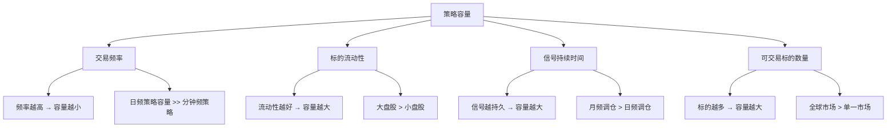
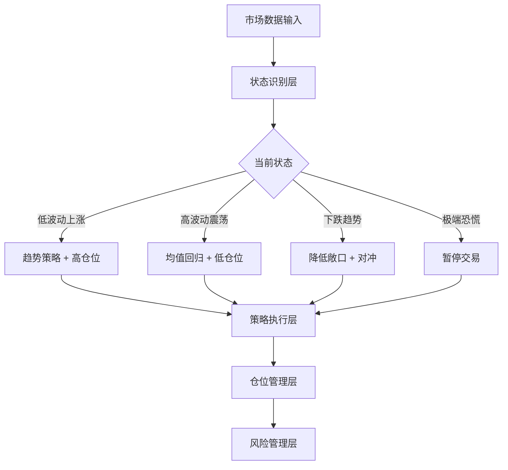
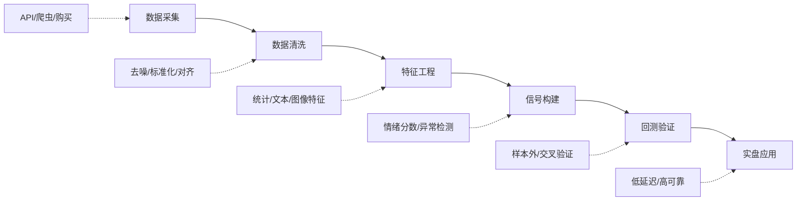
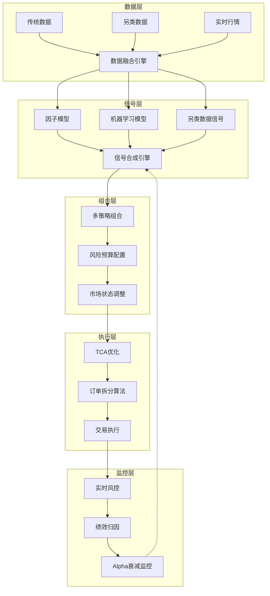

## 八、量化交易进阶概念

在掌握了量化交易的基础框架——核心概念、回测原理、策略分类、因子投资和策略开发方法论之后，你需要理解一系列进阶概念。这些概念决定了一个策略能否从"回测好看"走向"实盘盈利"，也决定了一个量化交易者能否从"入门"走向"专业"。

本节涵盖市场微观结构、Alpha衰减与策略容量、市场状态识别、多策略组合、另类数据、交易成本分析、高级风险模型和机器学习应用八大主题。每一个都是量化交易从理论走向实战的关键桥梁。

***

### 8.1 市场微观结构与订单簿动力学

#### 8.1.1 什么是市场微观结构

市场微观结构（Market Microstructure）研究的是价格形成的微观过程——交易是如何发生的，买卖订单是如何匹配的，信息是如何通过交易行为反映到价格中的。这是从"价格是什么"到"价格为什么是这样"的认知跃迁。

传统金融理论假设市场是无摩擦的：交易者可以随时以市场价买卖任意数量，没有交易成本，没有信息不对称。但真实市场远非如此。订单簿的深度、买卖价差的宽度、订单的执行顺序——这些微观层面的细节直接影响策略的盈亏。

#### 8.1.2 订单簿的基本结构

订单簿（Order Book）是市场交易的核心数据结构，记录了所有未成交的买卖订单：

```text
订单簿结构示意（以某股票为例）

卖方（Ask/Offer）          买方（Bid）
价格    数量    累计       累计    数量    价格
10.05   500    2800       ----    ----    ----
10.04   800    2300       ----    ----    ----
10.03   600    1500       ----    ----    ----
10.02   400    900        ----    ----    ----
10.01   500    500        ----    ----    ----
--------中间价 10.005--------
                          300     300     10.00
                          700     400      9.99
                          1200    500      9.98
                          1500    300      9.97
                          2100    600      9.96
```

**关键概念：**

- **买一价（Best Bid）**：当前最高买入报价，上例中为10.00
- **卖一价（Best Ask）**：当前最低卖出报价，上例中为10.01
- **买卖价差（Bid-Ask Spread）**：卖一价与买一价之差，上例中为0.01元。价差是做市商的利润来源，也是交易者的隐性成本
- **订单簿深度（Depth）**：各价位上的挂单数量，反映了市场的流动性
- **中间价（Mid Price）**：买卖一价的算术平均，常作为"公允价格"的近似

#### 8.1.3 订单类型与执行逻辑

理解不同订单类型的执行逻辑，是优化策略执行的基础：

| 订单类型 | 执行逻辑 | 适用场景 | 优缺点 |
|----------|----------|----------|--------|
| 市价单（Market Order） | 以当前最优价格立即成交 | 需要确保成交时 | 成交确定，但价格不确定 |
| 限价单（Limit Order） | 指定价格，等待撮合 | 对价格敏感时 | 价格确定，但可能不成交 |
| 止损单（Stop Order） | 价格触及阈值后触发市价单 | 止损保护 | 极端行情下可能大幅滑点 |
| 冰山单（Iceberg Order） | 只显示部分数量，隐藏真实规模 | 大单交易 | 减少市场冲击，但执行较慢 |
| TWAP订单 | 按时间均匀拆分执行 | 大单拆分 | 简单但不考虑市场动态 |
| VWAP订单 | 按成交量加权拆分执行 | 大单拆分 | 跟踪市场节奏，减少冲击 |

#### 8.1.4 买卖价差与流动性成本

买卖价差是量化交易中最容易被忽视的成本。对于高频策略来说，价差成本可能占到总交易成本的50%以上。

**价差成本计算：**

```python
def spread_cost(bid_price, ask_price, shares, direction='buy'):
    """
    计算买卖价差导致的执行成本
    
    direction: 'buy' 表示买入（以ask价成交），'sell' 表示卖出（以bid价成交）
    """
    mid_price = (bid_price + ask_price) / 2
    half_spread = (ask_price - bid_price) / 2
    
    if direction == 'buy':
        # 买入时以ask价成交，相对于中间价多付了半个价差
        cost = half_spread * shares
        execution_price = ask_price
    else:
        # 卖出时以bid价成交，相对于中间价少收了半个价差
        cost = half_spread * shares
        execution_price = bid_price
    
    return {
        '执行价格': execution_price,
        '中间价': mid_price,
        '价差成本(元)': cost,
        '价差成本比例': half_spread / mid_price * 10000,  # 以万分之几表示
    }

# 示例：某股票买一10.00，卖一10.01，买入1000股
result = spread_cost(10.00, 10.01, 1000, 'buy')
# 执行价格: 10.01, 价差成本: 5元, 价差成本比例: 5bp
```

**A股市场的典型价差水平：**

| 股票类型 | 典型价差 | 价差占比 | 对策略影响 |
|----------|----------|----------|-----------|
| 大盘蓝筹（沪深300成分股） | 0.01元（1档） | 1-3bp | 影响较小 |
| 中盘股（沪深500成分股） | 0.01-0.02元 | 3-10bp | 需要评估 |
| 小盘股 | 0.01-0.05元 | 10-50bp | 显著影响收益 |
| 新三板/北交所部分 | 0.05-0.50元 | 50-500bp | 可能吃掉全部Alpha |

#### 8.1.5 市场冲击成本

当你下一个大额订单时，你的交易行为本身就会推动价格变动——这就是市场冲击（Market Impact）。你买入时推高价格，卖出时压低价格，实际成交均价会比下单前的价格更差。

**市场冲击的经典模型——Almgren-Chriss模型：**

市场冲击可以分解为两个部分：

1. **瞬时冲击（Instantaneous Impact）**：下单瞬间对价格的冲击，与订单大小成正比
2. **持久冲击（Permanent Impact）**：交易对价格的永久性影响，反映信息传递

```python
def market_impact(order_size, adv, daily_vol, sigma, gamma=0.314, eta=0.142):
    """
    简化版Almgren-Chriss市场冲击估算
    
    参数：
        order_size: 订单金额（元）
        adv: 日均成交额（元）
        daily_vol: 日波动率
        sigma: 价格波动率（年化）
        gamma: 永久冲击系数
        eta: 瞬时冲击系数
    
    返回：估算的市场冲击（基点）
    """
    # 参与率 = 订单金额 / 日均成交额
    participation_rate = order_size / adv
    
    # 永久冲击（与参与率线性相关）
    permanent = gamma * sigma * participation_rate * 10000  # 转换为bp
    
    # 瞬时冲击（与参与率的平方根相关）
    temporary = eta * sigma * (participation_rate ** 0.5) * 10000
    
    total_impact = permanent + temporary
    return {
        '永久冲击(bp)': round(permanent, 2),
        '瞬时冲击(bp)': round(temporary, 2),
        '总冲击(bp)': round(total_impact, 2),
        '参与率': f'{participation_rate*100:.2f}%'
    }

# 示例：买入500万，日均成交额2亿，日波动率2%
result = market_impact(5_000_000, 200_000_000, 0.02, 0.30)
# 总冲击约3-5bp，对于日频策略可以接受
```

**减少市场冲击的实用方法：**

| 方法 | 原理 | 适用场景 | 复杂度 |
|------|------|----------|--------|
| 订单拆分（TWAP） | 将大单拆成多个小单按时间均匀下单 | 通用 | 低 |
| 成交量加权拆分（VWAP） | 按市场成交量节奏拆分 | 日内大单 | 中 |
| 冰山订单 | 只暴露部分数量 | 机构大单 | 低 |
| 暗池交易 | 在非公开场所撮合 | 超大单 | 高 |
| 捕捉流动性 | 在流动性好的时段下单 | 日内策略 | 中 |
| 降低参与率 | 延长执行时间，降低每次占比 | 长周期策略 | 低 |

***

### 8.2 Alpha衰减与策略容量

#### 8.2.1 Alpha衰减的本质

Alpha衰减（Alpha Decay）是指一个策略的超额收益随着时间推移而逐渐减少甚至消失的现象。这是量化交易中最残酷的现实——你找到的每一个有效的Alpha信号，都在被市场逐渐"学习"和"消化"。

Alpha衰减的根本原因有三个：

1. **市场效率假说的渐进实现**：当一个市场异象被发现并公开后，越来越多的交易者会利用这个异象进行交易，从而使得异象逐渐消失。这是Eugene Fama提出的有效市场假说在实践中的体现——市场不是瞬间达到有效的，而是通过套利交易者的参与逐步趋向有效。

2. **策略拥挤（Strategy Crowding）**：当太多交易者使用相似的策略时，策略本身会成为风险来源。2007年8月的"量化地震"就是一个经典案例——多个使用相似统计套利策略的量化基金同时遭遇大幅亏损，因为它们的持仓高度重叠，一个基金的被迫平仓引发了连锁反应。

3. **市场结构变化**：交易规则的改变、新交易品种的引入、市场参与者结构的变化等，都可能使原本有效的策略失效。例如，A股市场2015年后对程序化交易的监管趋严，就使得部分高频策略失效。

#### 8.2.2 Alpha衰减的度量

如何量化一个策略的Alpha衰减速度？常用的方法是观察策略在不同时间段的表现变化：

```python
import numpy as np
from datetime import datetime

def analyze_alpha_decay(returns_series, window_months=6):
    """
    分析策略Alpha的衰减趋势
    
    参数：
        returns_series: 策略月度收益率序列（pandas Series，index为日期）
        window_months: 滚动窗口大小（月）
    
    返回：各时间段的年化Alpha和衰减趋势
    """
    results = []
    
    # 按滚动窗口计算各时段的年化收益
    for i in range(len(returns_series) - window_months + 1):
        window = returns_series.iloc[i:i+window_months]
        annual_return = (1 + window).prod() ** (12/window_months) - 1
        period_start = window.index[0]
        results.append({
            '起始日期': period_start,
            '年化收益': annual_return
        })
    
    # 计算衰减趋势（线性回归斜率）
    if len(results) > 1:
        x = np.arange(len(results))
        y = np.array([r['年化收益'] for r in results])
        slope = np.polyfit(x, y, 1)[0]
        
        return {
            '各时段收益': results,
            '衰减斜率(月)': slope,
            '衰减速度': '快速' if abs(slope) > 0.02 else '中等' if abs(slope) > 0.005 else '缓慢',
            '估计剩余寿命': f'{max(0, -y[-1]/slope):.0f}个月' if slope < 0 else '暂无衰减'
        }
```

**Alpha衰减的典型模式：**

| 衰减模式 | 特征 | 典型策略 | 应对方法 |
|----------|------|----------|----------|
| 线性衰减 | 收益率匀速下降 | 简单技术指标策略 | 定期更新参数 |
| 指数衰减 | 初期快速衰减，后期趋于平稳 | 基于公开信息的因子 | 需要持续创新 |
| 阶梯式衰减 | 某个时间点突然失效 | 依赖特定市场规则的策略 | 监控市场结构变化 |
| 周期性波动 | 有效性和失效交替出现 | 季节性策略 | 在有效性高时加大仓位 |
| 无明显衰减 | 长期稳定有效 | 基于行为偏差的策略 | 稀有，需持续验证 |

#### 8.2.3 策略容量分析

策略容量（Strategy Capacity）是指一个策略在不显著降低收益的情况下所能管理的最大资金量。理解策略容量对于资金管理和策略选择至关重要。

**容量的决定因素：**



**容量估算方法：**

```python
def estimate_strategy_capacity(
    daily_alpha,          # 日均Alpha（基点）
    target_daily_volume,  # 标的日均成交额（元）
    max_participation,    # 最大参与率（通常0.05-0.10）
    trading_days=240,     # 年交易日
    capacity_multiplier=0.5  # 安全系数
):
    """
    估算策略容量
    
    核心逻辑：你的交易不能超过市场流动性的一定比例，
    否则市场冲击会吃掉你的Alpha
    """
    # 单日最大可交易金额
    max_daily_trade = target_daily_volume * max_participation
    
    # 假设平均持仓周期为N天（简化假设）
    # 策略容量 = 单日最大交易额 × 持仓周期 / 换手率
    # 这里用一个简化公式
    daily_capacity = max_daily_trade * 2  # 假设持仓2天
    
    # 年化容量
    annual_capacity = daily_capacity * trading_days * capacity_multiplier
    
    # 冲击成本占Alpha的比例
    impact_ratio = max_participation * 10  # 简化估算
    
    return {
        '策略容量(元)': annual_capacity,
        '策略容量(万元)': annual_capacity / 10000,
        '单日最大交易额(元)': max_daily_trade,
        '预计冲击消耗Alpha': f'{impact_ratio:.1f}%',
        '安全容量(扣除冲击后)': f'{annual_capacity * (1-impact_ratio/100) / 10000:.0f}万元'
    }

# 示例：Alpha 5bp/日，标的日均成交1亿，最大参与率5%
result = estimate_strategy_capacity(5, 100_000_000, 0.05)
```

**不同策略类型的典型容量：**

| 策略类型 | 典型容量 | 频率 | 流动性要求 |
|----------|----------|------|-----------|
| 高频做市 | 1000万-1亿 | 毫秒级 | 极高（需Level 2数据） |
| 日内动量 | 1亿-10亿 | 分钟级 | 高 |
| 日频多因子 | 10亿-100亿 | 日级 | 中等 |
| 月频轮动 | 100亿-1000亿 | 月级 | 较低 |
| 事件驱动 | 1亿-50亿 | 事件触发 | 中等 |

***

### 8.3 市场状态识别与自适应策略

#### 8.3.1 为什么需要市场状态识别

金融市场并非始终处于同一种状态。有时市场持续上涨（牛市），有时持续下跌（熊市），有时大幅震荡（震荡市）。不同市场状态下，同一策略的表现可能天差地别。

一个简单的趋势跟踪策略在牛市中可能表现优异，但在震荡市中会反复被"打脸"——每次买入就跌，卖出就涨。如果能够识别当前的市场状态，就可以在适合的市场环境中加大仓位，在不适合的环境中降低仓位甚至暂停交易。

#### 8.3.2 市场状态的定义与分类

市场状态（Market Regime）可以从多个维度来定义：

| 维度 | 状态 | 特征指标 | 典型表现 |
|------|------|----------|----------|
| 趋势方向 | 上涨/下跌/横盘 | MA方向、价格与MA关系 | 持续创新高/低或区间震荡 |
| 波动率 | 高波动/低波动/正常 | 历史波动率、VIX指数 | 大幅震荡或平稳运行 |
| 流动性 | 充裕/紧张/正常 | 买卖价差、成交量 | 交易容易或困难 |
| 相关性 | 高相关/低相关/正常 | 个股间相关系数 | 齐涨齐跌或分化 |
| 情绪 | 恐慌/贪婪/中性 | 换手率、涨停跌停比例 | 极端交易行为 |

#### 8.3.3 市场状态识别方法

**方法一：基于波动率的状态划分**

这是最简单也最常用的方法。通过计算滚动波动率，将市场划分为不同的波动率状态：

```python
import numpy as np

def classify_market_regime(price_series, lookback=60, 
                           low_vol_threshold=0.10, 
                           high_vol_threshold=0.25):
    """
    基于波动率的市场状态识别
    
    参数：
        price_series: 价格序列（pandas Series）
        lookback: 回看窗口（交易日）
        low_vol_threshold: 低波动率阈值（年化）
        high_vol_threshold: 高波动率阈值（年化）
    
    返回：市场状态序列
    """
    # 计算滚动年化波动率
    returns = price_series.pct_change()
    rolling_vol = returns.rolling(lookback).std() * np.sqrt(240)
    
    # 分类
    regime = rolling_vol.apply(
        lambda v: '低波动' if v < low_vol_threshold 
        else ('高波动' if v > high_vol_threshold else '正常')
    )
    
    return regime, rolling_vol
```

**方法二：基于趋势的状态划分**

使用移动平均线的组合来判断趋势状态：

```python
def trend_regime(price_series, short_window=20, long_window=60):
    """
    基于双均线的趋势状态识别
    """
    ma_short = price_series.rolling(short_window).mean()
    ma_short = price_series.rolling(long_window).mean()
    
    regime = []
    for i in range(len(price_series)):
        if i < long_window:
            regime.append('未知')
        elif ma_short.iloc[i] > ma_long.iloc[i] and price_series.iloc[i] > ma_short.iloc[i]:
            regime.append('强势上涨')
        elif ma_short.iloc[i] > ma_long.iloc[i]:
            regime.append('弱势上涨')
        elif ma_short.iloc[i] < ma_long.iloc[i] and price_series.iloc[i] < ma_short.iloc[i]:
            regime.append('强势下跌')
        elif ma_short.iloc[i] < ma_long.iloc[i]:
            regime.append('弱势下跌')
        else:
            regime.append('横盘震荡')
    
    return regime
```

**方法三：隐马尔可夫模型（HMM）**

隐马尔可夫模型是一种更高级的状态识别方法，它假设市场存在若干不可直接观测的"隐状态"，而我们观测到的价格和波动率是这些隐状态的外在表现。

```python
from hmmlearn import hmm
import numpy as np

def hmm_regime_detection(returns, n_states=3, lookback=500):
    """
    使用高斯HMM识别市场状态
    
    参数：
        returns: 日收益率序列
        n_states: 隐状态数量（通常2-4个）
        lookback: 训练窗口
    """
    # 特征：收益率和波动率
    features = np.column_stack([
        returns.values,
        returns.rolling(5).std().values
    ])
    features = features[~np.isnan(features).any(axis=1)]
    
    # 训练HMM
    model = hmm.GaussianHMM(
        n_components=n_states,
        covariance_type='full',
        n_iter=100,
        random_state=42
    )
    model.fit(features[-lookback:])
    
    # 预测状态
    hidden_states = model.predict(features)
    
    # 分析各状态的特征
    state_info = {}
    for i in range(n_states):
        mask = hidden_states == i
        state_info[f'状态{i}'] = {
            '平均日收益': f'{returns.values[mask].mean()*100:.3f}%',
            '波动率(年化)': f'{returns.values[mask].std()*np.sqrt(240)*100:.1f}%',
            '出现频率': f'{mask.sum()/len(mask)*100:.1f}%'
        }
    
    return hidden_states, state_info
```

#### 8.3.4 自适应策略设计

识别市场状态之后，下一步是根据状态调整策略参数或仓位：

**自适应策略的三层架构：**



**自适应仓位调整示例：**

```python
def adaptive_position(base_position, regime, regime_multipliers):
    """
    根据市场状态调整仓位
    
    参数：
        base_position: 基础仓位（0-1）
        regime: 当前市场状态
        regime_multipliers: 各状态的仓位倍数字典
    
    返回：调整后的仓位
    """
    multiplier = regime_multipliers.get(regime, 0.5)
    adjusted = base_position * multiplier
    
    # 硬性上限
    return min(adjusted, 1.0)

# 示例配置
multipliers = {
    '强势上涨': 1.2,    # 略微加仓
    '弱势上涨': 1.0,    # 维持基础仓位
    '横盘震荡': 0.6,    # 降低仓位
    '弱势下跌': 0.3,    # 大幅降低
    '强势下跌': 0.0,    # 空仓
    '高波动': 0.5,      # 降仓应对不确定性
    '低波动': 1.1,      # 适度加仓
}

# 基础仓位50%，在强势上涨时调整为60%
pos = adaptive_position(0.5, '强势上涨', multipliers)
# 结果: 0.6
```

***

### 8.4 多策略组合与策略配置

#### 8.4.1 为什么需要多策略组合

单一策略天然存在局限性——没有任何策略在所有市场环境下都有效。均值回归策略在趋势行情中亏损，趋势策略在震荡行情中亏损。多策略组合的核心思想是：将不同类型、不同周期、不同标的的策略组合在一起，利用策略之间的低相关性来平滑整体收益曲线。

这与现代投资组合理论（MPT）的逻辑一致——不同资产的组合可以降低风险，不同策略的组合同样可以降低策略层面的风险。

#### 8.4.2 策略组合的构建原则

**原则一：低相关性是核心**

组合策略之间的相关性越低，分散化效果越好。理想情况下，策略之间的相关系数应低于0.3。

```python
import numpy as np

def correlation_matrix(strategy_returns_dict):
    """
    计算多个策略收益率之间的相关性矩阵
    
    参数：
        strategy_returns_dict: {'策略名': 收益率序列, ...}
    """
    import pandas as pd
    df = pd.DataFrame(strategy_returns_dict)
    corr = df.corr()
    return corr

# 理想的策略组合相关性
# 策略A(趋势)  策略B(反转)  策略C(套利)
# 1.00         -0.20        0.10
# -0.20        1.00         0.05
# 0.10         0.05         1.00
```

**原则二：风险贡献均衡**

避免某个策略在组合中占据过大的风险敞口。等风险贡献（Risk Parity）是一种常用的配置方法：

```python
def risk_parity_weights(volatilities, correlations):
    """
    简化版等风险贡献权重计算
    
    参数：
        volatilities: 各策略的波动率列表
        correlations: 策略间的相关系数矩阵
    
    返回：各策略的权重
    """
    n = len(volatilities)
    vol = np.array(volatilities)
    corr = np.array(correlations)
    
    # 协方差矩阵
    cov = np.outer(vol, vol) * corr
    
    # 简化版：用波动率倒数作为近似
    inv_vol = 1.0 / vol
    weights = inv_vol / inv_vol.sum()
    
    return {f'策略{i+1}': round(w, 4) for i, w in enumerate(weights)}
```

**原则三：策略数量适度**

策略并非越多越好。过多的策略会增加管理复杂度，且边际分散化效果递减。一般建议3-8个低相关策略的组合效果最佳。

#### 8.4.3 策略组合的配置方法

| 配置方法 | 原理 | 优点 | 缺点 |
|----------|------|------|------|
| 等权重 | 每个策略分配相同资金 | 简单直观 | 不考虑策略差异 |
| 风险平价 | 每个策略贡献相同风险 | 风险均衡 | 需要估计协方差 |
| 均值-方差优化 | 最大化组合夏普比率 | 理论最优 | 对参数估计敏感 |
| 动量配置 | 加仓近期表现好的策略 | 跟踪热门策略 | 可能追高 |
| 等波动率 | 根据波动率反比配置 | 简单有效 | 不考虑相关性 |

**动态配置策略示例——基于滚动夏普的权重调整：**

```python
def dynamic_allocation(strategy_returns, lookback=60, min_weight=0.1, max_weight=0.5):
    """
    基于滚动夏普比率的动态策略配置
    
    参数：
        strategy_returns: 策略收益率DataFrame（每列为一个策略）
        lookback: 计算夏普的回看窗口
        min_weight: 最小权重
        max_weight: 最大权重
    """
    import pandas as pd
    
    rolling_sharpe = strategy_returns.rolling(lookback).apply(
        lambda x: x.mean() / x.std() * np.sqrt(240) if x.std() > 0 else 0
    )
    
    # 将夏普比率转换为权重（夏普越高权重越大）
    # 使用softmax-like转换，确保权重在[min_weight, max_weight]之间
    weights = rolling_sharpe.copy()
    weights[weights < 0] = 0  # 负夏普的策略给最小权重
    
    for idx in weights.index:
        row = weights.loc[idx]
        total = row.sum()
        if total > 0:
            weights.loc[idx] = row / total
        else:
            weights.loc[idx] = 1.0 / len(row)  # 都为负时等权
    
    # 限制权重范围
    weights = weights.clip(min_weight, max_weight)
    weights = weights.div(weights.sum(axis=1), axis=0)
    
    return weights
```

#### 8.4.4 策略间的交互效应

多策略组合不仅仅是简单的加总，还需要考虑策略间的交互效应：

1. **保证金共享**：在期货市场，不同方向的持仓可以共享保证金，提高资金效率
2. **流动性竞争**：多个策略同时交易同一标的时，可能互相推高交易成本
3. **信号冲突**：策略A发出买入信号，策略B发出卖出信号时的处理规则
4. **风险叠加**：极端行情下，原本低相关的策略可能同时亏损（相关性趋同）

**信号冲突处理规则：**

| 冲突类型 | 处理方法 | 适用场景 |
|----------|----------|----------|
| 多空冲突 | 按信号强度加权平均 | 通用 |
| 多空冲突 | 按策略历史表现加权 | 有足够历史数据时 |
| 多空冲突 | 以风险更低的信号为准 | 保守型配置 |
| 同向冲突 | 合并持仓，不超过上限 | 通用 |
| 时效冲突 | 短期信号优先于长期信号 | 多周期策略 |

***

### 8.5 另类数据与信息优势

#### 8.5.1 什么是另类数据

另类数据（Alternative Data）是指传统财务报表、价格数据、新闻公告之外的非传统数据源。在量化交易的竞争中，数据优势是最重要的Alpha来源之一。当所有人都在用相同的价格数据和财务数据时，谁能获得独特的数据源，谁就拥有了信息优势。

另类数据的核心价值在于：它提供了观察经济活动和企业经营状况的"前置指标"——在财报发布之前，通过另类数据提前判断企业的经营状况。

#### 8.5.2 另类数据的主要类型

| 数据类型 | 具体内容 | Alpha来源 | 获取难度 |
|----------|----------|-----------|----------|
| 卫星图像 | 工厂开工率、停车场车辆数、油罐储量 | 预判企业经营数据 | 高 |
| 信用卡消费 | 分品类、分区域消费数据 | 预判零售企业营收 | 高 |
| 网络流量 | 网站访问量、App下载量、搜索指数 | 预判互联网企业业绩 | 中 |
| 社交媒体 | 投资者情绪、舆情分析 | 捕捉市场情绪拐点 | 中 |
| 招聘数据 | 企业招聘岗位数量和类型 | 判断企业扩张/收缩意图 | 中 |
| 专利数据 | 专利申请数量和领域 | 评估企业创新能力 | 低 |
| 供应链数据 | 物流运输量、港口吞吐量 | 预判宏观经济走势 | 中 |
| 天气数据 | 温度、降水、自然灾害 | 预判农业/能源价格 | 低 |
| 政策数据 | 政府文件、监管动态 | 预判政策影响 | 低 |
| 高频行情 | Level 2逐笔数据 | 微观结构Alpha | 中 |

#### 8.5.3 另类数据的处理流程

另类数据从获取到产生Alpha，需要经过一套完整的处理流程：



**社交媒体情绪分析示例：**

```python
def sentiment_score(text_list, positive_words, negative_words):
    """
    简化版文本情绪分析
    
    参数：
        text_list: 文本列表（如股吧帖子、微博评论）
        positive_words: 积极词库
        negative_words: 消极词库
    
    返回：情绪分数（-1到1之间）
    """
    total_score = 0
    total_count = 0
    
    for text in text_list:
        pos_count = sum(1 for w in positive_words if w in text)
        neg_count = sum(1 for w in negative_words if w in text)
        total = pos_count + neg_count
        if total > 0:
            score = (pos_count - neg_count) / total
            total_score += score
            total_count += 1
    
    return total_score / total_count if total_count > 0 else 0

# A股常用的简化情绪词库
positive = ['利好', '涨停', '突破', '放量', '主力', '抄底', '看多', '加仓', '金叉']
negative = ['利空', '跌停', '破位', '缩量', '出逃', '割肉', '看空', '减仓', '死叉']

# 某股票当日股吧帖子
posts = ['今天放量突破了，看多！', '主力出逃，赶紧割肉', '利好消息来了，涨停在即']
score = sentiment_score(posts, positive, negative)
# 结果: 约0.33（偏积极）
```

#### 8.5.4 另类数据的注意事项

使用另类数据需要注意以下风险：

1. **数据合规性**：部分另类数据（如信用卡数据）涉及用户隐私，必须确保数据来源合法合规
2. **数据质量**：另类数据通常噪声较大，需要更严格的数据清洗
3. **前瞻性偏差**：部分另类数据存在发布延迟，回测时需要注意时间戳的准确性
4. **数据成本**：高质量另类数据的价格不菲（卫星数据年费可达数十万美元），需要评估成本收益
5. **信号衰减**：另类数据的Alpha也会随着使用者增多而衰减

***

### 8.6 交易成本分析（TCA）

#### 8.6.1 TCA的意义

交易成本分析（Transaction Cost Analysis, TCA）是量化交易中一个经常被低估但极其重要的环节。很多策略在回测中表现优异，但实盘收益远低于预期，根本原因往往就是对交易成本的估计不足。

TCA的目标是精确度量交易执行的真实成本，并识别成本的主要来源，从而优化执行算法和策略设计。

#### 8.6.2 交易成本的构成

一笔交易的真实成本远不止佣金那么简单：

| 成本类型 | 说明 | 典型大小 | 可控性 |
|----------|------|----------|--------|
| 佣金 | 券商收取的手续费 | 万分之2-5 | 高（选低佣券商） |
| 印花税 | 卖出时收取（A股千分之0.5） | 5bp（卖出） | 无（固定） |
| 过户费 | 中国结算收取 | 约0.1bp | 无 |
| 买卖价差 | 买一卖一之间的价差 | 1-50bp | 低（取决于标的） |
| 市场冲击 | 大单交易推动价格变动 | 0-100bp | 中（优化执行） |
| 时机成本 | 等待更好价格时的机会成本 | 不确定 | 中 |
| 滑点 | 预期价格与实际成交价的差异 | 1-20bp | 中 |

**综合交易成本计算：**

```python
def total_transaction_cost(
    trade_amount,     # 交易金额
    direction,        # 'buy' or 'sell'
    commission_rate=0.0003,  # 佣金率
    stamp_tax=0.0005,        # 印花税率（仅卖出）
    transfer_fee=0.00001,    # 过户费率
    spread_bp=3,             # 价差（基点）
    impact_bp=2,             # 市场冲击（基点）
    commission_min=5         # 最低佣金
):
    """
    计算一笔交易的总成本
    """
    # 佣金
    commission = max(trade_amount * commission_rate, commission_min)
    
    # 印花税（仅卖出）
    tax = trade_amount * stamp_tax if direction == 'sell' else 0
    
    # 过户费
    transfer = trade_amount * transfer_fee
    
    # 隐性成本
    spread_cost = trade_amount * spread_bp / 10000
    impact_cost = trade_amount * impact_bp / 10000
    
    total = commission + tax + transfer + spread_cost + impact_cost
    
    return {
        '佣金': round(commission, 2),
        '印花税': round(tax, 2),
        '过户费': round(transfer, 2),
        '价差成本': round(spread_cost, 2),
        '冲击成本': round(impact_cost, 2),
        '总成本': round(total, 2),
        '成本占比(bp)': round(total / trade_amount * 10000, 2)
    }

# 示例：买入10万元股票
result = total_transaction_cost(100000, 'buy')
# 总成本约60元，约6bp

# 示例：卖出10万元股票
result = total_transaction_cost(100000, 'sell')
# 总成本约110元，约11bp（含印花税）
```

#### 8.6.3 交易成本对策略收益的影响

交易成本的影响在高频策略中尤为显著。以下是一个直观的对比：

| 策略频率 | 年化换手倍数 | 单次成本(bp) | 年成本损耗 | 原始Alpha | 净Alpha |
|----------|-------------|-------------|-----------|-----------|---------|
| 月频 | 12倍 | 15 | 1.8% | 10% | 8.2% |
| 周频 | 52倍 | 15 | 7.8% | 15% | 7.2% |
| 日频 | 240倍 | 15 | 36% | 30% | -6%（亏损） |
| 日内 | 1000倍 | 10 | 100% | 50% | -50%（严重亏损） |

上表清楚地说明了：**如果交易成本控制不好，再高的原始Alpha也会被吞噬**。这就是为什么高频策略对执行质量的要求极其苛刻——每一基点的成本都至关重要。

#### 8.6.4 降低交易成本的实用策略

1. **选择低佣金券商**：佣金从万五降到万二，对于年换手20倍的策略，每年可节省60bp
2. **优化换手率**：减少不必要的调仓，设置调仓阈值（如权重变化超过5%才调仓）
3. **使用限价单**：在价差较大时使用限价单而非市价单
4. **分散执行时间**：避免在开盘和收盘的高波动时段集中下单
5. **选择流动性好的标的**：小盘股的交易成本可能是大盘股的10倍以上
6. **利用集合竞价**：A股的集合竞价阶段可以有效降低冲击成本

***

### 8.7 高级风险模型

#### 8.7.1 超越简单波动率

前面的章节介绍了最大回撤、波动率等基本风险指标。在进阶阶段，你需要理解更精细的风险模型——这些模型能帮助你更准确地度量和管理尾部风险。

#### 8.7.2 在险价值（VaR）与条件在险价值（CVaR）

VaR回答的问题是："在给定置信水平下，最大可能亏损是多少？"CVaR则进一步回答："如果亏损超过了VaR，平均亏损会有多大？"

```python
import numpy as np

def calculate_var_cvar(returns, confidence=0.95):
    """
    计算VaR和CVaR
    
    参数：
        returns: 收益率序列（numpy array）
        confidence: 置信水平（通常0.95或0.99）
    
    返回：VaR和CVaR（均为正数，表示亏损）
    """
    sorted_returns = np.sort(returns)
    n = len(sorted_returns)
    
    # VaR: 收益率分布的第(1-confidence)分位数
    var_index = int(n * (1 - confidence))
    var = -sorted_returns[var_index]
    
    # CVaR: 低于VaR的所有收益率的平均值
    cvar = -sorted_returns[:var_index].mean()
    
    return {
        'VaR': round(var, 4),
        'CVaR': round(cvar, 4),
        '置信水平': f'{confidence*100}%',
        '含义': f'有{confidence*100}%的把握，单日亏损不超过{var*100:.2f}%；'
                f'如果超过，平均亏损为{cvar*100:.2f}%'
    }
```

**VaR的三种计算方法：**

| 方法 | 原理 | 优点 | 缺点 |
|------|------|------|------|
| 历史模拟法 | 用历史收益率的实际分布 | 不需要假设分布 | 依赖历史数据长度 |
| 参数法 | 假设正态分布，用均值和标准差计算 | 简单快速 | 正态假设不成立时失效 |
| 蒙特卡洛法 | 模拟大量随机路径 | 灵活，可处理复杂情况 | 计算量大 |

#### 8.7.3 尾部风险与肥尾分布

金融收益率的真实分布并非正态分布，而是呈现"肥尾"特征——极端事件（大涨大跌）的发生概率远高于正态分布的预测。

```python
def tail_risk_analysis(returns):
    """
    分析收益率分布的尾部特征
    """
    from scipy import stats
    
    mean = np.mean(returns)
    std = np.std(returns)
    skew = stats.skew(returns)
    kurt = stats.kurtosis(returns)  # 超额峰度，正态分布为0
    
    # 正态性检验
    jb_stat, jb_pvalue = stats.jarque_bera(returns)
    
    # 尾部概率比较
    threshold = mean - 2 * std
    actual_tail_prob = (returns < threshold).mean()
    normal_tail_prob = stats.norm.cdf(threshold, mean, std)
    
    return {
        '偏度': round(skew, 4),
        '超额峰度': round(kurt, 4),
        '正态性检验p值': round(jb_pvalue, 4),
        '是否正态': '是' if jb_pvalue > 0.05 else '否',
        '实际尾部概率': f'{actual_tail_prob*100:.2f}%',
        '正态假设概率': f'{normal_tail_prob*100:.2f}%',
        '尾部放大倍数': f'{actual_tail_prob/normal_tail_prob:.1f}倍'
    }
```

如果尾部放大倍数为3倍，意味着极端行情的发生概率是正态假设的3倍——这就是为什么很多基于正态假设的风险模型在极端行情中会失效。

#### 8.7.4 压力测试

压力测试（Stress Testing）是检验策略在极端市场环境下表现的必要手段：

```python
def stress_test(portfolio_returns, scenarios):
    """
    对投资组合进行压力测试
    
    参数：
        portfolio_returns: 组合历史收益率
        scenarios: 压力场景字典
    """
    results = {}
    
    for name, scenario in scenarios.items():
        # 在历史数据中找到相似场景
        if scenario['type'] == 'drawdown':
            # 模拟连续N天下跌
            stressed = np.random.choice(
                portfolio_returns[portfolio_returns < 0],
                size=scenario['days'],
                replace=True
            )
            cumulative = (1 + stressed).cumprod() - 1
            results[name] = {
                '累计亏损': f'{cumulative[-1]*100:.2f}%',
                '最大单日亏损': f'{stressed.min()*100:.2f}%',
                '持续天数': scenario['days']
            }
    
    return results

# 压力场景定义
scenarios = {
    '2015股灾': {'type': 'drawdown', 'days': 10},
    '2020疫情': {'type': 'drawdown', 'days': 15},
    '2022熊市': {'type': 'drawdown', 'days': 30},
    '极端黑天鹅': {'type': 'drawdown', 'days': 5},
}
```

#### 8.7.5 风险预算与风险平价

风险预算（Risk Budgeting）是现代组合管理的核心理念：不是分配资金，而是分配风险。

```python
def risk_budget_allocation(returns_matrix, risk_budgets):
    """
    风险预算配置
    
    参数：
        returns_matrix: 各策略收益率矩阵（每列为一个策略）
        risk_budgets: 各策略的风险预算（比例之和为1）
    """
    cov_matrix = np.cov(returns_matrix.T)
    n = len(risk_budgets)
    
    # 简化版：用波动率倒数近似
    vols = np.sqrt(np.diag(cov_matrix))
    inv_vols = 1.0 / vols
    
    # 按风险预算调整
    raw_weights = inv_vols * np.array(risk_budgets)
    weights = raw_weights / raw_weights.sum()
    
    return {
        f'策略{i+1}': {
            '权重': f'{w*100:.1f}%',
            '风险预算': f'{risk_budgets[i]*100:.0f}%',
            '预计风险贡献': f'{w*vols[i]/sum(w*v for w,v in zip(weights,vols))*100:.1f}%'
        }
        for i, w in enumerate(weights)
    }
```

***

### 8.8 机器学习在量化交易中的应用

#### 8.8.1 机器学习与传统量化方法的关系

机器学习（ML）不是量化交易的"圣杯"，它是一种更强大的工具。传统量化方法（线性回归、因子模型）可以看作是机器学习的特例。机器学习的优势在于能够捕捉非线性关系和高维交互效应，但也带来了更高的过拟合风险和更低的可解释性。

**适用场景对比：**

| 场景 | 传统方法 | 机器学习 | 推荐 |
|------|----------|----------|------|
| 线性因子模型 | 简单有效 | 过度复杂 | 传统方法 |
| 非线性模式识别 | 难以表达 | 天然优势 | 机器学习 |
| 高维特征筛选 | 效率低 | 特征重要性 | 机器学习 |
| 因果推断 | 可解释 | 黑箱 | 传统方法 |
| 极端事件预测 | 统计模型 | 样本不足 | 传统方法 |
| 自然语言处理 | 无法处理 | 成熟技术 | 机器学习 |

#### 8.8.2 常用的机器学习模型

**模型一：随机森林（Random Forest）**

随机森林是量化交易中最常用的机器学习模型之一。它通过集成多棵决策树来降低过拟合风险，同时能够评估特征重要性。

```python
from sklearn.ensemble import RandomForestClassifier
from sklearn.model_selection import TimeSeriesSplit
import numpy as np

def ml_stock_prediction(features, labels, n_estimators=100):
    """
    使用随机森林预测股票涨跌
    
    参数：
        features: 特征矩阵（如技术指标、因子暴露等）
        labels: 标签（1=上涨，0=下跌）
    """
    # 时间序列交叉验证（不能用随机分割！）
    tscv = TimeSeriesSplit(n_splits=5)
    
    scores = []
    feature_importances = []
    
    for train_idx, test_idx in tscv.split(features):
        X_train, X_test = features[train_idx], features[test_idx]
        y_train, y_test = labels[train_idx], labels[test_idx]
        
        model = RandomForestClassifier(
            n_estimators=n_estimators,
            max_depth=5,        # 限制深度防过拟合
            min_samples_leaf=50, # 叶节点最少样本
            random_state=42
        )
        model.fit(X_train, y_train)
        
        score = model.score(X_test, y_test)
        scores.append(score)
        feature_importances.append(model.feature_importances_)
    
    return {
        '平均准确率': f'{np.mean(scores)*100:.2f}%',
        '各折准确率': [f'{s*100:.2f}%' for s in scores],
        '特征重要性': np.mean(feature_importances, axis=0)
    }
```

**模型二：梯度提升树（XGBoost/LightGBM）**

梯度提升树在量化竞赛和实盘中都有广泛应用，尤其适合处理结构化的金融数据。

```python
import lightgbm as lgb

def lgb_stock_model(features, labels, feature_names):
    """
    使用LightGBM构建选股模型
    """
    # 时间序列分割
    split_point = int(len(features) * 0.8)
    X_train, X_test = features[:split_point], features[split_point:]
    y_train, y_test = labels[:split_point], labels[split_point:]
    
    train_data = lgb.Dataset(X_train, label=y_train, feature_name=feature_names)
    
    params = {
        'objective': 'binary',
        'metric': 'auc',
        'learning_rate': 0.05,
        'num_leaves': 31,
        'max_depth': 5,
        'min_child_samples': 50,
        'subsample': 0.8,
        'colsample_bytree': 0.8,
        'reg_alpha': 0.1,
        'reg_lambda': 0.1,
        'verbose': -1
    }
    
    model = lgb.train(
        params, train_data,
        num_boost_round=200,
        valid_sets=[lgb.Dataset(X_test, label=y_test)],
        callbacks=[lgb.early_stopping(20)]
    )
    
    return model
```

#### 8.8.3 机器学习在量化中的关键陷阱

**陷阱一：用随机交叉验证代替时间序列交叉验证**

金融数据有强烈的时间序列特性——过去的数据和未来的数据不是独立同分布的。使用随机K折交叉验证会导致严重的前视偏差。

```python
# ❌ 错误做法：随机分割
from sklearn.model_selection import KFold
kf = KFold(n_splits=5, shuffle=True, random_state=42)  # shuffle会引入未来数据！

# ✅ 正确做法：时间序列分割
from sklearn.model_selection import TimeSeriesSplit
tscv = TimeSeriesSplit(n_splits=5)  # 严格按时间顺序分割
```

**陷阱二：特征工程中的前视偏差**

在构建特征时，如果使用了未来数据（如用全样本的均值做标准化），就会产生前视偏差。

```python
# ❌ 错误：用全样本做标准化
from sklearn.preprocessing import StandardScaler
scaler = StandardScaler()
all_features_scaled = scaler.fit_transform(all_features)  # 用了未来数据！

# ✅ 正确：只用训练集做标准化，然后应用到测试集
scaler = StandardScaler()
train_scaled = scaler.fit_transform(train_features)
test_scaled = scaler.transform(test_features)  # 用训练集的参数转换测试集
```

**陷阱三：过度特征工程导致过拟合**

创建过多的特征（尤其是多项式特征、交互特征）会让模型记住噪声而非信号。

**经验法则：** 特征数量不应超过训练样本数量的1/10。如果只有1000个交易日的数据，特征不应超过100个。

**陷阱四：忽略交易成本**

机器学习模型优化的是预测准确率或信息比率，但实际交易还要扣除成本。一个准确率55%的模型，如果交易成本很高，实际可能是亏损的。

#### 8.8.4 机器学习模型的评估框架

| 评估维度 | 指标 | 合格标准 |
|----------|------|----------|
| 预测能力 | IC（信息系数） | > 0.03（月频） |
| 预测能力 | IC_IR（IC的信息比率） | > 0.5 |
| 分类能力 | AUC | > 0.55 |
| 经济意义 | 分组收益单调性 | 多头组 > 空头组 |
| 稳定性 | 样本内外表现差距 | < 50%衰减 |
| 实用性 | 扣除成本后的净收益 | > 0 |

***

### 8.9 进阶概念的实战整合

#### 8.9.1 从概念到系统的整合框架

上述进阶概念不是孤立的，它们需要被整合到一个完整的量化交易系统中：



#### 8.9.2 进阶量化交易者的自检清单

在将上述概念应用于实战之前，对照以下清单进行自检：

| 序号 | 检查项 | 通过标准 |
|------|--------|----------|
| 1 | 理解市场微观结构 | 能解释订单簿、价差、冲击成本的含义和计算方法 |
| 2 | 评估策略容量 | 能估算策略在不同资金规模下的预期衰减 |
| 3 | 识别Alpha衰减 | 能监控策略表现，判断是否需要调整或替换 |
| 4 | 理解市场状态 | 能识别至少3种市场状态，并据此调整策略 |
| 5 | 构建多策略组合 | 能组合3个以上低相关策略，并进行风险预算配置 |
| 6 | 精确计算交易成本 | 能计算包含所有隐性成本在内的真实交易成本 |
| 7 | 使用高级风险模型 | 能计算VaR、CVaR，并进行压力测试 |
| 8 | 合理使用机器学习 | 能用时间序列交叉验证，避免前视偏差 |
| 9 | 数据合规意识 | 了解另类数据使用的法律和合规边界 |
| 10 | 系统化思维 | 能将上述概念整合为一个完整的交易系统 |

#### 8.9.3 本节核心要点

1. **市场微观结构**决定了交易的真实成本。买卖价差、市场冲击、订单簿深度——这些"看不见的成本"往往是策略从回测到实盘收益衰减的主要原因。

2. **Alpha衰减是必然的**。每一个被发现的市场异象都在被市场逐步消化。量化交易者的核心竞争力不是找到一个"圣杯策略"，而是建立持续发现和验证新Alpha的能力。

3. **市场状态识别**是策略自适应的前提。没有放之四海而皆准的策略，只有能够适应不同市场环境的策略体系。

4. **多策略组合**是降低策略层面风险的核心手段。低相关性、风险预算、动态配置——这三个原则缺一不可。

5. **另类数据**提供信息优势，但需要注意合规性、数据质量和成本收益分析。

6. **交易成本分析**（TCA）是连接回测和实盘的桥梁。不精确计算交易成本的回测，等于自欺欺人。

7. **高级风险模型**（VaR、CVaR、压力测试）帮助你理解尾部风险，避免在极端行情中遭受毁灭性打击。

8. **机器学习**是强大的工具，但不是万能药。时间序列交叉验证、避免前视偏差、控制特征数量——这些基本原则比模型选择更重要。

***

> **进阶心法**：量化交易的进阶不在于掌握更复杂的数学公式或更花哨的机器学习模型，而在于对市场运行机制的深层理解。技术是手段，认知是根基。当你能够从微观结构的角度理解价格形成，从Alpha衰减的角度理解策略生命周期，从风险预算的角度管理组合——你就真正进入了量化交易的进阶阶段。
