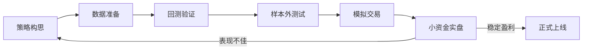
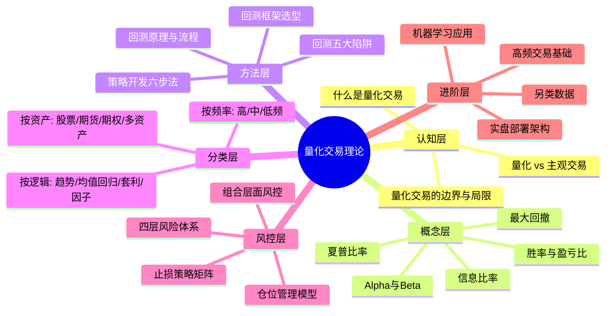

## 本节要点回顾

本节从"什么是量化交易"出发，系统构建了量化交易的理论框架。以下按知识脉络逐一梳理核心要点，并补充各节之间的逻辑关联，帮助你形成完整的认知闭环。

---

### 一、量化交易的本质认知

量化交易的核心是**用数学模型和计算机程序替代人的主观判断来做投资决策**。与传统主观交易相比，量化交易有三个根本性差异：

| 维度 | 主观交易 | 量化交易 |
|------|----------|----------|
| 决策依据 | 经验、直觉、盘感 | 数据、模型、规则 |
| 执行方式 | 人工下单，受情绪干扰 | 程序自动执行，纪律性强 |
| 可验证性 | 难以回溯验证 | 可用历史数据严格回测 |
| 容量上限 | 受个人精力限制 | 可同时监控数千只标的 |
| 情绪影响 | 贪婪与恐惧导致偏差 | 机器无情绪，严格按规则执行 |

**关键认知**：量化交易不是"躺赚"，它把交易的难点从"盘中判断"转移到了"盘前研究"——你需要在策略开发阶段投入大量精力，一旦策略上线，执行层面才变得轻松。

---

### 二、核心概念体系

#### 2.1 Alpha与Beta：理解收益的来源

所有量化策略的收益都可以分解为两部分：

- **Beta收益**：承担市场系统性风险获得的补偿，跟随大盘涨跌
- **Alpha收益**：通过策略能力获得的超额收益，与市场方向无关

核心公式：$$收益 = \alpha + \beta \times 市场收益 + 残差$$

**实践意义**：量化交易的目标是**捕获正Alpha**。A股市场散户占比高、信息不对称严重，Alpha机会相对成熟市场更为丰富——这是量化交易在国内蓬勃发展的底层逻辑。

#### 2.2 风险调整收益指标

仅看收益率是不够的，必须结合风险来评估策略质量：

| 指标 | 公式/含义 | 优秀标准 | 核心洞察 |
|------|-----------|----------|----------|
| 夏普比率 | (策略收益-无风险利率)/波动率 | > 1.5 | 收益50%但波动80%（夏普0.625），不如收益15%但波动10%（夏普1.5） |
| 最大回撤 | 最高点到最低点的最大跌幅 | < 20% | 回撤50%需要100%收益才能回本，回撤的破坏力远超直觉 |
| 信息比率 | 超额收益/跟踪误差 | > 0.5 | 衡量主动管理能力，剔除市场因素后的纯策略贡献 |
| 卡玛比率 | 年化收益/最大回撤 | > 1.0 | 综合衡量收益与极端风险的性价比 |

#### 2.3 胜率与盈亏比

**高胜率不等于高收益**——这是量化交易中最重要的反直觉认知之一。

期望收益公式：$$E = 胜率 \times 平均盈利 - (1-胜率) \times 平均亏损$$

- 胜率40% + 盈亏比3:1 → 长期盈利（趋势跟踪策略的典型特征）
- 胜率80% + 盈亏比0.3:1 → 长期亏损（高胜率陷阱）

---

### 三、回测：量化策略的"试飞"

回测是将策略应用于历史数据进行模拟验证的过程。**一个不严谨的回测比没有回测更危险**，因为它会给你虚假的信心。

#### 3.1 回测五步流程

```text
获取历史数据 → 编写策略逻辑 → 模拟交易执行 → 计算绩效指标 → 结果分析决策
```

每一步都有严格要求：数据要清洗（缺失值、异常值、复权处理），策略要完全确定性（不能有"看情况"），模拟要真实（包含佣金、印花税、滑点、涨跌停限制、T+1规则）。

#### 3.2 回测五大陷阱（必须牢记）

| 陷阱 | 本质 | 典型表现 | 防范方法 |
|------|------|----------|----------|
| 存活者偏差 | 只用现存股票回测 | 低市值策略收益虚高 | 使用包含退市股票的全历史数据库 |
| 前视偏差 | 使用了未来信息 | 用当天收盘价在开盘决策 | t时刻只能使用t-1及之前的数据 |
| 过度拟合 | 参数过度适配历史 | 参数微调则收益剧变 | 样本内/外分割、Walk-forward分析、参数稳健性检验 |
| 交易成本低估 | 忽略真实交易成本 | 高频策略回测盈利实盘亏损 | A股单边约0.1%-0.15%，双边约0.2%-0.3% |
| 流动性假设 | 假设任意价格任意量成交 | 小盘股策略实盘无法执行 | 限制持仓占日均成交量比例（<10%-20%） |

#### 3.3 A股单边交易成本明细

| 项目 | 费率 | 说明 |
|------|------|------|
| 佣金 | 万1-万3 | 券商收取，最低5元/笔 |
| 印花税 | 0.05% | 仅卖出收取（2023年下调） |
| 过户费 | 0.001% | 双向收取 |
| 滑点 | 因策略而异 | 实际成交价与预期价格的偏差 |

**致命提醒**：日均换手100%的策略，即使每次只赚0.1%，扣除双边0.2%的成本后也是亏损的。交易频率越高，成本对收益的侵蚀越严重。

#### 3.4 回测框架选型

| 框架 | 特点 | 适合人群 |
|------|------|----------|
| 聚宽/米筐 | 在线平台，数据丰富，免部署 | 入门者（推荐起点） |
| Backtrader | Python开源，灵活强大 | 策略研究者 |
| vnpy | 国产开源，支持实盘交易 | 从研究到实盘的开发者 |
| QMT | 券商级，支持实盘 | 有券商账户的实盘交易者 |

**新手推荐路径**：聚宽/米筐学习验证 → 本地Backtrader精细回测 → vnpy/QMT实盘对接。

#### 3.5 回测结果的正确解读

回测结果不是考试分数，不是越高越好。需要关注四个维度：

1. **收益来源**：是Alpha（策略能力）还是Beta（市场上涨）？2020年牛市中随便买都能赚钱，不能说明策略好
2. **最大回撤**：回测显示50%回撤，真金白银时你扛得住吗？
3. **交易次数**：只交易10次赚100%，统计上没有意义——可能只是运气
4. **市场环境适应性**：牛市、熊市、震荡市分别表现如何？只在某种行情下赚钱的策略需要警惕

---

### 四、量化策略的分类体系

#### 4.1 按交易频率

| 类型 | 持仓时间 | 特征 | 门槛 |
|------|----------|------|------|
| 高频交易（HFT） | 毫秒~分钟 | 微小价差，极高周转 | 需要机房托管和专用硬件，个人无法参与 |
| 中频交易 | 小时~天 | 大多数量化私募的主策略 | 需要编程能力和数据基础 |
| 低频交易 | 周~月 | 接近传统投资但决策系统化 | 入门门槛相对较低 |

#### 4.2 按策略逻辑

- **趋势跟踪**：识别并跟随市场趋势，上涨做多、下跌做空/减仓。典型特征：低胜率、高盈亏比
- **均值回归**：价格偏离均值过多时做反向操作。典型特征：高胜率、低盈亏比
- **统计套利**：利用相关资产间的价格偏差进行套利。如配对交易、跨期套利
- **因子投资**：基于价值、动量、质量等因子构建投资组合。学术基础最扎实

#### 4.3 按资产类别

- **股票量化**：A股/港股/美股，Alpha机会丰富
- **期货量化（CTA）**：商品期货/金融期货，可做空，趋势策略天然适配
- **期权量化**：波动率交易、期权组合策略，需要理解希腊字母
- **多资产量化**：跨市场、跨品种配置，分散化程度最高

---

### 五、因子投资入门要点

因子投资是量化投资中学术基础最扎实的分支。核心思想是：**股票收益可以被若干系统性因子解释，通过暴露于特定因子获取超额收益**。

**经典因子体系**：

| 因子 | 含义 | 学术来源 | A股有效性 |
|------|------|----------|-----------|
| 价值因子（Value） | 买入低估值股票 | Fama-French三因子（1993） | 有效但近年弱化 |
| 规模因子（Size） | 买入小市值股票 | Fama-French三因子 | 注册制后分化加剧 |
| 动量因子（Momentum） | 买入近期涨幅大的股票 | Jegadeesh & Titman（1993） | A股短期反转更显著 |
| 质量因子（Quality） | 买入高盈利质量股票 | Novy-Marx（2013） | 持续有效 |
| 低波动因子（Low Vol） | 买入波动率低的股票 | Ang et al.（2006） | 有效但有周期性 |

**因子投资的关键问题**：因子收益不是免费午餐，它们是对特定风险的补偿。因子可能长期失效（如价值因子2018-2020年连续跑输），投资者需要理解因子背后的经济学逻辑，而非盲目追逐历史收益。

---

### 六、量化交易的风险认知

#### 6.1 四层风险体系

```text
第一层：市场风险（系统性风险、行业风险、个股风险）
  ↓
第二层：策略风险（过度拟合、策略失效、策略拥挤）
  ↓
第三层：执行风险（滑点、流动性、技术故障）
  ↓
第四层：操作风险（人为错误、系统错误、合规风险）
```

#### 6.2 核心风险管理工具

**仓位管理模型**：

| 模型 | 原理 | 适用场景 |
|------|------|----------|
| 固定比例法 | 每只股票固定仓位（如5%） | 简单策略入门 |
| 等波动率法 | 波动率高的仓位小，低的仓位大 | 多资产组合 |
| 凯利公式法 | 根据胜率和赔率计算最优仓位 | 有明确胜率/赔率估计的策略 |
| 风险预算法 | 给每个策略/因子分配固定风险预算 | 多策略组合 |

**止损策略矩阵**：

| 止损类型 | 触发条件 | 核心逻辑 |
|----------|----------|----------|
| 固定止损 | 亏损达到预设比例（如5%） | 限制单笔最大损失 |
| 跟踪止损 | 从最高点回撤达到预设比例 | 保护已有利润 |
| 波动率止损 | 价格突破N倍标准差 | 适应不同波动环境 |
| 时间止损 | 持仓超过预设时间 | 清除长期无效持仓 |
| 策略止损 | 策略信号反转 | 按系统规则执行 |

**组合层面风控红线**：

- 最大回撤超15% → 降低仓位50%
- 单日亏损超3% → 暂停交易
- 组合内资产相关性不超过0.7
- 单一行业暴露不超过20%

---

### 七、策略开发方法论

量化策略开发是系统工程，遵循六步闭环：



#### 7.1 六步详解

| 步骤 | 核心任务 | 关键要求 |
|------|----------|----------|
| 策略构思 | 从学术论文/市场观察/数据挖掘获取灵感 | 必须回答：超额收益的来源是什么？逻辑是否可持续？ |
| 数据准备 | 获取、清洗、处理历史数据 | 处理缺失值、异常值、复权、幸存者偏差、前视偏差 |
| 回测验证 | 在历史数据上模拟策略表现 | 严格模拟交易成本、滑点、涨跌停、T+1 |
| 样本外测试 | 用未参与开发的数据验证策略 | 时间分割、前向测试、蒙特卡洛模拟 |
| 模拟交易 | 模拟资金跟踪至少3个月 | 对比模拟结果与回测结果的差异 |
| 小资金实盘 | 不超过总资金10%开始实盘 | 逐步加仓，严格止损，持续监控 |

#### 7.2 回测报告关键指标

| 指标 | 优秀标准 | 说明 |
|------|----------|------|
| 年化收益率 | > 15% | 需扣除交易成本后计算 |
| 夏普比率 | > 1.5 | 风险调整后收益的核心指标 |
| 最大回撤 | < 20% | 超过30%需重新审视策略 |
| 卡玛比率 | > 1.0 | 年化收益/最大回撤 |
| 胜率 | > 50% | 趋势策略可低一些 |
| 盈亏比 | > 1.5 | 配合胜率看期望收益 |
| Alpha | > 5% | 纯策略贡献 |
| Beta | 接近0 | 市场中性策略 |

---

### 八、进阶概念速览

在掌握了上述基础理论后，以下进阶方向值得关注（详见后续章节深入展开）：

- **机器学习在量化中的应用**：从线性模型到深度学习，特征工程是关键
- **高频交易基础**：订单簿分析、市场微观结构、延迟优化
- **另类数据**：新闻情感、社交媒体、卫星图像、供应链数据
- **多策略组合**：策略间低相关性是组合收益的来源
- **实盘部署架构**：数据管道、信号生成、订单管理、风控系统的工程化

---

### 九、知识脉络总览

将本节八个部分串联起来，形成完整的量化交易理论认知框架：



### 十、从理论到实践的行动清单

学完理论基础后，建议按以下路径推进：

1. **选择一个在线平台**（聚宽或米筐），完成注册和环境配置
2. **实现一个最简单的策略**（如双均线交叉），跑通从数据获取到绩效输出的全流程
3. **刻意练习回测陷阱识别**：对自己写的回测代码逐一检查五种偏差
4. **阅读一篇经典因子论文**（推荐Fama-French 1993），理解因子投资的学术根基
5. **开始下一节"核心技巧"的学习**，将理论转化为可执行的代码和框架

> **核心提醒**：理论是地图，不是领土。量化交易的真正学习发生在你写代码、跑回测、分析失败的过程中。不要停留在"理解了"的层面，尽早动手实践。

***
