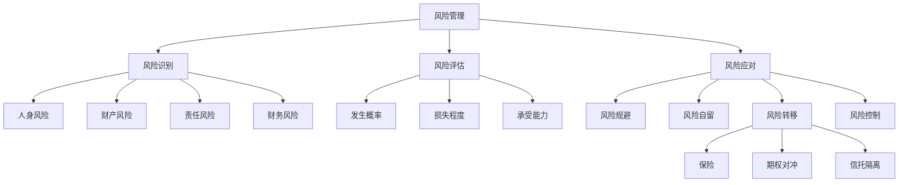
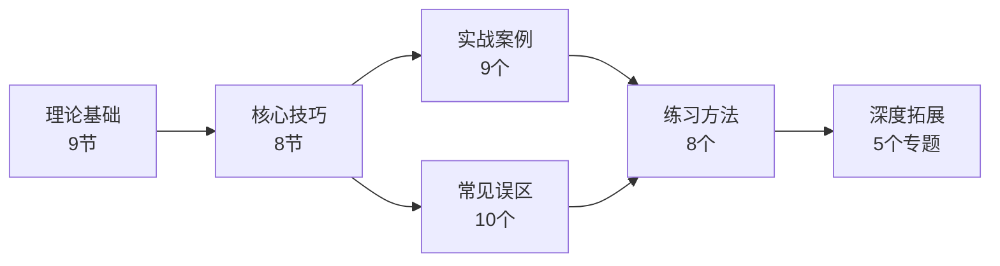
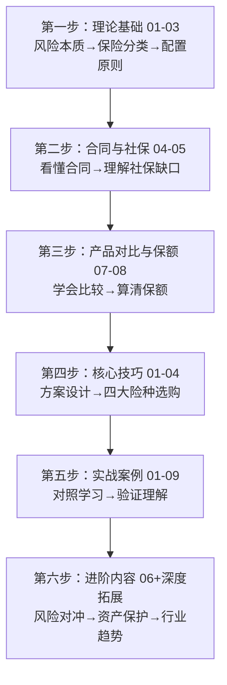

# 第二十九章 保险与风险管理 — 章节概览

## 一、本章定位与核心主题

保险与风险管理是个人财务管理中**最容易被误解、却最不应该被忽视**的领域。许多人对保险的认知停留在"花钱买平安"或"保险是骗人的"两个极端，却从未真正理解保险的本质——它是一种科学的风险转移工具，是家庭财务安全的最后防线。

本章围绕一个核心命题展开：**如何用最小的成本，将家庭无法承受的巨额风险转移出去，确保在最坏的情况下，你和家人的生活不会被彻底改变。**

这个命题可以拆解为三个层次：

1. **认知层**：理解风险的本质、保险的原理、各类保险产品的功能定位
2. **方法层**：掌握保险配置的原则、方案设计的流程、产品选购的技巧
3. **工具层**：学会使用保险、期权、信托等工具构建完整的风险防护体系

***

## 二、为什么这个主题值得深入学习？

### 2.1 一组触目惊心的数据

| 场景 | 平均费用/损失 | 社保报销后自费 | 是否可能让家庭返贫 |
|------|-------------|--------------|-----------------|
| 重大疾病（癌症、心梗、脑中风） | 30-100万元 | 15-50万元 | 极有可能 |
| 严重意外伤残（1-3级） | 终身收入损失 | 无社保补偿 | 必然 |
| 家庭经济支柱身故 | 家庭未来5-10年收入归零 | 社保抚恤金约2-5万 | 极有可能 |
| 重大自然灾害（房屋损毁） | 50-200万元 | 社保不覆盖 | 取决于资产 |

这些数字意味着：**一场大病可以掏空一个中产家庭10年的积蓄，一次意外可以摧毁一个家庭的经济根基。** 没有保险的家庭，本质上是在"裸奔"——用自己的全部积蓄来对抗概率事件。

### 2.2 常见的认知偏差

绝大多数人在保险上犯的错误，根源不是信息不足，而是**认知偏差**：

- **乐观偏差**："坏事不会发生在我身上"——这是人类大脑的默认设定，但统计学不这么认为
- **损失厌恶**：每年交几千保费，如果没出险就觉得"亏了"——却忘了保险的本质是花小钱转移大风险
- **锚定效应**：被销售人员的话术锚定在某一款产品上，缺乏全局比较能力
- **当下偏差**：总觉得"以后再买"——却忽略了年龄越大保费越贵、健康异常越难投保的事实

本章的目标之一，就是帮你**建立理性的保险决策框架**，摆脱这些认知陷阱。

***

## 三、章节知识体系全景

本章分为**四大板块**，层层递进，从理论到实践全面覆盖：

### 3.1 理论基础（9节）——"道"的层面

理论基础部分构建完整的保险认知框架，回答"保险是什么、为什么需要、有哪些种类、怎么配置"等根本问题。

| 序号 | 主题 | 核心问题 | 关键知识点 |
|------|------|----------|-----------|
| 01 | 风险与保险的本质 | 风险是什么？保险如何运作？ | 风险四分类、大数法则、保费构成、风险管理四方式 |
| 02 | 保险的分类与功能 | 有哪些保险产品？各自解决什么问题？ | 定期寿险/终身寿险/重疾险/医疗险/意外险/年金险/财产险 |
| 03 | 保险配置的核心原则 | 应该按什么顺序买保险？ | 先保障后理财、先大人后小孩、先保额后保费、先规划后产品 |
| 04 | 保险合同的核心要素 | 保险合同怎么看？ | 投保人/被保险人/受益人、等待期/犹豫期/宽限期、免责条款 |
| 05 | 社保与商业保险的关系 | 有社保还需要商业保险吗？ | 社保五险局限性、保障缺口分析、商业保险补充方案 |
| 06 | 风险对冲基础 | 除了保险还有什么风险管理工具？ | 期权、期货、互换的基本原理与对冲策略 |
| 07 | 各类保险产品深度对比 | 同类产品怎么选？ | 重疾险/医疗险/寿险/意外险的横向对比框架 |
| 08 | 保额计算的科学方法 | 该买多少保额？ | 收入倍数法、支出需求法、负债覆盖法、生命价值法 |
| 09 | 保险行业的运作机制 | 保险公司靠什么赚钱？理赔是怎么运作的？ | 承保利润、投资收益、核保流程、理赔流程、监管体系 |

### 3.2 核心技巧（8节）——"法"与"术"的层面

核心技巧部分聚焦实操，回答"怎么选产品、怎么设计方案、怎么理赔"等实战问题。

| 序号 | 主题 | 解决的问题 | 实用价值 |
|------|------|-----------|---------|
| 01 | 家庭保险方案设计 | 如何为不同阶段的家庭设计保险方案？ | 提供单身期/成家期/成长期/退休期四阶段完整方案模板 |
| 02 | 重疾险选购技巧 | 重疾险产品怎么挑？ | 保障病种、赔付次数、轻症比例、豁免条款的评判标准 |
| 03 | 医疗险选购技巧 | 百万医疗险怎么选？ | 续保条件、保障范围、免赔额、外购药等核心维度 |
| 04 | 寿险与意外险选购技巧 | 定期寿险和意外险怎么买？ | 保额计算、保障期限、免责条款的对比方法 |
| 05 | 风险对冲工具 | 股票/基金投资怎么对冲风险？ | 保护性看跌期权、股指期货对冲、分散投资策略 |
| 06 | 资产保护与信托 | 高净值人群怎么保护资产？ | 保险金信托、家族信托、债务隔离、婚前财产规划 |
| 07 | 理赔流程详解 | 出险了怎么理赔？ | 报案→材料准备→审核→赔付的全流程，以及拒赔应对策略 |
| 08 | 家庭保障方案设计完整模板 | 能不能直接套用？ | 可直接使用的Excel模板，含需求分析、缺口计算、产品选配 |

### 3.3 实战案例（9个）——"术"的验证

实战案例部分通过真实场景还原保险方案从设计到理赔的完整过程，让你看到理论和技巧在真实世界中如何落地。

| 案例 | 场景 | 核心收获 |
|------|------|---------|
| 案例一 | 普通三口之家的保险方案 | 年收入15-30万家庭的标准化配置流程 |
| 案例二 | 单亲妈妈的保险配置 | 特殊家庭结构下的保障优先级调整 |
| 案例三 | 企业主的资产保护方案 | 高净值人群如何用保险+信托隔离企业风险与个人资产 |
| 案例四 | 保险理赔实战 | 从出险到获赔的完整时间线和关键节点 |
| 案例五 | 保险避坑实战 | 真实的理赔纠纷案例，揭示常见陷阱 |
| 案例六 | 百万医疗险报销全流程实录 | 一次住院从入院到报销的每一步操作 |
| 案例七 | 定期寿险理赔实录 | 家庭经济支柱身故后，理赔如何保障家庭生活 |
| 案例八 | 健康异常人群的投保之路 | 乙肝/甲状腺结节/高血压等常见异常的投保策略 |
| 案例九 | 年金险的真实收益计算 | 拆解年金险的IRR，看透"高收益"话术 |

### 3.4 常见误区（10个）——认知纠偏

| 误区 | 真相 | 后果 |
|------|------|------|
| 保险是骗人的 | 不专业的销售误导了你，保险合同受法律保护 | 错失风险管理工具 |
| 有社保就够了 | 社保报销比例有限、范围有限、无收入补偿 | 一场大病回到解放前 |
| 给孩子买保险最重要 | 大人才是家庭经济支柱，大人倒了全家塌 | 保费花错方向 |
| 返还型比消费型好 | 返还型本质是"用你的钱帮你投资再还给你" | 多花数万元冤枉钱 |
| 保险买越多越好 | 医疗险不能重复报销，保费过高影响生活 | 资金被低效锁定 |
| 只看品牌不看产品 | 理赔看合同条款不看公司大小 | 买到低性价比产品 |
| 健康告知可以隐瞒 | 保险公司能查到就诊/体检/医保记录 | 理赔被拒、合同解除 |
| 保险可以避债避税 | 恶意避债法院可撤销保险合同 | 法律风险 |
| 理赔很难 | 理赔率通常在97%以上 | 因恐惧而不敢投保 |
| 买了就不用管了 | 家庭变化需要保障同步调整 | 保障与需求脱节 |

***

## 四、学习路径建议

### 4.1 推荐学习顺序

### 4.2 不同读者的学习策略

**保险小白（从未买过保险）**

建议用时：2-3周，每天30分钟

1. 先读理论基础01-03，建立基本认知框架
2. 跳读实战案例一（三口之家），看看真实方案长什么样
3. 回头读核心技巧01（方案设计），试着为自己设计一份方案
4. 读常见误区，避免踩坑
5. 用练习方法中的模板完成家庭风险评估

**有保单但不确定是否合理的人**

建议用时：1-2周，每天30分钟

1. 直接读核心技巧08（完整模板），对照自己的保单做体检
2. 读实战案例五（避坑实战），检查自己的保单有没有类似问题
3. 读常见误区七（健康告知），确认投保时是否如实告知
4. 根据缺口分析结果，补充缺失的保障

**企业主/高净值人群**

建议用时：1周，每天30分钟

1. 重点读核心技巧06（资产保护与信托）
2. 读实战案例三（企业主资产保护方案）
3. 读理论基础06（风险对冲基础）和深度拓展相关内容
4. 考虑聘请专业保险经纪人和信托律师

**保险从业者/深度学习者**

建议通读全章，重点关注：
- 理论基础09（保险行业运作机制）
- 深度拓展全部内容（精算原理、InsurTech、全球市场）
- 练习方法中的进阶练习

***

## 五、核心概念速查表

在开始正式学习之前，先建立以下核心概念的基本认知：

| 概念 | 一句话解释 | 为什么重要 |
|------|-----------|-----------|
| 大数法则 | 样本量越大，实际结果越趋近预期 | 保险公司能精确定价的数学基础 |
| 保费 = 纯保费 + 附加保费 | 纯保费用于赔付，附加保费覆盖运营成本和利润 | 理解保费构成才能判断产品性价比 |
| 等待期 | 投保后90-180天内疾病不赔 | 等待期内出险无法获赔，越短越好 |
| 免赔额 | 自付额度以下不报销（通常1万元） | 决定医疗险的实际使用门槛 |
| 保单现金价值 | 退保时能拿回的钱 | 退保≠退还全部保费，前期退保损失大 |
| 豁免条款 | 患病后免交后续保费，保障继续有效 | 被保人豁免是标配，投保人豁免需附加 |
| 保证续保 | 不因健康变化拒绝续保 | 医疗险最核心的条款，决定长期保障的稳定性 |
| 社保目录内/外 | 在医保报销范围内/外的药品和治疗 | 很多救命药不在社保目录内，需要商业保险覆盖 |
| IRR（内部收益率） | 考虑时间价值后的真实年化收益率 | 用于评估年金险、增额终身寿险的真实收益 |
| 核保 | 保险公司审核你的健康状况决定是否承保 | 智能核保/人工核保决定了你能不能买、怎么买 |

***

## 六、本章的独特价值

与市面上的保险科普相比，本章有三个显著特点：

**第一，体系完整。** 不是碎片化的"重疾险怎么选""医疗险推荐"，而是从风险认知→保险原理→配置原则→方案设计→产品选购→理赔实操→资产保护→行业趋势的完整知识链。学完本章，你对保险的认知将从"点"升级为"面"。

**第二，道法术器贯通。** 每个知识点都遵循"是什么→为什么→怎么做→用什么"的逻辑展开。比如重疾险，不仅告诉你"要买"（结论），还解释"为什么重疾险是四大基础险种之一"（原理），教你"怎么判断一款重疾险好不好"（方法），给你"产品对比的评估模板"（工具）。

**第三，案例驱动。** 9个实战案例覆盖了从普通工薪家庭到高净值企业主的多种场景，每个案例都包含完整的需求分析→方案设计→执行过程→结果复盘，而不是简单罗列产品名称和保额数字。

***

## 七、关键词

人寿保险、健康保险、重大疾病保险、医疗保险、意外伤害保险、定期寿险、终身寿险、年金保险、保险配置原则、保额计算、大数法则、核保、理赔、等待期、免赔额、保证续保、风险对冲、期权、期货、家族信托、资产保护、保险科技（InsurTech）、精算、惠民保、个人养老金

***

> **开篇提示**：保险的本质不是投资，而是风险管理。买保险的目的不是为了赚钱，而是为了确保在最坏的情况下，你和家人的生活不会被彻底改变。带着这个认知去学习本章，你会发现保险其实是一门关于"如何与不确定性共处"的人生智慧。
