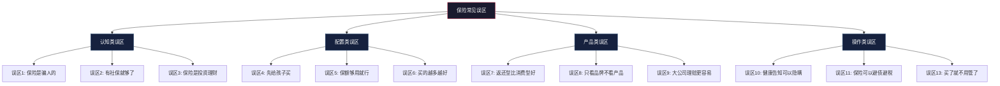
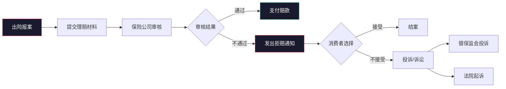
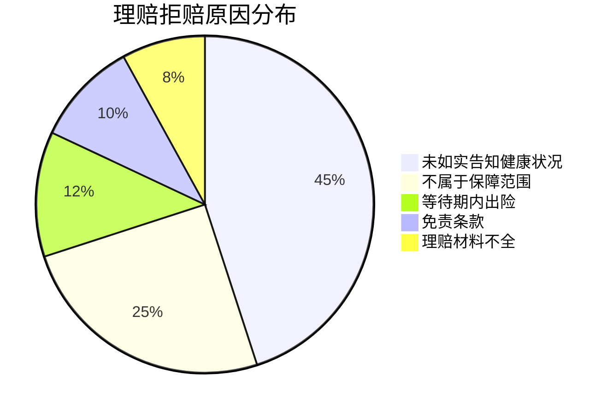

# 第二十九章 保险与风险管理 — 常见误区

保险行业在中国经历了从"被妖魔化"到"被神化"的钟摆式摇摆。早期由于销售误导泛滥，"保险是骗人的"成为国民级偏见；而近年来随着保险知识普及，又出现了另一种极端——把保险当成万能的风险管理工具，盲目叠加保单、过度追求全面保障。两种极端的共同根源，都是对保险本质的认知不足。

本章将系统拆解保险领域最常见的认知误区，不仅告诉你"错在哪里"，更会解释"为什么会错"以及"应该怎么做"。每个误区都配有真实案例、数据对比和决策框架，帮助你建立正确的保险认知体系。

---

## 误区分类总览

保险误区可以归纳为四大类，理解这个分类框架有助于系统性地纠正认知偏差：

| 误区类别 | 核心问题 | 典型表现 | 危害程度 |
|----------|----------|----------|----------|
| **认知类误区** | 对保险本质的错误理解 | "保险是骗人的""保险是投资" | ★★★★★ |
| **配置类误区** | 购买顺序和方案设计错误 | 先给孩子买、保额不足 | ★★★★☆ |
| **产品类误区** | 对具体产品的错误认知 | 返还型比消费型好、只看品牌 | ★★★☆☆ |
| **操作类误区** | 投保和理赔过程中的错误 | 隐瞒健康告知、买了不管 | ★★★★★ |

---

## 第一类：认知类误区

### 误区一：保险是骗人的

**错误认知**："保险就是骗局，买了也赔不了。"

**这种想法的来源**：

这个误区的形成有深刻的历史原因。中国保险业在1990年代至2010年代初期经历了"野蛮生长期"，大量不具备专业素质的销售人员通过人海战术推销保险，导致了一系列问题：

- **销售误导**：为了成交，夸大保障范围、隐瞒免责条款、承诺不确定的收益。一个典型场景是："这款保险什么都保，到期还能返本，等于免费白送。"实际上产品可能是两全保险附加重疾，保障范围远没有那么全面。
- **人情单泛滥**：很多人买的第一份保险来自亲戚朋友的推销，根本没有分析过自己的需求，买到的产品自然不适合。
- **理赔体验差**：由于投保时未如实告知、对条款理解有误等原因导致拒赔，消费者将责任归咎于"保险骗人"。

**真实数据揭示的真相**：

根据中国银保监会（现国家金融监督管理总局）公布的行业数据：

| 指标 | 数据 |
|------|------|
| 行业整体理赔获赔率 | 97%以上 |
| 主要险企理赔时效 | 平均1-3个工作日（小额案件） |
| 理赔纠纷中因"未如实告知"导致的比例 | 约60% |
| 理赔纠纷中因"不属于保障范围"导致的比例 | 约25% |
| 理赔纠纷中因"免责条款"导致的比例 | 约10% |

也就是说，**绝大多数拒赔案例并非保险公司"故意刁难"，而是消费者在投保环节出了问题**。

**一个典型的误解案例**：

> 张先生2018年购买了一份百万医疗险，2020年因甲状腺癌住院治疗，花费8万元。申请理赔时被告知"甲状腺癌属于轻症，不在重疾保障范围内"。张先生大骂"保险是骗人的"。
>
> 实际情况是：他混淆了"百万医疗险"和"重疾险"。百万医疗险是报销型，只要住院就能报销（扣除免赔额后），他完全符合理赔条件。但他误以为自己的保险是"确诊即赔"的重疾险，而他根本没有买重疾险。最终在专业人员协助下，他顺利获得了医疗险的理赔报销。

**正确认知**：保险不是骗人的，但不专业的销售方式确实会制造误解。保护自己的方式不是拒绝保险，而是学会自己看懂保险合同。保险合同是具有法律效力的契约，保险公司必须按合同约定赔付，这一点受《保险法》和国家金融监督管理总局的严格监管。

---

### 误区二：有社保就够了

**错误认知**："我有医保，看病能报销大部分，不需要商业保险。"

**社保的真实保障边界**：

社保（尤其是医保）是国家提供的基础保障，这一点毋庸置疑。但"基础"二字就意味着它只能覆盖最基本的需求，而非全部。要理解社保的局限性，需要看清楚它的保障边界：

**报销比例的真相**：

社保报销并非简单的"报70%-85%"。实际报销比例受多个因素影响：

| 影响因素 | 说明 | 实际影响 |
|----------|------|----------|
| 医院等级 | 三甲医院报销比例低于社区医院 | 三甲住院实际报销可能只有50%-60% |
| 药品分类 | 甲类药100%纳入报销，乙类药部分纳入，丙类药（自费药）不纳入 | 进口药、靶向药多为丙类 |
| 起付线 | 低于起付线的部分不报销 | 每次住院起付线约1000-2000元 |
| 封顶线 | 超过封顶线的部分不报销 | 城镇职工医保封顶线通常为30-50万 |
| 异地就医 | 未备案的异地就医报销比例降低10%-20% | 在大城市看病实际报销更低 |

**真实案例：社保报销后的"窟窿"**：

> 李女士，45岁，确诊乳腺癌。治疗方案包括手术、化疗和靶向治疗（赫赛汀）。总医疗费用42万元。
>
> 社保报销明细：
> - 甲类药品和治疗费用纳入报销：28万元
> - 社保报销比例（按三甲医院）：70%
> - 社保实际报销：28万 × 70% = 19.6万元
> - 起付线扣除：约1500元
> - 社保总计报销：约19.45万元
>
> **个人自付：42万 - 19.45万 = 22.55万元**
>
> 其中靶向药赫赛汀（每支约2.5万元，需用6-8支）完全不在社保报销范围内，仅这一项就需要15-20万元。

**社保无法覆盖的风险**：

1. **收入损失**：重病治疗期间（通常1-3年）无法工作，社保不补偿任何收入损失。对于年收入20万的家庭，3年收入损失就是60万。
2. **康复费用**：出院后的康复治疗、营养品、护理费用，社保基本不覆盖。
3. **身故保障**：如果家庭经济支柱不幸身故，社保只会退还个人账户余额（通常只有几万元），不会给家庭留下一笔保障金。
4. **子女教育和房贷**：这些刚性支出不会因为你生病而停止，社保对此没有任何帮助。

**正确做法**：社保是"地基"，商业保险是"墙壁和屋顶"。没有地基不行，但只有地基的房子无法遮风挡雨。正确的配置是"社保 + 商业保险"组合，用商业保险覆盖社保无法覆盖的风险缺口。

---

### 误区三：保险是投资理财工具

**错误认知**："买保险既能保障又能赚钱，一举两得。"

**这种误区的根源**：

许多销售人员在推销时会强调保险的"理财功能"——"这款产品年化收益3.5%，比银行存款高""到期返还保费，等于免费获得保障""复利增长，时间越长越值钱"。这些话术让消费者误以为保险是一种投资工具。

**保险的收益真相**：

以增额终身寿险为例，销售人员常说的"3.5%复利增长"指的是保额增长率，不是投资收益率。实际的现金价值（退保能拿到的钱）的内部收益率（IRR）通常如下：

| 持有年限 | 增额终身寿IRR | 同期国债收益率 | 同期沪深300年化 |
|----------|--------------|---------------|----------------|
| 10年 | 约1.5%-2.0% | 约2.5%-3.0% | 约6%-8% |
| 20年 | 约2.5%-2.8% | 约2.5%-3.0% | 约6%-8% |
| 30年 | 约2.8%-3.0% | 约2.5%-3.0% | 约6%-8% |

**关键洞察**：保险的"理财收益"在前10年极低（因为要扣除保障成本和销售佣金），只有在持有20年以上时才能接近宣传的收益率。而且这个收益率在低利率环境下是确定的——这既是优点（锁定利率），也是缺点（无法享受市场上涨的超额收益）。

**保险 vs 纯投资的对比**：

假设每年投入1万元，持续20年：

| 方案 | 20年后总价值 | 灵活性 | 保障功能 | 适合人群 |
|------|------------|--------|----------|----------|
| 增额终身寿 | 约27-28万 | 低（退保有损失） | 有身故保障 | 追求确定性的人 |
| 银行大额存单（3%） | 约27万 | 高 | 无 | 保守型投资者 |
| 指数基金定投 | 约35-50万（波动大） | 高 | 无 | 能承受波动的人 |
| 消费型保险 + 基金定投 | 保障充足 + 约30-40万 | 高 | 有 | 大多数人 |

**正确做法**：保险的核心功能是风险转移，不是资产增值。把保险当投资来买，结果往往是保障不足（因为大部分保费被用于"理财"部分）且收益不高。最优策略是"消费型保障保险 + 独立投资"的组合。

---

## 第二类：配置类误区

### 误区四：给孩子买保险最重要

**错误认知**："孩子是家里的宝贝，当然要先给孩子买保险。"

**这种误区的心理根源**：

中国家庭普遍存在"孩子优先"的思维惯性。加上保险销售员深知这一点，往往从少儿险入手推销——"这款少儿重疾险保110种疾病，还能附加教育金，一天不到10块钱"。听起来很有吸引力，于是很多家庭的第一份商业保险是给孩子买的教育金或少儿险，而承担家庭经济支柱角色的父母没有任何保障。

**一个令人心痛的真实案例**：

> 王先生家庭年收入25万，有一个3岁的孩子。在朋友推荐下，王先生每年花8000元给孩子买了一份教育金+少儿重疾组合保险。2021年，王先生（35岁）被确诊为肝癌晚期。由于没有任何商业保险，治疗费用花了40多万，社保报销后自费约22万。更严重的是，王先生无法继续工作，家庭失去了主要收入来源。
>
> 而那份给孩子买的教育金保险，在这个最需要钱的时候帮不上任何忙——教育金要到孩子18岁才能领取，重疾险只保孩子不保大人。最终，这个家庭不得不卖房治病。

**正确的配置逻辑**：

家庭保险配置的第一原则是"先保经济支柱"。原因很简单：

- 孩子生病 → 大人还能工作赚钱 → 家庭收入不中断 → 有能力支付医疗费
- 大人倒下 → 家庭收入中断 → 既没钱治病，也没钱还房贷、养孩子

**家庭保费分配建议**：

| 家庭成员 | 保费占比 | 优先险种 | 说明 |
|----------|----------|----------|------|
| 家庭经济支柱（收入高者） | 40%-50% | 重疾险+定期寿险+医疗险+意外险 | 保额要充足 |
| 配偶 | 25%-30% | 重疾险+医疗险+意外险 | 保额可适当降低 |
| 孩子 | 10%-15% | 医疗险+意外险+消费型重疾险 | 优先保障型，不买教育金 |
| 父母（如需赡养） | 10%-15% | 防癌医疗险+意外险 | 年龄大买不了重疾险 |

**正确做法**：在预算有限时，先给家庭经济支柱买充足的保障（重疾险50万+定期寿险100万+百万医疗险+意外险），然后是配偶，最后才是孩子。孩子的保险优先买保障型（医疗险、意外险、消费型重疾险），教育金等理财型保险在保障充足后有余力再考虑。

---

### 误区五：保额差不多就行

**错误认知**："买个10万、20万保额的重疾险意思意思就行了。"

**保额不足等于白买**：

很多消费者在投保时过度关注"保费贵不贵"，而忽略了"保额够不够"。为了降低保费，选择了一个看起来"便宜"的保额，比如重疾险只买10万。但10万的保额在大病面前几乎起不到任何保障作用。

**一组触目惊心的数据**：

| 疾病类型 | 平均治疗费用 | 社保报销后自费 | 10万保额缺口 |
|----------|------------|--------------|-------------|
| 恶性肿瘤（一般） | 30-50万 | 15-30万 | 5-20万 |
| 恶性肿瘤（需靶向治疗） | 50-100万 | 30-70万 | 20-60万 |
| 急性心肌梗塞 | 20-40万 | 10-25万 | 0-15万 |
| 脑中风后遗症 | 长期护理费10-20万/年 | 全自费 | 每年缺口10-20万 |
| 器官移植 | 50-100万 | 30-60万 | 20-50万 |

注意，以上只是治疗费用。如果加上3-5年的收入损失（重疾治疗期间通常无法工作），实际需要的金额要翻倍。

**保额计算的正确方法**：

**方法一：收入倍数法（简单但粗糙）**
- 重疾险保额 = 年收入 × 3-5倍
- 例：年收入20万 → 重疾险保额60-100万

**方法二：支出需求法（推荐）**
- 重疾险保额 = 治疗费用(30-50万) + 3年收入损失 + 康复费用(10-20万)
- 例：治疗费40万 + 3年收入60万 + 康复费15万 = 115万

**方法三：负债覆盖法（适合有房贷的家庭）**
- 定期寿险保额 = 房贷余额 + 子女教育费 + 父母赡养费 + 3年生活费
- 例：房贷150万 + 教育80万 + 赡养50万 + 生活60万 = 340万

**预算有限时的策略**：

如果预算确实有限，正确的做法不是降低保额，而是调整保障期限和产品类型：

| 预算策略 | 具体做法 | 效果 |
|----------|----------|------|
| 缩短保障期限 | 终身重疾 → 定期重疾（保至70岁） | 保费降低40%-50% |
| 选择消费型 | 返还型 → 消费型 | 保费降低50%-60% |
| 缩短缴费期 | 30年缴 → 20年缴 | 总保费降低，但年缴增加 |
| 选择单次赔付 | 多次赔付 → 单次赔付 | 保费降低20%-30% |

**正确做法**：保额是保险的核心。保额不足的保险就像一把漏雨的伞——看着有，用的时候发现没用。宁可买消费型定期的高保额，也不要买返还型终身的低保额。

---

### 误区六：保险买的越多越好

**错误认知**："多买几份保险，出事了能多赔几份，更安全。"

**过度保险的三个问题**：

**问题一：保费挤占生活预算**

保险行业建议家庭年保费支出为年收入的5%-10%。如果保费超过这个比例，会严重影响家庭的日常生活质量和应急能力。一个年收入30万的家庭，如果每年花6万买保险（20%），生活质量会明显下降，而且一旦遇到急需用钱的情况（如失业、创业），高额保费反而成为负担。

**问题二：报销型保险不能重复理赔**

这是一个被很多人忽略的关键知识点。保险分为"给付型"和"报销型"两种理赔方式：

| 理赔类型 | 能否叠加赔付 | 代表险种 | 说明 |
|----------|-------------|----------|------|
| 给付型 | ✅ 可以 | 重疾险、寿险、意外身故/伤残 | 买几份赔几份，互不影响 |
| 报销型 | ❌ 不能 | 医疗险、意外医疗 | 总报销不超过实际花费 |

举个例子：如果你买了3份百万医疗险（分别在A、B、C三家保险公司），住院花了10万，社保报销了6万，自费4万。你只能在A公司报销这4万（扣除免赔额后），不能同时在B和C公司再各报销4万。你花了3份保费，却只享受了1份的保障。

**问题三：资金流动性被锁定**

保险一旦购买，前几年退保会有较大损失（现金价值远低于已交保费）。如果家庭把大量资金投入保险，遇到急需用钱的情况（如创业、买房首付、突发大额支出），可能面临"有钱但拿不出来"的尴尬。

**合理配置的"双十原则"**：

- **保费不超过家庭年收入的10%**
- **保额不低于家庭年收入的10倍**

同时定期检视保单，去掉重复和不必要的保障。比如已经有了保证续保20年的百万医疗险，就不需要再买第二份医疗险；已经有了100万的意外身故保额，就不需要在多家公司各买一份意外险。

**正确做法**：保险配置追求的是"刚好够用"，而不是"越多越好"。每年花半天时间做一次保单检视，确保保障与家庭需求匹配，去掉重复和不必要的保障。

---

## 第三类：产品类误区

### 误区七：返还型保险比消费型好

**错误认知**："有病治病、没病返本，返还型保险等于免费保障，当然比消费型好。"

**算一笔经济账**：

以30岁男性、保额30万的重疾险为例：

| 对比项 | 返还型重疾险 | 消费型重疾险 | 差额 |
|--------|------------|------------|------|
| 年缴保费 | 8000元 | 3000元 | 5000元/年 |
| 缴费期 | 20年 | 20年 | - |
| 总保费 | 16万元 | 6万元 | 10万元 |
| 保障期限 | 终身 | 至70岁 | - |
| 70岁返还 | 约20-25万元 | 0 | - |

看起来返还型"赚了"？把差额5000元/年自己投资算一下：

| 投资方式 | 年化收益 | 20年后（缴费期满） | 40年后（70岁） |
|----------|---------|-------------------|---------------|
| 银行存款 | 2.5% | 约13.2万 | 约21.5万 |
| 国债 | 3.0% | 约13.7万 | 约23.0万 |
| 指数基金定投 | 6.0% | 约19.0万 | 约45.0万 |
| 返还型"返还"金额 | - | - | 约20-25万 |

即使是最保守的银行存款方案，自行投资的收益也与返还金额持平。而如果选择指数基金定投，收益是返还金额的近2倍。

**返还型保险的本质**：

返还型保险的商业模式是：保险公司收取更高的保费，用多收的部分进行投资，几十年后把本金（可能加一点利息）返还给你。换句话说，**你用自己的钱让保险公司免费投资了几十年，最后只拿回了本金**。

**一个更深层的问题**：

返还型保险的"返还"建立在一个前提上——你必须活到约定年龄（如70岁、80岁）且没有发生理赔。如果你在69岁理赔了重疾，保险公司赔付30万保额后合同终止，不会另外返还你多交的保费。你多交的那10万元，就"贡献"给了保险公司。

**正确做法**：买消费型保险，省下来的保费自己投资。"消费型保障 + 自主投资"的组合，保障更充足、收益更高、灵活性更强。

---

### 误区八：买保险只看品牌不看产品

**错误认知**："大公司更靠谱，小公司可能倒闭，理赔肯定找大公司更放心。"

**"大公司更安全"的认知来源**：

很多人把买保险类比为买家电——"海尔、格力质量有保证，杂牌不敢买"。但保险和家电有本质区别：

| 对比维度 | 家电产品 | 保险产品 |
|----------|----------|----------|
| 质量标准 | 各厂家自定，差异大 | 银保监会统一监管，合同受法律保护 |
| 售后保障 | 依赖厂家服务网络 | 理赔依据合同条款，与公司大小无关 |
| 破产风险 | 可能倒闭且无兜底 | 有保险保障基金兜底，保单不会失效 |
| 价格差异 | 通常一分钱一分货 | 大公司运营成本高，保费可能更贵 |

**保险公司的安全性保障**：

中国的保险公司受到世界上最严格的保险监管体系之一的保护：

1. **设立门槛极高**：保险公司注册资本不低于2亿元人民币，且必须为实缴货币资本。
2. **偿付能力监管**：保险公司必须满足核心偿付能力充足率≥50%、综合偿付能力充足率≥100%、风险综合评级≥B级的要求，不达标的将被限制业务。
3. **保险保障基金**：所有保险公司都必须缴纳保险保障基金。如果保险公司被依法撤销或破产，其持有的保单会转让给其他保险公司，消费者的权益不受影响。
4. **再保险机制**：保险公司会通过再保险将部分风险转移给再保险公司，进一步降低自身风险。

**真实案例**：安邦保险集团在2018年被接管，后重组为大家保险集团。安邦所有的保单都正常履行，没有一位消费者的权益受到损害。

**大公司产品的真实性价比**：

以30岁男性、保额50万、保终身、20年缴为例，2025年市场上的重疾险保费对比：

| 公司类型 | 代表产品 | 年缴保费 | 保障病种 | 轻症赔付 | 保费差异 |
|----------|----------|----------|----------|----------|----------|
| 大型公司A | XX福 | 约12000元 | 100种重疾 | 20%保额 | 基准 |
| 大型公司B | XX安 | 约11000元 | 110种重疾 | 20%保额 | -8% |
| 中型公司C | XX保 | 约7500元 | 110种重疾 | 30%保额 | -37% |
| 新兴公司D | XX卫士 | 约6500元 | 120种重疾 | 30%保额 | -46% |

可以看到，大公司的产品保费可能比中小公司贵30%-50%，但保障内容反而可能更少。差价主要来自品牌溢价、庞大的代理人队伍佣金和运营成本。

**正确做法**：比较产品条款和保费，而不是比较公司品牌。重点关注：保障病种数量和质量、轻症/中症赔付比例、等待期长短、免责条款多少、保费豁免条件。保险合同受法律保护，无论公司大小都会按合同赔付。

**一个需要注意的平衡**：虽然"理赔看合同不看品牌"是事实，但服务体验确实有差异——大公司的服务网点更多、APP更完善、理赔流程可能更顺畅。如果你非常看重服务体验，可以在产品性价比相近的情况下优先选择服务更好的公司，但不应为了品牌而付出过高的溢价。

---

### 误区九：大公司理赔更容易、更快

**错误认知**："小公司理赔会刁难你，大公司理赔爽快。"

**理赔流程的标准化真相**：

无论公司大小，保险理赔都遵循相同的法律框架和行业规范：

理赔审核的核心依据是**保险合同条款**和**投保时的如实告知情况**，而不是保险公司的"品牌良心"。如果符合合同约定，任何公司都必须赔付；如果不符合合同约定，任何公司都有权拒赔。

**影响理赔速度的真正因素**：

| 因素 | 影响程度 | 说明 |
|------|----------|------|
| 案件金额 | ★★★★★ | 小额案件（5000元以下）通常1-3天；大额案件可能需要15-30天 |
| 材料完整性 | ★★★★★ | 材料齐全的案件理赔速度远快于材料不全的 |
| 是否需要调查 | ★★★★☆ | 涉及既往症、高额理赔等可能触发调查 |
| 投保时间与出险时间间隔 | ★★★★☆ | 投保后短期内出险（如1年内）会触发更严格的审核 |
| 公司内部流程 | ★★☆☆☆ | 各公司略有差异，但差异不大 |

**一个反直觉的事实**：中小保险公司为了树立口碑、争夺市场，理赔服务反而可能更积极。一些新兴保险公司推出了"闪赔""快赔"服务，小额案件可以在几小时内完成理赔。

**正确做法**：不要因为担心理赔而只选大公司。理赔的关键在于：投保时如实告知、仔细阅读保险责任和免责条款、出险后及时报案并准备齐全的理赔材料。做好这三点，在任何公司理赔都不会有问题。

---

## 第四类：操作类误区

### 误区十：健康告知可以隐瞒

**错误认知**："小毛病不用说，反正保险公司查不到。"

**这是所有误区中后果最严重的一个**。

健康告知是投保时保险公司对被保险人健康状况的询问。根据《保险法》第十六条，投保人故意或因重大过失未履行如实告知义务，足以影响保险人决定是否同意承保或者提高保险费率的，保险人有权解除合同。

**保险公司能查到什么？**

很多消费者低估了保险公司的调查能力。在理赔调查阶段，保险公司可以：

| 调查渠道 | 能查到的信息 | 覆盖范围 |
|----------|------------|----------|
| 医院就诊记录 | 门诊病历、住院记录、检查报告 | 全国联网，追溯期通常为投保前5-10年 |
| 医保卡使用记录 | 购药记录、门诊结算、住院结算 | 全国医保系统联网 |
| 体检机构记录 | 单位体检、个人体检报告 | 主要体检机构数据共享 |
| 同业理赔记录 | 在其他保险公司的投保和理赔记录 | 行业信息共享平台 |
| 面访调查 | 走访被保险人的单位、社区、亲友 | 大额理赔案件常见 |

**隐瞒告知的法律后果**：

| 情形 | 法律后果 |
|------|----------|
| 故意隐瞒 | 保险公司有权解除合同，不退还保费，拒赔 |
| 重大过失未告知 | 保险公司有权解除合同，退还保费，拒赔（对事故有严重影响的） |
| 保险公司知情 | 合同成立超过2年的，保险公司不得解除合同（两年不可抗辩条款） |

**关于"两年不可抗辩条款"的误解**：

很多人听说"保险合同超过两年，保险公司就不能拒赔了"，于是认为只要熬过两年就安全了。这是一个危险的误解。

"两年不可抗辩条款"（《保险法》第十六条第三款）的本意是保护被保险人，防止保险公司在收取多年保费后以告知瑕疵为由拒赔。但如果投保人是**故意**隐瞒重大疾病（比如明知已患癌症仍然投保），在司法实践中，法院通常会认定这属于欺诈，不适用两年不可抗辩条款。

**一个真实的拒赔案例**：

> 赵女士在投保前已被诊断为甲状腺结节（TI-RADS 3级），但投保时在健康告知"是否有甲状腺疾病"一栏勾选了"否"。投保2年零3个月后，赵女士确诊甲状腺癌并申请理赔。
>
> 保险公司调查发现了投保前的甲状腺结节诊断记录，以"未如实告知"为由拒赔。赵女士以"合同已超过两年"为由提起诉讼。
>
> 法院审理认为：赵女士在投保前已明确知晓甲状腺结节的诊断，仍然在健康告知中选择"否"，属于故意隐瞒。虽然合同已超过两年，但该隐瞒行为构成欺诈，不适用两年不可抗辩条款。最终判决保险公司退还保费，但不承担赔付责任。

**正确做法**：

1. **如实告知**：有问必答，不问不答。健康告知问到的问题必须如实回答，没问到的不需要主动告知。
2. **善用核保工具**：如果有健康异常，可以选择支持"智能核保"的产品。很多常见疾病（如甲状腺结节、乳腺结节、乙肝病毒携带等）通过智能核保可以正常承保或除外承保。
3. **多家投保**：如果一家公司拒保或除外承保，可以尝试其他公司的产品，不同公司的核保标准有差异。
4. **保留证据**：投保时的健康告知截图、体检报告等材料要妥善保管，理赔时可以作为已如实告知的证据。

---

### 误区十一：保险可以避债避税

**错误认知**："买了保险，法院就不能执行，税务局也管不着。"

**债务隔离的真实边界**：

保险确实具有一定的债务隔离功能，但这个功能有严格的法律边界：

| 情形 | 是否可以避债 | 法律依据 |
|------|-------------|----------|
| 指定受益人的人寿保险金 | 原则上不用于偿还被保险人的债务 | 《保险法》第四十二条 |
| 未指定受益人的保险金 | 作为被保险人的遗产，需偿还债务 | 《保险法》第四十二条 |
| 投保人的保单现金价值 | 可以被法院强制执行 | 最高法相关司法解释 |
| 恶意避债投保 | 法院可以撤销投保行为 | 《合同法》第七十四条（撤销权） |

**什么是"恶意避债"？**

如果一个人在已经负债或明知即将负债的情况下，突然购买大额保险（尤其是趸交的年金险或终身寿险），法院很可能认定这是"恶意转移资产"，从而撤销投保行为，追回保费用于偿债。

**真实案例**：

> 某企业主在公司经营恶化、已有2000万银行贷款未还的情况下，用个人资金500万趸交了一份年金险。后银行起诉并申请强制执行，法院认定该投保行为属于"以合法形式掩盖非法目的"的恶意避债行为，判决保险公司退保并将现金价值用于偿还债务。

**税务优惠的真实范围**：

| 税务优惠 | 具体内容 | 适用条件 |
|----------|----------|----------|
| 保险赔款免税 | 重疾险、寿险等理赔款免征个人所得税 | 所有保险赔款 |
| 商业健康险税前扣除 | 每月最高200元（每年2400元） | 符合规定的商业健康险 |
| 税延养老保险 | 缴费阶段免税，领取时按3%税率缴纳 | 个人税收递延型商业养老保险 |
| 企业年金 | 单位缴费部分不超过工资总额8%免税 | 有企业年金计划的单位 |

**需要注意的是**：2400元/年的税前扣除额度对于大多数人的税务筹划来说微乎其微。以月薪2万为例，2400元的税前扣除每月节省的税款不到20元，一年不到240元。这不应该成为购买保险的主要理由。

**正确做法**：保险的债务隔离和税务优惠功能是"锦上添花"，不是购买保险的核心理由。不要为了避债避税而盲目购买大额保险。如果确实有资产保护和税务筹划的需求，应该咨询专业的律师和税务师，制定合法合规的综合方案。

---

### 误区十二：理赔很难，保险公司会找理由拒赔

**错误认知**："保险公司收保费的时候痛快，理赔的时候就百般刁难。"

**理赔数据的真相**：

根据各大保险公司公布的年度理赔报告：

| 保险公司 | 理赔获赔率 | 平均理赔时效 | 理赔金额 |
|----------|-----------|------------|----------|
| 中国人寿 | 99.6% | 0.58天（小额） | 超500亿/年 |
| 平安人寿 | 99.2% | 0.5天（智能理赔） | 超400亿/年 |
| 太平洋人寿 | 99.1% | 0.21天（小额） | 超200亿/年 |
| 新华保险 | 98.9% | 0.72天 | 超100亿/年 |

**获赔率超过98%意味着什么？** 每100个理赔申请中，只有不到2个被拒赔。而且这不到2%的拒赔案件中，绝大多数都有明确的拒赔依据。

**拒赔的五大原因和占比**：

**最容易被拒赔的场景**：

1. **投保前已确诊的疾病，投保后申请理赔**：这是最常见的拒赔原因。比如投保前已知有甲状腺结节，投保后确诊甲状腺癌。
2. **意外险中的"非意外"事故**：猝死在很多意外险中不赔（因为猝死通常有疾病因素），中暑、高原反应等也可能不在保障范围内。
3. **等待期内发病**：重疾险通常有90-180天的等待期，等待期内确诊的疾病不赔。
4. **未达到理赔标准**：重疾险的理赔有严格的医学标准。比如恶性肿瘤需要病理学确诊，急性心肌梗塞需要满足特定的诊断指标。

**遇到拒赔怎么办？**

| 步骤 | 行动 | 说明 |
|------|------|------|
| 第一步 | 仔细阅读拒赔通知书 | 确认拒赔理由和依据的合同条款 |
| 第二步 | 收集有利证据 | 就诊记录、体检报告、投保时的告知材料 |
| 第三步 | 向保险公司申诉 | 提交书面申诉和补充材料 |
| 第四步 | 拨打12378投诉 | 向国家金融监督管理总局投诉，这是最有效的维权渠道 |
| 第五步 | 申请仲裁或起诉 | 通过法律途径维权，法院通常倾向于保护消费者 |

**正确做法**：理赔并不难，关键是在投保环节做好功课——如实告知、看懂条款、保留证据。出险后及时报案，准备齐全的理赔材料，按照流程申请即可。

---

### 误区十三：保险是一次性购买的，买了就不用管了

**错误认知**："保单买了就放在抽屉里，出事了再拿出来用。"

**为什么需要定期检视保单？**

家庭的保障需求是动态变化的，而保单是静态的。如果不及时调整，保障方案会逐渐与实际需求脱节。

**需要检视保单的关键时点**：

| 时点 | 变化内容 | 需要调整的保障 |
|------|----------|--------------|
| 结婚 | 家庭责任增加 | 增加定期寿险保额 |
| 买房 | 增加大额负债 | 增加定期寿险保额覆盖房贷 |
| 生子 | 增加抚养责任 | 增加寿险保额，为孩子配置保险 |
| 升职加薪 | 收入增加 | 适当增加重疾险保额 |
| 跳槽/失业 | 收入变化、单位团险变化 | 调整商业保险补充 |
| 父母年迈 | 赡养责任增加 | 考虑为父母配置防癌医疗险 |
| 接近退休 | 收入下降，养老需求凸显 | 规划养老年金，调整保额 |
| 保险产品更新 | 市场上出现更优产品 | 评估是否需要替换 |

**一个常见的"保单过期"案例**：

> 刘先生在2010年买了一份定期寿险，保额50万，保障期20年（至2030年）。当年他的房贷是80万，所以50万的保额基本够用。但到2023年，刘先生换了更大的房子，房贷增加到200万，而他的定期寿险保额仍然是50万。如果此时他不幸身故，50万的寿险赔付远不足以覆盖200万的房贷。
>
> 这就是典型的"买了不管"导致的保障缺口。

**年度保单检视清单**：

1. **梳理所有保单**：列出家庭所有成员的所有保单，包括公司名、产品名、保额、保费、保障期限、缴费期限。
2. **核对受益人**：确认受益人设置是否合理（建议指定受益人而非"法定"）。
3. **评估保额是否充足**：根据当前收入、负债、家庭结构评估各险种保额是否足够。
4. **检查是否有重复保障**：是否有重复的报销型保险，可以考虑退掉多余的。
5. **确认缴费状态**：是否有保单忘记缴费导致失效。
6. **评估是否有更好的替代产品**：保险产品不断迭代，5年前的产品可能已经不如当前市场上的新产品。

**正确做法**：每年至少花半天时间做一次家庭保单检视。可以制作一个保单管理表格（或使用保单管理APP），记录所有保单的关键信息，并在每次家庭情况发生变化时及时调整。

---

### 误区十四：有了意外险就不需要寿险

**错误认知**："意外险也能赔身故，而且比寿险便宜多了，买意外险就够了。"

**意外险和寿险的保障范围差异**：

| 保障场景 | 意外险 | 定期寿险 |
|----------|--------|----------|
| 交通事故身故 | ✅ 赔付 | ✅ 赔付 |
| 溺水身故 | ✅ 赔付 | ✅ 赔付 |
| 疾病身故（如癌症、心脏病） | ❌ 不赔 | ✅ 赔付 |
| 猝死 | ⚠️ 多数不赔 | ✅ 赔付 |
| 自杀（投保2年后） | ❌ 不赔 | ✅ 赔付 |
| 意外伤残 | ✅ 按等级赔付 | ❌ 不赔（身故才赔） |

关键差异：**意外险只保"意外"导致的身故，而寿险保所有原因的身故（除免责条款外）**。

根据国家统计数据，中国每年死亡人口中，疾病导致的死亡占比超过85%，意外导致的死亡不到10%。也就是说，如果只买意外险不买寿险，你有超过85%的身故风险是裸奔的。

**为什么意外险看起来更便宜？**

正因为意外险的赔付概率远低于寿险（只保意外不保疾病），所以保费才便宜。这不是"性价比高"，而是"保障范围窄"。

**正确做法**：意外险和寿险是互补关系，不是替代关系。对于有房贷、有子女的家庭经济支柱，两者都需要配置：
- 意外险：50-100万保额，年保费200-500元，保障意外身故和伤残
- 定期寿险：覆盖房贷+家庭负债，年保费1000-3000元，保障所有原因的身故

---

### 误区十五：医疗险和重疾险二选一就行

**错误认知**："百万医疗险一年才几百块，保额几百万，比重疾险划算多了，买医疗险就够了。"

**两个险种的本质差异**：

| 对比维度 | 百万医疗险 | 重疾险 |
|----------|----------|--------|
| 理赔方式 | 报销型（实报实销） | 给付型（确诊即赔） |
| 保额使用 | 仅限医疗费用 | 不限用途 |
| 免赔额 | 通常1万元 | 无 |
| 续保条件 | 多数不保证续保 | 保终身/保长期 |
| 保费变化 | 随年龄增长而增加 | 投保时锁定，不变 |
| 保障期限 | 1年（需年年续保） | 终身或至约定年龄 |
| 覆盖收入损失 | ❌ 不覆盖 | ✅ 可用于补偿收入损失 |
| 覆盖康复费用 | ❌ 不覆盖 | ✅ 可用于康复护理 |

**一个典型的理赔场景对比**：

> 陈先生，35岁，年收入30万，确诊肺癌中期。治疗周期2年，总医疗费用60万，社保报销35万，自费25万。
>
> **如果只有百万医疗险**：
> - 理赔金额：25万 - 1万免赔额 = 24万元
> - 2年收入损失：60万元（完全自己承担）
> - 康复费用：15万元（完全自己承担）
> - 实际缺口：60万 + 15万 - 24万 = **51万元**
>
> **如果同时有百万医疗险 + 50万重疾险**：
> - 医疗险理赔：24万元
> - 重疾险理赔：50万元（确诊即赔，不限用途）
> - 可用于收入损失补偿和康复费用：50万元
> - 实际缺口：51万 - 50万 = **1万元**（基本覆盖）

**正确做法**：百万医疗险和重疾险是"黄金搭档"，不是二选一的关系。百万医疗险解决"治病的钱"（报销医疗费用），重疾险解决"养病的钱"（补偿收入损失和康复费用）。两者配合才能构建完整的健康保障。

---

### 误区十六：网上买保险不靠谱

**错误认知**："保险这么复杂的东西，必须找代理人面对面买才放心。"

**线上vs线下的真实对比**：

| 对比维度 | 线上购买 | 线下购买 |
|----------|----------|----------|
| 产品选择 | 可以比较全网产品 | 只能买本公司产品 |
| 保费 | 通常更低（无代理人佣金） | 通常更高（含代理人佣金） |
| 信息透明度 | 条款、费率公开可查 | 依赖代理人解释（可能有误导） |
| 投保流程 | 在线填写健康告知、电子签名 | 纸质材料、面对面签字 |
| 理赔 | 线上提交材料或邮寄 | 代理人协助提交材料 |
| 保单管理 | APP随时查看 | 依赖代理人提醒 |

**线上购买的安全保障**：

1. **合同效力相同**：无论线上还是线下购买，保险合同的法律效力完全相同。
2. **电子保单受法律保护**：《电子签名法》和《保险法》均认可电子保单的法律效力。
3. **官方渠道验证**：可以通过保险公司官网、官方APP或拨打客服电话验证保单真伪。
4. **理赔无差别**：理赔审核标准完全相同，不会因为购买渠道不同而区别对待。

**线上购买需要注意的事项**：

- **选择正规平台**：优先选择保险公司官方APP/官网，或持有保险经纪/代理牌照的第三方平台。
- **仔细阅读条款**：线上购买时没有人帮你解读条款，需要自己认真阅读。特别关注免责条款、等待期、续保条件。
- **如实填写健康告知**：线上投保的健康告知通常以问卷形式呈现，逐题认真回答，不确定的问题可以咨询在线客服或使用智能核保工具。
- **保存电子保单**：投保成功后及时下载电子保单，妥善保存。

**正确做法**：线上买保险不仅靠谱，而且在产品选择、信息透明度和保费方面往往优于线下。关键是要自己学会看懂保险条款，而不是依赖销售人员的"话术"。如果你具备基本的保险知识，线上购买是更高效、更经济的选择。

---

## 误区自检清单

在做出任何保险决策之前，用以下清单自检，避免落入常见误区：

| 序号 | 自检问题 | 正确答案 | 常见错误 |
|------|----------|----------|----------|
| 1 | 我买保险的核心目的是什么？ | 风险转移，不是投资理财 | 追求收益、返本 |
| 2 | 我是否如实告知了健康状况？ | 如实告知所有已知健康问题 | 隐瞒病史 |
| 3 | 保额是否足够覆盖风险？ | 重疾≥年收入3-5倍，寿险覆盖负债 | 保额太低，杯水车薪 |
| 4 | 我是否先给经济支柱买了保险？ | 先大人后小孩 | 先给孩子买教育金 |
| 5 | 我买的医疗险是否重复了？ | 报销型只需一份 | 买了3份百万医疗险 |
| 6 | 我是否仔细阅读了免责条款？ | 逐条确认免责范围 | 只听销售介绍 |
| 7 | 保费是否在合理范围内？ | 家庭年收入的5%-10% | 保费占比过高 |
| 8 | 我是否有保单管理计划？ | 每年至少检视一次 | 买了就不管 |
| 9 | 我是否比较了多家产品？ | 至少比较3-5款产品 | 只看一家就买了 |
| 10 | 我是否理解了产品的不足？ | 每个产品都有局限性 | 以为买了就万事大吉 |

---

## 误区背后的心理学

理解误区产生的心理机制，有助于从根本上避免认知偏差：

**锚定效应**：第一个接触到的信息会成为判断的"锚点"。如果你的第一个保险经历是被推销了一份不合适的产品，你可能会对整个保险行业产生负面偏见。

**损失厌恶**：人们对损失的敏感度是收益的2-2.5倍。"每年花5000元买保险"带来的痛苦，远大于"获得50万保障"带来的安心。这导致很多人拖延投保，直到为时已晚。

**可得性偏差**：人们倾向于根据容易想到的案例来判断概率。新闻报道的"保险拒赔"案例更容易被记住，而每天发生的正常理赔案例则不被关注。

**从众心理**："别人都说保险是骗人的""别人都给孩子买了教育金"。不做独立思考，跟随大众的选择。

**过度自信**："我身体很好，不会生大病""我还年轻，不需要保险"。低估风险发生的概率，直到风险真正降临。

**如何克服这些心理偏差**：

1. **用数据代替感觉**：不要凭感觉判断，去看理赔数据、疾病发生率、治疗费用等客观数据。
2. **做最坏的打算**：问自己"如果明天就生大病/出意外，我的家庭能承受吗？"如果答案是"不能"，就需要保险。
3. **独立思考**：不要被销售话术或网络言论左右，自己学习保险知识，做出理性判断。
4. **寻求专业意见**：如果自己拿不准，可以咨询独立的保险经纪人（注意是"经纪人"不是"代理人"，经纪人可以销售多家公司产品，立场更中立）。

---

> **本节要点**：保险的十六大误区可以归纳为四类——认知偏差、配置错误、产品误解和操作失误。最核心的三个原则是：第一，保险是风险管理工具，不是投资理财产品；第二，投保时的诚信和对条款的理解是顺利理赔的前提；第三，保险配置是一个动态过程，需要随着家庭情况变化而定期调整。学会自己看懂保险合同，建立独立的判断能力，不依赖销售人员的"话术"，是保护自己和家人权益的最好方式。
