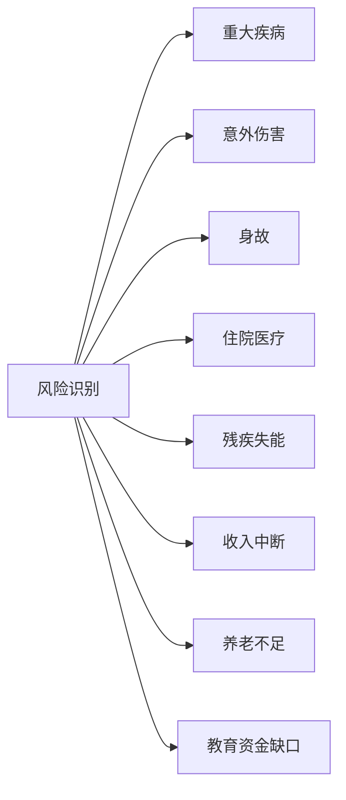
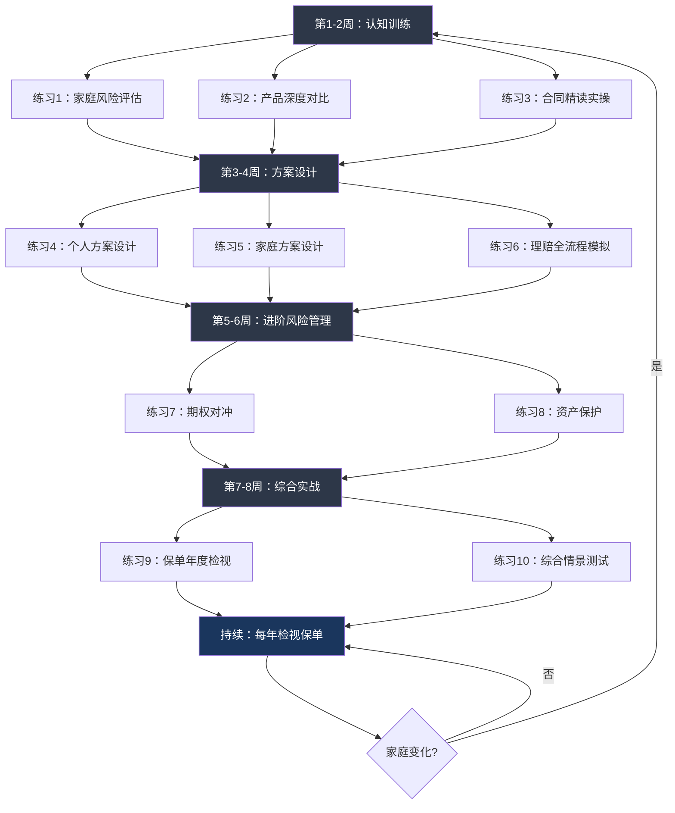

# 第二十九章 保险与风险管理 — 练习方法

保险与风险管理是一门实践性极强的学科。仅仅了解理论远远不够——你必须亲手做过风险评估、亲自对比过产品条款、亲自模拟过理赔流程，才能在真正需要时从容应对。本章设计了一套从入门到精通的完整训练体系，分为四个阶段、十个核心练习，每个练习都有明确的目标、可操作的步骤、验收标准和常见陷阱提醒。

**训练设计原则**：

| 原则 | 说明 |
|------|------|
| 学以致用 | 每个练习都基于真实场景，完成后可直接应用到个人/家庭保险决策 |
| 循序渐进 | 从认知→分析→设计→进阶，逐步构建完整能力 |
| 结果导向 | 每个练习都有明确的交付物和验收标准，不做无目的的"学习" |
| 错中学 | 每个练习都设计了容易犯错的环节，通过犯错来加深理解 |

**预期成果**：完成全部练习后，你将具备独立进行家庭保险方案设计、产品甄选、理赔操作的能力，不再依赖保险销售人员的推荐。

---

## 第一阶段：保险认知训练（第1-2周）

本阶段的目标是建立保险的基础认知框架。你需要学会识别家庭风险、看懂产品条款、理解保险合同的核心结构。这是后续所有练习的基石——如果看不懂保险合同，后面的一切方案设计都是空中楼阁。

### 练习1：家庭风险全景评估

**目标**：建立系统化的家庭风险评估能力，识别所有潜在的保障缺口。

**为什么这个练习重要**：大多数家庭要么不知道自己缺什么保障，要么只关注了某一种风险而忽略了其他风险。系统化的风险评估能帮你避免"盲人摸象"的困境——只摸到一条腿就以为保险就是买重疾险。

**练习步骤**：

**第一步：绘制家庭成员信息表**

创建一份完整的家庭成员档案，逐项填写以下信息：

| 家庭成员 | 年龄 | 职业 | 年收入 | 健康状况 | 已有保障 | 是否为经济支柱 |
|----------|------|------|--------|----------|----------|----------------|
| 本人 | | | | | 社保+团险 | 是/否 |
| 配偶 | | | | | | |
| 孩子 | | | | | | |
| 父亲 | | | | | | |
| 母亲 | | | | | | |

**健康状况栏**需要详细记录：是否有慢性病（高血压、糖尿病、甲状腺结节等）、近两年是否有住院记录、体检是否有异常指标（如BMI超标、血脂偏高等）、家族遗传病史（直系亲属是否有癌症、心血管疾病等）。

**已有保障栏**需要逐项列出：社保缴纳类型（职工/居民/新农合）、单位是否有补充医疗或团体险、是否购买过商业保险（逐一列出产品名和保额）。

**第二步：风险识别与概率评估**

针对每位家庭成员，逐一评估以下八类风险的发生概率和潜在损失：



使用以下评分框架：

| 风险类型 | 概率评估（1-5分） | 损失评估（1-5分） | 风险等级=概率×损失 | 应对优先级 |
|----------|-------------------|-------------------|---------------------|-----------|
| 重大疾病 | 2（家族有病史则3-4） | 5（治疗+收入损失） | | |
| 意外伤害 | 3 | 3-4 | | |
| 身故 | 1 | 5（有房贷/子女则5） | | |
| 住院医疗 | 4 | 2 | | |
| 残疾失能 | 1 | 5 | | |
| 收入中断 | 2-3 | 4 | | |
| 养老不足 | 5（确定发生） | 3 | | |
| 教育资金缺口 | 3（有子女） | 3 | | |

**评分说明**：
- 概率1分=极低（<1%/年），3分=中等（5-15%/年），5分=确定或很高（>30%/年）
- 损失1分=轻微（<1万），3分=中等（10-50万），5分=灾难性（>50万或不可承受）
- 风险等级≥15：必须转移（买保险）；10-14：建议转移；5-9：可部分自留；<5：建议自留

**第三步：计算保障缺口**

针对每位经济支柱，使用以下公式计算各类保障的需求额度：

**重疾险需求**：
```text
需求保额 = 治疗费用（30-50万） + 收入损失（年收入×3年） + 康复费用（10-20万）
缺口 = 需求保额 - 已有重疾险保额
```

**寿险需求**：
```text
需求保额 = 家庭负债总额 + 子女教育至成年的费用 + 父母赡养费用 - 已有储蓄
缺口 = 需求保额 - 已有寿险保额
```

**医疗险需求**：
```text
评估标准：是否有百万医疗险或中高端医疗险
已有社保只能解决基础问题，需要商业医疗险补充进口药、特需病房、海外就医等
```

**第四步：生成风险评估报告**

将以上所有数据汇总为一份报告，包含：家庭成员信息总表、各成员风险评分矩阵、各类保障缺口计算明细、保障缺口优先级排序、初步的配置建议方向。

**验收标准**：
- [ ] 完成每位家庭成员的详细信息表，无遗漏项
- [ ] 对每位成员完成了八类风险的评分，且评分有依据（不是随意填写）
- [ ] 计算了至少三种保障（重疾、寿险、医疗）的需求额度和缺口
- [ ] 报告中有明确的优先级排序（先保什么、再保什么）
- [ ] 报告总字数不少于1500字

**常见错误**：
1. 忽略了父母的保障需求——父母虽然不是经济支柱，但大病住院会拖垮整个家庭
2. 只算了治疗费用，没有算收入损失——重疾的真正成本是"治病+3年不工作"
3. 对已有保障过于乐观——社保报销比例通常只有70-85%，单位团险离职后就失效
4. 没有考虑负债——有200万房贷的人和无房贷的人，寿险需求完全不同

***

### 练习2：保险产品深度对比

**目标**：掌握保险产品对比的方法论，能够从条款层面而非销售话术层面判断产品优劣。

**为什么这个练习重要**：市场上有上百款重疾险，表面看都差不多（都是保重疾），但条款细节差异巨大——赔付次数、赔付比例、疾病定义、等待期、豁免条件等，每一个细节都可能在理赔时产生几万甚至几十万的差距。不会看条款的人只能听销售说，而销售推荐的产品往往是佣金最高的而非最适合的。

**练习步骤**：

**第一步：选定对比产品**

从以下渠道中选择3款同类型的重疾险产品进行对比：
- 深蓝保网站（shenlanbao.com）的产品库
- 奶爸保的重疾险测评文章
- 自己已经收到的保险方案书

选择标准：尽量选择同一年龄段（如30岁男性）、同一保额（50万）、保障期限相近的产品，这样对比才有意义。

**第二步：逐项对比以下关键维度**

| 对比维度 | 产品A | 产品B | 产品C | 判断要点 |
|----------|-------|-------|-------|----------|
| 保险公司 | | | | 大小公司不影响安全性 |
| 产品全称 | | | | 注意区分"XX版"和"XX版（附加XX）" |
| 年保费（30岁男/50万保额/30年缴） | | | | 同等条件下比较保费 |
| 保障病种（重疾） | | | | 28种统一定义的都一样，看额外病种 |
| 保障病种（轻症） | | | | 轻症没有统一定义，需要逐条对比 |
| 保障病种（中症） | | | | 有些产品有中症，有些没有 |
| 轻症赔付比例 | | | | 30%是主流，低于20%要警惕 |
| 轻症赔付次数 | | | | 3次以上基本够用，关注是否有隐性分组 |
| 中症赔付比例 | | | | 50-60%是主流 |
| 重疾赔付次数 | | | | 单次vs多次，多次是否分组 |
| 等待期 | | | | 90天优于180天 |
| 等待期内出险处理 | | | | 退还保费vs退现金价值，差异很大 |
| 被保人豁免 | | | | 轻症/中症后是否免交后续保费 |
| 投保人豁免 | | | | 需要额外附加，但很实用 |
| 保障期限选项 | | | | 保至70岁/80岁/终身 |
| 缴费期限选项 | | | | 越长越好（杠杆高+豁免价值大） |
| 身故责任 | | | | 赔保额vs赔已交保费vs赔现金价值 |
| 特定疾病额外赔 | | | | 如少儿特定疾病、成人特定疾病额外赔付 |
| 保单贷款功能 | | | | 紧急情况可质押保单贷款 |

**第三步：条款深度审查**

选择其中一款产品，找到它的正式保险条款（不是宣传页），完成以下分析：

1. **高发轻症覆盖检查**：逐条核对以下12种高发轻症是否全部覆盖：
   - 极早期恶性肿瘤（原位癌）
   - 不典型急性心肌梗塞
   - 轻微脑中风
   - 冠状动脉介入手术（非开胸）
   - 心脏瓣膜介入手术
   - 主动脉内手术
   - 视力严重受损
   - 听力严重受损
   - 脑垂体瘤/脑囊肿/脑动脉瘤及脑血管瘤
   - 较小面积III度烧伤
   - 慢性肾功能衰竭
   - 单侧肾脏切除

2. **疾病定义对比**：选择"恶性肿瘤"和"轻微脑中风"两项，逐字对比三款产品的定义，找出定义宽严差异。例如，有些产品对轻微脑中风要求"一侧肢体肌力III级或以下"，而宽松的产品只要求"一侧肢体肌力IV级或以下"。

3. **隐性分组检查**：如果产品是多次赔付重疾，检查重疾/轻症是否分组。分组意味着同一组内的疾病只能赔一次，实际降低了多次赔付的概率。

**第四步：综合评价**

基于以上对比，为每款产品打分（满分100分）：

| 评价维度 | 权重 | 产品A得分 | 产品B得分 | 产品C得分 |
|----------|------|-----------|-----------|-----------|
| 保障病种覆盖 | 20% | | | |
| 赔付比例和次数 | 20% | | | |
| 保费性价比 | 20% | | | |
| 等待期和豁免 | 15% | | | |
| 健康告知宽松度 | 10% | | | |
| 附加价值（绿通/增值服务） | 10% | | | |
| 公司服务口碑 | 5% | | | |
| **加权总分** | 100% | | | |

**验收标准**：
- [ ] 完成至少3款产品的15个以上维度的对比表格
- [ ] 完成了12种高发轻症的覆盖检查
- [ ] 至少对比了2个疾病的定义差异
- [ ] 给出了综合评分和最终推荐，并说明了推荐理由
- [ ] 能向一个不懂保险的人清晰解释"为什么选这款而不选那款"

**常见错误**：
1. 只比保费不比条款——便宜的产品可能在赔付比例或疾病定义上做了缩减
2. 被"保100种重疾"的宣传迷惑——28种法定重疾已经覆盖了95%以上的理赔，额外病种意义有限
3. 忽略了健康告知——条款再好，如果自己不符合健康告知也买不了
4. 没有对比等待期内出险的处理方式——90天等待期内确诊，有的退保费，有的只退现金价值

***

### 练习3：保险合同精读实操

**目标**：培养独立阅读和理解保险合同的能力，能够识别合同中的关键条款和潜在风险。

**为什么这个练习重要**：保险合同是你的保障的"法律基础"。理赔时，保险公司只看合同——销售口头说的不算数，宣传页写的不算数，只有白纸黑字的条款才算数。不会看合同，就等于签了一份自己不懂的法律文件。

**练习步骤**：

**第一步：获取一份真实保险合同**

获取渠道：
- 自己或家人已有的保险合同（最佳选择，因为和自身利益相关）
- 在保险公司官网下载电子版合同模板
- 在深蓝保、奶爸保等平台找到的产品条款PDF

**第二步：定位并标注以下核心条款**

用荧光笔或标注工具，逐一定位以下内容：

| 需要找到的条款 | 在合同中的位置 | 关键内容摘要 |
|----------------|----------------|-------------|
| 保险责任 | 通常在合同正文前部 | 具体保什么，赔付条件是什么 |
| 责任免除 | 紧跟保险责任之后 | 什么情况下不赔（重点中的重点） |
| 等待期 | 保险责任部分或通用条款 | 等待期多久，等待期内出险怎么处理 |
| 犹豫期 | 投保人权利部分 | 犹豫期多少天，退保能退多少 |
| 保险金额 | 保单首页或保险责任部分 | 基本保额是多少 |
| 保险期间 | 保单首页 | 保多久（定期还是终身） |
| 缴费期间和方式 | 保单首页 | 缴多少年，年缴还是月缴 |
| 受益人 | 保单信息页 | 法定还是指定，具体是谁 |
| 宽限期 | 合同效力部分 | 通常60天，宽限期内出险仍赔 |
| 复效条款 | 合同效力部分 | 停缴后如何恢复保单效力 |
| 现金价值表 | 合同附表 | 不同年份退保能拿回多少钱 |
| 如实告知义务 | 投保人义务部分 | 未如实告知的法律后果 |

**第三步：回答以下检验问题**

基于你标注的条款，逐一回答：

1. 这份保险保什么？（用自己的话总结，不超过200字）
2. 什么情况下保险公司不赔？（列出至少5种免责情况）
3. 等待期是多久？等待期内确诊会怎样？
4. 如果交了5年保费后退保，能拿回多少钱？（查现金价值表）
5. 如果忘记续交保费，保单多久内仍然有效？
6. 受益人写的是谁？如果要变更需要什么手续？
7. 保单是否可以质押贷款？贷款额度是多少？
8. 轻症理赔后，是否需要继续交保费？

**第四步：找出3个"坑"或容易被忽略的细节**

例如：
- 责任免除中是否有"既往症除外"条款
- 某些疾病的定义是否比行业标准更严格
- 等待期是180天还是90天（差异很大）
- 身故责任是赔保额还是赔已交保费
- 现金价值前几年是否极低（退保损失巨大）

**验收标准**：
- [ ] 完成了12个核心条款的定位和标注
- [ ] 正确回答了8个检验问题
- [ ] 找出了至少3个值得注意的条款细节
- [ ] 能用通俗语言向家人解释这份合同保什么、不保什么
- [ ] 形成了自己的"合同阅读笔记"，可以作为未来审阅其他合同的模板

**常见错误**：
1. 只看"保什么"不看"不保什么"——免责条款才是理赔时最容易产生纠纷的地方
2. 不看现金价值表——很多人以为退保能退回全部保费，实际上前几年退保可能损失60-80%
3. 忽略了"等待期内出险"的具体处理方式——是退保费还是退现金价值，差距可能上万
4. 把宣传页的承诺当合同条款——合同里没有的，保险公司在法律上没有赔付义务

***

## 第二阶段：方案设计训练（第3-4周）

本阶段的目标是将第一阶段学到的评估能力和条款分析能力，转化为实际的保险方案设计能力。你将为自己和不同类型的家庭设计完整的保险方案，并模拟理赔全流程。

### 练习4：个人保险方案设计

**目标**：根据个人实际情况，设计一份科学、合理、可执行的保险方案。

**为什么这个练习重要**：方案设计是保险配置的核心能力。它不是简单地选几款产品，而是需要在"保障充足"和"预算合理"之间找到平衡，在"当下需求"和"未来变化"之间做出规划。

**练习步骤**：

**第一步：个人信息梳理**

填写以下完整信息：

```text
一、基本信息
- 年龄：___岁
- 性别：___
- 职业：___（是否高危职业：是/否）
- 所在城市：___
- 婚姻状况：___
- 是否有子女：___（如有，年龄___）

二、健康状况
- 身高/体重：___/___（BMI是否超标）
- 是否有慢性病：___
- 近两年是否有住院/手术记录：___
- 体检是否有异常指标：___
- 家族遗传病史：___
- 是否吸烟：___

三、财务状况
- 年收入（税后）：___万
- 配偶年收入（如有）：___万
- 家庭年支出：___万
- 房贷余额：___万（剩余___年）
- 车贷余额：___万
- 其他负债：___万
- 储蓄/投资总额：___万
- 每月可支配结余：___元

四、已有保障
- 社保类型：___
- 单位补充医疗：有/无
- 单位团体险：有/无（如有，覆盖范围___）
- 已有商业保险：___（逐一列出产品名、保额、缴费状态）
```

**第二步：确定保险预算**

根据以下规则计算合理预算区间：

| 家庭年收入 | 建议年保费占比 | 预算范围 | 说明 |
|-----------|---------------|---------|------|
| 10万以下 | 5%-7% | 5000-7000元 | 优先保障型产品 |
| 10-30万 | 6%-8% | 6000-24000元 | 可以配置全面保障 |
| 30-50万 | 7%-10% | 21000-50000元 | 保障+适当理财 |
| 50万以上 | 8%-10% | 40000元以上 | 高保额+资产保护 |

**重要提醒**：以上是"占家庭总收入"的比例，不是个人收入。如果个人年收入20万但配偶无收入，应按家庭年收入计算。

**第三步：确定保障优先级**

使用以下优先级矩阵：

```text
优先级1（必须配置）：百万医疗险 + 意外险
  → 原因：保费低、杠杆高，解决大额医疗费用和意外伤害
  → 预算占用：约500-1000元/年

优先级2（强烈建议）：重疾险
  → 原因：弥补重疾期间的收入损失
  → 保额计算：年收入×3 + 治疗自费部分（通常30-50万起步）
  → 预算占用：3000-8000元/年（30岁，50万保额）

优先级3（有负债/有家庭责任）：定期寿险
  → 原因：身故后为家人留下一笔钱，覆盖负债和生活费
  → 保额计算：负债总额 + 子女教育费 + 5年家庭生活费 - 储蓄
  → 预算占用：1000-3000元/年（100万保额，保至60岁）

优先级4（预算充足时）：增额终身寿/年金险
  → 原因：长期储蓄和养老规划
  → 前提：优先级1-3已配置完毕
```

**第四步：选择具体产品并填写方案表**

```text
个人保险方案

基本信息：___岁，___职业，年收入___万，房贷___万

一、百万医疗险
  产品：___
  保额：___万
  年保费：___元
  选择理由：___

二、意外险
  产品：___
  保额：___万（意外身故/伤残）+ ___万（意外医疗）
  年保费：___元
  选择理由：___

三、重疾险
  产品：___
  保额：___万
  保障期限：___（保至70岁/80岁/终身）
  缴费期限：___年
  年保费：___元
  选择理由：___

四、定期寿险（如有负债/家庭责任）
  产品：___
  保额：___万
  保障期限：___（保至___岁）
  缴费期限：___年
  年保费：___元
  选择理由：___

五、方案汇总
  总保费：___元/年
  占年收入：___%
  保障缺口：___（如有，说明计划如何补充）
```

**第五步：方案自检**

回答以下问题来验证方案的合理性：
1. 如果确诊重疾，保险金能否覆盖治疗费用+3年收入损失？（是/否）
2. 如果意外身故，寿险+意外险的赔付能否覆盖房贷+家人5年生活费？（是/否）
3. 保费支出是否控制在年收入的10%以内？（是/否）
4. 是否优先保障了经济支柱？（是/否）
5. 如果预算砍半，方案中保留什么、去掉什么？

**验收标准**：
- [ ] 完成了详细的个人信息梳理
- [ ] 预算计算有明确依据
- [ ] 四种险种全部覆盖（或说明了为什么不需要某险种）
- [ ] 方案自检5个问题全部回答且有理有据
- [ ] 方案总字数不少于1000字

***

### 练习5：家庭保险方案设计（多场景）

**目标**：为不同类型的家庭设计保险方案，掌握多角色、多约束条件下的方案设计能力。

**为什么这个练习重要**：现实中的保险配置远比个人方案复杂——不同家庭成员的健康状况不同、年龄不同、需求不同，而且预算有限，必须在全家之间合理分配。这个练习让你面对真实的复杂性。

**练习步骤**：

**场景一：普通三口之家**

家庭情况：丈夫35岁（IT，年收入30万）、妻子32岁（行政，年收入12万）、孩子5岁、房贷余额150万、保险预算2.5万/年。

设计要点提示：
- 丈夫是主要经济支柱，保额应最高
- 定期寿险保额至少覆盖房贷余额
- 孩子不需要寿险，但需要重疾+医疗+意外
- 妻子的重疾保额可以适当低于丈夫

**场景二：单亲家庭**

家庭情况：母亲28岁（销售，年收入15万）、孩子3岁、无房贷但有20万车贷、保险预算1万/年。

设计要点提示：
- 母亲是唯一的经济支柱，保障必须最充足
- 预算有限时优先配百万医疗+意外+定期寿险
- 重疾险可以选择保至70岁的定期版本降低保费
- 孩子的保费占比控制在20%以内

**场景三：高龄父母**

家庭情况：父亲58岁（退休，有高血压）、母亲55岁（退休，有甲状腺结节）、保险预算1.5万/年。

设计要点提示：
- 58岁+高血压：大部分重疾险已无法投保，优先考虑防癌医疗险
- 55岁+甲状腺结节：需要走智能核保，部分产品可除外承保
- 老年人的优先级是医疗险（防癌医疗）>意外险>防癌险
- 不建议买返还型产品（保费倒挂）

**每个场景的交付物**：

```markdown
# 场景X：家庭保障方案

## 家庭基本信息
（填写完整信息）

## 风险评估
（识别主要风险和缺口）

## 保险方案
| 家庭成员 | 险种 | 产品 | 保额 | 年保费 |
|----------|------|------|------|--------|
| ... | ... | ... | ... | ... |

## 预算分析
总保费：___元，占家庭年收入：___%

## 方案说明
（为什么这样配置，优先级如何安排）

## 如果预算减半
保留什么？去掉什么？为什么？
```

**进阶挑战**：

| 挑战 | 说明 |
|------|------|
| 5000元/年预算极限方案 | 预算极低时，如何用最少的钱获得最重要的保障 |
| 30000元/年充裕方案 | 预算充足时，如何最大化保障范围和质量 |
| 健康异常场景 | 假设某家庭成员有乙肝小三阳，方案如何调整 |
| 准备生育场景 | 妻子计划1年内怀孕，保险配置需要考虑什么 |

**验收标准**：
- [ ] 完成至少3个场景的完整方案设计
- [ ] 每个方案都有风险评估→产品选择→预算分配的完整逻辑链
- [ ] 考虑了健康异常、年龄限制等实际约束
- [ ] 每个方案都有"预算减半"的备选方案
- [ ] 能解释"为什么这个人不买寿险"或"为什么那个产品选消费型不选返还型"

***

### 练习6：保险理赔全流程模拟

**目标**：完整模拟一次保险理赔的全过程，从出险到赔款到账，消除对理赔的陌生感和恐惧感。

**为什么这个练习重要**：很多人买了保险但不知道怎么理赔。真正出事时手忙脚乱，该准备的材料没准备、该报案的时间错过了、该保存的证据没保存，最终影响理赔结果。提前演练一遍，到时候就不会慌。

**练习步骤**：

**案例设定**：

假设以下场景：你（30岁男性）半年前购买了一份重疾险（保额50万）和一份百万医疗险（保额200万）。近期体检发现甲状腺结节，进一步检查后确诊为甲状腺乳头状癌（TNM分期I期），需要住院手术。

**第一步：报案模拟**

完成以下报案操作流程：

1. **确认报案时效**：确诊后应在多长时间内报案？（查阅合同条款）
2. **找到报案方式**：
   - 保险公司客服电话：___（填写具体号码）
   - 保险公司APP报案入口：___（截图保存）
   - 保险经纪人联系方式：___
3. **准备报案信息**：
   - 保单号：___
   - 被保险人姓名、身份证号：___
   - 出险时间、地点：___
   - 出险经过描述：___（不超过100字）
   - 就诊医院：___
4. **记录报案回执**：报案号、接线员工号、报案时间

**第二步：理赔材料准备清单**

逐项准备以下材料，并在"完成"栏打勾：

| 序号 | 材料名称 | 获取方式 | 完成 |
|------|----------|----------|------|
| 1 | 理赔申请书 | 保险公司APP下载或客服提供 | □ |
| 2 | 被保险人身份证正反面复印件 | 自行复印 | □ |
| 3 | 保险合同/电子保单 | 保险公司APP下载 | □ |
| 4 | 门诊病历 | 就诊医院门诊部打印 | □ |
| 5 | 住院病历（含入院记录、手术记录、出院小结） | 医院病案室复印（出院后7-14个工作日可取） | □ |
| 6 | 病理报告 | 病理科出具 | □ |
| 7 | 影像学检查报告（超声/CT等） | 影像科打印 | □ |
| 8 | 诊断证明 | 主治医生开具 | □ |
| 9 | 医疗费用发票原件 | 收费窗口打印（仅医疗险需要，重疾险不需要原件） | □ |
| 10 | 医疗费用清单 | 收费窗口或自助机打印 | □ |
| 11 | 社保报销结算单 | 社保窗口或医院医保办 | □ |
| 12 | 银行卡复印件（被保险人本人） | 自行复印 | □ |

**重要提醒**：
- 如果同时有重疾险和医疗险，医疗险需要发票原件，重疾险只需要诊断证明——所以先用医疗险报销，重疾险用复印件即可
- 住院病历通常出院后7-14个工作日才能从病案室复印，不要出院当天就去
- 所有材料建议保留一份电子版扫描件备份

**第三步：理赔金额计算**

| 险种 | 理赔条件 | 理赔金额计算 |
|------|----------|-------------|
| 重疾险 | 确诊即赔（甲状腺癌属于恶性肿瘤，符合重疾定义） | 保额50万，一次性到账 |
| 百万医疗险 | 减去社保报销和1万免赔额后报销 | 假设总费用8万，社保报销5万，自费3万，扣1万免赔额，报销2万 |

**计算练习**：

假设以下医疗费用明细，计算两个险种分别理赔多少：

```text
住院总费用：82,000元
其中：
- 手术费：35,000元（社保内15,000 + 社保外20,000）
- 药品费：22,000元（社保内8,000 + 社保外14,000）
- 检查费：12,000元（全部社保内）
- 床位费/护理费：8,000元（社保内5,000 + 社保外3,000）
- 其他：5,000元（社保内）

社保报销：___元（社保内部分×报销比例85%）
百万医疗险报销：___元（自费部分-免赔额1万）
重疾险赔付：___元（确诊即赔保额）

总计获赔：___元
个人实际负担：___元
```

**第四步：理赔争议应对模拟**

假设保险公司以"投保前已有甲状腺结节未如实告知"为由，拟拒赔重疾险。请设计应对方案：

1. 检查投保时的健康告知问卷：甲状腺结节是否在告知范围内？
2. 如果投保时确实有甲状腺结节但未告知：
   - 《保险法》第十六条：投保人故意或因重大过失未履行如实告知义务的，保险人有权解除合同
   - 但同时规定：合同成立超过两年的，保险人不得解除合同
   - 甲状腺癌和甲状腺结节的因果关系：如果结节是良性的，是否必然发展为癌症？
3. 应对策略：
   - 与保险公司沟通，提供投保前的体检报告证明结节性质
   - 如无法协商，向银保监会（12378热线）投诉
   - 最后手段：通过法律途径（保险合同纠纷诉讼）

**验收标准**：
- [ ] 完成了报案流程的完整模拟
- [ ] 列出了12项理赔材料的获取方式和时间
- [ ] 正确计算了重疾险和医疗险的理赔金额
- [ ] 设计了理赔争议的应对方案
- [ ] 理解了"先报医疗险、再报重疾险"的顺序和原因

***

## 第三阶段：进阶风险管理（第5-6周）

本阶段面向有一定基础的学员，涉及金融衍生品对冲、资产保护和法律工具等进阶内容。

### 练习7：期权对冲策略设计

**目标**：理解期权作为风险对冲工具的原理，能够设计基础的保护性看跌期权方案。

**为什么这个练习重要**：保险只能覆盖人身风险，但投资组合的市场风险需要用金融工具来管理。期权是最直接的"保险式"对冲工具——你支付一笔"权利金"（相当于保费），获得在市场下跌时以约定价格卖出的权利（相当于理赔）。

**练习步骤**：

**第一步：理解期权基础概念**

| 概念 | 说明 | 类比保险 |
|------|------|----------|
| 看涨期权（Call） | 有权在到期日前以约定价格买入标的资产 | — |
| 看跌期权（Put） | 有权在到期日前以约定价格卖出标的资产 | 类似"保险" |
| 行权价 | 约定的买卖价格 | 类似"保额" |
| 权利金 | 购买期权支付的费用 | 类似"保费" |
| 到期日 | 期权的有效期限 | 类似"保险期间" |
| 标的资产 | 期权对应的基础资产（如ETF、股票） | 类似"被保险人" |

**第二步：设计保护性看跌期权方案**

**场景**：你持有100万元沪深300ETF（假设当前价格4.0元/份，持有25万份），担心未来3个月市场可能下跌。

**方案设计**：

| 参数 | 设定 | 说明 |
|------|------|------|
| 标的 | 沪深300ETF期权 | 对应你持有的ETF |
| 方向 | 买入看跌期权（Put） | 市场下跌时获利，对冲ETF的损失 |
| 行权价 | 3.8元（低于当前价5%） | 设定一个你愿意承受的最大跌幅 |
| 到期日 | 3个月后 | 覆盖你担心的风险期 |
| 合约数量 | 需要对冲的份额÷每张合约对应份额 | 假设每张合约对应1万份ETF |
| 权利金 | 假设每份0.08元 | 总成本 = 25万份×0.08 = 2万元 |

**第三步：收益情景分析**

完成以下收益分析表：

| 市场情景 | ETF价格变动 | ETF持仓盈亏 | 期权盈亏 | 组合总盈亏 | 备注 |
|----------|------------|-------------|----------|------------|------|
| 大涨 | +20%（至4.8元） | +20万 | -2万（权利金全损） | +18万 | 放弃行权，享受上涨收益 |
| 小涨 | +10%（至4.4元） | +10万 | -2万 | +8万 | |
| 持平 | 0%（4.0元） | 0 | -2万 | -2万 | 仅损失权利金 |
| 小跌 | -10%（至3.6元） | -10万 | +3万（行权价3.8-市价3.6=0.2元×15万份） | -7万 | |
| 大跌 | -20%（至3.2元） | -20万 | +13万（(3.8-3.2)×25万份-2万权利金） | -7万 | 最大亏损被锁定 |
| 暴跌 | -30%（至2.8元） | -30万 | +23万 | -7万 | 无论跌多少，最大亏损锁定 |

**关键结论**：
- 保护性看跌期权的本质是"用固定成本（权利金2万）锁定最大亏损"
- 不看跌期权：最大亏损=ETF全部归零=100万
- 看跌期权：最大亏损=ETF跌到行权价+权利金=约7万
- 代价是：如果市场上涨，你的收益会减少2万（权利金成本）

**第四步：方案优化**

分析以下进阶问题：
1. 如果行权价设为3.6元（而不是3.8元），权利金会更便宜，但最大亏损会如何变化？
2. 如果选择卖出看涨期权（收取权利金）来抵消买入看跌期权的成本，这是什么策略？（领口策略Collar）
3. 期权到期后如果仍然担心，如何操作？（展期/滚仓）

**验收标准**：
- [ ] 理解了看涨/看跌期权、行权价、权利金等核心概念
- [ ] 完成了6种市场情景的收益计算
- [ ] 能清楚解释"为什么买期权相当于给投资组合上保险"
- [ ] 完成了至少一个优化方案的分析

***

### 练习8：资产保护方案设计

**目标**：了解高净值人群的资产保护工具和方法，能够设计基础的资产保护方案。

**为什么这个练习重要**：当个人资产达到一定规模（通常100万以上），面临的不仅是健康风险，还有经营风险、婚姻风险、债务风险、法律风险等。保险只是资产保护工具箱中的一种，还需要结合信托、法律架构等工具进行综合规划。

**练习步骤**：

**案例设定**：

你是一位38岁的企业主，经营一家年营收500万的小型科技公司。个人资产包括：公司股权（估值800万）、房产3套（总值600万，其中2套有贷款余额共300万）、银行存款200万、股票基金150万。已婚，有一个8岁的孩子。

**第一步：识别资产面临的主要风险**

| 风险类型 | 具体风险 | 潜在损失 | 当前应对措施 |
|----------|----------|----------|-------------|
| 经营风险 | 公司经营不善导致负债 | 可能连带个人资产 | |
| 债务风险 | 企业贷款需要个人担保 | 个人全部资产 | |
| 婚姻风险 | 婚变导致资产分割 | 50%资产 | |
| 健康风险 | 重大疾病丧失经营能力 | 收入+资产变现 | |
| 意外风险 | 意外身故 | 家庭失去经济来源 | |
| 税务风险 | 资产传承时的税务成本 | 20-40% | |
| 法律风险 | 经营纠纷导致诉讼 | 资产被冻结/执行 | |

**第二步：设计综合保护方案**

为每种风险设计对应的保护工具：

**1. 经营风险隔离**：
- 企业法人与个人资产的法律隔离：确保公司以有限责任公司形式经营，避免无限连带责任
- 避免用个人账户收公司款项（混同经营会刺穿公司面纱）
- 家庭主要资产（如自住房产）登记在配偶名下（需在债务产生前完成）

**2. 保险保护层**：
- 大额终身寿险（保额500万以上）：身故保障+资产传承，指定受益人为配偶和孩子
- 高端医疗险：保障最好的医疗资源
- 重疾险（保额100万以上）：弥补经营能力丧失后的收入损失
- 企业主关键人保险：以公司为投保人，保企业主的身故/重疾，保障公司运营

**3. 信托保护层**：
- 家族信托：将部分资产（如200万现金）置入信托，信托资产独立于个人资产，不受债务追索
- 保险金信托：将大额寿险的受益人设为信托，实现资产按条件分配（如孩子18岁后每年领取一定金额）

**4. 法律保护层**：
- 婚前/婚内财产协议：明确哪些资产属于个人财产
- 遗嘱规划：避免身故后资产分配纠纷
- 股权架构设计：通过有限合伙企业持有公司股权，实现控制权和所有权分离

**第三步：成本效益分析**

| 保护工具 | 设立成本 | 年维护成本 | 保护效果 | 适用场景 |
|----------|----------|-----------|----------|----------|
| 终身寿险（500万保额） | 年缴保费约8-12万 | 同左 | 身故保障+债务隔离 | 所有企业主 |
| 家族信托（200万起） | 设立费2-5万 | 管理费0.5-1%/年 | 资产隔离+传承控制 | 高净值家庭 |
| 保险金信托 | 设立费1-3万 | 管理费0.3-0.5%/年 | 保险金按条件分配 | 有未成年子女 |
| 婚前/婚内协议 | 律师费5000-2万 | 无 | 婚姻风险隔离 | 再婚/资产悬殊 |
| 遗嘱（律师见证） | 律师费3000-1万 | 定期更新 | 避免继承纠纷 | 所有人 |
| 企业股权架构调整 | 律师费2-5万 | 合规成本 | 控制权保护 | 有合伙人 |

**验收标准**：
- [ ] 识别了至少5种资产面临的风险
- [ ] 为每种风险设计了对应的保护工具
- [ ] 完成了成本效益分析表
- [ ] 理解了保险在资产保护中的独特优势（杠杆+确定性+法律保护）
- [ ] 方案中体现了"工具组合"的理念——单一工具无法解决所有问题

***

## 第四阶段：综合实战（第7-8周）

### 练习9：保单年度检视模拟

**目标**：掌握保单定期检视的方法，确保保障与家庭需求始终保持匹配。

**练习步骤**：

假设你3年前配置了一份保险方案，现在需要进行年度检视。请模拟以下变化并调整方案：

**原有方案**：30岁男性，年收入20万，已购重疾险50万、百万医疗200万、意外险50万、定期寿险100万，年保费合计8000元。

**变化情况**：
1. 收入增长到35万/年
2. 结婚，配偶28岁，年收入12万，无任何保险
3. 购买新房，新增房贷200万
4. 妻子怀孕，预产期3个月后

**检视任务**：
1. 评估现有保障是否需要调整（重疾险50万是否还够？寿险100万能否覆盖200万房贷？）
2. 为配偶设计保险方案
3. 考虑是否需要为即将出生的孩子预留保障预算
4. 计算调整后的总保费是否在合理范围内
5. 制定优先级：哪些必须立刻做、哪些可以等孩子出生后再做

**验收标准**：
- [ ] 识别出了所有需要调整的保障缺口
- [ ] 配偶方案设计合理（考虑了孕期投保的限制）
- [ ] 调整后的总预算在家庭年收入的8%以内
- [ ] 有明确的时间优先级排序

***

### 练习10：保险决策综合情景测试

**目标**：通过一系列真实情景测试，检验保险知识的综合运用能力。

**情景一**：你收到一份保险方案书，销售推荐了一款"全家桶"产品（重疾+寿险+医疗+意外捆绑在一起，年保费1.2万）。你应该怎么看这款产品？分析其利弊。

**情景二**：你的朋友告诉你"保险公司都不赔的，买保险没用"，并举了三个拒赔案例。你应该如何回应？从三个案例中找出拒赔的真实原因。

**情景三**：你父亲55岁，有高血压和糖尿病，想给他买一份重疾险。经过查询发现绝大部分产品无法投保。你该怎么办？列出所有可行的替代方案。

**情景四**：你买了两份医疗险（一份百万医疗200万、一份小额医疗1万），住院花了3万元，社保报销了1.5万。两份医疗险分别能报销多少？会不会重复报销？

**情景五**：你持有某公司股票50万元，担心半年内会大跌。除了直接卖出股票外，还有哪些方法可以对冲风险？各方法的优缺点是什么？

**每个情景的交付物**：不少于300字的分析，包含：问题诊断→核心矛盾→解决方案→决策理由。

---

## 持续学习体系

### 推荐学习资源

| 类别 | 资源名称 | 说明 | 适合阶段 |
|------|----------|------|----------|
| 入门书籍 | 《你的第一本保险指南》（槽叔著） | 保险入门最佳读物，语言通俗易懂 | 入门 |
| 进阶书籍 | 《保险常识100问》（知乎盐选） | 覆盖常见问题和误区 | 入门→进阶 |
| 条款解读 | 深蓝保（shenlanbao.com） | 产品测评、条款对比、方案设计 | 进阶 |
| 产品对比 | 奶爸保（naibabao.com） | 家庭保险方案设计思路 | 进阶 |
| 监管政策 | 国家金融监督管理总局官网 | 最新监管政策和消费者保护信息 | 全阶段 |
| 理赔实操 | 保险理赔案例分享（知乎专栏） | 真实理赔经历和经验总结 | 进阶 |
| 期权入门 | 《3小时快学期权》（上交所编） | 期权基础概念和策略 | 高级 |
| 资产保护 | 《家族财富保障与传承》（王芳著） | 家族信托和资产保护 | 高级 |

### 推荐工具

| 工具 | 用途 | 获取方式 |
|------|------|----------|
| 深蓝保产品对比工具 | 多款产品并排对比 | shenlanbao.com |
| 保险需求计算器 | 计算保额需求和预算 | 各保险平台均有 |
| 保单管理APP | 管理所有保单的缴费和保障信息 | 如"保险师"、"小雨伞"等 |
| 期权计算器 | 计算期权盈亏和策略分析 | 上交所期权APP |

### 学习路径图



### 练习完成自评表

完成所有练习后，用以下清单自评自己的能力水平：

| 能力项 | 能做到 | 需要加强 | 尚未掌握 |
|--------|--------|----------|----------|
| 能独立完成家庭风险评估 | □ | □ | □ |
| 能看懂保险合同的核心条款 | □ | □ | □ |
| 能对比3款以上产品的条款差异 | □ | □ | □ |
| 能为不同类型家庭设计保险方案 | □ | □ | □ |
| 能正确计算保额需求和保障缺口 | □ | □ | □ |
| 能完整操作保险理赔全流程 | □ | □ | □ |
| 能解释返还型vs消费型的本质区别 | □ | □ | □ |
| 能识别保险销售中的常见套路 | □ | □ | □ |
| 理解期权作为风险对冲工具的原理 | □ | □ | □ |
| 能进行保单年度检视和方案调整 | □ | □ | □ |

---

> **本节要点**：保险与风险管理的学习重在实践。通过10个循序渐进的练习——从家庭风险评估、产品条款对比、保险合同精读，到方案设计、理赔模拟、期权对冲和资产保护——你将建立起完整的保险配置能力体系。核心原则始终不变：先保障后理财、先大人后小孩、先条款后品牌、先需求后产品。掌握这些能力后，你不再需要依赖销售人员的话术，能够独立为自己和家人做出最优的保险决策。每年至少进行一次保单检视，随着家庭情况变化及时调整保障方案。
