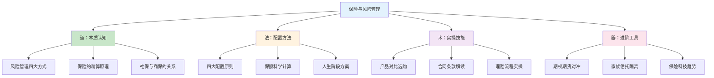
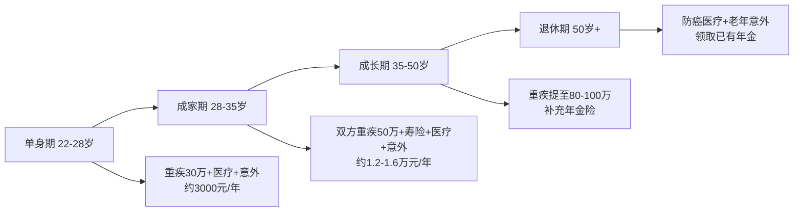

# 第二十九章 保险与风险管理 — 本章小结

## 一、全章知识体系总览

本章从"道、法、术、器"四个层面系统构建了保险与风险管理的完整知识框架。道是理解保险的本质——风险管理工具而非理财产品；法是掌握配置原则和科学方法论；术是学会具体的产品选购、方案设计和理赔操作；器是了解期权、期货、信托等进阶风险对冲工具。

---

## 二、核心知识点回顾

### 2.1 风险与保险的本质

风险是未来结果的不确定性，尤其指可能带来损失的不确定性。面对风险，人类有四种应对方式：**风险规避**（不做高危活动）、**风险自留**（自己承担小概率小损失）、**风险转移**（购买保险）、**风险控制**（安装防盗门、定期体检）。保险属于风险转移，其运作建立在**大数法则**之上——当承保的独立风险单位数量足够大时，实际损失率趋近于预期损失率，保险公司因此可以精确预测赔付并合理定价。

保费由两部分构成：**纯保费**（事故发生概率 × 平均赔付金额）和**附加保费**（运营成本、利润、佣金）。理解这个公式，就能明白为什么消费型保险比返还型便宜——返还型的附加保费中包含了保险公司代为投资的部分，而这部分收益通常低于你自行投资的收益。

**关键认知纠偏**：保险不是"花钱买平安"的消费，而是用小额确定支出转移大额不确定损失的财务策略。一个年收入30万的家庭支柱，如果没有任何保障，一次重大疾病就能让家庭财务归零。保险解决的不是"生病花钱"的问题，而是"收入中断"和"家庭财务崩溃"的问题。

### 2.2 保险分类与功能定位

本章系统梳理了六大险种，每种保险解决不同的风险维度：

| 险种 | 解决的核心问题 | 赔付方式 | 核心关注点 |
|------|---------------|---------|-----------|
| 定期寿险 | 身故后家庭收入中断 | 一次性给付 | 保额覆盖负债+5年生活费 |
| 终身寿险 | 身故保障+财富传承 | 一次性给付 | 适合高净值人群，杠杆率低 |
| 重疾险 | 确诊重疾后收入补偿 | 一次性给付 | 保额≥年收入3-5倍，关注轻症 |
| 百万医疗险 | 大额医疗费用报销 | 实报实销 | 保证续保条件、外购药覆盖 |
| 意外险 | 意外导致的伤残/身故/医疗 | 给付+报销 | 伤残保障（非全残）、意外医疗 |
| 年金险 | 养老/教育金的确定性规划 | 定期领取 | 先保障后理财，IRR计算真实收益 |

**给付型与报销型的核心区别**：重疾险、寿险、意外险的身故/伤残部分是给付型，可以多家投保叠加赔付；百万医疗险是报销型，总赔付不超过实际花费，买一份即可。这个区别直接影响配置策略——给付型保险可以在预算允许时适当多买，报销型保险买多了是浪费。

### 2.3 四大配置原则详解

本章提出的四大配置原则是整章的方法论基石，每一条背后都有清晰的逻辑支撑：

**原则一：先保障后理财**
保障型保险（重疾、医疗、寿险、意外）解决的是"活下去"的问题，理财型保险（年金、增额终身寿）解决的是"活得好"的问题。只有在基础保障充足之后，才应该考虑理财型保险。一个没有重疾险的人去买年金险，相当于房子没有地基就开始装修。

**原则二：先大人后小孩**
孩子的保费占比不应超过家庭总保费的20%。原因很直接：孩子生病，大人还能赚钱治疗；大人倒下，整个家庭失去经济来源。很多家庭的第一份保险是给孩子买的教育金，而大人没有任何保障——这是最典型的配置错误。

**原则三：先保额后保费**
保额不足等于没有保险。重疾险保额至少覆盖3-5年年收入（用于弥补治疗期间的收入损失），定期寿险保额至少覆盖家庭负债总额加5年基本生活费。宁可选择消费型保险把保额买够，也不要为了"返还"而降低保额。

**原则四：先规划后产品**
在选产品之前，必须先完成家庭风险评估和需求分析。具体步骤：计算家庭负债和支出需求总额，减去已有保障（社保、单位团险、已有商保、储蓄），得出保障缺口，再根据缺口和预算选择产品。没有规划就去买产品，很容易被销售话术牵着走。

### 2.4 保额计算的科学方法

保额不是拍脑袋决定的，而是通过需求分析法科学计算：

**重疾险保额计算**：
- 治疗费用：重大疾病平均治疗费用30-50万，社保报销后自费15-30万
- 收入损失：治疗和康复期间通常2-5年无法正常工作
- 康复费用：营养、护理、复查等长期支出
- 公式：重疾保额 ≈ 自费医疗费 + 年收入 × 3 + 康复费用

**定期寿险保额计算**：
- 房贷余额 + 车贷余额
- 子女教育至大学毕业的费用
- 父母赡养费用
- 家庭5年基本生活费
- 减去已有储蓄和投资
- 公式：寿险保额 = 家庭负债和支出需求 - 已有保障

**示例**：一个年收入30万、房贷150万、有8岁孩子的家庭支柱，保额计算如下：

| 项目 | 金额 |
|------|------|
| 房贷余额 | 150万 |
| 子女教育至大学毕业 | 80万 |
| 父母赡养费用 | 50万 |
| 家庭5年基本生活费 | 60万 |
| **合计需求** | **340万** |
| 减：储蓄投资 | -80万 |
| 减：社保抚恤 | -20万 |
| **保障缺口** | **240万** |

这意味着此人至少需要240万的定期寿险保额，以及50-80万的重疾险保额。

### 2.5 产品选购核心技巧

**重疾险选购**：
- 保额优先：预算有限选消费型，保额至少30万
- 轻症保障：关注高发轻症（原位癌、不典型心梗、轻微脑中风）是否覆盖
- 赔付次数：单次赔付 vs 多次赔付，预算充足选多次
- 豁免条款：投保人豁免和被保人豁免都要关注
- 等待期：90天优于180天

**百万医疗险选购**：
- 保证续保：这是最重要的指标，优先选择保证续保20年的产品
- 外购药报销：很多靶向药、特效药需要院外购买，必须覆盖
- 免赔额：通常1万免赔额，部分产品家庭共享免赔额更实用
- 增值服务：就医绿通、质子重离子治疗、海外就医

**定期寿险选购**：
- 保障期限：覆盖到退休年龄（60-65岁）即可
- 健康告知：越宽松越好，免责条款越少越好
- 价格差异：不同公司价格差异可达30%-50%，务必对比

**意外险选购**：
- 伤残保障：必须是"伤残"（按等级赔付），而非仅"全残"
- 意外医疗：关注是否限社保目录、免赔额、赔付比例
- 猝死保障：部分意外险包含猝死责任，对高压工作者很重要

### 2.6 理赔实操要点

理赔是保险价值的最终体现。本章详细梳理了从出险到收款的完整流程：

**理赔五步法**：

1. **及时报案**：重疾险确诊后10天内，医疗险住院后48小时内，意外险24小时内
2. **准备材料**：根据险种准备对应材料（重疾需病理报告和诊断证明，医疗需发票原件和费用清单，身故需死亡证明和户籍注销证明）
3. **提交申请**：通过APP线上提交或邮寄到网点
4. **等待审核**：小额理赔1-3个工作日，一般理赔5-10个工作日，复杂理赔30天内
5. **收款确认**：审核通过后1-3个工作日到账

**理赔被拒的五大原因**：
- 未如实告知健康状况（最常见，占拒赔案例的60%以上）
- 事故不在保障范围内
- 等待期内出险
- 触发免责条款
- 理赔材料不完整

**维权路径**：与保险公司协商 → 拨打保险公司投诉热线 → 拨打12378银保监会投诉热线 → 申请仲裁或诉讼。实际数据显示，银保监会介入后，大量理赔纠纷会得到有利于消费者的解决。

### 2.7 风险对冲工具

除了保险，本章还介绍了金融市场的风险对冲工具：

**保护性看跌期权**：持有股票组合的同时买入看跌期权，相当于为股票组合"上保险"。如果市场下跌，期权赔付弥补股票亏损；如果市场上涨，只损失权利金。以持有100万元沪深300ETF为例，买入一个月期平值看跌期权的权利金约为1.5-2万元（1.5%-2%），最大亏损被锁定在权利金范围内。

**股指期货对冲**：通过持有股指期货空头头寸对冲系统性风险。这种方式成本更低但操作更复杂，适合有期货交易经验的投资者。

**分散投资**：最简单有效的风险对冲方式。通过跨资产类别（股票、债券、商品、现金）、跨地域（国内、海外）、跨行业分散，可以显著降低组合波动率。理论上，持有15-20只相关性低的股票就能消除大部分非系统性风险。

### 2.8 资产保护与法律工具

资产保护是风险管理的高级层面，主要面向企业主和高净值人群：

**保险的债务隔离功能**：指定受益人的人寿保险金原则上不属于被保险人的遗产，不用于偿还债务。但有两个前提条件：一是投保时必须明确指定受益人（法定受益人不具备隔离功能）；二是在已有大额债务的情况下投保，可能被认定为"恶意避债"而被法院撤销。

**家族信托**：将资产委托给信托公司管理，实现资产所有权的转移。信托资产独立于委托人的其他资产，不受债务追索。设立门槛通常1000万起，适合超高净值家庭。信托的核心价值在于资产隔离和灵活传承——可以设定受益条件（如子女大学毕业才能领取），避免子女挥霍。

**婚前财产规划**：婚前购买的保险属于个人财产，婚后用个人财产缴纳的保费对应的保单价值也属于个人财产。但如果婚后用共同财产缴纳保费，保单价值中共同财产部分可能被分割。

**企业主的资产隔离**：企业经营风险可能波及个人资产。通过设立有限责任公司、购买董责险、合理规划保险和信托等方式，将个人资产与企业风险隔离开来。

### 2.9 十大误区深度解析

本章系统梳理了消费者在保险认知上的十大误区，每一个误区的背后都有深层原因：

| 误区 | 真相 | 核心启示 |
|------|------|---------|
| 保险是骗人的 | 理赔率97%以上，纠纷源于不了解条款 | 学会自己看懂合同 |
| 有社保就够了 | 社保不覆盖进口药、不补偿收入损失 | 社保是基础，商保是必要补充 |
| 先给孩子买保险 | 大人倒下家庭失去经济来源 | 先保经济支柱 |
| 返还型比消费型好 | 消费型+自行投资收益远超返还型 | 买消费型，省下的钱自己投资 |
| 保险越多越好 | 医疗险不能重复报销 | 合适比多更重要 |
| 只看品牌不看产品 | 理赔看合同条款不看公司大小 | 条款对比比品牌对比重要 |
| 健康告知可以隐瞒 | 保险公司可调取医院、医保、体检记录 | 如实告知是顺利理赔的前提 |
| 保险可以避债避税 | 恶意避债可被法院撤销 | 合法合规是底线 |
| 理赔很难 | 97%以上理赔率，大部分纠纷源于告知问题 | 如实告知+完整材料=顺利理赔 |
| 买了就不用管了 | 收入、家庭、负债变化都需要调整方案 | 每年至少检视一次保单 |

**最核心的两点认知**：
1. 保险的本质是风险管理工具，不是投资理财产品。买保险的目的不是为了赚钱，而是确保在最坏的情况下家庭生活不会被彻底改变。
2. 投保时的诚信和对条款的理解是顺利理赔的前提。不依赖销售人员的"话术"，学会自己看懂保险合同，是保护自身权益的最好方式。

---

## 三、不同人生阶段的保险方案框架

本章为不同人生阶段提供了具体的保险配置参考：

**预算分配建议**（以家庭年收入5%-10%为总保费上限）：
- 重疾险：40%-50%（保额充足是第一优先级）
- 定期寿险：15%-20%（覆盖负债是核心）
- 百万医疗险：5%-10%（几百元解决大额医疗费）
- 意外险：5%-10%（杠杆率最高的险种）
- 其他（年金、教育金等）：20%-30%（保障充足后再考虑）

**预算紧张时的优先级排序**：
1. 百万医疗险（每年几百元，解决大额医疗费）
2. 意外险（每年一两百元，杠杆率最高）
3. 定期寿险（有房贷必买）
4. 重疾险（预算允许就买充足保额）

---

## 四、从理论到前沿：保险行业的深层逻辑

### 4.1 精算科学与定价逻辑

保险产品的定价建立在精算科学之上。精算师通过大数法则、生命表和风险选择模型，将不确定性转化为可计算的概率。中国的生命表（2010-2013版）是寿险定价的基础——例如，30岁男性在60岁前死亡的概率约为3.2%，一份保障至60岁的定期寿险的纯保费就基于这个概率加上货币时间价值来计算。

理解精算原理的实际价值在于：你能看懂为什么年龄越大保费越贵（死亡/患病概率上升）、为什么男性比女性贵（平均寿命更短）、为什么吸烟者保费更高（患病风险显著增加），从而在投保时做出更理性的决策。

### 4.2 保险科技的变革力量

保险行业正在经历科技驱动的深刻变革：

- **智能核保**：AI模型分析医疗影像和电子病历，实现秒级核保决策
- **智能理赔**：图像识别自动评估车损，中国平安已实现车险"秒赔"
- **参数保险**：基于预设参数（如降雨量、航班延误时间）自动触发赔付，无需损失评估
- **按需保险**：按天购买的航延险、按使用付费的车险，适合灵活就业和共享经济场景
- **嵌入式保险**：购买电子产品自动附带延保，租车自动包含保险，降低消费者决策成本
- **健康管理型保险**：通过可穿戴设备监测健康数据，健康行为可获保费折扣

这些变化对消费者的实际影响是：未来买保险会更方便、更便宜、更个性化。但同时也意味着你需要更加关注自己的数据隐私和保险条款的变化。

### 4.3 全球视角与中国机遇

中国保险深度（保费/GDP）仅为4.5%，保险密度（人均保费）约500美元，远低于美国的11.4%和8500美元。这意味着中国保险市场仍有巨大增长空间。随着"健康中国2030"战略推进、个人养老金制度落地、惠民保等创新产品普及，中国消费者的保险意识和保障水平将快速提升。

---

## 五、实践行动清单

基于全章内容，以下是一份可立即执行的行动清单：

**第一步：家庭风险评估（本周完成）**
- 列出家庭所有成员的年龄、职业、健康状况
- 计算家庭年收入、年支出、负债总额
- 盘点已有保障（社保、单位团险、已有商业保险）
- 用"需求分析法"计算保障缺口

**第二步：基础保障配置（本月完成）**
- 优先配置百万医疗险和意外险（几百元搞定基础保障）
- 如有房贷或家庭责任，配置定期寿险
- 预算允许的情况下配置重疾险

**第三步：方案完善（3-6个月内完成）**
- 逐一比较产品条款，选择性价比最高的产品
- 完成所有投保，确保如实告知健康状况
- 将保单信息整理归档，告知家人

**第四步：持续管理（每年至少一次）**
- 每年检视一次家庭保单，根据收入、家庭、负债变化调整方案
- 关注保险产品更新，必要时更换更优产品
- 保单到期前及时续保或更换

**第五步：进阶学习（持续进行）**
- 学会独立阅读保险合同，不依赖销售人员的话术
- 了解期权、期货等金融对冲工具的基本原理
- 关注保险科技发展趋势，利用新工具优化保障方案

---

## 六、一句话总结

> 保险的本质是风险管理，不是投资。买保险的目的不是为了赚钱，而是为了确保在最坏的情况下，你和家人的生活不会被彻底改变。用科学的方法配置保险——先保障后理财、先大人后小孩、先保额后保费、先规划后产品；用严谨的态度投保——如实告知、看懂条款、比较产品；用持续的习惯管理——定期检视、动态调整。这三步做好，保险就真正成为了家庭财务安全的压舱石。
