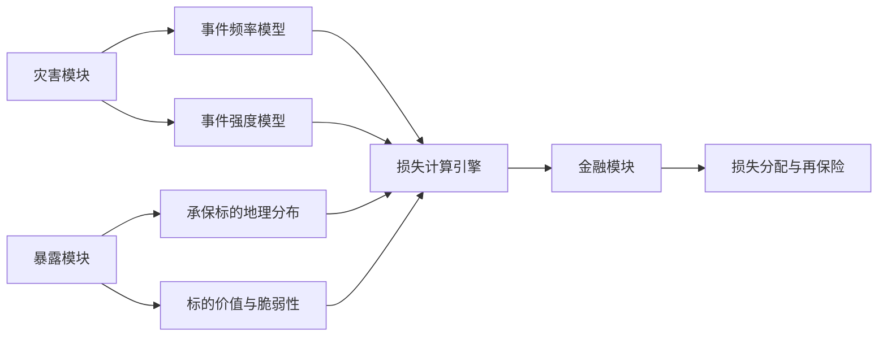
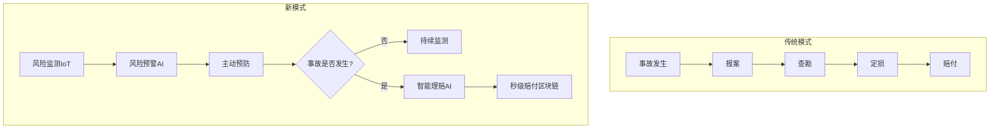
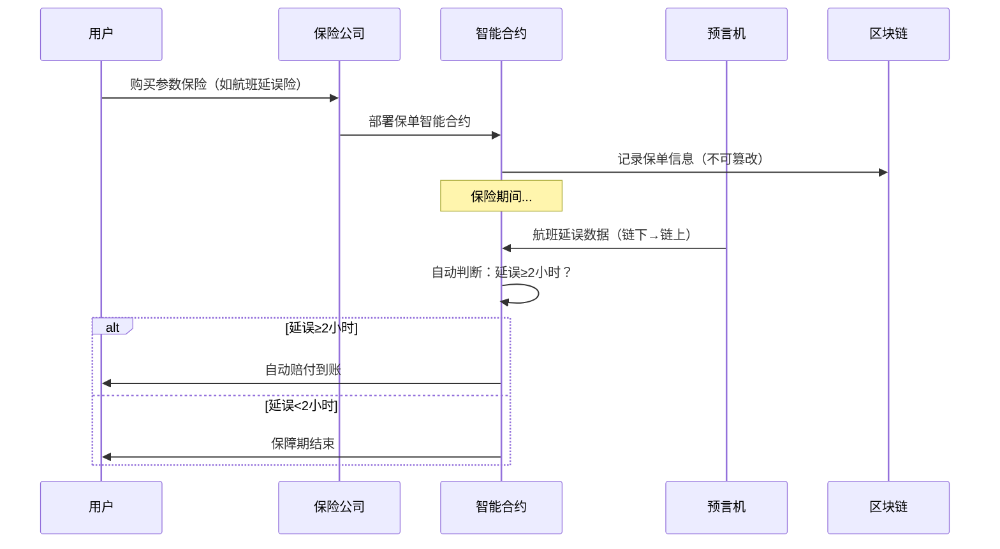
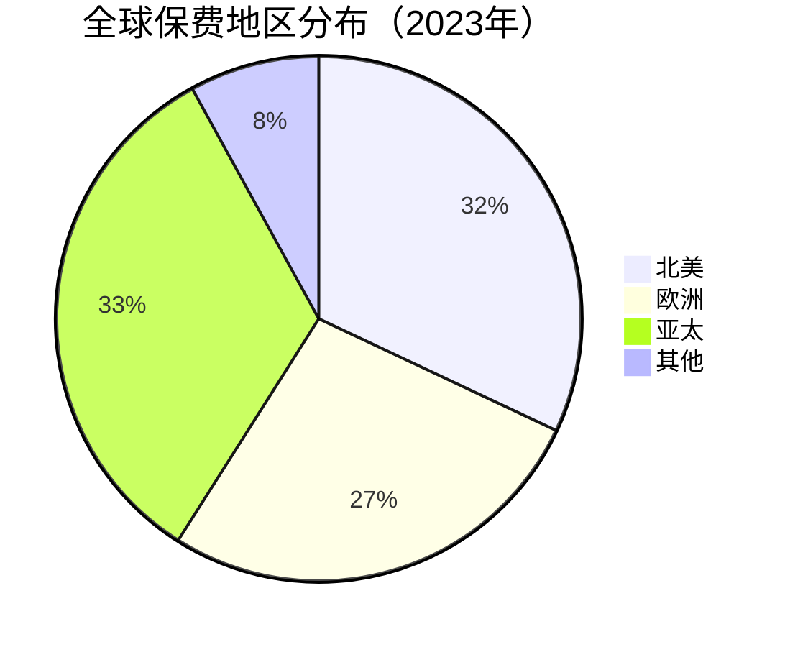

# 保险与风险管理深度拓展

本章从精算科学、保险科技、全球市场、欺诈防范、产品创新五个维度，对保险与风险管理进行深度拓展。目标是让你不仅知道"是什么"，更理解"为什么"和"怎么做"——从底层原理到前沿趋势，构建完整的保险认知体系。

---

## 一、保险精算原理

精算学是保险行业的"操作系统"。每一份保单的价格、每一项保险责任的设计、每一个准备金数字的背后，都是精算模型在运转。理解精算原理，能让你看透保险产品的本质，不再被销售话术左右。

### 1.1 精算学的核心框架

#### 大数法则与保险定价的数学基础

保险之所以能够存在，根本原因是**大数法则**（Law of Large Numbers）。这个定律告诉我们：当独立随机事件的样本量足够大时，事件发生的频率会趋近于其理论概率。

用数学语言表达：设 $X_1, X_2, ..., X_n$ 是独立同分布的随机变量，期望为 $\mu$，则当 $n \to \infty$ 时：

$$\bar{X}_n = \frac{1}{n}\sum_{i=1}^{n}X_i \xrightarrow{P} \mu$$

**对保险的实际意义**：一家承保了100万份保单的公司，每份保单事故发生率为0.1%，那么实际赔付率将以极高的概率（>99.9%）落在0.09%-0.11%之间。这就是保险公司能够精确定价的数学基础。

**精算定价的三层结构**：

```text
保费 = 纯保费 + 附加保费 + 利润附加

其中：
  纯保费 = E(损失) = 事故发生概率 × 平均赔付金额
  附加保费 = 运营成本 + 渠道费用 + 管理费用
  利润附加 = 风险边际 + 利润目标
```

**实际定价示例**：假设一款30岁男性的定期寿险，保额100万元，保障至60岁：

| 参数 | 数值 | 说明 |
|------|------|------|
| 年死亡概率 | 0.0012 | 基于生命表 |
| 30年累计死亡概率 | 约3.5% | 考虑年龄递增 |
| 纯保费（年缴） | 约1,200元 | 100万 × 0.0012 |
| 附加费用率 | 35% | 含渠道、运营、管理 |
| 毛保费（年缴） | 约1,850元 | 1,200 / (1-35%) |
| 实际市场价 | 1,500-2,200元 | 竞争定价调整 |

#### 生命表与寿险定价

生命表（Mortality Table）是寿险精算的基石工具。它记录了特定人群在各年龄段的死亡率和生存率，是计算寿险保费的核心数据源。

**中国人身保险业经验生命表（2010-2013）核心数据**：

| 年龄 | 男性死亡率 | 女性死亡率 | 男性生存人数（初始10万） |
|------|-----------|-----------|------------------------|
| 0 | 0.000627 | 0.000455 | 100,000 |
| 20 | 0.000832 | 0.000354 | 99,321 |
| 30 | 0.001165 | 0.000537 | 98,487 |
| 40 | 0.002341 | 0.001253 | 96,832 |
| 50 | 0.005782 | 0.003124 | 93,156 |
| 60 | 0.014523 | 0.008234 | 85,423 |
| 70 | 0.036782 | 0.022456 | 68,234 |
| 80 | 0.089234 | 0.061234 | 38,567 |

**生命表在定价中的应用**：

以30岁男性投保20年期定期寿险、保额100万为例：

```text
第1年赔付现值 = 100万 × 0.001165 / (1+3.5%)^1 = 1,125.60元
第2年赔付现值 = 100万 × 0.001198 / (1+3.5%)^2 = 1,117.83元
...（逐年计算）
第20年赔付现值 = 100万 × 0.002341 / (1+3.5%)^20 = 1,168.42元

纯保费 = 所有年份赔付现值之和 / 缴费期现值因子
```

**中国生命表的演进**：

- **1990-1993表**：第一张行业经验生命表，数据来源于中国人民保险公司
- **2000-2003表**：数据量大幅增加，覆盖主要寿险公司
- **2010-2013表**：当前使用版本，新增养老类业务表，区分了保障型和储蓄型业务
- **2023年**：新版生命表编制工作启动，预计将反映近年来死亡率持续下降的趋势

#### 风险选择与核保技术

精算不仅用于定价，还用于风险选择（Risk Selection）。核保（Underwriting）是保险公司评估投保人风险等级、决定是否承保及如何定价的过程。

**传统核保五要素**：

1. **年龄**：最基础的风险因子。不同年龄段的死亡率、发病率差异巨大
2. **性别**：女性平均寿命比男性长约5-7年，女性寿险保费通常更低
3. **健康状况**：BMI、血压、血糖、血脂等指标，以及既往病史
4. **家族病史**：直系亲属的心脑血管疾病、癌症等病史
5. **职业与生活习惯**：高危职业（矿工、消防员）保费上浮；吸烟者保费通常比非吸烟者高30%-50%

**现代智能核保的技术栈**：

```text
传统核保：人工审核 → 体检报告 → 风险分级 → 手动定价（周期：7-15天）

智能核保：
  数据采集层：电子病历(EMR) + 医保数据 + 可穿戴设备 + 生活方式问卷
  ↓
  风险评估层：机器学习模型（GBDT/XGBoost）→ 风险评分
  ↓
  决策层：规则引擎 + 风险评分 → 自动核保决策（秒级）
  ↓
  监控层：持续健康监测 → 动态风险调整
```

**核保结果的五种类型**：

| 结果 | 含义 | 常见场景 |
|------|------|----------|
| 标准体承保 | 正常费率承保 | 健康状况良好 |
| 次标准体承保 | 加费承保（加费20%-100%） | 轻度脂肪肝、BMI偏高 |
| 除外承保 | 某些疾病不保 | 甲状腺结节（除外甲状腺癌） |
| 延期承保 | 暂不承保，观察一段时间 | 术后恢复期、孕产妇 |
| 拒保 | 不予承保 | 严重既往病史 |

### 1.2 非寿险精算的独特挑战

非寿险精算（财产险、责任险、车险等）面临比寿险更复杂的挑战：事故频率和严重程度波动更大，受自然灾害、社会事件等外部因素影响显著。

#### 巨灾建模

巨灾建模（Catastrophe Modeling）是非寿险精算中最重要的技术之一。它通过计算机模拟，评估极端事件（地震、台风、洪水、恐怖袭击）对保险公司的潜在损失。

**巨灾建模的四个核心模块**：



1. **灾害模块**：模拟自然灾害的发生频率和强度分布。例如，地震模型基于板块构造理论和历史地震数据，台风模型基于海温数据和大气环流模型
2. **暴露模块**：承保标的的地理位置、建筑类型、价值分布等信息
3. **脆弱性模块**：不同建筑类型在不同强度灾害下的损失率曲线
4. **金融模块**：将物理损失转化为保险损失，考虑免赔额、赔偿限额、再保险安排等因素

**全球三大巨灾建模公司**：

| 公司 | 成立时间 | 总部 | 特色 |
|------|----------|------|------|
| AIR Worldwide | 1987年 | 波士顿 | 地震模型领先，被Verisk收购 |
| RMS | 1989年 | 纽瓦克 | 台风模型强，被Moody's收购 |
| EQECAT | 1994年 | 旧金山 | 洪水模型突出，被CoreLogic收购 |

**中国巨灾保险的现状与差距**：

2008年汶川地震造成超过8,400亿元直接经济损失，但保险赔付仅约16.6亿元（占2%），远低于发达国家30%-40%的水平。这一巨大差距反映了中国巨灾保险制度的不足。

**中国巨灾保险试点**：

- **深圳**：2014年率先试点巨灾保险，由政府出资为全体市民购买，覆盖台风、暴雨、泥石流等灾害
- **宁波**：2014年推出公共巨灾保险，覆盖台风、强热带风暴、龙卷风
- **广东**：2015年推出巨灾指数保险，以气象参数作为赔付触发条件
- **四川**：地震巨灾保险试点，城乡居民住宅地震保险

#### 准备金评估

保险公司需要为未来可能的赔付计提准备金（Reserves）。准备金评估的准确性直接影响保险公司的财务稳健性。

**非寿险准备金的三大类型**：

1. **未到期责任准备金**（Unearned Premium Reserve, UPR）：已收取但保障期尚未结束的保费对应的责任
2. **未决赔款准备金**（Outstanding Claims Reserve）：已报告但尚未赔付的赔案，以及已发生但尚未报告的赔案（IBNR）
3. **理赔费用准备金**：处理赔案所需的费用

**链梯法（Chain Ladder Method）**——最常用的准备金评估方法：

链梯法基于历史赔付模式的延续性假设，通过发展因子（Development Factor）预测最终赔付金额。

```text
发展三角形示例（单位：万元）：

事故年  发展年1  发展年2  发展年3  发展年4  最终赔付
2020    1000    1500    1700    1750    1750
2021    1100    1650    1870    ?
2022    1200    1800    ?       ?
2023    1300    ?       ?       ?

发展因子计算：
  f(1→2) = (1500+1650+1800) / (1000+1100+1200) = 1.500
  f(2→3) = (1700+1870) / (1500+1650) = 1.133
  f(3→4) = 1750 / 1700 = 1.029

外推预测：
  2023年最终赔付 = 1300 × 1.500 × 1.133 × 1.029 = 2,263万元
  2023年准备金 = 2,263 - 1,300 = 963万元
```

**IBNR（已发生未报告）准备金**：这是准备金评估中最不确定的部分。以长尾责任险（如产品责任险、环境污染责任险）为例，事故发生后可能经过数年甚至数十年才被发现和报告，IBNR准备金可能占总准备金的30%-50%。

---

## 二、保险科技（InsurTech）发展

保险科技正在重塑保险行业的每一个环节——从产品设计、风险评估、销售渠道到理赔服务。理解InsurTech的发展逻辑，能帮助你判断哪些保险创新是真正有价值的，哪些只是噱头。

### 2.1 InsurTech的演进历程

#### 第一阶段（2010-2015）：渠道创新

核心命题：**消灭信息不对称**

传统保险销售依赖代理人渠道，代理人佣金通常占首年保费的30%-50%。互联网渠道的出现，让消费者可以绕过中间环节，直接比较和购买保险产品。

**代表性平台**：

| 平台 | 地区 | 模式 | 影响 |
|------|------|------|------|
| 慧择保险 | 中国 | 互联网保险经纪 | 首家赴美上市的中国互联网保险平台 |
| Policygenius | 美国 | 在线比价+智能推荐 | 简化了寿险购买流程 |
| GoCompare | 英国 | 车险/家财险比价 | 推动了英国车险价格透明化 |
| 蚂蚁保险 | 中国 | 场景化保险分发 | 退货运费险开创场景保险先河 |

#### 第二阶段（2015-2020）：产品创新

核心命题：**用技术重新定义风险**

大数据和机器学习使得个性化定价成为可能。保险公司不再只能按年龄、性别等粗粒度因子定价，而是可以基于行为数据实现精准定价。

**关键创新**：

- **UBI车险**（Usage-Based Insurance）：基于驾驶行为（里程、急刹车频率、夜间驾驶比例）定价。Root Insurance通过手机传感器收集驾驶数据，为安全驾驶者提供高达40%的保费折扣
- **按天保险**：航班延误险从"按次购买"演变为"按小时购买"，延误2小时即触发赔付
- **共享经济保险**：为Airbnb房东、Uber司机等灵活就业者设计的保险产品

#### 第三阶段（2020至今）：生态系统重构

核心命题：**从"事后补偿"到"事前预防"**

保险的角色从被动的损失补偿者，转变为主动的风险管理者。AI、IoT、区块链三驾马车驱动这一转变。



### 2.2 核心技术应用

#### 人工智能在保险中的应用

**智能核保**：AI模型可以分析医疗影像、电子病历等多维数据，实现秒级核保决策。

具体案例：
- **日本富国生命保险**（2017年）：引入IBM Watson辅助核保，将寿险核保时间从平均2周缩短至数小时。Watson可以分析投保人的医疗记录、体检报告，自动识别风险因子并给出核保建议
- **中国平安**：自研AI核保系统，覆盖300+疾病类型的智能核保规则，核保自动化率超过80%
- **Lemonade**（美国）：利用AI聊天机器人完成投保全流程，用户只需回答13个问题即可获得报价，最快3分钟完成投保

**智能理赔**：AI正在彻底改变理赔体验。

| 应用场景 | 技术 | 效果 | 案例 |
|----------|------|------|------|
| 车险定损 | 图像识别+深度学习 | 秒级定损 | 平安"智能定损"：拍照→AI评估→报价，平均3分钟 |
| 健康险理赔 | NLP+知识图谱 | 自动审核 | 众安保险：自动化理赔审核率超过70% |
| 农险查勘 | 卫星遥感+无人机 | 远程定损 | 中华联合农险：卫星遥感评估受灾面积 |
| 旅行险理赔 | 区块链+智能合约 | 自动赔付 | 航班延误险：延误触发→自动赔付，零人工干预 |

**智能客服**：保险公司的客服成本占运营成本的15%-20%。AI聊天机器人可以处理80%以上的常见咨询（保单查询、保费缴纳、理赔进度查询等），将人工客服聚焦于复杂问题。

**反欺诈**：详见本章第四节。

#### 区块链在保险中的应用

区块链解决的核心问题是**信任**。保险行业中的信任问题包括：保单信息篡改、理赔流程不透明、跨公司数据孤岛。

**智能合约自动理赔的运作机制**：



**B3i联盟**（Blockchain Insurance Industry Initiative）：2016年由Aegon、Allianz、Munich Re、Swiss Re、Zurich等全球大型保险公司联合发起，探索区块链在再保险、巨灾债券等领域的应用。

**区块链保险的局限性**：

- 链上数据的准确性依赖"预言机"（Oracle），预言机本身可能被操纵
- 智能合约一旦部署难以修改，灵活性不足
- 链上交易速度和成本限制了大规模应用
- 监管框架尚不明确

#### 物联网与保险

物联网（IoT）设备为保险公司提供了前所未有的实时数据来源，使得风险评估从"基于历史数据"转向"基于实时数据"。

**IoT保险应用全景**：

| 设备类型 | 数据采集 | 保险应用 | 效果 |
|----------|----------|----------|------|
| 车载OBD | 驾驶行为、里程、急刹车 | UBI车险 | 安全驾驶者保费降低20%-40% |
| 智能手环/手表 | 心率、步数、睡眠 | 健康险动态定价 | 健康行为奖励保费折扣 |
| 智能烟感 | 烟雾浓度、温度 | 家财险风险预警 | 火灾发生前预警，降低损失 |
| 智能水表 | 水流量异常 | 家财险漏水检测 | 漏水事故减少60%+ |
| 工业传感器 | 设备振动、温度、压力 | 财产险+责任险 | 预测性维护，减少事故 |

### 2.3 中国InsurTech的特色发展

中国的保险科技发展走出了一条与欧美不同的路径，具有鲜明的本土特色。

**场景保险**：中国是全球场景保险的领跑者。场景保险是指在特定消费场景中嵌入的碎片化保险产品。

典型案例：
- **退货运费险**（2010年，蚂蚁集团）：网购退货时自动赔付运费。2023年"双11"期间，退货运费险投保量超过10亿单。保费仅0.5-2元/单，但通过海量数据积累，实现了精准的风险定价
- **账户安全险**：支付宝账户被盗刷时赔付，保费1-5元/年，保额100万
- **碎屏险**：手机屏幕碎裂时赔付换屏费用
- **宠物医疗险**：宠物看病报销

**相互宝模式的兴衰**：

相互宝（2018-2022）是蚂蚁集团推出的网络互助计划，巅峰时期用户超过1亿人。它不是严格意义上的保险，而是一种"一人患病，众人分摊"的互助模式。

- **优势**：门槛低（0元加入，按期分摊）、透明（公示所有案件）、普惠（覆盖了大量传统保险触达不到的人群）
- **问题**：监管定位模糊（不是保险，不受保险法约束）、逆选择风险（健康人群退出导致分摊金额上升）、理赔争议（部分案件认定标准不统一）
- **结局**：2022年1月关停，反映了互助模式在监管和可持续性方面的挑战

**监管科技（RegTech）**：

银保监会（现国家金融监督管理总局）推动的"偿二代"（C-ROSS，中国风险导向的偿付能力体系）是中国保险监管科技的核心框架。它要求保险公司基于风险资本计算偿付能力充足率，实现了从"规则导向"到"风险导向"的监管转变。

---

## 三、全球保险市场比较

### 3.1 全球保险市场的格局

2023年，全球保费总额约为6.8万亿美元，其中寿险约占46%（3.1万亿美元），非寿险约占54%（3.7万亿美元）。

**全球保费地区分布**：



**主要保险市场深度对比**：

"保险深度"（保费/GDP）反映保险业在国民经济中的地位；"保险密度"（保费/人口）反映人均保险消费水平。

| 市场 | 保险深度 | 保险密度 | 核心特征 | 代表公司 |
|------|----------|----------|----------|----------|
| 美国 | 11.4% | $8,500 | 产品创新活跃，健康险占比大（40%+），科技驱动 | Berkshire Hathaway, UnitedHealth |
| 英国 | 10.5% | $4,200 | 劳合社（Lloyd's）模式，全球再保险中心，精算人才输出地 | Prudential, Aviva |
| 日本 | 8.3% | $3,100 | 寿险高度发达（全球第三），老龄化驱动养老险需求 | 日本生命, 第一生命 |
| 德国 | 6.3% | $2,800 | 健全社保体系（法定医保+法定养老），商业保险作为补充 | Allianz, Munich Re |
| 中国 | 4.5% | $500 | 增速快（年均10%+），渗透率低，潜力巨大 | 中国人寿, 平安, 太保 |
| 印度 | 3.7% | $80 | 市场潜力大（14亿人口），外资限制多，保险意识薄弱 | LIC, ICICI Prudential |

### 3.2 中国保险市场的发展趋势

中国保险市场正在经历从高速增长向高质量发展的转变。理解这些趋势，有助于把握个人保险决策的时机。

**趋势一：健康险的崛起**

"健康中国2030"战略推动下，健康险成为增速最快的险种。2023年健康险保费收入约8,000亿元，占人身险保费的22%。

**惠民保的崛起与影响**：

惠民保（城市定制型商业医疗保险）是近年来中国健康险市场最重要的创新。它由地方政府指导、商业保险公司承保，保费通常在100-200元/年，保额100-300万元，不限年龄、不限职业、允许带病投保。

| 维度 | 百万医疗险 | 惠民保 |
|------|-----------|--------|
| 保费 | 1,000-3,000元/年（随年龄增长） | 100-200元/年（统一价格） |
| 免赔额 | 1万元 | 1.5-2万元 |
| 既往症 | 通常除外或拒保 | 可保（部分产品除外） |
| 等待期 | 30-90天 | 无等待期 |
| 报销比例 | 100%（社保报销后） | 70%-80% |
| 适合人群 | 健康人群 | 健康异常人群、老年人 |

**趋势二：养老第三支柱**

2022年11月，个人养老金制度正式实施。每人每年最高缴纳12,000元，享受税收优惠（缴费阶段税前扣除，领取时按3%税率征税）。

个人养老金账户可投资的产品包括：
- 特定养老储蓄（年化收益约3.5%-4%）
- 养老目标基金（FOF型，风险收益各异）
- 养老理财产品（银行理财子公司发行）
- 商业养老保险（如年金险、两全险）

**趋势三：数字化转型**

传统保险公司线上化率快速提升。2023年，中国保险业线上保费收入占比超过15%，部分互联网保险公司（如众安保险）线上化率接近100%。

### 3.3 新兴市场的保险机遇

**东南亚保险市场的机遇与挑战**：

| 国家 | 保险渗透率 | 人口 | 机遇 | 挑战 |
|------|-----------|------|------|------|
| 印尼 | 1.7% | 2.7亿 | 中产阶级快速扩大，移动互联网普及 | 基础设施薄弱，监管复杂 |
| 越南 | 2.5% | 1亿 | 经济增速快，年轻人口多 | 保险意识薄弱，渠道不足 |
| 菲律宾 | 1.8% | 1.1亿 | 英语人口多，BPO产业发达 | 自然灾害频发，贫富差距大 |
| 泰国 | 4.5% | 7,000万 | 保险意识较高，旅游险需求大 | 市场成熟度高，竞争激烈 |

**微保险（Microinsurance）**：为低收入人群设计的低成本、简单易懂的保险产品。在东南亚和非洲，微保险通过移动端分发，保费低至0.5-2美元/月，覆盖死亡、疾病、自然灾害等基本风险。

---

## 四、保险欺诈防范

### 4.1 保险欺诈的类型与规模

保险欺诈是全球保险业面临的重大挑战。据估计，全球保险欺诈造成的损失约占保费总额的10%-15%，每年损失金额高达数千亿美元。在中国，保险欺诈造成的年损失估计超过1,000亿元。

**保险欺诈的五种主要类型**：

| 类型 | 占比 | 手法 | 典型案例 |
|------|------|------|----------|
| 虚构保险标的 | 15% | 对不存在的标的投保后索赔 | 虚构车辆信息投保后"被盗"索赔 |
| 故意制造事故 | 20% | 纵火、制造车祸、故意损坏 | 车主故意制造"追尾"骗取维修费 |
| 夸大损失 | 35% | 真实事故基础上夸大损失金额 | 车险维修中"小病大修"、虚增工时 |
| 带病投保 | 20% | 已知患病不如实告知 | 确诊癌症后隐瞒病史投保重疾险 |
| 团伙欺诈 | 10% | 多方串通系统性欺诈 | 医院+修理厂+保险代理联合骗保 |

### 4.2 反欺诈技术手段

#### 机器学习与数据挖掘

保险公司利用机器学习算法分析索赔数据，识别异常模式。反欺诈模型的核心是建立"正常索赔"的基线模式，然后识别偏离基线的异常。

**常用的反欺诈算法**：

1. **孤立森林（Isolation Forest）**：通过随机分割数据来隔离异常点，异常数据点由于数量少且特征值异常，更容易被隔离（路径更短）。适用于无标签数据的异常检测

2. **图神经网络（GNN）**：将索赔人、医疗机构、修理厂、代理人等实体构建为关系图谱，通过图算法发现隐藏的欺诈网络。例如，多个看似独立的索赔案件可能通过共同的电话号码、地址或修理厂联系在一起

3. **时序异常检测**：通过时间序列分析发现特定时间段的索赔异常高峰。例如，某修理厂的维修量在投保后短期内突然激增

4. **NLP文本分析**：分析理赔申请书、医疗报告中的文本描述，识别虚假陈述的模式。例如，不同案件中高度相似的事故描述可能是模板化造假

#### 社会网络分析

社会网络分析（Social Network Analysis, SNA）是反团伙欺诈的核心技术。通过分析索赔人之间的关系网络，可以发现隐藏的欺诈团伙。

**SNA在反欺诈中的应用**：

```text
正常索赔网络：           欺诈团伙网络：
  A --- B                 A --- B --- C
  |                       |     |     |
  C --- D                 D --- E --- F
  |                             |
  E                             G --- H
（分散、随机连接）        （密集、中心节点明显）
```

**关键指标**：
- **度中心性**（Degree Centrality）：连接数异常高的节点可能是团伙核心
- **中介中心性**（Betweenness Centrality）：控制信息流的关键节点
- **社区检测**：识别紧密连接的子群组

#### 图像与视频分析

AI图像识别技术可以检测提交的照片是否经过篡改，或者是否在不同案件中重复使用。

**具体技术**：
- **图片篡改检测**：分析图片的EXIF信息、像素级特征、光照一致性
- **以图搜图**：在历史案件库中搜索相似或相同的图片
- **损伤评估一致性检查**：AI评估照片中的损伤程度与申报金额是否匹配

### 4.3 中国反欺诈实践

**中国保险业反欺诈信息平台**（2016年上线）：由中国保险行业协会建设，实现了保险欺诈信息的行业共享。各保险公司可以查询可疑人员和机构的黑名单，避免重复被骗。

**各公司的反欺诈实践**：

- **中国平安**：建立了基于大数据的反欺诈模型，覆盖车险、健康险、意外险等多个险种，日均处理数十万条理赔数据，可疑案件自动标记并推送至人工审核
- **中国人保**：利用图像识别技术自动检测车险理赔中的虚假照片，识别率超过90%
- **众安保险**：基于区块链的理赔数据共享平台，防止同一事故在多家公司重复理赔

---

## 五、保险产品的创新趋势

### 5.1 参数保险（Parametric Insurance）

参数保险是近年来最重要的产品创新之一。与传统保险不同，参数保险不基于实际损失赔付，而是基于预先设定的客观参数（如风速、降雨量、地震震级、航班延误时间）触发赔付。

**参数保险 vs 传统保险**：

| 维度 | 传统保险 | 参数保险 |
|------|----------|----------|
| 赔付依据 | 实际损失评估 | 预设参数阈值 |
| 赔付速度 | 天-周级（需查勘定损） | 秒-分钟级（自动触发） |
| 理赔争议 | 高（损失认定分歧） | 低（客观数据触发） |
| 运营成本 | 高（查勘、定损、审核） | 低（自动化处理） |
| 基差风险 | 无 | 有（参数达标但实际无损失） |
| 适用场景 | 损失易于评估的场景 | 损失难以评估或理赔时效要求高的场景 |

**"基差风险"是参数保险的核心挑战**：参数达到阈值触发赔付，但投保人实际可能没有损失（如降雨量达到阈值但你的农田地势高未受灾）；或者实际损失很大但参数未达阈值（如地震震级未达标但震中就在你家附近）。

**参数保险的典型应用**：

- **农业保险**：基于降雨量或温度的参数保险。当降雨量低于预设阈值（如连续30天降雨量<50mm）时自动赔付。中国多地已在试点
- **航空延误险**：基于航班延误时间的参数保险。延误≥2小时自动赔付，是参数保险最成功的商业应用
- **巨灾保险**：基于地震震级或风速的参数保险。当风速超过一定阈值时自动赔付，无需逐一查勘

### 5.2 按需保险（On-Demand Insurance）

按需保险允许消费者根据实际需要灵活购买和激活保险。这种模式特别适合共享经济和灵活就业人群。

**按需保险的三种形态**：

1. **按时间**：只在需要时激活保险。例如，车主在使用共享汽车时才激活车险，旅行者只在旅行期间购买旅行险
2. **按场景**：基于特定场景自动触发。例如，租车时自动包含保险覆盖，购买电子产品时自动附带延保
3. **按价值**：根据物品的实时价值调整保额。例如，珠宝保险可以根据市场金价动态调整保额

**中国的按需保险实践**：退货运费险、航班延误险、碎屏险等产品已经是按需保险的典型代表。未来，按需保险有望扩展到更多领域，如按天购买的家财险（出远门时激活）、按小时购买的运动意外险等。

### 5.3 嵌入式保险（Embedded Insurance）

嵌入式保险是将保险产品无缝嵌入到其他产品或服务中的模式。它的核心价值在于**降低保险的购买摩擦**——消费者在购买其他产品或服务时，自动获得保险覆盖，无需单独购买。

**嵌入式保险的运作模式**：

```text
传统模式：消费者 → 主动搜索保险 → 比较产品 → 填写投保单 → 支付保费 → 获得保障
          （高摩擦，转化率低）

嵌入式模式：消费者 → 购买商品/服务 → 自动获得保险覆盖
            （零摩擦，转化率接近100%）
```

**嵌入式保险的关键玩家**：

- **上游**：保险公司提供承保能力和产品设计
- **中游**：嵌入式保险平台（如Qover、bolttech）提供API接口和技术对接
- **下游**：商品/服务提供商（电商平台、出行平台、金融机构）将保险嵌入消费场景

### 5.4 健康管理型保险

传统健康险是"生病后赔付"，而健康管理型保险则是"帮你保持健康"。这种模式将保险从被动的损失补偿转变为主动的健康促进。

**健康管理型保险的运作机制**：


**代表性产品**：

- **John Hancock（美国）**：2018年将所有寿险产品转型为互动式寿险（Interactive Life Insurance）。保单持有人通过Apple Watch或Fitbit记录运动数据，健康行为可获得最高15%的保费折扣
- **众安保险（中国）**：推出"步步保"产品，用户每天步行超过一定步数即可获得保费减免
- **Discovery（南非）**：Vitality健康激励计划是全球最成功的健康管理型保险项目，用户通过健康行为可获得最高50%的保费折扣

### 5.5 网络安全保险

随着企业数字化程度的提升，网络安全风险日益突出。网络安全保险（Cyber Insurance）覆盖数据泄露、网络攻击、勒索软件等事件造成的损失和应急响应费用。

**网络安全保险的保障范围**：

| 保障类型 | 具体内容 | 示例 |
|----------|----------|------|
| 第一方损失 | 企业自身遭受的直接损失 | 数据恢复费用、业务中断损失、勒索赎金 |
| 第三方责任 | 因安全事件对第三方造成的损失 | 客户数据泄露的赔偿责任、监管罚款 |
| 应急响应 | 安全事件发生后的应急处理费用 | IT取证、法律咨询、公关危机处理 |
| 业务中断 | 因网络攻击导致的业务停摆损失 | DDoS攻击导致网站无法访问的营收损失 |

**市场规模**：2023年全球网络安全保险市场规模约为130亿美元，预计到2030年将超过500亿美元，年均增长率超过20%。北美市场占全球份额约60%，欧洲约25%，亚太约10%。

**投保网络安全保险的关键考量**：
- 保费通常与企业规模、行业类型、IT安全水平相关
- 保险公司会要求投保企业满足最低安全标准（如多因素认证、数据加密、备份机制）
- 近年来勒索软件攻击频发，部分保险公司开始限制或排除勒索赎金的赔付

### 5.6 ESG与保险创新

环境、社会和治理（ESG）理念正在深刻影响保险行业的投资和承保决策。

**ESG对保险行业的影响**：

- **承保端**：部分保险公司拒绝为高碳排放行业（如煤炭、油砂）提供保险；另一方面，推出针对可再生能源、绿色建筑等领域的专项保险产品
- **投资端**：保险资金（占中国资本市场机构投资者的约15%）越来越多地配置ESG主题资产
- **产品端**：碳排放保险、环境污染责任保险、可再生能源保险等ESG相关险种快速发展

---

## 六、保险与行为经济学：认知偏差如何影响你的保险决策

理解行为经济学中的认知偏差，能帮助你避免在保险决策中犯系统性错误。这不是"精算"或"科技"，而是关于"人"——关于你自己。

### 6.1 影响保险决策的六大认知偏差

#### 可得性偏差（Availability Bias）

**表现**：高估容易被回忆起的事件的发生概率。例如，飞机失事后，航意险销量激增；地震后，地震险需求暴涨。

**对保险决策的影响**：
- 为低概率、高关注度的风险（如空难）过度投保
- 忽视高概率、低关注度的风险（如慢性病、意外骨折）

**纠正方法**：用数据而非感觉做决策。查看银保监会发布的理赔数据报告，了解各类风险的真实发生概率。

#### 损失厌恶（Loss Aversion）

**表现**：对损失的痛苦感约为等额收益快乐感的2-2.5倍。这导致人们对"没出险就白交了保费"的痛苦感特别强。

**对保险决策的影响**：
- 偏好返还型保险（"有病治病、没病返本"），即使消费型保险的性价比远高于返还型
- 为"不白交保费"而多花了数倍的保费

**纠正方法**：将保险视为风险管理成本，而非投资。没出险是最好的结果——你用确定的小额支出（保费）消除了不确定的大额风险。

#### 锚定效应（Anchoring Effect）

**表现**：过度依赖最先接收到的信息。例如，销售人员说"保额50万够了"，你就以50万为锚点思考，而不会独立计算实际需要的保额。

**对保险决策的影响**：
- 保额设定依赖销售人员建议，而非科学计算
- 被"首月1元"等营销手段锚定，忽视长期保费成本

**纠正方法**：独立计算保额需求（详见第八节"保额计算的科学方法"），不依赖任何人的建议作为起点。

#### 过度自信（Overconfidence Bias）

**表现**：低估自己面临的风险概率。"我不会那么倒霉""大病离我很远"。

**对保险决策的影响**：
- 延迟购买保险，等到健康出现问题才想起投保（可能已经无法投保）
- 选择低保额，认为"够用了"

**纠正方法**：查看中国每年新发癌症病例超过400万、心脑血管疾病患者超过3亿的数据，客观评估自己面临的风险。

#### 现状偏差（Status Quo Bias）

**表现**：倾向于维持现状，不愿意做出改变。即使有更好的保险产品出现，也懒得更换。

**对保险决策的影响**：
- 持有低性价比的旧保单，不愿退保或转换
- 多年不检视保单，保障与需求脱节

**纠正方法**：每年至少检视一次家庭保单，与市场上的最新产品进行比较。

#### 心理账户（Mental Accounting）

**表现**：将不同来源的钱放入不同的"心理账户"，对不同账户的钱有不同的消费态度。

**对保险决策的影响**：
- 认为"保费是额外支出"而非"必要的风险管理成本"
- 宁愿花数千元买奢侈品，不愿花同等金额购买保险

**纠正方法**：将保险支出纳入家庭预算的"必要支出"类别，与房贷、教育支出并列。

---

## 七、个人保险决策的量化分析框架

### 7.1 保额需求的科学计算

保额计算不是"拍脑袋"，而是基于家庭财务数据的科学计算。

**寿险保额计算公式**：

```text
寿险保额 = 家庭负债总额 + 子女教育金需求 + 父母赡养费 + 家庭5-10年生活费 - 现有流动资产

示例：
  房贷余额：150万
  车贷余额：10万
  子女教育金（至大学毕业）：80万
  父母赡养费（10年）：30万
  家庭年生活费：15万 × 7年 = 105万
  现有流动资产（存款+基金）：50万
  
  寿险保额 = 150 + 10 + 80 + 30 + 105 - 50 = 325万
  建议保额：300-350万
```

**重疾险保额计算公式**：

```text
重疾险保额 = 治疗费用 + 3-5年收入损失 + 康复费用

示例：
  重大疾病平均治疗费用：50万
  年收入：20万 × 3年（治疗+康复期无法工作）= 60万
  康复费用（营养、护理、复查）：10万
  
  重疾险保额 = 50 + 60 + 10 = 120万
  建议保额：100-150万
```

### 7.2 保险产品的性价比评估

**关键指标——杠杆比**：

```text
杠杆比 = 保额 / 总保费（缴费期内）

示例：
  消费型重疾险：保额50万，年缴3,000元，缴20年，杠杆比 = 50万/6万 = 8.3倍
  返还型重疾险：保额50万，年缴8,000元，缴20年，杠杆比 = 50万/16万 = 3.1倍
  
  消费型的杠杆比是返还型的2.7倍
```

**IRR（内部收益率）计算——用于评估储蓄型保险**：

储蓄型保险（如年金险、增额终身寿险）的实际收益率可以用IRR来衡量。

```text
计算方法：
  将每年的保费支出视为现金流出（负值）
  将领取的年金/退保金视为现金流入（正值）
  求解使净现值为零的折现率

示例（某增额终身寿险）：
  年缴10万，缴5年（总投入50万）
  第20年退保可领取约85万
  
  IRR ≈ 2.8%（低于银行大额存单利率3.0%）
  
  结论：这款产品的实际收益率不如银行存款
```

### 7.3 家庭保险预算分配

**保险预算的合理区间**：

| 家庭年收入 | 建议年保费占比 | 年保费金额 | 配置优先级 |
|------------|---------------|-----------|-----------|
| 10万以下 | 5%-8% | 5,000-8,000元 | 医疗险+意外险为主 |
| 10-30万 | 6%-10% | 6,000-30,000元 | 重疾+寿险+医疗+意外 |
| 30-100万 | 7%-12% | 21,000-120,000元 | 全面保障+教育金+养老金 |
| 100万以上 | 5%-10% | 50,000-1,000,000元 | 全面保障+资产传承+高端医疗 |

**保费在家庭成员间的分配原则**：

```text
总保费 100%
├── 经济支柱（通常是夫妻中收入较高者）：40%-50%
├── 配偶：25%-35%
├── 子女：10%-15%
└── 老人（如有）：5%-10%
```

---

## 八、再保险：保险公司的"保险"

再保险（Reinsurance）是保险公司将自己承保的部分风险转移给其他保险公司的机制。理解再保险，能帮你理解为什么某些保险产品能够承保巨额风险。

### 8.1 再保险的基本类型

| 类型 | 说明 | 示例 |
|------|------|------|
| 比例再保险 | 按比例分担保费和赔付 | 保险公司自留60%，分出40% |
| 非比例再保险 | 赔付超过一定金额后由再保险公司承担 | 赔付超过1亿元的部分由再保险公司承担 |
| 巨灾再保险 | 专门针对巨灾风险的再保险 | 单次地震赔付超过5亿元的部分 |
| 临时再保险 | 针对特定风险临时安排 | 为卫星发射安排一次性再保险 |

### 8.2 全球主要再保险公司

全球再保险市场高度集中，前五大再保险公司占据约60%的市场份额：

| 排名 | 公司 | 总部 | 2023年再保险保费 |
|------|------|------|------------------|
| 1 | Munich Re（慕尼黑再保险） | 德国 | 约450亿欧元 |
| 2 | Swiss Re（瑞士再保险） | 瑞士 | 约400亿美元 |
| 3 | Hannover Re（汉诺威再保险） | 德国 | 约280亿欧元 |
| 4 | SCOR | 法国 | 约190亿欧元 |
| 5 | Berkshire Hathaway Re | 美国 | 约180亿美元 |

### 8.3 再保险对普通消费者的意义

你可能觉得再保险与你无关，但实际上它直接影响你的保险体验：

- **产品可用性**：没有再保险，保险公司无法承保巨额风险（如航天保险、核电站保险），你的某些保障需求将无法满足
- **理赔安全性**：再保险公司分散了保险公司的赔付风险，降低了保险公司因巨灾赔付而破产的概率
- **保费稳定性**：再保险使得保险公司的赔付波动减小，保费定价更加稳定

---

## 本章小结

保险与风险管理是一个深度依赖精算科学、正在经历科技革命的行业。本章从五个维度进行了深度拓展：

1. **精算原理**：大数法则、生命表、核保技术构成了保险定价的数学基础。理解这些原理，能让你看透保险产品的本质
2. **保险科技**：AI、区块链、物联网正在重塑保险的每一个环节。从"事后补偿"到"事前预防"，保险的角色正在发生根本性转变
3. **全球市场**：中国保险深度仅4.5%，远低于发达国家10%+的水平，增长空间巨大。健康险、养老第三支柱、数字化转型是三大趋势
4. **欺诈防范**：保险欺诈每年造成数千亿美元损失。机器学习、社会网络分析、区块链等技术正在构建反欺诈的技术防线
5. **产品创新**：参数保险、按需保险、嵌入式保险、健康管理型保险等新形态正在改变保险的定义
6. **行为经济学**：认知偏差（可得性偏差、损失厌恶、锚定效应等）系统性地影响你的保险决策，理解它们才能做出理性选择
7. **量化分析**：保额计算、性价比评估、预算分配都有科学方法，不要依赖感觉做决策
8. **再保险**：保险公司的"保险"，是整个保险体系稳定运转的底层支撑

对于个人而言，理解保险的底层逻辑和最新趋势，有助于做出更加理性的保险决策，在风险面前获得更好的保障。未来，随着技术的进一步发展，保险将变得更加个性化、智能化和普惠化。
