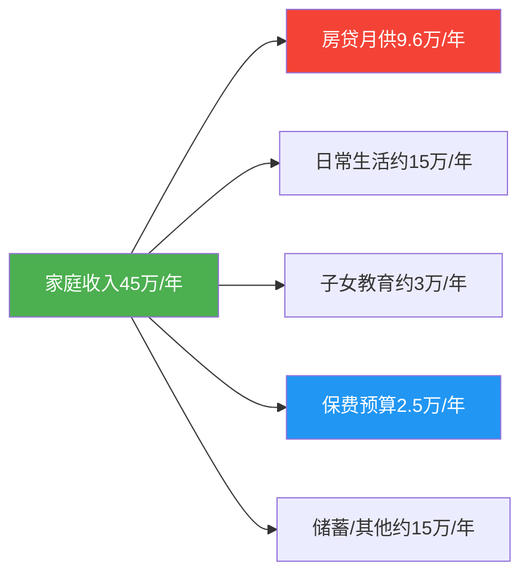
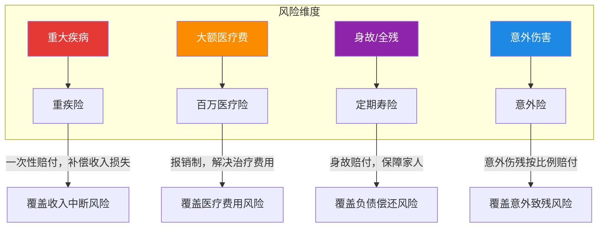
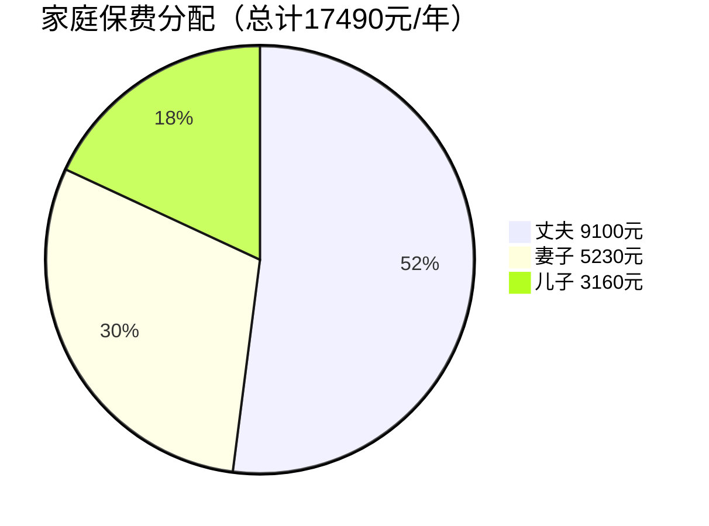
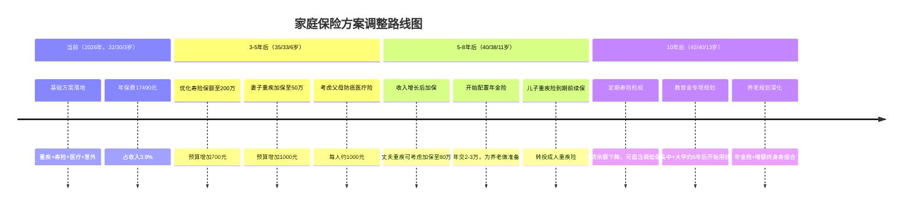

## 案例一：普通三口之家的保险方案

这是本章的第一个实战案例，选取了中国城市最常见的家庭画像——双职工三口之家、有房贷、有社保、有一定储蓄。这个案例的价值在于：它不是极端情况，而是绝大多数读者正在经历的现实。通过对这个"标准家庭"的完整保险方案设计过程，读者可以掌握从需求分析到产品选型再到持续管理的全链路方法论。

### 一、家庭背景还原

#### 1.1 家庭成员信息

| 成员 | 年龄 | 职业 | 年收入 | 社保 | 健康状况 |
|------|------|------|--------|------|----------|
| 丈夫（张先生） | 32岁 | IT工程师 | 30万 | 有 | 标准体，无既往病史 |
| 妻子（李女士） | 30岁 | 中学教师 | 15万 | 有 | 标准体，无既往病史 |
| 儿子（小明） | 3岁 | — | — | 有少儿医保 | 健康 |

**家庭财务概况**：

| 项目 | 金额 | 说明 |
|------|------|------|
| 家庭年收入 | 45万 | 丈夫30万 + 妻子15万 |
| 房贷余额 | 120万 | 月供8000元，剩余约15年 |
| 家庭储蓄 | 30万 | 含活期+定期+货币基金 |
| 年保费预算 | 2.5万 | 家庭年收入的5.6% |
| 车贷 | 无 | — |
| 赡养父母 | 暂不紧迫 | 双方父母均有退休金 |

#### 1.2 家庭结构分析

这个家庭处于典型的"成家期"（28-35岁），具有以下特征：

- **收入结构**：丈夫收入占比67%，是家庭主要经济支柱。这意味着丈夫一旦发生风险，家庭收入将骤降三分之二
- **负债压力**：120万房贷是最大的刚性负债，月供8000元占家庭月收入的21%
- **生命周期**：儿子3岁，未来教育支出（幼儿园→小学→中学→大学）是一笔长期大额支出
- **储蓄水平**：30万储蓄相当于家庭8个月支出，属于中等偏下水平，抗风险能力有限

### 二、需求分析：科学计算保障缺口

#### 2.1 保障需求计算

保障缺口的计算是保险方案设计的核心。我们需要回答一个问题：如果家庭经济支柱明天倒下，这个家庭需要多少钱才能维持正常运转？

**方法一：遗属需求法（推荐）**

遗属需求法从家庭实际支出角度出发，计算在经济支柱身故后，遗属维持生活所需的资金总额：

| 需求项目 | 金额 | 计算依据 |
|---------|------|----------|
| 房贷清偿 | 120万 | 确保家人不会因断供失去住所 |
| 子女教育基金 | 60万 | 从3岁到大学毕业（含课外培训），按年均3.5万估算 |
| 家庭5年生活费 | 60万 | 月均1万 × 60个月，给配偶缓冲时间重新规划 |
| 父母赡养储备 | 0万 | 双方父母均有退休金，暂不计入刚性需求 |
| 丧葬及应急 | 10万 | 丧葬费用+过渡期应急资金 |
| **合计需求** | **250万** | — |

**方法二：倍数法（快速估算）**

作为交叉验证，用行业常用的倍数法快速估算：

- 丈夫作为主要经济支柱：年收入30万 × 10倍 = 300万
- 妻子作为次要经济支柱：年收入15万 × 5倍 = 75万

倍数法得出丈夫需求300万、妻子需求75万，与遗属需求法的结论基本一致——丈夫的保障缺口在200-300万之间。

#### 2.2 已有保障盘点

在计算缺口之前，必须先盘点家庭已有的保障资源：

| 已有保障 | 金额 | 可靠性评估 |
|---------|------|-----------|
| 社保抚恤金（丈夫） | 约15万 | 一次性抚恤金+个人账户余额，金额有限 |
| 社保抚恤金（妻子） | 约10万 | 同上 |
| 公司团体意外险（丈夫） | 30万 | 仅覆盖意外身故/伤残，离职即失效 |
| 家庭储蓄 | 30万 | 可动用，但会严重影响生活质量 |
| **合计** | **约85万** | 但真正可靠的商业保障为0 |

**关键发现**：这个家庭的"保障表面"看似有社保+团险+储蓄，但实际商业保障为零。社保抚恤金金额有限（通常不超过20万），团险依赖在职状态且仅保意外，储蓄动用则意味着生活质量断崖式下降。

#### 2.3 保障缺口汇总

| 家庭成员 | 保障需求 | 已有保障 | 缺口 |
|---------|---------|---------|------|
| 丈夫 | 250万（身故）+ 50万（重疾收入补偿） | 社保15万+团险30万+储蓄可分配15万 | 约240万 |
| 妻子 | 75万（身故）+ 40万（重疾收入补偿） | 社保10万+储蓄可分配10万 | 约95万 |
| 儿子 | 50万（重疾）+ 医疗费 | 少儿医保（报销有限） | 约50万+医疗费 |

### 三、方案设计：从缺口到产品的映射

#### 3.1 设计思路与原则

在开始选产品之前，必须先明确设计原则。保险方案不是"哪个便宜买哪个"，而是"用有限预算最大化转移风险"：

**原则一：先保大人后保小孩**

孩子生病，大人还能赚钱治病；大人生病，孩子的生活和教育都会受到冲击。这个家庭中，丈夫的保障优先级最高。

**原则二：先保额后期限**

预算有限时，优先做高保额，再考虑保障期限。50万保终身不如60万保到60岁——因为重疾高发期在40-60岁，在最需要保障的阶段拥有更高保额才是理性的。

**原则三：先保障后理财**

在基本保障（重疾+医疗+寿险+意外）配齐之前，不要考虑年金险、增额终身寿等理财型保险。保障是地基，理财是上层建筑。

**原则四：险种搭配互补**

每个险种解决不同的风险维度，组合使用才能形成完整的保障网：

#### 3.2 各险种选型逻辑

##### 重疾险选型

**为什么选保终身、30年缴费？**

- **保终身 vs 保定期**：丈夫32岁，保终身意味着覆盖全生命周期。虽然保到60岁（定期）保费更低，但60岁之后恰恰是重疾高发期且无法再投保。在预算允许的情况下，保终身是更稳妥的选择
- **30年缴费 vs 20年缴费**：30年缴费每年保费更低，且缴费期内出险可豁免后续保费（如果产品含被保人豁免条款）。拉长缴费期本质上是利用了货币时间价值
- **保额50万**：重疾险的核心功能是收入补偿。丈夫年收入30万，治疗+康复期通常需要2-3年，50万基本覆盖2年的收入损失。同时，社保医保可以报销一部分治疗费用，重疾险的赔付主要用于非医疗支出（营养费、护理费、收入损失）

**为什么不选含身故责任的重疾险？**

含身故责任的重疾险保费通常贵30%-50%。本案中，丈夫的身故风险已通过定期寿险150万覆盖，重疾险无需重复承担身故保障功能。将省下的保费用于提高保额，杠杆效率更高。

##### 定期寿险选型

**为什么选保至60岁、150万保额？**

- **保至60岁**：60岁时房贷已还清（还需约15年），儿子已大学毕业（27岁），家庭负债和责任基本消失。定期寿险的使命就是在"上有老下有小还有房贷"的高责任期提供保障
- **150万保额**：直接对标丈夫的保障缺口——房贷120万+子女教育30万。如果丈夫不幸身故，150万赔付可以让妻子一次性还清房贷，剩余30万作为教育基金
- **30年缴费**：与保障期限匹配，降低每年缴费压力

**为什么妻子的定期寿险只要80万？**

妻子年收入15万，家庭对她的经济依赖度较低。80万足以覆盖房贷分摊部分（60万）和一定的家庭缓冲资金。同时，妻子的寿险保费极低（30岁女性80万保至60岁仅约600元），性价比很高。

##### 百万医疗险选型

**为什么选保证续保20年的产品？**

百万医疗险是1年期产品，最大的风险是"续保"——如果产品停售或被保人健康状况恶化，可能无法续保。保证续保20年的产品在20年内不因健康变化拒绝续保，锁定了最需要保障的年龄段。

**为什么保额200万就够了？**

200万的年度保额和400-600万的终身保额，在实际医疗场景中已经绰绰有余。中国三甲医院ICU日均费用约5000-10000元，一场重大手术+住院的总费用通常在30-80万之间。200万的保额在绝大多数情况下都不会用尽。一些产品宣传600万甚至800万保额，更多是营销手段，实际理赔中几乎不可能达到。

##### 意外险选型

**为什么意外险只要一两百元？**

意外险是所有险种中杠杆率最高的——200元保费就能获得100万保额，杠杆比达到5000:1。这是因为意外事故的发生概率远低于疾病，保险公司定价自然更低。

**丈夫100万 vs 妻子50万 vs 儿子20万的逻辑**：

- 丈夫是主要收入来源，且IT行业长期久坐，存在一定的职业健康风险，100万保额匹配其收入水平
- 妐子50万保额与其收入和家庭责任匹配
- 儿子20万是国家对未成年人身故保额的上限限制（0-10岁不超过20万，10-18岁不超过50万），这是为了防范道德风险

#### 3.3 最终方案明细

##### 丈夫（张先生）方案

| 险种 | 产品类型 | 保额 | 年保费 | 核心保障 |
|------|---------|------|--------|---------|
| 重疾险 | 保终身，30年缴费 | 50万 | 6500元 | 110种重疾赔1次+25种中症赔2次+50种轻症赔3次，含被保人豁免 |
| 定期寿险 | 保至60岁，30年缴费 | 150万 | 2100元 | 身故/全残赔付，覆盖房贷+教育 |
| 百万医疗险 | 保证续保20年 | 200万（年度）/400万（终身） | 300元 | 1万免赔额，住院+门诊手术+特殊门诊 |
| 意外险 | 1年期 | 100万身故+10万医疗 | 200元 | 意外身故/伤残+意外医疗 |
| **小计** | — | — | **9100元** | — |

##### 妻子（李女士）方案

| 险种 | 产品类型 | 保额 | 年保费 | 核心保障 |
|------|---------|------|--------|---------|
| 重疾险 | 保终身，30年缴费 | 40万 | 4200元 | 110种重疾赔1次+中症+轻症，含女性特定疾病额外赔付 |
| 定期寿险 | 保至60岁，30年缴费 | 80万 | 600元 | 身故/全残赔付 |
| 百万医疗险 | 保证续保20年 | 200万 | 280元 | 同丈夫方案 |
| 意外险 | 1年期 | 50万身故+5万医疗 | 150元 | 意外身故/伤残+意外医疗 |
| **小计** | — | — | **5230元** | — |

##### 儿子（小明）方案

| 险种 | 产品类型 | 保额 | 年保费 | 核心保障 |
|------|---------|------|--------|---------|
| 重疾险 | 保30年，20年缴费 | 50万 | 2500元 | 少儿高发重疾（白血病等）额外赔付 |
| 百万医疗险 | 保证续保20年 | 200万 | 600元 | 住院医疗+门诊手术 |
| 意外险 | 1年期 | 20万身故+2万医疗 | 60元 | 意外身故/伤残+意外医疗（含烧烫伤） |
| **小计** | — | — | **3160元** | — |

##### 家庭总览

| 指标 | 数值 | 行业参考值 | 评估 |
|------|------|-----------|------|
| 家庭年保费 | 17490元 | — | — |
| 保费占收入比 | 3.9% | 5%-10%为合理区间 | 偏低，有增长空间 |
| 丈夫保额/收入倍数 | 寿险5倍+重疾1.7倍 | 寿险10倍、重疾3-5倍 | 寿险偏低，可优化 |
| 剩余预算 | 7510元 | — | 可用于加保或储蓄 |

### 四、方案推演：真实场景下的保障效果

一个保险方案的价值，最终要通过真实场景来检验。以下是三个典型风险场景的推演：

#### 4.1 场景一：丈夫确诊甲状腺癌（重疾理赔）

**背景**：张先生35岁时体检发现甲状腺乳头状癌，属于重疾险保障范围。

**理赔过程**：

1. 确诊后向保险公司报案，提交病理报告
2. 保险公司审核后一次性赔付50万重疾保险金
3. 同时触发被保人豁免，后续27年保费（约17.5万）全部免交，保障继续有效
4. 百万医疗险报销住院手术费用（假设总费用8万，社保报销5万，自付3万，扣除1万免赔额后报销2万）

**实际获赔**：50万现金 + 免交17.5万保费 + 医疗费报销2万 = **总价值约69.5万**

**这笔钱的用途**：

- 20万：康复期间的收入损失补偿（张先生可能需要休养3-6个月）
- 15万：营养费、护理费、中药调理等非社保报销项目
- 15万：家庭应急储备，缓解心理压力

#### 4.2 场景二：丈夫意外身故（寿险+意外险理赔）

**背景**：张先生38岁时因交通事故不幸身故。

**理赔过程**：

1. 李女士向两家保险公司分别报案
2. 定期寿险赔付150万
3. 意外险赔付100万
4. 合计获赔250万

**赔付金规划**：

| 用途 | 金额 | 说明 |
|------|------|------|
| 一次性还清房贷 | 约100万 | 剩余贷款本金（已还6年） |
| 儿子教育基金 | 50万 | 专户管理，用于从幼儿园到大学 |
| 家庭生活费 | 60万 | 5年缓冲期，月均1万 |
| 李女士养老储备 | 30万 | 投资增值，补充未来养老 |
| 应急资金 | 10万 | 存入货币基金，随时可取 |

**对比无保障的情况**：如果没有这250万赔付，李女士将面临：月供8000元（仅靠她1.25万/月的收入几乎无法承担）、儿子教育费用无着落、可能被迫卖房搬家、生活水平断崖式下降。

#### 4.3 场景三：儿子确诊白血病（重疾+医疗理赔）

**背景**：小明5岁时确诊急性淋巴细胞白血病。

**理赔过程**：

1. 重疾险一次性赔付50万（少儿特定重疾可能有额外赔付，部分产品对白血病赔付150%-200%基本保额）
2. 百万医疗险报销治疗费用（白血病治疗总费用通常50-100万，社保报销后自付部分在扣除免赔额后报销）

**实际获赔估算**：

- 重疾险：50万（若含少儿特疾额外赔，可达75-100万）
- 医疗险：假设自付30万，扣除1万免赔后报销29万
- 合计：79-129万

**这笔钱的意义**：

白血病治疗周期长（通常2-3年），期间至少需要一位家长全职陪护。50万以上的现金赔付可以覆盖：家长陪护期间的收入损失、骨髓移植等高额自费项目、营养品和特殊护理费用。更重要的是，它让家长可以全身心陪伴孩子治疗，而不是一边焦虑医药费一边被迫工作。

### 五、方案优化与未来调整

#### 5.1 当前方案的优化空间

本方案保费仅占家庭收入的3.9%，低于行业建议的5%-10%区间，说明还有优化空间：

**优化方向一：提高丈夫寿险保额**

当前丈夫寿险150万，但遗属需求法计算的缺口约240万。建议在预算允许时将寿险保额提高到200万。32岁男性200万保至60岁、30年缴费，年保费约2800元，仅比当前多700元。

**优化方向二：增加妻子重疾险保额**

妻子当前重疾险40万，但考虑到女性高发重疾（乳腺癌、宫颈癌等）的治疗和康复成本，50万更稳妥。加保10万年保费约增加1000元。

**优化方向三：配置家庭成员豁免**

检查丈夫和妻子的重疾险是否包含投保人豁免。如果丈夫作为妻子保单的投保人，丈夫身故或重疾时妻子的后续保费也应豁免。这是很多人忽略的细节。

**优化后方案**：

| 优化项 | 增加保费 | 优化效果 |
|--------|---------|---------|
| 丈夫寿险 150万→200万 | +700元 | 寿险保额覆盖全部房贷+教育 |
| 妻子重疾 40万→50万 | +1000元 | 重疾保额更充足 |
| 投保人豁免（如未含） | +200-400元 | 交叉保障，避免断保 |
| **合计增加** | **约2000元** | — |
| **优化后总保费** | **约19500元** | 占收入4.3%，仍处合理区间 |

#### 5.2 未来5-10年调整计划

保险方案不是一次性产品，而是需要随家庭生命周期动态调整的系统。以下是这个家庭未来10年的调整路线图：

#### 5.3 关键触发事件

以下事件发生时，应立即重新评估保险方案：

| 触发事件 | 影响 | 调整建议 |
|---------|------|---------|
| 生育二胎 | 家庭责任增加 | 增加寿险保额，为二胎配置保险 |
| 换工作/创业 | 收入变化、团险可能失效 | 重新评估保额，补足团险缺口 |
| 买房/换房 | 负债变化 | 寿险保额跟随房贷金额调整 |
| 父母健康恶化 | 赡养压力增加 | 为父母配置防癌医疗险/意外险 |
| 收入大幅提升 | 预算增加 | 提高重疾险保额，开始年金险配置 |
| 健康状况变化 | 可能影响投保 | 趁健康时尽早加保 |

### 六、常见误区与避坑指南

#### 6.1 这个案例中容易犯的错误

**误区一：给孩子买齐保险，大人裸奔**

很多家庭的第一份保险是给孩子买的教育金或重疾险，而大人没有任何保障。这是本末倒置——孩子的保障依赖于父母的经济能力，父母才是最需要保险的人。

**误区二：只看保费不看保额**

"我每年交5000块的重疾险"并不等于"我有充足的保障"。5000元保费对应的保额可能是15万（返还型），也可能是50万（消费型）。保额才是决定保障力度的核心指标。

**误区三：被"返还型"保险吸引**

"有病赔钱，没病返本"听起来很美好，但实际代价是保费贵2-3倍。本案中丈夫50万保终身重疾险消费型约6500元/年，返还型可能要15000元/年。多出的8500元如果拿去做稳健投资，30年后的收益远高于返还金额。

**误区四：忽略健康告知**

投保时的健康告知是理赔的"生死线"。必须如实告知既往病史、体检异常、门诊记录等。隐瞒告知可能导致理赔被拒，保费白交。如果不确定是否需要告知，原则是"问了就答，不问不答"。

**误区五：以为有了百万医疗险就不需要重疾险**

百万医疗险是报销制——花多少报多少（扣除免赔额）。重疾险是给付制——确诊就赔，不管你怎么花。两者功能完全不同。百万医疗险解决的是"治疗费用"，重疾险解决的是"收入损失"。一个人得了重疾，治疗费可能30万（医疗险报销），但2-3年无法工作的收入损失是60-90万（只有重疾险能覆盖）。

#### 6.2 购买顺序的常见陷阱

**错误顺序**：意外险 → 教育金 → 重疾险 → 医疗险 → 寿险

**正确顺序**：百万医疗险 → 意外险 → 定期寿险 → 重疾险 → （教育金/年金）

理由：百万医疗险和意外险加起来不到500元/人，却能覆盖最高频的风险（住院+意外）。在此基础上再配置寿险和重疾险。教育金和年金是"锦上添花"，不是"雪中送炭"，必须放在最后。

### 七、投保实操清单

#### 7.1 投保前准备

在正式投保之前，需要准备好以下材料：

- [ ] 所有家庭成员的身份证信息
- [ ] 近两年的体检报告（确认是否有异常指标需要告知）
- [ ] 社保卡信息（确认社保状态）
- [ ] 房贷合同（确认贷款金额和期限）
- [ ] 收入证明（部分高保额产品可能要求）

#### 7.2 投保顺序建议

建议按以下顺序投保，每次投保间隔1-2周，避免同时提交多家核保导致冲突：

1. **第一步**：为丈夫投保百万医疗险（最快出单，立即获得基础保障）
2. **第二步**：为全家投保意外险（次日即可生效）
3. **第三步**：为丈夫投保定期寿险（等待期通常90-180天）
4. **第四步**：为丈夫投保重疾险（等待期90-180天）
5. **第五步**：为妻子投保全套（同上顺序）
6. **第六步**：为儿子投保全套

#### 7.3 投保后管理

**建立家庭保单档案**：

| 必记录项 | 说明 |
|---------|------|
| 保单号 | 每份保单的唯一标识 |
| 保险公司 | 出单公司名称 |
| 产品名称 | 具体产品名 |
| 保障内容 | 险种+保额+保障期限 |
| 缴费日期 | 每年扣费日期 |
| 缴费金额 | 年保费 |
| 受益人 | 法定或指定受益人 |
| 客服电话 | 保险公司理赔报案电话 |
| 投保人/被保人 | 避免混淆 |

**年度检视清单**：

- [ ] 所有保单是否正常续保
- [ ] 家庭收入和负债是否有变化
- [ ] 是否有新增家庭成员
- [ ] 健康状况是否有变化（可能影响未来加保）
- [ ] 保险产品是否有更好的替代品（不建议频繁换，但可以关注）

### 八、本案例的核心启示

这个普通三口之家的案例揭示了几个关键认知：

**第一，保险不是消费，是风险转移工具。** 每年17490元的保费，换来的是250万以上的风险保障。如果用"万一出事"的概率来计算期望值，这个投入的性价比远高于大多数理财方式。

**第二，保障缺口的计算必须量化。** "我觉得需要保险"和"我需要240万的寿险保额"是完全不同的认知水平。只有量化了缺口，才能科学地分配预算、选择产品。

**第三，方案是动态的，不是一劳永逸的。** 今天合适的方案，三年后可能不再匹配家庭状况。年度检视是保险管理的基本功。

**第四，最贵的保险是没有买的保险。** 这个家庭如果因为"纠结哪个产品更好"而拖延一年不投保，在这一年里发生的任何风险都将由家庭自行承担。投保的第一原则是"先上车再选座"——先拥有保障，再优化方案。

***

> **下一步阅读**：[案例二：单亲妈妈的保险配置](02-案例二单亲妈妈的保险配置.md)，了解单收入家庭的保险方案设计要点。
