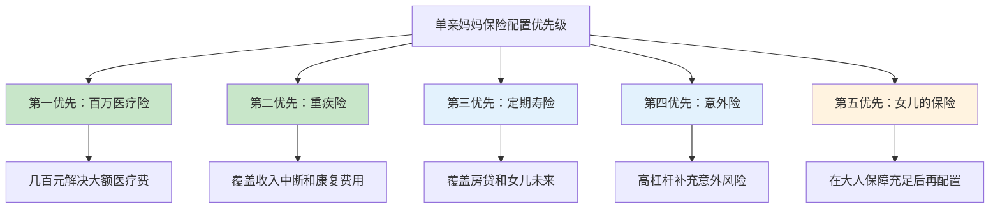

## 案例二：单亲妈妈的保险配置

### 案例背景

**家庭基本情况**：

- **李女士**：35岁，互联网公司产品经理，年收入18万（税后），有五险一金
- **女儿**：6岁，即将上小学
- **前夫**：离婚后每月支付抚养费2000元，无其他经济往来
- **住房**：名下一套房产，贷款余额85万，月供5200元
- **储蓄**：活期+定期共12万
- **已有保障**：仅公司团体意外险（保额20万），无任何商业保险
- **父母**：均已退休，父亲有高血压，母亲健康状况良好，无需李女士赡养

**家庭月度收支**：

| 项目 | 金额 |
|------|------|
| 工资收入 | 15000元 |
| 抚养费收入 | 2000元 |
| **月收入合计** | **17000元** |
| 房贷月供 | 5200元 |
| 女儿学费+兴趣班 | 3500元 |
| 日常生活费 | 4000元 |
| 交通+通讯 | 1000元 |
| 其他支出 | 1500元 |
| **月支出合计** | **15200元** |
| **月结余** | **1800元** |

### 为什么单亲家庭的保险配置特别重要？

单亲家庭与双亲家庭最本质的区别在于**风险承受能力极低**。双亲家庭中，一方出现重大变故，另一方仍能维持家庭运转；而单亲家庭中，唯一的经济支柱一旦倒下，整个家庭立即陷入危机。

**单亲家庭面临的特殊风险**：

1. **收入中断风险**：李女士是家庭唯一经济来源，一旦因重疾或意外丧失劳动能力，房贷、女儿教育、日常生活费用将全部断供。以月支出15200元计算，即使动用全部12万储蓄，也只能支撑不到8个月
2. **巨额医疗支出风险**：一场重大疾病的治疗费用通常在30万-80万之间，加上康复期无法工作的收入损失，财务缺口可达百万级别
3. **抚养责任断裂风险**：如果李女士不幸离世或丧失行为能力，女儿的抚养权和教育费用将成为严峻问题。前夫每月仅支付2000元抚养费，远不足以覆盖女儿的全部开支
4. **孤独应对风险**：双亲家庭生病时有人照顾、有人跑医院、有人做决策；单亲家庭在最脆弱的时候需要独自面对一切

这些风险不是"可能"发生，而是"概率不低"地存在。保险配置的核心目的，就是为李女士和女儿构建一张安全网，确保任何单一风险事件都不会摧毁整个家庭的经济基础。

### 需求分析

**第一步：计算家庭保障需求**

李女士作为唯一的经济支柱，保障需求需要覆盖以下几个维度：

| 需求维度 | 计算逻辑 | 金额 |
|----------|----------|------|
| 房贷负债 | 剩余贷款余额 | 85万 |
| 女儿教育费用 | 小学至大学毕业（12年），含学费、生活费 | 50万 |
| 家庭过渡期生活费 | 3年基本生活费（给女儿和照顾者缓冲时间） | 55万 |
| 重疾治疗及康复费用 | 手术+化疗+康复期（社保报销后自费部分） | 30-50万 |
| 收入中断期间损失 | 重疾治疗+康复期间（约2-3年）无法工作的收入损失 | 36-54万 |
| **合计保障需求** | - | **256-294万** |

**第二步：盘点已有保障**

| 已有保障 | 内容 | 评估 |
|----------|------|------|
| 社保（五险一金） | 医保可报销部分住院费用（约60%-70%），工伤保险覆盖工伤场景 | 基础保障，报销比例有限，进口药/靶向药不覆盖 |
| 公司团体意外险 | 保额20万，仅覆盖意外伤残/身故 | 保额偏低，且离职即失效 |
| 家庭储蓄 | 12万 | 远不足以应对重大风险 |
| **已有保障评估** | - | **严重不足，几乎裸奔** |

**第三步：计算保障缺口**

保障缺口 = 保障需求（约270万） - 已有保障（约32万） = **约238万**

这个缺口意味着：如果今天发生重大变故，李女士的家庭将面临约238万的经济缺口，这足以让女儿的教育中断、房子被银行收回。

### 预算评估与约束分析

**可支配保费预算**：

李女士月结余仅1800元（年结余21600元），储蓄12万中需要保留至少6个月生活费作为应急储备金（约9万元），可动用资金非常有限。

按照家庭年收入的5%-10%计算，保费预算区间为9000-18000元/年。考虑到李女士的经济压力，建议控制在**8000-10000元/年**，即每月670-830元。

**预算有限时的配置优先级**：

对于单亲妈妈，配置顺序与普通家庭有所不同：

为什么单亲家庭要优先于普通家庭先买寿险？因为李女士是女儿唯一的经济依靠，如果她不在了，女儿的生活和教育将立即面临断裂。定期寿险在这种场景下不是"可选项"，而是"必选项"。

### 保险方案设计

#### 李女士的保险方案

| 险种 | 产品类型 | 保额 | 缴费方式 | 年保费 | 配置理由 |
|------|----------|------|----------|--------|----------|
| 百万医疗险 | 保证续保20年 | 200万 | 年缴 | 350元 | 解决大额医疗费，社保报销后自费部分100%报销，含质子重离子、外购药 |
| 重疾险 | 保终身，30年缴费 | 40万 | 30年缴 | 4800元 | 覆盖3年收入损失+康复费用，确诊即赔，不限用途 |
| 定期寿险 | 保至60岁，30年缴费 | 150万 | 30年缴 | 1500元 | 覆盖房贷85万+女儿教育50万+过渡期生活费，确保女儿未来不受影响 |
| 意外险 | 1年期 | 100万 | 年缴 | 200元 | 高杠杆补充意外伤残/身故保障，含意外医疗5万 |
| **合计** | - | - | - | **6850元** | **占年收入3.8%，月均571元** |

#### 女儿的保险方案

| 险种 | 产品类型 | 保额 | 缴费方式 | 年保费 | 配置理由 |
|------|----------|------|----------|--------|----------|
| 重疾险 | 保30年，20年缴费 | 50万 | 20年缴 | 2200元 | 少儿高发白血病等重疾保障，30年后成人可自行配置 |
| 百万医疗险 | 保证续保20年 | 200万 | 年缴 | 600元 | 解决大额医疗费，少儿意外和疾病住院均覆盖 |
| 意外险 | 1年期 | 20万 | 年缴 | 60元 | 少儿意外伤害保障，含意外医疗2万 |
| **合计** | - | - | - | **2860元** | - |

#### 家庭总保费

| 项目 | 金额 |
|------|------|
| 李女士保费 | 6850元 |
| 女儿保费 | 2860元 |
| **家庭总保费** | **9710元** |
| **占家庭年收入比例** | **5.4%** |
| **月均保费** | **809元** |

这个方案在预算范围内实现了最大化保障。月均809元的支出对李女士来说是可承受的——相当于少买两件衣服、少在外面吃几顿饭的代价，但换来的是整个家庭238万保障缺口的基本覆盖。

### 方案深度解读

#### 为什么重疾险保额选40万而不是50万？

50万保额更理想，但保费会增加约1200元/年。在当前预算约束下，40万是保额充足性和保费可承受性之间的平衡点。40万可以覆盖：

- 治疗费用中社保不报销的部分（约15-20万）
- 治疗期间1-2年的收入损失（约18-36万）
- 康复期的营养和护理费用（约5-10万）

未来收入增长后，可以考虑补充一份20万的重疾险，将总保额提升至60万。

#### 为什么定期寿险保额选150万？

150万的计算依据：

| 项目 | 金额 |
|------|------|
| 房贷余额 | 85万 |
| 女儿教育至大学毕业 | 50万 |
| 女儿3年生活费（由祖父母或其他亲属照顾） | 15万 |
| **合计** | **150万** |

如果李女士不幸离世，这150万保险金将用于：一次性偿还房贷（确保女儿有地方住）、设立女儿教育基金、支付过渡期生活费。这是李女士能给女儿的最后一份保障。

#### 为什么女儿的重疾险选保30年而不是保终身？

三个原因：

1. **预算限制**：保终身的少儿重疾险保费是保30年的2-3倍，在当前预算下不现实
2. **通胀因素**：50万保额在30年后购买力将大幅缩水，届时女儿成年后需要重新配置更高保额的产品
3. **产品迭代**：保险产品不断更新换代，30年后一定会有更合适的产品出现。保30年足够覆盖女儿从童年到成年的高风险期

#### 百万医疗险的选择要点

百万医疗险是杠杆率最高的险种（350元保费撬动200万保额），但选择时需要注意以下关键条款：

| 关注点 | 好的标准 | 差的标准 |
|--------|----------|----------|
| 续保条件 | 保证续保20年，期间不因健康变化拒绝续保 | 每年审核续保，理赔后可能被拒 |
| 外购药 | 包含且不限药品种类 | 不包含或仅限特定药品 |
| 质子重离子 | 包含且100%报销 | 不包含或仅报销60% |
| 免赔额 | 1万免赔额（合理） | 2万免赔额（过高） |
| 增值服务 | 绿通、住院垫付、术后护理 | 无增值服务 |

### 实施路径

李女士预算紧张，不可能一步到位配齐所有保险。建议分三个阶段实施：

#### 第一阶段：立即行动（第1个月内）

**目标**：用最低成本覆盖最大的风险敞口

| 行动 | 预算 | 预期效果 |
|------|------|----------|
| 为李女士投保百万医疗险 | 350元 | 200万医疗保障到位 |
| 为李女士投保意外险 | 200元 | 100万意外保障到位 |
| 为女儿投保百万医疗险 | 600元 | 女儿200万医疗保障到位 |
| **阶段保费** | **1150元** | **解决"看病贵"的核心问题** |

第一阶段投入仅1150元，但立即解决了母女二人最大的风险——大额医疗费。从这一刻起，无论是癌症还是车祸，住院费用不再是毁灭性的打击。

#### 第二阶段：核心保障（第2-3个月）

**目标**：配置重疾险，覆盖收入中断风险

| 行动 | 预算 | 预期效果 |
|------|------|----------|
| 为李女士投保重疾险（40万） | 4800元 | 确诊即赔40万，不限用途 |
| 为女儿投保意外险 | 60元 | 女儿意外保障到位 |
| **阶段保费** | **4860元** | **解决"收入断"的核心问题** |

重疾险的核心价值不仅是医疗费，更在于**收入替代**。确诊后保险公司一次性赔付40万，这笔钱可以用于：还房贷、请护工、补充营养、安心养病不担心收入中断。

#### 第三阶段：完整保障（第4-6个月）

**目标**：补充寿险和女儿重疾险，完成完整保障体系

| 行动 | 预算 | 预期效果 |
|------|------|----------|
| 为李女士投保定期寿险（150万） | 1500元 | 身故保障到位，女儿未来无忧 |
| 为女儿投保重疾险（50万） | 2200元 | 女儿重疾保障到位 |
| **阶段保费** | **3700元** | **保障体系基本完善** |

至此，整个保险方案落地完成。总保费9710元/年，月均809元。

### 单亲家庭保险配置的常见误区

#### 误区一：先给孩子买保险，大人裸奔

**错误思维**：孩子是心头肉，什么都先紧着孩子。

**真实情况**：大人是孩子的"保险"。李女士如果倒下，女儿的保费都交不起。正确顺序是：先保大人（李女士），再保孩子（女儿）。本方案中李女士保费6850元占比70.5%，女儿保费2860元占比29.5%，这个比例是合理的。

#### 误区二：只买医疗险就够了

**错误思维**：有百万医疗险看病能报销，不需要重疾险。

**真实情况**：医疗险只解决"医疗费"，不解决"收入损失"。李女士治疗期间无法工作，但房贷5200元/月、女儿学费3500元/月不会因此停止。重疾险的赔付金正是用来覆盖这些"医院账单之外"的开支。

#### 误区三：买返还型保险"不亏"

**错误思维**：消费型保险不返钱，返还型到期能拿回本金，更划算。

**真实情况**：返还型保险的保费通常是消费型的2-3倍。以重疾险为例，消费型年缴4800元，返还型可能需要12000元。李女士预算有限，多出来的7200元完全可以用来提高保额或给女儿配置保险。返还型保险的"返还"本质上是你多交的保费加上极低的利息，从财务角度看并不划算。

#### 误区四：公司有团体险就不用自己买

**错误思维**：公司给买了团体险，商业保险可以不买。

**真实情况**：团体险有三个致命缺陷——保额通常很低（李女士公司团体意外险仅20万）、保障范围有限（通常不含重疾险和寿险）、离职即失效。李女士在互联网行业，跳槽或被裁的概率不低，一旦离开公司保障归零。商业保险是自己的，不依赖任何公司。

#### 误区五：等有钱了再买

**错误思维**：现在太紧张，等收入涨了再配保险。

**真实情况**：保险最大的敌人是"等待"。35岁投保重疾险年缴4800元，40岁投保可能需要6500元（每年多交1700元，30年多交51000元）。更危险的是，等待期间如果体检出结节、息肉等问题，可能直接被拒保或除外承保。李女士目前35岁、健康状况良好，这是最佳投保窗口期。

### 单亲家庭的特殊保障策略

#### 策略一：投保人豁免

投保人豁免是指：如果投保人（李女士）在缴费期间确诊重疾/身故/全残，后续保费全部免交，但保障继续有效。这意味着即使李女士不幸患病，女儿的保险也不会因为交不起保费而中断。

建议：为女儿的重疾险和医疗险附加投保人豁免，每年增加约100-200元保费，但能确保女儿的保障不会因母亲的变故而中断。

#### 策略二：指定受益人

李女士的定期寿险必须明确指定女儿为受益人（而非法定继承人），并考虑设置保险金信托。原因：

- 如果写"法定继承人"，保险金可能被前夫、父母等多方分割
- 女儿未成年时，保险金可能由监护人（可能是前夫）代管
- 通过保险金信托，可以指定保险金的使用方式（教育费、生活费分期发放），确保资金真正用于女儿

#### 策略三：建立应急基金

保险解决的是"大风险"，应急基金解决的是"小风险"。建议李女士在配齐保险后，逐步将储蓄从12万提升至18万（覆盖12个月基本生活费）。这样即使失业或短期收入中断，也不至于动用保险或借贷。

应急基金的存放建议：5万放活期（随取随用），其余放货币基金或短期理财（年化2%-3%，随时可赎）。

#### 策略四：考虑定寿+意外险的"双倍保障"

定期寿险和意外险在意外身故场景下可以叠加赔付。如果李女士配置了150万定期寿险+100万意外险，意外身故时女儿可以获得250万保险金。对于单亲家庭，这种叠加是有必要的——女儿失去了唯一的依靠，经济补偿越充足越好。

### 未来调整建议

保险配置不是一劳永逸的，需要随着家庭状况变化而调整：

| 时间节点 | 变化因素 | 调整建议 |
|----------|----------|----------|
| 收入增长后（年薪25万+） | 预算增加 | 补充重疾险至60万，开始为女儿配置教育金 |
| 再婚时 | 家庭结构变化 | 重新评估保障需求，可能需要调整寿险保额和受益人 |
| 女儿18岁时 | 抚养责任减轻 | 评估是否可以降低寿险保额，将预算转移到养老规划 |
| 45岁时 | 进入疾病高发期 | 检视重疾险保额是否充足，考虑补充防癌医疗险 |
| 每年保单周年日 | 健康和收入变化 | 检视所有保单，确认保障是否仍能满足需求 |

### 案例总结

**方案核心数据**：

| 指标 | 数据 |
|------|------|
| 李女士年保费 | 6850元 |
| 女儿年保费 | 2860元 |
| 家庭年保费合计 | 9710元 |
| 保费占收入比 | 5.4% |
| 李女士身故保障 | 150万（寿险）+100万（意外）= 250万 |
| 李女士重疾保障 | 40万（确诊即赔）+200万（医疗报销） |
| 女儿重疾保障 | 50万（确诊即赔）+200万（医疗报销） |
| 实施周期 | 6个月内分三阶段完成 |

**核心经验**：

1. **单亲家庭比双亲家庭更需要保险**：唯一的经济支柱没有"备份"，任何变故对家庭的打击都是毁灭性的
2. **预算有限不是不买保险的理由**：9710元/年的保费对李女士来说是可承受的，但它构建的安全网价值超过250万
3. **分阶段实施降低压力**：不需要一次配齐，第一阶段1150元就能解决最紧迫的医疗风险
4. **先保大人再保孩子**：李女士的保障是女儿最大的"保险"，本方案中70.5%的预算用于李女士本人
5. **受益人和投保人豁免是单亲家庭的"必选项"**：确保在任何情况下，女儿的利益都不会受损

对于每一位独自扛起家庭重担的单亲妈妈来说，保险不是消费，而是对孩子的责任和爱的延续。

***
