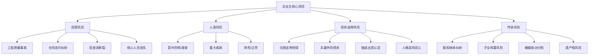
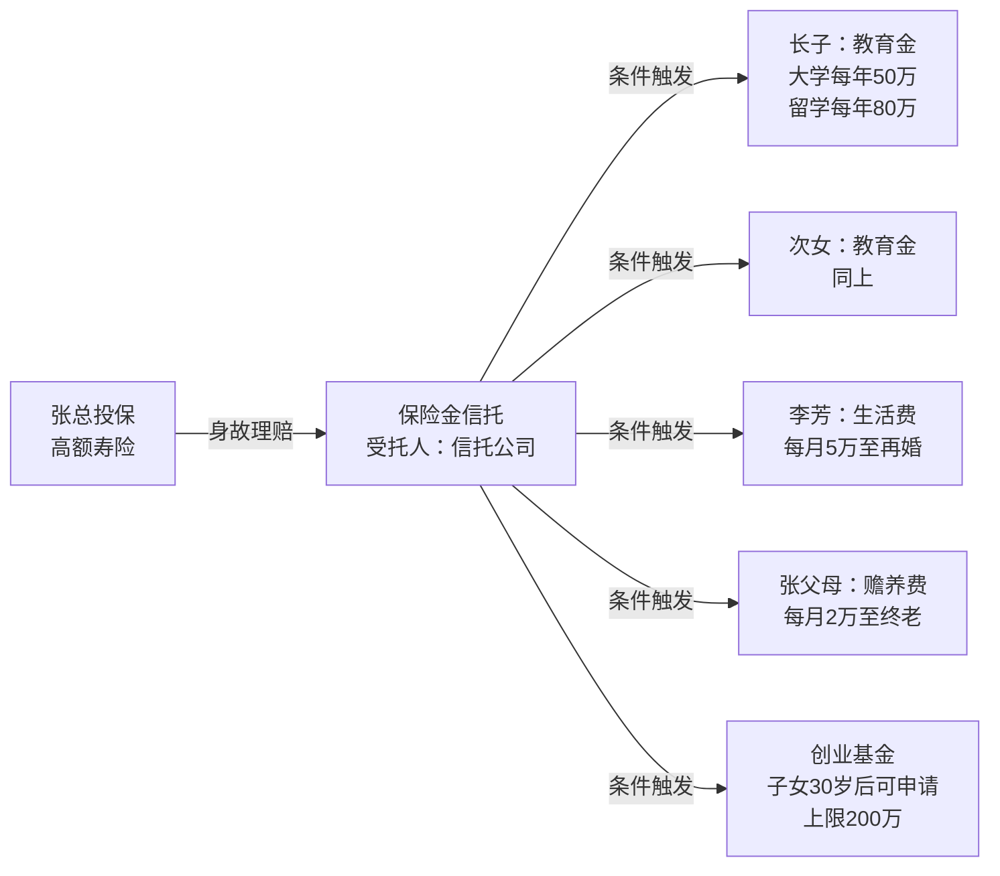
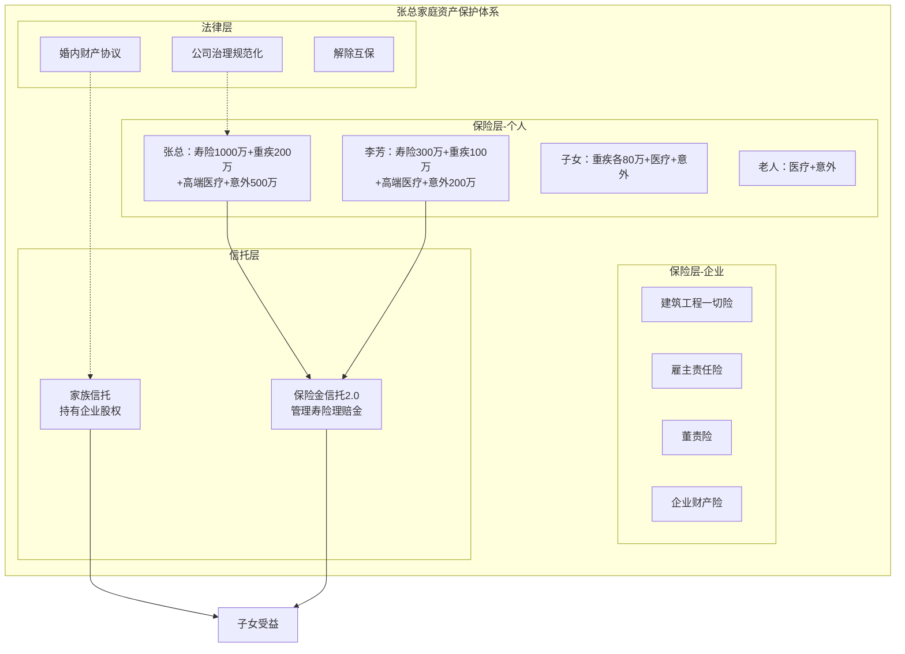
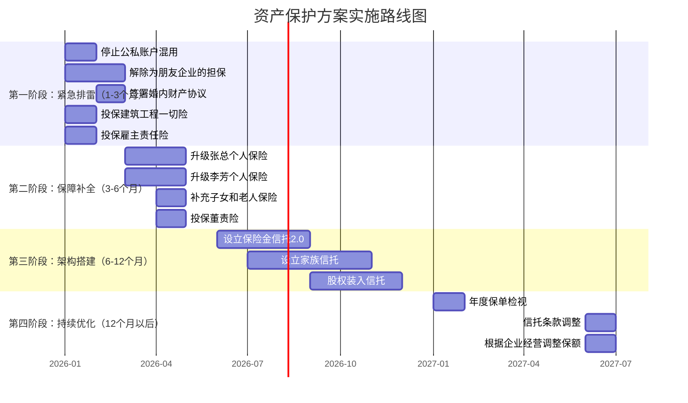

## 案例三：企业主的资产保护方案

> **案例核心**：高净值企业主如何运用保险、信托和法律工具，在企业经营风险与个人家庭财富之间建立防火墙，实现"企业出事、家产不倒"的终极目标。

***

### 一、案例背景：张总的家庭与企业画像

#### 1.1 个人与家庭情况

| 维度 | 详情 |
|------|------|
| 姓名 | 张建华（化名） |
| 年龄 | 42岁 |
| 配偶 | 李芳，38岁，全职太太 |
| 子女 | 长子15岁（初中），次女8岁（小学） |
| 父母 | 张父70岁、张母68岁；李父65岁、李母63岁 |
| 家庭年生活开支 | 约80万元（含子女教育、父母赡养） |

#### 1.2 企业经营情况

| 维度 | 详情 |
|------|------|
| 企业类型 | 建筑工程有限公司（有限责任公司） |
| 持股比例 | 张总持股70%，妻子代持30% |
| 年营收 | 约5000万元 |
| 年净利润 | 约300-500万元（波动较大） |
| 员工规模 | 约120人 |
| 企业负债 | 银行贷款800万，应付账款约600万 |
| 行业风险等级 | 高（工程事故、质量纠纷、合同纠纷频发） |

#### 1.3 家庭资产与负债

| 资产类别 | 价值（万元） | 备注 |
|----------|------------|------|
| 自住房产 | 800 | 一线城市别墅，无贷款 |
| 投资房产 | 600 | 两套公寓，租金收入约1.2万/月 |
| 股票/基金 | 200 | 散户投资，收益不稳定 |
| 银行存款/理财 | 300 | 活期+大额存单 |
| 车辆 | 80 | 两辆车 |
| 企业股权 | 约2000 | 按净资产估算 |
| **资产合计** | **约3980** | — |
| **负债** | **0**（个人层面） | 企业负债未连带 |
| **净资产** | **约3980** | — |

#### 1.4 已有保险配置

| 被保人 | 险种 | 保额（万元） | 年保费（元） |
|--------|------|------------|------------|
| 张总 | 重疾险 | 50 | 18000 |
| 张总 | 定期寿险 | 100 | 3500 |
| 张总 | 百万医疗 | 200 | 800 |
| 李芳 | 重疾险 | 30 | 9500 |
| 李芳 | 百万医疗 | 200 | 600 |
| 两个孩子 | 教育年金 | 各50 | 合计50000 |
| **合计** | — | — | **约81900** |

***

### 二、风险诊断：企业主面临的"四大致命风险"

企业主与普通工薪族的最大区别在于：**个人财富与企业经营深度绑定，一旦企业出事，个人资产极有可能被连带追偿。** 张总面临的不是"万一"的风险，而是"概率很高"的系统性风险。

#### 2.1 风险全景图



#### 2.2 风险逐一拆解

**风险一：工程质量事故——最致命的一击**

建筑行业最常见的灭顶之灾。一个工程质量事故的赔偿金额通常在数百万到数千万之间。如果企业注册资本不足以覆盖赔偿，法院可能穿透有限责任公司的面纱，追究股东个人责任。

具体场景：张总承接的一个商业项目，因分包商偷工减料导致主体结构出现裂缝，业主要求赔偿2000万。企业资产仅800万，不足部分法院判决张总以个人资产承担补充赔偿责任。

**风险二：无限连带担保——银行贷款的隐形炸弹**

张总的企业向银行贷款800万，银行要求张总以个人名义提供连带责任担保。这意味着如果企业无法偿还贷款，银行可以直接冻结张总的个人账户、查封个人房产。

更危险的是，张总还为朋友的另一家企业提供了500万的担保。如果朋友的企业倒闭，张总同样需要承担还款责任。

**风险三：人身意外——企业瞬间停摆**

张总作为企业的核心人物和最大客户关系的维护者，一旦发生意外或重大疾病，企业将面临：客户流失、员工恐慌、合同违约、银行抽贷等连锁反应。李芳作为全职太太，完全没有能力接管一个年营收5000万的建筑企业。

**风险四：婚姻与传承——财富的慢性流失**

长子15岁，正处于叛逆期，对家族事业毫无兴趣。次女才8岁。如果张总意外身故，3980万的遗产如何分配？李芳再婚怎么办？子女挥霍怎么办？如果企业股权被继承人分割，公司治理将陷入混乱。

#### 2.3 张总现有方案的致命缺陷

| 缺陷 | 具体问题 | 风险等级 |
|------|---------|---------|
| 保额严重不足 | 重疾险50万对年收入300-500万的企业主而言杯水车薪 | 🔴 高 |
| 缺失定期寿险/意外险（足够保额） | 万一身故，家庭失去所有经济来源 | 🔴 高 |
| 没有任何债务隔离安排 | 个人资产与企业风险完全捆绑 | 🔴 高 |
| 没有保险金信托或家族信托 | 传承完全依赖法定继承，纠纷概率极高 | 🟡 中 |
| 李芳缺乏独立保障 | 全职太太无社保、无商业保险（除重疾+医疗） | 🟡 中 |
| 教育年金占比过高 | 5万/年投教育年金，但基础保障不完整 | 🟡 中 |
| 没有企业财产保险 | 工程一切险、雇主责任险缺失 | 🔴 高 |

***

### 三、资产保护方案设计：三层防火墙体系

企业主的资产保护不是买几张保单就能解决的，而是一个**系统工程**。需要在法律层面、保险层面和信托层面同时构建防护。

```mermaid
graph TB
    subgraph 第一层：法律隔离
        L1[公司治理规范化]
        L2[消除人格混同]
        L3[反担保条款]
        L4[配偶财产公证]
    end
    
    subgraph 第二层：保险转移
        I1[高额人身保险]
        I2[企业财产保险]
        I3[董责险/职业责任险]
    end
    
    subgraph 第三层：信托隔离
        T1[保险金信托2.0]
        T2[家族信托]
        T3[股权信托]
    end
    
    第一层 --> 第二层
    第二层 --> 第三层
```

#### 3.1 第一层：法律隔离——切断风险传导链

**（1）公司治理规范化，杜绝人格混同**

有限责任公司的"有限责任"保护是有前提的——公司财产与股东个人财产必须严格分离。如果法院认定存在"人格混同"（即公司就是股东的"另一个口袋"），就会刺破公司面纱，追究股东无限责任。

张总需要立即做以下整改：

| 整改项 | 现状问题 | 整改措施 |
|--------|---------|---------|
| 公私账户混用 | 企业货款经常打入张总个人账户 | 立即停止，所有经营款项走公账 |
| 财务不独立 | 企业没有独立的会计和审计 | 聘请专业会计事务所，每年出具审计报告 |
| 财产混同 | 张总个人用车挂在公司名下，但私人使用 | 明确区分，公车公用有记录，私车自购 |
| 一人决策 | 所有重大决策张总一人说了算 | 建立股东会、董事会制度，会议留痕 |

**（2）消除或降低个人连带担保**

| 策略 | 操作方法 | 可行性 |
|------|---------|--------|
| 抵押物替换 | 用企业资产（设备、应收账款）替代个人担保 | 需银行同意，可协商 |
| 担保限额 | 与银行协商设定个人担保上限 | 新增贷款时争取 |
| 互保解除 | 立即终止为朋友企业的500万担保 | 需朋友企业配合，有难度但必须推进 |
| 担保保险 | 投保保证保险转移部分担保风险 | 保费较高，但能兜底 |

**（3）配偶财产隔离**

李芳名下的投资房产（600万）和部分存款应通过以下方式隔离：

- **婚内财产协议**：明确约定部分资产为李芳个人财产，经公证后具有法律效力
- **资金来源留痕**：确保李芳名下资产的资金来源可追溯，不与企业资金混同
- **独立投资账户**：李芳的投资和理财使用独立账户，不与张总的企业账户有任何往来

#### 3.2 第二层：保险转移——用杠杆撬动保障

**（1）张总个人保险方案升级**

| 险种 | 产品类型 | 保额 | 年保费（元） | 设计理由 |
|------|---------|------|------------|---------|
| 定期寿险 | 保至65岁，20年缴费 | 1000万 | 28000 | 覆盖企业负债+家庭10年生活费+子女教育 |
| 重疾险 | 保终身，20年缴费 | 200万 | 55000 | 高净值人群需要覆盖康复期收入损失+高端治疗费用 |
| 高端医疗险 | 含全球就医、私立医院 | 1000万 | 35000 | 匹配高净值人群就医品质需求 |
| 意外险 | 1年期，含猝死保障 | 500万 | 3000 | 高保额低保费，性价比极高 |
| **小计** | — | — | **121000** | — |

**（2）李芳保险方案升级**

| 险种 | 产品类型 | 保额 | 年保费（元） | 设计理由 |
|------|---------|------|------------|---------|
| 定期寿险 | 保至60岁，20年缴费 | 300万 | 4500 | 虽然不是经济支柱，但身故后子女需要保障 |
| 重疾险 | 保终身，20年缴费 | 100万 | 28000 | 提升至合理保额 |
| 高端医疗险 | 含全球就医 | 1000万 | 30000 | 与张总同等医疗品质 |
| 意外险 | 1年期 | 200万 | 800 | 基础保障 |
| **小计** | — | — | **63300** | — |

**（3）子女保险方案优化**

| 被保人 | 险种 | 保额 | 年保费（元） |
|--------|------|------|------------|
| 长子 | 重疾险（保30年） | 80万 | 3200 |
| 长子 | 百万医疗 | 200万 | 500 |
| 长子 | 意外险 | 50万 | 100 |
| 次女 | 重疾险（保30年） | 80万 | 2800 |
| 次女 | 百万医疗 | 200万 | 400 |
| 次女 | 意外险 | 50万 | 80 |
| **小计** | — | — | **7080** |

**（4）父母保险方案**

四位老人年龄均在63-70岁之间，重疾险已不适合（保费倒挂），配置重点如下：

| 被保人 | 险种 | 保额 | 年保费（元） |
|--------|------|------|------------|
| 四位老人 | 百万医疗/防癌医疗险 | 各200万 | 合计约12000 |
| 四位老人 | 意外险 | 各50万 | 合计约2400 |
| **小计** | — | — | **14400** |

**（5）企业财产与责任保险**

这是很多企业主最容易忽视的部分——只保人不保企业。

| 险种 | 保额 | 年保费（元） | 保障范围 |
|------|------|------------|---------|
| 建筑工程一切险 | 按项目造价 | 约80000 | 工程施工中的物质损失、第三者责任 |
| 雇主责任险 | 120人×80万 | 约36000 | 员工工伤事故的企业赔偿责任 |
| 董事及高管责任险 | 1000万 | 约25000 | 高管因经营决策失误导致的赔偿责任 |
| 企业财产综合险 | 1000万 | 约15000 | 企业设备、存货的火灾/自然灾害损失 |
| **小计** | — | **约156000** | — |

**（6）保费汇总与预算分析**

| 类别 | 年保费（元） | 占家庭年收入比例 |
|------|------------|----------------|
| 张总个人保险 | 121000 | — |
| 李芳个人保险 | 63300 | — |
| 子女保险 | 7080 | — |
| 父母保险 | 14400 | — |
| 企业保险 | 156000 | — |
| 原有教育年金 | 50000 | — |
| **合计** | **约411780** | **约8.2%**（按净利润500万计） |

> **预算点评**：对于年净利润300-500万的企业主家庭，41万的保险支出占比约8-14%，在合理范围内。企业保险15.6万应作为企业经营成本列支，可在企业所得税前扣除，实际税后成本约11.7万。扣除企业保险后，家庭个人保险支出约25.6万，占净利润的5-8.5%，处于合理区间。

#### 3.3 第三层：信托隔离——终极资产保护

保险解决的是"钱从哪来"的问题，信托解决的是"钱给谁、怎么给"的问题。对于张总这样的高净值企业主，两者结合才能构建完整的资产保护体系。

**（1）保险金信托2.0**

保险金信托是将保险的身故理赔金装入信托，由信托公司按照约定条件向受益人分配。



**信托条款设计要点：**

| 条款 | 内容 | 设计目的 |
|------|------|---------|
| 教育金条款 | 凭录取通知书领取，本科每年50万，硕士/博士每年80万 | 鼓励子女接受高等教育 |
| 生活保障条款 | 李芳每月领取5万生活费，再婚时减半 | 保障基本生活，但不鼓励依赖 |
| 防挥霍条款 | 单笔领取超过100万需受托人审批 | 防止子女一次性挥霍 |
| 激励条款 | 子女创业可申请200万启动资金，需提交商业计划书 | 鼓励自立 |
| 赡养条款 | 每月向双方父母各支付2万元 | 确保老人无忧 |
| 应急条款 | 重大疾病可申请额外医疗费用，无上限 | 兜底保障 |

**（2）家族信托——保护家族核心资产**

张总的企业股权（约2000万）是家族最重要的资产，但如果以个人名义持有，企业出事时股权会被法院冻结或拍卖。通过家族信托持有股权，可以实现：

| 功能 | 实现方式 | 效果 |
|------|---------|------|
| 债务隔离 | 股权装入信托后，不再是张总个人财产 | 企业破产时，债权人无法追索信托内的股权 |
| 控制权保留 | 张总作为信托的投资顾问，保留经营决策权 | 不失去企业控制权 |
| 传承安排 | 信托受益人为子女，但分配条件由信托条款决定 | 避免遗产继承纠纷 |
| 婚姻隔离 | 信托资产不属于子女的夫妻共同财产 | 子女离婚时配偶无法分割 |

**家族信托的设立门槛与成本：**

| 项目 | 详情 |
|------|------|
| 最低设立门槛 | 通常1000万起（部分信托公司300万起） |
| 信托设立费 | 一次性，约信托资产的1%-2%（10-20万） |
| 年度管理费 | 约信托资产的0.5%-1%（5-10万/年） |
| 律师费 | 信托架构设计+合同起草，约10-20万 |
| 信托期限 | 可设为20-50年，甚至永续 |

**（3）保险金信托与家族信托的对比与配合**

| 对比维度 | 保险金信托 | 家族信托 |
|---------|-----------|---------|
| 设立门槛 | 较低（寿险保额300万起） | 较高（通常1000万起） |
| 资产来源 | 身故理赔金 | 现金、股权、房产等 |
| 生前效力 | 仅在被保人身故后生效 | 设立即生效 |
| 适合场景 | 传承安排、受益人保护 | 资产隔离、控制权保留、综合传承 |
| **配合方式** | **保险金信托作为家族信托的补充，生前用家族信托保护现有资产，身后用保险金信托管理理赔金** |

***

### 四、完整资产保护方案总览



#### 最终方案费用与保额汇总

| 类别 | 年费用（万元） | 关键保障 |
|------|-------------|---------|
| 个人保险 | 25.6 | 寿险+重疾+高端医疗+意外，总保额超5000万 |
| 企业保险 | 15.6 | 工程一切险+雇主责任+董责险+财产险 |
| 教育年金 | 5.0 | 子女教育金（已有） |
| 信托管理费 | 5-10 | 保险金信托+家族信托 |
| 法律费用 | 5-10（一次性） | 财产协议公证+信托架构设计+律师顾问 |
| **年度总成本** | **约51-57** | 占年净利润10-19% |

***

### 五、实施路线图：分阶段推进

资产保护方案不可能一步到位，需要分阶段推进，优先解决最致命的风险。



#### 各阶段执行要点

**第一阶段：紧急排雷（1-3个月）**

这一阶段的目标是**立即切断最危险的风险传导**。

| 序号 | 事项 | 具体操作 | 负责人 |
|------|------|---------|--------|
| 1 | 公私分离 | 开设企业专用银行账户，所有经营款项走公账；注销张总名下用于企业经营的个人银行卡 | 张总+会计 |
| 2 | 解除互保 | 与朋友协商解除500万担保，如无法立即解除则要求对方提供反担保 | 律师 |
| 3 | 婚内财产协议 | 聘请律师起草协议，明确李芳名下资产为个人财产，双方签字后公证 | 律师+公证处 |
| 4 | 企业保险 | 立即投保建筑工程一切险和雇主责任险，覆盖在建项目和全部员工 | 保险经纪人 |

**第二阶段：保障补全（3-6个月）**

| 序号 | 事项 | 具体操作 |
|------|------|---------|
| 1 | 张总保险升级 | 按方案投保定期寿险1000万、重疾险200万、高端医疗险、意外险500万 |
| 2 | 李芳保险升级 | 补充定期寿险300万、提升重疾险至100万、投保高端医疗险 |
| 3 | 子女和老人 | 补充子女重疾险和医疗险，为四位老人投保防癌医疗险和意外险 |
| 4 | 董责险 | 为企业董事和高管投保责任险 |

**第三阶段：架构搭建（6-12个月）**

| 序号 | 事项 | 具体操作 |
|------|------|---------|
| 1 | 保险金信托 | 选择信托公司，将张总和李芳的高额寿险纳入保险金信托，设定受益分配条款 |
| 2 | 家族信托 | 设立家族信托，将企业股权逐步装入，保留张总的投资顾问角色 |
| 3 | 遗嘱安排 | 配合信托，订立遗嘱，明确非信托资产的分配方案 |

**第四阶段：持续优化（12个月以后）**

- 每年进行一次保单检视，根据家庭和企业变化调整保额
- 每年审查信托条款，根据子女成长阶段调整分配条件
- 关注政策变化（如遗产税立法进展），及时调整架构

***

### 六、常见误区与风险提示

#### 6.1 企业主资产保护的六大误区

| 误区 | 错误认知 | 正确做法 |
|------|---------|---------|
| 误区一：保险可以避债 | "我把钱都买成保险，债主就拿不走了" | 恶意避债购买的保险，法院可以强制执行退保并扣划现金价值。保险的债务隔离功能仅限于合法合理的安排 |
| 误区二：公司是有限公司，不用保护个人资产 | "公司法规定了有限责任，我最多亏完注册资本" | 一旦被认定人格混同、抽逃出资或提供个人担保，有限责任保护将被穿透 |
| 误区三：把资产转到配偶名下就安全了 | "离婚前把财产转给老婆就行" | 债务产生后的转移行为可被法院撤销；恶意串通转移财产还会面临罚款甚至刑事责任 |
| 误区四：买了高额保险就万事大吉 | "我已经买了500万保险了" | 只买保险不做法律隔离和信托安排，就像只穿了一件防弹衣却不戴头盔——防护不完整 |
| 误区五：信托是有钱人的游戏，我没必要 | "信托门槛太高，不适合我" | 保险金信托门槛已降至300万保额，对于有高额寿险需求的企业主完全可行 |
| 误区六：方案做完就不用管了 | "一次性搞定，以后不用操心" | 企业经营环境、家庭结构、法律政策都在变化，方案需要每年检视和调整 |

#### 6.2 法律红线：不可触碰的禁区

| 行为 | 法律后果 | 说明 |
|------|---------|------|
| 已有债务后恶意投保 | 法院可强制退保，扣划现金价值 | 投保应在债务产生前或正常经营期间进行 |
| 转移资产逃避执行 | 罚款、拘留，严重的追究刑事责任 | 《民事诉讼法》第111条明确规定 |
| 虚假破产 | 刑事责任（虚假破产罪） | 《刑法》第162条之二 |
| 保险合同代签名 | 合同可能被认定无效 | 投保人、被保险人必须本人签名 |
| 隐瞒企业经营状况投保 | 保险公司可拒赔甚至解除合同 | 如实告知是投保人的法定义务 |

***

### 七、方案执行效果模拟

假设张总在方案实施后的第3年发生意外——工地视察时发生严重事故，导致高位截瘫。

**没有保护方案时：**

| 影响 | 具体后果 |
|------|---------|
| 医疗费用 | 高端康复治疗约200万/年，社保报销极少 |
| 收入中断 | 企业营收可能下降60%-80%，净利润归零 |
| 银行抽贷 | 800万贷款到期不续，要求提前偿还 |
| 担保触发 | 银行冻结个人账户，查封房产 |
| 家庭生活 | 李芳无收入来源，子女教育中断，老人赡养无着 |
| **最终结果** | **变卖房产偿债，家庭生活水平断崖式下降** |

**有保护方案时：**

| 保障 | 到位金额/措施 |
|------|-------------|
| 重疾险赔付 | 200万一次性到账（高位截瘫属于重疾） |
| 意外险赔付 | 500万一次性到账（1级伤残赔付100%） |
| 高端医疗险 | 持续报销康复治疗费用，每年最高1000万 |
| 雇主责任险 | 企业赔偿由保险公司承担，减轻企业负担 |
| 董责险 | 因经营决策引发的诉讼由保险公司承担抗辩费用 |
| 保险金信托 | 李芳每月领取5万生活费，子女教育金正常发放 |
| 家族信托 | 企业股权在信托中保护，不受债权人追索 |
| **最终结果** | **700万现金+持续医疗保障+信托生活费，家庭生活不受根本影响** |

***

### 八、经验总结：企业主资产保护的八条铁律

| 序号 | 铁律 | 核心要义 |
|------|------|---------|
| 1 | **保护要在风险发生之前** | 资产保护是"晴天修屋顶"，不是"雨天补漏洞"。已有债务后再转移资产，法律不保护 |
| 2 | **法律隔离是基础** | 保险和信托都建立在法律合规的前提上。先解决公私不分、连带担保等问题，再谈保险和信托 |
| 3 | **保险是杠杆，信托是防火墙** | 保险用小保费撬动大保额，信托将资产与个人风险隔离开。两者缺一不可 |
| 4 | **企业保险和个人保险同等重要** | 企业是家庭的"收入发动机"，发动机坏了光修车厢没用 |
| 5 | **保额要匹配身价** | 企业主的保额不是"够用就行"，而是要覆盖企业负债+家庭10年开支+子女教育+父母赡养 |
| 6 | **受益人指定比法定继承更安全** | 指定受益人可以避免遗产继承纠纷，信托则可以进一步控制分配条件 |
| 7 | **每年检视、动态调整** | 企业经营好了要加保，企业收缩了要调整，家庭结构变了要重新规划 |
| 8 | **专业的事交给专业的人** | 企业主资产保护涉及保险、法律、税务、信托多个领域，需要保险经纪人+律师+信托经理的团队协作 |

***

### 九、延伸思考：不同规模企业主的简化方案

不是每个企业主都有张总这样的资产规模。以下是不同量级企业主的简化方案建议：

| 企业规模 | 年营收 | 资产规模 | 核心保护策略 | 预算参考 |
|---------|--------|---------|------------|---------|
| 微型企业主 | <500万 | <500万 | 高额定期寿险+重疾险+企业财产险；婚内财产协议 | 3-5万/年 |
| 小型企业主 | 500-3000万 | 500-2000万 | 定期寿险+重疾+高端医疗+雇主责任险+保险金信托 | 10-20万/年 |
| 中型企业主 | 3000万-1亿 | 2000-5000万 | 全面保险方案+保险金信托+家族信托+董责险 | 30-50万/年 |
| 大型企业主 | >1亿 | >5000万 | 全套方案+境内外信托+大额保单+全球资产配置 | 100万+/年 |

> **核心原则不变**：无论企业规模大小，"法律隔离+保险转移+信托保护"的三层架构都是适用的，区别只在于每层的深度和广度。

***

> **本案例启示**：企业主的资产保护不是"有钱人的矫情"，而是负责任的家庭规划。企业经营本身就是高风险行为，如果不建立个人资产与企业风险之间的防火墙，一次意外就可能让整个家庭多年积累的财富付诸东流。保险、信托和法律工具的组合使用，可以在合法合规的前提下，最大程度地保护家庭财富的安全。
