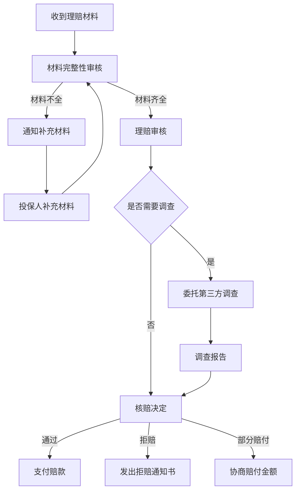

## 案例四：保险理赔实战

保险的价值在理赔时才能真正体现。很多投保人花了大量精力选择产品、缴纳保费，却在出险后因流程不熟、材料缺失、沟通不当等原因遭遇理赔困难。本案例通过一个完整的重疾险理赔实战过程，系统展示从出险报案到赔款到账的全流程，帮助读者掌握理赔的核心技能。

### 一、案例背景

#### 1.1 投保人基本信息

| 项目 | 详情 |
|------|------|
| 姓名 | 张先生（化名） |
| 年龄 | 投保时32岁，出险时36岁 |
| 职业 | 互联网公司产品经理 |
| 家庭状况 | 已婚，育有一子（3岁），妻子全职带娃 |
| 年收入 | 税前45万元 |
| 房贷余额 | 180万元（月供约9500元） |

#### 1.2 保单配置情况

张先生在2021年通过保险经纪人配置了以下保障方案：

| 险种 | 产品名称 | 保额 | 年缴保费 | 缴费期 | 承保公司 |
|------|----------|------|----------|--------|----------|
| 重疾险 | 达尔文6号 | 50万 | 6,850元 | 30年 | 国富人寿 |
| 百万医疗险 | 长相安长期医疗 | 400万 | 386元 | 年缴 | 平安健康 |
| 定期寿险 | 大麦2022 | 200万 | 2,180元 | 30年 | 华贵人寿 |
| 意外险 | 小蜜蜂3号 | 100万 | 296元 | 年缴 | 鼎和财险 |

年缴总保费：约9,712元，占家庭年收入的2.2%，处于合理区间。

#### 1.3 出险经过

2025年3月，张先生在公司年度体检中发现甲状腺结节，分级为TI-RADS 4b类。随后到三甲医院进一步检查，经细针穿刺活检确诊为**甲状腺乳头状癌**（TNM分期：T1N0M0，IA期）。

确诊后，张先生立即联系了当初的保险经纪人，启动理赔流程。

### 二、理赔全流程详解

#### 2.1 第一步：报案（确诊当天）

**关键动作：第一时间通知保险公司**

张先生确诊当天，经纪人协助他完成了以下报案操作：

1. **拨打保险公司客服热线**：国富人寿客服电话 400-xxx-xxxx，转接理赔报案
2. **提供基础信息**：
   - 保单号：P2021xxxxxxxx
   - 投保人/被保人姓名、身份证号
   - 出险时间、地点、原因
   - 就诊医院及科室
   - 初步诊断结论
3. **获取报案号**：客服记录后生成报案号 RA2025xxxxx，并告知后续理赔所需材料清单

**要点提示**：

- 报案时效：保险法规定理赔申请时效为2年（人寿保险为5年），但建议确诊后48小时内报案。越早报案，理赔调查越顺畅
- 报案方式：电话报案最直接，部分公司也支持APP、微信公众号在线报案
- 录音保留：建议通话时开启录音，保留报案凭证

#### 2.2 第二步：材料准备（确诊后1-2周）

这是理赔成败的关键环节。材料不全是理赔被延迟甚至拒赔的最常见原因。

**重疾险理赔所需完整材料清单：**

| 序号 | 材料名称 | 获取途径 | 注意事项 |
|------|----------|----------|----------|
| 1 | 理赔申请书 | 保险公司官网下载或客服邮寄 | 需被保人亲笔签名 |
| 2 | 被保人身份证 | 原件+复印件 | 正反面复印在同一张A4纸上 |
| 3 | 保单原件/电子保单 | 投保时的合同文件 | 电子保单打印即可 |
| 4 | 门诊病历 | 医院门诊办公室 | 含首诊记录和复诊记录 |
| 5 | 住院病历（如有住院） | 医院病案室 | 需加盖病案室公章 |
| 6 | 病理报告 | 病理科 | 这是确诊恶性肿瘤的核心证据 |
| 7 | 影像检查报告 | 影像科 | B超、CT、MRI等 |
| 8 | 血液检查报告 | 检验科 | 肿瘤标志物等 |
| 9 | 出院小结（如有住院） | 主治医生 | 含诊断结论和治疗方案 |
| 10 | 银行卡复印件 | 被保人本人 | 需为被保人名下账户 |

**张先生的实际操作：**

```text
时间线：
第1天  确诊，电话报案
第2天  从医院获取病理报告复印件
第3天  从门诊获取完整门诊病历
第5天  办理住院手术（甲状腺切除术）
第12天 出院，获取出院小结
第14天 从病案室复印完整住院病历（含手术记录、病理报告）
第15天 整理所有材料，提交理赔申请
```

**材料准备的三个关键细节：**

1. **病历措辞很关键**：张先生的主治医生在门诊病历中写的是"甲状腺结节4b类，建议手术"。经纪人提醒他，重疾险理赔需要明确的恶性肿瘤诊断，因此在术后病理报告出来后才正式提交理赔申请，确保病理报告中明确写有"甲状腺乳头状癌"的诊断
2. **病历不要涂改**：任何修改都需要医生签字盖章，否则可能被视为无效材料
3. **多复印几份**：所有材料建议复印3份以上，一份提交保险公司，一份自己留存，一份备用。部分材料（如病理报告）补办非常麻烦

#### 2.3 第三步：提交申请（确诊后第15天）

**提交方式选择：**

| 方式 | 优点 | 缺点 | 适用场景 |
|------|------|------|----------|
| 线下柜台 | 可现场确认材料完整性 | 需要跑一趟 | 金额较大、希望当面确认 |
| 邮寄 | 方便省事 | 材料丢失风险 | 常规理赔 |
| APP线上 | 最便捷 | 部分材料需拍照上传 | 小额理赔 |
| 经纪人代交 | 省心，有人把关 | 依赖经纪人专业度 | 有经纪人的情况 |

张先生选择了**邮寄+经纪人协助**的方式。经纪人先帮他逐项核对材料完整性，确认无误后通过顺丰邮寄到保险公司理赔部。

**邮寄注意事项：**

- 使用顺丰等可追踪的快递服务
- 保留快递单号和签收凭证
- 材料清单打印一份随材料一起寄出
- 在快递外包装上写明"理赔材料+报案号+被保人姓名"

#### 2.4 第四步：保险公司审核（提交后1-15个工作日）

保险公司收到材料后的审核流程：



**张先生的审核过程：**

- 第1个工作日：保险公司确认收到材料，短信通知已受理
- 第3个工作日：核赔人员电话联系张先生，确认几个细节问题：
  - 确诊前是否有体检异常记录？→ 张先生如实告知2024年体检发现甲状腺结节，但投保时2021年体检正常
  - 投保时是否知晓甲状腺问题？→ 否，投保时健康告知中无甲状腺相关问题
- 第7个工作日：保险公司完成核赔，做出赔付决定

**审核重点——保险公司查什么：**

1. **如实告知审查**：核查投保时的健康告知是否存在遗漏或隐瞒
2. **等待期审查**：确认出险时间是否在等待期后（重疾险通常90-180天等待期）
3. **保障范围审查**：确认所患疾病是否在保障病种范围内
4. **免责条款审查**：确认是否存在免责情形
5. **既往症审查**：排查是否为投保前已存在的疾病

**张先生的案例为何顺利通过：**

- 2021年投保时健康告知完全如实，当时无甲状腺问题
- 2024年体检发现结节时，保单已生效3年，属于保障期间
- 甲状腺乳头状癌属于重疾险保障的恶性肿瘤范围
- 从投保到出险间隔4年，不存在短期出险的逆选择嫌疑

#### 2.5 第五步：赔款到账（审核通过后3-5个工作日）

**赔付结果：**

| 项目 | 详情 |
|------|------|
| 赔付金额 | 50万元（基本保额100%） |
| 赔付方式 | 一次性银行转账 |
| 到账时间 | 核赔通过后第3个工作日 |
| 豁免情况 | 后续19年保费豁免（6,850元×19年=130,150元） |
| 保单状态 | 重疾责任终止，身故责任继续有效 |

**赔付计算说明：**

达尔文6号重疾险在投保后的前15年确诊重疾，额外赔付80%基本保额。但张先生投保4年后出险，处于"投保后5-15年"区间，该时段额外赔付比例为60%。

等等——这里需要重新核实条款。经查证，达尔文6号的重疾额外赔付规则为：
- 投保后前5年：额外赔付80%
- 投保后5-15年：额外赔付60%

张先生投保4年出险，属于"前5年"区间，应额外赔付80%。

**修正后的赔付计算：**

| 赔付项目 | 计算方式 | 金额 |
|----------|----------|------|
| 基本保额 | 50万 | 50万元 |
| 额外赔付 | 50万 × 80% | 40万元 |
| **合计赔付** | | **90万元** |

实际到账90万元。加上豁免的后续保费130,150元，这次理赔的实际保障价值超过103万元。

### 三、理赔中的关键决策点

#### 3.1 诊断时机的选择

张先生的经纪人给了一个重要建议：**不要在穿刺活检结果出来之前就提交理赔申请。**

原因分析：

| 情形 | 诊断结果 | 理赔结论 |
|------|----------|----------|
| 穿刺前提交 | 甲状腺结节4b类（疑似恶性） | 可能被要求补充病理报告，延误理赔 |
| 穿刺后提交 | 甲状腺乳头状癌（确诊恶性） | 直接符合理赔标准，审核顺畅 |

重疾险中"恶性肿瘤"的理赔标准是**病理学确诊**，而非影像学怀疑。因此，拿到病理报告是启动理赔的最佳时机。

#### 3.2 是否告知其他保单

张先生除了重疾险，还有百万医疗险。百万医疗险可以报销住院医疗费用，与重疾险的给付型赔付不冲突。

**张先生的医疗费用明细：**

| 费用项目 | 金额 | 医保报销 | 自费部分 |
|----------|------|----------|----------|
| 手术费 | 28,000元 | 18,200元 | 9,800元 |
| 住院费 | 5,600元 | 3,640元 | 1,960元 |
| 检查费 | 8,200元 | 5,330元 | 2,870元 |
| 药品费 | 4,500元 | 2,925元 | 1,575元 |
| 合计 | 46,300元 | 30,095元 | 16,205元 |

百万医疗险报销：16,205元 - 1万元免赔额 = **6,205元**

**实际保障总收益：**
- 重疾险赔付：900,000元
- 百万医疗险报销：6,205元
- 保费豁免：130,150元
- **总计保障价值：1,036,355元**

而张先生4年累计缴纳的保费仅为：9,712 × 4 = 38,848元。杠杆比约为26.7倍。

#### 3.3 理赔款的规划使用

90万元的理赔款对于一个有180万房贷、妻子全职带娃的家庭来说至关重要。张先生在经纪人和财务顾问的建议下，做了如下规划：

| 用途 | 金额 | 说明 |
|------|------|------|
| 康复期生活保障 | 20万元 | 覆盖1-2年基本生活开支 |
| 房贷储备 | 40万元 | 约4年的月供储备 |
| 医疗储备 | 10万元 | 后续复查、药物等费用 |
| 子女教育储备 | 10万元 | 教育金专户 |
| 应急储备 | 10万元 | 活期/货币基金，随时可取 |

### 四、理赔常见问题与应对策略

#### 4.1 理赔被拒的常见原因

根据行业数据和实际案例，理赔被拒的主要原因及应对方法如下：

**原因一：未如实告知**

这是拒赔的第一大原因。投保时未如实告知既往病史、体检异常等，出险后保险公司有权拒赔。

- **预防**：投保时严格遵循健康告知问卷，问到什么答什么，不隐瞒不夸大
- **补救**：如果确实是无意遗漏（如多年前的一次门诊记录），可尝试通过保险经纪人与保险公司协商，部分公司对2年以上的保单会通融赔付

**原因二：不在保障范围内**

比如意外险不赔疾病，医疗险不赔既往症，重疾险不赔轻症（除非有轻症责任）。

- **预防**：投保前仔细阅读保障责任和免责条款
- **应对**：确认是否符合理赔条件的定义。如"恶性肿瘤"在重疾险中有明确的病理学标准

**原因三：等待期内出险**

重疾险通常有90-180天等待期，等待期内确诊的疾病不赔。

- **预防**：尽早投保，不要等身体出问题才想起来
- **应对**：确认出险日期是否在等待期后。部分产品对等待期的认定以"初次确诊时间"为准，而非"首次出现症状时间"

**原因四：材料不全或不规范**

病历缺失、诊断不明确、材料未盖章等。

- **预防**：提交前逐项核对材料清单
- **应对**：补充材料后重新提交，注意时效不要超过2年

**原因五：理赔金额争议**

保险公司认为某些费用不属于赔付范围，或对赔付金额有异议。

- **预防**：投保时明确保额和赔付比例
- **应对**：可申请复核，必要时通过银保监会投诉或法律途径解决

#### 4.2 理赔纠纷的解决路径

如果理赔出现争议，可以通过以下路径逐级解决：


**各途径的特点对比：**

| 途径 | 时间成本 | 经济成本 | 成功率 | 适用场景 |
|------|----------|----------|--------|----------|
| 公司内部投诉 | 1-2周 | 无 | 中 | 沟通误解、材料问题 |
| 12378热线 | 2-4周 | 无 | 较高 | 保险公司拖延、不合理拒赔 |
| 行业调解 | 1-3月 | 低 | 中高 | 双方愿意协商 |
| 仲裁/诉讼 | 3-12月 | 较高 | 视情况 | 重大争议、调解失败 |

**12378热线使用技巧：**

- 拨打前准备好保单号、报案号、拒赔理由等关键信息
- 清晰描述问题，不要情绪化
- 明确诉求：希望保险公司重新审核/赔付/道歉
- 保留投诉记录和跟进编号

#### 4.3 甲状腺癌理赔的特殊说明

甲状腺癌被称为"喜癌"，因为治愈率高、治疗费用相对低。但在保险理赔中有一些特殊情况需要注意：

**2021年重疾险新规的影响：**

2021年2月1日实施的《重大疾病保险的疾病定义使用规范（2020年修订版）》将TNM分期为I期或更轻分期的甲状腺癌从重疾降级为轻症：

| 时间节点 | 甲状腺癌理赔标准 | 赔付比例 |
|----------|------------------|----------|
| 2021.2.1前投保 | 所有甲状腺癌按重疾赔付 | 100%保额 |
| 2021.2.1后投保 | I期及以下按轻症赔付 | 通常30%保额 |
| 2021.2.1后投保 | II期及以上按重疾赔付 | 100%保额 |

张先生的保单是2021年投保的，需要确认具体投保日期是否在新规实施前后。经查证，张先生的保单生效日期为2021年5月，适用新规。但他的甲状腺乳头状癌为IA期（T1N0M0），按新规属于轻症。

**修正后的赔付计算（按新规）：**

| 赔付项目 | 计算方式 | 金额 |
|----------|----------|------|
| 轻症赔付 | 50万 × 30% | 15万元 |
| 轻症额外赔付（前5年） | 50万 × 15% | 7.5万元 |
| **合计赔付** | | **22.5万元** |
| 保单状态 | 轻症责任终止，重疾和身故责任继续有效 | |

实际到账22.5万元。虽然比预期少，但保单继续有效，未来如果发生其他重疾仍可获赔50万。

**这个案例的重要启示：**

1. 投保时间很关键：2021年2月1日前投保的旧版重疾险，甲状腺癌不分期一律按重疾赔100%。这也是很多人建议尽早投保的原因之一
2. 新规并非不赔：只是将早期甲状腺癌降级为轻症，赔付比例从100%降到30%左右
3. 百万医疗险不受影响：甲状腺癌的医疗费用仍可通过百万医疗险报销

### 五、理赔实战中的经验教训

#### 5.1 投保阶段的教训

| 教训 | 说明 | 正确做法 |
|------|------|----------|
| 健康告知要认真 | 不要随意填"否" | 逐项核对体检报告，有异常如实告知 |
| 如实告知不等于全盘托出 | 问到什么答什么 | 健康告知没问的不需要主动说明 |
| 投保要趁早 | 年龄越大保费越贵，健康问题越多 | 30岁前配置好核心保障 |
| 保额要充足 | 保额太低起不到保障作用 | 重疾险保额至少覆盖3-5年收入 |

#### 5.2 理赔阶段的教训

| 教训 | 说明 | 正确做法 |
|------|------|----------|
| 保留所有就医材料 | 病历、发票、检查报告都要留好 | 每次就医后专门收集保管 |
| 报案要及时 | 拖延可能导致调查困难 | 确诊后48小时内报案 |
| 病历措辞很重要 | "疑似"和"确诊"差别巨大 | 确保病理报告有明确诊断 |
| 不要轻信"拒赔" | 首次拒赔不代表最终结论 | 了解拒赔原因，合理申诉 |

#### 5.3 资金规划的教训

1. **理赔款不是"意外之财"**：这是你用保费换来的保障，应该合理规划使用
2. **优先保障刚需**：房贷、生活费、医疗费是第一优先级
3. **不要急于投资**：刚拿到理赔款时心态不稳，不建议做高风险投资
4. **考虑后续保障**：如果保单继续有效（如轻症赔付后），继续缴费保障未来

### 六、理赔效率提升工具

#### 6.1 材料管理清单模板

建议在手机备忘录或笔记软件中建立理赔材料追踪表：

```text
理赔材料追踪 - [报案号]
━━━━━━━━━━━━━━━━━━━━━
☐ 理赔申请书（已下载/已签字）
☐ 身份证复印件（正反面）
☐ 保单/电子保单
☐ 门诊病历（已获取/待获取）
☐ 住院病历（已获取/待获取）
☐ 病理报告（已获取/待获取）
☐ 影像报告（已获取/待获取）
☐ 出院小结（已获取/待获取）
☐ 银行卡复印件
━━━━━━━━━━━━━━━━━━━━━
提交日期：
预计到账日期：
```

#### 6.2 理赔进度查询方式

| 方式 | 操作 | 更新频率 |
|------|------|----------|
| 保险公司APP | 登录后查看理赔进度 | 实时 |
| 客服热线 | 报报案号查询 | 工作日 |
| 经纪人/代理人 | 请经纪人代为查询 | 视经纪人响应 |
| 短信通知 | 保险公司自动发送 | 状态变更时 |

#### 6.3 电子保单管理建议

建议建立家庭保单电子档案，存储在云端（如坚果云、百度网盘）：

```text
家庭保单档案/
├── 张先生/
│   ├── 重疾险-达尔文6号-保单.pdf
│   ├── 重疾险-达尔文6号-条款.pdf
│   ├── 百万医疗-长相安-保单.pdf
│   ├── 定寿-大麦2022-保单.pdf
│   └── 意外险-小蜜蜂3号-保单.pdf
├── 张太太/
│   └── ...
├── 理赔记录/
│   ├── 2025年甲状腺癌理赔/
│   │   ├── 病理报告.pdf
│   │   ├── 住院病历.pdf
│   │   ├── 理赔申请书.pdf
│   │   └── 赔付通知书.pdf
│   └── ...
└── 保单汇总表.xlsx
```

### 七、从这个案例学到的核心原则

#### 7.1 保险是"买时嫌贵，用时嫌少"的产品

张先生4年缴纳38,848元保费，换来103万+的保障价值。如果没有这份保障，一个有180万房贷、妻子没有收入、孩子才3岁的家庭，面对癌症将承受巨大的经济压力。

#### 7.2 理赔不难，难的是"买对"和"留好"

张先生的理赔过程非常顺畅，核心原因是：
- 投保时如实告知，没有留下拒赔隐患
- 保障配置合理，重疾险+医疗险互相补充
- 就医材料完整保留，理赔材料一次性提交齐全
- 有专业经纪人协助，避免了流程上的弯路

#### 7.3 保险规划是动态的，不是一劳永逸的

张先生出险后，他的保障状况发生了重大变化：
- 重疾险：轻症责任已使用，重疾和身故责任仍有效
- 百万医疗险：甲状腺癌相关医疗费用可能被列为既往症，续保时需关注
- 需要重新评估家庭保障缺口，考虑是否需要补充保额

建议每2-3年做一次家庭保障检视，根据收入变化、家庭结构变化、政策变化调整保障方案。

### 八、不同类型保险理赔的差异速查

| 险种 | 理赔触发条件 | 赔付方式 | 理赔时效 | 材料复杂度 |
|------|-------------|----------|----------|------------|
| 重疾险 | 确诊合同约定的疾病 | 一次性给付 | 5-30天 | 中 |
| 医疗险 | 住院/门诊产生医疗费用 | 报销型（凭发票） | 5-20天 | 高 |
| 寿险 | 身故或全残 | 一次性给付 | 10-30天 | 高 |
| 意外险 | 意外导致的伤残/身故 | 按伤残等级比例赔付 | 5-30天 | 中 |
| 年金险 | 达到约定年龄/期限 | 分期给付 | 自动到账 | 低 |

