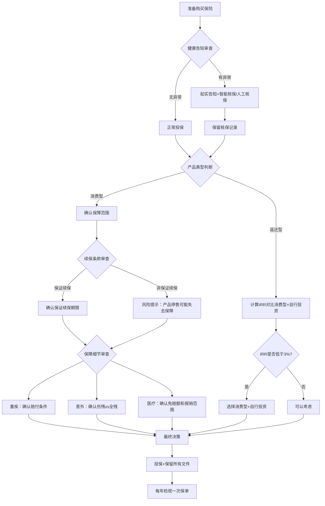
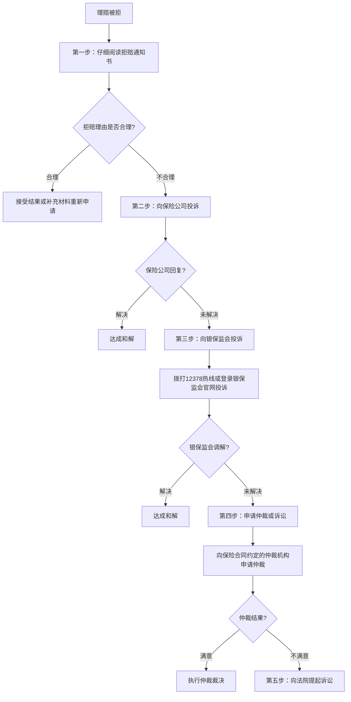

## 案例五：保险避坑实战

### 案例定位

本案例聚焦保险购买和理赔过程中最常见的陷阱，通过6个真实场景还原，逐一拆解坑点、分析原因、给出避坑方法。与前面案例侧重"如何正确配置"不同，本案例侧重"如何识别和避开错误"——这些错误往往让你花了钱却得不到应有的保障。

***

### 场景一：健康告知隐瞒——理赔时的定时炸弹

#### 人物背景

陈女士，35岁，某互联网公司产品经理，年收入25万。2021年体检发现甲状腺结节（TI-RADS 3级），医生建议定期复查。2022年初，朋友推荐她买一份重疾险（保额50万，年保费6800元）。投保时，健康告知问到"是否有甲状腺疾病"，陈女士心想"结节又不是病，医生都说没事"，于是勾选了"否"。

#### 事故发生

2023年8月，陈女士体检发现甲状腺结节增大，进一步检查确诊为甲状腺乳头状癌。手术费用3.2万元，社保报销后自费1.5万元。陈女士随即向保险公司申请重疾险理赔。

#### 理赔结果

保险公司调取了陈女士2021年的体检报告，发现投保前已有甲状腺结节记录。根据《保险法》第十六条，保险公司作出以下决定：

| 处理方式 | 具体内容 |
|----------|----------|
| 拒赔 | 甲状腺癌相关理赔申请被拒绝 |
| 解除合同 | 保险公司解除保险合同 |
| 退还保费 | 退还已交保费（扣除手续费后约1.2万元） |

陈女士不仅没有获得50万理赔款，还失去了保障，之前交的保费也打了折扣。

#### 陷阱拆解

这个陷阱的核心在于三个认知误区：

**误区一："结节不是病，不用告知"**

健康告知的问法是"是否有甲状腺疾病或检查异常"，结节属于检查异常，必须告知。即使医生说"定期复查即可"，在保险核保的视角下，结节是一个需要评估的风险因素。

**误区二："保险公司查不到"**

保险公司的调查能力远超普通人想象。出险后，保险公司会调取以下记录：

- 医院的门诊和住院记录（全国联网）
- 医保卡的使用记录（包括药店购药）
- 体检机构的体检报告
- 同业保险公司的投保和理赔记录
- 社保系统的就医数据

以2024年的技术水平，隐瞒5年前的一次体检异常，被查出的概率超过90%。

**误区三："不如实告知才能买到保险"**

甲状腺结节3级在很多保险公司可以通过智能核保正常投保或除外承保（即甲状腺相关疾病不赔，其他正常保障）。即使需要除外承保，也比完全失去保障强得多。

#### 正确做法

```text
投保前的健康告知流程：

1. 收集自己的完整健康档案
   ├── 近2年体检报告
   ├── 门诊和住院记录
   ├── 医保卡使用记录
   └── 慢性病或既往病史

2. 逐条对照健康告知问卷
   ├── 有问必答，不问不答（有限告知原则）
   ├── 问到的范围要准确理解
   └── 不确定的项目宁可多告知

3. 选择核保友好的产品
   ├── 甲状腺结节3级 → 部分产品可标准体承保
   ├── 甲状腺结节3级 → 多数产品可除外承保
   └── 同时申请多家保险公司，择优选择

4. 保留所有告知记录
   ├── 截图保存智能核保结果
   ├── 保存人工核保的书面回复
   └── 这些是未来理赔的关键证据
```

#### 如果已经隐瞒了怎么办？

如果之前投保时未如实告知，可以考虑以下补救措施：

| 方案 | 操作方式 | 风险评估 |
|------|----------|----------|
| 补充告知 | 向保险公司书面补充告知健康异常 | 保险公司可能维持承保、加费、除外或解除合同 |
| 退保重投 | 退保后选择新产品如实告知 | 有退保损失，且年龄增长导致保费上涨 |
| 继续持有 | 不做任何操作 | 理赔时被查出的风险始终存在，且越晚出险损失越大 |

**建议**：如果投保未满2年，强烈建议补充告知。超过2年的，根据《保险法》第十六条第三款"不可抗辩条款"，保险公司在合同成立超过2年后不得解除合同（但故意隐瞒重大事项的除外，各地法院判例有差异）。

***

### 场景二：返还型保险的"高收益"幻觉

#### 人物背景

张先生，30岁，某制造企业工程师，年收入18万。2020年经亲戚推荐购买了一份"两全保险+附加重疾险"组合产品：

- 年交保费：12800元
- 交费期：20年
- 保障期：至70岁
- 重疾保额：30万
- 满期返还：70岁返还已交保费的120%（即30.72万）

#### 张先生的算盘

"有病治病，没病返本，还能多拿20%，怎么算都不亏。"

#### 真实的数学账

让我们用内部收益率（IRR）来计算这笔"返还"的真实价值：

```python
# 返还型保险的IRR计算
# 现金流：每年支出12800元（连续20年），第40年（70岁）收回307200元

from scipy.optimize import brentq

def npv(rate):
    # 前20年：每年流出12800
    cost = sum(-12800 / (1 + rate)**t for t in range(1, 21))
    # 第40年：流入307200
    income = 307200 / (1 + rate)**40
    return cost + income

irr = brentq(npv, -0.5, 0.5)
# 结果：IRR ≈ 1.68%
```

| 对比项 | 返还型方案 | 消费型方案 |
|--------|-----------|-----------|
| 年交保费 | 12800元 | 3200元（纯消费型重疾险30万保额） |
| 20年总保费 | 256000元 | 64000元 |
| 差额 | - | 每年多出9600元 |
| 差额投资收益（年化5%，40年后） | - | 约116万元 |
| 70岁返还金额 | 307200元 | 0 |
| 70岁总资产 | 307200元 | 约116万元 |

差距达到85万元。即使按保守的年化3%计算，差额投资也能达到约68万元，仍然远超返还金额。

#### 陷阱拆解

**返还型保险的本质**：保险公司用你多交的保费去投资，几十年后把本金（加一点利息）还给你。而这些钱如果由你自己投资，收益远高于保险公司给你的"返还"。

**为什么销售人员热衷推荐返还型？** 因为返还型保费高，销售佣金也高。一份12800元的返还型保单，销售人员可能拿到3000-5000元佣金；而一份3200元的消费型保单，佣金可能只有800-1200元。

**什么时候返还型可以考虑？** 理论上只有一种情况：你确信自己完全不会进行任何投资理财（不买基金、不存定期、不买国债），那么多交的保费至少不会被花掉。但对于有基本理财能力的人来说，返还型永远不是最优选择。

#### 避坑检查清单

```text
判断一份保险是否是"高成本返还型"：

□ 年保费是否超过同类消费型产品的2倍以上？
□ 是否宣传"有病治病、没病返本"？
□ 是否强调"到期返还XX%"作为卖点？
□ 销售过程中是否避而不谈IRR或真实收益率？

以上4项中命中2项以上，基本可以判定为高成本返还型产品。
```

***

### 场景三：医疗险的续保陷阱

#### 人物背景

王女士，28岁，2020年购买了一份百万医疗险，年保费260元，保额200万。产品宣传页面写着"可续保至80岁"。2022年王女士因甲状腺癌住院治疗，医疗险报销了18万元。

#### 续保危机

2023年续保时，王女士收到保险公司通知：

| 项目 | 2020-2022年 | 2023年续保后 |
|------|------------|-------------|
| 年保费 | 260元 | 拒绝续保 |
| 保障状态 | 正常 | 失去保障 |
| 原因 | - | 产品停售 |

王女士震惊了："不是说好可以续保到80岁吗？"

#### 陷阱拆解

关键在于区分两种"续保"：

**保证续保**：写入合同的续保承诺。即使产品停售、即使你理赔过、即使你的健康状况变化，保险公司都必须让你续保。目前银保监会规定，保证续保期限最长为20年。

**非保证续保（可续保）**：只是说"你可以续保"，但保险公司保留了以下权利：
- 产品停售时拒绝续保
- 每年调整费率（可能大幅涨价）
- 根据你的理赔记录调整承保条件

王女士买的就是"非保证续保"产品。产品停售后，她无法再续保，而且因为已经确诊甲状腺癌，其他医疗险也会将甲状腺相关疾病除外承保甚至拒保。

#### 如何识别真正的保证续保

```text
查看保险合同（不是宣传页面）中的续保条款：

✅ 真正的保证续保条款写法：
"本产品为保证续保产品，保证续保期间为20年。
 在保证续保期间内，不论被保险人健康状况是否变化、
 是否发生过理赔，保险公司均不得拒绝续保，
 且不得单独调整被保险人的费率。"

❌ 非保证续保的常见写法：
"本产品可续保至80周岁"
"续保时无需审核健康状况"（但没说不审核理赔记录）
"续保免等待期"（只说明续保条件，没说保证续保）
```

#### 百万医疗险选购的续保维度评估

| 评估维度 | 优选标准 | 风险信号 |
|----------|----------|----------|
| 续保类型 | 保证续保（写入合同） | 仅写"可续保" |
| 保证续保期限 | 20年（目前最长） | 6年或更短 |
| 续保费率调整 | 整体调整（不因个人理赔单独调价） | 保留个人调价权利 |
| 产品停售条款 | 保证续保期内不受停售影响 | 停售即终止 |
| 等待期变化 | 续保时无等待期 | 续保重新计算等待期 |

#### 已经买了非保证续保产品怎么办？

1. **不要急于退保**：在找到替代产品并过了新产品的等待期之前，保留现有保障
2. **叠加购买**：额外购买一份保证续保的产品，两份医疗险在报销型规则下不冲突（实际报销金额不超过自费总额，但多一份产品多一个选择）
3. **趁健康时替换**：如果当前健康状况良好，尽早换成保证续保产品

***

### 场景四：意外险的"全残"文字游戏

#### 人物背景

刘先生，40岁，某建筑公司项目经理。2019年购买了一份意外险，保额100万，年保费360元。保单上写着"意外伤残保障100万"。刘先生认为，万一出意外导致伤残，可以获得100万赔偿。

#### 事故经过

2022年，刘先生在工地巡查时不慎从脚手架跌落，导致右腿粉碎性骨折，经手术治疗后右膝以下截肢（小腿截肢）。经司法鉴定，伤残等级为七级伤残。

#### 理赔争议

刘先生向保险公司申请理赔100万，保险公司回复：

| 项目 | 内容 |
|------|------|
| 伤残等级 | 七级 |
| 保险合同约定 | 意外伤残按《人身保险伤残评定标准》1-10级赔付 |
| 七级伤残对应比例 | 40% |
| 实际赔付金额 | 100万 × 40% = 40万 |

刘先生认为自己"失去了半条腿"应该赔100万，但合同约定是按伤残等级比例赔付。

#### 陷阱拆解

**关键知识点：意外伤残的赔付规则**

意外险的伤残赔付并非"出意外就赔全额"，而是根据伤残等级按比例赔付：

| 伤残等级 | 赔付比例 | 典型情形 |
|----------|----------|----------|
| 一级（最重） | 100% | 植物人状态、双目永久失明 |
| 二级 | 90% | 一侧眼球缺失+另一侧低视力 |
| 三级 | 80% | 一手拇指及食指缺失 |
| 四级 | 70% | 双耳听力永久丧失 |
| 五级 | 60% | 一肢缺失（上肢腕关节以上） |
| 六级 | 50% | 一肢缺失（下肢踝关节以上） |
| 七级 | 40% | 一肢缺失（膝关节以下截肢） |
| 八级 | 30% | 一手指（含拇指）缺失 |
| 九级 | 20% | 一足趾缺失 |
| 十级（最轻） | 10% | 一颗牙齿缺失 |

**常见误区**：很多人看到"意外伤残100万"就以为出意外能赔100万，实际上大部分意外伤残都是8-10级（轻伤），只能赔10-30万。

**另一个文字游戏——"全残"vs"伤残"**

有些意外险只保"全残"（一级伤残），不保"伤残"（1-10级）。一字之差，保障范围天壤之别：

| 保障范围 | 包含的伤残等级 | 实际保障力度 |
|----------|---------------|-------------|
| 意外伤残 | 1-10级 | 覆盖面广 |
| 意外全残 | 仅1级 | 基本等于不赔（全残概率极低） |

#### 避坑检查清单

```text
购买意外险时必须确认：

□ 保障范围是"意外伤残"还是"意外全残"？
  └── 必须是"意外伤残"（覆盖1-10级）

□ 伤残评定标准是什么？
  └── 应为《人身保险伤残评定标准》（行业统一标准）

□ 保额是"意外身故/伤残共用"还是"各自独立"？
  └── 有些产品身故100万、伤残50万，需要看清

□ 是否包含意外医疗责任？
  └── 意外医疗报销意外导致的门诊和住院费用
  └── 注意免赔额和报销比例

□ 是否包含猝死责任？
  └── 严格来说猝死属于疾病死亡，不属于意外
  └── 部分意外险额外包含猝死保障（通常保额较低）
```

***

### 场景五：重疾险的"确诊即赔"误导

#### 人物背景

赵女士，32岁，2021年购买了一份重疾险，保额40万。销售人员告诉她"确诊即赔，拿到诊断书就能赔40万"。2023年，赵女士因急性心肌梗塞入院抢救。

#### 理赔过程

赵女士出院后立即申请理赔，提交了医院的诊断证明。保险公司审核后回复：

| 审核结果 | 原因 |
|----------|------|
| 暂不赔付 | 赵女士的诊断为"急性心肌梗塞"，但不满足合同约定的赔付条件 |

合同中关于急性心肌梗塞的赔付条件是：

```text
急性心肌梗塞的理赔条件（须同时满足以下至少3项）：

1. 典型临床表现（例如急性胸痛等）
2. 新近的心电图改变提示急性心肌梗塞
3. 心肌酶或肌钙蛋白有诊断意义的升高
4. 发病90天后，左心室射血分数低于50%
```

赵女士虽然确诊了急性心肌梗塞，但抢救及时，90天后复查左心室射血分数为58%（高于50%），不满足第4项条件。由于只满足3项中的2项（条件1和3），保险公司拒赔。

#### 陷阱拆解

**真相：只有少数重疾是"确诊即赔"**

重疾险的赔付条件实际上分为三类：

| 赔付类型 | 说明 | 典型疾病 |
|----------|------|----------|
| 确诊即赔 | 拿到确诊报告即可理赔 | 恶性肿瘤（癌症）、严重阿尔茨海默病 |
| 达到某种状态 | 需要达到合同约定的疾病状态 | 急性心肌梗塞、脑中风后遗症、终末期肾病 |
| 实施某种手术 | 需要完成合同约定的手术 | 重大器官移植、冠状动脉搭桥术、心脏瓣膜手术 |

恶性肿瘤（占重疾理赔的60-70%）确实是确诊即赔，所以销售人员说"确诊即赔"不算完全错误，但只说了一半。急性心肌梗塞和脑中风后遗症（占重疾理赔的20-30%）都不是确诊即赔。

**常见的重疾定义争议点**

| 疾病 | 常见争议 | 建议 |
|------|----------|------|
| 急性心肌梗塞 | 需满足多项临床指标，轻度发作可能不达标 | 关注是否包含"较轻急性心肌梗塞"（轻症） |
| 脑中风后遗症 | 需180天后仍遗留功能障碍 | 关注是否包含"轻度脑中风"（轻症） |
| 恶性肿瘤 | 原位癌、TNM分期为I期的甲状腺癌可能被排除 | 关注条款中的除外责任 |
| 终末期肾病 | 需要规律透析90天以上 | 早期肾病不赔 |

#### 避坑方法

```text
购买重疾险时的条款审查重点：

1. 确认前28种重疾定义是否与行业统一标准一致
   └── 2020年修订的《重大疾病保险的疾病定义使用规范》

2. 关注轻症/中症保障
   ├── 轻症：重疾的早期或较轻状态
   ├── 中症：介于轻症和重疾之间
   └── 轻症/中症赔付比例通常为保额的20%-60%

3. 重点关注以下高发轻症是否覆盖：
   ├── 较轻急性心肌梗塞
   ├── 轻度脑中风后遗症
   ├── 冠状动脉介入手术（非开胸）
   ├── 原位癌
   └── 较小面积III度烧伤

4. 了解赔付条件而非仅看病种数量
   └── 100种重疾但定义严格 < 80种重疾但定义宽松
```

***

### 场景六：年金险的"高收益"话术

#### 人物背景

孙先生，45岁，某私企老板，手头有100万闲置资金。2021年，保险代理人向他推荐一款年金险产品，话术如下：

"孙总，这款产品年化收益4.5%，远高于银行存款。而且复利增长，30年后您的100万会变成380万。最关键的是，保险收益写进合同，绝对安全。"

#### 真实收益拆解

孙先生购买后，请懂行的朋友帮他算了一笔账：

| 项目 | 销售话术 | 实际情况 |
|------|----------|----------|
| 年化收益 | 4.5% | IRR实际约2.1% |
| 30年后价值 | 380万 | 约180万 |
| 灵活性 | "随时可取" | 前5年退保损失30%-50% |
| 安全性 | "绝对安全" | 确实安全，但收益低于通胀 |

**IRR计算的关键区别**

销售人员说的"4.5%"通常是以下几种之一：
- **预定利率**：保险公司精算时使用的利率，不等于你的实际收益率
- **万能账户结算利率**：目前的结算利率，不保证未来维持
- **演示利率**：分为低/中/高三档演示，销售人员通常只说高档

而真正的IRR（内部收益率）考虑了所有现金流的时间价值：

```python
# 假设年金险：年交20万，交5年，共100万
# 从第6年开始每年领取3.5万元（终身）
# 第30年时保单现金价值约180万

# 简化IRR计算（到第30年）
# 现金流：-20, -20, -20, -20, -20, +3.5, +3.5, ... (25个+3.5), +180
# IRR ≈ 2.1%
```

#### 不同年金险收益对比

| 产品类型 | 实际IRR | 适合人群 |
|----------|---------|----------|
| 传统型年金险 | 1.5%-2.5% | 极度保守、完全不能承受任何波动 |
| 万能型年金险 | 保底1.75%-3%，目前结算3%-4.5% | 保守型，但要注意结算利率不保证 |
| 增额终身寿险 | 2.5%-3.0%（持有30年以上） | 中长期储蓄需求 |
| 纯债基金 | 3%-5%（历史平均） | 能承受小幅波动的投资者 |
| 银行大额存单 | 2.5%-3.5% | 短中期储蓄 |

#### 陷阱拆解

**话术一："复利增长，越滚越大"**

复利确实强大，但前提是利率要高。2%的复利，30年增长约80%；5%的复利，30年增长约330%。关键不在于是否复利，而在于复利的利率是多少。

**话术二："收益写进合同，绝对安全"**

安全是真的，但"安全"不等于"高收益"。把钱存在银行也安全，国债也安全。年金险的安全性和银行存款、国债相同（都有国家信用或法律保障），但收益率不一定更高。

**话术三："比银行存款利率高"**

比较基准不诚实。银行存款是随时可取的活期或1-5年定期，流动性远高于年金险。年金险要求锁定10年以上才能获得略高于定期存款的收益，流动性溢价被忽略了。

#### 购买年金险的决策框架

```text
在决定是否购买年金险之前，回答以下问题：

Q1: 这笔钱5年内是否会用到？
    是 → 不要买年金险（前期退保损失大）
    否 → 继续

Q2: 你是否有其他投资渠道（基金、股票、房产等）？
    否 → 年金险可以作为保守配置的一部分
    是 → 先比较其他渠道的预期收益

Q3: 你能否接受2%-3%的实际年化收益率？
    否 → 年金险不适合你
    是 → 继续

Q4: 你的主要目的是什么？
    强制储蓄/养老规划 → 年金险可以考虑
    追求高收益 → 不要买年金险
    避债/资产传承 → 咨询专业律师后再决定
```

***

### 保险避坑全景检查清单

将以上六个场景的避坑要点整合为一份可执行的购买前检查清单：



#### 购买前必查的10项清单

| 序号 | 检查项 | 具体要求 | 常见陷阱 |
|------|--------|----------|----------|
| 1 | 健康告知 | 如实告知所有健康异常 | "结节不是病不用告知" |
| 2 | 产品类型 | 优先选消费型，计算返还型IRR | "有病治病没病返本"话术 |
| 3 | 续保条款 | 区分"保证续保"与"可续保" | "可续保至80岁"≠保证续保 |
| 4 | 重疾定义 | 确认赔付条件，不仅看病种数量 | "确诊即赔"只适用于部分疾病 |
| 5 | 伤残标准 | 确认是"伤残"而非"全残" | "全残"几乎等于不赔 |
| 6 | 免赔额 | 医疗险免赔额通常是1万 | 百万医疗≠全额报销 |
| 7 | 等待期 | 越短越好（90天优于180天） | 等待期内出险不赔 |
| 8 | 免责条款 | 仔细阅读每一条 | 高风险运动、既往症等常见除外 |
| 9 | 受益人 | 建议指定受益人而非法定 | 法定受益人可能引发继承纠纷 |
| 10 | 保费占比 | 家庭年保费不超过年收入10% | 保费过高影响生活质量 |

***

### 已投保保单的自检流程

如果你已经有保单但不确定是否买对了，按照以下流程自检：

```text
保单自检四步法：

第一步：整理保单清单
├── 列出所有保单（保险名称、保额、保费、缴费期）
├── 确认每份保单的保障类型（重疾/医疗/寿险/意外）
└── 计算家庭年保费总额和占比

第二步：检查健康告知
├── 调取投保时的健康告知记录
├── 对比当时的实际健康状况
└── 如有遗漏 → 考虑补充告知

第三步：检查保障缺口
├── 重疾保额是否覆盖3-5年家庭年支出？
├── 医疗险是否保证续保？免赔额多少？
├── 寿险保额是否覆盖家庭负债（房贷等）？
├── 意外险保额是否足够？是伤残还是全残？
└── 是否有重复购买的报销型保险？

第四步：优化调整
├── 保障不足的部分 → 补充购买
├── 保障重复的部分 → 退掉性价比低的
├── 返还型保险 → 考虑是否值得保留
└── 非保证续保医疗险 → 尽早替换为保证续保产品
```

***

### 遇到理赔纠纷的维权路径

如果已经遇到理赔纠纷，按以下路径逐级维权：



**各阶段注意事项**

| 维权阶段 | 关键操作 | 时间要求 |
|----------|----------|----------|
| 阅读拒赔通知 | 确认拒赔的具体条款依据 | 收到通知后立即 |
| 保险公司投诉 | 书面投诉，保留送达证据 | 收到拒赔后30天内 |
| 银保监会投诉 | 12378热线，提供保单号和拒赔理由 | 投诉无时间限制但建议尽快 |
| 仲裁 | 按合同约定的仲裁机构申请 | 通常2年内 |
| 诉讼 | 向被告所在地或合同履行地法院起诉 | 诉讼时效3年 |

**维权成功的概率**：根据行业数据，银保监会介入后的调解成功率约为40%-60%。如果进入诉讼程序，只要投保时如实告知且事故在保障范围内，消费者的胜诉率较高。

***

### 本案例核心启示

保险避坑的本质是三件事：

**第一，信息对称。** 大多数保险陷阱利用的是信息不对称——销售人员知道的比你多，所以可以话术引导。破除的方法只有一个：自己学习，自己看条款。不需要成为专家，但需要掌握基本的判断框架。

**第二，合同为王。** 保险理赔看的是合同条款，不是销售人员的承诺，不是宣传页面的广告语，不是朋友圈的推荐。任何口头承诺都不如白纸黑字的合同条款可靠。买保险之前，花30分钟仔细阅读合同中的保险责任、免责条款、续保条款和理赔条件，比听销售人员讲3小时都有用。

**第三，动态管理。** 保险不是一次性购买的商品，而是需要持续管理的风险工具。家庭收入变化、负债变化、家庭结构变化、健康状况变化，都需要同步调整保险方案。每年花1小时检视一次家庭保单，可以避免90%的保险问题。

> 💡 **避坑口诀**：如实告知是前提，消费优先算收益，保证续保看合同，伤残全残要分清，重疾定义看条款，年金IRR算仔细。

***

