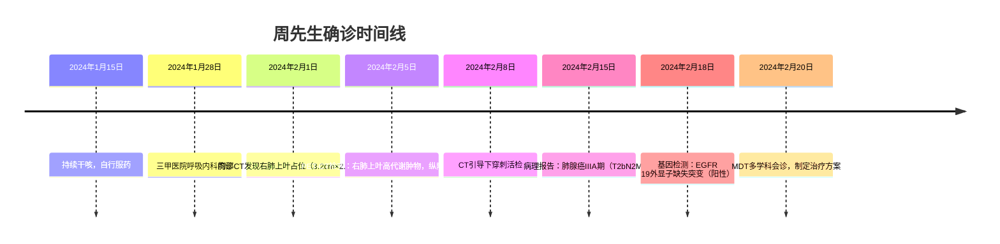
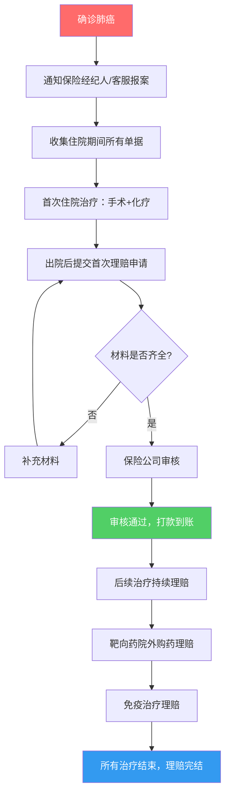
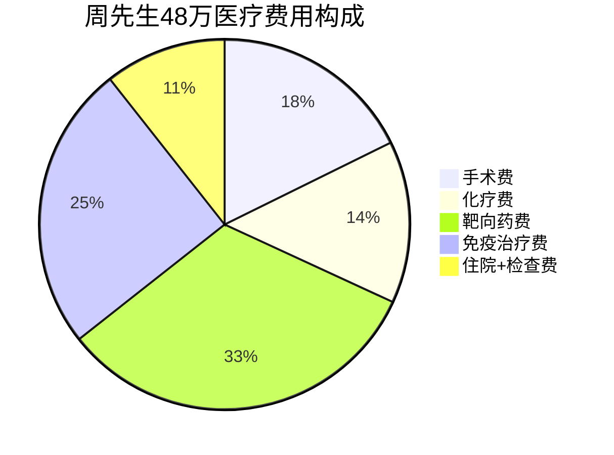
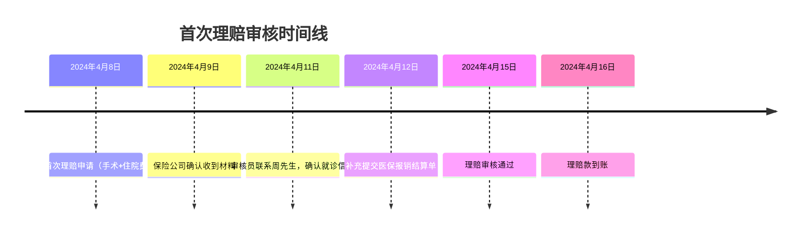
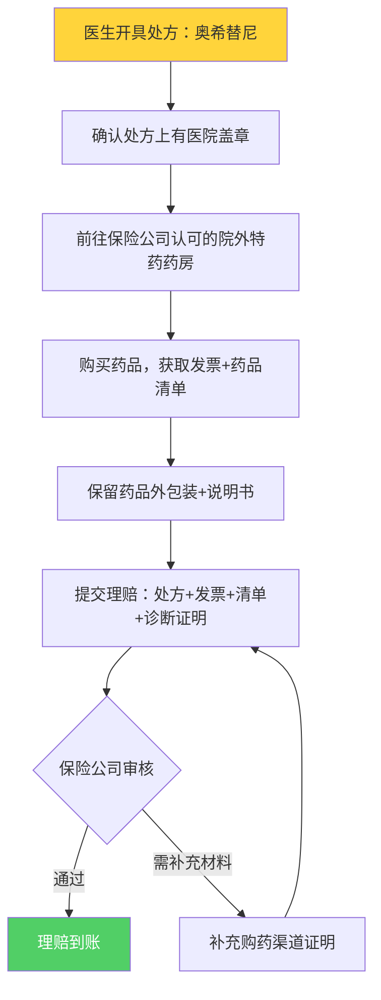
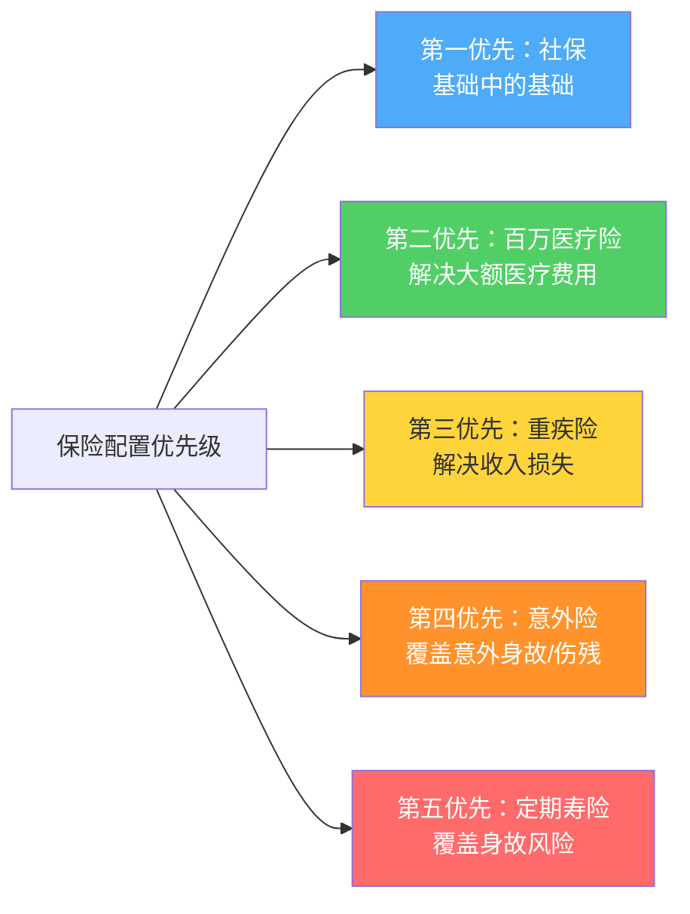

## 案例六：百万医疗险报销全流程实录

百万医疗险号称"一年几百块，报销几百万"，但很多人买了之后根本不知道真到用的时候该怎么操作。本案例以周先生的真实经历为蓝本，完整还原从确诊、报案、提交材料到最终拿到35万元理赔款的全流程，手把手带你走一遍百万医疗险的报销之路。

### 一、投保背景：两年前的一个决定

#### 1.1 周先生的基本情况

| 项目 | 详情 |
|------|------|
| 姓名 | 周先生（化名） |
| 年龄 | 投保时43岁，出险时45岁 |
| 职业 | 某互联网公司中层管理 |
| 年收入 | 税前约50万元 |
| 家庭结构 | 已婚，一个孩子上初中，父母健在 |
| 社保状态 | 城镇职工医保，连续缴纳12年 |
| 既往病史 | 投保前无重大疾病史，体检指标基本正常 |

#### 1.2 当初为什么买百万医疗险

周先生在2022年初参加公司体检时，发现身边两位同事分别确诊了甲状腺癌和肝癌。这让他开始认真思考保障问题。经过研究，他为自己配置了两份保险：

- **百万医疗险**：保证续保20年版，年缴保费680元，保额400万/年，免赔额1万元
- **重疾险**：保额50万元，年缴保费8,500元，缴费期20年

> 💡 **选品要点回顾**：周先生选择百万医疗险时重点关注了三个指标——保证续保年限（20年）、免赔额（1万）、院外特药保障（包含靶向药）。这三个指标在后续理赔中都起到了关键作用。

#### 1.3 投保时的健康告知

周先生在投保时如实告知了以下信息：

- 2020年体检发现轻度脂肪肝（肝功能正常）
- 2021年因感冒就诊过一次（无住院史）
- 无吸烟史，偶尔饮酒

保险公司核保结论：**标准体承保**（即正常承保，不加费、不除外）。

> ⚠️ **关键提醒**：如果周先生当时隐瞒了脂肪肝或者有任何未如实告知的情况，后续肺癌理赔可能面临拒赔风险。如实告知是理赔成功的前提。

---

### 二、确诊过程：从咳嗽到肺癌

#### 2.1 症状与初诊

2024年1月，周先生开始出现持续性干咳，起初以为是冬季感冒，自行购买止咳药服用。两周后咳嗽未见好转，反而出现偶发性胸痛，于是前往某三甲医院呼吸内科就诊。

#### 2.2 检查与确诊时间线



#### 2.3 诊断结果解读

| 指标 | 结果 | 临床意义 |
|------|------|----------|
| 病理类型 | 肺腺癌 | 非小细胞肺癌中最常见的类型，占约40% |
| TNM分期 | T2bN2M0（IIIA期） | 肿瘤>3cm，有同侧纵隔淋巴结转移，无远处转移 |
| 基因检测 | EGFR 19del阳性 | 可使用靶向药奥希替尼，预后相对较好 |
| PD-L1表达 | TPS 45% | 中等表达，免疫治疗可能获益 |

> 💡 **为什么基因检测很重要**：如果EGFR突变阴性，周先生就无法使用奥希替尼这类靶向药，治疗方案和费用结构会完全不同。基因检测费用约8,000-12,000元，百万医疗险通常可以报销。

---

### 三、理赔全流程：从报案到收款

#### 3.1 完整理赔流程图



#### 3.2 第一步：报案（确诊当天）

2024年2月15日拿到病理报告确认肺癌后，周先生当天就做了两件事：

**① 拨打保险公司客服热线报案**

- 拨打保单上的24小时客服电话
- 告知保单号、被保人姓名、确诊病种
- 客服记录报案信息，生成报案编号
- 客服提示：保留所有医疗单据原件，后续通过APP上传

**② 同步通知保险经纪人**

周先生的保险经纪人收到消息后，协助做了以下工作：
- 确认保单状态有效（在续保期内）
- 确认本次疾病在保障范围内（肺癌属于重大疾病）
- 提供理赔材料清单
- 建议先走社保报销，再走商业保险报销

> ⚠️ **报案时效**：百万医疗险一般要求住院后48小时内报案（具体看合同约定）。虽然大部分保险公司对非意外案件的报案时效较宽松，但越早报案越好，避免后续扯皮。

#### 3.3 第二步：治疗与费用产生（2024年2月-8月）

周先生的治疗历时约6个月，涉及多个治疗阶段。以下是完整的费用明细：

| 治疗阶段 | 时间 | 治疗内容 | 总费用 | 医保报销 | 自费部分 |
|----------|------|----------|--------|----------|----------|
| 手术阶段 | 2024年2-3月 | 胸腔镜右肺上叶切除术+纵隔淋巴结清扫 | 8.5万 | 5.2万 | 3.3万 |
| 术后化疗 | 2024年4-6月 | 4个疗程含铂双药化疗（培美曲塞+卡铂） | 6.8万 | 4.0万 | 2.8万 |
| 靶向治疗 | 2024年4月起 | 奥希替尼（泰瑞沙）80mg/日，院外药房购买 | 15.6万 | 0 | 15.6万 |
| 免疫治疗 | 2024年5-8月 | 帕博利珠单抗（可瑞达）4次，200mg/次 | 12.0万 | 0 | 12.0万 |
| 住院费+检查费 | 含PET-CT、基因检测等 | 各类检查、床位、护理 | 5.1万 | 2.8万 | 2.3万 |
| **合计** | - | - | **48.0万** | **12.0万** | **36.0万** |

**费用结构分析：**



几个关键发现：

1. **靶向药是最大开支**（15.6万，占32.5%），且全部在院外药房购买，医保不报销。如果没有百万医疗险的院外特药保障，这笔钱完全自掏腰包。
2. **免疫治疗费用次之**（12万，占25%），同样医保不报销。PD-1抑制剂虽然已纳入医保目录，但周先生使用的进口帕博利珠单抗在当时仍为自费药。
3. **医保实际报销比例仅25%**（12万/48万），远低于很多人以为的"医保能报70-80%"。原因是大量院外购药和进口自费药不在医保报销范围内。

#### 3.4 第三步：首次理赔申请（2024年4月）

周先生在3月份完成手术并出院后，立即启动了首次理赔。

**提交的理赔材料清单：**

| 序号 | 材料名称 | 来源 | 备注 |
|------|----------|------|------|
| 1 | 理赔申请书 | 保险公司APP在线填写 | 需被保人本人签字 |
| 2 | 身份证正反面复印件 | 自行准备 | 需在有效期内 |
| 3 | 银行卡复印件 | 自行准备 | 需为被保人本人账户 |
| 4 | 住院病历（全套） | 医院病案室复印 | 含入院记录、手术记录、出院小结 |
| 5 | 病理报告 | 医院病理科 | 确诊的关键证据 |
| 6 | 医疗费用发票原件 | 医院收费处 | **最重要的材料**，不可遗失 |
| 7 | 费用明细清单 | 医院收费处 | 每一笔费用的详细分类 |
| 8 | 医保报销结算单 | 医保窗口/医院 | 显示社保报销了多少 |
| 9 | 检查报告 | 医院 | CT、PET-CT、基因检测等 |

**材料获取实操指南：**

```text
住院病历获取流程：
1. 出院后7-14个工作日，病历归档到病案室
2. 携带本人身份证+住院号，前往病案室窗口
3. 填写《病历复印申请表》
4. 说明用途：商业保险理赔
5. 病案室会复印并加盖"病案复印专用章"
6. 费用：约0.5-1元/页，全套病历约50-100页
7. 耗时：当场可取或1-3个工作日

费用发票获取要点：
- 发票只能开一次原件，遗失不补
- 如果社保已报销，医院会收回发票原件，给一张"医保报销结算单"
- 部分保险公司接受医保结算单+费用明细的组合，但最好提前确认
- 如果需要发票原件，先不要走社保报销，等拿到原件后再报销
  （部分城市支持先自费出院再走社保二次报销）
```

#### 3.5 第四步：理赔审核过程

**时间线：**



**首次理赔计算：**

```text
总医疗费用（首次住院）：    8.5万（手术）+ 3.6万（住院+检查）= 12.1万
医保报销金额：              5.2万 + 2.8万 = 8.0万
自费金额：                  12.1万 - 8.0万 = 4.1万
扣除年度免赔额：            4.1万 - 1.0万 = 3.1万
首次理赔到账金额：          3.1万元
```

> 💡 **免赔额抵扣**：周先生的医保报销了8万元，这部分可以抵扣1万元免赔额（即"免赔额可以用社保报销部分抵扣"）。实际上，只要社保报销超过1万，百万医疗险的免赔额就被抵消了。但具体是否抵扣取决于产品条款，周先生的产品是"社保报销后剩余部分扣1万免赔"。

#### 3.6 第五步：后续持续理赔

周先生在6个月的治疗期间，分多次提交了理赔申请：

| 理赔批次 | 时间 | 涉及费用 | 自费金额 | 免赔额抵扣 | 理赔到账 |
|----------|------|----------|----------|------------|----------|
| 第1批 | 2024年4月 | 手术+首次住院 | 4.1万 | 1.0万 | 3.1万 |
| 第2批 | 2024年6月 | 4疗程化疗 | 2.8万 | 0（已抵扣） | 2.8万 |
| 第3批 | 2024年5月 | 靶向药（院外购药） | 15.6万 | 0 | 15.6万 |
| 第4批 | 2024年8月 | 免疫治疗+后续检查 | 13.5万 | 0 | 13.5万 |
| **合计** | - | - | **36.0万** | **1.0万** | **35.0万** |

> ⚠️ **重要知识点**：百万医疗险的免赔额是**年度免赔额**，不是每次免赔。同一个保单年度内，扣过一次1万免赔后，后续理赔不再扣免赔。周先生全年共获赔35万元，只扣了1次免赔额。

#### 3.7 院外购药理赔的关键操作

靶向药15.6万是周先生最大的一笔理赔，也是最容易出问题的一笔。以下是院外购药理赔的完整操作流程：



**院外购药理赔必须满足的条件：**

1. **处方必须由医院医生开具**，且盖有医院处方章。自己去药店买药不行。
2. **购药渠道必须合规**。优先使用保险公司指定的特药药房或直付药房。周先生的保险公司在APP上有"特药服务"入口，可以在线申请直付，省去先垫钱再报销的麻烦。
3. **药品必须在保障清单内**。奥希替尼（泰瑞沙）是常见的肺癌靶向药，绝大多数百万医疗险的院外特药清单都包含。
4. **保留完整购药凭证**：发票、药品清单、处方、药品外包装照片。

> 💡 **直付 vs 事后报销**：部分百万医疗险支持院外特药直付——保险公司在审核处方后直接向药房支付药费，患者不需要先垫钱。周先生在第3个月的靶向药购买中就使用了直付功能，省去了15.6万的垫资压力。投保时务必确认产品是否支持特药直付。

---

### 四、重疾险理赔：并行进行

#### 4.1 重疾险理赔流程

周先生在确诊肺癌后，同时启动了重疾险的理赔。与百万医疗险不同，重疾险的理赔更简单：

```text
重疾险理赔步骤：
1. 确诊后拨打重疾险客服热线报案
2. 提交材料：身份证、银行卡、病理报告、诊断证明
3. 保险公司审核（通常5-10个工作日）
4. 审核通过后一次性赔付保额

周先生的结果：
- 提交时间：2024年2月18日（确诊后第3天）
- 材料齐全，无补充要求
- 审核通过时间：2024年2月27日
- 赔付到账：2024年2月28日
- 赔付金额：50万元整
```

#### 4.2 百万医疗险 vs 重疾险理赔对比

| 对比维度 | 百万医疗险 | 重疾险 |
|----------|-----------|--------|
| 赔付方式 | 报销制（花多少报多少，扣除免赔额） | 定额给付（确诊即赔，与花费无关） |
| 理赔频率 | 多次（每次治疗后分别申请） | 一次（确诊后一次性赔付） |
| 理赔周期 | 每次3-15个工作日 | 首次5-15个工作日 |
| 材料复杂度 | 高（需要发票原件、费用明细等） | 低（诊断证明+病理报告即可） |
| 资金到位速度 | 滞后（先治疗后报销） | 快速（确诊即赔，可作应急资金） |
| 周先生实赔 | 35万元 | 50万元 |

---

### 五、总保障效果全景

| 保障来源 | 赔付金额 | 到账时间 | 用途 |
|----------|----------|----------|------|
| 社保（医保） | 12.0万 | 住院结算时直接扣除 | 承担基础医疗费用 |
| 百万医疗险 | 35.0万 | 2024年4月-8月分批到账 | 弥补医疗费用缺口（自费药、院外购药） |
| 重疾险 | 50.0万 | 2024年2月28日一次性到账 | 弥补收入损失、康复费用、家庭开支 |
| **合计** | **97.0万** | - | **医疗+生活的全面保障** |

**资金流向分析：**

周先生实际医疗费用48万元，社保+百万医疗险合计报销47万元（12万+35万），个人仅承担1万元免赔额。

重疾险赔付的50万元则用于：
- 治疗期间2年收入中断补偿（年收入50万×2年=100万收入损失，50万覆盖约一半）
- 康复期营养费、护理费
- 家庭日常生活开支（房贷、孩子学费等）

```mermaid
sankey-beta
    医疗费用48万,社保报销,12
    医疗费用48万,百万医疗险报销,35
    医疗费用48万,自付免赔额,1
    重疾险赔付50万,收入损失补偿,30
    重疾险赔付50万,康复营养费,10
    重疾险赔付50万,家庭日常开支,10
```

> 💡 **核心启示**：百万医疗险+重疾险的组合是抵御大病风险的最佳搭配。百万医疗险解决"看病的钱"——花多少报多少，覆盖自费药、进口药、院外购药；重疾险解决"养病的钱"——确诊即赔，不限用途，弥补收入中断带来的家庭经济危机。两者缺一不可。

---

### 六、理赔中的坑与应对策略

#### 6.1 周先生遇到的实际问题

**问题一：发票原件归属争议**

周先生首次住院出院时，社保窗口直接收回了发票原件。提交百万医疗险理赔时，保险公司要求提供发票原件。

- **解决方案**：向医院申请《医保报销分割单》或《费用结算单》，上面会列明总费用和医保报销金额，加盖医院公章。大部分保险公司接受这种替代方案。
- **预防措施**：出院时提前告知医院需要保留发票原件用于商业保险报销，询问是否可以先自费出院再单独报销医保。

**问题二：靶向药首次购药时的渠道确认**

周先生第一次去院外药房购买奥希替尼时，不知道哪些药房是保险公司认可的，差点去了一家不合规的药房。

- **解决方案**：在保险公司APP的"特药服务"中查看指定药房列表，或致电客服确认。
- **经验总结**：第一次买靶向药前，先走保险公司APP的特药申请流程，系统会引导到指定药房。

**问题三：理赔材料不全被退回**

第2次理赔申请时，因为缺少化疗方案的医嘱单，被保险公司退回要求补充。

- **解决方案**：联系主治医生补开医嘱单，加盖科室章。
- **预防措施**：每次出院前，把所有单据拍照留底，按类别建立文件夹（发票类、病历类、处方类、检查类）。

#### 6.2 百万医疗险理赔常见拒赔原因

| 拒赔原因 | 发生概率 | 应对方法 |
|----------|----------|----------|
| 未如实告知既往病史 | 高 | 投保时务必如实告知，宁可加费承保也不要隐瞒 |
| 等待期内出险 | 中 | 百万医疗险等待期通常30天，等待期内确诊的疾病不赔 |
| 免赔额未达到 | 低 | 年度累计自费超过1万才开始报销 |
| 非保障范围内的费用 | 中 | 整形美容、牙科、不孕不育等通常不在保障范围 |
| 未在指定医院就诊 | 低 | 通常要求二级及以上公立医院，部分产品除外特定医院 |
| 院外购药不合规 | 中 | 必须有医院处方+在认可药房购买 |
| 保单已失效/未续保 | 低 | 确保按时缴费，保证续保产品不会因理赔拒绝续保 |

#### 6.3 提高理赔成功率的7个实操建议

1. **投保时如实告知**：这是理赔成功的基石。隐瞒既往病史是拒赔的第一大原因。
2. **保留所有原件**：发票、病历、处方、检查报告，所有单据都要保留原件。建议从住院第一天起就准备一个文件袋专门存放。
3. **拍照+扫描双重备份**：所有单据拍照存手机，同时扫描PDF存云盘。原件丢失后复印件可能不被接受。
4. **先社保后商保**：先走医保报销，再用医保结算单+剩余发票走百万医疗险。顺序不能反。
5. **院外购药走正规渠道**：使用保险公司APP的特药服务，避免自行去不合规药房购买。
6. **及时报案**：确诊后第一时间报案，不要等治疗结束再报。部分保险公司对延迟报案有处罚条款。
7. **保留保险经纪人联系方式**：遇到理赔问题时，专业的经纪人可以协助沟通，比自己打电话效率高很多。

---

### 七、不同情况下的报销差异模拟

#### 7.1 如果周先生没有百万医疗险

| 项目 | 金额 |
|------|------|
| 总医疗费用 | 48.0万 |
| 社保报销 | 12.0万 |
| 自费金额 | 36.0万 |
| 自费比例 | 75% |

36万元的自费负担，足以掏空一个中产家庭的全部积蓄。尤其是靶向药15.6万和免疫治疗12万，这两项合计27.6万完全是"无底洞"式的持续支出。

#### 7.2 如果周先生的百万医疗险没有院外特药保障

| 项目 | 有特药保障 | 无特药保障 |
|------|-----------|-----------|
| 可报销自费金额 | 36.0万 | 20.4万（扣除15.6万靶向药） |
| 扣除免赔额后 | 35.0万 | 19.4万 |
| 差额 | - | **少报销15.6万** |

> ⚠️ **选品关键提醒**：购买百万医疗险时，务必确认是否包含"院外特药保障"或"恶性肿瘤特药保障"。没有这项保障的百万医疗险，在面对靶向药这种大额院外购药时几乎形同虚设。

#### 7.3 如果周先生的百万医疗险不是保证续保版本

假设周先生买的是1年期非保证续保产品，第一年确诊后理赔了35万。第二年续保时，保险公司有权：

- **拒绝续保**（非保证续保产品的最大风险）
- **除外肺癌及其并发症**后允许续保
- **大幅加费**后续保

这意味着后续的靶向药、免疫治疗费用可能完全没有保障。保证续保20年的产品则不存在这个问题——即使第一年理赔了35万，保险公司也必须继续承保20年。

---

### 八、给不同人群的实操建议

#### 8.1 尚未购买百万医疗险的人

**立即行动清单：**

1. **优先选择保证续保20年的产品**。目前市面上的主流产品（如好医保长期医疗、长相安、蓝医保等）都有20年保证续保版本。
2. **确认院外特药保障**。查看产品条款中是否有"恶性肿瘤院外特药"或"院外购药"相关保障。
3. **如实做好健康告知**。有既往病史的，走智能核保或人工核保，不要隐瞒。
4. **趁早投保**。年龄越小保费越便宜，且健康状况更好更容易通过核保。

**保费参考（2024年主流产品）：**

| 年龄 | 有社保 | 无社保 |
|------|--------|--------|
| 20岁 | 136元/年 | 310元/年 |
| 30岁 | 259元/年 | 598元/年 |
| 40岁 | 520元/年 | 1,180元/年 |
| 50岁 | 1,052元/年 | 2,340元/年 |

#### 8.2 已经购买但不确定保障是否充足的人

**自查清单：**

- [ ] 是否为保证续保产品？
- [ ] 保证续保年限是多少年？
- [ ] 是否包含院外特药保障？
- [ ] 免赔额是多少？（1万是主流，部分产品可选5千）
- [ ] 是否有重疾0免赔？
- [ ] 就医范围是否限定？（是否包含特需、国际部、私立医院）
- [ ] 保额是否充足？（400万以上为佳）
- [ ] 是否有质子重离子治疗保障？

#### 8.3 正在经历理赔的人

**核心建议：**

1. **不要慌，先报案**。打客服电话，获取报案编号和理赔指引。
2. **找经纪人协助**。如果有保险经纪人，第一时间联系，让专业的人帮你把关材料。
3. **材料宁多勿少**。能提供的材料尽量提供，减少补充材料的来回。
4. **善用保险公司的增值服务**。很多百万医疗险提供就医绿通、专家二诊、特药直付等服务，不要浪费。
5. **被拒赔不要放弃**。先确认拒赔理由是否合理，不合理可以向银保监会（现为国家金融监督管理总局）投诉，或走法律途径。

---

### 九、周先生案例的深层思考

#### 9.1 保险的杠杆效应

周先生在2年间累计缴纳百万医疗险保费约1,360元（680×2年），获得35万元理赔。杠杆倍数约257倍。这正是保险"用小钱撬动大保障"的本质。

重疾险方面，周先生累计缴纳保费约17,000元（8,500×2年），获得50万元理赔，杠杆倍数约29倍。虽然杠杆不如百万医疗险高，但重疾险的"确诊即赔"特性提供了百万医疗险无法替代的现金流保障。

#### 9.2 社保的局限性再认识

周先生48万医疗费用中，社保仅报销12万（25%）。社保的局限性在于：

- **报销范围有限**：大量进口药、靶向药、免疫治疗药物不在医保目录内
- **报销比例有限**：即使在医保目录内，也有起付线、封顶线、自付比例的限制
- **不覆盖院外购药**：医生开具处方去院外药房购买的药品，医保不报销
- **不覆盖收入损失**：社保只管"治病"，不管"养病"期间的收入中断

这些局限性正是商业保险存在的意义——社保是基础保障，商业保险是必要补充。

#### 9.3 从这个案例看保险配置的优先级



周先生的案例完美验证了"百万医疗险+重疾险"这个黄金组合的价值。如果预算有限，优先买百万医疗险（几百元/年），再根据预算配置重疾险。如果预算充足，在百万医疗险和重疾险的基础上，再配置意外险和定期寿险，构建完整的家庭保障体系。

---

### 十、本案例关键数据汇总

| 关键指标 | 数据 |
|----------|------|
| 周先生年收入 | 50万元 |
| 百万医疗险年保费 | 680元 |
| 重疾险年保费 | 8,500元 |
| 总医疗费用 | 48万元 |
| 社保报销 | 12万元（25%） |
| 百万医疗险报销 | 35万元（含1万免赔额） |
| 重疾险赔付 | 50万元 |
| 个人实际承担 | 1万元（免赔额） |
| 保险总获赔 | 97万元 |
| 保费总投入（2年） | 约18,360元 |
| 保险杠杆倍数 | 约53倍 |

> 💡 **最后一句话**：保险不是消费，是风险转移的工具。周先生用每年不到1万元的保费，换来了97万元的保障。如果没有保险，48万的医疗费+2年的收入中断，足以让一个年入50万的中产家庭陷入困境。买保险的最佳时间是健康时，其次是现在。
