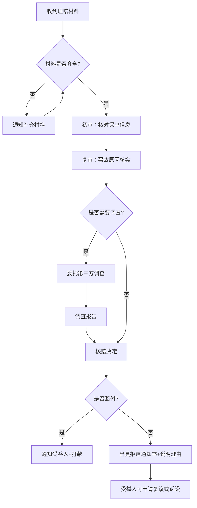
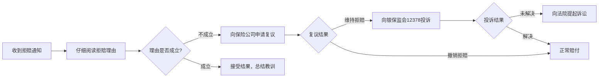

## 案例七：定期寿险理赔实录

> 定期寿险被称为"最纯粹的保险"——不含储蓄、不带分红、没有现金价值，纯粹用保费换保障。正因如此，它杠杆率极高：30岁男性100万保额年缴仅千元左右。但高杠杆也意味着理赔时的争议点多、流程要求严。本案例完整还原一位家庭经济支柱身故后，家属从报案到获赔的全过程，揭示定期寿险理赔的关键节点和常见陷阱。

### 一、案例背景

#### 1.1 被保险人基本信息

| 项目 | 详情 |
|------|------|
| 姓名 | 张伟（化名） |
| 年龄 | 投保时32岁，身故时35岁 |
| 职业 | 某互联网公司后端工程师（职业类别1-2类） |
| 家庭状况 | 已婚，妻子李芳（30岁，全职带娃），女儿3岁，父母60岁/58岁 |
| 年收入 | 税前45万元，家庭唯一经济来源 |
| 负债情况 | 房贷余额180万元（还剩25年），车贷余额8万元 |

#### 1.2 保障配置经过

2021年3月，张伟在家庭责任最重的阶段开始系统配置保险。经过对比多家产品后，他做出了以下配置：

**定期寿险方案（核心保障）：**

| 产品 | 保额 | 保障期限 | 缴费期限 | 年缴保费 | 承保公司 |
|------|------|----------|----------|----------|----------|
| 华贵大麦旗舰版 | 100万 | 至60岁 | 30年缴 | 1,080元 | 华贵人寿 |
| 定海柱2号 | 100万 | 至60岁 | 30年缴 | 1,050元 | 鼎诚人寿 |
| **合计** | **200万** | — | — | **2,130元/年** | — |

**投保决策逻辑：**

张伟的保障额度计算思路非常清晰：

```text
所需保额 = 房贷余额 + 车贷余额 + 子女教育金 + 父母赡养费 + 家庭5年生活费 - 现有储蓄
         = 180万 + 8万 + 80万 + 40万 + 60万 - 20万
         = 348万

实际配置200万，缺口约148万（计划收入增长后加保）
```

他选择了两家不同公司各投保100万，而非一家公司投保200万，原因有三：
- **分散风险**：万一一家公司理赔出现争议，另一家不影响
- **核保差异**：不同公司健康告知宽松度不同，增加承保概率
- **免体检额度**：多数公司300万以下免体检，100万远在安全线内

#### 1.3 健康告知情况

张伟投保时身体状况良好，健康告知全部为"否"：
- 无住院史、手术史
- 无慢性病、遗传病
- BMI 23.5，正常范围
- 不吸烟，偶尔饮酒（社交场合）
- 近两年体检报告无异常

> **关键细节**：张伟保留了投保前两年的完整体检报告，电子版和纸质版各存一份。这个习惯后来在理赔中起到了关键作用。

---

### 二、事件经过

#### 2.1 事故经过

2024年1月15日晚，张伟加班后驾车回家途中，在高速公路上因路面结冰车辆失控，撞上护栏后翻车。120急救到场时已无生命体征，当场确认死亡。交警出具的《道路交通事故认定书》认定：因路面结冰导致车辆失控，张伟无酒驾、无超速、无违规驾驶行为，属于意外事故。

#### 2.2 家属的心理和行动时间线

| 时间 | 事件 | 关键行动 |
|------|------|----------|
| 1月15日晚 | 事故发生 | 亲属赶赴现场，交警介入 |
| 1月16日 | 悲痛中处理后事 | 妻子李芳在亲友提醒下想起有保险 |
| 1月17日 | 翻找保单 | 在张伟书房找到保单复印件和电子保单邮件 |
| 1月18日 | 同时报案 | 拨打华贵人寿和鼎诚人寿客服电话报案 |
| 1月19日-2月5日 | 处理丧葬事宜 | 收集死亡证明、火化证明、户籍注销证明 |
| 2月6日 | 正式提交理赔 | 在保险经纪人协助下递交完整材料 |
| 2月28日 | 两家公司同日结案 | 各赔付100万，合计200万到账 |

---

### 三、理赔全流程详解

#### 3.1 第一步：报案（事故发生后48小时内）

**报案方式和记录：**

```text
报案渠道：拨打保险公司官方客服热线
华贵人寿：400-678-8866
鼎诚人寿：400-818-8899

报案时需提供的信息：
1. 保单号（或投保人姓名+身份证号）
2. 被保险人姓名、身份证号
3. 事故发生时间、地点、原因
4. 报案人姓名、联系方式、与被保险人关系
```

**报案注意事项：**

- **时效要求**：多数定期寿险条款要求"事故发生后10日内通知保险公司"，但实务中48小时内报案最稳妥。张伟家属在事故后第3天报案（扣除周末），符合要求
- **报案后索取报案号**：这是后续跟进理赔进度的凭证
- **记录客服工号和通话时间**：万一后续出现争议，这些记录是证据

> **常见误区**：很多家属以为"报案=理赔"，报案后就等着收钱。实际上报案只是通知保险公司，正式理赔需要后续提交完整材料。有些公司报案后会分配理赔专员主动联系，有些则需要自己跟进。

#### 3.2 第二步：准备理赔材料

定期寿险身故理赔所需的核心材料清单：

| 序号 | 材料名称 | 来源机构 | 获取难度 | 注意事项 |
|------|----------|----------|----------|----------|
| 1 | 理赔申请书 | 保险公司官网下载 | ★☆☆☆☆ | 需受益人亲笔签名 |
| 2 | 保险合同原件/电子保单 | 投保人留存 | ★★☆☆☆ | 电子保单打印件亦可 |
| 3 | 被保险人死亡证明 | 医院/公安机关 | ★★☆☆☆ | 需原件，建议多开几份 |
| 4 | 火化证明 | 殡仪馆 | ★☆☆☆☆ | 需原件 |
| 5 | 户籍注销证明 | 派出所 | ★★☆☆☆ | 需先完成死亡登记 |
| 6 | 受益人身份证 | 受益人本人 | ★☆☆☆☆ | 正反面复印件 |
| 7 | 受益人与被保险人关系证明 | 结婚证/户口本 | ★☆☆☆☆ | 需原件或公证副本 |
| 8 | 受益人银行卡 | 受益人本人 | ★☆☆☆☆ | 需本人名下I类账户 |
| 9 | 交通事故认定书 | 交警部门 | ★★★☆☆ | 张伟案中为意外身故，必需 |
| 10 | 尸检报告（如有） | 法医/鉴定机构 | ★★★★☆ | 非正常死亡通常需要 |

**材料准备的关键细节：**

**死亡证明的获取：**
- 医院内死亡：由医院出具《居民死亡医学证明（推断）书》
- 医院外死亡（如张伟案）：需由公安机关确认死因后出具死亡证明，再到医院补开
- **实务技巧**：死亡证明至少开具5-6份原件，后续银行销户、房产过户、车辆过户、保险理赔等都需要。补开非常麻烦

**受益人确认：**
张伟投保时指定了受益人：
- 第一受益人：妻子李芳（受益比例100%）
- 第二受益人：女儿张小萌（受益比例100%）

> **重要提醒**：如果未指定受益人或受益人填写为"法定"，保险金将作为被保险人的遗产处理，需要所有法定继承人到场签字，流程极为繁琐。张伟正是因为投保时明确指定了受益人，李芳才能以受益人身份直接领取保险金，无需经过遗产继承程序。

#### 3.3 第三步：提交材料并等待审核

**提交方式：**

| 方式 | 适用场景 | 到账时效 | 注意事项 |
|------|----------|----------|----------|
| 线下柜台 | 材料复杂或有争议 | 较慢 | 需预约，带齐原件 |
| 邮寄提交 | 材料简单齐全 | 中等 | 建议用EMS并保留底单 |
| 线上提交 | 金额较小（通常50万以下） | 最快 | 拍照上传，清晰度要求高 |

张伟案中，受益人李芳通过保险经纪人协助，选择邮寄方式同时向两家公司提交材料。经纪人帮忙检查材料完整性，避免因缺件被打回。

**保险公司的审核流程：**



**张伟案的审核过程：**

- **初审阶段**（2月6日-2月10日）：核对保单有效性、确认缴费记录正常、核实受益人身份。两家公司均确认保单有效，保费已按时缴纳至事故发生时
- **复审阶段**（2月11日-2月20日）：核实事故经过。两家公司分别向交警部门核实了交通事故认定书的真实性，确认张伟无酒驾、无故意行为
- **结论**（2月21日-2月28日）：两家公司均认定属于保险责任范围，做出赔付决定

#### 3.4 第四步：赔付到账

| 公司 | 保额 | 赔付金额 | 到账日期 | 理赔时效 |
|------|------|----------|----------|----------|
| 华贵人寿 | 100万 | 100万 | 2024年2月28日 | 22天 |
| 鼎诚人寿 | 100万 | 100万 | 2024年2月28日 | 22天 |
| **合计** | **200万** | **200万** | — | — |

> 两家公司从报案到赔付均在30天内完成，符合《保险法》第二十三条的规定："保险人收到被保险人或者受益人的赔偿或者给付保险金的请求后，应当及时作出核定；情形复杂的，应当在三十日内作出核定。"

---

### 四、赔付金的使用规划

李芳在保险经纪人和理财顾问的帮助下，对200万赔付金做了如下规划：

#### 4.1 资金分配方案

| 用途 | 金额 | 占比 | 具体安排 |
|------|------|------|----------|
| 偿还房贷 | 150万 | 75% | 一次性提前还贷，保留30万低息部分月供无压力 |
| 偿还车贷 | 8万 | 4% | 一次性还清 |
| 女儿教育基金 | 20万 | 10% | 存入大额存单，专户管理 |
| 家庭应急资金 | 15万 | 7.5% | 货币基金+活期，保持流动性 |
| 父母赡养预留 | 7万 | 3.5% | 定期存款，按月支取 |

#### 4.2 资金使用的关键原则

**先还高息负债，再做长期规划：**

```text
优先级排序：
1. 房贷（利率4.9%）→ 优先还，节省的利息就是收益
2. 车贷（利率6.5%）→ 立即还清
3. 教育基金 → 安全第一，选大额存单/国债
4. 应急资金 → 保持流动性，随时可取
5. 父母赡养 → 按月发放，避免一次性给付被挪用
```

**不要做的几件事：**
- 不要一次性把所有钱给亲属"保管"
- 不要盲目投资高风险产品（此时家属处于悲痛中，决策能力下降）
- 不要因为"钱够了"就放弃工作——150万还完房贷后，剩余50万不足以支撑到女儿成年
- 不要急于做重大决定（搬家、辞职、再婚等），至少冷静6个月

---

### 五、案例中的关键经验

#### 5.1 投保阶段的经验

**经验一：保额要覆盖家庭负债总额**

张伟计算保额时，将房贷、车贷、子女教育、父母赡养全部纳入考量，确保万一身故，家庭不会因债务断供而失去住所。这个计算思路值得所有人学习。

**经验二：分公司投保，分散理赔风险**

两家公司各100万的策略在理赔时体现出了价值：两家公司独立审核，互不影响。即使其中一家因某种原因延迟或拒赔，另一家的赔付不受牵连。

**经验三：健康告知如实，留存体检报告**

张伟如实告知健康状况并保留了体检报告，理赔时保险公司无法以"未如实告知"为由拒赔。这是一道关键的防火墙。

**经验四：明确指定受益人**

指定受益人让李芳直接以受益人身份领取保险金，避免了遗产继承的复杂程序。如果写的是"法定"，需要所有法定继承人（配偶、子女、父母）共同到场签字，张伟的父母远在外地，流程会拖很久。

#### 5.2 理赔阶段的经验

**经验五：报案要快，材料要全**

事故后第3天报案，材料一次性提交齐全，没有被打回补充。很多理赔拖延的案例，根源就是材料不全反复补充。

**经验六：善用保险经纪人/代理人协助**

李芳通过张伟投保时的保险经纪人协助理赔，经纪人帮忙检查材料、跟进进度、与保险公司沟通。专业协助让理赔效率大幅提升。

**经验七：保留所有原始凭证**

死亡证明、交通事故认定书、火化证明等关键材料，李芳都保留了原件并复印多份。这些不仅用于保险理赔，后续银行销户、房产过户同样需要。

#### 5.3 资金使用阶段的经验

**经验八：先还债再投资**

200万中158万用于还贷（82.3%），这个比例看似保守，实则明智。还贷等同于无风险收益（节省的贷款利息），而此时家属情绪不稳定，不适合做高风险投资决策。

**经验九：不要告诉太多人**

获赔200万的消息如果传开，可能引来各种借款请求。李芳只告知了双方父母和一位信任的姐姐，避免了不必要的麻烦。

---

### 六、定期寿险理赔的常见争议与应对

#### 6.1 常见拒赔/争议情形

| 争议情形 | 发生概率 | 法律依据 | 应对策略 |
|----------|----------|----------|----------|
| 投保2年内自杀 | 中 | 《保险法》第44条：2年内自杀不赔，退还保费 | 2年后保障完整 |
| 故意犯罪导致身故 | 低 | 条款免责 | 交通事故通常不涉及 |
| 未如实告知既往病史 | 高 | 《保险法》第16条 | 如实告知+保留体检报告 |
| 等待期内因疾病身故 | 中 | 条款约定（通常90-180天） | 等待期后保障才生效 |
| 保单失效/未续保 | 中 | 条款约定 | 开通自动扣费，确保续保 |
| 受益人争议 | 中 | 《保险法》第39-42条 | 明确指定+定期更新 |

#### 6.2 拒赔后的维权路径



**12378投诉热线使用技巧：**
- 工作日9:00-17:00拨打
- 准备好保单号、拒赔通知书编号
- 清晰描述争议焦点
- 投诉后保险公司通常会在15个工作日内主动联系

**诉讼时效提醒：**
- 人寿保险的诉讼时效为5年（《保险法》第26条）
- 从知道或应当知道拒赔之日起算
- 超过5年则丧失胜诉权

---

### 七、定期寿险的选购要点（附本案例产品分析）

#### 7.1 核心对比维度

| 维度 | 重要程度 | 说明 |
|------|----------|------|
| 保费价格 | ★★★★★ | 保额相同情况下越便宜越好 |
| 免责条款 | ★★★★★ | 免责越少越好（最少3条） |
| 健康告知 | ★★★★☆ | 越宽松越好，直接影响能否投保 |
| 最高保额 | ★★★★☆ | 通常可投300-400万，部分城市更高 |
| 等待期 | ★★★☆☆ | 90天优于180天 |
| 全残保障 | ★★★☆☆ | 含全残保障优于仅含身故 |
| 转换权益 | ★★☆☆☆ | 免健康告知转换为终身寿险 |

#### 7.2 张伟选择的两款产品对比

| 对比项 | 华贵大麦旗舰版 | 定海柱2号 |
|--------|---------------|-----------|
| 承保公司 | 华贵人寿 | 鼎诚人寿 |
| 32岁男100万/30年缴 | 1,080元/年 | 1,050元/年 |
| 等待期 | 90天 | 90天 |
| 免责条款 | 3条（最少） | 4条 |
| 健康告知 | 3条（宽松） | 4条 |
| 最高保额 | 350万 | 300万 |
| 全残保障 | 含 | 含 |
| 职业限制 | 1-6类 | 1-4类 |

**选择理由**：大麦旗舰版免责最少、健康告知最宽松；定海柱2号价格略低。两者互补，形成200万保障。

---

### 八、本案例的深层启示

#### 8.1 定期寿险的本质是"收入保险"

很多人不理解为什么要买定期寿险——"人都没了，要钱有什么用？"这个说法忽略了保险的核心价值：**保障的不是被保险人本人，而是依赖其收入生存的家庭成员。**

张伟年收入45万，到60岁退休还有25年工作年限，预期总收入超过1100万。200万保额只覆盖了约18%的未来收入，实际上保额仍然不足。但正是这200万，让妻子不必在丧夫之痛中同时面对房贷断供的压力。

#### 8.2 保费与保额的杠杆比

```text
张伟的杠杆比：
总保费投入：2,130元/年 × 3年 = 6,390元
赔付金额：2,000,000元
杠杆比：2,000,000 ÷ 6,390 = 313倍

即每投入1元保费，撬动了313元保障
```

这就是定期寿险被称为"最具性价比的保险"的原因。相比之下，终身寿险同样100万保额，30岁男性年缴保费可能在1-2万元，杠杆比仅50-100倍。

#### 8.3 每个家庭经济支柱都应该思考的问题

1. **如果你明天不在了，家庭的房贷谁来还？** 没有定期寿险的家庭，一旦经济支柱身故，配偶可能被迫卖房
2. **孩子的教育金从哪来？** 失去经济来源后，教育规划可能被迫中断
3. **父母的养老怎么办？** "白发人送黑发人"的悲剧之上，还要叠加经济困境
4. **配偶需要多长时间重新进入职场？** 全职妈妈重返职场通常需要1-3年过渡期

这些问题的答案，就是你需要的定期寿险保额。

---

### 九、常见问题解答

**Q1：定期寿险到期没出险，保费是不是白交了？**

不是。定期寿险的保费计算基于大数法则，你交的保费中大部分用于分摊同期出险者的赔付。没出险说明你很健康，这是最好的结果。把"没用上保险"理解为"花钱买了几年安心"，心态就对了。

**Q2：多家公司投保，理赔时会互相影响吗？**

不会。《保险法》不禁止重复投保，多家公司的定期寿险可以叠加赔付。这与医疗险不同——医疗险是补偿型，不能重复报销；寿险是给付型，买几份赔几份。

**Q3：受益人可以随时更改吗？**

可以。投保人可以随时向保险公司申请变更受益人，无需被保险人同意（投保人和被保险人为同一人时）。建议在婚姻状况、家庭结构发生变化时及时更新受益人。

**Q4：理赔款需要交税吗？**

不需要。根据《个人所得税法》第四条，保险赔款免征个人所得税。200万理赔款全额到手，无需缴税。

**Q5：保险公司会不会故意拖延理赔？**

正规保险公司一般不会故意拖延。《保险法》第二十三条规定保险公司应在30日内作出核定，属于保险责任的应在达成赔付协议后10日内支付保险金。逾期未支付的，除支付保险金外还应赔偿被保险人或受益人因此受到的损失。如果确实遇到拖延，12378投诉热线是最有效的维权渠道。
