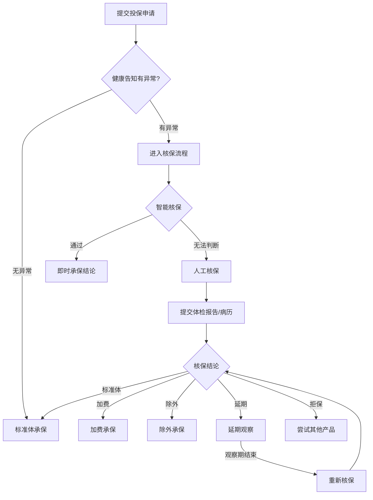

## 案例八：健康异常人群的投保之路

### 一、为什么健康异常人群投保如此困难？

保险公司在承保时，会通过**核保（Underwriting）**流程评估被保险人的风险等级。核保的本质是风险筛选——保险公司需要确保收取的保费与承担的风险相匹配。

健康异常人群在核保中被称为**非标准体（非标体）**，意味着他们的风险高于"标准体"（健康人群）。保险公司对非标体的处理方式主要有五种：

| 核保结果 | 含义 | 对投保人的影响 |
|----------|------|---------------|
| **标准体承保** | 正常承保，不附加任何条件 | 最优结果，保费和保障均不受影响 |
| **加费承保** | 承保但保费上浮 | 保障不减少，但成本增加10%-50% |
| **除外承保** | 承保但排除特定疾病 | 某些高发疾病不在保障范围内 |
| **延期承保** | 暂时不承保，观察一段时间后重新评估 | 需要等待6-24个月后再次申请 |
| **拒保** | 拒绝承保 | 最坏结果，该产品无法购买 |

**关键数据**：根据行业统计，约30%的投保申请存在不同程度的健康异常，其中超过60%最终获得了承保（标准体、加费或除外）。健康异常≠无法投保，这是最常见的认知误区。



***

### 二、常见健康异常的核保结果详解

#### 2.1 甲状腺相关异常

甲状腺异常是体检中最常见的发现之一，也是核保中最"友好"的异常类型。

**甲状腺结节**：

| TI-RADS分级 | 超声特征 | 重疾险核保 | 医疗险核保 | 寿险核保 |
|-------------|----------|-----------|-----------|---------|
| 1级 | 正常甲状腺 | 标准体 | 标准体或除外 | 标准体 |
| 2级 | 良性结节 | 标准体或除外甲状腺癌 | 除外甲状腺疾病 | 标准体 |
| 3级 | 可能良性 | 除外甲状腺癌 | 除外甲状腺疾病 | 标准体 |
| 4级 | 可疑恶性 | 延期或拒保 | 拒保 | 延期 |
| 5级 | 高度可疑恶性 | 拒保 | 拒保 | 拒保 |

**甲状腺癌术后**：

甲状腺乳头状癌（占甲状腺癌的80%以上）被称为"最善良的癌症"，5年生存率超过95%。术后投保策略：

- **术后1年内**：几乎所有产品都会拒保
- **术后1-3年**：部分寿险和年金险可能接受投保
- **术后3-5年**：部分重疾险和医疗险可能除外甲状腺相关疾病承保
- **术后5年以上**：如果复查结果持续正常，越来越多产品愿意承保

**实操要点**：甲状腺结节3级以下，建议优先尝试支持智能核保的产品，通常可以秒出结论，且不留核保记录。

#### 2.2 乳腺相关异常

**乳腺结节**：

| BI-RADS分级 | 重疾险核保 | 医疗险核保 | 寿险核保 |
|-------------|-----------|-----------|---------|
| 1-2级 | 标准体 | 标准体或除外 | 标准体 |
| 3级 | 除外乳腺癌 | 除外乳腺疾病 | 标准体 |
| 4级 | 延期或拒保 | 拒保 | 延期 |

**乳腺增生**：大多数乳腺增生属于生理性变化，不影响核保。但如果是"乳腺囊性增生"或"非典型增生"，核保会更加谨慎。

**实操要点**：BI-RADS 3级的乳腺结节，建议每6个月复查一次超声。如果连续两次复查结果稳定或降级，核保通过率会显著提高。

#### 2.3 肝脏相关异常

**乙肝相关**：

| 状态 | 重疾险核保 | 医疗险核保 | 寿险核保 |
|------|-----------|-----------|---------|
| 乙肝病毒携带（肝功能正常） | 标准体或加费 | 标准体或除外 | 标准体 |
| 小三阳（肝功能正常） | 加费10-30% | 除外肝脏疾病 | 加费 |
| 大三阳（肝功能正常） | 加费20-50%或拒保 | 通常拒保 | 加费或拒保 |
| 乙肝+肝功能异常 | 通常拒保 | 拒保 | 通常拒保 |

**脂肪肝**：

- 轻度脂肪肝（肝功能正常）：大多数产品标准体承保
- 中度脂肪肝（肝功能正常）：可能加费或标准体
- 重度脂肪肝或肝功能异常：加费或拒保

**实操要点**：乙肝病毒携带者投保时，务必提供近3个月内的肝功能检查报告和乙肝五项检查结果，证明肝功能正常是核保通过的关键。

#### 2.4 心血管相关异常

**高血压**：

| 分级 | 收缩压/舒张压 | 重疾险核保 | 医疗险核保 | 寿险核保 |
|------|-------------|-----------|-----------|---------|
| 正常高值 | 130-139/85-89 | 标准体 | 标准体 | 标准体 |
| 高血压I期 | 140-159/90-99 | 加费10-30% | 可能拒保 | 加费 |
| 高血压II期 | 160-179/100-109 | 加费30-50%或拒保 | 拒保 | 加费或拒保 |
| 高血压III期 | ≥180/≥110 | 拒保 | 拒保 | 拒保 |

**高血脂**：

- 总胆固醇<6.5mmol/L且无其他异常：大多数产品标准体承保
- 总胆固醇6.5-7.5mmol/L：可能加费
- 总胆固醇>7.5mmol/L或有并发症：加费或拒保

**实操要点**：高血压患者投保前，建议连续监测血压1-2周，选择血压控制较好的时间段去体检。如果通过药物控制血压在140/90以下，部分产品可以标准体承保。

#### 2.5 代谢相关异常

**糖尿病**：

糖尿病是核保中最为严格的健康异常之一：

- **I型糖尿病**：几乎所有健康险都会拒保
- **II型糖尿病（控制良好）**：少数重疾险可以加费承保，大多数医疗险拒保
- **妊娠期糖尿病（已恢复）**：产后6个月以上且血糖恢复正常，大多数产品可以标准体承保

**高尿酸血症**：

- 尿酸<540μmol/L且无痛风发作：大多数产品标准体承保
- 有痛风发作史：可能加费或除外相关疾病
- 尿酸>540μmol/L或有肾脏并发症：加费或拒保

**肥胖（BMI超标）**：

| BMI范围 | 核保结果 |
|---------|---------|
| 18.5-24.9 | 标准体 |
| 25-27.9 | 标准体或轻微加费 |
| 28-32.9 | 加费10-30% |
| 33-35.9 | 加费30-50% |
| >36 | 拒保或延期 |

#### 2.6 精神心理相关异常

精神心理类疾病是核保中"最不友好"的类别之一：

| 疾病 | 重疾险核保 | 医疗险核保 | 寿险核保 | 意外险核保 |
|------|-----------|-----------|---------|-----------|
| 抑郁症（轻度，已治愈） | 可能延期或除外 | 拒保或除外 | 可能标准体 | 标准体 |
| 抑郁症（中重度） | 拒保 | 拒保 | 加费或拒保 | 标准体 |
| 焦虑症 | 延期或除外 | 拒保或除外 | 可能标准体 | 标准体 |
| 双相情感障碍 | 拒保 | 拒保 | 拒保 | 标准体 |
| 精神分裂症 | 拒保 | 拒保 | 拒保 | 标准体 |

**实操要点**：抑郁症患者如果已经停药超过1年且无复发，部分寿险和意外险可以正常投保。建议先投保意外险（核保最宽松），再逐步尝试其他险种。

***

### 三、健康异常人群的投保策略

#### 3.1 策略一：智能核保优先

**什么是智能核保？**

智能核保是保险公司基于规则引擎或AI模型开发的自动化核保系统。投保人在填写健康告知时，如果有异常情况，可以进入智能核保流程，回答几个针对性问题后，系统会即时给出核保结论。

**智能核保的优势**：

1. **匿名测试**：大多数智能核保不会留下正式的核保记录，即使被拒保也不影响后续投保
2. **即时结论**：不需要等待数天或数周，秒级出结果
3. **标准化流程**：所有投保人面对相同的核保规则，不存在人为偏差
4. **多产品测试**：可以在不同产品之间快速切换，找到核保结果最优的产品

**智能核保的局限**：

1. 覆盖的疾病种类有限，复杂病情可能无法处理
2. 无法提供个性化的核保考量（如整体健康状况良好但有一项异常）
3. 部分产品的智能核保规则过于严格

**操作流程**：

```text
步骤1：选择支持智能核保的产品
步骤2：在健康告知环节如实填写异常情况
步骤3：进入智能核保，回答系统提出的问题
步骤4：上传必要的检查报告（部分产品需要）
步骤5：获取核保结论
步骤6：如果结论不满意，换一家产品重新测试
```

#### 3.2 策略二：多家投保，择优选择

不同保险公司的核保标准差异很大。同一种健康异常，在A公司可能被拒保，在B公司可能标准体承保。

**多产品同时投保的正确方式**：

1. **同时提交**：选择3-5款核保标准不同的产品，在同一时间段内提交投保申请
2. **优先智能核保**：先用智能核保测试，筛选出结论最优的产品
3. **人工核保兜底**：智能核保无法通过的产品，尝试人工核保
4. **择优选择**：在所有核保结论中，选择条件最优的产品

**注意事项**：

- 智能核保一般不会留下记录，但人工核保会留下核保记录
- 多家人工核保的记录可能被其他公司查询到（通过行业共享的核保数据库）
- 建议智能核保先行筛选，只对最优的1-2款产品提交人工核保

#### 3.3 策略三：先易后难，逐步配置

健康异常人群的投保策略应该是"先易后难"：

**第一优先级：意外险**

意外险的健康告知通常最宽松，很多产品甚至没有健康告知。即使有抑郁症、糖尿病等严重疾病，意外险通常也可以正常投保。

**第二优先级：防癌险/防癌医疗险**

防癌险只保障癌症，健康告知比综合重疾险和医疗险宽松得多。例如：

- 高血压、糖尿病患者可以投保防癌险
- 心脑血管疾病患者可以投保防癌险
- 大多数慢性病患者都可以投保防癌险

**第三优先级：寿险**

寿险的核保标准通常比医疗险宽松。即使是高血压、糖尿病患者，也可能通过加费承保的方式获得寿险保障。

**第四优先级：重疾险**

重疾险的核保标准较为严格，但如果病情控制良好，很多疾病可以除外或加费承保。

**第五优先级：医疗险**

医疗险的核保标准通常最严格，因为医疗险的赔付频率最高。

#### 3.4 策略四：利用除外承保

除外承保是指保险公司承保，但将特定疾病排除在保障范围之外。很多投保人对"除外"有抵触情绪，觉得"买保险就是为了保这个病，结果除外了，那还买什么"。

**除外承保的真正价值**：

假设一位甲状腺结节3级的投保人，重疾险除外了甲状腺癌。这意味着：

- 甲状腺癌不赔 ✓ 这确实是一个遗憾
- 但肺癌、肝癌、胃癌、心梗、脑中风等其他重大疾病都赔 ✓
- 一份重疾险保障的疾病有100多种，除外1种，还有100多种

**除外承保 vs 拒保的对比**：

| 对比项 | 除外承保 | 拒保 |
|--------|---------|------|
| 保障范围 | 100多种疾病，除外1-2种 | 0种 |
| 保费 | 正常保费或略低 | 无法购买 |
| 心理保障 | 至少有保障 | 裸奔状态 |

**建议**：如果除外的疾病是低概率事件（如甲状腺癌的5年生存率超过95%），除外承保是非常值得接受的方案。

#### 3.5 策略五：等待期后再投保

某些健康异常可能是暂时性的，等待一段时间后可能恢复正常，从而获得更好的核保结果。

**适合等待的情况**：

| 情况 | 建议等待时间 | 等待期间建议 |
|------|-------------|-------------|
| 妊娠期糖尿病 | 产后6个月 | 定期复查血糖 |
| 轻度肝功能异常 | 3-6个月 | 调整生活习惯，戒酒 |
| 甲状腺结节4级（活检良性） | 6-12个月 | 定期复查超声 |
| 抑郁症停药后 | 12个月以上 | 定期心理评估 |
| 体重超标 | 3-6个月 | 控制饮食，加强运动 |
| 术后恢复期 | 1-5年（视手术类型） | 定期复查，遵医嘱 |

***

### 四、真实案例解析

#### 案例一：甲状腺结节3级的李女士

**基本情况**：

- 李女士，30岁，互联网公司产品经理，年收入25万
- 2023年体检发现甲状腺结节，TI-RADS 3级
- 超声描述：右侧甲状腺低回声结节，大小约0.8cm×0.6cm，边界清，形态规则
- 无其他健康异常

**投保过程**：

| 步骤 | 操作 | 结果 |
|------|------|------|
| 1 | 尝试A公司百万医疗险智能核保 | 除外甲状腺疾病，其他正常承保 |
| 2 | 尝试B公司重疾险智能核保 | 除外甲状腺癌，其他正常承保 |
| 3 | 尝试C公司重疾险智能核保 | 标准体承保（C公司核保标准较宽松） |
| 4 | 尝试D公司定期寿险智能核保 | 标准体承保 |
| 5 | 最终选择C公司重疾险+A公司百万医疗险 | 最优组合 |

**最终方案**：

| 险种 | 产品 | 保额 | 年保费 | 核保结果 |
|------|------|------|--------|---------|
| 重疾险 | C公司 | 50万 | 4800元 | 标准体 |
| 百万医疗险 | A公司 | 200万 | 320元 | 除外甲状腺疾病 |
| 定期寿险 | D公司 | 100万 | 800元 | 标准体 |
| 意外险 | E公司 | 100万 | 200元 | 无需健康告知 |
| **合计** | - | - | **6120元** | - |

**关键经验**：

1. 甲状腺结节3级并不意味着"买不了保险"，通过多家产品测试，找到了标准体承保的方案
2. 即使是除外承保的百万医疗险，保障价值依然巨大
3. 意外险几乎不受健康异常影响，应优先配置

#### 案例二：高血压II期的张先生

**基本情况**：

- 张先生，45岁，企业中层管理，年收入40万
- 高血压病史5年，目前服用降压药控制
- 收缩压控制在150mmHg左右，舒张压95mmHg左右
- 伴有轻度脂肪肝，BMI 28
- 有房贷余额150万，两个孩子（8岁和5岁）

**投保挑战**：

张先生的健康状况比较复杂——高血压II期+脂肪肝+BMI超标，三重异常叠加，核保难度较大。

**投保过程**：

| 步骤 | 操作 | 结果 |
|------|------|------|
| 1 | 尝试多家重疾险智能核保 | 3家拒保，2家加费40-50% |
| 2 | 尝试防癌险 | 标准体承保（防癌险不评估血压） |
| 3 | 尝试多家百万医疗险 | 4家拒保，1家除外心血管疾病 |
| 4 | 尝试定期寿险 | 2家加费30%，1家加费20% |
| 5 | 尝试意外险 | 标准体承保 |

**最终方案**：

| 险种 | 产品 | 保额 | 年保费 | 核保结果 |
|------|------|------|--------|---------|
| 防癌险 | F公司 | 30万 | 3500元 | 标准体 |
| 百万医疗险 | G公司 | 200万 | 580元 | 除外心血管疾病 |
| 定期寿险 | H公司 | 150万 | 3600元 | 加费20% |
| 意外险 | I公司 | 100万 | 250元 | 标准体 |
| **合计** | - | - | **7930元** | - |

**关键经验**：

1. 高血压II期患者投保困难，但并非无路可走
2. 防癌险是高血压患者的"救命稻草"——它不评估血压指标
3. 除外心血管疾病的百万医疗险仍然值得购买——癌症、意外伤害等大额医疗费用依然可以报销
4. 加费承保虽然贵，但比裸奔强得多

#### 案例三：抑郁症康复期的王女士

**基本情况**：

- 王女士，28岁，设计师，年收入18万
- 2022年确诊中度抑郁症，服药治疗8个月
- 2023年6月停药，至今无复发
- 定期进行心理咨询，状态稳定

**投保挑战**：

抑郁症是核保中最棘手的精神类疾病之一。大多数健康险产品对抑郁症的态度是"拒保"或"延期"。

**投保过程**：

| 步骤 | 操作 | 结果 | 备注 |
|------|------|------|------|
| 1 | 停药后立即尝试投保 | 全部拒保或延期 | 停药时间太短 |
| 2 | 等待6个月后再次尝试 | 部分意外险可投保 | 意外险核保最宽松 |
| 3 | 等待12个月后尝试寿险 | 1家标准体承保 | 提供心理咨询记录 |
| 4 | 等待18个月后尝试重疾险 | 1家除外精神类疾病承保 | 提供完整的治疗和康复记录 |
| 5 | 尝试防癌险 | 标准体承保 | 防癌险通常不评估精神疾病 |

**最终方案（停药18个月后）**：

| 险种 | 产品 | 保额 | 年保费 | 核保结果 |
|------|------|------|--------|---------|
| 防癌险 | J公司 | 30万 | 1800元 | 标准体 |
| 重疾险 | K公司 | 30万 | 3200元 | 除外精神类疾病 |
| 定期寿险 | L公司 | 50万 | 400元 | 标准体 |
| 意外险 | M公司 | 50万 | 150元 | 标准体 |
| **合计** | - | - | **5550元** | - |

**关键经验**：

1. 抑症患者投保需要耐心——停药时间越长，核保通过率越高
2. 保留完整的治疗记录、心理咨询记录、复诊记录，这些是核保的重要参考
3. 意外险和防癌险是抑郁症患者最容易投保的险种
4. 除外精神类疾病的重疾险依然有价值——保障了癌症、心梗、脑中风等高发重疾

#### 案例四：乙肝小三阳的陈先生

**基本情况**：

- 陈先生，35岁，销售经理，年收入30万
- 乙肝小三阳，肝功能持续正常（ALT 25U/L，AST 22U/L）
- HBV-DNA<500IU/mL（病毒低复制）
- 肝脏超声正常，无肝硬化
- 已婚，有一个3岁女儿

**投保过程**：

| 步骤 | 操作 | 结果 |
|------|------|------|
| 1 | 尝试A公司重疾险智能核保 | 标准体承保（A公司对乙肝携带者友好） |
| 2 | 尝试B公司百万医疗险智能核保 | 除外肝脏疾病承保 |
| 3 | 尝试C公司百万医疗险智能核保 | 标准体承保（C公司核保较宽松） |
| 4 | 尝试D公司定期寿险 | 标准体承保 |
| 5 | 尝试E公司意外险 | 标准体承保 |

**最终方案**：

| 险种 | 产品 | 保额 | 年保费 | 核保结果 |
|------|------|------|--------|---------|
| 重疾险 | A公司 | 50万 | 5200元 | 标准体 |
| 百万医疗险 | C公司 | 200万 | 350元 | 标准体 |
| 定期寿险 | D公司 | 100万 | 1200元 | 标准体 |
| 意外险 | E公司 | 100万 | 200元 | 标准体 |
| **合计** | - | - | **6950元** | - |

**关键经验**：

1. 乙肝小三阳+肝功能正常+病毒低复制，投保难度远低于想象
2. 关键是提供完整的检查报告：肝功能、乙肝五项、HBV-DNA定量、肝脏超声
3. 不同公司对乙肝的核保标准差异巨大，多家测试是必须的
4. 如果肝功能异常或病毒高复制，投保难度会显著增加

***

### 五、健康告知的正确姿势

#### 5.1 什么是健康告知？

健康告知是投保人在投保时，向保险公司如实告知被保险人健康状况的过程。它是保险合同成立的基础，也是后续理赔的重要依据。

**中国保险法第十六条**：投保人故意或因重大过失未履行如实告知义务，足以影响保险人决定是否同意承保或者提高保险费率的，保险人有权解除合同。

#### 5.2 健康告知的三大原则

**原则一：问什么答什么，不问不答**

中国保险采用"询问告知"原则，即保险公司问什么，投保人回答什么。保险公司没有问到的，投保人不需要主动告知。

举例：如果健康告知问的是"是否被诊断过高血压"，而你只是体检时血压偏高但从未被诊断为高血压，那么回答"否"是正确的。

**原则二：以医学诊断为准，不自我诊断**

- "体检报告上的建议复查"≠确诊疾病
- "轻度脂肪肝"如果没有确诊，可能不需要告知
- "甲状腺结节"如果只是超声发现，需要根据具体产品的告知要求判断

**原则三：如实告知，不隐瞒不夸大**

- 不隐瞒：已确诊的疾病必须如实告知
- 不夸大：体检报告上的"建议随访"不要自行升级为"确诊疾病"
- 保留证据：所有告知内容以书面或电子记录为准

#### 5.3 常见的健康告知误区

**误区一："体检异常不用告知"**

错误。如果体检结果明确指向某种疾病（如空腹血糖>7.0mmol/L提示糖尿病），即使没有正式诊断，也可能需要告知。

**误区二："医生说没事就不用告知"**

错误。医生的临床判断和保险公司的核保标准是两回事。医生说"观察即可"的结节，保险公司可能要求除外承保。

**误区三："告知了就一定买不了"**

错误。如前文所述，大多数健康异常都可以通过智能核保、多家投保等方式获得承保。

**误区四："不告知保险公司也查不到"**

错误。保险公司可以通过医院联网、社保记录、体检机构数据等渠道查询投保人的医疗记录。理赔时的调查力度远超投保时的核保力度。

**误区五："过了两年不可抗辩就没事了"**

错误。两年不可抗辩条款的适用有严格条件。如果投保人故意隐瞒重大疾病，即使过了两年，保险公司仍可能拒赔并解除合同。

***

### 六、健康异常人群的专属保险产品

#### 6.1 防癌险/防癌医疗险

**产品特点**：

- 只保障癌症，不保障其他疾病
- 健康告知宽松，通常不询问高血压、糖尿病、心脏病等
- 适合因慢性病无法投保综合重疾险的人群

**代表产品类型**：

| 类型 | 保障方式 | 保费 | 适合人群 |
|------|---------|------|---------|
| 防癌重疾险 | 确诊癌症一次性赔付 | 中等 | 需要一次性大额赔付 |
| 防癌医疗险 | 报销癌症治疗费用 | 低 | 需要持续医疗费用报销 |
| 终身防癌险 | 保障终身 | 较高 | 年龄较大，希望终身保障 |

#### 6.2 慢病专属医疗险

近年来，部分保险公司推出了针对慢性病患者的专属医疗险：

- **糖尿病专属医疗险**：II型糖尿病患者可投保，保障糖尿病并发症
- **高血压专属医疗险**：高血压患者可投保，保障心脑血管疾病
- **乙肝专属医疗险**：乙肝病毒携带者可投保，保障肝脏相关疾病

**产品局限**：

- 保额通常较低（10-50万）
- 免赔额较高（通常2-3万）
- 保障范围较窄（只保障与慢病相关的疾病）
- 保费比普通医疗险高

#### 6.3 税优健康险

**什么是税优健康险？**

税优健康险是国家政策支持的个人税收优惠型健康保险，具有以下特点：

- **保证续保**：保险公司不得因健康状况变化拒绝续保
- **无等待期**：投保后立即生效
- **可带病投保**：允许已确诊疾病的人群投保
- **税收优惠**：保费可在个人所得税前扣除（每月200元，每年2400元）

**核保规则**：

- 非既往症部分：正常保障，保额通常20-40万
- 既往症部分：降低保额（通常为非既往症保额的50%），或设置更高的免赔额
- 不得拒保：这是税优健康险最核心的优势

**适合人群**：

- 因健康异常被其他产品拒保的人群
- 希望获得"兜底"保障的人群
- 有税收筹划需求的人群

#### 6.4 惠民保（城市定制型商业医疗保险）

**什么是惠民保？**

惠民保是由地方政府指导、商业保险公司承保的城市定制型商业医疗保险。其最大特点是**投保门槛极低**：

- **不限年龄**：0-100岁均可投保
- **不限职业**：任何职业均可投保
- **不限健康状况**：允许带病投保（部分产品既往症降低赔付比例）
- **保费极低**：通常每年50-200元

**惠民保的局限**：

- 保额有限（通常100-300万，但实际赔付有诸多限制）
- 免赔额高（通常2-4万）
- 报销比例有限（通常70-80%）
- 既往症可能降低赔付比例或不赔付
- 不保证续保（每年产品可能调整）

**惠民保的定位**：

惠民保不是商业医疗险的替代品，而是补充。对于因健康异常无法投保商业医疗险的人群，惠民保是最后的"安全网"。

***

### 七、投保前的准备清单

#### 7.1 资料准备

在投保前，健康异常人群应准备以下资料：

```text
□ 近3-6个月的体检报告
□ 相关疾病的诊断报告和病历
□ 近期的检查结果（如超声、CT、血液检查等）
□ 用药记录（如有长期服药）
□ 手术记录（如有手术史）
□ 复查记录（如定期复查的报告）
□ 医生的诊断意见或治疗方案
```

#### 7.2 信息整理

建议在投保前，整理一份个人健康档案：

```text
个人健康档案模板：

1. 基本信息
   - 姓名、性别、出生日期
   - 身高、体重、BMI

2. 疾病史
   - 确诊疾病名称
   - 确诊时间
   - 当前治疗方案
   - 最近一次复查结果

3. 用药情况
   - 药物名称、剂量、频率
   - 用药起始时间

4. 手术史
   - 手术名称、时间
   - 术后恢复情况

5. 家族病史
   - 直系亲属的重大疾病史

6. 体检异常
   - 近3年体检报告中的异常项
```

#### 7.3 心理准备

健康异常人群在投保前需要做好以下心理准备：

1. **接受除外或加费**：这不意味着"买亏了"，而是获得保障的合理代价
2. **耐心多试几家**：不同公司的核保标准差异很大，不要因为一家拒保就放弃
3. **先保障后完美**：先获得基本保障，再逐步优化方案
4. **长期规划**：健康状况会变化，定期复查、控制病情，未来可能获得更好的核保结果

***

### 八、常见问题解答

**Q1：智能核保被拒保了，会影响以后投保吗？**

A：大多数产品的智能核保不会留下正式的核保记录，因此不影响后续投保。但人工核保的记录可能会被行业共享的核保数据库记录，建议先用智能核保筛选。

**Q2：已经买了保险，后来查出健康异常，保险公司会拒赔吗？**

A：不会。保险合同生效后，只要投保时如实告知了当时的健康状况，后续新发生的疾病不在告知范围内，保险公司必须正常理赔。

**Q3：除外承保的疾病，以后可以申请"复效"吗？**

A：目前少数保险公司支持"除外复议"——如果被除外的疾病在一定时间后（如2年）恢复正常，可以申请重新核保，取消除外。但大多数产品不支持此项服务。

**Q4：带病投保的保费会不会特别贵？**

A：加费承保的保费通常比标准体高10%-50%，但不会高到离谱。如果加费超过50%，通常保险公司会选择拒保而非加费。

**Q5：有既往症的医疗险，理赔时会被区别对待吗？**

A：如果是除外承保，既往症相关的医疗费用不赔付，其他疾病正常赔付。如果是标准体承保，则所有疾病都正常赔付。理赔时保险公司不会因为投保人有既往症而故意刁难。

**Q6：父母有慢性病，子女投保会受影响吗？**

A：家族病史是核保的参考因素之一，但通常不会直接导致拒保。例如，父母有糖尿病，子女投保时可能需要提供血糖检查报告，如果血糖正常，通常可以标准体承保。

***

### 九、经验总结

健康异常人群的投保之路虽然比健康人群曲折，但绝非无路可走。核心策略可以总结为以下几点：

**策略要点回顾**：

| 序号 | 策略 | 核心要点 |
|------|------|---------|
| 1 | 智能核保优先 | 匿名测试，不留记录，快速筛选最优产品 |
| 2 | 多家投保择优 | 不同公司核保标准差异大，至少测试3-5家 |
| 3 | 先易后难 | 意外险→防癌险→寿险→重疾险→医疗险 |
| 4 | 接受除外承保 | 除外1-2种疾病，仍有100多种疾病受保障 |
| 5 | 善用专属产品 | 防癌险、慢病专属医疗险、税优健康险、惠民保 |
| 6 | 如实告知 | 不隐瞒不夸大，保留完整医疗记录 |
| 7 | 控制病情再投保 | 等待病情稳定或改善后，核保结果更好 |

> **本节要点**：健康异常不等于无法投保。通过智能核保测试、多家产品对比、先易后难的配置策略、以及专属保险产品的合理利用，大多数健康异常人群都能获得不同程度的保险保障。关键是如实告知、耐心尝试、接受合理条件，先获得基本保障，再逐步优化方案。
