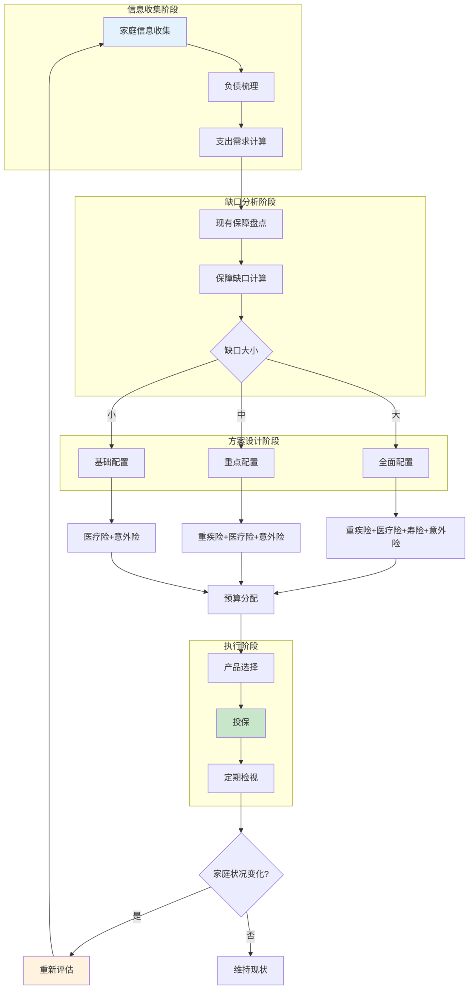
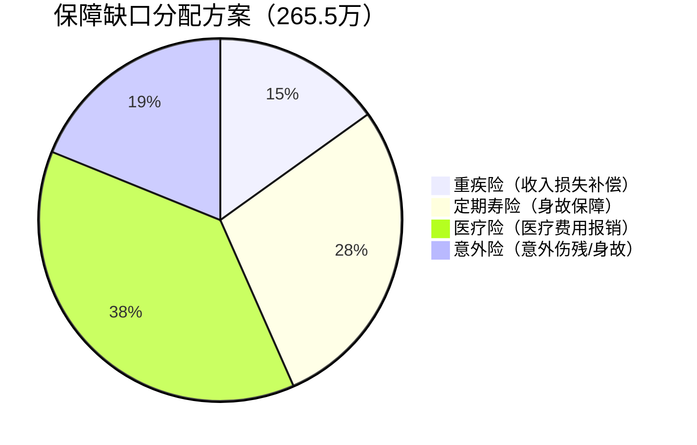
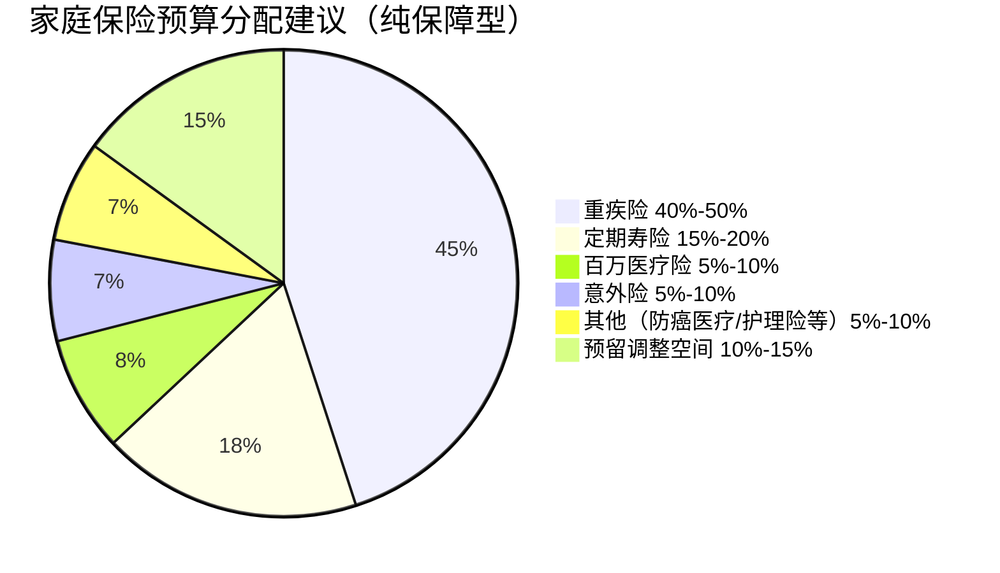

## 一、家庭保险方案设计

家庭保险方案设计不是"买几份保险"这么简单。它是一个系统工程，需要回答三个核心问题：**家庭面临哪些风险？需要多少保障缺口？用什么产品、花多少钱来填补这个缺口？** 本节将从需求分析到方案落地，给出一套可直接执行的完整方法论。

### 1.0 家庭保障需求分析流程

科学的家庭保障需求分析是保险配置的第一步。很多家庭买保险时凭感觉——"听说重疾险好就买一份"、"朋友推荐就买了"，结果要么保额不够用，要么保费占收入过高影响生活质量。下面这套流程帮你避免这些问题。



**关键指标速查**：

| 指标 | 计算公式 | 参考标准 |
|------|----------|----------|
| 保障缺口 | 家庭负债 + 支出需求 - 已有保障 | 缺口 > 年收入 5 倍需全面配置 |
| 保费预算 | 家庭年税后收入 × 5%-10% | 收入越高比例可越低 |
| 重疾险保额 | 年收入 × 3-5 倍 | 覆盖治疗期 + 康复期收入损失 |
| 寿险保额 | 家庭负债 + 5-10 年生活费 - 储蓄 | 确保家人生活水平不骤降 |
| 意外险保额 | 年收入 × 5-10 倍 | 重点关注伤残赔付比例 |
| 医疗险保额 | 100-400 万 | 百万医疗险通常足够 |

### 1.1 家庭保障需求分析：三步法详解

设计保险方案的第一步是分析家庭的保障需求。下面用"需求分析法"一步步拆解，配合一个完整的案例来说明。

#### 第一步：计算家庭负债和支出需求

这张表是需求分析的核心工具。每个家庭都应该填一遍，数字越精确越好，不要"大概"、"差不多"。

| 项目 | 计算逻辑 | 示例：三口之家（丈夫 30 岁/妻子 28 岁/孩子 2 岁） |
|------|----------|------------------------------------------------------|
| 房贷余额 | 银行贷款系统查询剩余本金 | 150 万 |
| 车贷余额 | 剩余还款总额 | 10 万 |
| 其他负债 | 信用卡、消费贷、亲友借款 | 5 万 |
| 子女教育至大学毕业 | 公立路线约 50-80 万，私立/留学 150-300 万 | 80 万（公立路线） |
| 父母赡养费用 | 预估每月赡养金额 × 12 × 预估年数 | 50 万（双方父母各 2000 元/月 × 约 20 年） |
| 家庭基本生活费 | 月支出 × 12 × 缓冲年数（建议 5 年） | 60 万（月支出 1 万 × 5 年） |
| 配偶再就业过渡期 | 预计重新学习和找工作的时间成本 | 10 万 |
| 丧葬及善后费用 | 通常 5-15 万 | 10 万 |
| **合计** | — | **375 万** |

**关于数字来源的说明**：

- **房贷余额**：登录银行 APP → 贷款详情 → 查看"剩余本金"，不要看"剩余还款总额"（那包含利息）。如果用公积金贷款，利率低但本金不变。
- **子女教育费**：教育部 2024 年数据显示，一个孩子从幼儿园到大学公立路线总花费约 50-80 万；如果走国际学校+留学路线，200-300 万是常态。建议按家庭实际规划取值。
- **父母赡养费**：先和父母沟通他们目前的退休金/养老金收入，缺口部分才是你需要承担的。如果父母有职工养老金且身体健康，这个数字可能很低；如果农村父母只有新农保（每月 100-200 元），缺口就很大。
- **基本生活费**：用过去 3-6 个月的家庭账单（支付宝/微信年度账单可查）算出月均支出，再乘以 5 年。5 年是保险行业通用的"家庭经济支柱倒下后的缓冲期"假设。

#### 第二步：盘点已有保障

这一步很多人做得粗糙，结果高估了保障缺口，花了冤枉钱。逐项盘点：

| 保障来源 | 盘点方法 | 示例金额 |
|----------|----------|----------|
| 社保（职工社保） | 登录社保 APP 查看缴费基数和年限。身故抚恤金 = 缴费年限 × 1 个月当地社平工资（上限 20 万）。养老金另算 | 15 万 |
| 社保（居民社保） | 身故抚恤金通常只有几千元，可忽略 | 0.5 万 |
| 单位团险 | 找 HR 索取团体保险方案，看清保额和覆盖范围。注意：离职后保障即失效 | 20 万（重疾）+ 10 万（寿险） |
| 已有商业保险 | 翻出所有保单，登录保险公司 APP 或公众号查询有效保单 | 30 万（重疾）+ 50 万（寿险） |
| 家庭储蓄 | 活期 + 定期 + 货币基金（可快速变现部分） | 30 万 |
| 可变现投资 | 股票、基金、可快速处置的理财（按 70% 折算） | 20 万 × 70% = 14 万 |
| **合计** | — | **约 109.5 万** |

**特别注意**：

- **单位团险不要高估**。很多公司的团险重疾保额只有 10-20 万，且离职即失效。它只能作为补充，不能作为主力保障。
- **社保的身故保障很弱**。职工养老保险的丧葬补助金和抚恤金加起来通常不超过 20 万，居民社保更少。社保的核心价值在医疗报销和养老金，身故保障几乎可以忽略。
- **储蓄不要全算进去**。如果把所有储蓄都算作保障，意味着遇到风险时要"掏空家底"。保险的作用恰恰是保护储蓄不被掏空。建议只算"可快速变现且不影响生活质量的部分"。

#### 第三步：得出保障缺口并制定方案

```text
保障缺口 = 375 万（负债+支出需求）- 109.5 万（已有保障）= 265.5 万
```

这个 265.5 万的缺口需要用商业保险来填补。但不是一种保险填完，而是按功能分工：



> **注意**：医疗险和意外险的"保额"是报销/赔付上限，不是一次性给付。重疾险和寿险的保额才是确诊/身故后一次性给付的金额。所以虽然医疗险保额 200 万看起来很大，它解决的是"医疗费"问题，和重疾险解决的"收入损失"问题不是一回事。

### 1.2 不同人生阶段的保险方案

#### 阶段一：单身期（22-28 岁）

**人群画像**：刚工作 1-6 年，收入 5000-15000 元/月，父母尚在工作或有退休金，无房贷或房贷压力小。

**核心风险**：重大疾病导致的收入中断（此时储蓄少，抗风险能力弱）。

| 险种 | 保额建议 | 年保费参考（25 岁男性） | 优先级 |
|------|----------|------------------------|--------|
| 重疾险 | 30 万 | 2000-3000 元（消费型） | ★★★ |
| 百万医疗险 | 200 万 | 200-300 元 | ★★★ |
| 意外险 | 50 万 | 150-300 元 | ★★★ |
| 定期寿险 | 暂不需要 | — | ★ |

**为什么单身期重疾险保额 30 万就够了？** 因为单身期没有家庭负债和抚养责任，重疾险主要覆盖"治疗期 2-3 年的收入损失 + 自付医疗费"。30 万基本能覆盖。但如果父母没有退休金且你是独生子女，建议提高到 50 万——因为你倒下后，父母可能同时失去赡养来源。

**投保技巧**：
- 重疾险选消费型（不含身故责任），保费比储蓄型低 40%-60%。单身期预算有限，把钱花在刀刃上。
- 百万医疗险选保证续保 20 年的产品。25 岁投保，到 45 岁都在保障期内，不用担心产品停售。
- 如果收入低于 5000 元/月，可以先把重疾险换成"一年期重疾险"（保费 500-800 元），等收入提升后再换成定期/终身重疾险。

**总保费预算**：约 2500-3500 元/年，占月收入 3%-5%，不影响生活质量。

#### 阶段二：成家期（28-35 岁）

**人群画像**：结婚 1-7 年，双职工家庭，有房贷 100-300 万，有 0-2 个孩子（0-5 岁），父母开始退休。

**核心风险**：经济支柱身故/重病导致房贷断供、子女抚养困难。

**这是保险配置最复杂也最关键的阶段**——家庭负债最高、责任最重、但收入也在增长期。方案必须夫妻双方分别设计，因为男女的保费差异和风险侧重不同。

| 险种 | 丈夫（30 岁） | 妻子（28 岁） | 家庭年保费 | 说明 |
|------|--------------|--------------|-----------|------|
| 重疾险 | 50 万 | 50 万 | 8000-12000 元 | 保额 = 年收入 3-5 倍，覆盖治疗+康复期 |
| 百万医疗险 | 200 万 | 200 万 | 600-800 元 | 夫妻分别投保，不要买"家庭版"共享保额的产品 |
| 意外险 | 100 万 | 50 万 | 500-800 元 | 丈夫保额更高（收入贡献通常更大） |
| 定期寿险 | 200 万 | 100 万 | 2000-4000 元 | 保额覆盖房贷 + 子女教育 + 5 年生活费 |
| **合计** | — | — | **11100-17600 元** | — |

**为什么丈夫的寿险和意外险保额要高于妻子？**

这和性别无关，和家庭经济责任分配有关。如果丈夫是主要收入来源（贡献家庭收入 60% 以上），他倒下后家庭收入锐减，房贷、教育、生活费全部压在妻子身上。200 万定期寿险的作用是：丈夫不幸身故，200 万赔付覆盖 150 万房贷 + 50 万子女教育基金，妻子不需要卖房、孩子不需要转学。

如果夫妻收入相当（各占 50%），则双方保额应相同。**核心原则是：谁对家庭经济贡献大，谁的保额就高。**

**关于定期寿险的保障期限**：

| 保障期限 | 适用场景 | 保费差异 |
|----------|----------|----------|
| 保至 60 岁 | 子女已成年、房贷已还清、有养老储蓄 | 基准价 |
| 保至 70 岁 | 子女成年较晚、或想给配偶更多保障 | 比保至 60 岁贵 30%-50% |
| 保 20/30 年 | 预算有限，先覆盖最紧张的时期 | 最便宜 |

**推荐**：大多数家庭选"保至 60 岁"即可。60 岁时子女通常已工作、房贷已还清，寿险的保障意义大幅下降。

#### 阶段三：成长期（35-50 岁）

**人群画像**：事业高峰期，年收入 20-80 万，子女在上中小学，父母 60-75 岁开始需要照护，房贷可能还了一半。

**核心风险**：收入高峰期的重疾风险（35-55 岁是重疾高发期），子女教育金需求刚性，父母医疗支出增加。

**这个阶段的核心任务是"加保+补缺"**：

1. **重疾险加保**：35 岁时再加一份 30-50 万重疾险，使总保额达到 80-100 万。为什么？因为 35 岁后收入比 28 岁时高很多，但重疾险保额还是按 28 岁时的收入买的。50 万保额在 35 岁时可能只相当于 2 年收入，不够覆盖 3-5 年的收入损失。

2. **开始配置年金险/增额终身寿险**：为养老做准备。这个阶段收入高、结余多，是积累养老储备的黄金期。年化复利 3%-3.5% 的增额终身寿险，50 岁时现金价值可能已经翻倍。

3. **为父母配置防癌医疗险**：65 岁以上老人很难买到百万医疗险（健康告知过不了），但防癌医疗险健康告知宽松（三高、糖尿病都能买），且癌症占重疾理赔的 60%-80%。

4. **子女的保险补充**：给孩子加一份学平险（100-200 元/年，覆盖意外+住院），如果预算允许，再加一份 50 万定期重疾险（少儿重疾险保费极低，0 岁投保 50 万保额仅需 500-800 元/年）。

| 险种 | 操作 | 预计新增年保费 |
|------|------|---------------|
| 重疾险加保 | 再买 30-50 万 | 5000-8000 元 |
| 年金/增额寿 | 年交 3-5 万 | 30000-50000 元 |
| 父母防癌医疗险 | 双方父母各一份 | 4000-8000 元（4 人） |
| 子女学平险 | 学校统一购买 | 100-200 元 |
| 子女重疾险加保 | 补充至 50 万 | 500-800 元 |

**年交总保费可能达到 5-7 万**，但这包含了养老储蓄的部分（年金/增额寿本质上是储蓄，不是消费）。纯保障类保费仍在 2-3 万，占收入比例合理。

#### 阶段四：退休期（50 岁以上）

**人群画像**：即将退休或已退休，子女已工作，收入下降但有积蓄，健康风险显著上升。

**核心风险**：重大疾病（癌症、心脑血管疾病高发），意外骨折（65 岁以上骨折发生率是年轻人的 3-5 倍），长期护理需求。

**这个阶段买保险的困境**：保费贵、保额低、健康告知过不了。所以策略是"能买什么买什么，买不了的用储蓄兜底"。

| 险种 | 50-60 岁 | 60-70 岁 | 70 岁以上 |
|------|----------|----------|-----------|
| 百万医疗险 | 如果健康告知能过，必须买 | 续保产品继续持有，新投保困难 | 基本买不到 |
| 防癌医疗险 | 百万医疗险买不了时的替代方案 | 首选（健康告知宽松） | 仍然可以买（部分产品到 80 岁） |
| 意外险 | 50-100 万保额 | 20-50 万保额（保费上涨） | 10-20 万保额 |
| 重疾险 | 保费倒挂（保费 > 保额），不建议新购 | 不建议 | 不建议 |
| 长期护理险 | 开始关注，了解产品 | 可以配置 | 保费极高 |
| 年金险 | 之前配置的开始领取 | 持续领取 | 持续领取 |

**50 岁以上投保的三个关键提示**：

1. **百万医疗险的"健康告知"是最大门槛**。高血压（收缩压 ≥ 160mmHg）、糖尿病（空腹血糖 ≥ 7.0mmol/L）、甲状腺结节（TI-RADS 4 级以上）、肺结节（≥ 6mm）等常见问题都可能导致拒保。如果父母还在 50-55 岁且身体尚可，趁早投保，越晚越难。
2. **防癌医疗险是百万医疗险买不了时的最佳替代**。癌症占重疾理赔的 60%-80%，防癌医疗险覆盖了最大的风险。而且健康告知只问癌症相关问题，三高、糖尿病、心脏病都不影响投保。
3. **重疾险在 50 岁后大概率出现"保费倒挂"**（交的保费比保额还高），完全不划算。用防癌医疗险 + 意外险 + 储蓄的组合来替代。

### 1.3 预算分配技巧

#### 保费预算的合理区间

**5%-10% 原则**：家庭年保费支出（不含储蓄型保险的年金/增额寿部分）建议为家庭年税后收入的 5%-10%。

但这个比例不是死的，要根据家庭实际情况调整：

| 家庭年税后收入 | 建议年保费（纯保障） | 占比 | 说明 |
|---------------|---------------------|------|------|
| 10 万以下 | 3000-5000 元 | 3%-5% | 预算紧张，优先百万医疗+意外险 |
| 10-20 万 | 5000-10000 元 | 5%-8% | 标准配置，四大险种齐全 |
| 20-50 万 | 10000-25000 元 | 5%-8% | 充足配置，保额做足 |
| 50 万以上 | 20000-50000 元 | 4%-7% | 高保额 + 可考虑储蓄型产品 |

#### 各险种预算分配比例



**重疾险为什么占最大比例？** 因为重疾险是"确诊即赔"的给付型保险，赔付金额最高（通常 30-100 万），且保障期限最长（终身型）。它的保费也最贵——30 岁男性买 50 万保终身重疾险，年保费约 5000-8000 元。而百万医疗险 200 万保额只要 300-500 元，意外险 100 万保额只要 200-400 元。

#### 预算有限时的优先级排序

如果家庭年收入只有 10 万，拿不出 5000-10000 元买齐四大险种怎么办？按以下优先级逐步配置：


**为什么百万医疗险排第一？** 因为它保费最低（一顿饭的钱），但保额最高（200-400 万），且覆盖所有疾病和意外导致的住院费用。一场大病的治疗费用动辄 30-50 万，社保报销后自付部分仍然可能是 10-20 万。百万医疗险解决的就是这个"自付部分"。

**为什么意外险排第二？** 因为意外险的"杠杆率"（保额÷保费）是所有保险中最高的——100 万保额只要 200-400 元，杠杆率高达 2500-5000 倍。而且意外伤残是意外险独有的保障（重疾险不赔意外伤残，寿险只赔身故/全残）。

### 1.4 特殊家庭结构的保险方案调整

不是所有家庭都是"夫妻+孩子+父母"的标准结构。以下几种常见特殊结构需要调整方案：

#### 独生子女家庭

**核心问题**：独生子女是父母唯一的经济依靠。一旦独生子女身故或重病，父母将同时失去赡养来源和精神支柱。

**方案调整**：
- 寿险保额额外增加 50-100 万（覆盖父母 20-30 年的赡养费用）
- 重疾险保额提高到 80-100 万（覆盖治疗期 + 康复期对父母的赡养）
- 建议父母尽早配置防癌医疗险 + 意外险，降低子女的赡养压力

#### 单亲家庭

**核心问题**：只有一个经济支柱，没有任何"后备"。倒下后孩子直接失去所有经济来源。

**方案调整**：
- 寿险保额必须做足——覆盖房贷 + 子女至 18 岁的所有生活教育费用 + 父母赡养费
- 重疾险保额至少 50 万（治疗期间无法工作，但孩子的生活开支不能停）
- **必须配置投保人豁免**：如果给孩子买了教育金/重疾险，投保人（单亲家长）身故/重病时，后续保费免交，保障继续有效
- 如果有可靠的亲属可以作为孩子的监护人，建议在保单受益人中明确指定

#### 全职妈妈/爸爸家庭

**核心问题**：全职一方虽然没有直接收入，但承担了大量家务和育儿工作。如果全职一方倒下，另一方需要额外花钱请保姆/育儿嫂。

**方案调整**：
- 全职一方也需要重疾险和医疗险，保额可以比工作方低（30 万重疾险 + 百万医疗险 + 意外险）
- 全职一方的寿险保额可以较低（10-30 万），因为不承担主要经济责任
- 工作方的保额要相应提高，因为是家庭唯一的收入来源

#### 自由职业/个体经营者

**核心问题**：没有单位团险，社保可能按最低基数缴纳（甚至只交居民社保），收入不稳定。

**方案调整**：
- 社保一定要交（至少居民社保），它是商业保险的基础
- 自由职业者的重疾险保额要更高——因为没有"病假工资"和"单位团险"，收入中断的损失全部自己承担
- 如果收入波动大，优先选消费型保险（便宜），不要选储蓄型（贵，占用现金流）
- 考虑配置"失能收入保险"（如果有的话），弥补因病无法工作时的收入损失

### 1.5 投保实操：从选品到签单的完整流程

#### 第一步：产品筛选的六个维度

拿到一款保险产品，用以下六个维度来评估：

| 维度 | 关键问题 | 评判标准 |
|------|----------|----------|
| 保障范围 | 覆盖哪些疾病/情况？ | 重疾险看 28 种高发重疾是否齐全（银保监会规定必须覆盖），医疗险看是否覆盖外购药、质子重离子 |
| 保额 | 够不够用？ | 重疾险 ≥ 年收入 3 倍，医疗险 ≥ 100 万 |
| 保费 | 贵不贵？ | 同类产品横向比较，差距超过 20% 要看是不是保障有差异 |
| 健康告知 | 严不严？ | 自己的健康状况能不能过？过不了就是白搭 |
| 续保条件 | 能不能续？ | 百万医疗险首选"保证续保 20 年"的产品 |
| 理赔口碑 | 难不难赔？ | 看保险公司的理赔率数据（银保监会官网可查）和用户真实评价 |

#### 第二步：健康告知的正确姿势

**健康告知是投保中最容易出错的环节**。告知多了，可能被拒保或加费；告知少了，理赔时可能被拒赔。

**核心原则：问什么答什么，不问不答。**

中国保险适用"有限告知"原则——保险公司问卷上问到的问题，你必须如实回答；没问到的问题，你不需要主动交代。

**常见误区**：

| 误区 | 正确做法 |
|------|----------|
| "我有甲状腺结节，所有保险都买不了" | TI-RADS 1-3 级的甲状腺结节，很多重疾险可以正常承保或除外承保（甲状腺相关疾病不赔，其他照赔）。4 级以上才大概率拒保 |
| "5 年前的体检异常不用告知" | 看问卷怎么问。如果问"过去 2 年内是否有体检异常"，5 年前的不用告知；如果问"是否曾经有"，则必须告知 |
| "医生说不用治疗就不用告知" | 医学判断和保险核保是两套标准。医生说"观察即可"的结节，在保险核保中可能需要除外或加费 |
| "网上买保险不用认真看健康告知" | 线上投保的健康告知同样有法律效力。不如实告知，理赔时保险公司有权拒赔并解除合同 |

**智能核保工具**：很多保险公司提供在线智能核保——输入健康状况，系统自动给出核保结论（正常承保/除外承保/加费承保/拒保）。这是非正式的预核保，不会留下拒保记录。建议在正式投保前先用智能核保试探一下。

#### 第三步：受益人的指定

**很多人忽略受益人指定，结果理赔时产生纠纷。**

- **法定受益人**：不指定具体人时，按法定继承顺序分配（配偶、子女、父母平均分配）。问题：需要所有法定继承人到场签字才能理赔，如果关系复杂可能耗时数月。
- **指定受益人**：明确写上受益人姓名、身份证号、受益比例。理赔时只需指定受益人签字，效率高得多。

**建议**：
- 寿险和意外险一定要指定受益人（因为是身故赔付，受益人指定直接影响理赔效率）
- 重疾险和医疗险受益人通常是被保险人本人（因为是确诊/住院赔付），不需要特别指定
- 受益比例可以写"配偶 60%、子女 40%"等，按家庭实际情况分配
- 婚姻状况变化（结婚/离婚）后，及时变更受益人

#### 第四步：签单后的保单管理

投保完成不是结束，而是开始。你需要一套保单管理机制：

1. **保单汇总表**：把所有保单的关键信息（保险公司、产品名、保额、保费、缴费期限、受益人、客服电话）整理到一张表里。可以用 Excel、备忘录，也可以用"保险师"等保单管理 APP。

2. **缴费提醒**：设置日历提醒，确保每年按时缴费。逾期 60 天未缴费，保单进入"中止期"（保障暂停），2 年内未复效则保单永久失效。

3. **每年检视一次**：每年年底花 30 分钟检查一遍——家庭收入有没有变化？有没有新增负债（买房）？有没有新增家庭成员（生孩子）？已有保额够不够？如果不够，及时加保。

4. **理赔材料提前准备**：把所有保单的电子版存在手机里（拍照或截图），把保险公司的报案电话存在通讯录里。万一需要理赔，第一时间报案，不要等。

### 1.6 常见方案设计误区

| 误区 | 问题 | 正确做法 |
|------|------|----------|
| 给孩子买了一堆保险，大人裸奔 | 大人才是家庭经济支柱。大人倒下，孩子的保费都交不起 | 先保大人，再保孩子。大人保障齐全后，再给孩子买 |
| 只买重疾险，不买医疗险 | 重疾险只赔约定的病种，不覆盖非重疾的住院费用。肺炎住院、骨折手术都不赔 | 重疾险 + 百万医疗险必须搭配。重疾险赔收入损失，医疗险赔医疗费用 |
| 追求"返还型"保险 | 返还型保费比消费型贵 2-3 倍，"返还"的钱其实是你自己多交的保费产生的利息 | 省下的保费自己投资，收益大概率比"返还"多。消费型保险 + 自己理财是更优解 |
| 一张保单保所有（万能险/组合计划） | 看似什么都保，实际上每项保额都不足，且保费高昂 | 分开买——重疾险、医疗险、寿险、意外险各选各的最优产品 |
| 保额只看"总保额"不看"给付方式" | 一份"500 万保障计划"可能包含 200 万医疗险（报销型）+ 100 万意外险（意外才赔）+ 200 万寿险（身故才赔）。实际确诊重疾只能拿到 0 元 | 关注"确诊重疾能拿到多少现金"这个核心指标 |
| 等到身体出问题了才想起买保险 | 健康异常后可能被拒保、除外或加费，选择面大幅缩窄 | 趁年轻健康时投保，保费低、选择多、核保容易通过 |

### 1.7 方案设计自检清单

完成保险方案设计后，用这张清单逐项检查：

- [ ] **保额是否充足**：重疾险保额 ≥ 家庭主要收入者年收入的 3 倍？寿险保额 ≥ 家庭负债 + 5 年生活费？
- [ ] **险种是否齐全**：四大基础险种（重疾、医疗、寿险、意外）是否都覆盖了？
- [ ] **预算是否合理**：纯保障型保费 ≤ 家庭年税后收入的 10%？
- [ ] **保障期限是否匹配**：定期寿险的保障期限是否覆盖了房贷还清和子女成年的时间？
- [ ] **健康告知是否如实**：所有投保时的健康状况是否如实告知？有没有遗漏的体检异常？
- [ ] **受益人是否指定**：寿险和意外险是否指定了具体受益人？
- [ ] **大人优先原则**：大人的保障是否比孩子更充足？
- [ ] **单位团险是否纳入计算**：已有保障中是否考虑了单位团险？（注意离职即失效）
- [ ] **保单是否集中管理**：所有保单信息是否汇总在一处？家人是否知道保单存放位置？
- [ ] **定期检视机制**：是否设置了每年一次的保单检视提醒？

***

> **本节总结**：家庭保险方案设计的核心逻辑是"先算缺口，再选产品"。用需求分析法量化保障缺口，按人生阶段匹配方案，按预算优先级逐步配置。记住三个原则：先大人后小孩、先保障后理财、先保额后保费。下一节我们将深入重疾险的选购技巧，教你如何从上百款产品中选出最适合自己的那一款。
