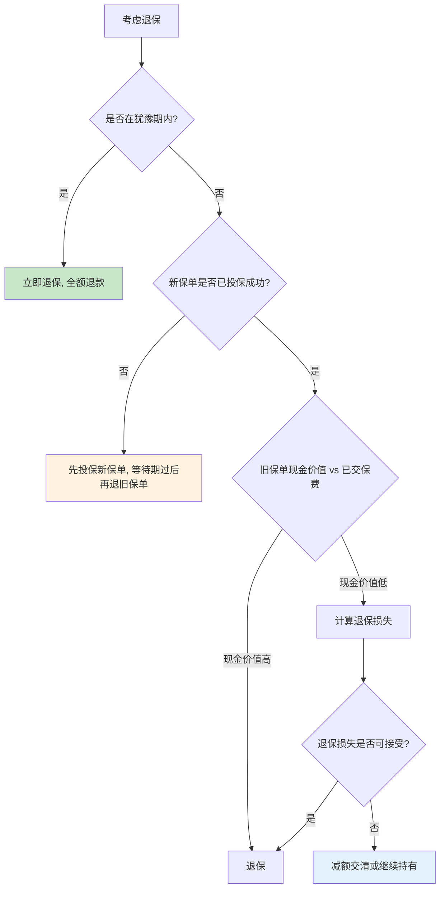
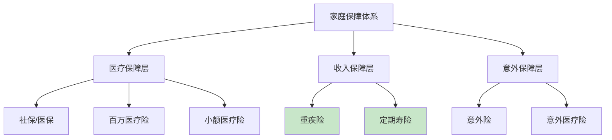
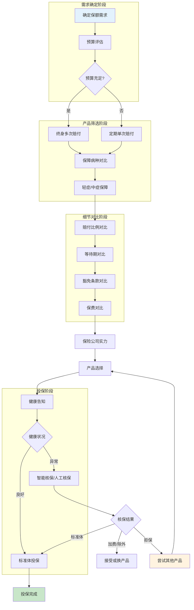

## 二、重疾险选购技巧

重疾险是家庭保障体系中最重要的险种之一。它以"确诊即赔"的给付方式，弥补了医疗险只能报销医疗费用的不足——重疾险赔付的保险金不限用途，可以覆盖治疗费用、收入损失、康复护理、房贷车贷等刚性支出。本节从重疾险的本质出发，系统讲解选购的完整方法论，帮助你在上百款产品中找到最适合自己的那一款。

### 2.1 重疾险的本质与价值

#### 2.1.1 重疾险的起源与设计初衷

重疾险（Critical Illness Insurance）由南非心脏外科医生马里尤斯·巴纳德（Marius Barnard）于1983年首创。他发现许多患者在经历重大手术后，虽然医学上存活，但因丧失劳动能力、无法支付康复费用而陷入经济困境。重疾险的设计初衷不是"治病"，而是"养病"——让患者在确诊后获得一笔现金，安心休养而不必为生计发愁。

理解这个本质非常重要：重疾险和医疗险是互补关系，不是替代关系。医疗险报销治疗费用，重疾险补偿收入损失和康复费用。二者缺一不可。

#### 2.1.2 为什么重疾险不可替代

重疾险的核心价值在于三个"不可替代"：

**给付方式不可替代**：重疾险是"给付型"而非"报销型"。确诊即赔一笔固定金额，不限用途。你可以用来支付医疗费、还房贷、请护工、甚至出国旅游放松心情。医疗险做不到这一点。

**收入补偿不可替代**：重大疾病患者平均康复期3-5年，期间收入大幅下降甚至归零。重疾险的保额设计应覆盖这段"收入真空期"。社保和医疗险都无法补偿收入损失。

**锁定保障不可替代**：重疾险投保时锁定费率和保障范围，不会因后续健康状况变化而被拒保或加费。随着年龄增长，健康状况下降，这种"锁定"价值越来越高。

#### 2.1.3 重疾发生率数据

中国保险行业协会发布的《重大疾病保险的疾病定义使用规范（2020年修订版）》数据显示：

| 年龄段 | 男性重疾发生率 | 女性重疾发生率 |
|--------|--------------|--------------|
| 0-17岁 | 0.06%-0.12% | 0.05%-0.10% |
| 18-30岁 | 0.08%-0.25% | 0.10%-0.35% |
| 31-40岁 | 0.25%-0.80% | 0.35%-1.20% |
| 41-50岁 | 0.80%-2.50% | 1.20%-3.00% |
| 51-60岁 | 2.50%-6.00% | 3.00%-5.50% |
| 61-70岁 | 6.00%-12.00% | 5.50%-9.00% |

关键洞察：女性在30-50岁期间重疾发生率明显高于男性，这与乳腺癌、甲状腺癌等高发疾病有关。男性在50岁后重疾发生率快速攀升，主要受肺癌、肝癌、心梗等疾病驱动。

### 2.2 重疾险产品分类体系

#### 2.2.1 按保障期限分类

**定期重疾险**：保障固定期限，常见保至60岁、70岁或80岁。优点是保费低，适合预算有限或阶段性保障需求。缺点是到期后保障终止，若此时已患病则无法再投保其他产品。

**终身重疾险**：保障终身，通常含身故责任（返还保额或已交保费）。优点是保障完整，不存在"裸奔期"。缺点是保费较高。

**选择建议**：预算充足选终身，预算有限选定期但至少保至70岁。如果选定期，务必在保障到期前（如60岁时）重新评估健康状况并补充终身保障。混合配置也是好方案——用定期重疾险做高保额基础，用终身重疾险做保底保障。

#### 2.2.2 按赔付次数分类

**单次赔付重疾险**：确诊重疾赔付一次后合同终止。优点是保费最低。缺点是赔付后保障归零，而此时已无法再投保。

**多次赔付重疾险**：确诊重疾赔付后合同继续有效，后续确诊其他重疾可再次赔付。分为两种：

- **分组多次赔付**：将重疾分为若干组（如A组恶性肿瘤、B组心脑血管、C组其他），每组只能赔一次。首次确诊A组疾病，后续只能赔B组或C组。
- **不分组多次赔付**：不限疾病分组，只要确诊的不是同一种重疾（或满足间隔期要求的同种重疾），均可再次赔付。

**对比分析**：

| 维度 | 单次赔付 | 分组多次赔付 | 不分组多次赔付 |
|------|---------|------------|--------------|
| 保费水平 | 低（基准） | 中（高20%-40%） | 高（高40%-80%） |
| 赔付灵活性 | 低 | 中 | 高 |
| 适合人群 | 预算有限 | 中等预算 | 充足预算 |
| 实际获赔概率 | 一次 | 二次（受分组限制） | 二次以上 |

**选择建议**：不分组多次赔付是当前最优形态，但保费较高。如果预算有限，单次赔付+高保额优于多次赔付+低保额。保额充足是第一优先级。

#### 2.2.3 按是否含身故责任分类

**含身故责任的重疾险**：如果被保险人身故（非重疾原因），赔付保额或已交保费。本质上是"重疾险+寿险"的组合。优点是"无论如何都能赔"。缺点是保费高30%-50%。

**不含身故责任的重疾险**（纯重疾险）：只保重疾，不保身故。保费低，但如果未确诊重疾就身故，不赔付。可以通过单独配置定期寿险来弥补身故保障缺口。

**选择建议**：如果预算充足且希望简化保单管理，选含身故责任的。如果追求性价比，纯重疾险+定期寿险的组合更划算，总保费通常更低且保额更高。

### 2.3 重疾险的核心选择标准

#### 2.3.1 保障病种分析

2020年修订后，所有重疾险必须包含中国保险行业协会规定的28种法定重大疾病。这28种疾病覆盖了实际理赔的95%以上，具体包括：

| 疾病类别 | 包含病种数 | 代表疾病 |
|---------|----------|---------|
| 恶性肿瘤类 | 1种 | 恶性肿瘤-重度 |
| 心脑血管类 | 6种 | 较重急性心肌梗死、严重脑中风后遗症等 |
| 器官功能类 | 8种 | 重大器官移植术、终末期肾病等 |
| 神经系统类 | 5种 | 严重阿尔茨海默病、严重帕金森病等 |
| 其他 | 8种 | 严重慢性肝功能衰竭、重型再生障碍性贫血等 |

**关键结论**：病种数量不是越多越好。从50种增加到100种，理赔概率提升微乎其微（因为新增的都是罕见病）。真正应该关注的是高发轻症/中症是否覆盖完整。

**高发轻症/中症清单**（选购时务必确认包含）：

| 疾病 | 重要性 | 说明 |
|------|--------|------|
| 恶性肿瘤-轻度 | ★★★★★ | 不含原位癌的产品直接排除 |
| 较轻急性心肌梗死 | ★★★★★ | 心梗早期阶段，理赔频率高 |
| 轻度脑中风后遗症 | ★★★★★ | 脑中风早期阶段 |
| 冠状动脉介入手术 | ★★★★★ | 心脏支架手术，极其常见 |
| 不典型心肌梗死 | ★★★★☆ | 心梗的非典型表现 |
| 微创冠状动脉搭桥术 | ★★★★☆ | 心脏搭桥的微创形式 |
| 慢性肾功能障碍 | ★★★★☆ | 肾病早期 |
| 视力严重受损 | ★★★☆☆ | 眼部疾病保障 |

如果一款重疾险缺少上述前5项中的任何一项，不建议购买。

#### 2.3.2 赔付比例分析

**轻症赔付比例**：目前市场主流为基本保额的20%-30%。30%是优秀标准，20%是及格线。部分产品首次轻症赔付30%，后续降至20%，选购时关注每次赔付比例是否一致。

**中症赔付比例**：主流为基本保额的40%-60%。中症概念是近年新增的，介于轻症和重疾之间，赔付比例更高但疾病严重程度低于重疾。

**重疾赔付比例**：基本保额的100%。部分产品有"额外赔付"条款，如60岁前确诊重疾额外赔付80%保额，这相当于用较低的保费获得了更高的保障。

**特定疾病额外赔付**：部分产品针对特定高发疾病（如恶性肿瘤、心脑血管疾病）提供额外赔付，通常为基本保额的100%-120%。这是非常有价值的保障，因为这些疾病占理赔的70%以上。

#### 2.3.3 等待期分析

等待期是指投保后到保障正式生效之间的"观察期"。等待期内确诊重疾/轻症/中症，保险公司不赔付。

| 等待期 | 常见产品 | 优劣 |
|--------|---------|------|
| 90天 | 优质产品 | 最短，保障更快生效 |
| 180天 | 普通产品 | 较长，保障生效慢 |

**选择建议**：同等条件下，90天等待期优于180天。对于续保产品，通常无等待期。注意：意外导致的重疾通常不受等待期限制。

#### 2.3.4 豁免条款分析

豁免条款是重疾险中极其重要的条款，它决定了在特定情况下是否需要继续缴纳保费。

**被保人豁免**：被保险人确诊轻症/中症/重疾后，豁免后续应交保费，保障继续有效。这是当前重疾险的标配，如果没有这一条直接排除该产品。

**投保人豁免**：投保人确诊轻症/中症/重疾/身故/全残后，豁免后续应交保费。适用于夫妻互保、父母为子女投保等场景。通常需要额外付费附加，费率约为基本保费的5%-15%。

**选择建议**：被保人豁免是必备项。投保人豁免建议附加，特别是夫妻互保场景——如果一方患病，两份保单的后续保费都可以豁免，极大减轻家庭经济压力。

### 2.4 重疾险保额计算方法

保额是重疾险选购的第一优先级。保额不足，其他所有保障都是空谈。

#### 2.4.1 方法一：收入倍数法（快速估算）

```text
保额 = 年收入 × 3-5倍
```

适用于快速估算。年收入20万的人，保额建议60-100万。这个方法简单但不够精确，没有考虑家庭负债、康复费用等个性化因素。

#### 2.4.2 方法二：支出需求法（推荐）

```text
保额 = 治疗费用 + 收入损失 + 康复费用 + 其他刚性支出
```

各项目参考标准：

| 支出项目 | 计算方式 | 参考金额 |
|---------|---------|---------|
| 治疗费用 | 重疾平均治疗费用 | 30-50万（含社保报销后自费部分） |
| 收入损失 | 年收入 × 3-5年 | 因人而异 |
| 康复费用 | 护理费+营养费+复查费 | 10-20万/年 |
| 刚性支出 | 房贷+车贷+子女教育+赡养费 | 因家庭而异 |

**示例**：35岁男性，年收入30万，房贷余额100万，子女2人（分别5岁和8岁），父母赡养费5万/年。

```text
保额 = 40万（治疗） + 30万×4年（收入损失） + 15万×3年（康复） + 100万（房贷） + 5万×3年（赡养）
     = 40 + 120 + 45 + 100 + 15
     = 320万
```

这个数字看起来很高，但它是理论上的"完全覆盖"保额。实际配置时可以分步实现：先用定期重疾险覆盖100-150万基础保额，后续逐步补充。

#### 2.4.3 方法三：负债覆盖法（底线思维）

```text
保额 = 家庭负债总额 + 3年家庭基本生活费
```

这是保额的"底线"——低于这个数字，一旦患病家庭将面临债务违约风险。

**选择建议**：用方法二计算理想保额，用方法三确认底线保额，根据预算在两者之间选择实际投保保额。宁可选定期高保额，不要选终身低保额。

### 2.5 不同人群的选购策略

#### 2.5.1 按年龄段选购

**0-17岁（少儿）**：

少儿重疾险的核心是覆盖少儿高发疾病。重点关注白血病（占少儿重疾理赔的30%以上）、严重川崎病、重症手足口病、严重幼年型类风湿性关节炎等。少儿重疾险保费极低（0岁投保50万保额终身重疾险，年交保费约2000-4000元），建议尽早投保。注意：未成年人身故赔付受监管限制（10岁以下不超过20万，10-17岁不超过50万），因此少儿重疾险不必包含过高身故责任。

**18-30岁（青年）**：

这个阶段保费最低、核保最容易，是投保重疾险的黄金窗口。建议选择终身多次赔付重疾险，保额至少50万。如果预算有限，可以先用定期重疾险（保至70岁）锁定高保额，后续经济改善后再补充终身保障。

**31-40岁（中青年）**：

这个阶段通常面临房贷、育儿等刚性支出，是家庭经济支柱期。保额要覆盖家庭负债+子女成年前的生活费用。建议终身重疾险+定期寿险组合，保额100万起步。此时投保，30岁男性50万保额终身重疾险年交保费约6000-10000元，尚在可承受范围。

**41-50岁（中年）**：

保费显著上升，核保难度增加（体检异常率高）。建议尽早投保，不要等到体检发现问题后再考虑。如果已有基础保障，可以考虑加保特定疾病（如心脑血管）保障。50岁以上投保重疾险可能出现保费倒挂（总交保费>保额），此时应考虑防癌险替代。

**51岁以上（中老年）**：

重疾险保费极高甚至无法投保。建议转向防癌险（健康告知宽松，三高人群也可投保）+ 百万医疗险的组合。如果之前已有重疾险保障，此时应检查保额是否充足，必要时用防癌险补充。

#### 2.5.2 按性别选购

**女性专属关注点**：

- 女性在30-50岁期间重疾发生率高于男性，尤其乳腺癌、甲状腺癌、宫颈癌高发
- 关注产品是否包含女性特定疾病额外赔付（如乳腺癌、卵巢癌额外赔付）
- 妊娠期投保限制：怀孕28周以上通常无法投保，建议备孕期提前配置
- 部分产品对甲状腺癌有除外或降级条款，选购时仔细核对

**男性专属关注点**：

- 男性50岁后重疾发生率快速攀升，肺癌、肝癌、心梗高发
- 关注心脑血管疾病保障是否充足（急性心梗、脑中风、冠脉搭桥等）
- 男性平均寿命低于女性，终身重疾险的实际保障时间更长，性价比相对更高
- 吸烟人群保费可能上浮或被除外某些疾病，建议先戒烟再投保

#### 2.5.3 按职业类别选购

保险公司将职业分为1-6类，类别越高风险越大：

| 职业类别 | 代表职业 | 投保限制 |
|---------|---------|---------|
| 1类 | 办公室职员、教师 | 无限制 |
| 2类 | 外勤销售、轻度体力劳动 | 通常无限制 |
| 3-4类 | 司机、厨师、建筑工人 | 部分产品限制投保 |
| 5-6类 | 矿工、高空作业、潜水员 | 多数产品拒保 |

高危职业人群选购策略：优先选择职业限制宽松的产品，或通过团体保险（单位统一投保）获取保障。部分产品允许1-4类职业投保，5-6类职业需要专门的高危职业重疾险。

### 2.6 健康告知与核保策略

健康告知是重疾险投保中最关键也最容易出问题的环节。告知不实可能导致理赔被拒，告知过度可能导致无法投保。

#### 2.6.1 健康告知的基本原则

**有限告知原则**：中国大陆实行"有限告知"制度——保险公司问什么答什么，没问的不用主动告知。这与香港保险的"无限告知"制度不同。

**如实告知原则**：保险公司问到的问题必须如实回答，不能隐瞒。隐瞒投保可能在理赔时被查出，导致拒赔甚至解除合同。

**询问告知原则**：告知内容以保险公司健康告知问卷为准，不需要提供问卷以外的信息。

#### 2.6.2 常见健康异常的核保结果

| 健康异常 | 核保可能结果 | 应对策略 |
|---------|------------|---------|
| 甲状腺结节TI-RADS 1-2级 | 标准体或除外甲状腺癌 | 选择对甲状腺结节友好的产品 |
| 甲状腺结节TI-RADS 3级及以上 | 除外甲状腺癌 | 多家投保，选择核保最宽松的 |
| 乳腺结节BI-RADS 1-3级 | 标准体或除外乳腺癌 | 同上 |
| 乙肝病毒携带 | 标准体或加费 | 选择对乙肝携带者友好的产品 |
| 乙肝小三阳 | 加费或除外肝脏疾病 | 肝功能正常可尝试智能核保 |
| 乙肝大三阳 | 多数拒保 | 尝试防癌险替代 |
| 高血压（140/90以下） | 标准体 | 如实告知即可 |
| 高血压（140/90以上） | 加费或拒保 | 控制血压后再投保 |
| 血糖偏高（未达糖尿病） | 标准体或加费 | 提供复查报告 |
| 糖尿病 | 多数拒保 | 转投防癌险 |
| 脂肪肝（轻度） | 标准体 | 如实告知 |
| 脂肪肝（中重度） | 加费或除外 | 控制后再投保 |
| 抑郁症/焦虑症 | 多数拒保或除外精神疾病 | 选择对精神疾病友好的产品 |

#### 2.6.3 核保渠道选择

**智能核保**：在线回答健康问卷，系统即时给出核保结果。优点是快速、不留痕（部分产品智能核保不留记录，不影响后续投保）。缺点是灵活性有限，复杂情况无法处理。

**人工核保**：提交体检报告等材料，由核保人员审核。优点是可以处理复杂健康状况，有协商空间。缺点是耗时较长（通常5-15个工作日），且会留下核保记录。

**预核保**：在正式投保前，将健康资料发给保险公司或经纪人进行非正式评估。优点是不留正式记录，可以先试探核保结果。缺点是预核保结果不具约束力，正式投保时可能不同。

**核保策略**：

1. 先用智能核保快速筛选，找到对自身健康状况最友好的产品
2. 如果智能核保结果不理想，尝试人工核保
3. 多家同时投保，选择核保结果最优的
4. 如果所有公司都拒保，考虑防癌险或惠民保作为替代

#### 2.6.4 核保常见误区

**误区一：体检异常就不敢投保**。很多轻微异常（如轻度脂肪肝、小的甲状腺结节）不影响投保，不要自我"核保"而错失投保机会。

**误区二：隐瞒病史投保**。保险公司在理赔时会调查被保险人的就医记录、体检记录、社保记录等。隐瞒投保的风险极大，一旦查出不仅拒赔，还可能不退还保费。

**误区三：只试一家公司**。不同保险公司的核保标准差异很大。甲状腺结节在A公司可能被除外，在B公司可能标准体承保。务必多家尝试。

### 2.7 重疾险产品对比实操框架

#### 2.7.1 标准化对比清单

面对多款产品时，用以下清单逐项对比：

```markdown
## 产品对比表

### 基本信息
- 产品名称：____
- 保险公司：____
- 投保年龄：____
- 等待期：90天 / 180天

### 保障责任
- 重疾病种数：____种
- 赔付次数：单次 / 分组N次 / 不分组N次
- 首次重疾额外赔付：有(____%) / 无
- 轻症病种数：____种，赔付比例：____%
- 中症病种数：____种，赔付比例：____%
- 高发轻症覆盖：原位癌✓/✗ 心梗轻度✓/✗ 脑中风轻度✓/✗ 冠脉介入✓/✗
- 特定疾病额外赔付：有(____%) / 无
- 身故责任：返还保额 / 返还已交保费 / 无

### 豁免条款
- 被保人轻症豁免：✓ / ✗
- 被保人中症豁免：✓ / ✗
- 被保人重疾豁免：✓ / ✗
- 投保人豁免：可附加 / 不可附加

### 保费
- 保额：____万
- 缴费期：____年
- 年交保费：____元
- 总交保费：____元

### 附加价值
- 绿色就医通道：✓ / ✗
- 海外就医：✓ / ✗
- 保单贷款：✓ / ✗
```

#### 2.7.2 产品对比案例

以30岁男性、50万保额、终身保障、30年缴费为例，对比三款典型产品：

| 对比项 | 产品A（高性价比型） | 产品B（全面保障型） | 产品C（大品牌型） |
|--------|-------------------|-------------------|-----------------|
| 保险公司 | 中小寿险公司 | 中型寿险公司 | 大型寿险公司 |
| 等待期 | 90天 | 90天 | 180天 |
| 重疾赔付 | 不分组2次 | 不分组3次 | 分组3次 |
| 轻症赔付 | 30%×3次 | 30%×4次 | 20%×5次 |
| 中症赔付 | 50%×2次 | 60%×2次 | 无中症 |
| 60岁前额外 | 80% | 80% | 无 |
| 被保人豁免 | 全部 | 全部 | 仅重疾 |
| 年交保费 | 5,800元 | 7,200元 | 9,500元 |
| 总交保费 | 174,000元 | 216,000元 | 285,000元 |

分析：产品A性价比最高，适合预算有限但追求高保额的人群。产品B保障最全面，适合中等预算追求全面保障的人群。产品C品牌溢价明显，适合看重品牌和服务的人群。对于大多数家庭，产品A或B是更理性的选择。

### 2.8 常见误区与避坑指南

#### 2.8.1 十大选购误区

**误区一：病种越多越好**。
真相：28种法定重疾覆盖95%以上理赔，从50种增加到120种，实际理赔率提升不到1%。不要为罕见病种支付溢价。

**误区二：只看保费不看保障**。
真相：便宜的产品可能在轻症覆盖、赔付比例、豁免条款等方面有重大缺陷。保费低5%但少覆盖3种高发轻症，得不偿失。

**误区三：返还型重疾险更划算**。
真相：返还型重疾险的"返还"本质上是你多交的保费+保险公司用这笔钱投资的收益。同样的保障，返还型比消费型贵50%-100%。用多交的保费自己做理财，收益通常高于保险公司"返还"的金额。

**误区四：给孩子买高额重疾险，大人不买**。
真相：大人是家庭的经济支柱，大人的保障优先级高于孩子。如果预算有限，应该先给大人配置充足的重疾险，再给孩子配置。大人患病对家庭经济的冲击远大于孩子患病。

**误区五：有了医疗险就不需要重疾险**。
真相：医疗险报销医疗费用，但无法补偿收入损失、康复费用、房贷车贷等刚性支出。百万医疗险是基础，重疾险是补充，二者缺一不可。

**误区六：年轻不需要重疾险**。
真相：年轻人保费最低、核保最容易，是投保的黄金窗口。等到四五十岁再投保，保费可能翻3-5倍，且体检异常率高、核保通过率低。

**误区七：重疾险可以"确诊即赔"所有疾病**。
真相：28种法定重疾中，只有恶性肿瘤是真正的确诊即赔。其他疾病（如脑中风后遗症、终末期肾病等）需要达到特定状态或实施特定手术才能理赔。选购时务必了解每种疾病的理赔条件。

**误区八：忽视等待期内的保障差异**。
真相：部分产品等待期内确诊轻症/中症不赔但合同继续有效，部分产品等待期内确诊轻症/中症直接终止合同。这两种情况差异巨大，务必确认。

**误区九：只看品牌不看条款**。
真相：大品牌不等于好产品。保险合同是法律文件，理赔时以合同条款为准，不以品牌大小为准。中小保险公司的产品在条款和费率上往往更有竞争力。

**误区十：一次投保管终身，不用再调整**。
真相：家庭收入、负债、成员结构会随时间变化，保障需求也会变化。建议每3-5年做一次保障检视，根据当前需求调整保额和险种配置。

#### 2.8.2 退保决策框架

如果已经购买了不理想的重疾险，是否退保需要慎重决策：



**减额交清**：如果不想继续缴费但也不想退保，可以选择"减额交清"——用保单的现金价值一次性交清后续保费，保额相应降低但保障继续有效。

### 2.9 重疾险与其他险种的搭配

#### 2.9.1 最优保障组合

重疾险不是孤立存在的，它需要与其他险种配合才能构建完整的保障体系：



**配置优先级**（预算有限时按此顺序配置）：

1. **社保/医保**：基础保障，必须有
2. **百万医疗险**：年交几百元，覆盖大额医疗费用
3. **意外险**：年交一两百元，覆盖意外伤残和身故
4. **定期寿险**：年交几百到一两千元，覆盖身故风险
5. **重疾险**：年交几千到上万元，覆盖收入损失和康复费用

#### 2.9.2 重疾险与医疗险的区别

| 维度 | 重疾险 | 百万医疗险 |
|------|--------|----------|
| 给付方式 | 确诊给付，不限用途 | 报销制，限医疗费用 |
| 保障范围 | 合同约定的疾病 | 住院+门诊的医疗费用 |
| 保障期限 | 终身（可选） | 1年（多数可续保） |
| 保费变化 | 投保时锁定，不随年龄变化 | 随年龄增长而上涨 |
| 保费水平 | 高（几千到上万/年） | 低（几百到一千/年） |
| 核保难度 | 高（健康告知严格） | 中（相对宽松） |
| 核心功能 | 补偿收入损失+康复费用 | 报销医疗费用 |

### 2.10 重疾险选购决策流程

综合以上所有知识点，以下是系统化的决策流程：



### 2.11 实战案例分析

#### 案例一：三口之家的重疾险配置

**家庭情况**：丈夫32岁，年收入25万；妻子30岁，年收入15万；女儿2岁。房贷余额80万，车贷余额10万。

**配置方案**：

| 家庭成员 | 险种 | 保额 | 保障期限 | 年交保费 |
|---------|------|------|---------|---------|
| 丈夫 | 终身重疾险（不分组2次） | 50万 | 终身 | 6,800元 |
| 丈夫 | 定期寿险 | 100万 | 保至60岁 | 1,200元 |
| 丈夫 | 百万医疗险 | 300万 | 1年 | 800元 |
| 丈夫 | 意外险 | 100万 | 1年 | 300元 |
| 妻子 | 终身重疾险（不分组2次） | 50万 | 终身 | 5,200元 |
| 妻子 | 定期寿险 | 80万 | 保至60岁 | 600元 |
| 妻子 | 百万医疗险 | 300万 | 1年 | 600元 |
| 妻子 | 意外险 | 100万 | 1年 | 300元 |
| 女儿 | 定期重疾险 | 50万 | 保至30岁 | 800元 |
| 女儿 | 小额医疗险 | 1万 | 1年 | 400元 |
| **合计** | | | | **17,000元/年** |

**分析**：总保费17,000元/年，占家庭年收入的4.25%（合理范围为5%-10%），保障覆盖了重疾、身故、医疗、意外四大风险。丈夫保额高于妻子，因为丈夫是主要经济支柱。女儿用定期重疾险（保费低），待其成年后自行配置终身保障。

#### 案例二：带病投保策略

**情况**：35岁女性，甲状腺结节TI-RADS 3级，乳腺结节BI-RADS 2级，希望投保50万终身重疾险。

**策略**：

1. 准备完整的体检报告（甲状腺超声、乳腺超声）
2. 同时申请3家保险公司的智能核保
3. A公司：除外甲状腺癌+乳腺癌，标准体承保
4. B公司：除外甲状腺癌，标准体承保
5. C公司：标准体承保（对甲状腺3级友好）
6. 最终选择C公司，以标准体承保，无需除外

**经验总结**：不同公司的核保标准差异很大，务必多家尝试。选择对自身健康状况最友好的产品。

### 2.12 重疾险选购检查清单

投保前用以下清单逐项确认：

```text
□ 保额是否充足（≥年收入3倍或≥50万）
□ 保障期限是否满足需求（终身或至少保至70岁）
□ 赔付次数是否合理（多次优于单次）
□ 28种法定重疾是否全部覆盖
□ 高发轻症是否覆盖（原位癌、轻度心梗、轻度脑中风、冠脉介入）
□ 轻症赔付比例是否≥30%
□ 中症赔付比例是否≥50%
□ 等待期是否为90天
□ 被保人豁免是否包含
□ 投保人豁免是否可附加
□ 健康告知是否如实填写
□ 保费是否在预算范围内（年交保费≤年收入10%）
□ 是否了解理赔流程和所需材料
□ 是否了解犹豫期（通常10-15天）和退保规则
□ 是否已告知受益人保单信息
```

### 2.13 进阶知识：重疾险的精算原理

了解重疾险的定价原理，有助于判断产品是否"物有所值"。

#### 2.13.1 保费构成

重疾险的保费由三部分组成：

- **纯保费**：用于赔付的部分，基于疾病发生率和死亡率计算
- **附加保费**：用于保险公司运营成本（管理费用、佣金、利润等）
- **储蓄保费**：用于积累现金价值（返还型产品有，消费型产品无）

消费型重疾险的保费结构更"纯粹"，大部分保费用于赔付保障。返还型重疾险的保费中包含大量储蓄成分，这部分钱交给保险公司投资，到期后"返还"给你，但收益率通常低于你自己做理财的收益。

#### 2.13.2 费率影响因素

影响重疾险费率的核心因素按影响程度排序：

1. **年龄**：年龄越大保费越高，且增长曲线呈指数型
2. **性别**：女性在30-50岁保费略高于男性，男性在50岁后保费显著高于女性
3. **保障期限**：终身比定期贵30%-60%
4. **赔付次数**：多次比单次贵20%-80%
5. **附加责任**：身故责任、特定疾病额外赔付等都会增加保费
6. **缴费期限**：缴费期越长，年交保费越低，但总交保费越高

#### 2.13.3 费率倒挂现象

当投保年龄较大（通常50岁以上）且选择终身缴费时，可能出现"费率倒挂"——总交保费超过保额。这意味着从纯经济角度看，不如把钱存银行。

**应对策略**：如果出现费率倒挂，应考虑用防癌险替代，或选择较短的缴费期限（如10年交），或降低保额至费率倒挂临界点以下。
