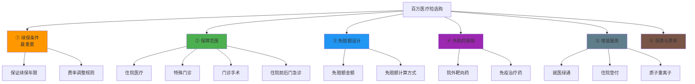
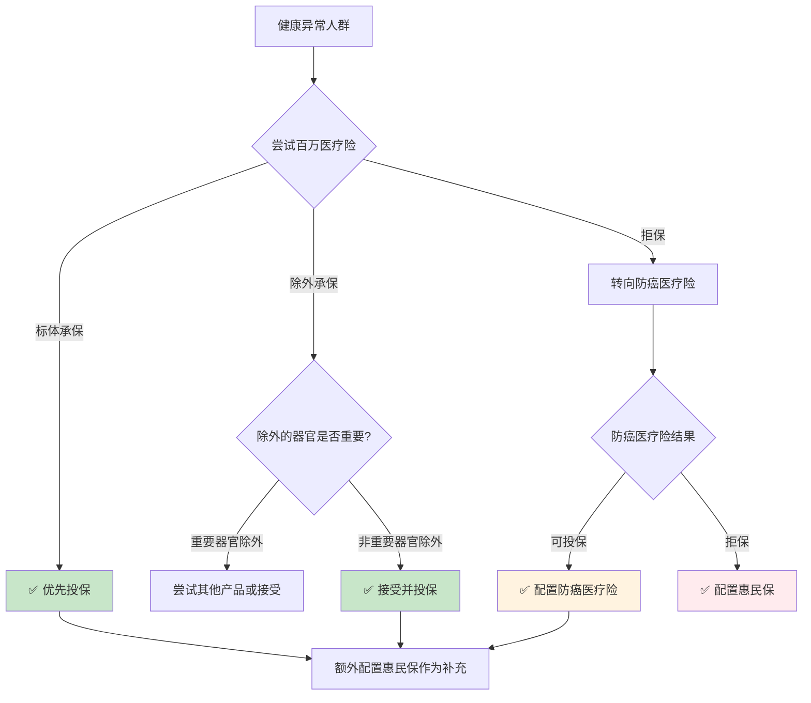
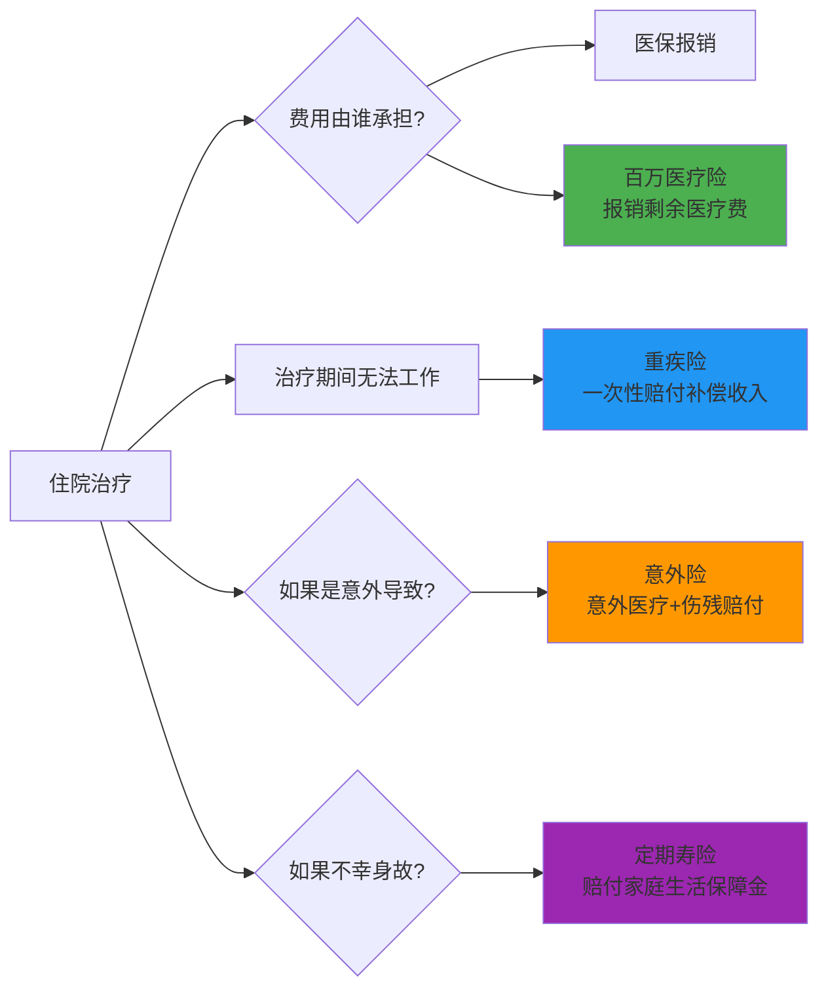

## 三、医疗险选购技巧

医疗险是四大基础险种中**使用频率最高**的一个。重疾险可能一辈子用不上，寿险只赔身故/全残，意外险只保意外事故，但医疗险——只要住院就可能触发报销。正因为医疗险是"最可能用到的保险"，选购时更需要精挑细选，因为理赔频率高意味着条款细节直接影响你的钱包。

本节将从医疗险的本质机制出发，手把手教你如何在上百款产品中选出最适合自己的那一款。

***

### 3.1 医疗险的本质：先搞懂它"保什么"

在开始选购之前，必须先理解医疗险的根本逻辑——**实报实销，补偿损失**。这与重疾险的"确诊即赔、定额给付"有本质区别。

#### 3.1.1 医疗险与重疾险的核心区别

| 对比维度 | 医疗险 | 重疾险 |
|----------|--------|--------|
| 赔付方式 | 凭发票报销，花多少报多少（扣除免赔额） | 确诊即赔约定保额，与实际花费无关 |
| 赔付上限 | 实际医疗费用（不超过保额） | 合同约定的固定金额 |
| 是否叠加 | 不可重复报销（多份医疗险不能重复赔同一笔费用） | 可叠加（多份重疾险各自独立赔付） |
| 使用频率 | 高（住院即可触发） | 低（需确诊约定重疾） |
| 核心作用 | 覆盖医疗费用 | 弥补收入损失、康复费用 |
| 保障期限 | 多为1年期（可续保） | 多为长期（保至70岁或终身） |

> 💡 **关键认知**：医疗险和重疾险不是"二选一"的关系，而是"缺一不可"的互补关系。医疗险解决"看病的钱"，重疾险解决"养病的钱"。以肺癌治疗为例，总费用48万，医保报销12万，剩余36万由百万医疗险承担；但治疗期间2年无法工作，收入损失约100万，这部分只有重疾险能覆盖。

#### 3.1.2 医疗险的报销逻辑

理解医疗险的报销计算方式，才能在选购时做出正确判断：

```text
实际报销金额 = (医疗总费用 - 医保已报销 - 免赔额) × 报销比例
```

用一个真实案例来说明（来源于案例六）：

周先生因肺腺癌住院，总费用48万：
- 医保报销：12万
- 自费部分：36万
- 百万医疗险报销：(36万 - 1万免赔额) × 100% = **35万**
- 周先生实际自付：仅1万元

这就是百万医疗险的价值——每年花几百元保费，换来几十万的医疗费用报销。

#### 3.1.3 医疗险的产品层级体系

医疗险并非只有"百万医疗险"一种，而是一个从基础到高端的完整体系：

| 产品层级 | 代表产品 | 年保费（30岁） | 保额 | 免赔额 | 覆盖医院 | 核心特点 |
|----------|----------|---------------|------|--------|----------|----------|
| 基础层 | 百万医疗险 | 200-400元 | 200-600万 | 1万 | 二级及以上公立医院普通部 | 住院报销，高杠杆 |
| 进阶层 | 中端医疗险 | 2000-5000元 | 100-300万 | 0 | 含公立医院特需/国际部 | 0免赔，可含门诊 |
| 高端层 | 高端医疗险 | 1-5万 | 不限 | 0 | 含私立医院、全球就医 | 直付结算，不限医院 |
| 特殊层 | 防癌医疗险 | 500-1000元 | 200-400万 | 0 | 二级及以上公立医院 | 仅保癌症，健康告知宽松 |
| 补充层 | 门诊险 | 500-1500元 | 1-3万 | 100-500元 | 指定医院 | 日常门诊报销 |
| 普惠层 | 惠民保 | 50-200元 | 100-300万 | 1-2万 | 医保定点医院 | 带病可投保，政府指导 |

**对于绝大多数普通家庭，百万医疗险是必选项**，其他层级根据预算和需求选配。

***

### 3.2 选购医疗险的六大核心维度

挑选百万医疗险时，需要从以下六个维度逐一评估。**重要性从高到低排列，排在前面的维度权重更大。**



#### 3.2.1 续保条件——医疗险的生命线

续保条件是百万医疗险**最最核心**的指标，没有之一。为什么？因为医疗险最大的风险不是"现在买不到"，而是"将来续不了"。

**三种续保模式详解：**

| 续保模式 | 说明 | 风险等级 | 代表条款 |
|----------|------|----------|----------|
| 保证续保（最优） | 在保证续保期间内，无论是否理赔、健康是否变化，保险公司必须让你续保 | 低 | "保证续保20年""保证续保6年" |
| 不因健康状况变化拒绝续保（中等） | 不因个人理赔/健康变化拒保，但产品停售则不能续保 | 中 | "续保时无需审核健康状况" |
| 每年审核续保（最差） | 每年续保时保险公司可以重新审核你的健康状况，甚至拒绝续保 | 高 | "续保需经保险公司审核同意" |

**保证续保年限的选择优先级：**

```text
20年保证续保 > 15年 > 10年 > 6年 > 1年期不保证续保
```

**必须警惕的"续保陷阱"：**

1. **"可续保至100岁" ≠ 保证续保**：这两个概念完全不同。"可续保"意味着产品停售就不能续了，保险公司也可以因整体赔付过高而停售产品；"保证续保"则是在保证期内无论如何都必须让你续。

2. **保证续保期满后的续保规则**：20年保证续保期满后怎么办？不同产品规定不同——有的需要重新审核健康状况（如果此时你已经理赔过或健康异常，可能无法续保），有的则允许继续续保但费率可能大幅上调。选购时务必确认这一点。

3. **费率可调的含义**：保证续保 ≠ 保费不变。在保证续保期间内，保险公司有权根据整体赔付率（不是针对个人）统一调整费率。但根据监管要求，费率调整必须经过审批，且涨幅有上限约束。

**实际判断方法：** 打开产品条款，搜索"续保"二字，逐字阅读相关条款。如果你看到"保证续保"四个字并且有明确的保证年限，这就是保证续保产品。如果你看到的是"我们不会因为被保险人的健康状况变化或使用保险情况而拒绝续保"但没有"保证续保"字样，这通常是非保证续保。

#### 3.2.2 保障范围——"保什么"决定了实际用处

百万医疗险的保障范围通常包含四大板块，缺一不可：

**板块一：住院医疗费用（核心保障）**

这是医疗险的基础，覆盖住院期间产生的各类费用：
- 床位费、护理费、膳食费
- 检查检验费（CT、MRI、血液检查等）
- 手术费、麻醉费
- 治疗费、药品费（含社保内和社保外）
- 重症监护室（ICU）费用

> ⚠️ **注意**：部分产品对"床位费"有每日限额（如500元/天或1500元/天），ICU费用动辄数千元一天，限额过低会导致自费部分增加。选购时关注床位费上限是否合理。

**板块二：特殊门诊费用**

特殊门诊指不需要住院但需要持续治疗的疾病，包括：
- 门诊肾透析（尿毒症患者每周需要2-3次透析，年费用约8-10万）
- 门诊恶性肿瘤治疗（化疗、放疗、靶向治疗、免疫治疗）
- 器官移植后的抗排异治疗（术后需终身服药，年费用数万元）

**板块三：门诊手术费用**

不需要住院的小型手术，如：
- 白内障手术（门诊即可完成）
- 皮肤肿物切除
- 胃肠息肉切除（无痛胃肠镜下操作）

**板块四：住院前后门急诊费用**

这一点容易被忽略但非常重要。很多疾病的诊断和后续复查都在门诊完成：
- 住院前：门诊检查确诊、办理入院手续
- 住院后：出院后门诊复查、换药、拆线

大部分产品覆盖"住院前7天 + 出院后30天"的门急诊费用，优秀产品覆盖"住院前30天 + 出院后30天"。

**保障范围的评估清单：**

| 保障项目 | 是否包含 | 好产品的标准 |
|----------|----------|------------|
| 住院医疗 | 必须包含 | 不限社保用药 |
| 特殊门诊 | 必须包含 | 透析、化疗、靶向治疗、免疫治疗均覆盖 |
| 门诊手术 | 必须包含 | 无特殊限制 |
| 住院前后门急诊 | 建议包含 | 住院前≥7天 + 出院后≥30天 |
| 门诊肾透析 | 必须包含 | 无限次 |
| 质子重离子治疗 | 加分项 | 单独保额≥100万，报销比例100% |

#### 3.2.3 免赔额设计——决定你实际能报销多少

免赔额是医疗险的"起付线"，低于这个金额的费用由自己承担。

**免赔额的本质：为什么要有免赔额？**

免赔额的作用是过滤小额理赔，降低保险公司的理赔管理成本，从而大幅降低保费。以30岁为例：
- 1万免赔额的百万医疗险：年保费约200-400元
- 0免赔额的百万医疗险：年保费约800-1500元

1万免赔额看起来"不友好"，但数据表明：**国内住院费用超过1万元的概率约为30%，超过5万元的概率约为5%，超过30万元的概率不到1%**。也就是说，百万医疗险的核心价值在于覆盖"小概率但高损失"的大额医疗费用。

**免赔额的三种设计模式：**

| 免赔额类型 | 说明 | 优劣势 |
|-----------|------|--------|
| 年度绝对免赔额 | 每个保单年度独立计算1万免赔额，多个住院分别扣除 | 最常见，简单明了 |
| 共享免赔额 | 家庭成员共享1万免赔额，全家累计超过1万即可 | 对家庭投保更友好 |
| 社保报销抵扣免赔额 | 社保报销的金额可以抵扣免赔额，社保报了1万以上则免赔额为0 | 大幅降低理赔门槛（少数产品提供） |

**免赔额的实操计算示例：**

> 场景：王先生一年内住院两次。第一次住院自费8000元，第二次住院自费3万元。
>
> **年度绝对免赔额计算：**
> - 第一次：自费8000元 < 免赔额1万，不予报销
> - 第二次：自费3万 - (1万 - 已扣8000) = 3万 - 2000 = 28000元可报销
> - 全年报销总额：28000元
>
> **如果是共享免赔额（家庭成员3人）：**
> - 第一人自费8000元 + 第二人自费5000元 = 13000元 > 共享免赔额1万
> - 第二人的费用中，3000元已超过共享免赔额，剩余2000元可报销
> - 后续所有家庭成员的费用都不再扣减免赔额

#### 3.2.4 外购药报销——决定生死的关键条款

**什么是外购药？**

外购药是指医生开具处方，但医院药房没有库存，需要患者自行到院外药店购买的药品。在重大疾病（尤其是癌症）治疗中，外购药的使用比例非常高：

| 药品类型 | 代表药物 | 年费用 | 医保能否报销 | 是否常需外购 |
|----------|----------|--------|------------|------------|
| 靶向药 | 奥希替尼（肺癌） | 15-20万 | 部分纳入医保但医院常缺货 | 高频 |
| 靶向药 | 曲妥珠单抗（乳腺癌） | 12-15万 | 部分纳入医保 | 高频 |
| 免疫治疗 | 帕博利珠单抗（PD-1） | 15-30万 | 部分适应症纳入医保 | 中频 |
| 免疫治疗 | 纳武利尤单抗（PD-1） | 15-25万 | 部分适应症纳入医保 | 中频 |
| 抗癌新药 | CAR-T疗法 | 120万/次 | 未纳入医保 | 必须外购 |

> ⚠️ **为什么外购药如此重要？** 以案例六中周先生为例，他使用的奥希替尼（靶向药）和PD-1抑制剂（免疫治疗）合计27.6万元，全部在院外购买，医保报销为0。如果他的百万医疗险不覆盖外购药，这27.6万就要自己承担。

**外购药报销的三种产品形态：**

| 形态 | 说明 | 评价 |
|------|------|------|
| 写入主险条款 | 外购药报销作为主险保障的一部分 | 最优，续保期内一定有保障 |
| 作为可选附加险 | 需要额外附加"外购药保障" | 中等，附加险可能单独停售 |
| 不含外购药保障 | 条款中未提及或明确不保外购药 | 不推荐，癌症治疗的核心费用无法覆盖 |

**检查方法：** 在产品条款或保险责任中搜索"院外购药""外购药""院外特药"等关键词。如果在主险条款中找到，说明包含外购药保障；如果是单独的附加险，需要注意该附加险的续保规则是否与主险一致。

#### 3.2.5 增值服务——锦上添花的实际体验

增值服务不是核心保障，但在实际就医过程中能显著改善体验：

| 增值服务 | 功能说明 | 实际价值 | 重要程度 |
|----------|----------|----------|----------|
| 就医绿通 | 协助预约专家门诊、安排住院床位、安排手术 | 在医疗资源紧张时价值巨大，如肿瘤科专家号普通渠道很难挂到 | ⭐⭐⭐ |
| 住院垫付 | 住院期间保险公司先垫付医疗费用，出院后结算 | 避免"先筹钱再看病"的困境，大额住院时尤为重要 | ⭐⭐⭐ |
| 质子重离子 | 覆盖质子重离子治疗费用（目前最先进的放疗技术） | 单次治疗费用约30万，医保不覆盖，有此保障可多一个治疗选择 | ⭐⭐ |
| 二次诊疗意见 | 提供国内外权威专家的第二诊疗意见 | 疑难杂症时避免误诊，重大疾病治疗方案的决策参考 | ⭐⭐ |
| 在线问诊 | 提供7×24小时在线医生咨询 | 小病不用跑医院，日常健康咨询方便 | ⭐ |
| 海外就医 | 协助安排海外就医、翻译陪同 | 部分罕见病或新疗法海外更先进，但费用高昂 | ⭐ |

**增值服务的注意事项：**
- 增值服务通常不写入保险合同，保险公司有权随时调整或取消
- 不要因为增值服务好就忽略核心保障（续保条件、保障范围、外购药才是根本）
- 部分增值服务有使用门槛（如住院垫付需要提前申请、就医绿通每年限次数）

#### 3.2.6 保费与费率——性价比的最终判断

百万医疗险的保费受以下因素影响：

| 影响因素 | 影响方式 | 说明 |
|----------|----------|------|
| 年龄 | 最主要因素 | 30岁约200-400元/年，50岁约800-1500元/年，60岁约1500-3000元/年 |
| 有无社保 | 有社保保费更低 | 有社保比无社保便宜30-50% |
| 保证续保年限 | 年限越长保费略高 | 20年保证续保比6年保证续保贵10-20% |
| 保障范围 | 范围越广保费越高 | 含外购药、质子重离子的产品略贵 |
| 免赔额 | 免赔额越低保费越高 | 0免赔比1万免赔贵2-4倍 |

**保费对比的正确方法：**

不要只看"首年保费"，要看"长期持有成本"。以下是一个对比示例（30岁男性，有社保）：

| 产品 | 首年保费 | 30-40岁累计保费 | 30-60岁累计保费 | 保证续保年限 | 综合评价 |
|------|----------|---------------|---------------|------------|----------|
| 产品A | 268元/年 | 约3200元 | 约25000元 | 20年 | 性价比高，长期稳定 |
| 产品B | 198元/年 | 约2400元 | 约20000元 | 6年 | 便宜但续保期短 |
| 产品C | 388元/年 | 约4600元 | 约35000元 | 20年 | 贵但保障全面 |

> 💡 **选购建议**：在保证续保年限和核心保障（外购药等）相当的前提下，选择保费适中的产品。最便宜的不一定最好（可能保障有缺失），最贵的也不一定最好（可能增值服务溢价高但你用不到）。

***

### 3.3 不同人群的医疗险选购策略

医疗险不是"一款产品打天下"，不同人群面临不同的健康状况和预算约束，需要差异化策略。

#### 3.3.1 健康标准体（无既往病史）

**推荐方案：百万医疗险（保证续保20年）**

健康标准体的选择范围最广，应优先锁定保证续保年限最长的产品。具体选购步骤：

1. **筛选保证续保20年的产品**（当前市场最优续保条件）
2. **确认含外购药保障**（写入主险条款为佳）
3. **对比免赔额和报销比例**（1万免赔+100%报销是标配）
4. **确认增值服务**（就医绿通+住院垫付为必备项）
5. **对比保费**（同条件下选适中价位）

#### 3.3.2 常见健康异常人群

健康异常是投保百万医疗险最大的障碍。不同异常的核保难度不同：

| 健康异常 | 核保难度 | 投保策略 | 推荐方向 |
|----------|----------|----------|----------|
| 甲状腺结节（1-2级） | 低 | 多数产品可标准体承保或除外甲状腺疾病 | 优先选智能核保可标体的产品 |
| 乳腺结节（1-2级） | 低 | 多数可除外乳腺疾病承保 | 优先选智能核保可标体的产品 |
| 乙肝病毒携带 | 中 | 部分产品可除外肝脏疾病承保 | 尝试多款产品的智能核保 |
| 乙肝小三阳 | 中-高 | 多数除外肝脏疾病，少数可标体 | 同时尝试百万医疗+防癌医疗 |
| 乙肝大三阳 | 高 | 百万医疗险多数拒保 | 防癌医疗险 + 惠民保 |
| 高血压（1级） | 低-中 | 部分产品可标体或加费承保 | 优先尝试对高血压友好的产品 |
| 高血压（2级及以上） | 高 | 百万医疗险多数拒保 | 防癌医疗险 + 惠民保 |
| 糖尿病（2型） | 高 | 百万医疗险几乎全部拒保 | 防癌医疗险 + 惠民保 + 糖尿病专属医疗险 |
| 甲状腺癌术后 | 极高 | 百万医疗险基本拒保 | 惠民保 + 甲状腺癌复发险 |
| 肺结节（<6mm） | 中 | 部分产品可除外肺部疾病承保 | 尝试智能核保，多家尝试 |

**健康异常人群的投保优先级：**



**实操技巧：善用智能核保**

智能核保是线上投保时的一套健康问卷系统，回答几个问题后立即给出核保结论（标准体/除外/加费/拒保）。智能核保的最大优势是：

1. **不留痕迹**：智能核保的"拒保"记录不会被其他保险公司看到（人工核保的拒保记录可能被共享）
2. **快速出结果**：几分钟内即可知道能否投保
3. **可以多家尝试**：同一时间尝试多款产品的智能核保，选择结论最好的一款投保

**投保顺序建议：** 先尝试百万医疗险的智能核保 → 被拒则尝试其他百万医疗产品 → 多家被拒则尝试防癌医疗险 → 同时配置惠民保作为兜底。

#### 3.3.3 60岁以上老年人

老年人投保百万医疗险面临两个难题：**保费高**和**健康异常多**。

| 年龄段 | 百万医疗险年保费 | 主要限制 |
|--------|-----------------|----------|
| 60-65岁 | 1500-3000元 | 多数产品最高投保年龄为65岁 |
| 65-70岁 | 2500-4000元 | 可选产品大幅减少，健康告知严格 |
| 70-80岁 | 极少可选产品 | 基本只能选择防癌医疗险或惠民保 |

**老年人的推荐方案（按优先级）：**

1. **首选：百万医疗险**（如果年龄和健康状况允许）
2. **次选：防癌医疗险**（健康告知宽松，三高、糖尿病均可投保，保证续保通常为终身）
3. **兜底：惠民保**（无年龄限制、无健康告知限制，但报销比例和范围有限）
4. **补充：意外险**（老年人意外骨折风险高，意外险杠杆高且无健康告知要求）

#### 3.3.4 已有百万医疗险的升级策略

如果你已经有一份百万医疗险，但发现保障不够好（比如不含外购药、续保条件差），可以按以下步骤升级：

1. **不要先退旧保单**：新保单通常有30天等待期，退旧买新会出现保障空窗
2. **先投保新产品**：等待期过后确认新保单生效
3. **再退旧保单**：确保无缝衔接
4. **注意健康告知**：投保新产品时，以当时的健康状况如实告知（如果这两年有新的体检异常，需要一并告知）

***

### 3.4 百万医疗险的完整评估模板

在实际选购中，可以用以下模板对候选产品逐一打分：

**评估维度与权重：**

| 评估维度 | 权重 | 评分标准 |
|----------|------|----------|
| 续保条件 | 30% | 20年保证续保=100分，15年=85分，6年=70分，1年不保证=40分 |
| 外购药保障 | 20% | 写入主险=100分，附加险=70分，不保=0分 |
| 保障范围 | 15% | 四大板块全覆盖+住院前后30天=100分，仅住院=70分 |
| 免赔额 | 10% | 0免赔=100分，5000免赔=80分，1万免赔=60分（需配合保费评估） |
| 增值服务 | 10% | 绿通+垫付+质子重离子+二次诊疗=100分 |
| 保费 | 15% | 同年龄段低于市场均价10%=100分，持平=80分，高于10%=60分 |

**以市面上三款主流产品为例的对比评估（2024-2025年数据参考）：**

| 维度 | 产品A（20年续保型） | 产品B（6年续保型） | 产品C（20年续保加强型） |
|------|-------------------|-------------------|---------------------|
| 续保条件 | 20年保证续保 ✅ | 6年保证续保 | 20年保证续保 ✅ |
| 外购药 | 主险包含 ✅ | 附加险 | 主险包含 ✅ |
| 住院前后门急诊 | 前7后30天 | 前7后30天 | 前30后30天 ✅ |
| 免赔额 | 1万 | 1万 | 1万（可选5000） |
| 质子重离子 | 包含 ✅ | 不含 | 包含 ✅ |
| 就医绿通 | 包含 | 包含 | 包含 |
| 住院垫付 | 包含 | 不含 | 包含 ✅ |
| 30岁年保费（有社保） | 约260元 | 约190元 | 约350元 |
| 综合推荐 | ⭐⭐⭐⭐ 性价比之选 | ⭐⭐⭐ 适合过渡 | ⭐⭐⭐⭐⭐ 全面保障 |

> 💡 **注意**：以上产品信息仅为对比框架示例，具体产品名称、保费和条款以投保时的实际产品页面为准。市场上的百万医疗险产品迭代很快，建议通过正规保险经纪平台（如慧择、蜗牛保险、深蓝保等）获取最新产品对比。

***

### 3.5 医疗险与其他险种的搭配方案

单独购买医疗险是不够的，医疗险需要与其他险种组合才能构建完整的保障体系。

#### 3.5.1 "四大金刚"基础搭配

对于普通家庭，最基础的保障组合是：

| 险种 | 功能定位 | 30岁年保费参考 | 覆盖风险 |
|------|----------|---------------|----------|
| 百万医疗险 | 报销医疗费用 | 200-400元 | 住院医疗费用 |
| 重疾险 | 弥补收入损失 | 3000-6000元（50万保额） | 确诊重疾后的现金流 |
| 定期寿险 | 保障家庭责任 | 1000-1500元（100万保额） | 身故/全残后的家庭经济保障 |
| 意外险 | 覆盖意外风险 | 150-300元（100万保额） | 意外身故/伤残/医疗 |

**四者的关系：**



#### 3.5.2 不同预算下的搭配方案

| 预算等级 | 年预算 | 推荐搭配 | 核心保障 |
|----------|--------|----------|----------|
| 基础版 | 500元以内 | 百万医疗险 + 惠民保 | 至少保障大额医疗费用 |
| 标准版 | 3000-5000元 | 百万医疗险 + 意外险 + 定期寿险 | 覆盖医疗+意外+身故风险 |
| 进阶版 | 6000-10000元 | 百万医疗险 + 重疾险 + 意外险 + 定期寿险 | 四大金刚完整保障 |
| 全面版 | 10000-20000元 | 进阶版 + 中端医疗险 + 提高各险种保额 | 全方位高保额保障 |

***

### 3.6 投保实操：从选品到投保的完整流程

#### 3.6.1 投保前的准备工作

1. **整理健康状况**：收集近2年的体检报告、门诊病历、住院记录。列出所有异常项（如结节、息肉、血压偏高等），投保时如实告知
2. **确认社保状态**：有无社保直接影响保费和报销比例，务必先参加社保
3. **确定预算**：医疗险保费相对便宜，但要考虑与其他险种的预算分配

#### 3.6.2 投保渠道对比

| 渠道 | 优势 | 劣势 | 适合人群 |
|------|------|------|----------|
| 保险公司官网/APP | 直接对接保险公司 | 只能选择该公司的产品 | 已确定具体产品 |
| 保险经纪平台 | 多家产品对比，专业顾问服务 | 可能有销售倾向 | 需要专业建议的投保人 |
| 支付宝/微信 | 便捷，入口多 | 产品选择有限，咨询不便 | 对保险有一定了解的人 |
| 保险代理人 | 一对一服务 | 只能代理该公司产品 | 已有信任的代理人 |

#### 3.6.3 健康告知的正确做法

健康告知是投保过程中**最容易出错**的环节，也是导致理赔纠纷的首要原因。

**基本原则：问什么答什么，不问不答**

- 保险公司问"是否被诊断过高血压"，你有高血压就必须告知；没有就如实选"否"
- 保险公司没有问"是否经常熬夜"，你不需要主动告知
- 不要过度告知（把所有小毛病都列出来），也不要隐瞒告知

**常见健康告知的处理方法：**

| 情况 | 正确做法 |
|------|----------|
| 体检报告有"甲状腺结节TI-RADS 2级" | 如实告知，提交超声报告，多数产品可标体或除外承保 |
| 3年前因胃炎住过院 | 如实告知住院记录，提交出院小结，通常不影响承保 |
| 体检报告有"轻度脂肪肝" | 看健康告知是否问到"肝功能异常"，问了就告知，没问可不告知 |
| 5年前做过阑尾炎手术 | 如实告知手术史，术后恢复良好的阑尾炎不影响承保 |
| 目前正在服用降压药 | 必须告知，高血压用药情况是核保的重要依据 |

> ⚠️ **红线警告**：故意隐瞒重大健康异常（如已确诊的糖尿病、高血压、肿瘤等），保险公司有权在理赔时拒绝赔付并解除合同，且不退还保费。保险公司的调查能力远超你的想象——他们可以调取你的医保记录、医院就诊记录、体检机构数据。

#### 3.6.4 投保后的注意事项

1. **仔细阅读电子保单**：收到保单后，花30分钟通读一遍，重点关注保障责任、免责条款、续保条款
2. **记录保单信息**：将保单号、保障期限、续保日期记录在一个固定的地方，确保家人也知道
3. **保留健康告知记录**：截屏保存投保时的健康告知页面，作为未来维权的依据
4. **设置续保提醒**：在保单到期前30天设置提醒，避免忘记续保导致保障中断

***

### 3.7 医疗险选购的常见误区

#### 误区一：百万医疗险保额越高越好

**真相**：保额200万和保额600万的实际差别微乎其微。国内单次住院费用超过100万的情况极为罕见，绝大多数住院费用在50万以内。保额从200万升到600万，保费增加很少，但也不代表"更划算"——因为你的实际医疗费用不太可能达到这个数字。**续保条件和保障范围远比保额重要。**

#### 误区二：0免赔的百万医疗险比1万免赔的好

**真相**：0免赔意味着保费会贵2-4倍。1万免赔额过滤掉的是"小额高频"的理赔——这些费用对家庭财务的冲击很小，完全可以通过自付来承担。百万医疗险的核心价值是防范"大额低频"风险（如癌症治疗费48万），1万免赔额不影响这个核心价值。**除非你的预算非常充裕，否则1万免赔额是更理性的选择。**

#### 误区三：有了百万医疗险就不需要重疾险

**真相**：这是最常见也最危险的误区。百万医疗险只报销"医疗费用"，但重大疾病带来的损失远不止医疗费用：
- **收入损失**：治疗+康复期间2-5年无法工作
- **康复费用**：营养品、理疗、中医调理（医疗险不覆盖）
- **家庭开支**：房贷、车贷、孩子教育、日常生活不会因为你生病而暂停

重疾险一次性赔付的保额，正是用来覆盖这些"非医疗费用"的损失。

#### 误区四：医疗险可以多份叠加报销

**真相**：医疗险遵循**损失补偿原则**——你不能通过医疗险获利。如果你同时买了两份百万医疗险，第一份报销了全部自费费用后，第二份不会再报销同一笔费用。因此，**医疗险买一份足够，不需要重复购买**。把多余的保费预算用在重疾险或寿险上更合理。

#### 误区五：短期医疗险便宜就够了

**真相**：1年期不保证续保的医疗险看似便宜，但面临两个巨大风险：
1. **产品停售**：保险公司随时可以停售该产品，你就失去保障了
2. **健康变化**：如果在保障期内确诊了某种疾病并理赔过，产品停售后你可能因为健康异常而无法投保其他产品

这就是为什么"保证续保"是最重要的选购指标——它确保你在最需要保障的时候（已经生过病）不会被抛弃。

#### 误区六：惠民保可以替代百万医疗险

**真相**：惠民保是政府指导的普惠型保险，门槛低、保费便宜，但在保障深度上远不及百万医疗险：

| 对比维度 | 惠民保 | 百万医疗险 |
|----------|--------|-----------|
| 投保门槛 | 极低（几乎无限制） | 有健康告知要求 |
| 免赔额 | 通常1-2万 | 通常1万 |
| 报销比例 | 50-80% | 100%（社保报销后） |
| 社保外用药 | 通常不保或有限保 | 不限社保用药 |
| 保额 | 100-300万 | 200-600万 |
| 续保稳定性 | 年度产品，可能停售 | 保证续保6-20年 |

**建议**：惠民保适合无法投保百万医疗险的人群（如高龄、严重既往病），能投保百万医疗险的人群应以百万医疗险为主，惠民保作为补充。

***

### 3.8 进阶内容：医疗险的底层逻辑

#### 3.8.1 医疗险的定价机制

理解保险公司的定价逻辑，能帮助你判断一款产品是否"可持续"：

```text
保费 = 纯保费（赔付成本） + 附加保费（运营成本 + 利润）
```

- **纯保费**：基于大数法则，根据承保人群的年龄、性别、疾病发生率计算
- **附加保费**：包括渠道费用（代理人佣金、平台手续费）、运营成本（人力、系统）、利润

**为什么年龄越大保费越贵？**

| 年龄段 | 住院率（每千人） | 平均住院费用 | 理赔概率 |
|--------|----------------|------------|----------|
| 20-30岁 | 约50-80人次 | 约1.5万 | 低 |
| 30-40岁 | 约80-120人次 | 约2万 | 中低 |
| 40-50岁 | 约120-200人次 | 约3万 | 中 |
| 50-60岁 | 约200-350人次 | 约4.5万 | 中高 |
| 60-70岁 | 约350-500人次 | 约6万 | 高 |
| 70岁以上 | 约500-800人次 | 约8万 | 极高 |

数据来源：国家卫健委住院服务统计（数据为近似参考值）。可以看到，60岁以上人群的住院率是20-30岁的6-10倍，平均住院费用也是4-5倍。这就是为什么老年人的百万医疗险保费是年轻人的5-10倍。

#### 3.8.2 保证续保产品的"费率调整"机制

保证续保产品在保证续保期间（如20年）内，保险公司不能拒绝你续保，但可以统一调整费率。费率调整的触发条件通常是：

1. **赔付率超过阈值**：如该产品的综合赔付率连续2年超过一定比例（如85%或100%）
2. **医疗通胀**：医疗费用整体上涨导致赔付成本增加
3. **监管审批**：费率调整方案需要提交监管部门审批

**对投保人的实际影响：**
- 保证续保期间内，你的保费可能会上涨，但不会因为个人理赔而单独涨价
- 费率调整是针对同一产品所有投保人的统一调整
- 历史数据显示，百万医疗险的费率调整幅度通常在10-30%之间，不会出现暴涨

#### 3.8.3 DRG/DIP改革对百万医疗险的影响

近年来，国家推行DRG（按疾病诊断相关分组付费）和DIP（按病种分值付费）改革，这对百万医疗险产生了深远影响：

**什么是DRG/DIP？**
简单来说，就是医保对医院的付费方式从"按项目付费"（做了什么检查就付什么钱）变为"按病种付费"（治一个阑尾炎就给固定的费用，不管你做了多少检查）。

**对百万医疗险的影响：**

| 影响方面 | 具体表现 | 对投保人的启示 |
|----------|----------|------------|
| 社保内费用压缩 | 医院倾向于使用更经济的治疗方案 | 社保报销比例可能不变，但总费用降低 |
| 社保外费用增加 | 部分检查和药品可能被推向院外 | 外购药保障变得更加重要 |
| 住院天数缩短 | 医院倾向于缩短住院时间 | 门诊手术和特殊门诊的保障更重要 |
| 高端治疗选择受限 | 公立医院可能减少使用高价进口药和新技术 | 质子重离子、外购药保障价值提升 |

> 💡 **核心结论**：DRG/DIP改革使得百万医疗险中的"外购药保障""门诊手术保障""质子重离子治疗"变得更加重要。在选购时，应将这些保障的覆盖程度作为关键评估维度。

***

### 3.9 医疗险选购的决策清单

在最终决定投保前，用以下清单逐项确认：

- [ ] **续保条件**：是否为保证续保？保证续保年限是多少年？
- [ ] **外购药保障**：是否包含外购药报销？写在主险还是附加险？
- [ ] **保障范围**：是否覆盖住院+特殊门诊+门诊手术+住院前后门急诊？
- [ ] **免赔额**：免赔额是多少？是否支持家庭共享免赔额？
- [ ] **报销比例**：社保报销后是否100%报销？未经社保报销的报销比例是多少？
- [ ] **质子重离子**：是否包含质子重离子治疗？保额多少？
- [ ] **增值服务**：是否包含就医绿通和住院垫付？
- [ ] **健康告知**：自己的健康状况是否能通过该产品的健康告知？
- [ ] **保费**：年保费是否在预算范围内？有无社保是否影响保费？
- [ ] **投保渠道**：通过正规渠道投保，保留投保凭证和健康告知记录

以上10项全部确认通过后，即可放心投保。如果其中有2项以上不满足，建议换一款产品重新评估。

***

> 💡 **本节核心要点回顾**：医疗险选购的第一要务是"续保条件"，其次是"外购药保障"和"保障范围"。对于健康标准体，优先选择保证续保20年、含外购药保障的百万医疗险；对于健康异常人群，善用智能核保多家尝试，同时配置防癌医疗险或惠民保作为兜底。医疗险与重疾险是互补关系，不可相互替代。
